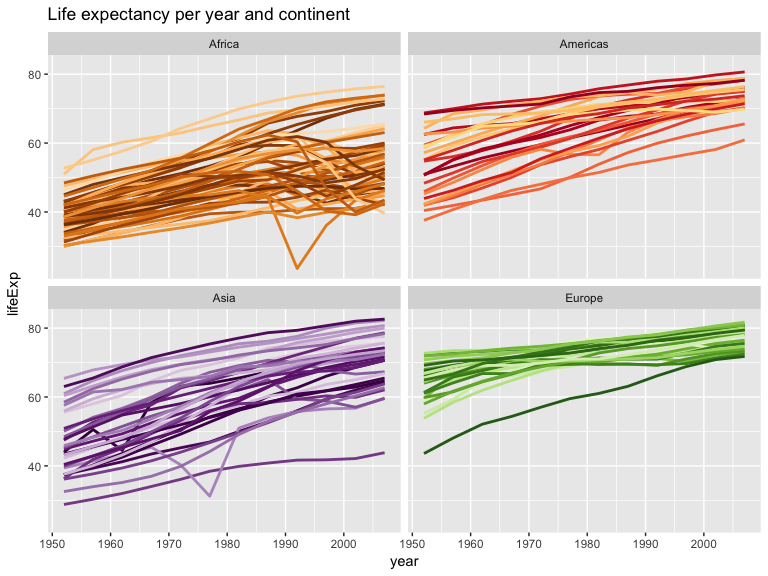
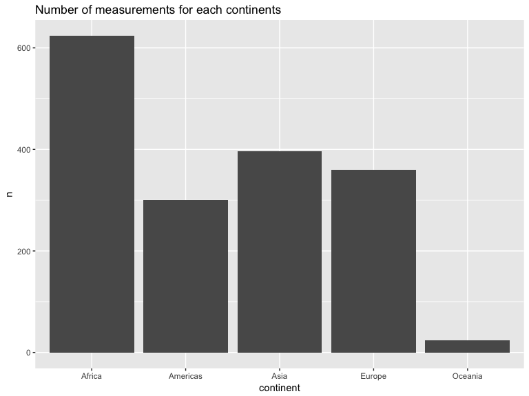
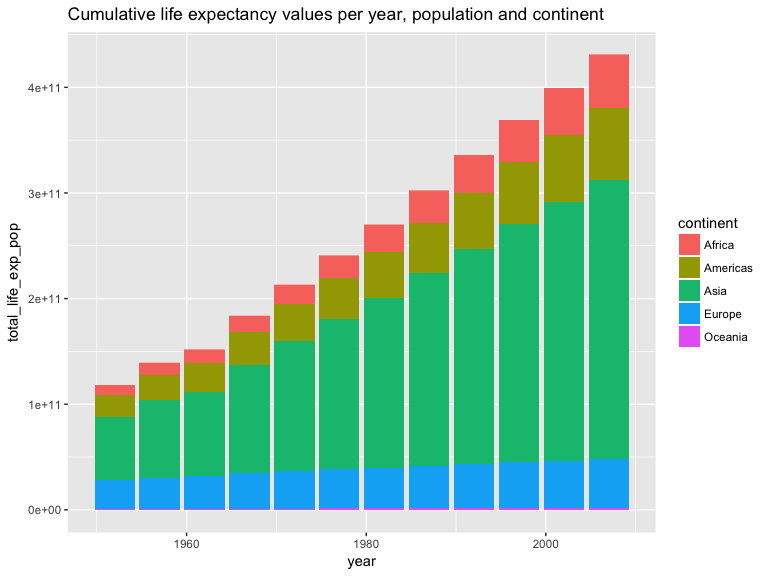
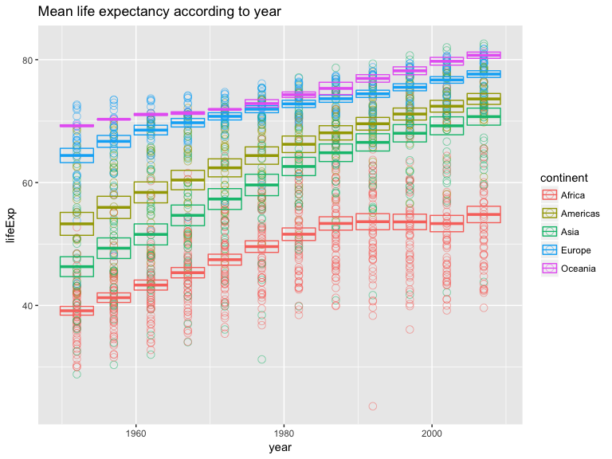
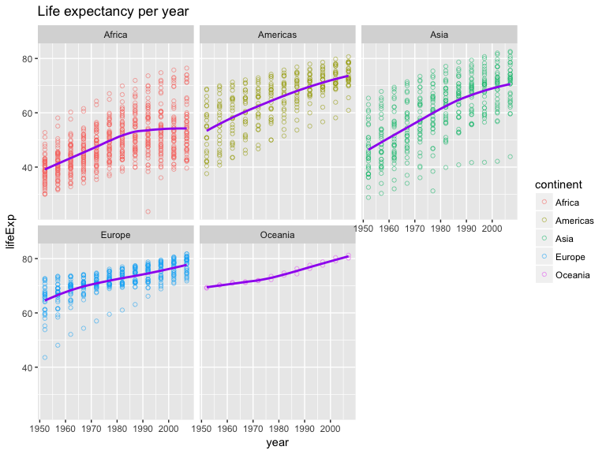
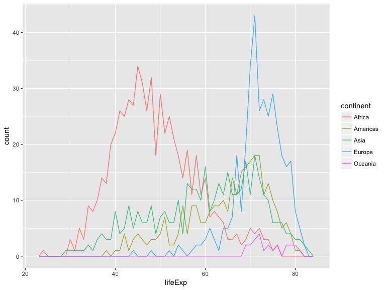
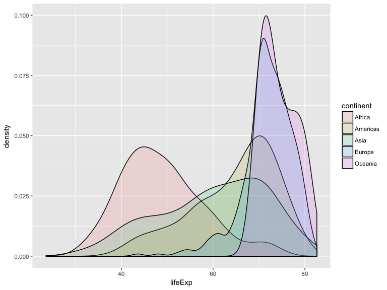

gapminder-exploration-phase2
================
My Linh Thibodeau
2017-09-22

``` r
suppressPackageStartupMessages(library(tidyverse))  # The tidyverse contains ggplot2!
suppressPackageStartupMessages(library(gapminder))
knitr::opts_chunk$set(fig.width=8, fig.height=6)
```

Smell test of data
------------------

Here are some ways to explore some characteristics of the gapminder dataset.

Using the following functions, I have been able to determine some of the gapminder dataset characteristics.

``` r
class(gapminder)
```

    ## [1] "tbl_df"     "tbl"        "data.frame"

``` r
typeof(gapminder)
```

    ## [1] "list"

``` r
str(gapminder)
```

    ## Classes 'tbl_df', 'tbl' and 'data.frame':    1704 obs. of  6 variables:
    ##  $ country  : Factor w/ 142 levels "Afghanistan",..: 1 1 1 1 1 1 1 1 1 1 ...
    ##  $ continent: Factor w/ 5 levels "Africa","Americas",..: 3 3 3 3 3 3 3 3 3 3 ...
    ##  $ year     : int  1952 1957 1962 1967 1972 1977 1982 1987 1992 1997 ...
    ##  $ lifeExp  : num  28.8 30.3 32 34 36.1 ...
    ##  $ pop      : int  8425333 9240934 10267083 11537966 13079460 14880372 12881816 13867957 16317921 22227415 ...
    ##  $ gdpPercap: num  779 821 853 836 740 ...

I found the Help documentation very useful to understand better the concept of an object in R coding.

``` r
?class
?tbl_df
?tbl
?data.frame
?typeof
?str
```

Therefore, I now understand that gapminder is a tibble. It seems like using tibbles over classic data.frame() has several advantages, like avoiding problems such as accidental conversion of string as factor. I read this interesting [wiki page](http://www.sthda.com/english/wiki/tibble-data-format-in-r-best-and-modern-way-to-work-with-your-data) on the topic.

The gapminder data set has 3 classes
*tbl\_df
*tbl
\*data.frame

**I found class() to be the most informative function for me**
It revealed the specific data type of each variable!
*country : Factor
*continent: Factor
*year : int
*lifeExp : num
*pop : int
*gdpPercap : num

The class function told me that there were 6 variables (columns) and 1704 observations (rows) in gapminder dataset, but I could also use these:

``` r
ncol(gapminder)
```

    ## [1] 6

``` r
nrow(gapminder)
```

    ## [1] 1704

Here are some other useful functions to learn more about the dataset. If you have a specific question about the dataset, you can use more specific functions as well, like dim() which provides the dimension of the data tibble.

``` r
dim(gapminder)
```

    ## [1] 1704    6

Explore individual variables
----------------------------

> To ensure I address all the requirements of this assignment, I have decided to include the STAT545 homework 2 questions above my answers in bold.

*Q? What are possible values (or range, whichever is appropriate) of each variable?*
I have used the summary() function to know the possible values and range of each variable.

``` r
overview <- summary(gapminder)
overview
```

    ##         country        continent        year         lifeExp     
    ##  Afghanistan:  12   Africa  :624   Min.   :1952   Min.   :23.60  
    ##  Albania    :  12   Americas:300   1st Qu.:1966   1st Qu.:48.20  
    ##  Algeria    :  12   Asia    :396   Median :1980   Median :60.71  
    ##  Angola     :  12   Europe  :360   Mean   :1980   Mean   :59.47  
    ##  Argentina  :  12   Oceania : 24   3rd Qu.:1993   3rd Qu.:70.85  
    ##  Australia  :  12                  Max.   :2007   Max.   :82.60  
    ##  (Other)    :1632                                                
    ##       pop              gdpPercap       
    ##  Min.   :6.001e+04   Min.   :   241.2  
    ##  1st Qu.:2.794e+06   1st Qu.:  1202.1  
    ##  Median :7.024e+06   Median :  3531.8  
    ##  Mean   :2.960e+07   Mean   :  7215.3  
    ##  3rd Qu.:1.959e+07   3rd Qu.:  9325.5  
    ##  Max.   :1.319e+09   Max.   :113523.1  
    ## 

**Or the prettier version with knitr::kable**

``` r
knitr::kable(overview, 
             format = "pandoc", 
             digits = 2,
             caption = "Summary Stats - Gapminder dataset",
             align = c("l"),
             longtable = TRUE,
             padding = 5)
```

|     |     country     |   continent  |     year     |    lifeExp    |        pop        |    gdpPercap    |
|-----|:---------------:|:------------:|:------------:|:-------------:|:-----------------:|:---------------:|
|     | Afghanistan: 12 |  Africa :624 |  Min. :1952  |  Min. :23.60  |  Min. :6.001e+04  |   Min. : 241.2  |
|     |   Albania : 12  | Americas:300 | 1st Qu.:1966 | 1st Qu.:48.20 | 1st Qu.:2.794e+06 | 1st Qu.: 1202.1 |
|     |   Algeria : 12  |   Asia :396  | Median :1980 | Median :60.71 | Median :7.024e+06 | Median : 3531.8 |
|     |   Angola : 12   |  Europe :360 |  Mean :1980  |  Mean :59.47  |  Mean :2.960e+07  |  Mean : 7215.3  |
|     |  Argentina : 12 | Oceania : 24 | 3rd Qu.:1993 | 3rd Qu.:70.85 | 3rd Qu.:1.959e+07 | 3rd Qu.: 9325.5 |
|     |  Australia : 12 |      NA      |  Max. :2007  |  Max. :82.60  |  Max. :1.319e+09  |  Max. :113523.1 |
|     |  (Other) :1632  |      NA      |      NA      |       NA      |         NA        |        NA       |

Another way is to use individual functions to obtain the information. Below, these functions respectively informs on the minimum value, maximum value, range of value (minimum and maximum) and all possible distinct values of specific columns.

``` r
min(gapminder$lifeExp)
```

    ## [1] 23.599

``` r
max(gapminder$lifeExp)
```

    ## [1] 82.603

``` r
range(gapminder$gdpPercap)
```

    ## [1]    241.1659 113523.1329

``` r
distinct(gapminder, country)
```

    ## # A tibble: 142 x 1
    ##        country
    ##         <fctr>
    ##  1 Afghanistan
    ##  2     Albania
    ##  3     Algeria
    ##  4      Angola
    ##  5   Argentina
    ##  6   Australia
    ##  7     Austria
    ##  8     Bahrain
    ##  9  Bangladesh
    ## 10     Belgium
    ## # ... with 132 more rows

I also found this [website](https://info201-s17.github.io/book/introduction-to-data-frames.html) useful.

*Q? What values are typical? What’s the spread? What’s the distribution? Etc., tailored to the variable at hand.Feel free to use summary stats, tables, figures. We’re NOT expecting high production value (yet).*

If we group data according to their column, another useful function is summarise() to get some statistics on a variable, but data needs to be grouped before doing so. For example, if we group by continent, we can use the function to know the mean year of entry, lifeExp, pop and gdpPercap for each continent.

``` r
gapminder %>%
  group_by(continent) %>%
  summarise_if(is.numeric, mean, na.rm=TRUE)
```

    ## # A tibble: 5 x 5
    ##   continent   year  lifeExp      pop gdpPercap
    ##      <fctr>  <dbl>    <dbl>    <dbl>     <dbl>
    ## 1    Africa 1979.5 48.86533  9916003  2193.755
    ## 2  Americas 1979.5 64.65874 24504795  7136.110
    ## 3      Asia 1979.5 60.06490 77038722  7902.150
    ## 4    Europe 1979.5 71.90369 17169765 14469.476
    ## 5   Oceania 1979.5 74.32621  8874672 18621.609

Again, I find that the most useful function is summary(), as it provides the range (minimum, maximum), and summary statistics such as 1st quartile, mean and 3rd quartile (see above for data).

``` r
gapminder %>% 
  group_by(country) %>% 
  summarise_if(is.numeric, median)
```

    ## # A tibble: 142 x 5
    ##        country   year lifeExp        pop  gdpPercap
    ##         <fctr>  <dbl>   <dbl>      <dbl>      <dbl>
    ##  1 Afghanistan 1979.5 39.1460 13473708.5   803.4832
    ##  2     Albania 1979.5 69.6750  2644572.5  3253.2384
    ##  3     Algeria 1979.5 59.6910 18593278.5  4853.8559
    ##  4      Angola 1979.5 39.6945  6589529.5  3264.6288
    ##  5   Argentina 1979.5 69.2115 28162601.0  9068.7844
    ##  6   Australia 1979.5 74.1150 14629150.0 18905.6034
    ##  7     Austria 1979.5 72.6750  7571521.5 20673.2530
    ##  8     Bahrain 1979.5 67.3225   337688.5 18779.8016
    ##  9  Bangladesh 1979.5 48.4660 86751356.0   703.7638
    ## 10     Belgium 1979.5 73.3650  9839051.5 20048.9102
    ## # ... with 132 more rows

Explore various plot types
--------------------------

*NOTE: The main resource used is the [stat545 github repository of Jenny Bryan](https://github.com/jennybc/ggplot2-tutorial/blob/master/gapminder-ggplot2-univariate-quantitative.md)*

#### POINT PLOTS

Now, I will explore diverse plot types.

Let's start with a basic data point plot of the life expectancy relative to the year of assesment for each country.

``` r
p <- gapminder %>%
  group_by(country) %>%
  ggplot(aes(x=year, y=lifeExp))
p + geom_point() + labs(title = "Life expectancy per year")
```


Overall, it seems that life expectancy has improved with years for the majority of countries, but I wonder what are the outliers at the bottom of the plot.

Let us see what is the minimum life expectancy for each year to find out.

``` r
t <- gapminder %>%
  group_by(country, year, lifeExp, pop, gdpPercap) %>%
  summarise_if(is.numeric, min) %>%
  arrange(lifeExp)
t
```

    ## # A tibble: 1,704 x 5
    ## # Groups:   country, year, lifeExp, pop [1,704]
    ##         country  year lifeExp     pop gdpPercap
    ##          <fctr> <int>   <dbl>   <int>     <dbl>
    ##  1       Rwanda  1992  23.599 7290203  737.0686
    ##  2  Afghanistan  1952  28.801 8425333  779.4453
    ##  3       Gambia  1952  30.000  284320  485.2307
    ##  4       Angola  1952  30.015 4232095 3520.6103
    ##  5 Sierra Leone  1952  30.331 2143249  879.7877
    ##  6  Afghanistan  1957  30.332 9240934  820.8530
    ##  7     Cambodia  1977  31.220 6978607  524.9722
    ##  8   Mozambique  1952  31.286 6446316  468.5260
    ##  9 Sierra Leone  1957  31.570 2295678 1004.4844
    ## 10 Burkina Faso  1952  31.975 4469979  543.2552
    ## # ... with 1,694 more rows

The lowest life expectancy recorder in the gapminder dataset is 23.5999 years in Rwanda in 1992, which corresponds to the tragedy of the Rwandan genocide.

Another way to find this outlier was thought to me by a student of STAT545 (thanks Alistair Barton!):

``` r
outlier_lifeExp <- filter(gapminder, lifeExp == min(lifeExp))
View(outlier_lifeExp)
```

------------------------------------------------------------------------

Let us carry on in our analysis. Of course, one may suspect there will be a relationship between the lifeExp and gdpPercap variables, so let's plot these.

``` r
p1 <- gapminder %>%
  group_by(country) %>%
  ggplot(aes(x=gdpPercap, y=lifeExp))+
  labs(title = "Life expectancy according to gdp per capita")
p1 + geom_point()
```


However, since I am still wondering if the size of the population has an effect on the life expectancy, I will plot the size of each dots according to the population, and I would also like to see if some continents segregate from each other, so I will use colours for this. I will also use some transparencies in order to see the dots when they layer on top of each other.

``` r
p1 + geom_point(aes(size=pop, colour = continent), alpha=0.25)
```


A log scale would be useful to see the lower values better. This ressembles the exercise we completed in class last time, so let me switch up the variables a little to population and life expectancy, so that we don't feel like doing the same thing. I will plot the size of the dot as a function of the gdpPerCap this time and add the geom\_smooth() line with a generalized additive model (gam).

``` r
p2 <- ggplot(gapminder, aes(x=log10(pop), y=lifeExp)) +
  geom_point(aes(colour=continent, size=gdpPercap), alpha=0.25) +
  labs(title = "Life expectancy according to gdp per capita") +
  scale_x_log10() +
  geom_smooth(aes(colour = continent), lwd=2, se=FALSE)
p2
```

    ## `geom_smooth()` using method = 'loess'


We can immediately take note of obvious discrepancies when looking at this plot. For example, the red dots are at the lower part of the graph, telling us that countries of Africa have lower life expectancy, and the dots are smaller, revealing lower gdpPercap.

#### LINE PLOTS

Let's plot some lines tracking the life expectancy per year, but use the facet\_wrap() function to divide the data by continent into 4 plots (omitting Oceania, given very little data).

``` r
p3 <- ggplot(subset(gapminder, continent != "Oceania"), aes(x=year, y=lifeExp, group = country, color = country)) 
p3 + geom_line(lwd=1, show_guide = FALSE) +
  facet_wrap(~continent) +
  scale_color_manual(values = country_colors) +
  labs(title = "Life expectancy per year and continent")
```

    ## Warning: `show_guide` has been deprecated. Please use `show.legend`
    ## instead.

 This is very pretty, but I don't know if it is very informative since this plots in a stepwise fashion the data, which collapses the values at each measurement year into a vertical line. I still kept is, for interest.

\*I found the reference manual on the tidyverse [website](http://ggplot2.tidyverse.org/reference/) very useful.

#### BAR PLOTS

Let's go back to a plot of the life expectancy and gdp per capita to show a bar plot example.

``` r
my_gap <- gapminder
continent_freq <- gapminder %>% count(continent)
p4 <- continent_freq %>% 
  ggplot(aes(x=continent, y=n))
p4 + geom_bar(stat="identity", na.rm=TRUE) +
  labs(title = "Number of measurements for each continents")
```



> After doing the dataset manipulation exercises (see below), I decided to go back at my plots and change them for presenting more relevant information.

Here is an histogram of the "stacked up" life expectancies of all the countries (population x life expectancy) in each continent, plotted according to the year.

``` r
my_gap <- gapminder
my_gap_life <- my_gap %>%
  mutate(total_life_exp_pop = pop*lifeExp)
p5 <- my_gap_life %>%
  ggplot(aes(x=year, y=total_life_exp_pop)) 
p5 + geom_histogram(aes(fill = continent), stat="identity", na.rm=TRUE) +
  labs(title = "Cumulative life expectancy values per year, population and continent")
```

    ## Warning: Ignoring unknown parameters: binwidth, bins, pad



#### SUMMARY STATISTICS PLOTS

Here is a way to plot some summary statistics for each continent. Below, you can see the median life expectancy for each continent according to the year.

``` r
p6 <- gapminder %>%
  ggplot(aes(x=year, y=lifeExp)) 
p6 + stat_summary_bin(mapping = aes(group = continent, colour=continent), fun.y = "median", geom="line") + 
  labs(title = "Median life expectancy per continent")
```


You can do the same thing with other parameters, like below showing the mean in a b

``` r
p7 <- gapminder %>%
  ggplot(aes(x=year, y=lifeExp)) 
p7 + 
  geom_point(mapping = aes(colour = continent), alpha=0.5, size=3, shape=21)  +
  stat_summary(fun.data = "mean_se", mapping = aes(colour=continent), geom = "crossbar", na.rm=TRUE) +
  labs(title = "Mean life expectancy according to year")
```



This plot is a bit crowed, we should subdivide it by continent and add a linear regression function to it.

``` r
p8 <- gapminder %>%
  ggplot(aes(x=year, y=lifeExp)) +
  geom_point(mapping = aes(colour = continent), alpha=0.5, shape=21)
p8 + facet_wrap(~continent) + geom_smooth(se=FALSE, colour = "purple", lwd = 1, alpha = 0.8)+
  labs(title = "Life expectancy per year") 
```

    ## `geom_smooth()` using method = 'loess'



Or we can show the same plot and plot the mean life expectancy (and standard deviation) with geom\_boxplot() function:

``` r
p8 + facet_wrap(~continent) + geom_boxplot(aes(group=year), alpha=0.1) +
  labs(title = "Life expectancy per year") 
```


#### DISTRIBUTION PLOTS

Let us explore a histogram to see the life expectancy measures distribution according to the continent.

``` r
p9 <- gapminder %>%
  ggplot()
p9 + geom_histogram(binwidth = 1, alpha = 0.8, position = "identity", aes(x=lifeExp, fill = continent)) 
```


Now, let's use a frequency polygon to show the same information (but let's use a binwidth of 1 year).

``` r
p10 <- gapminder %>%
  ggplot()
p10 + geom_freqpoly(binwidth = 1, alpha = 0.8, position = "identity", aes(x=lifeExp, color = continent))
```



Now, let's look at a smoother plot, which geom\_density() can help with.

``` r
p11 <- gapminder %>%
  ggplot(aes(x = lifeExp, fill = continent))
p11 + geom_density(alpha=0.15)
```



Another option is the geom\_violin and geom\_violin functions, to present our data in the most readible way.

``` r
p12 <- gapminder %>%
  ggplot(aes(x=year, y =lifeExp, colour = continent))
p12 + geom_violin(aes(group=year)) +
  geom_jitter(alpha=0.3)
```


------------------------------------------------------------------------

Let's explore filter(), select() and piping (%&gt;%), and others
----------------------------------------------------------------

#### filter() exploration

Filter ther data to only keep information related to Ireland and France before 2000.

``` r
my_gap <- gapminder
my_trip <- my_gap %>%
  filter(country %in% c("Ireland", "France"), year<= 2000)
View(my_trip)
```

#### select() and arrange() exploration

Then we can retrieve specific columns using select, for example, the country, year, gdpPercap and lifeExp variables. Then we can arrange the data according to the gpdPercap for example.

``` r
my_gap %>%
  filter(country %in% c("Ireland", "France"), year<= 2000) %>%
  select(country, year, gdpPercap, lifeExp) %>%
  arrange(gdpPercap)
```

    ## # A tibble: 20 x 4
    ##    country  year gdpPercap lifeExp
    ##     <fctr> <int>     <dbl>   <dbl>
    ##  1 Ireland  1952  5210.280  66.910
    ##  2 Ireland  1957  5599.078  68.900
    ##  3 Ireland  1962  6631.597  70.290
    ##  4  France  1952  7029.809  67.410
    ##  5 Ireland  1967  7655.569  71.080
    ##  6  France  1957  8662.835  68.930
    ##  7 Ireland  1972  9530.773  71.280
    ##  8  France  1962 10560.486  70.510
    ##  9 Ireland  1977 11150.981  72.030
    ## 10 Ireland  1982 12618.321  73.100
    ## 11  France  1967 12999.918  71.550
    ## 12 Ireland  1987 13872.867  74.360
    ## 13  France  1972 16107.192  72.380
    ## 14 Ireland  1992 17558.816  75.467
    ## 15  France  1977 18292.635  73.830
    ## 16  France  1982 20293.897  74.890
    ## 17  France  1987 22066.442  76.340
    ## 18 Ireland  1997 24521.947  76.122
    ## 19  France  1992 24703.796  77.460
    ## 20  France  1997 25889.785  78.640

#### mutate() exploration

The cumulative gdp per country can be added to the my\_gap dataset using the mutate function.

``` r
my_gap %>%
  mutate(gdp = pop*gdpPercap)
```

    ## # A tibble: 1,704 x 7
    ##        country continent  year lifeExp      pop gdpPercap         gdp
    ##         <fctr>    <fctr> <int>   <dbl>    <int>     <dbl>       <dbl>
    ##  1 Afghanistan      Asia  1952  28.801  8425333  779.4453  6567086330
    ##  2 Afghanistan      Asia  1957  30.332  9240934  820.8530  7585448670
    ##  3 Afghanistan      Asia  1962  31.997 10267083  853.1007  8758855797
    ##  4 Afghanistan      Asia  1967  34.020 11537966  836.1971  9648014150
    ##  5 Afghanistan      Asia  1972  36.088 13079460  739.9811  9678553274
    ##  6 Afghanistan      Asia  1977  38.438 14880372  786.1134 11697659231
    ##  7 Afghanistan      Asia  1982  39.854 12881816  978.0114 12598563401
    ##  8 Afghanistan      Asia  1987  40.822 13867957  852.3959 11820990309
    ##  9 Afghanistan      Asia  1992  41.674 16317921  649.3414 10595901589
    ## 10 Afghanistan      Asia  1997  41.763 22227415  635.3414 14121995875
    ## # ... with 1,694 more rows

#### group\_by() and summarize() exploration

Considering only year 2000 and before, if we group by continent, year and country, we can use the summarize\_each() function to obtain the mean and median for the lifeExp and gdpPercap variables. Then, we can arrange according to the lifeExp\_mean variable to see which continents, years and countries had the lowest lifeExp\_mean values.

``` r
my_gap %>%
  filter(year <=2000) %>%
  group_by(continent, year, country) %>%
  summarize_each(funs(mean, median), lifeExp, gdpPercap) %>%
  arrange(lifeExp_mean)
```

    ## `summarise_each()` is deprecated.
    ## Use `summarise_all()`, `summarise_at()` or `summarise_if()` instead.
    ## To map `funs` over a selection of variables, use `summarise_at()`

    ## # A tibble: 1,420 x 7
    ## # Groups:   continent, year [50]
    ##    continent  year      country lifeExp_mean gdpPercap_mean lifeExp_median
    ##       <fctr> <int>       <fctr>        <dbl>          <dbl>          <dbl>
    ##  1    Africa  1992       Rwanda       23.599       737.0686         23.599
    ##  2      Asia  1952  Afghanistan       28.801       779.4453         28.801
    ##  3    Africa  1952       Gambia       30.000       485.2307         30.000
    ##  4    Africa  1952       Angola       30.015      3520.6103         30.015
    ##  5    Africa  1952 Sierra Leone       30.331       879.7877         30.331
    ##  6      Asia  1957  Afghanistan       30.332       820.8530         30.332
    ##  7      Asia  1977     Cambodia       31.220       524.9722         31.220
    ##  8    Africa  1952   Mozambique       31.286       468.5260         31.286
    ##  9    Africa  1957 Sierra Leone       31.570      1004.4844         31.570
    ## 10    Africa  1952 Burkina Faso       31.975       543.2552         31.975
    ## # ... with 1,410 more rows, and 1 more variables: gdpPercap_median <dbl>

Let us explore the outlier values of life expectancy in Europe. I have used this [stat545 tutorial](http://stat545.com/block010_dplyr-end-single-table.html) to learn more about these functions.

``` r
my_gap %>%
  filter(continent == "Europe") %>%
  select(year, country, lifeExp) %>%
  group_by(year) %>%
  filter(min_rank(desc(lifeExp)) <2 | min_rank(lifeExp) <2) %>%
  arrange(year, lifeExp) %>%
  print(n = Inf)
```

    ## # A tibble: 24 x 3
    ## # Groups:   year [12]
    ##     year     country lifeExp
    ##    <int>      <fctr>   <dbl>
    ##  1  1952      Turkey  43.585
    ##  2  1952      Norway  72.670
    ##  3  1957      Turkey  48.079
    ##  4  1957     Iceland  73.470
    ##  5  1962      Turkey  52.098
    ##  6  1962     Iceland  73.680
    ##  7  1967      Turkey  54.336
    ##  8  1967      Sweden  74.160
    ##  9  1972      Turkey  57.005
    ## 10  1972      Sweden  74.720
    ## 11  1977      Turkey  59.507
    ## 12  1977     Iceland  76.110
    ## 13  1982      Turkey  61.036
    ## 14  1982     Iceland  76.990
    ## 15  1987      Turkey  63.108
    ## 16  1987 Switzerland  77.410
    ## 17  1992      Turkey  66.146
    ## 18  1992     Iceland  78.770
    ## 19  1997      Turkey  68.835
    ## 20  1997      Sweden  79.390
    ## 21  2002      Turkey  70.845
    ## 22  2002 Switzerland  80.620
    ## 23  2007      Turkey  71.777
    ## 24  2007     Iceland  81.757

Let's re-initialize my European dataset and then perform some further analyses and may be even plotting. Let's start with looking at the worst European life expectancy every year.

``` r
rm(my_europe)
```

    ## Warning in rm(my_europe): object 'my_europe' not found

``` r
my_europe <- my_gap %>%
  filter(continent == "Europe") %>%
  select(year, country, lifeExp) %>%
  group_by(year) %>%
  top_n(1, wt=desc(lifeExp))
my_europe
```

    ## # A tibble: 12 x 3
    ## # Groups:   year [12]
    ##     year country lifeExp
    ##    <int>  <fctr>   <dbl>
    ##  1  1952  Turkey  43.585
    ##  2  1957  Turkey  48.079
    ##  3  1962  Turkey  52.098
    ##  4  1967  Turkey  54.336
    ##  5  1972  Turkey  57.005
    ##  6  1977  Turkey  59.507
    ##  7  1982  Turkey  61.036
    ##  8  1987  Turkey  63.108
    ##  9  1992  Turkey  66.146
    ## 10  1997  Turkey  68.835
    ## 11  2002  Turkey  70.845
    ## 12  2007  Turkey  71.777

Wow, Turkey has not been doing well for a long time ...

### Using the knitr library to make prettier tables

``` r
knitr::kable(head(gapminder), 
             format = "pandoc", 
             digits = 2,
             caption = "Gapminder (head)",
             align = c("l"),
             longtable = TRUE,
             padding = 3)
```

| country     | continent | year | lifeExp | pop      | gdpPercap |
|:------------|:----------|:-----|:--------|:---------|:----------|
| Afghanistan | Asia      | 1952 | 28.80   | 8425333  | 779.45    |
| Afghanistan | Asia      | 1957 | 30.33   | 9240934  | 820.85    |
| Afghanistan | Asia      | 1962 | 32.00   | 10267083 | 853.10    |
| Afghanistan | Asia      | 1967 | 34.02   | 11537966 | 836.20    |
| Afghanistan | Asia      | 1972 | 36.09   | 13079460 | 739.98    |
| Afghanistan | Asia      | 1977 | 38.44   | 14880372 | 786.11    |

> Oh, I just understood that you have to "knit" this document in order to see the nice table made with knitr::kable !

### I am planning to use knitr::kable function more in my future homework.

I have used this [pandoc website](http://pandoc.org/installing.html) as well to install some complementary packages.

I am looking forward to apply this newly gained knowledge to genomic data analyses such as gene expression, copy number, mutational signatures and pathway analysis.
--------------------------------------------------------------------------------------------------------------------------------------------------------------------

Now I feel like I have a better grasp on how to use these new tools.
====================================================================
