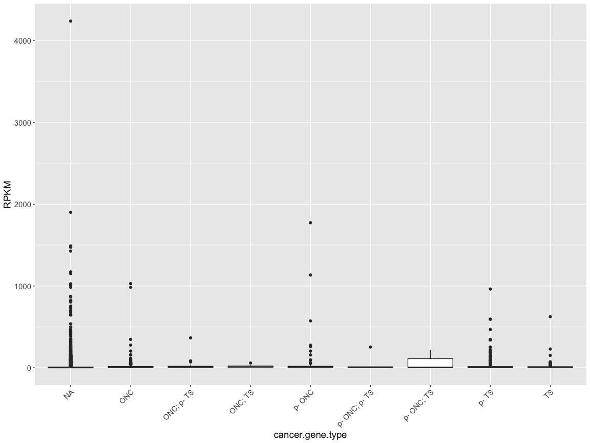
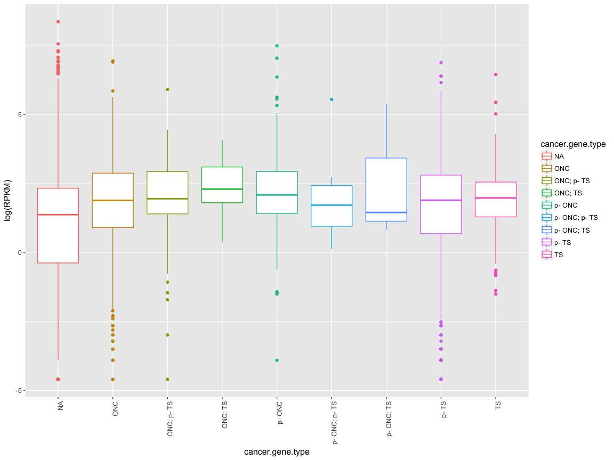
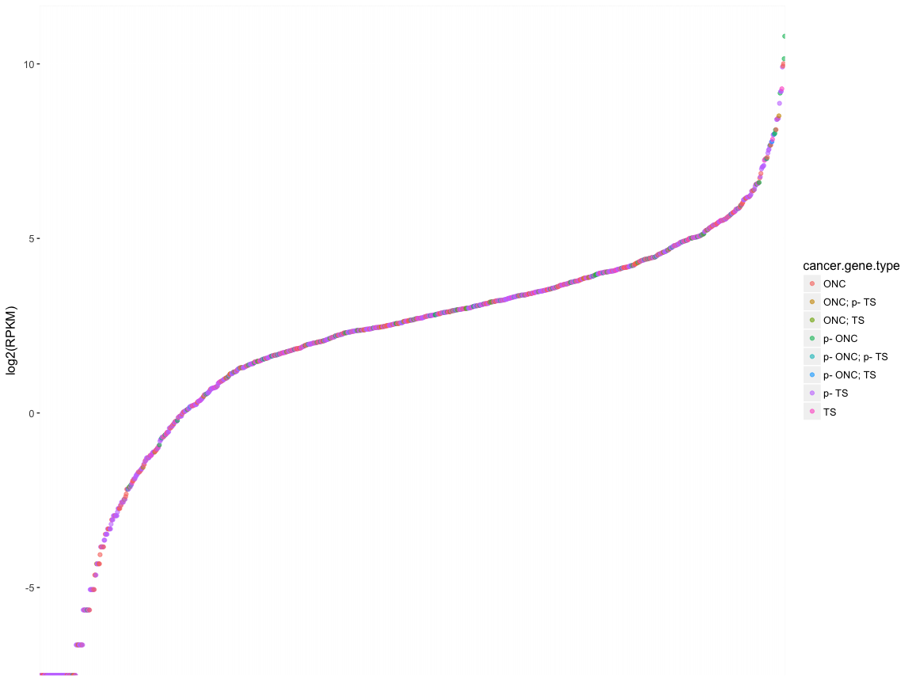
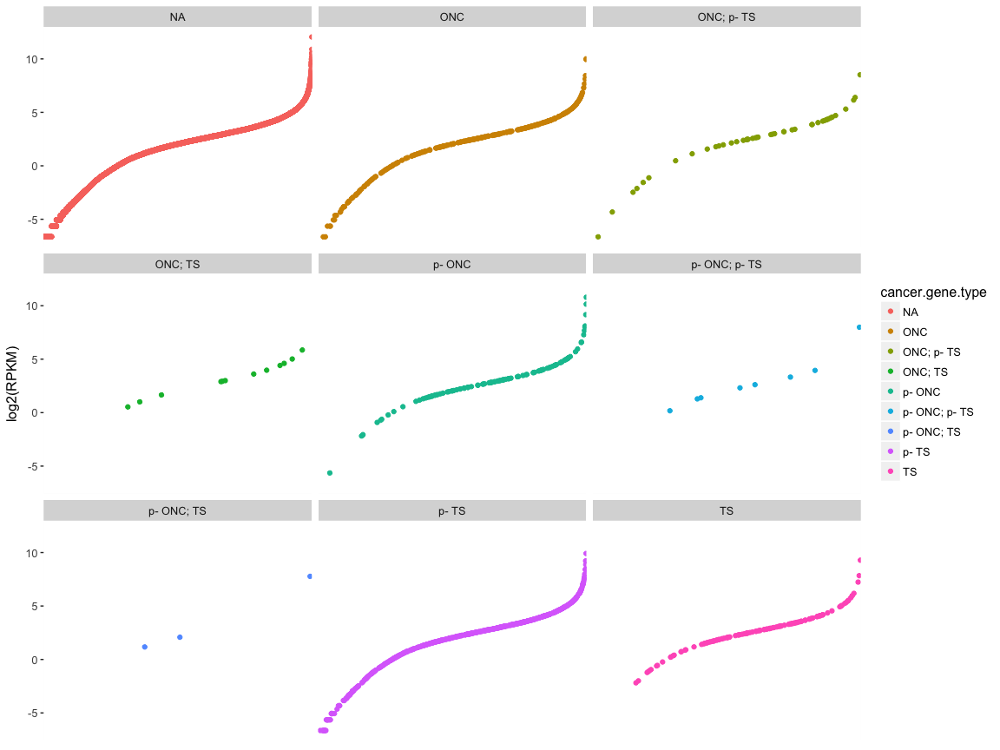

stat545-hw03-thibodeau-mylinh
================
My Linh Thibodeau
2017-09-22

``` r
suppressPackageStartupMessages(library(tidyverse))
```

    ## Warning: package 'dplyr' was built under R version 3.4.2

``` r
knitr::opts_chunk$set(fig.width=12, fig.height=9)
library(knitr)
library(kableExtra)
options(knitr.table.format = "html")
#install.packages("scales")
library(scales)
```

    ## 
    ## Attaching package: 'scales'

    ## The following object is masked from 'package:purrr':
    ## 
    ##     discard

    ## The following object is masked from 'package:readr':
    ## 
    ##     col_factor

> I have installed the package scale to ease annotation of my scales in my plots. [Here is a stackoverflow example](https://stackoverflow.com/questions/3695497/show-instead-of-counts-in-charts-of-categorical-variables).

Homework requirements - copied from [stat545 hw03 website](http://stat545.com/hw03_dplyr-and-more-ggplot2.html)
---------------------------------------------------------------------------------------------------------------

Pick at least three of the tasks below and attack each with a table and figure.

-   dplyr should be your data manipulation tool
-   ggplot2 should be your visualization tool

Make observations about what your tables/figures show and about the process.

------------------------------------------------------------------------

Genomic dataset - A few clarifications
======================================

Vincenzo Coia has approved my request to use published genomic data for the next assignments, therefore, I want to provide a few clarifications:

-   I have tried to introducte some basic explanations about the genomic dataset, but obviously, this is not a genetics course and my objective is to explore and learn how to use R and its packages, not to teach complex notions of cancer genomic analysis. Therefore, I don't expect everyone to understand what the data and plots represent if they haven't studied in related fields.
-   I would recommend you make abstraction of the underlying biological context and simply try to read this homework based on the variable types (e.g. copy.category is a categorical variable like "gain" or "loss") rather than what they represent.

------------------------------------------------------------------------

### SOURCE OF DATA - supplementary files of published article:

Thibodeau, M. L. et al. Genomic profiling of pelvic genital type leiomyosarcoma in a woman with a germline CHEK2:c.1100delC mutation and a concomitant diagnosis of metastatic invasive ductal breast carcinoma. Cold Spring Harb Mol Case Stud mcs.a001628 (2017). <doi:10.1101/mcs.a001628>
Open access article and data available [here](http://molecularcasestudies.cshlp.org/content/3/5/a001628.long)

------------------------------------------------------------------------

**Load the text file version of CHEK2 paper supplementary data on rna expression and copy number variant (cnv)**

``` r
rna_cnv <- read.table("/Users/mylinh/Desktop/chek2-data-trial-stat545/chek2-rna-expression-cnv-data.txt", sep="\t",  strip.white = TRUE, header = TRUE)
head(rna_cnv)
```

    ##   chr     start       end strand cytoband Ensembl.gene.ID     hugo
    ## 1   X  99883667  99894988     -1    q22.1 ENSG00000000003   TSPAN6
    ## 2   X  99839799  99854882      1    q22.1 ENSG00000000005     TNMD
    ## 3  20  49551404  49575092     -1   q13.13 ENSG00000000419     DPM1
    ## 4   1 169821804 169863408     -1    q24.2 ENSG00000000457    SCYL3
    ## 5   1 169631245 169823221      1    q24.2 ENSG00000000460 C1orf112
    ## 6   1  27938575  27961788     -1   p36.11 ENSG00000000938      FGR
    ##   copy.category copy.change avg.cna avg.cna.by.gene breakpoint
    ## 1          Gain           1    0.25            0.26          0
    ## 2          Gain           1    0.25            0.23          0
    ## 3       Neutral           0    0.02            0.07          0
    ## 4          Gain           1    0.23            0.28          0
    ## 5          Gain           1    0.23            0.24          0
    ## 6          Loss          -1   -0.21           -0.22          0
    ##   manually.curated.homd loh loh_ratio intepreted.expression.status  RPKM
    ## 1                     0 HET      0.62                              12.01
    ## 2                     0 HET      0.60                               2.99
    ## 3                     0 HET      0.55                              22.83
    ## 4                     0 HET      0.49                               4.33
    ## 5                     0 HET      0.49                               1.87
    ## 6                     0 HET      0.28                               4.86
    ##   SARC.percentile SARC.kIQR FC.mean.Bodymap avg.TCGA.percentile
    ## 1              65      0.38           -1.54                  25
    ## 2              90      4.52           -1.42                  99
    ## 3              40     -0.18           -1.19                  46
    ## 4              75      0.54            1.04                  49
    ## 5              30     -0.33            1.01                  37
    ## 6              86      1.58           -2.39                  74
    ##   avg.TCGA.kIQR avg.TCGA.norm.percentile avg.TCGA.norm.kIQR
    ## 1         -0.44                       20              -0.70
    ## 2         71.00                       92               6.56
    ## 3         -0.06                       71               0.44
    ## 4         -0.01                       50               0.00
    ## 5         -0.24                       90               1.42
    ## 6          0.63                       74               0.63
    ##   UCEC.norm.percentile UCEC.norm.kIQR cancer.gene.type
    ## 1                   21          -0.77                 
    ## 2                  100          27.13                 
    ## 3                   50           0.06                 
    ## 4                   58           0.27                 
    ## 5                   96           2.23                 
    ## 6                   46          -0.02

``` r
kable(sapply(rna_cnv, class))
```

<table>
<tbody>
<tr>
<td style="text-align:left;">
chr
</td>
<td style="text-align:left;">
factor
</td>
</tr>
<tr>
<td style="text-align:left;">
start
</td>
<td style="text-align:left;">
integer
</td>
</tr>
<tr>
<td style="text-align:left;">
end
</td>
<td style="text-align:left;">
integer
</td>
</tr>
<tr>
<td style="text-align:left;">
strand
</td>
<td style="text-align:left;">
integer
</td>
</tr>
<tr>
<td style="text-align:left;">
cytoband
</td>
<td style="text-align:left;">
factor
</td>
</tr>
<tr>
<td style="text-align:left;">
Ensembl.gene.ID
</td>
<td style="text-align:left;">
factor
</td>
</tr>
<tr>
<td style="text-align:left;">
hugo
</td>
<td style="text-align:left;">
factor
</td>
</tr>
<tr>
<td style="text-align:left;">
copy.category
</td>
<td style="text-align:left;">
factor
</td>
</tr>
<tr>
<td style="text-align:left;">
copy.change
</td>
<td style="text-align:left;">
integer
</td>
</tr>
<tr>
<td style="text-align:left;">
avg.cna
</td>
<td style="text-align:left;">
numeric
</td>
</tr>
<tr>
<td style="text-align:left;">
avg.cna.by.gene
</td>
<td style="text-align:left;">
numeric
</td>
</tr>
<tr>
<td style="text-align:left;">
breakpoint
</td>
<td style="text-align:left;">
integer
</td>
</tr>
<tr>
<td style="text-align:left;">
manually.curated.homd
</td>
<td style="text-align:left;">
integer
</td>
</tr>
<tr>
<td style="text-align:left;">
loh
</td>
<td style="text-align:left;">
factor
</td>
</tr>
<tr>
<td style="text-align:left;">
loh\_ratio
</td>
<td style="text-align:left;">
numeric
</td>
</tr>
<tr>
<td style="text-align:left;">
intepreted.expression.status
</td>
<td style="text-align:left;">
factor
</td>
</tr>
<tr>
<td style="text-align:left;">
RPKM
</td>
<td style="text-align:left;">
numeric
</td>
</tr>
<tr>
<td style="text-align:left;">
SARC.percentile
</td>
<td style="text-align:left;">
integer
</td>
</tr>
<tr>
<td style="text-align:left;">
SARC.kIQR
</td>
<td style="text-align:left;">
numeric
</td>
</tr>
<tr>
<td style="text-align:left;">
FC.mean.Bodymap
</td>
<td style="text-align:left;">
numeric
</td>
</tr>
<tr>
<td style="text-align:left;">
avg.TCGA.percentile
</td>
<td style="text-align:left;">
integer
</td>
</tr>
<tr>
<td style="text-align:left;">
avg.TCGA.kIQR
</td>
<td style="text-align:left;">
numeric
</td>
</tr>
<tr>
<td style="text-align:left;">
avg.TCGA.norm.percentile
</td>
<td style="text-align:left;">
integer
</td>
</tr>
<tr>
<td style="text-align:left;">
avg.TCGA.norm.kIQR
</td>
<td style="text-align:left;">
numeric
</td>
</tr>
<tr>
<td style="text-align:left;">
UCEC.norm.percentile
</td>
<td style="text-align:left;">
integer
</td>
</tr>
<tr>
<td style="text-align:left;">
UCEC.norm.kIQR
</td>
<td style="text-align:left;">
numeric
</td>
</tr>
<tr>
<td style="text-align:left;">
cancer.gene.type
</td>
<td style="text-align:left;">
factor
</td>
</tr>
</tbody>
</table>
``` r
summary(rna_cnv)
```

    ##       chr            start                end           
    ##  1      : 2042   Min.   :     5810   Min.   :    31427  
    ##  19     : 1421   1st Qu.: 31494320   1st Qu.: 31525315  
    ##  11     : 1281   Median : 57837876   Median : 57882616  
    ##  2      : 1224   Mean   : 74255388   Mean   : 74321328  
    ##  17     : 1159   3rd Qu.:111340848   3rd Qu.:111383246  
    ##  3      : 1057   Max.   :249200395   Max.   :249214145  
    ##  (Other):11432   NA's   :92          NA's   :92         
    ##      strand            cytoband            Ensembl.gene.ID 
    ##  Min.   :-1.00000   p13.3  :  620   ENSG00000000003:    1  
    ##  1st Qu.:-1.00000   q22.1  :  489   ENSG00000000005:    1  
    ##  Median : 1.00000   q13.2  :  433   ENSG00000000419:    1  
    ##  Mean   : 0.01393   p13.2  :  425   ENSG00000000457:    1  
    ##  3rd Qu.: 1.00000   q11.2  :  366   ENSG00000000460:    1  
    ##  Max.   : 1.00000   q21.3  :  348   ENSG00000000938:    1  
    ##  NA's   :92         (Other):16935   (Other)        :19610  
    ##       hugo               copy.category    copy.change      
    ##         :  356                  :   34   Min.   :-2.00000  
    ##  AGAP9  :    2   Gain           : 1092   1st Qu.: 0.00000  
    ##  CT45A5 :    2   Homozygous Loss:   79   Median : 0.00000  
    ##  DCDC1  :    2   Loss           : 2147   Mean   :-0.05834  
    ##  DIO3   :    2   Neutral        :16206   3rd Qu.: 0.00000  
    ##  DTX2   :    2   No Data        :   58   Max.   : 2.00000  
    ##  (Other):19250                           NA's   :92        
    ##     avg.cna         avg.cna.by.gene      breakpoint     
    ##  Min.   :-0.45000   Min.   :-0.47000   Min.   :0.00000  
    ##  1st Qu.: 0.01000   1st Qu.: 0.00000   1st Qu.:0.00000  
    ##  Median : 0.01000   Median : 0.02000   Median :0.00000  
    ##  Mean   : 0.00147   Mean   : 0.00926   Mean   :0.00123  
    ##  3rd Qu.: 0.02000   3rd Qu.: 0.04000   3rd Qu.:0.00000  
    ##  Max.   : 0.42000   Max.   : 0.42000   Max.   :1.00000  
    ##  NA's   :92         NA's   :92         NA's   :92       
    ##  manually.curated.homd   loh          loh_ratio     
    ##  Min.   :0.00000           :   92   Min.   :0.1800  
    ##  1st Qu.:0.00000       DLOH:    1   1st Qu.:0.4700  
    ##  Median :0.00000       HET :19503   Median :0.5000  
    ##  Mean   :0.00405       HOMD:   14   Mean   :0.5027  
    ##  3rd Qu.:0.00000       NLOH:    6   3rd Qu.:0.5400  
    ##  Max.   :1.00000                    Max.   :0.9000  
    ##  NA's   :92                         NA's   :92      
    ##  intepreted.expression.status      RPKM          SARC.percentile 
    ##      :18932                   Min.   :    0.00   Min.   :  0.00  
    ##  down:  460                   1st Qu.:    0.23   1st Qu.: 27.00  
    ##  up  :  224                   Median :    3.17   Median : 51.00  
    ##                               Mean   :   22.74   Mean   : 50.92  
    ##                               3rd Qu.:    9.42   3rd Qu.: 76.00  
    ##                               Max.   :34198.14   Max.   :100.00  
    ##                                                  NA's   :1347    
    ##    SARC.kIQR     FC.mean.Bodymap    avg.TCGA.percentile avg.TCGA.kIQR  
    ##  Min.   :-2.30   Min.   :-893.100   Min.   :  0.00      Min.   :-2.00  
    ##  1st Qu.:-0.37   1st Qu.:  -1.480   1st Qu.: 23.00      1st Qu.:-0.40  
    ##  Median : 0.08   Median :  -1.060   Median : 47.00      Median :-0.01  
    ##  Mean   :  Inf   Mean   :  -1.208   Mean   : 47.83      Mean   :  Inf  
    ##  3rd Qu.: 0.77   3rd Qu.:   1.200   3rd Qu.: 73.00      3rd Qu.: 0.66  
    ##  Max.   :  Inf   Max.   : 121.580   Max.   :100.00      Max.   :  Inf  
    ##  NA's   :2454                       NA's   :760         NA's   :1867   
    ##  avg.TCGA.norm.percentile avg.TCGA.norm.kIQR UCEC.norm.percentile
    ##  Min.   :  0.00           Min.   :-3.48      Min.   :  0.00      
    ##  1st Qu.: 22.00           1st Qu.:-0.42      1st Qu.:  8.00      
    ##  Median : 48.00           Median : 0.00      Median : 42.00      
    ##  Mean   : 48.95           Mean   :  Inf      Mean   : 43.87      
    ##  3rd Qu.: 76.00           3rd Qu.: 0.73      3rd Qu.: 79.00      
    ##  Max.   :100.00           Max.   :  Inf      Max.   :100.00      
    ##  NA's   :1347             NA's   :2331       NA's   :1347        
    ##  UCEC.norm.kIQR                              cancer.gene.type
    ##  Min.   :-8.31                                       :18335  
    ##  1st Qu.:-0.83   putative tumour suppressor          :  667  
    ##  Median :-0.18   oncogene                            :  303  
    ##  Mean   :  Inf   tumour suppressor                   :  128  
    ##  3rd Qu.: 0.84   putative oncogene                   :  114  
    ##  Max.   :  Inf   oncogene; putative tumour suppressor:   46  
    ##  NA's   :2438    (Other)                             :   23

``` r
class(rna_cnv)
```

    ## [1] "data.frame"

``` r
typeof(rna_cnv)
```

    ## [1] "list"

``` r
str(rna_cnv)
```

    ## 'data.frame':    19616 obs. of  27 variables:
    ##  $ chr                         : Factor w/ 24 levels "","1","10","11",..: 24 24 14 2 2 2 2 20 20 20 ...
    ##  $ start                       : int  99883667 99839799 49551404 169821804 169631245 27938575 196621008 143816614 53362139 41040684 ...
    ##  $ end                         : int  99894988 99854882 49575092 169863408 169823221 27961788 196716634 143832827 53481768 41067715 ...
    ##  $ strand                      : int  -1 1 -1 -1 1 -1 1 -1 -1 1 ...
    ##  $ cytoband                    : Factor w/ 254 levels "","p11","p11.1",..: 152 152 113 173 173 87 212 173 14 46 ...
    ##  $ Ensembl.gene.ID             : Factor w/ 19616 levels "ENSG00000000003",..: 1 2 3 4 5 6 7 8 9 10 ...
    ##  $ hugo                        : Factor w/ 19241 levels "","A1BG","A1CF",..: 17548 17188 4628 14615 1928 5861 3100 6090 6306 10826 ...
    ##  $ copy.category               : Factor w/ 6 levels "","Gain","Homozygous Loss",..: 2 2 5 2 2 4 2 5 5 5 ...
    ##  $ copy.change                 : int  1 1 0 1 1 -1 1 0 0 0 ...
    ##  $ avg.cna                     : num  0.25 0.25 0.02 0.23 0.23 -0.21 0.23 0.01 0.01 0.01 ...
    ##  $ avg.cna.by.gene             : num  0.26 0.23 0.07 0.28 0.24 -0.22 0.23 -0.02 0 0.01 ...
    ##  $ breakpoint                  : int  0 0 0 0 0 0 0 0 0 0 ...
    ##  $ manually.curated.homd       : int  0 0 0 0 0 0 0 0 0 0 ...
    ##  $ loh                         : Factor w/ 5 levels "","DLOH","HET",..: 3 3 3 3 3 3 3 3 3 3 ...
    ##  $ loh_ratio                   : num  0.62 0.6 0.55 0.49 0.49 0.28 0.58 0.55 0.52 0.54 ...
    ##  $ intepreted.expression.status: Factor w/ 3 levels "","down","up": 1 1 1 1 1 1 1 1 1 1 ...
    ##  $ RPKM                        : num  12.01 2.99 22.83 4.33 1.87 ...
    ##  $ SARC.percentile             : int  65 90 40 75 30 86 54 49 87 85 ...
    ##  $ SARC.kIQR                   : num  0.38 4.52 -0.18 0.54 -0.33 1.58 0.07 -0.01 1.25 1.25 ...
    ##  $ FC.mean.Bodymap             : num  -1.54 -1.42 -1.19 1.04 1.01 -2.39 -2.31 -1.14 -1.33 -1.14 ...
    ##  $ avg.TCGA.percentile         : int  25 99 46 49 37 74 67 65 37 62 ...
    ##  $ avg.TCGA.kIQR               : num  -0.44 71 -0.06 -0.01 -0.24 0.63 0.38 0.29 -0.21 0.24 ...
    ##  $ avg.TCGA.norm.percentile    : int  20 92 71 50 90 74 45 78 31 81 ...
    ##  $ avg.TCGA.norm.kIQR          : num  -0.7 6.56 0.44 0 1.42 0.63 -0.08 0.66 -0.33 0.91 ...
    ##  $ UCEC.norm.percentile        : int  21 100 50 58 96 46 83 88 42 79 ...
    ##  $ UCEC.norm.kIQR              : num  -0.77 27.13 0.06 0.27 2.23 ...
    ##  $ cancer.gene.type            : Factor w/ 9 levels "","oncogene",..: 1 1 1 1 1 1 1 1 1 1 ...

``` r
dim(rna_cnv)
```

    ## [1] 19616    27

Let's clean up the data first. I will remove the rows for which there is no empty values for these columns, because we don't want keep genomic data on uncharacterized genes (this is included in the data set because whole genome sequencing was performed, so it includes all possible transcripts, characterized or not):

-   chr
-   start
-   end
-   strand
-   Ensembl.gene.ID
-   hugo

And let's fill the cancer.gene.type empty cells with the mention "NA" as well.

``` r
rna_cnv <- with(rna_cnv, rna_cnv[!(chr==""),])
rna_cnv <- with(rna_cnv, rna_cnv[!(start==""),])
rna_cnv <- with(rna_cnv, rna_cnv[!(end==""),])
rna_cnv <- with(rna_cnv, rna_cnv[!(Ensembl.gene.ID==""),])
rna_cnv <- with(rna_cnv, rna_cnv[!(hugo==""),])
rna_cnv$cancer.gene.type <- as.character(rna_cnv$cancer.gene.type)
rna_cnv$cancer.gene.type[rna_cnv$cancer.gene.type==""] <- "NA"
rna_cnv$cancer.gene.type <- as.factor(rna_cnv$cancer.gene.type)
gene_types <- levels(rna_cnv$cancer.gene.type)
```

Note. I have stored a list of the cancer.gene.type in gene\_types for later use.
Note. I found how do remove rows according to an empty column with [this stackoverflow discussion](https://stackoverflow.com/questions/9126840/delete-rows-with-blank-values-in-one-particular-column) and how to replace empty cells with [this stackoverflow discussion](https://stackoverflow.com/questions/24172111/change-the-blank-cells-to-na)

Now lets check what are the dimensions of the new data.frame:

``` r
dim(rna_cnv)
```

    ## [1] 19202    27

So we got rid of 414 rows !

I have experienced problems trying to plot the data in later stages of the homework, and I think there might be some duplicated hugo gene mentions. I had the following error message: Error in `levels<-`(`*tmp*`, value = if (nl == nL) as.character(labels) else paste0(labels, : factor level \[670\] is duplicated This [stackoverflow discussion](https://stackoverflow.com/questions/29349466/removing-rows-based-on-duplicates-within-column-r) made me suspect this possible problem.

``` r
rna_cnv <- rna_cnv %>%
  group_by(hugo) %>%
  slice(1L)
dim(rna_cnv)
```

    ## [1] 19182    27

------------------------------------------------------------------------

Let's select a subset of data that contains only the genomic data of genes with non-empty fields in the column cancer.gene.type, which will tell us how many genes have been described with a role in oncogenesis.

``` r
rna_cnv_cancer_gene_subset <- with(rna_cnv, rna_cnv[!(cancer.gene.type =="NA"),])
dim(rna_cnv_cancer_gene_subset)
```

    ## [1] 1281   27

``` r
kable(sapply(rna_cnv_cancer_gene_subset, class))
```

<table>
<tbody>
<tr>
<td style="text-align:left;">
chr
</td>
<td style="text-align:left;">
factor
</td>
</tr>
<tr>
<td style="text-align:left;">
start
</td>
<td style="text-align:left;">
integer
</td>
</tr>
<tr>
<td style="text-align:left;">
end
</td>
<td style="text-align:left;">
integer
</td>
</tr>
<tr>
<td style="text-align:left;">
strand
</td>
<td style="text-align:left;">
integer
</td>
</tr>
<tr>
<td style="text-align:left;">
cytoband
</td>
<td style="text-align:left;">
factor
</td>
</tr>
<tr>
<td style="text-align:left;">
Ensembl.gene.ID
</td>
<td style="text-align:left;">
factor
</td>
</tr>
<tr>
<td style="text-align:left;">
hugo
</td>
<td style="text-align:left;">
factor
</td>
</tr>
<tr>
<td style="text-align:left;">
copy.category
</td>
<td style="text-align:left;">
factor
</td>
</tr>
<tr>
<td style="text-align:left;">
copy.change
</td>
<td style="text-align:left;">
integer
</td>
</tr>
<tr>
<td style="text-align:left;">
avg.cna
</td>
<td style="text-align:left;">
numeric
</td>
</tr>
<tr>
<td style="text-align:left;">
avg.cna.by.gene
</td>
<td style="text-align:left;">
numeric
</td>
</tr>
<tr>
<td style="text-align:left;">
breakpoint
</td>
<td style="text-align:left;">
integer
</td>
</tr>
<tr>
<td style="text-align:left;">
manually.curated.homd
</td>
<td style="text-align:left;">
integer
</td>
</tr>
<tr>
<td style="text-align:left;">
loh
</td>
<td style="text-align:left;">
factor
</td>
</tr>
<tr>
<td style="text-align:left;">
loh\_ratio
</td>
<td style="text-align:left;">
numeric
</td>
</tr>
<tr>
<td style="text-align:left;">
intepreted.expression.status
</td>
<td style="text-align:left;">
factor
</td>
</tr>
<tr>
<td style="text-align:left;">
RPKM
</td>
<td style="text-align:left;">
numeric
</td>
</tr>
<tr>
<td style="text-align:left;">
SARC.percentile
</td>
<td style="text-align:left;">
integer
</td>
</tr>
<tr>
<td style="text-align:left;">
SARC.kIQR
</td>
<td style="text-align:left;">
numeric
</td>
</tr>
<tr>
<td style="text-align:left;">
FC.mean.Bodymap
</td>
<td style="text-align:left;">
numeric
</td>
</tr>
<tr>
<td style="text-align:left;">
avg.TCGA.percentile
</td>
<td style="text-align:left;">
integer
</td>
</tr>
<tr>
<td style="text-align:left;">
avg.TCGA.kIQR
</td>
<td style="text-align:left;">
numeric
</td>
</tr>
<tr>
<td style="text-align:left;">
avg.TCGA.norm.percentile
</td>
<td style="text-align:left;">
integer
</td>
</tr>
<tr>
<td style="text-align:left;">
avg.TCGA.norm.kIQR
</td>
<td style="text-align:left;">
numeric
</td>
</tr>
<tr>
<td style="text-align:left;">
UCEC.norm.percentile
</td>
<td style="text-align:left;">
integer
</td>
</tr>
<tr>
<td style="text-align:left;">
UCEC.norm.kIQR
</td>
<td style="text-align:left;">
numeric
</td>
</tr>
<tr>
<td style="text-align:left;">
cancer.gene.type
</td>
<td style="text-align:left;">
factor
</td>
</tr>
</tbody>
</table>
``` r
kable(summary(rna_cnv_cancer_gene_subset))
```

<table>
<thead>
<tr>
<th style="text-align:left;">
</th>
<th style="text-align:left;">
      chr </th>

<th style="text-align:left;">
     start </th>

<th style="text-align:left;">
      end </th>

<th style="text-align:left;">
     strand </th>

<th style="text-align:left;">
    cytoband </th>

<th style="text-align:left;">
        Ensembl.gene.ID </th>

<th style="text-align:left;">
      hugo </th>

<th style="text-align:left;">
         copy.category </th>

<th style="text-align:left;">
copy.change
</th>
<th style="text-align:left;">
    avg.cna </th>

<th style="text-align:left;">
avg.cna.by.gene
</th>
<th style="text-align:left;">
breakpoint
</th>
<th style="text-align:left;">
manually.curated.homd
</th>
<th style="text-align:left;">
loh
</th>
<th style="text-align:left;">
loh\_ratio
</th>
<th style="text-align:left;">
intepreted.expression.status
</th>
<th style="text-align:left;">
      RPKM </th>

<th style="text-align:left;">
SARC.percentile
</th>
<th style="text-align:left;">
SARC.kIQR
</th>
<th style="text-align:left;">
FC.mean.Bodymap
</th>
<th style="text-align:left;">
avg.TCGA.percentile
</th>
<th style="text-align:left;">
avg.TCGA.kIQR
</th>
<th style="text-align:left;">
avg.TCGA.norm.percentile
</th>
<th style="text-align:left;">
avg.TCGA.norm.kIQR
</th>
<th style="text-align:left;">
UCEC.norm.percentile
</th>
<th style="text-align:left;">
UCEC.norm.kIQR
</th>
<th style="text-align:left;">
                             cancer.gene.type </th>

</tr>
</thead>
<tbody>
<tr>
<td style="text-align:left;">
</td>
<td style="text-align:left;">
1 :139
</td>
<td style="text-align:left;">
Min. : 215458
</td>
<td style="text-align:left;">
Min. : 236931
</td>
<td style="text-align:left;">
Min. :-1.0000000
</td>
<td style="text-align:left;">
p13.3 : 33
</td>
<td style="text-align:left;">
ENSG00000001631: 1
</td>
<td style="text-align:left;">
ABI1 : 1
</td>
<td style="text-align:left;">
: 0
</td>
<td style="text-align:left;">
Min. :-2.00000
</td>
<td style="text-align:left;">
Min. :-0.4500000
</td>
<td style="text-align:left;">
Min. :-0.290000
</td>
<td style="text-align:left;">
Min. :0.000000
</td>
<td style="text-align:left;">
Min. :0.000000
</td>
<td style="text-align:left;">
: 0
</td>
<td style="text-align:left;">
Min. :0.1800
</td>
<td style="text-align:left;">
:1229
</td>
<td style="text-align:left;">
Min. : 0.00
</td>
<td style="text-align:left;">
Min. : 0.00
</td>
<td style="text-align:left;">
Min. :-2.03
</td>
<td style="text-align:left;">
Min. :-22.7600
</td>
<td style="text-align:left;">
Min. : 0.0
</td>
<td style="text-align:left;">
Min. :-1.7500
</td>
<td style="text-align:left;">
Min. : 0.00
</td>
<td style="text-align:left;">
Min. :-2.420
</td>
<td style="text-align:left;">
Min. : 0.00
</td>
<td style="text-align:left;">
Min. :-8.31
</td>
<td style="text-align:left;">
putative tumour suppressor :667
</td>
</tr>
<tr>
<td style="text-align:left;">
</td>
<td style="text-align:left;">
11 : 95
</td>
<td style="text-align:left;">
1st Qu.: 33537737
</td>
<td style="text-align:left;">
1st Qu.: 33640282
</td>
<td style="text-align:left;">
1st Qu.:-1.0000000
</td>
<td style="text-align:left;">
q12 : 31
</td>
<td style="text-align:left;">
ENSG00000002822: 1
</td>
<td style="text-align:left;">
ABI2 : 1
</td>
<td style="text-align:left;">
Gain : 64
</td>
<td style="text-align:left;">
1st Qu.: 0.00000
</td>
<td style="text-align:left;">
1st Qu.: 0.0100000
</td>
<td style="text-align:left;">
1st Qu.: 0.000000
</td>
<td style="text-align:left;">
1st Qu.:0.000000
</td>
<td style="text-align:left;">
1st Qu.:0.000000
</td>
<td style="text-align:left;">
DLOH: 0
</td>
<td style="text-align:left;">
1st Qu.:0.4700
</td>
<td style="text-align:left;">
down: 36
</td>
<td style="text-align:left;">
1st Qu.: 2.00
</td>
<td style="text-align:left;">
1st Qu.: 26.00
</td>
<td style="text-align:left;">
1st Qu.:-0.36
</td>
<td style="text-align:left;">
1st Qu.: -1.6000
</td>
<td style="text-align:left;">
1st Qu.: 23.0
</td>
<td style="text-align:left;">
1st Qu.:-0.3800
</td>
<td style="text-align:left;">
1st Qu.: 20.00
</td>
<td style="text-align:left;">
1st Qu.:-0.470
</td>
<td style="text-align:left;">
1st Qu.: 6.00
</td>
<td style="text-align:left;">
1st Qu.:-0.85
</td>
<td style="text-align:left;">
oncogene :303
</td>
</tr>
<tr>
<td style="text-align:left;">
</td>
<td style="text-align:left;">
3 : 84
</td>
<td style="text-align:left;">
Median : 58245622
</td>
<td style="text-align:left;">
Median : 58547532
</td>
<td style="text-align:left;">
Median :-1.0000000
</td>
<td style="text-align:left;">
q13.2 : 30
</td>
<td style="text-align:left;">
ENSG00000002834: 1
</td>
<td style="text-align:left;">
ABL1 : 1
</td>
<td style="text-align:left;">
Homozygous Loss: 6
</td>
<td style="text-align:left;">
Median : 0.00000
</td>
<td style="text-align:left;">
Median : 0.0100000
</td>
<td style="text-align:left;">
Median : 0.010000
</td>
<td style="text-align:left;">
Median :0.000000
</td>
<td style="text-align:left;">
Median :0.000000
</td>
<td style="text-align:left;">
HET :1279
</td>
<td style="text-align:left;">
Median :0.5000
</td>
<td style="text-align:left;">
up : 16
</td>
<td style="text-align:left;">
Median : 6.33
</td>
<td style="text-align:left;">
Median : 53.00
</td>
<td style="text-align:left;">
Median : 0.05
</td>
<td style="text-align:left;">
Median : -1.1000
</td>
<td style="text-align:left;">
Median : 47.0
</td>
<td style="text-align:left;">
Median :-0.0200
</td>
<td style="text-align:left;">
Median : 45.00
</td>
<td style="text-align:left;">
Median :-0.060
</td>
<td style="text-align:left;">
Median : 33.00
</td>
<td style="text-align:left;">
Median :-0.27
</td>
<td style="text-align:left;">
tumour suppressor :128
</td>
</tr>
<tr>
<td style="text-align:left;">
</td>
<td style="text-align:left;">
17 : 80
</td>
<td style="text-align:left;">
Mean : 75184398
</td>
<td style="text-align:left;">
Mean : 75287938
</td>
<td style="text-align:left;">
Mean :-0.0007806
</td>
<td style="text-align:left;">
q21.3 : 26
</td>
<td style="text-align:left;">
ENSG00000003756: 1
</td>
<td style="text-align:left;">
ABL2 : 1
</td>
<td style="text-align:left;">
Loss : 144
</td>
<td style="text-align:left;">
Mean :-0.06714
</td>
<td style="text-align:left;">
Mean :-0.0005386
</td>
<td style="text-align:left;">
Mean : 0.004902
</td>
<td style="text-align:left;">
Mean :0.002342
</td>
<td style="text-align:left;">
Mean :0.004684
</td>
<td style="text-align:left;">
HOMD: 1
</td>
<td style="text-align:left;">
Mean :0.5006
</td>
<td style="text-align:left;">
NA
</td>
<td style="text-align:left;">
Mean : 23.58
</td>
<td style="text-align:left;">
Mean : 49.97
</td>
<td style="text-align:left;">
Mean : Inf
</td>
<td style="text-align:left;">
Mean : -0.4146
</td>
<td style="text-align:left;">
Mean : 48.1
</td>
<td style="text-align:left;">
Mean : Inf
</td>
<td style="text-align:left;">
Mean : 47.14
</td>
<td style="text-align:left;">
Mean : Inf
</td>
<td style="text-align:left;">
Mean : 40.91
</td>
<td style="text-align:left;">
Mean : Inf
</td>
<td style="text-align:left;">
putative oncogene :114
</td>
</tr>
<tr>
<td style="text-align:left;">
</td>
<td style="text-align:left;">
2 : 77
</td>
<td style="text-align:left;">
3rd Qu.:113536624
</td>
<td style="text-align:left;">
3rd Qu.:113574044
</td>
<td style="text-align:left;">
3rd Qu.: 1.0000000
</td>
<td style="text-align:left;">
q23.3 : 25
</td>
<td style="text-align:left;">
ENSG00000004534: 1
</td>
<td style="text-align:left;">
ACACA : 1
</td>
<td style="text-align:left;">
Neutral :1067
</td>
<td style="text-align:left;">
3rd Qu.: 0.00000
</td>
<td style="text-align:left;">
3rd Qu.: 0.0200000
</td>
<td style="text-align:left;">
3rd Qu.: 0.040000
</td>
<td style="text-align:left;">
3rd Qu.:0.000000
</td>
<td style="text-align:left;">
3rd Qu.:0.000000
</td>
<td style="text-align:left;">
NLOH: 1
</td>
<td style="text-align:left;">
3rd Qu.:0.5300
</td>
<td style="text-align:left;">
NA
</td>
<td style="text-align:left;">
3rd Qu.: 15.99
</td>
<td style="text-align:left;">
3rd Qu.: 74.50
</td>
<td style="text-align:left;">
3rd Qu.: 0.65
</td>
<td style="text-align:left;">
3rd Qu.: 1.2400
</td>
<td style="text-align:left;">
3rd Qu.: 73.0
</td>
<td style="text-align:left;">
3rd Qu.: 0.5975
</td>
<td style="text-align:left;">
3rd Qu.: 75.00
</td>
<td style="text-align:left;">
3rd Qu.: 0.605
</td>
<td style="text-align:left;">
3rd Qu.: 71.00
</td>
<td style="text-align:left;">
3rd Qu.: 0.56
</td>
<td style="text-align:left;">
oncogene; putative tumour suppressor: 46
</td>
</tr>
<tr>
<td style="text-align:left;">
</td>
<td style="text-align:left;">
12 : 70
</td>
<td style="text-align:left;">
Max. :244214585
</td>
<td style="text-align:left;">
Max. :244220778
</td>
<td style="text-align:left;">
Max. : 1.0000000
</td>
<td style="text-align:left;">
q11.2 : 22
</td>
<td style="text-align:left;">
ENSG00000004838: 1
</td>
<td style="text-align:left;">
ACAD8 : 1
</td>
<td style="text-align:left;">
No Data : 0
</td>
<td style="text-align:left;">
Max. : 1.00000
</td>
<td style="text-align:left;">
Max. : 0.2500000
</td>
<td style="text-align:left;">
Max. : 0.310000
</td>
<td style="text-align:left;">
Max. :1.000000
</td>
<td style="text-align:left;">
Max. :1.000000
</td>
<td style="text-align:left;">
NA
</td>
<td style="text-align:left;">
Max. :0.7800
</td>
<td style="text-align:left;">
NA
</td>
<td style="text-align:left;">
Max. :1773.78
</td>
<td style="text-align:left;">
Max. :100.00
</td>
<td style="text-align:left;">
Max. : Inf
</td>
<td style="text-align:left;">
Max. : 36.3200
</td>
<td style="text-align:left;">
Max. :100.0
</td>
<td style="text-align:left;">
Max. : Inf
</td>
<td style="text-align:left;">
Max. :100.00
</td>
<td style="text-align:left;">
Max. : Inf
</td>
<td style="text-align:left;">
Max. :100.00
</td>
<td style="text-align:left;">
Max. : Inf
</td>
<td style="text-align:left;">
oncogene; tumour suppressor : 12
</td>
</tr>
<tr>
<td style="text-align:left;">
</td>
<td style="text-align:left;">
(Other):736
</td>
<td style="text-align:left;">
NA
</td>
<td style="text-align:left;">
NA
</td>
<td style="text-align:left;">
NA
</td>
<td style="text-align:left;">
(Other):1114
</td>
<td style="text-align:left;">
(Other) :1275
</td>
<td style="text-align:left;">
(Other):1275
</td>
<td style="text-align:left;">
NA
</td>
<td style="text-align:left;">
NA
</td>
<td style="text-align:left;">
NA
</td>
<td style="text-align:left;">
NA
</td>
<td style="text-align:left;">
NA
</td>
<td style="text-align:left;">
NA
</td>
<td style="text-align:left;">
NA
</td>
<td style="text-align:left;">
NA
</td>
<td style="text-align:left;">
NA
</td>
<td style="text-align:left;">
NA
</td>
<td style="text-align:left;">
NA's :74
</td>
<td style="text-align:left;">
NA's :88
</td>
<td style="text-align:left;">
NA
</td>
<td style="text-align:left;">
NA's :26
</td>
<td style="text-align:left;">
NA's :47
</td>
<td style="text-align:left;">
NA's :74
</td>
<td style="text-align:left;">
NA's :82
</td>
<td style="text-align:left;">
NA's :74
</td>
<td style="text-align:left;">
NA's :88
</td>
<td style="text-align:left;">
(Other) : 11
</td>
</tr>
</tbody>
</table>
So this is a subset with 1281 genes that have been implicated in oncogenesis.

Task menu - Interpretation of tasks in the context of my genomic data
=====================================================================

I don't have a "time" value in my dataset, so I will use some equivalences for genomic data, this would be an example: \* Countries -&gt; class factor variable (e.g. hugo) \* Continent -&gt; class factor variable that overarch another factor variable (e.g. cancer.gene.type) \* Life expectancy -&gt; class numeric (e.g. avg.TCGA.percentile) \* Year -&gt; chromosome (chr) or avg.cna.by.gene

I took the liberty to change the class of my variables in order to answer the homework requirements. For example, avg.TCGA.percentile can be either an integer or a numeric class, depending on my needs.

------------------------------------------------------------------------

1.  Get the maximum and minimum RPKM (Reads Per Kilobase of transcript per Million mapped reads) for each cancer.gene.type. You can find more information about this genomic parameter with [this blog](http://www.rna-seqblog.com/rpkm-fpkm-and-tpm-clearly-explained/) if you are curious.

Note. Rna-seq data (or transcriptome) is used as a surrogate of gene expression in genomic analyses.

**TABLE**

Let's see the minimum and maximum values of RPKM per cancer.gene.type.

``` r
rna_cnv %>%
  group_by(cancer.gene.type) %>%
  summarize(min_rpkm = min(RPKM), max_rpkm=max(RPKM)) %>%
  kable("html") %>%
  kable_styling()
```

<table class="table" style="margin-left: auto; margin-right: auto;">
<thead>
<tr>
<th style="text-align:left;">
cancer.gene.type
</th>
<th style="text-align:right;">
min\_rpkm
</th>
<th style="text-align:right;">
max\_rpkm
</th>
</tr>
</thead>
<tbody>
<tr>
<td style="text-align:left;">
NA
</td>
<td style="text-align:right;">
0.00
</td>
<td style="text-align:right;">
4239.69
</td>
</tr>
<tr>
<td style="text-align:left;">
oncogene
</td>
<td style="text-align:right;">
0.00
</td>
<td style="text-align:right;">
1029.04
</td>
</tr>
<tr>
<td style="text-align:left;">
oncogene; putative tumour suppressor
</td>
<td style="text-align:right;">
0.01
</td>
<td style="text-align:right;">
364.85
</td>
</tr>
<tr>
<td style="text-align:left;">
oncogene; tumour suppressor
</td>
<td style="text-align:right;">
1.45
</td>
<td style="text-align:right;">
57.99
</td>
</tr>
<tr>
<td style="text-align:left;">
putative oncogene
</td>
<td style="text-align:right;">
0.00
</td>
<td style="text-align:right;">
1773.78
</td>
</tr>
<tr>
<td style="text-align:left;">
putative oncogene; putative tumour suppressor
</td>
<td style="text-align:right;">
1.13
</td>
<td style="text-align:right;">
253.42
</td>
</tr>
<tr>
<td style="text-align:left;">
putative oncogene; tumour suppressor
</td>
<td style="text-align:right;">
2.25
</td>
<td style="text-align:right;">
218.64
</td>
</tr>
<tr>
<td style="text-align:left;">
putative tumour suppressor
</td>
<td style="text-align:right;">
0.00
</td>
<td style="text-align:right;">
962.72
</td>
</tr>
<tr>
<td style="text-align:left;">
tumour suppressor
</td>
<td style="text-align:right;">
0.00
</td>
<td style="text-align:right;">
624.79
</td>
</tr>
</tbody>
</table>
It is not surprising that the minimum value of RPKM be zero, since many genes are either not expressed in certain tissues, or they may be silenced in the process of oncogenesis.

Note. I have learned how to use kable and piping from [Rajendran Arun](https://github.com/abishekarun/STAT545-hw-rajendran-arun/blob/master/hw02/hw02_gapminder.Rmd)

**PLOT**

Here is a visual representation of the minimum and maximum value of RPKM for each cancer.gene.type. [This tidyverse website article](http://ggplot2.tidyverse.org/reference/stat_summary.html) was very helpful.

``` r
rna_cnv %>%
  group_by(cancer.gene.type) %>%
  ggplot(aes(x=cancer.gene.type, y=RPKM, colour = cancer.gene.type)) + stat_summary(fun.y = mean, fun.ymin = min, fun.ymax = max,
  colour = "red") + theme(text = element_text(size=12), axis.text.x = element_text(angle=90, hjust=1)) 
```


------------------------------------------------------------------------

1.  Look at the spread of RPKM for all each cancer.gene.type group.

I am not sure that the word "spread" refers to here, it might be because of translation issues (unfortunately, the [Collins dictionary](https://www.collinsdictionary.com/dictionary/english-french/spread) did not help me much either), so I will make a table with the summary statistics for each category (mean, standard deviation, median, minimum, maximum, etc.)

**TABLE**

``` r
rna_cnv %>%
  group_by(cancer.gene.type) %>%
  summarise(mean_rpkm= mean(RPKM), sd_rpkm = sd(RPKM), median_rpkm=median(RPKM), min_rpkm = min(RPKM), max_rpkm=max(RPKM), count = n()) %>%
  kable("html") %>%
  kable_styling()
```

<table class="table" style="margin-left: auto; margin-right: auto;">
<thead>
<tr>
<th style="text-align:left;">
cancer.gene.type
</th>
<th style="text-align:right;">
mean\_rpkm
</th>
<th style="text-align:right;">
sd\_rpkm
</th>
<th style="text-align:right;">
median\_rpkm
</th>
<th style="text-align:right;">
min\_rpkm
</th>
<th style="text-align:right;">
max\_rpkm
</th>
<th style="text-align:right;">
count
</th>
</tr>
</thead>
<tbody>
<tr>
<td style="text-align:left;">
NA
</td>
<td style="text-align:right;">
11.38773
</td>
<td style="text-align:right;">
55.81334
</td>
<td style="text-align:right;">
3.080
</td>
<td style="text-align:right;">
0.00
</td>
<td style="text-align:right;">
4239.69
</td>
<td style="text-align:right;">
17901
</td>
</tr>
<tr>
<td style="text-align:left;">
oncogene
</td>
<td style="text-align:right;">
23.30538
</td>
<td style="text-align:right;">
87.44023
</td>
<td style="text-align:right;">
6.160
</td>
<td style="text-align:right;">
0.00
</td>
<td style="text-align:right;">
1029.04
</td>
<td style="text-align:right;">
303
</td>
</tr>
<tr>
<td style="text-align:left;">
oncogene; putative tumour suppressor
</td>
<td style="text-align:right;">
20.42587
</td>
<td style="text-align:right;">
54.45144
</td>
<td style="text-align:right;">
6.990
</td>
<td style="text-align:right;">
0.01
</td>
<td style="text-align:right;">
364.85
</td>
<td style="text-align:right;">
46
</td>
</tr>
<tr>
<td style="text-align:left;">
oncogene; tumour suppressor
</td>
<td style="text-align:right;">
16.13083
</td>
<td style="text-align:right;">
16.30120
</td>
<td style="text-align:right;">
10.090
</td>
<td style="text-align:right;">
1.45
</td>
<td style="text-align:right;">
57.99
</td>
<td style="text-align:right;">
12
</td>
</tr>
<tr>
<td style="text-align:left;">
putative oncogene
</td>
<td style="text-align:right;">
50.22096
</td>
<td style="text-align:right;">
204.52790
</td>
<td style="text-align:right;">
7.885
</td>
<td style="text-align:right;">
0.00
</td>
<td style="text-align:right;">
1773.78
</td>
<td style="text-align:right;">
114
</td>
</tr>
<tr>
<td style="text-align:left;">
putative oncogene; putative tumour suppressor
</td>
<td style="text-align:right;">
37.02250
</td>
<td style="text-align:right;">
87.56354
</td>
<td style="text-align:right;">
5.555
</td>
<td style="text-align:right;">
1.13
</td>
<td style="text-align:right;">
253.42
</td>
<td style="text-align:right;">
8
</td>
</tr>
<tr>
<td style="text-align:left;">
putative oncogene; tumour suppressor
</td>
<td style="text-align:right;">
75.04000
</td>
<td style="text-align:right;">
124.36519
</td>
<td style="text-align:right;">
4.230
</td>
<td style="text-align:right;">
2.25
</td>
<td style="text-align:right;">
218.64
</td>
<td style="text-align:right;">
3
</td>
</tr>
<tr>
<td style="text-align:left;">
putative tumour suppressor
</td>
<td style="text-align:right;">
20.08799
</td>
<td style="text-align:right;">
62.99144
</td>
<td style="text-align:right;">
5.710
</td>
<td style="text-align:right;">
0.00
</td>
<td style="text-align:right;">
962.72
</td>
<td style="text-align:right;">
667
</td>
</tr>
<tr>
<td style="text-align:left;">
tumour suppressor
</td>
<td style="text-align:right;">
18.50219
</td>
<td style="text-align:right;">
59.97576
</td>
<td style="text-align:right;">
7.160
</td>
<td style="text-align:right;">
0.00
</td>
<td style="text-align:right;">
624.79
</td>
<td style="text-align:right;">
128
</td>
</tr>
</tbody>
</table>
We can see that the oncogene and putative oncogene groups have higher expression than the tumour suppressor and putative tumour suppressor.

The values of cancer.gene.type (stored in gene\_types) are too long:

``` r
gene_types
```

    ## [1] "NA"                                           
    ## [2] "oncogene"                                     
    ## [3] "oncogene; putative tumour suppressor"         
    ## [4] "oncogene; tumour suppressor"                  
    ## [5] "putative oncogene"                            
    ## [6] "putative oncogene; putative tumour suppressor"
    ## [7] "putative oncogene; tumour suppressor"         
    ## [8] "putative tumour suppressor"                   
    ## [9] "tumour suppressor"

So I will need ot use abbreviations for the plots (I am sure there is a more efficient way, but that works). Here is the table of abbreviations:

``` r
abbreviations_gene_types  <- factor(c("NA", "ONC", "ONC;p-TS", "ONC;TS", "p-ONC", "p-ONC;p-TS", "p-ONC;TS", "p-TS", "TS"))
abbreviations_gene_types <- as.character(abbreviations_gene_types)
abbr_table <- data.frame(Abbreviation = abbreviations_gene_types, cancer.gene.type = gene_types)
abbr_table %>% kable("html") %>% kable_styling()
```

<table class="table" style="margin-left: auto; margin-right: auto;">
<thead>
<tr>
<th style="text-align:left;">
Abbreviation
</th>
<th style="text-align:left;">
cancer.gene.type
</th>
</tr>
</thead>
<tbody>
<tr>
<td style="text-align:left;">
NA
</td>
<td style="text-align:left;">
NA
</td>
</tr>
<tr>
<td style="text-align:left;">
ONC
</td>
<td style="text-align:left;">
oncogene
</td>
</tr>
<tr>
<td style="text-align:left;">
ONC;p-TS
</td>
<td style="text-align:left;">
oncogene; putative tumour suppressor
</td>
</tr>
<tr>
<td style="text-align:left;">
ONC;TS
</td>
<td style="text-align:left;">
oncogene; tumour suppressor
</td>
</tr>
<tr>
<td style="text-align:left;">
p-ONC
</td>
<td style="text-align:left;">
putative oncogene
</td>
</tr>
<tr>
<td style="text-align:left;">
p-ONC;p-TS
</td>
<td style="text-align:left;">
putative oncogene; putative tumour suppressor
</td>
</tr>
<tr>
<td style="text-align:left;">
p-ONC;TS
</td>
<td style="text-align:left;">
putative oncogene; tumour suppressor
</td>
</tr>
<tr>
<td style="text-align:left;">
p-TS
</td>
<td style="text-align:left;">
putative tumour suppressor
</td>
</tr>
<tr>
<td style="text-align:left;">
TS
</td>
<td style="text-align:left;">
tumour suppressor
</td>
</tr>
</tbody>
</table>
Actually, now that I think about it, it would be a better approach to replace the cancer.gene.type values in the rna\_cnv as well.

``` r
rna_cnv$cancer.gene.type <- as.character(rna_cnv$cancer.gene.type)
rna_cnv$cancer.gene.type <- gsub("oncogene", "ONC", rna_cnv$cancer.gene.type)
rna_cnv$cancer.gene.type <- gsub("tumour suppressor", "TS", rna_cnv$cancer.gene.type)
rna_cnv$cancer.gene.type <- gsub("putative", "p-", rna_cnv$cancer.gene.type)
rna_cnv$cancer.gene.type <- as.vector(rna_cnv$cancer.gene.type)
View(rna_cnv)
```

I have converted the cancer.gene.type column to character to use gsub, then back to its original class factor.

**PLOT**

We will need to arrange the data (ascending RPKM values) before making a boxplot.

``` r
p1 <- rna_cnv %>%
  group_by(cancer.gene.type) %>% 
  ggplot(aes(x=cancer.gene.type, y=RPKM))
p1+ geom_boxplot() + theme(text = element_text(size=12), axis.text.x = element_text(angle=90, hjust=1)) 
```



The visual is not ideal because of one outlier value in a certain gene.

``` r
rna_cnv %>%
  filter(RPKM == max(rna_cnv$RPKM)) %>% kable("html") %>% kable_styling()
```

<table class="table" style="margin-left: auto; margin-right: auto;">
<thead>
<tr>
<th style="text-align:left;">
chr
</th>
<th style="text-align:right;">
start
</th>
<th style="text-align:right;">
end
</th>
<th style="text-align:right;">
strand
</th>
<th style="text-align:left;">
cytoband
</th>
<th style="text-align:left;">
Ensembl.gene.ID
</th>
<th style="text-align:left;">
hugo
</th>
<th style="text-align:left;">
copy.category
</th>
<th style="text-align:right;">
copy.change
</th>
<th style="text-align:right;">
avg.cna
</th>
<th style="text-align:right;">
avg.cna.by.gene
</th>
<th style="text-align:right;">
breakpoint
</th>
<th style="text-align:right;">
manually.curated.homd
</th>
<th style="text-align:left;">
loh
</th>
<th style="text-align:right;">
loh\_ratio
</th>
<th style="text-align:left;">
intepreted.expression.status
</th>
<th style="text-align:right;">
RPKM
</th>
<th style="text-align:right;">
SARC.percentile
</th>
<th style="text-align:right;">
SARC.kIQR
</th>
<th style="text-align:right;">
FC.mean.Bodymap
</th>
<th style="text-align:right;">
avg.TCGA.percentile
</th>
<th style="text-align:right;">
avg.TCGA.kIQR
</th>
<th style="text-align:right;">
avg.TCGA.norm.percentile
</th>
<th style="text-align:right;">
avg.TCGA.norm.kIQR
</th>
<th style="text-align:right;">
UCEC.norm.percentile
</th>
<th style="text-align:right;">
UCEC.norm.kIQR
</th>
<th style="text-align:left;">
cancer.gene.type
</th>
</tr>
</thead>
<tbody>
<tr>
<td style="text-align:left;">
19
</td>
<td style="text-align:right;">
49468566
</td>
<td style="text-align:right;">
49470135
</td>
<td style="text-align:right;">
1
</td>
<td style="text-align:left;">
q13.33
</td>
<td style="text-align:left;">
ENSG00000087086
</td>
<td style="text-align:left;">
FTL
</td>
<td style="text-align:left;">
Neutral
</td>
<td style="text-align:right;">
0
</td>
<td style="text-align:right;">
0.02
</td>
<td style="text-align:right;">
0.02
</td>
<td style="text-align:right;">
0
</td>
<td style="text-align:right;">
0
</td>
<td style="text-align:left;">
HET
</td>
<td style="text-align:right;">
0.55
</td>
<td style="text-align:left;">
</td>
<td style="text-align:right;">
4239.69
</td>
<td style="text-align:right;">
86
</td>
<td style="text-align:right;">
0.93
</td>
<td style="text-align:right;">
2.67
</td>
<td style="text-align:right;">
91
</td>
<td style="text-align:right;">
1.98
</td>
<td style="text-align:right;">
87
</td>
<td style="text-align:right;">
1.19
</td>
<td style="text-align:right;">
100
</td>
<td style="text-align:right;">
9.31
</td>
<td style="text-align:left;">
NA
</td>
</tr>
</tbody>
</table>
This FTL genes has a high expression (RPKM = 4239.69) and it is involved in cancer pathophysiology, I will remove it for now in order to have a better data visualization.

``` r
p2 <- rna_cnv %>%
  select_all() %>%
  filter(!hugo %in% c("FTL")) %>%
  group_by(hugo, cancer.gene.type) %>% 
  ggplot(aes(x=cancer.gene.type, y=RPKM))
p2+ geom_boxplot(aes(colour=cancer.gene.type)) + theme(text = element_text(size=10), axis.text.x = element_text(angle=90, hjust=1)) + theme_bw()
```

 Hmm, that didn't help that much. Perhaps a changing the RPKM scale and ignoring the RPKM = 0

``` r
p4 <- rna_cnv %>%
  group_by(hugo, cancer.gene.type) %>%
  filter(RPKM !=0) %>%
  ggplot(aes(x=cancer.gene.type, y=log(RPKM), colour = cancer.gene.type)) 
p4 + geom_boxplot() + theme(text = element_text(size=10), axis.text.x = element_text(angle=90, hjust=1))
```



Another way to visualize this could be arranging the RPKM data and using geom\_line for each cancer.gene.type

``` r
p5 <- rna_cnv %>%
  group_by(hugo) %>%
  arrange(RPKM) %>%
  ggplot(aes(x=hugo, y=RPKM))
p5 + geom_point(aes(colour=cancer.gene.type), alpha = 0.6) + 
  theme(text = element_text(size=10), axis.title.x=element_blank(), axis.text.x = element_blank(), axis.ticks.x=element_blank())
```


Hmm, I have had this problem in the past: even if I arrange the data points in ascending order of RPKM values, they still show on the graph as "randomly" distributed. I talked about it to Vincenzo Coia and he mentioned that I need to looking into factor and levels, so it took me a very very very long time to figure out the following:

-   I had duplicated values in the hugo column (genes) and had to remove them before doing ordering the data.
-   Then after reading a lot of different things online (like [here](https://developmentality.wordpress.com/2010/02/12/r-sorting-a-data-frame-by-the-contents-of-a-column/) and [here](http://www.statmethods.net/management/sorting.html) and [here](https://stackoverflow.com/questions/1296646/how-to-sort-a-dataframe-by-columns) and [here](https://developmentality.wordpress.com/2010/02/12/r-sorting-a-data-frame-by-the-contents-of-a-column/))

Let's try again thi plot with the factor ordering of hugo (genes) and use a log2 scale for better visualization. Let's also remove the NA values, since they overlap all the others.

``` r
d1 <- rna_cnv
d1$hugo <- factor(d1$hugo, levels = d1$hugo[order(d1$RPKM)]) 

p5 <- d1 %>%
  group_by(hugo) %>%
  arrange(RPKM) %>%
  filter(cancer.gene.type != "NA") %>%
  ggplot(aes(x=hugo, y=log2(RPKM)))
p5 + geom_point(aes(colour=cancer.gene.type), alpha = 0.6) + 
  theme(text = element_text(size=10), axis.title.x=element_blank(), axis.text.x = element_blank(), axis.ticks.x=element_blank())
```

 My understanding is that I have to treat the gene name (hugo) column as a factor and re-order this column according to the RPKM value if I want ascending RPKM values when I am ploting x=hugo and y=RPKM.

Let's use facet\_wrap() for better display.

``` r
p6 <- d1 %>%
  filter(RPKM != 0) %>%
  group_by(cancer.gene.type) %>%
  ggplot(aes(x=hugo, y=log2(RPKM)))
p6 + geom_point(aes(colour=cancer.gene.type)) + 
  theme(text = element_text(size=10), axis.title.x=element_blank(), axis.text.x = element_blank(), axis.ticks.x=element_blank()) + facet_wrap(~cancer.gene.type)
```



Maybe I should bin the data into subgroups according to a range of RPKM eventually.

------------------------------------------------------------------------

1.  1.  Compute a trimmed mean of RPKM for diverse copy.change value.

**TABLE**

Let's remove 5 outliers values at both ends.

``` r
rna_cnv %>%
  group_by(copy.change) %>%
  summarize(mean_RPKM = mean(RPKM, trim=5)) %>%
  kable("html") %>%
  kable_styling()
```

<table class="table" style="margin-left: auto; margin-right: auto;">
<thead>
<tr>
<th style="text-align:right;">
copy.change
</th>
<th style="text-align:right;">
mean\_RPKM
</th>
</tr>
</thead>
<tbody>
<tr>
<td style="text-align:right;">
-2
</td>
<td style="text-align:right;">
1.410
</td>
</tr>
<tr>
<td style="text-align:right;">
-1
</td>
<td style="text-align:right;">
2.850
</td>
</tr>
<tr>
<td style="text-align:right;">
0
</td>
<td style="text-align:right;">
3.390
</td>
</tr>
<tr>
<td style="text-align:right;">
1
</td>
<td style="text-align:right;">
2.935
</td>
</tr>
<tr>
<td style="text-align:right;">
2
</td>
<td style="text-align:right;">
0.100
</td>
</tr>
</tbody>
</table>
Let's remove the RPKM values of zero now.

``` r
rna_cnv %>%
  group_by(copy.change) %>%
  filter(RPKM != 0) %>%
  summarize(mean_RPKM = mean(RPKM, trim=5)) %>%
  kable("html") %>%
  kable_styling()
```

<table class="table" style="margin-left: auto; margin-right: auto;">
<thead>
<tr>
<th style="text-align:right;">
copy.change
</th>
<th style="text-align:right;">
mean\_RPKM
</th>
</tr>
</thead>
<tbody>
<tr>
<td style="text-align:right;">
-2
</td>
<td style="text-align:right;">
2.830
</td>
</tr>
<tr>
<td style="text-align:right;">
-1
</td>
<td style="text-align:right;">
3.280
</td>
</tr>
<tr>
<td style="text-align:right;">
0
</td>
<td style="text-align:right;">
4.270
</td>
</tr>
<tr>
<td style="text-align:right;">
1
</td>
<td style="text-align:right;">
3.835
</td>
</tr>
<tr>
<td style="text-align:right;">
2
</td>
<td style="text-align:right;">
0.100
</td>
</tr>
</tbody>
</table>
It is an interesting result. One would have though that the copy losses (-1 and -2) would have lower gene expression (RPKM) than the copy gains (+1 and +2), but since we removed the genes with null expression (RPKM), it might disproportionally skew the copy loss grou, which probably contains some tumour suppressor genes.

**PLOT**

Just for fun, let's look at the composition of genes with zero expression according to the cancer.gene.type (excluding the group "NA" for better visual).

``` r
rna_cnv %>%
  filter(RPKM ==0, cancer.gene.type != "NA") %>%
  group_by(copy.change) %>%
  ggplot(aes(x=cancer.gene.type, fill=copy.category)) +
  geom_bar(aes(stat = "identity"))
```

    ## Warning: Ignoring unknown aesthetics: stat


I had picked a categorical variable (copy.change), but it would be more interesting to use the cancer.gene.type and I am removing the RPKM values of 0:

``` r
rna_cnv %>%
  group_by(cancer.gene.type) %>%
  filter(RPKM != 0) %>%
  summarize(mean_RPKM = mean(RPKM, trim=5)) %>%
  kable("html") %>%
  kable_styling()
```

<table class="table" style="margin-left: auto; margin-right: auto;">
<thead>
<tr>
<th style="text-align:left;">
cancer.gene.type
</th>
<th style="text-align:right;">
mean\_RPKM
</th>
</tr>
</thead>
<tbody>
<tr>
<td style="text-align:left;">
NA
</td>
<td style="text-align:right;">
3.910
</td>
</tr>
<tr>
<td style="text-align:left;">
ONC
</td>
<td style="text-align:right;">
6.560
</td>
</tr>
<tr>
<td style="text-align:left;">
ONC; p- TS
</td>
<td style="text-align:right;">
6.990
</td>
</tr>
<tr>
<td style="text-align:left;">
ONC; TS
</td>
<td style="text-align:right;">
10.090
</td>
</tr>
<tr>
<td style="text-align:left;">
p- ONC
</td>
<td style="text-align:right;">
7.980
</td>
</tr>
<tr>
<td style="text-align:left;">
p- ONC; p- TS
</td>
<td style="text-align:right;">
5.555
</td>
</tr>
<tr>
<td style="text-align:left;">
p- ONC; TS
</td>
<td style="text-align:right;">
4.230
</td>
</tr>
<tr>
<td style="text-align:left;">
p- TS
</td>
<td style="text-align:right;">
6.605
</td>
</tr>
<tr>
<td style="text-align:left;">
TS
</td>
<td style="text-align:right;">
7.180
</td>
</tr>
</tbody>
</table>
Resources:[R documentation on Trim](https://www.rdocumentation.org/packages/DescTools/versions/0.99.19/topics/Trim) and this [R manual](https://stat.ethz.ch/R-manual/R-devel/library/base/html/mean.html)

1.  1.  Weighted mean

**TABLE**

Now, let's weight the mean RPKM value according to the FC.mean.Bodymap column. This represents the fold change of gene expression compared to normal tissue. For example, if a gene has low RPKM and there is a negative fold change tissue expression, I would expect the mean to be lower using a weighted mean function.

``` r
rna_cnv %>%
  group_by(copy.change) %>%
  filter(RPKM != 0) %>%
  summarize(mean_RPKM_FCweighted = weighted.mean(RPKM, FC.mean.Bodymap)) %>%
  kable("html") %>%
  kable_styling()
```

<table class="table" style="margin-left: auto; margin-right: auto;">
<thead>
<tr>
<th style="text-align:right;">
copy.change
</th>
<th style="text-align:right;">
mean\_RPKM\_FCweighted
</th>
</tr>
</thead>
<tbody>
<tr>
<td style="text-align:right;">
-2
</td>
<td style="text-align:right;">
2.692284
</td>
</tr>
<tr>
<td style="text-align:right;">
-1
</td>
<td style="text-align:right;">
-3.179376
</td>
</tr>
<tr>
<td style="text-align:right;">
0
</td>
<td style="text-align:right;">
-24.368169
</td>
</tr>
<tr>
<td style="text-align:right;">
1
</td>
<td style="text-align:right;">
-53.954267
</td>
</tr>
<tr>
<td style="text-align:right;">
2
</td>
<td style="text-align:right;">
0.136989
</td>
</tr>
</tbody>
</table>
Again, let's do this exercise with the cancer.gene.type.

``` r
rna_cnv %>%
  group_by(cancer.gene.type) %>%
  filter(RPKM != 0) %>%
  summarize(mean_RPKM_FCweighted = weighted.mean(RPKM, FC.mean.Bodymap)) %>%
  kable("html") %>%
  kable_styling()
```

<table class="table" style="margin-left: auto; margin-right: auto;">
<thead>
<tr>
<th style="text-align:left;">
cancer.gene.type
</th>
<th style="text-align:right;">
mean\_RPKM\_FCweighted
</th>
</tr>
</thead>
<tbody>
<tr>
<td style="text-align:left;">
NA
</td>
<td style="text-align:right;">
-19.625311
</td>
</tr>
<tr>
<td style="text-align:left;">
ONC
</td>
<td style="text-align:right;">
-368.860739
</td>
</tr>
<tr>
<td style="text-align:left;">
ONC; p- TS
</td>
<td style="text-align:right;">
13.477275
</td>
</tr>
<tr>
<td style="text-align:left;">
ONC; TS
</td>
<td style="text-align:right;">
22.708060
</td>
</tr>
<tr>
<td style="text-align:left;">
p- ONC
</td>
<td style="text-align:right;">
-450.768663
</td>
</tr>
<tr>
<td style="text-align:left;">
p- ONC; p- TS
</td>
<td style="text-align:right;">
296.760860
</td>
</tr>
<tr>
<td style="text-align:left;">
p- ONC; TS
</td>
<td style="text-align:right;">
-162.800455
</td>
</tr>
<tr>
<td style="text-align:left;">
p- TS
</td>
<td style="text-align:right;">
-73.768422
</td>
</tr>
<tr>
<td style="text-align:left;">
TS
</td>
<td style="text-align:right;">
-1.052232
</td>
</tr>
</tbody>
</table>
The cancer.gene.type groups including ONC (oncogene) appear to have more extreme values.

------------------------------------------------------------------------

1.  How is the normal tissue expression (FC.mean.Bodymap) changing according to gene expression percentile of TCGA cancers (avg.TCGA.percentile - this percentile is proportional to RPKM values)

Since I do not have a time variable, I have chosen the avg.TCGA.percentile because the class is integer. Since there are 100 values, I will bin them for a summary table ([reference here](https://stats.stackexchange.com/questions/14313/grouping-data-in-ranges-in-r-by-summing-them/14318)).

**TABLE**

Let's keep two significant digits only, as explained [in the R manual](https://stat.ethz.ch/R-manual/R-devel/library/base/html/Round.html)

``` r
d2 <- group_by(rna_cnv, hugo) %>%
  transform(rna_cnv, bin = cut(avg.TCGA.percentile, 10))

d2 %>% 
  group_by(bin) %>%
  summarize(mean_FC= signif(mean(FC.mean.Bodymap),2), sd_FC = signif(sd(FC.mean.Bodymap), 2), median_FC = signif(median(FC.mean.Bodymap),2), count = n()) %>%
  kable("html") %>%
  kable_styling()
```

<table class="table" style="margin-left: auto; margin-right: auto;">
<thead>
<tr>
<th style="text-align:left;">
bin
</th>
<th style="text-align:right;">
mean\_FC
</th>
<th style="text-align:right;">
sd\_FC
</th>
<th style="text-align:right;">
median\_FC
</th>
<th style="text-align:right;">
count
</th>
</tr>
</thead>
<tbody>
<tr>
<td style="text-align:left;">
(-0.1,10\]
</td>
<td style="text-align:right;">
-0.77
</td>
<td style="text-align:right;">
2.9
</td>
<td style="text-align:right;">
-1.2
</td>
<td style="text-align:right;">
2418
</td>
</tr>
<tr>
<td style="text-align:left;">
(10,20\]
</td>
<td style="text-align:right;">
-2.00
</td>
<td style="text-align:right;">
21.0
</td>
<td style="text-align:right;">
-1.2
</td>
<td style="text-align:right;">
1806
</td>
</tr>
<tr>
<td style="text-align:left;">
(20,30\]
</td>
<td style="text-align:right;">
-2.10
</td>
<td style="text-align:right;">
25.0
</td>
<td style="text-align:right;">
-1.2
</td>
<td style="text-align:right;">
1882
</td>
</tr>
<tr>
<td style="text-align:left;">
(30,40\]
</td>
<td style="text-align:right;">
-2.10
</td>
<td style="text-align:right;">
22.0
</td>
<td style="text-align:right;">
-1.1
</td>
<td style="text-align:right;">
1897
</td>
</tr>
<tr>
<td style="text-align:left;">
(40,50\]
</td>
<td style="text-align:right;">
-1.90
</td>
<td style="text-align:right;">
21.0
</td>
<td style="text-align:right;">
-1.0
</td>
<td style="text-align:right;">
2485
</td>
</tr>
<tr>
<td style="text-align:left;">
(50,60\]
</td>
<td style="text-align:right;">
-2.00
</td>
<td style="text-align:right;">
22.0
</td>
<td style="text-align:right;">
-1.1
</td>
<td style="text-align:right;">
1528
</td>
</tr>
<tr>
<td style="text-align:left;">
(60,70\]
</td>
<td style="text-align:right;">
-1.70
</td>
<td style="text-align:right;">
18.0
</td>
<td style="text-align:right;">
-1.1
</td>
<td style="text-align:right;">
1692
</td>
</tr>
<tr>
<td style="text-align:left;">
(70,80\]
</td>
<td style="text-align:right;">
-0.64
</td>
<td style="text-align:right;">
6.6
</td>
<td style="text-align:right;">
-1.0
</td>
<td style="text-align:right;">
1666
</td>
</tr>
<tr>
<td style="text-align:left;">
(80,90\]
</td>
<td style="text-align:right;">
-0.23
</td>
<td style="text-align:right;">
5.4
</td>
<td style="text-align:right;">
1.0
</td>
<td style="text-align:right;">
1773
</td>
</tr>
<tr>
<td style="text-align:left;">
(90,100\]
</td>
<td style="text-align:right;">
1.30
</td>
<td style="text-align:right;">
6.7
</td>
<td style="text-align:right;">
1.5
</td>
<td style="text-align:right;">
1643
</td>
</tr>
<tr>
<td style="text-align:left;">
NA
</td>
<td style="text-align:right;">
-0.53
</td>
<td style="text-align:right;">
3.0
</td>
<td style="text-align:right;">
-1.0
</td>
<td style="text-align:right;">
392
</td>
</tr>
</tbody>
</table>
**PLOT**

I will start by ordering the date and then plot the FC.mean.Bodymap according to avg.TCGA.percentile.

``` r
p7 <- rna_cnv %>%
  arrange(avg.TCGA.percentile) %>%
  group_by(avg.TCGA.percentile) %>%
  ggplot(aes(x=avg.TCGA.percentile, y=FC.mean.Bodymap))
p7 + geom_bar(stat="identity", aes(fill=cancer.gene.type))
```

    ## Warning: Removed 392 rows containing missing values (position_stack).

 A bit difficult to see with the data superposing. Let's try faceting.

``` r
p7 + geom_bar(stat="identity", aes(fill=cancer.gene.type)) + facet_wrap(~cancer.gene.type)
```

    ## Warning: Removed 392 rows containing missing values (position_stack).


Let's try to visualize the data removing the group with no cancer.gene.type specified.

``` r
p8 <- rna_cnv %>%
  arrange(avg.TCGA.percentile) %>%
  filter(cancer.gene.type != "NA") %>%
  group_by(avg.TCGA.percentile) %>%
  ggplot(aes(x=avg.TCGA.percentile, y=FC.mean.Bodymap))
p8 + geom_bar(stat="identity", aes(fill=cancer.gene.type))
```

    ## Warning: Removed 26 rows containing missing values (position_stack).

 Some oncogenes have high gene expression compared to cancer (avg.TCGA.percentile) and compared to normal tissues (FC.mean.Bodymap).

------------------------------------------------------------------------

1.  Reporting absolute and relative values

**The homework instruction was: Report the absolute and/or relative abundance of countries with low life expectancy over time by continent: Compute some measure of worldwide life expectancy  you decide  a mean or median or some other quantile or perhaps your current age. Then determine how many countries on each continent have a life expectancy less than this benchmark, for each year.**

*Absolute abundance of genes with low expression by cancer.gene.type*

**TABLE**

``` r
rna_cnv %>%
  filter(avg.TCGA.percentile <= 10) %>%
  group_by(cancer.gene.type) %>%
  summarize("Number of genes with <10%ile" = n()) %>%
  kable("html") %>%
  kable_styling()
```

<table class="table" style="margin-left: auto; margin-right: auto;">
<thead>
<tr>
<th style="text-align:left;">
cancer.gene.type
</th>
<th style="text-align:right;">
Number of genes with &lt;10%ile
</th>
</tr>
</thead>
<tbody>
<tr>
<td style="text-align:left;">
NA
</td>
<td style="text-align:right;">
2266
</td>
</tr>
<tr>
<td style="text-align:left;">
ONC
</td>
<td style="text-align:right;">
39
</td>
</tr>
<tr>
<td style="text-align:left;">
ONC; p- TS
</td>
<td style="text-align:right;">
7
</td>
</tr>
<tr>
<td style="text-align:left;">
ONC; TS
</td>
<td style="text-align:right;">
3
</td>
</tr>
<tr>
<td style="text-align:left;">
p- ONC
</td>
<td style="text-align:right;">
12
</td>
</tr>
<tr>
<td style="text-align:left;">
p- ONC; p- TS
</td>
<td style="text-align:right;">
1
</td>
</tr>
<tr>
<td style="text-align:left;">
p- ONC; TS
</td>
<td style="text-align:right;">
1
</td>
</tr>
<tr>
<td style="text-align:left;">
p- TS
</td>
<td style="text-align:right;">
67
</td>
</tr>
<tr>
<td style="text-align:left;">
TS
</td>
<td style="text-align:right;">
22
</td>
</tr>
</tbody>
</table>
**PLOT**

Pie chart of counts for genes with avg.TCGA percentile of less than 10 (colour representing individual chromosomes) in each cancer.gene.type.

``` r
p <- rna_cnv %>%
  filter(avg.TCGA.percentile <= 10) %>%
  ggplot(aes(x=factor(1), fill=cancer.gene.type))
p + geom_bar(width =1) + coord_polar("y")
```


[resource on pie charts](http://www.sthda.com/english/wiki/ggplot2-pie-chart-quick-start-guide-r-software-and-data-visualization)

[resource](http://r-statistics.co/Top50-Ggplot2-Visualizations-MasterList-R-Code.html)

Let's remove the "NA" category again.

``` r
p <- rna_cnv %>%
  filter(avg.TCGA.percentile <= 10, cancer.gene.type != "NA") %>%
  ggplot(aes(x=factor(1), fill=cancer.gene.type))
p + geom_bar(width =1) + coord_polar("y")
```

 Considering only the genes involved in cancer, the group with the highest proportion of number of low expression genes (&lt;10th percentile) is the p-TS (putative tumour suppressor).

*Relative abundance of genes with low expression by cancer.gene.type*

**TABLE**

It is not that pretty, but the information is here. I have learned this from this [stackoverflow discussion](https://stackoverflow.com/questions/24576515/relative-frequencies-proportions-with-dplyr)

``` r
d3 <- with(rna_cnv, rna_cnv[!(avg.TCGA.percentile==""),])
d3$avg.TCGA.percentile <- as.numeric(d3$avg.TCGA.percentile)
d3 %>% 
  mutate(exp_category = c("<10%ile", ">10%ile")[(avg.TCGA.percentile >10) + 1]) %>%
  group_by(cancer.gene.type, exp_category) %>%
  summarise (n=n()) %>%
  mutate(rel.freq = paste0(round(100 * n/sum(n), 0), "%"))
```

    ## # A tibble: 19 x 4
    ## # Groups:   cancer.gene.type [10]
    ##    cancer.gene.type exp_category     n rel.freq
    ##               <chr>        <chr> <int>    <chr>
    ##  1               NA      <10%ile  2266      13%
    ##  2               NA      >10%ile 15269      87%
    ##  3              ONC      <10%ile    39      13%
    ##  4              ONC      >10%ile   259      87%
    ##  5       ONC; p- TS      <10%ile     7      16%
    ##  6       ONC; p- TS      >10%ile    38      84%
    ##  7          ONC; TS      <10%ile     3      25%
    ##  8          ONC; TS      >10%ile     9      75%
    ##  9           p- ONC      <10%ile    12      11%
    ## 10           p- ONC      >10%ile   100      89%
    ## 11    p- ONC; p- TS      <10%ile     1      14%
    ## 12    p- ONC; p- TS      >10%ile     6      86%
    ## 13       p- ONC; TS      <10%ile     1      33%
    ## 14       p- ONC; TS      >10%ile     2      67%
    ## 15            p- TS      <10%ile    67      10%
    ## 16            p- TS      >10%ile   583      90%
    ## 17               TS      <10%ile    22      17%
    ## 18               TS      >10%ile   106      83%
    ## 19             <NA>         <NA>   392     100%

**PLOT**

We need to change the percentile values from a factor to a numeric (stored in d3) and remove row for which there is no values in avg.TCGA.percentile, and then we will be able to plot the relative values with histogram.

``` r
d4 <- d3 %>%
  mutate(exp_category = c("<10%ile", ">10%ile")[(avg.TCGA.percentile >10) + 1]) %>%
  group_by(cancer.gene.type) %>%
  ggplot(aes(x =cancer.gene.type))
d4 + geom_bar(aes(x=cancer.gene.type, fill=exp_category)) + theme(text = element_text(size=12), axis.text.x = element_text(angle=90, hjust=1)) 
```


Let's remove the "NA" group for better visual and let's use the scales library, as exemplified in this [stackoverflow](https://stackoverflow.com/questions/29869862/how-to-add-percentage-or-count-labels-above-percentage-bar-plot)

``` r
d5 <- d3 %>%
  mutate(exp_category = c("<10%ile", ">10%ile")[(avg.TCGA.percentile >10) + 1]) %>%
  filter(cancer.gene.type != "NA") %>%
  group_by(cancer.gene.type) %>%
  ggplot(aes(x = exp_category, fill = exp_category))

d5 + geom_bar(aes(x=cancer.gene.type, fill=exp_category)) + theme(text = element_text(size=12), axis.text.x = element_text(angle=90, hjust=1)) 
```

 This provide a gross visual representation of the relative proportion of genes with a gene expression below or above the 10%ile, but I would like to have percentage numbers for these proportions now.

``` r
d5 + geom_bar(aes(y = (..count..)/sum(..count..)))+
  geom_text(aes(y = ((..count..)/sum(..count..)), label = scales::percent((..count..)/sum(..count..))), stat = "count", vjust = -0.25) +
  scale_y_continuous(labels = percent)  + theme(text = element_text(size=12)) + facet_wrap(~cancer.gene.type)
```

 And now, if I want to visualize the different types of genes contributing to each expression data group (&lt;10%ile versus &gt;10%ile), I can use this method.

``` r
d6 <- d3 %>%
  mutate(exp_category = c("<10%ile", ">10%ile")[(avg.TCGA.percentile >10) + 1]) %>%
  filter(cancer.gene.type != "NA") %>%
  group_by(cancer.gene.type) %>%
  ggplot(aes(x = exp_category))
d6 + geom_bar(aes(y =(..count..)/sum(..count..), fill= cancer.gene.type), stat="count") +
  geom_text(aes(label = scales::percent((..count..)/sum(..count..)),
                y=..prop..), stat="count", vjust=-.5) + scale_y_continuous(labels=percent) +
  theme(text = element_text(size=12)) 
```


------------------------------------------------------------------------

*Another way to see the relative abundance of genes with low expression by cancer.gene.type*

Let's exclude the "NA" group and divide the avg.TCGA.percentile into bins of 5 percentile, and use colours to highlight different cancer.gene.type !

``` r
p9 <- rna_cnv %>%
  group_by(cancer.gene.type, copy.change) %>%
  filter(cancer.gene.type != "NA") %>%
  ggplot(aes(avg.TCGA.percentile), na.rm=TRUE) 

p9 +geom_bar(aes(y =(..count..)/sum(..count..), fill= cancer.gene.type), stat="count", binwidth = 5)  + scale_y_continuous(labels=percent) +
  theme(text = element_text(size=12)) 
```

    ## Warning: `geom_bar()` no longer has a `binwidth` parameter. Please use
    ## `geom_histogram()` instead.

    ## Warning: Removed 26 rows containing non-finite values (stat_bin).


``` r
p9 +geom_bar(aes(y =(..count..)/sum(..count..), fill= cancer.gene.type), stat="count", binwidth = 5)  + scale_y_continuous(labels=percent) +
  theme(text = element_text(size=12)) + facet_wrap(~cancer.gene.type)
```

    ## Warning: `geom_bar()` no longer has a `binwidth` parameter. Please use
    ## `geom_histogram()` instead.

    ## Warning: Removed 26 rows containing non-finite values (stat_bin).


Purely for interest, we can also do a similar exercise, but facet the plots according to the copy.change (e.g. -1) or the copy.category (e.g.loss).

``` r
p10 <- rna_cnv %>%
  group_by(cancer.gene.type, copy.change) %>%
  filter(cancer.gene.type != "NA") %>%
  ggplot(aes(avg.TCGA.percentile), na.rm=TRUE) + scale_fill_brewer(palette = "Spectral")
p10 + geom_histogram(aes(x=avg.TCGA.percentile, stat="identity", fill =cancer.gene.type)) + facet_wrap(~copy.change)
```

    ## Warning: Ignoring unknown aesthetics: stat

    ## `stat_bin()` using `bins = 30`. Pick better value with `binwidth`.

    ## Warning: Removed 26 rows containing non-finite values (stat_bin).


``` r
p10 + geom_histogram(aes(x=avg.TCGA.percentile, stat="identity", fill =copy.category), bins = 4) + facet_wrap(~cancer.gene.type)
```

    ## Warning: Ignoring unknown aesthetics: stat

    ## Warning: Removed 26 rows containing non-finite values (stat_bin).


Relative - density plot

``` r
p11 <- rna_cnv %>%
  ggplot(aes(avg.TCGA.percentile))
p11 + geom_density(aes(fill=factor(cancer.gene.type)), alpha=0.3)
```

    ## Warning: Removed 392 rows containing non-finite values (stat_density).

 A bit too much superposing here, let's just plot the most biologically characterized cancer.gene.type subgroupts ONC, p-ONC, TS and p-TS:

``` r
p12 <- rna_cnv %>%
  filter(cancer.gene.type %in% c("ONC", "p- ONC", "TS", "p- TS")) %>%
  ggplot(aes(avg.TCGA.percentile))
p12 + geom_density(aes(fill=cancer.gene.type), alpha=0.3) 
```

    ## Warning: Removed 24 rows containing non-finite values (stat_density).


------------------------------------------------------------------------

------------------------------------------------------------------------
