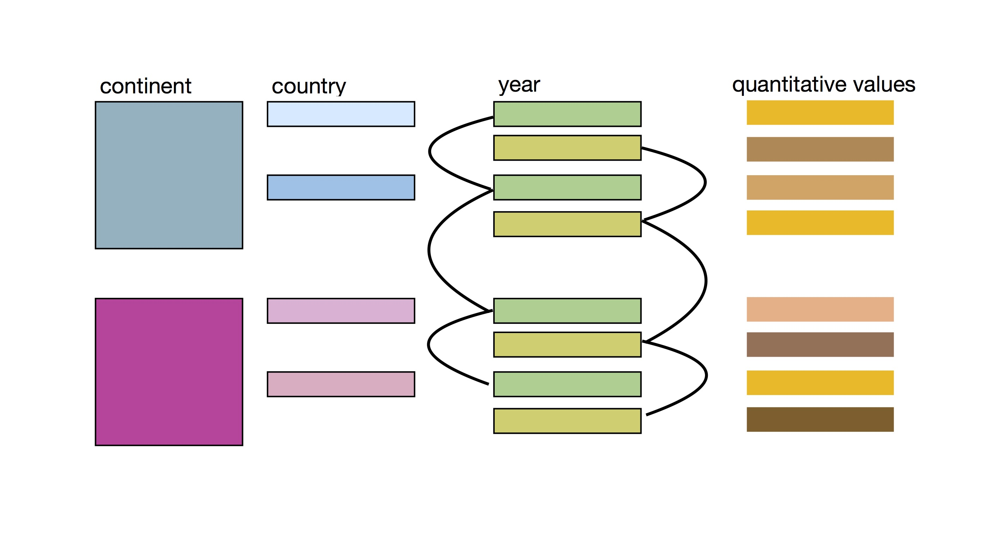
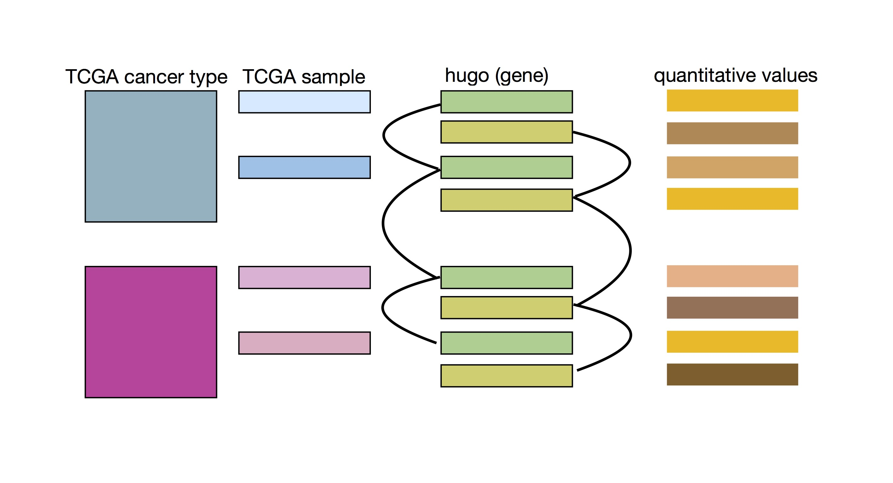

# README - stat545-hw4-thibodeau-mylinh

# HOMEWORK FILES TO REVIEW

As explained below, I unfortunately didn't realize that we only needed to pick two activities in total, and that's why my original Homework 4 (now entitled "long-version-stat545-hw04-thibodeau-mylinh") file is **NOT THE ONE TO REVIEW**.

For the **MARKING/PEER REVIEW FILES**, you can limit yourself to these two cheatsheets:

* General data reshaping and relationship to aggregation - Activity #5 (data manipulation sample): cheatsheet md file [HERE](https://github.com/mylinhthibodeau/STAT545-HW-thibodeau-mylinh/blob/master/stat545-hw4-thibodeau-mylinh/hw04-data-manipulation-cheatsheet-thibodeau-mylinh.md) comparing tidyr, reshape and R base ways of manipulating data  
* Join, merge, look up - Activity #2 (create your own cheatsheet on join functions): minimalist dplyr joining function cheatsheet md file [HERE](https://github.com/mylinhthibodeau/STAT545-HW-thibodeau-mylinh/blob/master/stat545-hw4-thibodeau-mylinh/hw04-dplyr-join-cheatsheet-thibodeau-mylinh.md) - A table is worth a thousand words

## If you are interested in the long version, you can take a look at the files below, but please don't feel obligated ! 

- Homework 4 Md file [here](https://github.com/mylinhthibodeau/STAT545-HW-thibodeau-mylinh/blob/master/stat545-hw4-thibodeau-mylinh/long-version-stat545-hw04-thibodeau-mylinh.md) (that's the one with the tables)  
- Homework 4 Rmd file [here](https://github.com/mylinhthibodeau/STAT545-HW-thibodeau-mylinh/blob/master/stat545-hw4-thibodeau-mylinh/hw04-data-manipulation-cheatsheet-thibodeau-mylinh.Rmd) 

*** 

### Genomic dataset - A few clarifications

Vincenzo Coia has approved my request to use published genomic data for the homework assignments.

* I have tried to introduce some basic explanations about the genomic dataset, but obviously, this is not a genetics course and my objective is to explore and learn how to use R and its packages, not to teach complex notions of cancer genomic analysis. Therefore, I don't expect people to understand what the data and plots represent if they haven't studied in related fields. 
* I would recommend you make abstraction of the underlying biological context and simply try to read this homework based on the variable types (e.g. copy.category is a categorical variable like "gain" or "loss") rather than what they represent.

# Valuable lessons learned

## Lesson #1 - Must figure out the underlying structure of a dataset before manipulating it

After trying for 3h to complete the homework 4 exercises with the data I used in [homework 3](https://github.com/mylinhthibodeau/STAT545-HW-thibodeau-mylinh/tree/master/stat545-hw3-thibodeau-mylinh), that regardless of how I organized the data, I still didn't have the right data format to complete the exercises. 

{:height="36px" width="36px"}

## FAILED: I was trying to do the homework with an "unfit" dataset

*I have learned to think about the underlying structure of a dataset before trying to do anything with it ! I am hoping I won't make the same mistake again in the future and that I will be able to recognize these situations promptly rather than try to solve unsolvable problems due to the nature of the dataset.*

## SUCCESS: I will be using the data from The Cancer Genome Atlas (TCGA) instead, because as illustrated below, it can have a similar structure than gapminder. 

## Lesson #2 - Carefully read the requirements 

I just realized that I only needed to do one activity for each section: 

* General data reshaping and relationship to aggregation 
* Join, merge, look up 

I was thinking to myself that this homework was very long by the time that a fellow student pointed out that I only needed to do 2 activities in total. Unfortunately, by that time, I already had completed most of the activities. The silver lining is that I am starting to understand coding better now and I will be able to use the cheatsheets in the future as their topic and applications are directly related to my field of research. 

***

# Summary of homework 4 process  

I annotated my homework 4, and it reads fairly like a narrative. Therefore, this will only be brief overview of my learning process instead. Again, this has been much harder than expected, since I had to change dataset midway. Moreover, I have experienced computer issues with my keyboard writing mathematical symbols (e.g. ˚´¥ ƒåß∂ƒ) instead of letters all of a sudden (maybe due to overheating ...mac computers).

## Newly acquired skills or knowledge

* Create (or select) a genomic dataset with the appropriate underlying structure in order to complete data exploration exercises.
* Compare and use data manipulation functions between Tidyr, Reshape2 and Base R, and learn which functions are better suited to certain tasks.
* Explore dplyr join functions: mutating (left_join, right_join, inner_join, full_join) and filtering (semi_join, anti_join) functions.
* Use of the function formula(data.frame) to figure out the underlying function of an object. E.g. formula(d1) results in "hugo ~ stat.category + BRCA + COADREAD + DLBC + GBM + PCPG + SARC + SKCM".
* Space and newline can be introduced by kable, which result in error. Can be solved by changing syntax.
* Making tables in Rmarkdown is really irritating, but I had to try it once at least, and now, I have a renewed respect for kable packages.

