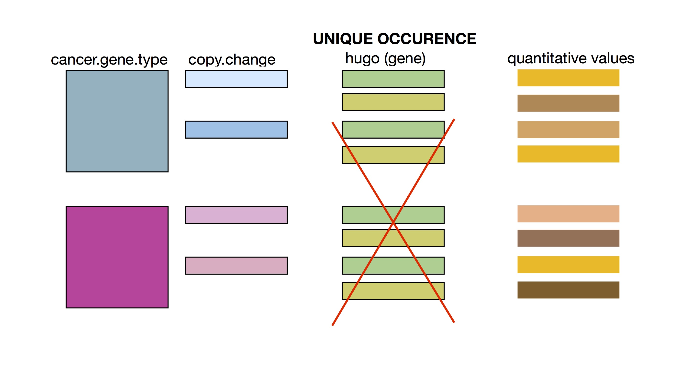

# README - stat545-hw4-thibodeau-mylinh

# IN PROGRESS

# FOLDERS - SUMMARY 

- Homework 4 Rmd file [HERE](https://github.com/mylinhthibodeau/STAT545-HW-thibodeau-mylinh/blob/master/stat545-hw4-thibodeau-mylinh/stat545-hw04-thibodeau-mylinh.Rmd)
- Homework 4 Md file [HERE](https://github.com/mylinhthibodeau/STAT545-HW-thibodeau-mylinh/blob/master/stat545-hw4-thibodeau-mylinh/stat545-hw04-thibodeau-mylinh.md)

*** 

### Genomic dataset - A few clarifications

Vincenzo Coia has approved my request to use published genomic data for the homework assignments.

* I have tried to introduce some basic explanations about the genomic dataset, but obviously, this is not a genetics course and my objective is to explore and learn how to use R and its packages, not to teach complex notions of cancer genomic analysis. Therefore, I don't expect people to understand what the data and plots represent if they haven't studied in related fields. 
* I would recommend you make abstraction of the underlying biological context and simply try to read this homework based on the variable types (e.g. copy.category is a categorical variable like "gain" or "loss") rather than what they represent.

# Valuable lesson learned

## Lesson #1 - Must figure out the underlying structure of a dataset before manipulating it

After trying for 3h to complete the homework 4 exercises with the data I used in [homework 3](https://github.com/mylinhthibodeau/STAT545-HW-thibodeau-mylinh/tree/master/stat545-hw3-thibodeau-mylinh), that regardless of how I organized the data, I still didn't have the right data format to complete the exercises. 

## FAILED: I was trying to do the homework with an "unfit" dataset

*I have learned to think about the underlying structure of a dataset before trying to do anything with it ! I am hoping I won't make the same mistake again in the future and that I will be able to recognize these situations promptly rather than try to solve unsolvable problems due to the nature of the dataset.*

## SUCCESS: I will be using the data from The Cancer Genome Atlas (TCGA) instead, because as illustrated below, it can have a similar structure than gapminder. 

## Lesson #2 - Carefully read the requirements 

I just realized that I only needed to do one activity for each section:

* General data reshaping and relationship to aggregation
* Join, merge, look up

I was thinking to myself: this is a very long homework ...so I am so sorry if my homework is lengthy.

***

# Summary of homework 4 process  

I annotated my homework 4, and it reads fairly like a narrative. Therefore, this will only be brief overview of my learning process instead. Again, this has been much harder than expected, since I had to change dataset midway. Moreover, I have experienced computer issues with my keyboard writing mathematical symbols (e.g. ˚´¥ ƒåß∂ƒ) instead of letters all of a sudden (maybe due to overheating ...mac computers).

## Newly acquired skills or knowledge

* Create (or select) a genomic dataset with the appropriate underlying structure in order to complete data exploration exercises.
* Compare and use data manipulation functions between Tidyr, Reshape2 and Base R, and learn which functions are better suited to certain tasks.
* Explore dplyr join functions: mutating (left_join, right_join, inner_join, full_join) and filtering (semi_join, anti_join) functions.
* Use of the function formula(data.frame) to figure out the underlying function of an object. E.g. formula(d1) results in "hugo ~ stat.category + BRCA + COADREAD + DLBC + GBM + PCPG + SARC + SKCM".
* Space and newline can be introduced by kable, which result in error. Can be solved by changing syntax.

