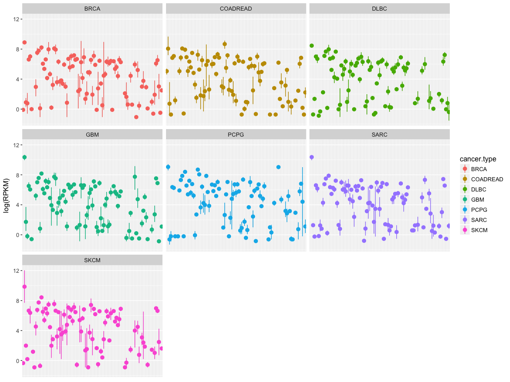

stat545-hw04-thibodeau-mylinh
================
My Linh Thibodeau
2017-10-07

``` r
suppressPackageStartupMessages(library(tidyverse))
```

    ## Warning: package 'dplyr' was built under R version 3.4.2

``` r
knitr::opts_chunk$set(fig.width=12, fig.height=9)
library(knitr)
library(kableExtra)
options(knitr.table.format = "html")
#install.packages("scales")
library(scales)
```

    ## 
    ## Attaching package: 'scales'

    ## The following object is masked from 'package:purrr':
    ## 
    ##     discard

    ## The following object is masked from 'package:readr':
    ## 
    ##     col_factor

``` r
#install.packages("tidygenomics")
library(tidygenomics)
```

Genomic datasets - A few clarifications
=======================================

Vincenzo Coia has approved my request to use published genomic data for the next assignments, therefore, I want to provide a few clarifications:

-   I have tried to introduce some basic explanations about the genomic dataset, but as my objective is to explore and learn how to use R and its packages, not to teach cancer genomic analysis, I am sorry in advance if you are not sure what the data and plots represent if they haven't studied in related fields, but focus on the data manipulation behind and not what the data represents, and I hope you will still enjoy reading my homework !
-   Given the size of the data, I only display a few rows per table to keep it readable.
-   If you are not sure of the corresponding variables (or equivalences) between gapminder and my genomic datasets, you can always go back to the README.md file [here](https://github.com/mylinhthibodeau/STAT545-HW-thibodeau-mylinh/tree/master/stat545-hw4-thibodeau-mylinh)
-   RPKM (Reads Per Kilobase of transcript per Million mapped reads) is a measure of gene expression obtained from RNAseq data.

SOURCES OF DATA: The Cancer Genome Atlas (TCGA) and ClinVar
-----------------------------------------------------------

After trying to complete this homework with the genomic data previously used in [homework 3](https://github.com/mylinhthibodeau/STAT545-HW-thibodeau-mylinh/tree/master/stat545-hw3-thibodeau-mylinh), I realized that it was impossible for me to do some of the exercises because I didn't have the right "data.frame" format for it.

*The Cancer Genome Atlas (TCGA)*
The results shown here are in whole or part based upon data generated by the TCGA Research Network: <http://cancergenome.nih.gov/>.

Genomic datasets are available through the cBioportal [here](http://www.cbioportal.org/data_sets.jsp)

*ClinVar* The results shown here are in whole or part based upon the data generated by the NCBI ClinVar data portal: <https://www.ncbi.nlm.nih.gov/clinvar/>

The ClinVar genomic variant dataset is publicly available [here](ftp://ftp.ncbi.nlm.nih.gov/pub/clinvar/tab_delimited/). If you would like more information on the type of files available, please read this [primer](https://www.ncbi.nlm.nih.gov/clinvar/docs/ftp_primer/) on the topic.

Setting up the data
===================

Getting the data ready
----------------------

Let's select some RNAseq (gene expression) cancers datasets from TCGA:

-   brca: breast cancer
-   gbm: glioblastoma
-   pcpg: pheochromocytome-paraganglioma
-   sarc: sarcoma
-   skcm: skin cutaneous melanoma
-   coadread: colorectal adenocarcinoma
-   dlbc: diffuse large B-cell lymphoma

I will only select 50 genes (nrows = 100) for each dataset, because there are way to many genes (18000-20000) to keep them all, and also, we will only select 3 samples per cancer type (\[ ,c(1,3,4,5)\]):

``` r
brca_rna <- read.table("/Users/mylinh/Documents/published_data/tcga/brca/tcga/data_RNA_Seq_v2_expression_median.txt", header = TRUE, nrows =100)[ ,c(1,3,4,5)]
colnames(brca_rna) <- c("hugo", "brca.s1", "brca.s2", "brca.s3")
brca_rna <- brca_rna[!duplicated(brca_rna$hugo), ]
brca_rna$cancer.type <- "BRCA"
#View(brca_rna)

gbm_rna <- read.table("/Users/mylinh/Documents/published_data/tcga/gbm/tcga/data_RNA_Seq_v2_expression_median.txt", header = TRUE, nrows =100)[, c(1,3,4,5)]
colnames(gbm_rna) <- c("hugo", "gbm.s1", "gbm.s2", "gbm.s3")
gbm_rna <- gbm_rna[!duplicated(gbm_rna$hugo), ]
gbm_rna$cancer.type <- "GBM"
#View(gbm_rna)

pcpg_rna <- read.table("/Users/mylinh/Documents/published_data/tcga/pcpg/tcga/data_RNA_Seq_v2_expression_median.txt", header = TRUE, nrows =100)[, c(1,3,4,5)]
colnames(pcpg_rna) <- c("hugo", "pcpg.s1", "pcpg.s2", "pcpg.s3")
pcpg_rna <- pcpg_rna[!duplicated(pcpg_rna$hugo), ]
pcpg_rna$cancer.type <- "PCPG"
#View(pcpg_rna)

sarc_rna <- read.table("/Users/mylinh/Documents/published_data/tcga/sarc/tcga/data_RNA_Seq_v2_expression_median.txt", header = TRUE, nrows =100)[, c(1,3,4,5)]
colnames(sarc_rna) <- c("hugo", "sarc.s1", "sarc.s2", "sarc.s3")
sarc_rna <- sarc_rna[!duplicated(sarc_rna$hugo), ]
sarc_rna$cancer.type <- "SARC"
#View(sarc_rna)

skcm_rna <- read.table("/Users/mylinh/Documents/published_data/tcga/skcm/tcga/data_RNA_Seq_v2_expression_median.txt", header = TRUE, nrows =100)[, c(1,3,4,5)]
colnames(skcm_rna) <- c("hugo", "skcm.s1", "skcm.s2", "skcm.s3")
skcm_rna <- skcm_rna[!duplicated(skcm_rna$hugo), ]
skcm_rna$cancer.type <- "SKCM"
#View(skcm_rna)

coadread_rna <- read.table("/Users/mylinh/Documents/published_data/tcga/coadread/tcga/data_RNA_Seq_v2_expression_median.txt", header = TRUE, nrows =100)[, c(1,3,4,5)]
colnames(coadread_rna) <- c("hugo", "coadread.s1", "coadread.s2", "coadread.s3")
coadread_rna <- coadread_rna[!duplicated(coadread_rna$hugo), ]
coadread_rna$cancer.type <- "COADREAD"
#View(coadread_rna)

dlbc_rna <- read.table("/Users/mylinh/Documents/published_data/tcga/dlbc/tcga/data_RNA_Seq_v2_expression_median.txt", header = TRUE, nrows =100)[, c(1,3,4,5)]
colnames(dlbc_rna) <- c("hugo", "dlbc.s1", "dlbc.s2", "dlbc.s3")
dlbc_rna <- dlbc_rna[!duplicated(dlbc_rna$hugo), ]
dlbc_rna$cancer.type <- "DLBC"
#View(dlbc_rna)
```

Note1. I populated one additional column per dataset with the cancer.type as this will represent my "gapminder$continent" value later on. I tried the technique explained on [computer world here](https://www.computerworld.com/article/2486415/business-intelligence/business-intelligence-4-data-wrangling-tasks-in-r-for-advanced-beginners.html), and although it didn't work out, it gave me the idea of creating a new column "cancer.type" with a single value for the specific cancer. Note2. I found a way of selecting specific columns in read.table with [this stackoverflow dicussion](https://stackoverflow.com/questions/5788117/only-read-limited-number-of-columns) and [this stackexchange discussion](https://stats.stackexchange.com/questions/16796/reading-only-two-out-of-three-columns-with-read-csv). Note3. After experiencing issues later on in this homework, I had to remove the hugo genes that had 2 or more values for the same cancer sample. I needed to have only one gene-sample key for the spread() function to workout. I found the information about how to remove duplicate [here](https://stackoverflow.com/questions/13279582/select-only-the-first-rows-for-each-unique-value-of-a-column-in-r)

General data reshaping and relationship to aggregation
======================================================

Activity \#1 - Make your own cheetsheet
---------------------------------------

*Make you own cheatsheet similar to Tyler Rinker’s [minimal guide to tidyr](https://github.com/trinker/tidyr_in_a_nutshell).*

I also like this [Data Wrangling with dplyr and tidyr cheat sheet](https://www.rstudio.com/wp-content/uploads/2015/02/data-wrangling-cheatsheet.pdf).

I found a few tutorials that I liked as well:

-   University of Virginia: [A tidyr Tutorial](http://data.library.virginia.edu/a-tidyr-tutorial/)
-   RPubs of RStudio: [Data Processing with dplyr & tidyr](https://rpubs.com/bradleyboehmke/data_wrangling) by Brad Boehmke
-   Tidyverse website: [tidyr article](http://tidyr.tidyverse.org/)

### GATHER: From horizontal (wide) to vertical (longer)

According the the Help of RStudio, the gather() function is a way to take columns that are not variables and collapse multiple columns to key-value pairs.

For my type of data, I think gather() will be useful when I realize that a group of columns actually represent the same variable and therefore, they should be "stacked on top of each other" () rather than in adjacent columns. As Hadley Wickham said in his [Introducing tidyr blog](https://blog.rstudio.com/2014/07/22/introducing-tidyr/),the most important for tidy data is that each column is a variable and each row is an observation.

Let's take a look at the brca\_rna data:

``` r
brca_rna %>%
  head(15) %>%
  kable("html") %>% kable_styling()
```

<table class="table" style="margin-left: auto; margin-right: auto;">
<thead>
<tr>
<th style="text-align:left;">
</th>
<th style="text-align:left;">
hugo
</th>
<th style="text-align:right;">
brca.s1
</th>
<th style="text-align:right;">
brca.s2
</th>
<th style="text-align:right;">
brca.s3
</th>
<th style="text-align:left;">
cancer.type
</th>
</tr>
</thead>
<tbody>
<tr>
<td style="text-align:left;">
1
</td>
<td style="text-align:left;">
LOC100130426
</td>
<td style="text-align:right;">
0.0000
</td>
<td style="text-align:right;">
0.0000
</td>
<td style="text-align:right;">
0.9066
</td>
<td style="text-align:left;">
BRCA
</td>
</tr>
<tr>
<td style="text-align:left;">
2
</td>
<td style="text-align:left;">
UBE2Q2P3
</td>
<td style="text-align:right;">
16.3644
</td>
<td style="text-align:right;">
9.2659
</td>
<td style="text-align:right;">
11.6228
</td>
<td style="text-align:left;">
BRCA
</td>
</tr>
<tr>
<td style="text-align:left;">
4
</td>
<td style="text-align:left;">
LOC149767
</td>
<td style="text-align:right;">
52.1503
</td>
<td style="text-align:right;">
69.7553
</td>
<td style="text-align:right;">
154.2974
</td>
<td style="text-align:left;">
BRCA
</td>
</tr>
<tr>
<td style="text-align:left;">
5
</td>
<td style="text-align:left;">
TIMM23
</td>
<td style="text-align:right;">
408.0760
</td>
<td style="text-align:right;">
563.8934
</td>
<td style="text-align:right;">
1360.8341
</td>
<td style="text-align:left;">
BRCA
</td>
</tr>
<tr>
<td style="text-align:left;">
6
</td>
<td style="text-align:left;">
MOXD2
</td>
<td style="text-align:right;">
0.0000
</td>
<td style="text-align:right;">
0.0000
</td>
<td style="text-align:right;">
0.0000
</td>
<td style="text-align:left;">
BRCA
</td>
</tr>
<tr>
<td style="text-align:left;">
7
</td>
<td style="text-align:left;">
LOC155060
</td>
<td style="text-align:right;">
1187.0050
</td>
<td style="text-align:right;">
516.0413
</td>
<td style="text-align:right;">
592.0218
</td>
<td style="text-align:left;">
BRCA
</td>
</tr>
<tr>
<td style="text-align:left;">
8
</td>
<td style="text-align:left;">
RNU12-2P
</td>
<td style="text-align:right;">
0.0000
</td>
<td style="text-align:right;">
1.0875
</td>
<td style="text-align:right;">
0.0000
</td>
<td style="text-align:left;">
BRCA
</td>
</tr>
<tr>
<td style="text-align:left;">
9
</td>
<td style="text-align:left;">
SSX9
</td>
<td style="text-align:right;">
0.0000
</td>
<td style="text-align:right;">
0.5438
</td>
<td style="text-align:right;">
0.0000
</td>
<td style="text-align:left;">
BRCA
</td>
</tr>
<tr>
<td style="text-align:left;">
10
</td>
<td style="text-align:left;">
LOC317712
</td>
<td style="text-align:right;">
0.0000
</td>
<td style="text-align:right;">
0.0000
</td>
<td style="text-align:right;">
0.0000
</td>
<td style="text-align:left;">
BRCA
</td>
</tr>
<tr>
<td style="text-align:left;">
11
</td>
<td style="text-align:left;">
CXORF67
</td>
<td style="text-align:right;">
1.7233
</td>
<td style="text-align:right;">
144.1001
</td>
<td style="text-align:right;">
0.0000
</td>
<td style="text-align:left;">
BRCA
</td>
</tr>
<tr>
<td style="text-align:left;">
12
</td>
<td style="text-align:left;">
EFCAB8
</td>
<td style="text-align:right;">
0.3447
</td>
<td style="text-align:right;">
4.8940
</td>
<td style="text-align:right;">
2.7199
</td>
<td style="text-align:left;">
BRCA
</td>
</tr>
<tr>
<td style="text-align:left;">
13
</td>
<td style="text-align:left;">
SRP14P1
</td>
<td style="text-align:right;">
4.1359
</td>
<td style="text-align:right;">
1.6313
</td>
<td style="text-align:right;">
2.7199
</td>
<td style="text-align:left;">
BRCA
</td>
</tr>
<tr>
<td style="text-align:left;">
14
</td>
<td style="text-align:left;">
LOC391343
</td>
<td style="text-align:right;">
0.0000
</td>
<td style="text-align:right;">
8.1566
</td>
<td style="text-align:right;">
0.0000
</td>
<td style="text-align:left;">
BRCA
</td>
</tr>
<tr>
<td style="text-align:left;">
15
</td>
<td style="text-align:left;">
TRIM75P
</td>
<td style="text-align:right;">
0.6893
</td>
<td style="text-align:right;">
0.5438
</td>
<td style="text-align:right;">
0.0000
</td>
<td style="text-align:left;">
BRCA
</td>
</tr>
<tr>
<td style="text-align:left;">
16
</td>
<td style="text-align:left;">
SPATA31B1P
</td>
<td style="text-align:right;">
0.0000
</td>
<td style="text-align:right;">
0.0000
</td>
<td style="text-align:right;">
0.0000
</td>
<td style="text-align:left;">
BRCA
</td>
</tr>
</tbody>
</table>
The TCGA RNAseq datasets are perfect for this exercise, because the columns in each dataset represent a different sample, and therefore, they are actually different obversations. I will start by making new "gathered" data.frame.

``` r
brca_rna_gather <- brca_rna %>%
  gather(key = sample, value = RPKM, brca.s1, brca.s2, brca.s3)
#View(brca_rna_gather)
gbm_rna_gather <- gbm_rna %>%
  gather(key=sample, value = RPKM, gbm.s1, gbm.s2, gbm.s3)
pcpg_rna_gather <- pcpg_rna %>%
  gather(key = sample, value = RPKM, pcpg.s1, pcpg.s2, pcpg.s3)
sarc_rna_gather <- sarc_rna %>%
  gather(key=sample, value = RPKM, sarc.s1, sarc.s2, sarc.s3)
skcm_rna_gather <- skcm_rna %>%
  gather(key = sample, value = RPKM, skcm.s1, skcm.s2, skcm.s3)
coadread_rna_gather <- coadread_rna %>%
  gather(key = sample, value = RPKM, coadread.s1, coadread.s2, coadread.s3)
dlbc_rna_gather <- dlbc_rna %>%
  gather(key =sample, value = RPKM, dlbc.s1, dlbc.s2, dlbc.s3)
```

And now, if we take the same brca data, but the after using the gather() function:

``` r
brca_rna_gather %>%
  head(15) %>%
  kable("html") %>% kable_styling()
```

<table class="table" style="margin-left: auto; margin-right: auto;">
<thead>
<tr>
<th style="text-align:left;">
hugo
</th>
<th style="text-align:left;">
cancer.type
</th>
<th style="text-align:left;">
sample
</th>
<th style="text-align:right;">
RPKM
</th>
</tr>
</thead>
<tbody>
<tr>
<td style="text-align:left;">
LOC100130426
</td>
<td style="text-align:left;">
BRCA
</td>
<td style="text-align:left;">
brca.s1
</td>
<td style="text-align:right;">
0.0000
</td>
</tr>
<tr>
<td style="text-align:left;">
UBE2Q2P3
</td>
<td style="text-align:left;">
BRCA
</td>
<td style="text-align:left;">
brca.s1
</td>
<td style="text-align:right;">
16.3644
</td>
</tr>
<tr>
<td style="text-align:left;">
LOC149767
</td>
<td style="text-align:left;">
BRCA
</td>
<td style="text-align:left;">
brca.s1
</td>
<td style="text-align:right;">
52.1503
</td>
</tr>
<tr>
<td style="text-align:left;">
TIMM23
</td>
<td style="text-align:left;">
BRCA
</td>
<td style="text-align:left;">
brca.s1
</td>
<td style="text-align:right;">
408.0760
</td>
</tr>
<tr>
<td style="text-align:left;">
MOXD2
</td>
<td style="text-align:left;">
BRCA
</td>
<td style="text-align:left;">
brca.s1
</td>
<td style="text-align:right;">
0.0000
</td>
</tr>
<tr>
<td style="text-align:left;">
LOC155060
</td>
<td style="text-align:left;">
BRCA
</td>
<td style="text-align:left;">
brca.s1
</td>
<td style="text-align:right;">
1187.0050
</td>
</tr>
<tr>
<td style="text-align:left;">
RNU12-2P
</td>
<td style="text-align:left;">
BRCA
</td>
<td style="text-align:left;">
brca.s1
</td>
<td style="text-align:right;">
0.0000
</td>
</tr>
<tr>
<td style="text-align:left;">
SSX9
</td>
<td style="text-align:left;">
BRCA
</td>
<td style="text-align:left;">
brca.s1
</td>
<td style="text-align:right;">
0.0000
</td>
</tr>
<tr>
<td style="text-align:left;">
LOC317712
</td>
<td style="text-align:left;">
BRCA
</td>
<td style="text-align:left;">
brca.s1
</td>
<td style="text-align:right;">
0.0000
</td>
</tr>
<tr>
<td style="text-align:left;">
CXORF67
</td>
<td style="text-align:left;">
BRCA
</td>
<td style="text-align:left;">
brca.s1
</td>
<td style="text-align:right;">
1.7233
</td>
</tr>
<tr>
<td style="text-align:left;">
EFCAB8
</td>
<td style="text-align:left;">
BRCA
</td>
<td style="text-align:left;">
brca.s1
</td>
<td style="text-align:right;">
0.3447
</td>
</tr>
<tr>
<td style="text-align:left;">
SRP14P1
</td>
<td style="text-align:left;">
BRCA
</td>
<td style="text-align:left;">
brca.s1
</td>
<td style="text-align:right;">
4.1359
</td>
</tr>
<tr>
<td style="text-align:left;">
LOC391343
</td>
<td style="text-align:left;">
BRCA
</td>
<td style="text-align:left;">
brca.s1
</td>
<td style="text-align:right;">
0.0000
</td>
</tr>
<tr>
<td style="text-align:left;">
TRIM75P
</td>
<td style="text-align:left;">
BRCA
</td>
<td style="text-align:left;">
brca.s1
</td>
<td style="text-align:right;">
0.6893
</td>
</tr>
<tr>
<td style="text-align:left;">
SPATA31B1P
</td>
<td style="text-align:left;">
BRCA
</td>
<td style="text-align:left;">
brca.s1
</td>
<td style="text-align:right;">
0.0000
</td>
</tr>
</tbody>
</table>
### SPREAD: From vertical (longer) to horizontal (wide)

In order to revert back to the original format of the data, I can use the same key:value pairing in the spread() function. For example, the following code's output is the original data format since gather() and spread() are mirror functions from each other.

``` r
brca_rna %>%
  gather(key = sample, value = RPKM, brca.s1, brca.s2, brca.s3) %>%
  spread(key=sample, value=RPKM) %>%
  head(15) %>%
  kable("html") %>% kable_styling()
```

<table class="table" style="margin-left: auto; margin-right: auto;">
<thead>
<tr>
<th style="text-align:left;">
hugo
</th>
<th style="text-align:left;">
cancer.type
</th>
<th style="text-align:right;">
brca.s1
</th>
<th style="text-align:right;">
brca.s2
</th>
<th style="text-align:right;">
brca.s3
</th>
</tr>
</thead>
<tbody>
<tr>
<td style="text-align:left;">
A1CF
</td>
<td style="text-align:left;">
BRCA
</td>
<td style="text-align:right;">
0.0000
</td>
<td style="text-align:right;">
0.0000
</td>
<td style="text-align:right;">
0.9066
</td>
</tr>
<tr>
<td style="text-align:left;">
A2M
</td>
<td style="text-align:left;">
BRCA
</td>
<td style="text-align:right;">
5798.3746
</td>
<td style="text-align:right;">
7571.9793
</td>
<td style="text-align:right;">
8840.3989
</td>
</tr>
<tr>
<td style="text-align:left;">
A2ML1
</td>
<td style="text-align:left;">
BRCA
</td>
<td style="text-align:right;">
1.3786
</td>
<td style="text-align:right;">
4.3502
</td>
<td style="text-align:right;">
0.0000
</td>
</tr>
<tr>
<td style="text-align:left;">
A4GNT
</td>
<td style="text-align:left;">
BRCA
</td>
<td style="text-align:right;">
8.6165
</td>
<td style="text-align:right;">
0.5438
</td>
<td style="text-align:right;">
0.0000
</td>
</tr>
<tr>
<td style="text-align:left;">
AAAS
</td>
<td style="text-align:left;">
BRCA
</td>
<td style="text-align:right;">
649.3372
</td>
<td style="text-align:right;">
887.9826
</td>
<td style="text-align:right;">
723.4814
</td>
</tr>
<tr>
<td style="text-align:left;">
AACS
</td>
<td style="text-align:left;">
BRCA
</td>
<td style="text-align:right;">
1087.3986
</td>
<td style="text-align:right;">
836.3241
</td>
<td style="text-align:right;">
1533.0916
</td>
</tr>
<tr>
<td style="text-align:left;">
AADAC
</td>
<td style="text-align:left;">
BRCA
</td>
<td style="text-align:right;">
0.0000
</td>
<td style="text-align:right;">
1.0875
</td>
<td style="text-align:right;">
0.9066
</td>
</tr>
<tr>
<td style="text-align:left;">
AADACL2
</td>
<td style="text-align:left;">
BRCA
</td>
<td style="text-align:right;">
0.0000
</td>
<td style="text-align:right;">
0.0000
</td>
<td style="text-align:right;">
0.0000
</td>
</tr>
<tr>
<td style="text-align:left;">
AADACL4
</td>
<td style="text-align:left;">
BRCA
</td>
<td style="text-align:right;">
0.0000
</td>
<td style="text-align:right;">
0.0000
</td>
<td style="text-align:right;">
0.0000
</td>
</tr>
<tr>
<td style="text-align:left;">
AADAT
</td>
<td style="text-align:left;">
BRCA
</td>
<td style="text-align:right;">
5.5145
</td>
<td style="text-align:right;">
24.4698
</td>
<td style="text-align:right;">
53.4905
</td>
</tr>
<tr>
<td style="text-align:left;">
AAGAB
</td>
<td style="text-align:left;">
BRCA
</td>
<td style="text-align:right;">
1300.3977
</td>
<td style="text-align:right;">
3541.0549
</td>
<td style="text-align:right;">
1360.8341
</td>
</tr>
<tr>
<td style="text-align:left;">
AAMP
</td>
<td style="text-align:left;">
BRCA
</td>
<td style="text-align:right;">
2053.1326
</td>
<td style="text-align:right;">
2979.8804
</td>
<td style="text-align:right;">
2291.9311
</td>
</tr>
<tr>
<td style="text-align:left;">
AANAT
</td>
<td style="text-align:left;">
BRCA
</td>
<td style="text-align:right;">
0.3447
</td>
<td style="text-align:right;">
2.1751
</td>
<td style="text-align:right;">
1.8132
</td>
</tr>
<tr>
<td style="text-align:left;">
AARS
</td>
<td style="text-align:left;">
BRCA
</td>
<td style="text-align:right;">
4409.5650
</td>
<td style="text-align:right;">
4570.9625
</td>
<td style="text-align:right;">
2556.6636
</td>
</tr>
<tr>
<td style="text-align:left;">
AARSD1
</td>
<td style="text-align:left;">
BRCA
</td>
<td style="text-align:right;">
466.6680
</td>
<td style="text-align:right;">
418.7058
</td>
<td style="text-align:right;">
390.7525
</td>
</tr>
</tbody>
</table>
*So it turns out that the spread() function does not like the fact that some gene names are duplicated for the sample sample initially, as it returned the message "Error: Duplicate identifiers for rows (2, 3), (52, 53), (102, 103)". So I have decided to change apply some extra functions to filter the duplicate when I read the TCGA cancer datasets files at the beginning of the homework.*

Join, merge, look up - Just making up the full\_dataset
-------------------------------------------------------

For the next step, I will have to skip ahead in the tasks a little and use some joining funcitons to compound all these TCGA datasets into one "gapminder-like" dataset.

``` r
list_datasets <- list(brca_rna_gather, gbm_rna_gather, pcpg_rna_gather, sarc_rna_gather, skcm_rna_gather, coadread_rna_gather, dlbc_rna_gather)
# View(list_genomic_datasets_v3)
full_dataset <- list_datasets %>%
  Reduce(function(x, y) full_join(x, y), .)
```

    ## Joining, by = c("hugo", "cancer.type", "sample", "RPKM")
    ## Joining, by = c("hugo", "cancer.type", "sample", "RPKM")
    ## Joining, by = c("hugo", "cancer.type", "sample", "RPKM")
    ## Joining, by = c("hugo", "cancer.type", "sample", "RPKM")
    ## Joining, by = c("hugo", "cancer.type", "sample", "RPKM")
    ## Joining, by = c("hugo", "cancer.type", "sample", "RPKM")

Note. I won't lie, I needed to read a lot in order to figure the chunk of code above:

-   

Activity \#2 - Make a tibble with one row per year and columns for life expectancy for two or more countries.
-------------------------------------------------------------------------------------------------------------

I will make a tibble with one row per gene (year) and columns for RPKM values (life expectancy) for two of more cancer samples (countries) in the BRCA group (continent).

``` r
full_dataset %>%
  filter(cancer.type=="BRCA") %>%
  spread(key=sample, value =RPKM) %>%
  head(15) %>%
  kable("html") %>% kable_styling()
```

<table class="table" style="margin-left: auto; margin-right: auto;">
<thead>
<tr>
<th style="text-align:left;">
hugo
</th>
<th style="text-align:left;">
cancer.type
</th>
<th style="text-align:right;">
brca.s1
</th>
<th style="text-align:right;">
brca.s2
</th>
<th style="text-align:right;">
brca.s3
</th>
</tr>
</thead>
<tbody>
<tr>
<td style="text-align:left;">
A1CF
</td>
<td style="text-align:left;">
BRCA
</td>
<td style="text-align:right;">
0.0000
</td>
<td style="text-align:right;">
0.0000
</td>
<td style="text-align:right;">
0.9066
</td>
</tr>
<tr>
<td style="text-align:left;">
A2M
</td>
<td style="text-align:left;">
BRCA
</td>
<td style="text-align:right;">
5798.3746
</td>
<td style="text-align:right;">
7571.9793
</td>
<td style="text-align:right;">
8840.3989
</td>
</tr>
<tr>
<td style="text-align:left;">
A2ML1
</td>
<td style="text-align:left;">
BRCA
</td>
<td style="text-align:right;">
1.3786
</td>
<td style="text-align:right;">
4.3502
</td>
<td style="text-align:right;">
0.0000
</td>
</tr>
<tr>
<td style="text-align:left;">
A4GNT
</td>
<td style="text-align:left;">
BRCA
</td>
<td style="text-align:right;">
8.6165
</td>
<td style="text-align:right;">
0.5438
</td>
<td style="text-align:right;">
0.0000
</td>
</tr>
<tr>
<td style="text-align:left;">
AAAS
</td>
<td style="text-align:left;">
BRCA
</td>
<td style="text-align:right;">
649.3372
</td>
<td style="text-align:right;">
887.9826
</td>
<td style="text-align:right;">
723.4814
</td>
</tr>
<tr>
<td style="text-align:left;">
AACS
</td>
<td style="text-align:left;">
BRCA
</td>
<td style="text-align:right;">
1087.3986
</td>
<td style="text-align:right;">
836.3241
</td>
<td style="text-align:right;">
1533.0916
</td>
</tr>
<tr>
<td style="text-align:left;">
AADAC
</td>
<td style="text-align:left;">
BRCA
</td>
<td style="text-align:right;">
0.0000
</td>
<td style="text-align:right;">
1.0875
</td>
<td style="text-align:right;">
0.9066
</td>
</tr>
<tr>
<td style="text-align:left;">
AADACL2
</td>
<td style="text-align:left;">
BRCA
</td>
<td style="text-align:right;">
0.0000
</td>
<td style="text-align:right;">
0.0000
</td>
<td style="text-align:right;">
0.0000
</td>
</tr>
<tr>
<td style="text-align:left;">
AADACL4
</td>
<td style="text-align:left;">
BRCA
</td>
<td style="text-align:right;">
0.0000
</td>
<td style="text-align:right;">
0.0000
</td>
<td style="text-align:right;">
0.0000
</td>
</tr>
<tr>
<td style="text-align:left;">
AADAT
</td>
<td style="text-align:left;">
BRCA
</td>
<td style="text-align:right;">
5.5145
</td>
<td style="text-align:right;">
24.4698
</td>
<td style="text-align:right;">
53.4905
</td>
</tr>
<tr>
<td style="text-align:left;">
AAGAB
</td>
<td style="text-align:left;">
BRCA
</td>
<td style="text-align:right;">
1300.3977
</td>
<td style="text-align:right;">
3541.0549
</td>
<td style="text-align:right;">
1360.8341
</td>
</tr>
<tr>
<td style="text-align:left;">
AAMP
</td>
<td style="text-align:left;">
BRCA
</td>
<td style="text-align:right;">
2053.1326
</td>
<td style="text-align:right;">
2979.8804
</td>
<td style="text-align:right;">
2291.9311
</td>
</tr>
<tr>
<td style="text-align:left;">
AANAT
</td>
<td style="text-align:left;">
BRCA
</td>
<td style="text-align:right;">
0.3447
</td>
<td style="text-align:right;">
2.1751
</td>
<td style="text-align:right;">
1.8132
</td>
</tr>
<tr>
<td style="text-align:left;">
AARS
</td>
<td style="text-align:left;">
BRCA
</td>
<td style="text-align:right;">
4409.5650
</td>
<td style="text-align:right;">
4570.9625
</td>
<td style="text-align:right;">
2556.6636
</td>
</tr>
<tr>
<td style="text-align:left;">
AARSD1
</td>
<td style="text-align:left;">
BRCA
</td>
<td style="text-align:right;">
466.6680
</td>
<td style="text-align:right;">
418.7058
</td>
<td style="text-align:right;">
390.7525
</td>
</tr>
</tbody>
</table>
Activity \#3
------------

Compute some measure of RPKM (lifeExp) (mean? median? min? max?) for all possible combinations of cancer group (continent) and hugo (year).

``` r
full_dataset %>%
  group_by(hugo, cancer.type) %>%
  summarize(mean.cancer=signif(mean(RPKM),2), median.cancer = signif(median(RPKM), 2), min.cancer=signif(min(RPKM), 2), max.cancer=signif(max(RPKM), 2)) %>%
  head(15) %>%
  kable("html") %>% kable_styling()
```

<table class="table" style="margin-left: auto; margin-right: auto;">
<thead>
<tr>
<th style="text-align:left;">
hugo
</th>
<th style="text-align:left;">
cancer.type
</th>
<th style="text-align:right;">
mean.cancer
</th>
<th style="text-align:right;">
median.cancer
</th>
<th style="text-align:right;">
min.cancer
</th>
<th style="text-align:right;">
max.cancer
</th>
</tr>
</thead>
<tbody>
<tr>
<td style="text-align:left;">
A1CF
</td>
<td style="text-align:left;">
BRCA
</td>
<td style="text-align:right;">
3.0e-01
</td>
<td style="text-align:right;">
0.0
</td>
<td style="text-align:right;">
0
</td>
<td style="text-align:right;">
9.1e-01
</td>
</tr>
<tr>
<td style="text-align:left;">
A1CF
</td>
<td style="text-align:left;">
COADREAD
</td>
<td style="text-align:right;">
1.7e+02
</td>
<td style="text-align:right;">
170.0
</td>
<td style="text-align:right;">
100
</td>
<td style="text-align:right;">
2.2e+02
</td>
</tr>
<tr>
<td style="text-align:left;">
A1CF
</td>
<td style="text-align:left;">
DLBC
</td>
<td style="text-align:right;">
0.0e+00
</td>
<td style="text-align:right;">
0.0
</td>
<td style="text-align:right;">
0
</td>
<td style="text-align:right;">
0.0e+00
</td>
</tr>
<tr>
<td style="text-align:left;">
A1CF
</td>
<td style="text-align:left;">
GBM
</td>
<td style="text-align:right;">
0.0e+00
</td>
<td style="text-align:right;">
0.0
</td>
<td style="text-align:right;">
0
</td>
<td style="text-align:right;">
0.0e+00
</td>
</tr>
<tr>
<td style="text-align:left;">
A1CF
</td>
<td style="text-align:left;">
PCPG
</td>
<td style="text-align:right;">
0.0e+00
</td>
<td style="text-align:right;">
0.0
</td>
<td style="text-align:right;">
0
</td>
<td style="text-align:right;">
0.0e+00
</td>
</tr>
<tr>
<td style="text-align:left;">
A1CF
</td>
<td style="text-align:left;">
SARC
</td>
<td style="text-align:right;">
0.0e+00
</td>
<td style="text-align:right;">
0.0
</td>
<td style="text-align:right;">
0
</td>
<td style="text-align:right;">
0.0e+00
</td>
</tr>
<tr>
<td style="text-align:left;">
A1CF
</td>
<td style="text-align:left;">
SKCM
</td>
<td style="text-align:right;">
2.4e-01
</td>
<td style="text-align:right;">
0.0
</td>
<td style="text-align:right;">
0
</td>
<td style="text-align:right;">
7.1e-01
</td>
</tr>
<tr>
<td style="text-align:left;">
A2M
</td>
<td style="text-align:left;">
BRCA
</td>
<td style="text-align:right;">
7.4e+03
</td>
<td style="text-align:right;">
7600.0
</td>
<td style="text-align:right;">
5800
</td>
<td style="text-align:right;">
8.8e+03
</td>
</tr>
<tr>
<td style="text-align:left;">
A2M
</td>
<td style="text-align:left;">
COADREAD
</td>
<td style="text-align:right;">
6.2e+03
</td>
<td style="text-align:right;">
1500.0
</td>
<td style="text-align:right;">
1300
</td>
<td style="text-align:right;">
1.6e+04
</td>
</tr>
<tr>
<td style="text-align:left;">
A2M
</td>
<td style="text-align:left;">
DLBC
</td>
<td style="text-align:right;">
4.8e+03
</td>
<td style="text-align:right;">
4700.0
</td>
<td style="text-align:right;">
4200
</td>
<td style="text-align:right;">
5.3e+03
</td>
</tr>
<tr>
<td style="text-align:left;">
A2M
</td>
<td style="text-align:left;">
GBM
</td>
<td style="text-align:right;">
3.3e+04
</td>
<td style="text-align:right;">
34000.0
</td>
<td style="text-align:right;">
21000
</td>
<td style="text-align:right;">
4.3e+04
</td>
</tr>
<tr>
<td style="text-align:left;">
A2M
</td>
<td style="text-align:left;">
PCPG
</td>
<td style="text-align:right;">
9.0e+03
</td>
<td style="text-align:right;">
9400.0
</td>
<td style="text-align:right;">
5400
</td>
<td style="text-align:right;">
1.2e+04
</td>
</tr>
<tr>
<td style="text-align:left;">
A2M
</td>
<td style="text-align:left;">
SARC
</td>
<td style="text-align:right;">
3.3e+04
</td>
<td style="text-align:right;">
38000.0
</td>
<td style="text-align:right;">
21000
</td>
<td style="text-align:right;">
4.1e+04
</td>
</tr>
<tr>
<td style="text-align:left;">
A2M
</td>
<td style="text-align:left;">
SKCM
</td>
<td style="text-align:right;">
6.3e+04
</td>
<td style="text-align:right;">
18000.0
</td>
<td style="text-align:right;">
2200
</td>
<td style="text-align:right;">
1.7e+05
</td>
</tr>
<tr>
<td style="text-align:left;">
A2ML1
</td>
<td style="text-align:left;">
BRCA
</td>
<td style="text-align:right;">
1.9e+00
</td>
<td style="text-align:right;">
1.4
</td>
<td style="text-align:right;">
0
</td>
<td style="text-align:right;">
4.4e+00
</td>
</tr>
</tbody>
</table>
Reshape that to have one row per hugo (year) and one variable for each cancer group (continent).

This sounds like spread() and gather() would be useful here. So let's start by doing this exercise with the mean.cancer variable.

``` r
d1 <- full_dataset %>%
  group_by(hugo, cancer.type) %>%
  summarize(mean.cancer= signif(mean(RPKM), 2)) %>%
  gather(key=stat.category, value= the.number , mean.cancer) %>%
  spread(key=cancer.type, value=the.number)
d1 %>% head(15) %>% kable("html") %>% kable_styling()
```

<table class="table" style="margin-left: auto; margin-right: auto;">
<thead>
<tr>
<th style="text-align:left;">
hugo
</th>
<th style="text-align:left;">
stat.category
</th>
<th style="text-align:right;">
BRCA
</th>
<th style="text-align:right;">
COADREAD
</th>
<th style="text-align:right;">
DLBC
</th>
<th style="text-align:right;">
GBM
</th>
<th style="text-align:right;">
PCPG
</th>
<th style="text-align:right;">
SARC
</th>
<th style="text-align:right;">
SKCM
</th>
</tr>
</thead>
<tbody>
<tr>
<td style="text-align:left;">
A1CF
</td>
<td style="text-align:left;">
mean.cancer
</td>
<td style="text-align:right;">
0.30
</td>
<td style="text-align:right;">
170.00
</td>
<td style="text-align:right;">
0.00
</td>
<td style="text-align:right;">
0.0e+00
</td>
<td style="text-align:right;">
0.00
</td>
<td style="text-align:right;">
0.0e+00
</td>
<td style="text-align:right;">
2.4e-01
</td>
</tr>
<tr>
<td style="text-align:left;">
A2M
</td>
<td style="text-align:left;">
mean.cancer
</td>
<td style="text-align:right;">
7400.00
</td>
<td style="text-align:right;">
6200.00
</td>
<td style="text-align:right;">
4800.00
</td>
<td style="text-align:right;">
3.3e+04
</td>
<td style="text-align:right;">
9000.00
</td>
<td style="text-align:right;">
3.3e+04
</td>
<td style="text-align:right;">
6.3e+04
</td>
</tr>
<tr>
<td style="text-align:left;">
A2ML1
</td>
<td style="text-align:left;">
mean.cancer
</td>
<td style="text-align:right;">
1.90
</td>
<td style="text-align:right;">
13.00
</td>
<td style="text-align:right;">
0.16
</td>
<td style="text-align:right;">
1.5e+01
</td>
<td style="text-align:right;">
0.45
</td>
<td style="text-align:right;">
1.2e+00
</td>
<td style="text-align:right;">
2.4e+00
</td>
</tr>
<tr>
<td style="text-align:left;">
A4GNT
</td>
<td style="text-align:left;">
mean.cancer
</td>
<td style="text-align:right;">
3.10
</td>
<td style="text-align:right;">
0.16
</td>
<td style="text-align:right;">
1.30
</td>
<td style="text-align:right;">
6.0e-01
</td>
<td style="text-align:right;">
0.95
</td>
<td style="text-align:right;">
2.6e-01
</td>
<td style="text-align:right;">
4.0e-01
</td>
</tr>
<tr>
<td style="text-align:left;">
AAAS
</td>
<td style="text-align:left;">
mean.cancer
</td>
<td style="text-align:right;">
750.00
</td>
<td style="text-align:right;">
930.00
</td>
<td style="text-align:right;">
1100.00
</td>
<td style="text-align:right;">
7.2e+02
</td>
<td style="text-align:right;">
590.00
</td>
<td style="text-align:right;">
7.5e+02
</td>
<td style="text-align:right;">
7.9e+02
</td>
</tr>
<tr>
<td style="text-align:left;">
AACS
</td>
<td style="text-align:left;">
mean.cancer
</td>
<td style="text-align:right;">
1200.00
</td>
<td style="text-align:right;">
1200.00
</td>
<td style="text-align:right;">
900.00
</td>
<td style="text-align:right;">
4.3e+02
</td>
<td style="text-align:right;">
540.00
</td>
<td style="text-align:right;">
5.1e+02
</td>
<td style="text-align:right;">
8.4e+02
</td>
</tr>
<tr>
<td style="text-align:left;">
AADAC
</td>
<td style="text-align:left;">
mean.cancer
</td>
<td style="text-align:right;">
0.66
</td>
<td style="text-align:right;">
2.40
</td>
<td style="text-align:right;">
0.28
</td>
<td style="text-align:right;">
1.9e-01
</td>
<td style="text-align:right;">
0.27
</td>
<td style="text-align:right;">
5.6e-01
</td>
<td style="text-align:right;">
0.0e+00
</td>
</tr>
<tr>
<td style="text-align:left;">
AADACL2
</td>
<td style="text-align:left;">
mean.cancer
</td>
<td style="text-align:right;">
0.00
</td>
<td style="text-align:right;">
0.00
</td>
<td style="text-align:right;">
0.24
</td>
<td style="text-align:right;">
0.0e+00
</td>
<td style="text-align:right;">
0.00
</td>
<td style="text-align:right;">
3.1e+00
</td>
<td style="text-align:right;">
1.1e+00
</td>
</tr>
<tr>
<td style="text-align:left;">
AADACL4
</td>
<td style="text-align:left;">
mean.cancer
</td>
<td style="text-align:right;">
0.00
</td>
<td style="text-align:right;">
0.00
</td>
<td style="text-align:right;">
0.00
</td>
<td style="text-align:right;">
0.0e+00
</td>
<td style="text-align:right;">
0.27
</td>
<td style="text-align:right;">
7.5e-01
</td>
<td style="text-align:right;">
1.3e-01
</td>
</tr>
<tr>
<td style="text-align:left;">
AADAT
</td>
<td style="text-align:left;">
mean.cancer
</td>
<td style="text-align:right;">
28.00
</td>
<td style="text-align:right;">
170.00
</td>
<td style="text-align:right;">
9.40
</td>
<td style="text-align:right;">
2.0e+02
</td>
<td style="text-align:right;">
370.00
</td>
<td style="text-align:right;">
8.1e+01
</td>
<td style="text-align:right;">
1.2e+02
</td>
</tr>
<tr>
<td style="text-align:left;">
AAGAB
</td>
<td style="text-align:left;">
mean.cancer
</td>
<td style="text-align:right;">
2100.00
</td>
<td style="text-align:right;">
1000.00
</td>
<td style="text-align:right;">
1200.00
</td>
<td style="text-align:right;">
1.1e+03
</td>
<td style="text-align:right;">
1500.00
</td>
<td style="text-align:right;">
8.6e+02
</td>
<td style="text-align:right;">
8.9e+02
</td>
</tr>
<tr>
<td style="text-align:left;">
AAMP
</td>
<td style="text-align:left;">
mean.cancer
</td>
<td style="text-align:right;">
2400.00
</td>
<td style="text-align:right;">
3300.00
</td>
<td style="text-align:right;">
2200.00
</td>
<td style="text-align:right;">
2.0e+03
</td>
<td style="text-align:right;">
2600.00
</td>
<td style="text-align:right;">
1.8e+03
</td>
<td style="text-align:right;">
2.3e+03
</td>
</tr>
<tr>
<td style="text-align:left;">
AANAT
</td>
<td style="text-align:left;">
mean.cancer
</td>
<td style="text-align:right;">
1.40
</td>
<td style="text-align:right;">
0.57
</td>
<td style="text-align:right;">
0.79
</td>
<td style="text-align:right;">
2.8e+00
</td>
<td style="text-align:right;">
0.27
</td>
<td style="text-align:right;">
8.8e-01
</td>
<td style="text-align:right;">
5.0e-01
</td>
</tr>
<tr>
<td style="text-align:left;">
AARS
</td>
<td style="text-align:left;">
mean.cancer
</td>
<td style="text-align:right;">
3800.00
</td>
<td style="text-align:right;">
2900.00
</td>
<td style="text-align:right;">
3300.00
</td>
<td style="text-align:right;">
3.6e+03
</td>
<td style="text-align:right;">
4500.00
</td>
<td style="text-align:right;">
2.7e+03
</td>
<td style="text-align:right;">
4.6e+03
</td>
</tr>
<tr>
<td style="text-align:left;">
AARSD1
</td>
<td style="text-align:left;">
mean.cancer
</td>
<td style="text-align:right;">
430.00
</td>
<td style="text-align:right;">
1000.00
</td>
<td style="text-align:right;">
840.00
</td>
<td style="text-align:right;">
4.6e+02
</td>
<td style="text-align:right;">
720.00
</td>
<td style="text-align:right;">
5.8e+02
</td>
<td style="text-align:right;">
7.6e+02
</td>
</tr>
</tbody>
</table>
*Wow ... that took a long time, so let me reason through the process for one second:*

-   I grouped by hugo gene (year) and cancer.type (continent)
-   Got my summary stat mean.cancer
-   Used gather() with a key = stat.category and a value = the.number and mean.cancer
-   Key = new variable created = stat.category
-   Value = column name representing the value = the.number, which is a temporary variable I created to use in the spread() function after
-   Names of columns to gather = mean.cancer
-   Used spread() with a key = cancer.type and a value=the.number
-   Which means that the cancer.type now became columns of their own
-   And I indicated the value = the.number, which means the mean.cancer value in this case.

*Is there a plot that is easier to make with the data in this shape versus the usual form? If so (or you think so), try it! Reflect.*

Well, I am not sure actually. There might be one: plotting the hugo (year) summary stats according to the cancer.type (continent) will be easier I think.

For example, I can easily plot the breast cancer (BRCA) mean.cancer values and the difference between the hugo gene (year). I know it is almost impossible to read the gene name, but I had to make them small so they wouldn't overlap on each other.

``` r
p1 <- d1 %>%
  ggplot(aes(x=hugo, y= BRCA), na.rm = TRUE)
p1 + geom_point() + 
   theme(text = element_text(size=8), axis.text.x = element_text(angle=45, hjust=1))
```


And now, we can extend it to more summary statistics:

``` r
d2 <- full_dataset %>%
  group_by(hugo, cancer.type) %>%
  summarize(mean.cancer= signif(mean(RPKM), 2), median.cancer = signif(median(RPKM), 2), min.cancer=signif(min(RPKM), 2), max.cancer=signif(max(RPKM), 2)) %>%
  gather(key=stat.category, value= the.number , mean.cancer, median.cancer, min.cancer, max.cancer) %>%
  spread(key=cancer.type, value=the.number)
d2 %>% head(15) %>% kable("html") %>% kable_styling()
```

<table class="table" style="margin-left: auto; margin-right: auto;">
<thead>
<tr>
<th style="text-align:left;">
hugo
</th>
<th style="text-align:left;">
stat.category
</th>
<th style="text-align:right;">
BRCA
</th>
<th style="text-align:right;">
COADREAD
</th>
<th style="text-align:right;">
DLBC
</th>
<th style="text-align:right;">
GBM
</th>
<th style="text-align:right;">
PCPG
</th>
<th style="text-align:right;">
SARC
</th>
<th style="text-align:right;">
SKCM
</th>
</tr>
</thead>
<tbody>
<tr>
<td style="text-align:left;">
A1CF
</td>
<td style="text-align:left;">
max.cancer
</td>
<td style="text-align:right;">
0.91
</td>
<td style="text-align:right;">
2.2e+02
</td>
<td style="text-align:right;">
0.00
</td>
<td style="text-align:right;">
0.0e+00
</td>
<td style="text-align:right;">
0.0e+00
</td>
<td style="text-align:right;">
0.0e+00
</td>
<td style="text-align:right;">
7.1e-01
</td>
</tr>
<tr>
<td style="text-align:left;">
A1CF
</td>
<td style="text-align:left;">
mean.cancer
</td>
<td style="text-align:right;">
0.30
</td>
<td style="text-align:right;">
1.7e+02
</td>
<td style="text-align:right;">
0.00
</td>
<td style="text-align:right;">
0.0e+00
</td>
<td style="text-align:right;">
0.0e+00
</td>
<td style="text-align:right;">
0.0e+00
</td>
<td style="text-align:right;">
2.4e-01
</td>
</tr>
<tr>
<td style="text-align:left;">
A1CF
</td>
<td style="text-align:left;">
median.cancer
</td>
<td style="text-align:right;">
0.00
</td>
<td style="text-align:right;">
1.7e+02
</td>
<td style="text-align:right;">
0.00
</td>
<td style="text-align:right;">
0.0e+00
</td>
<td style="text-align:right;">
0.0e+00
</td>
<td style="text-align:right;">
0.0e+00
</td>
<td style="text-align:right;">
0.0e+00
</td>
</tr>
<tr>
<td style="text-align:left;">
A1CF
</td>
<td style="text-align:left;">
min.cancer
</td>
<td style="text-align:right;">
0.00
</td>
<td style="text-align:right;">
1.0e+02
</td>
<td style="text-align:right;">
0.00
</td>
<td style="text-align:right;">
0.0e+00
</td>
<td style="text-align:right;">
0.0e+00
</td>
<td style="text-align:right;">
0.0e+00
</td>
<td style="text-align:right;">
0.0e+00
</td>
</tr>
<tr>
<td style="text-align:left;">
A2M
</td>
<td style="text-align:left;">
max.cancer
</td>
<td style="text-align:right;">
8800.00
</td>
<td style="text-align:right;">
1.6e+04
</td>
<td style="text-align:right;">
5300.00
</td>
<td style="text-align:right;">
4.3e+04
</td>
<td style="text-align:right;">
1.2e+04
</td>
<td style="text-align:right;">
4.1e+04
</td>
<td style="text-align:right;">
1.7e+05
</td>
</tr>
<tr>
<td style="text-align:left;">
A2M
</td>
<td style="text-align:left;">
mean.cancer
</td>
<td style="text-align:right;">
7400.00
</td>
<td style="text-align:right;">
6.2e+03
</td>
<td style="text-align:right;">
4800.00
</td>
<td style="text-align:right;">
3.3e+04
</td>
<td style="text-align:right;">
9.0e+03
</td>
<td style="text-align:right;">
3.3e+04
</td>
<td style="text-align:right;">
6.3e+04
</td>
</tr>
<tr>
<td style="text-align:left;">
A2M
</td>
<td style="text-align:left;">
median.cancer
</td>
<td style="text-align:right;">
7600.00
</td>
<td style="text-align:right;">
1.5e+03
</td>
<td style="text-align:right;">
4700.00
</td>
<td style="text-align:right;">
3.4e+04
</td>
<td style="text-align:right;">
9.4e+03
</td>
<td style="text-align:right;">
3.8e+04
</td>
<td style="text-align:right;">
1.8e+04
</td>
</tr>
<tr>
<td style="text-align:left;">
A2M
</td>
<td style="text-align:left;">
min.cancer
</td>
<td style="text-align:right;">
5800.00
</td>
<td style="text-align:right;">
1.3e+03
</td>
<td style="text-align:right;">
4200.00
</td>
<td style="text-align:right;">
2.1e+04
</td>
<td style="text-align:right;">
5.4e+03
</td>
<td style="text-align:right;">
2.1e+04
</td>
<td style="text-align:right;">
2.2e+03
</td>
</tr>
<tr>
<td style="text-align:left;">
A2ML1
</td>
<td style="text-align:left;">
max.cancer
</td>
<td style="text-align:right;">
4.40
</td>
<td style="text-align:right;">
3.7e+01
</td>
<td style="text-align:right;">
0.49
</td>
<td style="text-align:right;">
4.1e+01
</td>
<td style="text-align:right;">
1.1e+00
</td>
<td style="text-align:right;">
3.6e+00
</td>
<td style="text-align:right;">
7.3e+00
</td>
</tr>
<tr>
<td style="text-align:left;">
A2ML1
</td>
<td style="text-align:left;">
mean.cancer
</td>
<td style="text-align:right;">
1.90
</td>
<td style="text-align:right;">
1.3e+01
</td>
<td style="text-align:right;">
0.16
</td>
<td style="text-align:right;">
1.5e+01
</td>
<td style="text-align:right;">
4.5e-01
</td>
<td style="text-align:right;">
1.2e+00
</td>
<td style="text-align:right;">
2.4e+00
</td>
</tr>
<tr>
<td style="text-align:left;">
A2ML1
</td>
<td style="text-align:left;">
median.cancer
</td>
<td style="text-align:right;">
1.40
</td>
<td style="text-align:right;">
4.8e-01
</td>
<td style="text-align:right;">
0.00
</td>
<td style="text-align:right;">
2.5e+00
</td>
<td style="text-align:right;">
2.7e-01
</td>
<td style="text-align:right;">
0.0e+00
</td>
<td style="text-align:right;">
0.0e+00
</td>
</tr>
<tr>
<td style="text-align:left;">
A2ML1
</td>
<td style="text-align:left;">
min.cancer
</td>
<td style="text-align:right;">
0.00
</td>
<td style="text-align:right;">
4.8e-01
</td>
<td style="text-align:right;">
0.00
</td>
<td style="text-align:right;">
1.7e+00
</td>
<td style="text-align:right;">
0.0e+00
</td>
<td style="text-align:right;">
0.0e+00
</td>
<td style="text-align:right;">
0.0e+00
</td>
</tr>
<tr>
<td style="text-align:left;">
A4GNT
</td>
<td style="text-align:left;">
max.cancer
</td>
<td style="text-align:right;">
8.60
</td>
<td style="text-align:right;">
4.8e-01
</td>
<td style="text-align:right;">
3.90
</td>
<td style="text-align:right;">
1.2e+00
</td>
<td style="text-align:right;">
1.6e+00
</td>
<td style="text-align:right;">
7.9e-01
</td>
<td style="text-align:right;">
1.2e+00
</td>
</tr>
<tr>
<td style="text-align:left;">
A4GNT
</td>
<td style="text-align:left;">
mean.cancer
</td>
<td style="text-align:right;">
3.10
</td>
<td style="text-align:right;">
1.6e-01
</td>
<td style="text-align:right;">
1.30
</td>
<td style="text-align:right;">
6.0e-01
</td>
<td style="text-align:right;">
9.5e-01
</td>
<td style="text-align:right;">
2.6e-01
</td>
<td style="text-align:right;">
4.0e-01
</td>
</tr>
<tr>
<td style="text-align:left;">
A4GNT
</td>
<td style="text-align:left;">
median.cancer
</td>
<td style="text-align:right;">
0.54
</td>
<td style="text-align:right;">
0.0e+00
</td>
<td style="text-align:right;">
0.00
</td>
<td style="text-align:right;">
5.6e-01
</td>
<td style="text-align:right;">
8.2e-01
</td>
<td style="text-align:right;">
0.0e+00
</td>
<td style="text-align:right;">
0.0e+00
</td>
</tr>
</tbody>
</table>
I think I still prefer starting from the full\_dataset to make plots with summary values.

``` r
full_dataset %>%
  group_by(cancer.type, hugo) %>%
  ggplot(aes(x=hugo, y=log(RPKM), colour=cancer.type)) +
  stat_summary(fun.y = mean, fun.ymin=min, fun.ymax = max) +
  theme(text = element_text(size=8), axis.text.x = element_text(angle=45, hjust=1))
```

    ## Warning: Removed 509 rows containing non-finite values (stat_summary).

 Note. I know there is a lof of superposition here, we can always facet and remove the x-labels for a better visual:

``` r
full_dataset %>%
  group_by(cancer.type, hugo) %>%
  ggplot(aes(x=hugo, y=log(RPKM), colour=cancer.type)) +
  stat_summary(fun.y = mean, fun.ymin=min, fun.ymax = max) +
   theme(text = element_text(size=12), axis.title.x=element_blank(), axis.text.x = element_blank(), axis.ticks.x=element_blank()) +
  facet_wrap(~cancer.type)
```

    ## Warning: Removed 509 rows containing non-finite values (stat_summary).



Or the other way around: one row per cancer group (continent) and one variable hugo gene (year). Let's just do all the summary statistics on this one.

``` r
full_dataset %>%
  group_by(cancer.type, hugo) %>%
  summarize(mean.cancer= signif(mean(RPKM), 2), median.cancer = signif(median(RPKM), 2), min.cancer=signif(min(RPKM), 2), max.cancer=signif(max(RPKM), 2)) %>%
  gather(key=stat.category, value= the.number , mean.cancer, median.cancer, min.cancer, max.cancer) %>%
  spread(key=hugo, value=the.number) %>%
  head(15) %>%
  kable("html") %>% kable_styling()
```

<table class="table" style="margin-left: auto; margin-right: auto;">
<thead>
<tr>
<th style="text-align:left;">
cancer.type
</th>
<th style="text-align:left;">
stat.category
</th>
<th style="text-align:right;">
A1CF
</th>
<th style="text-align:right;">
A2M
</th>
<th style="text-align:right;">
A2ML1
</th>
<th style="text-align:right;">
A4GNT
</th>
<th style="text-align:right;">
AAAS
</th>
<th style="text-align:right;">
AACS
</th>
<th style="text-align:right;">
AADAC
</th>
<th style="text-align:right;">
AADACL2
</th>
<th style="text-align:right;">
AADACL4
</th>
<th style="text-align:right;">
AADAT
</th>
<th style="text-align:right;">
AAGAB
</th>
<th style="text-align:right;">
AAMP
</th>
<th style="text-align:right;">
AANAT
</th>
<th style="text-align:right;">
AARS
</th>
<th style="text-align:right;">
AARSD1
</th>
<th style="text-align:right;">
AASDH
</th>
<th style="text-align:right;">
AASDHPPT
</th>
<th style="text-align:right;">
AASS
</th>
<th style="text-align:right;">
AATF
</th>
<th style="text-align:right;">
ABCA11P
</th>
<th style="text-align:right;">
ABCA13
</th>
<th style="text-align:right;">
ABCA17P
</th>
<th style="text-align:right;">
ABCA2
</th>
<th style="text-align:right;">
ABCA3
</th>
<th style="text-align:right;">
ABCA6
</th>
<th style="text-align:right;">
ABCA7
</th>
<th style="text-align:right;">
ABCA8
</th>
<th style="text-align:right;">
ABCA9
</th>
<th style="text-align:right;">
ABCB1
</th>
<th style="text-align:right;">
ABCB10
</th>
<th style="text-align:right;">
ABCB4
</th>
<th style="text-align:right;">
ABCB5
</th>
<th style="text-align:right;">
ABCB6
</th>
<th style="text-align:right;">
ABCB7
</th>
<th style="text-align:right;">
ABCB8
</th>
<th style="text-align:right;">
ABCB9
</th>
<th style="text-align:right;">
ABCC1
</th>
<th style="text-align:right;">
ABCC10
</th>
<th style="text-align:right;">
ABCC12
</th>
<th style="text-align:right;">
ABCC13
</th>
<th style="text-align:right;">
ABCC2
</th>
<th style="text-align:right;">
ABCC3
</th>
<th style="text-align:right;">
ABCC4
</th>
<th style="text-align:right;">
ABCC5
</th>
<th style="text-align:right;">
ABCC6P1
</th>
<th style="text-align:right;">
ABCC6P2
</th>
<th style="text-align:right;">
ABCC8
</th>
<th style="text-align:right;">
ABCC9
</th>
<th style="text-align:right;">
ABCD1
</th>
<th style="text-align:right;">
ABCD2
</th>
<th style="text-align:right;">
ABCD3
</th>
<th style="text-align:right;">
ABCD4
</th>
<th style="text-align:right;">
ANKRD20A20P
</th>
<th style="text-align:right;">
CXORF67
</th>
<th style="text-align:right;">
DKFZp686K16132
</th>
<th style="text-align:right;">
EFCAB12
</th>
<th style="text-align:right;">
EFCAB8
</th>
<th style="text-align:right;">
EWWD
</th>
<th style="text-align:right;">
GGACT
</th>
<th style="text-align:right;">
HSA275973
</th>
<th style="text-align:right;">
HSPB1P1
</th>
<th style="text-align:right;">
ICR5
</th>
<th style="text-align:right;">
KIAA1618
</th>
<th style="text-align:right;">
LOC100130426
</th>
<th style="text-align:right;">
LOC100132347
</th>
<th style="text-align:right;">
LOC100292717
</th>
<th style="text-align:right;">
LOC147680
</th>
<th style="text-align:right;">
LOC149767
</th>
<th style="text-align:right;">
LOC155060
</th>
<th style="text-align:right;">
LOC221410
</th>
<th style="text-align:right;">
LOC286106
</th>
<th style="text-align:right;">
LOC317712
</th>
<th style="text-align:right;">
LOC391343
</th>
<th style="text-align:right;">
LOC391856
</th>
<th style="text-align:right;">
LOC553137
</th>
<th style="text-align:right;">
LOC594835
</th>
<th style="text-align:right;">
LOC645851
</th>
<th style="text-align:right;">
LOC649285
</th>
<th style="text-align:right;">
MOXD2
</th>
<th style="text-align:right;">
NPD009
</th>
<th style="text-align:right;">
NPSR1-AS1
</th>
<th style="text-align:right;">
P1
</th>
<th style="text-align:right;">
PFIC2
</th>
<th style="text-align:right;">
PPBPL1
</th>
<th style="text-align:right;">
PRO2543
</th>
<th style="text-align:right;">
PXE
</th>
<th style="text-align:right;">
RBFOX1
</th>
<th style="text-align:right;">
RGPD7
</th>
<th style="text-align:right;">
RNU12-2P
</th>
<th style="text-align:right;">
SDR16C6P
</th>
<th style="text-align:right;">
SPATA31B1P
</th>
<th style="text-align:right;">
SRP14P1
</th>
<th style="text-align:right;">
SSX9
</th>
<th style="text-align:right;">
STGD1
</th>
<th style="text-align:right;">
TGD
</th>
<th style="text-align:right;">
TIMM23
</th>
<th style="text-align:right;">
TMPRSS11E2
</th>
<th style="text-align:right;">
TRIM75P
</th>
<th style="text-align:right;">
UBE2Q2P3
</th>
</tr>
</thead>
<tbody>
<tr>
<td style="text-align:left;">
BRCA
</td>
<td style="text-align:left;">
max.cancer
</td>
<td style="text-align:right;">
0.91
</td>
<td style="text-align:right;">
8800
</td>
<td style="text-align:right;">
4.40
</td>
<td style="text-align:right;">
8.60
</td>
<td style="text-align:right;">
890
</td>
<td style="text-align:right;">
1500
</td>
<td style="text-align:right;">
1.10
</td>
<td style="text-align:right;">
0.00
</td>
<td style="text-align:right;">
0
</td>
<td style="text-align:right;">
53.0
</td>
<td style="text-align:right;">
3500
</td>
<td style="text-align:right;">
3000
</td>
<td style="text-align:right;">
2.20
</td>
<td style="text-align:right;">
4600
</td>
<td style="text-align:right;">
470
</td>
<td style="text-align:right;">
280
</td>
<td style="text-align:right;">
810
</td>
<td style="text-align:right;">
76
</td>
<td style="text-align:right;">
7600
</td>
<td style="text-align:right;">
160
</td>
<td style="text-align:right;">
1.60
</td>
<td style="text-align:right;">
71.00
</td>
<td style="text-align:right;">
4500
</td>
<td style="text-align:right;">
5500
</td>
<td style="text-align:right;">
82.00
</td>
<td style="text-align:right;">
760
</td>
<td style="text-align:right;">
59.00
</td>
<td style="text-align:right;">
54.0
</td>
<td style="text-align:right;">
41
</td>
<td style="text-align:right;">
530
</td>
<td style="text-align:right;">
36.0
</td>
<td style="text-align:right;">
8.20
</td>
<td style="text-align:right;">
990
</td>
<td style="text-align:right;">
610
</td>
<td style="text-align:right;">
1700
</td>
<td style="text-align:right;">
370
</td>
<td style="text-align:right;">
1600
</td>
<td style="text-align:right;">
830
</td>
<td style="text-align:right;">
800.0
</td>
<td style="text-align:right;">
110.00
</td>
<td style="text-align:right;">
83.00
</td>
<td style="text-align:right;">
8800
</td>
<td style="text-align:right;">
120
</td>
<td style="text-align:right;">
3300
</td>
<td style="text-align:right;">
6.5
</td>
<td style="text-align:right;">
41.00
</td>
<td style="text-align:right;">
170.00
</td>
<td style="text-align:right;">
190.0
</td>
<td style="text-align:right;">
940
</td>
<td style="text-align:right;">
22.0
</td>
<td style="text-align:right;">
2400
</td>
<td style="text-align:right;">
490
</td>
<td style="text-align:right;">
0.91
</td>
<td style="text-align:right;">
140.00
</td>
<td style="text-align:right;">
850
</td>
<td style="text-align:right;">
41.00
</td>
<td style="text-align:right;">
4.90
</td>
<td style="text-align:right;">
7800.00
</td>
<td style="text-align:right;">
160
</td>
<td style="text-align:right;">
800
</td>
<td style="text-align:right;">
1100.0
</td>
<td style="text-align:right;">
680.0
</td>
<td style="text-align:right;">
820
</td>
<td style="text-align:right;">
0.91
</td>
<td style="text-align:right;">
680
</td>
<td style="text-align:right;">
620
</td>
<td style="text-align:right;">
420
</td>
<td style="text-align:right;">
150
</td>
<td style="text-align:right;">
1200
</td>
<td style="text-align:right;">
690
</td>
<td style="text-align:right;">
0
</td>
<td style="text-align:right;">
0
</td>
<td style="text-align:right;">
8.2
</td>
<td style="text-align:right;">
35.00
</td>
<td style="text-align:right;">
3.80
</td>
<td style="text-align:right;">
0.00
</td>
<td style="text-align:right;">
140.0
</td>
<td style="text-align:right;">
1.80
</td>
<td style="text-align:right;">
0
</td>
<td style="text-align:right;">
620
</td>
<td style="text-align:right;">
0.34
</td>
<td style="text-align:right;">
570
</td>
<td style="text-align:right;">
2.70
</td>
<td style="text-align:right;">
0
</td>
<td style="text-align:right;">
27.00
</td>
<td style="text-align:right;">
160.0
</td>
<td style="text-align:right;">
0.00
</td>
<td style="text-align:right;">
26.00
</td>
<td style="text-align:right;">
1.10
</td>
<td style="text-align:right;">
0
</td>
<td style="text-align:right;">
0
</td>
<td style="text-align:right;">
4.1
</td>
<td style="text-align:right;">
0.54
</td>
<td style="text-align:right;">
45.0
</td>
<td style="text-align:right;">
690
</td>
<td style="text-align:right;">
1400
</td>
<td style="text-align:right;">
110.00
</td>
<td style="text-align:right;">
0.69
</td>
<td style="text-align:right;">
16.00
</td>
</tr>
<tr>
<td style="text-align:left;">
BRCA
</td>
<td style="text-align:left;">
mean.cancer
</td>
<td style="text-align:right;">
0.30
</td>
<td style="text-align:right;">
7400
</td>
<td style="text-align:right;">
1.90
</td>
<td style="text-align:right;">
3.10
</td>
<td style="text-align:right;">
750
</td>
<td style="text-align:right;">
1200
</td>
<td style="text-align:right;">
0.66
</td>
<td style="text-align:right;">
0.00
</td>
<td style="text-align:right;">
0
</td>
<td style="text-align:right;">
28.0
</td>
<td style="text-align:right;">
2100
</td>
<td style="text-align:right;">
2400
</td>
<td style="text-align:right;">
1.40
</td>
<td style="text-align:right;">
3800
</td>
<td style="text-align:right;">
430
</td>
<td style="text-align:right;">
220
</td>
<td style="text-align:right;">
760
</td>
<td style="text-align:right;">
65
</td>
<td style="text-align:right;">
3800
</td>
<td style="text-align:right;">
110
</td>
<td style="text-align:right;">
0.85
</td>
<td style="text-align:right;">
34.00
</td>
<td style="text-align:right;">
3300
</td>
<td style="text-align:right;">
3200
</td>
<td style="text-align:right;">
43.00
</td>
<td style="text-align:right;">
580
</td>
<td style="text-align:right;">
44.00
</td>
<td style="text-align:right;">
46.0
</td>
<td style="text-align:right;">
30
</td>
<td style="text-align:right;">
390
</td>
<td style="text-align:right;">
22.0
</td>
<td style="text-align:right;">
4.30
</td>
<td style="text-align:right;">
820
</td>
<td style="text-align:right;">
320
</td>
<td style="text-align:right;">
1200
</td>
<td style="text-align:right;">
310
</td>
<td style="text-align:right;">
1400
</td>
<td style="text-align:right;">
730
</td>
<td style="text-align:right;">
270.0
</td>
<td style="text-align:right;">
37.00
</td>
<td style="text-align:right;">
31.00
</td>
<td style="text-align:right;">
3000
</td>
<td style="text-align:right;">
74
</td>
<td style="text-align:right;">
1500
</td>
<td style="text-align:right;">
4.4
</td>
<td style="text-align:right;">
16.00
</td>
<td style="text-align:right;">
140.00
</td>
<td style="text-align:right;">
140.0
</td>
<td style="text-align:right;">
760
</td>
<td style="text-align:right;">
11.0
</td>
<td style="text-align:right;">
1400
</td>
<td style="text-align:right;">
370
</td>
<td style="text-align:right;">
0.30
</td>
<td style="text-align:right;">
49.00
</td>
<td style="text-align:right;">
640
</td>
<td style="text-align:right;">
31.00
</td>
<td style="text-align:right;">
2.70
</td>
<td style="text-align:right;">
2600.00
</td>
<td style="text-align:right;">
110
</td>
<td style="text-align:right;">
580
</td>
<td style="text-align:right;">
610.0
</td>
<td style="text-align:right;">
330.0
</td>
<td style="text-align:right;">
640
</td>
<td style="text-align:right;">
0.30
</td>
<td style="text-align:right;">
600
</td>
<td style="text-align:right;">
290
</td>
<td style="text-align:right;">
290
</td>
<td style="text-align:right;">
92
</td>
<td style="text-align:right;">
770
</td>
<td style="text-align:right;">
530
</td>
<td style="text-align:right;">
0
</td>
<td style="text-align:right;">
0
</td>
<td style="text-align:right;">
2.7
</td>
<td style="text-align:right;">
13.00
</td>
<td style="text-align:right;">
1.60
</td>
<td style="text-align:right;">
0.00
</td>
<td style="text-align:right;">
100.0
</td>
<td style="text-align:right;">
0.60
</td>
<td style="text-align:right;">
0
</td>
<td style="text-align:right;">
410
</td>
<td style="text-align:right;">
0.11
</td>
<td style="text-align:right;">
270
</td>
<td style="text-align:right;">
1.20
</td>
<td style="text-align:right;">
0
</td>
<td style="text-align:right;">
20.00
</td>
<td style="text-align:right;">
68.0
</td>
<td style="text-align:right;">
0.00
</td>
<td style="text-align:right;">
13.00
</td>
<td style="text-align:right;">
0.36
</td>
<td style="text-align:right;">
0
</td>
<td style="text-align:right;">
0
</td>
<td style="text-align:right;">
2.8
</td>
<td style="text-align:right;">
0.18
</td>
<td style="text-align:right;">
17.0
</td>
<td style="text-align:right;">
470
</td>
<td style="text-align:right;">
780
</td>
<td style="text-align:right;">
38.00
</td>
<td style="text-align:right;">
0.41
</td>
<td style="text-align:right;">
12.00
</td>
</tr>
<tr>
<td style="text-align:left;">
BRCA
</td>
<td style="text-align:left;">
median.cancer
</td>
<td style="text-align:right;">
0.00
</td>
<td style="text-align:right;">
7600
</td>
<td style="text-align:right;">
1.40
</td>
<td style="text-align:right;">
0.54
</td>
<td style="text-align:right;">
720
</td>
<td style="text-align:right;">
1100
</td>
<td style="text-align:right;">
0.91
</td>
<td style="text-align:right;">
0.00
</td>
<td style="text-align:right;">
0
</td>
<td style="text-align:right;">
24.0
</td>
<td style="text-align:right;">
1400
</td>
<td style="text-align:right;">
2300
</td>
<td style="text-align:right;">
1.80
</td>
<td style="text-align:right;">
4400
</td>
<td style="text-align:right;">
420
</td>
<td style="text-align:right;">
190
</td>
<td style="text-align:right;">
780
</td>
<td style="text-align:right;">
72
</td>
<td style="text-align:right;">
2100
</td>
<td style="text-align:right;">
96
</td>
<td style="text-align:right;">
0.91
</td>
<td style="text-align:right;">
18.00
</td>
<td style="text-align:right;">
3200
</td>
<td style="text-align:right;">
2700
</td>
<td style="text-align:right;">
25.00
</td>
<td style="text-align:right;">
600
</td>
<td style="text-align:right;">
53.00
</td>
<td style="text-align:right;">
46.0
</td>
<td style="text-align:right;">
28
</td>
<td style="text-align:right;">
360
</td>
<td style="text-align:right;">
15.0
</td>
<td style="text-align:right;">
4.50
</td>
<td style="text-align:right;">
840
</td>
<td style="text-align:right;">
200
</td>
<td style="text-align:right;">
1300
</td>
<td style="text-align:right;">
290
</td>
<td style="text-align:right;">
1600
</td>
<td style="text-align:right;">
780
</td>
<td style="text-align:right;">
0.0
</td>
<td style="text-align:right;">
1.10
</td>
<td style="text-align:right;">
5.40
</td>
<td style="text-align:right;">
140
</td>
<td style="text-align:right;">
71
</td>
<td style="text-align:right;">
740
</td>
<td style="text-align:right;">
4.9
</td>
<td style="text-align:right;">
3.60
</td>
<td style="text-align:right;">
150.00
</td>
<td style="text-align:right;">
150.0
</td>
<td style="text-align:right;">
930
</td>
<td style="text-align:right;">
8.7
</td>
<td style="text-align:right;">
960
</td>
<td style="text-align:right;">
320
</td>
<td style="text-align:right;">
0.00
</td>
<td style="text-align:right;">
1.70
</td>
<td style="text-align:right;">
570
</td>
<td style="text-align:right;">
30.00
</td>
<td style="text-align:right;">
2.70
</td>
<td style="text-align:right;">
92.00
</td>
<td style="text-align:right;">
100
</td>
<td style="text-align:right;">
560
</td>
<td style="text-align:right;">
450.0
</td>
<td style="text-align:right;">
320.0
</td>
<td style="text-align:right;">
710
</td>
<td style="text-align:right;">
0.00
</td>
<td style="text-align:right;">
660
</td>
<td style="text-align:right;">
150
</td>
<td style="text-align:right;">
240
</td>
<td style="text-align:right;">
70
</td>
<td style="text-align:right;">
590
</td>
<td style="text-align:right;">
470
</td>
<td style="text-align:right;">
0
</td>
<td style="text-align:right;">
0
</td>
<td style="text-align:right;">
0.0
</td>
<td style="text-align:right;">
2.70
</td>
<td style="text-align:right;">
0.91
</td>
<td style="text-align:right;">
0.00
</td>
<td style="text-align:right;">
120.0
</td>
<td style="text-align:right;">
0.00
</td>
<td style="text-align:right;">
0
</td>
<td style="text-align:right;">
380
</td>
<td style="text-align:right;">
0.00
</td>
<td style="text-align:right;">
160
</td>
<td style="text-align:right;">
0.91
</td>
<td style="text-align:right;">
0
</td>
<td style="text-align:right;">
18.00
</td>
<td style="text-align:right;">
28.0
</td>
<td style="text-align:right;">
0.00
</td>
<td style="text-align:right;">
13.00
</td>
<td style="text-align:right;">
0.00
</td>
<td style="text-align:right;">
0
</td>
<td style="text-align:right;">
0
</td>
<td style="text-align:right;">
2.7
</td>
<td style="text-align:right;">
0.00
</td>
<td style="text-align:right;">
3.8
</td>
<td style="text-align:right;">
420
</td>
<td style="text-align:right;">
560
</td>
<td style="text-align:right;">
3.80
</td>
<td style="text-align:right;">
0.54
</td>
<td style="text-align:right;">
12.00
</td>
</tr>
<tr>
<td style="text-align:left;">
BRCA
</td>
<td style="text-align:left;">
min.cancer
</td>
<td style="text-align:right;">
0.00
</td>
<td style="text-align:right;">
5800
</td>
<td style="text-align:right;">
0.00
</td>
<td style="text-align:right;">
0.00
</td>
<td style="text-align:right;">
650
</td>
<td style="text-align:right;">
840
</td>
<td style="text-align:right;">
0.00
</td>
<td style="text-align:right;">
0.00
</td>
<td style="text-align:right;">
0
</td>
<td style="text-align:right;">
5.5
</td>
<td style="text-align:right;">
1300
</td>
<td style="text-align:right;">
2100
</td>
<td style="text-align:right;">
0.34
</td>
<td style="text-align:right;">
2600
</td>
<td style="text-align:right;">
390
</td>
<td style="text-align:right;">
180
</td>
<td style="text-align:right;">
680
</td>
<td style="text-align:right;">
46
</td>
<td style="text-align:right;">
1500
</td>
<td style="text-align:right;">
79
</td>
<td style="text-align:right;">
0.00
</td>
<td style="text-align:right;">
13.00
</td>
<td style="text-align:right;">
2300
</td>
<td style="text-align:right;">
1500
</td>
<td style="text-align:right;">
23.00
</td>
<td style="text-align:right;">
380
</td>
<td style="text-align:right;">
20.00
</td>
<td style="text-align:right;">
38.0
</td>
<td style="text-align:right;">
22
</td>
<td style="text-align:right;">
280
</td>
<td style="text-align:right;">
14.0
</td>
<td style="text-align:right;">
0.34
</td>
<td style="text-align:right;">
640
</td>
<td style="text-align:right;">
140
</td>
<td style="text-align:right;">
660
</td>
<td style="text-align:right;">
270
</td>
<td style="text-align:right;">
890
</td>
<td style="text-align:right;">
560
</td>
<td style="text-align:right;">
0.0
</td>
<td style="text-align:right;">
0.00
</td>
<td style="text-align:right;">
5.20
</td>
<td style="text-align:right;">
110
</td>
<td style="text-align:right;">
29
</td>
<td style="text-align:right;">
420
</td>
<td style="text-align:right;">
1.8
</td>
<td style="text-align:right;">
3.30
</td>
<td style="text-align:right;">
96.00
</td>
<td style="text-align:right;">
79.0
</td>
<td style="text-align:right;">
400
</td>
<td style="text-align:right;">
1.7
</td>
<td style="text-align:right;">
780
</td>
<td style="text-align:right;">
310
</td>
<td style="text-align:right;">
0.00
</td>
<td style="text-align:right;">
0.00
</td>
<td style="text-align:right;">
520
</td>
<td style="text-align:right;">
23.00
</td>
<td style="text-align:right;">
0.34
</td>
<td style="text-align:right;">
0.91
</td>
<td style="text-align:right;">
71
</td>
<td style="text-align:right;">
390
</td>
<td style="text-align:right;">
290.0
</td>
<td style="text-align:right;">
0.0
</td>
<td style="text-align:right;">
390
</td>
<td style="text-align:right;">
0.00
</td>
<td style="text-align:right;">
460
</td>
<td style="text-align:right;">
110
</td>
<td style="text-align:right;">
200
</td>
<td style="text-align:right;">
52
</td>
<td style="text-align:right;">
520
</td>
<td style="text-align:right;">
440
</td>
<td style="text-align:right;">
0
</td>
<td style="text-align:right;">
0
</td>
<td style="text-align:right;">
0.0
</td>
<td style="text-align:right;">
1.40
</td>
<td style="text-align:right;">
0.00
</td>
<td style="text-align:right;">
0.00
</td>
<td style="text-align:right;">
34.0
</td>
<td style="text-align:right;">
0.00
</td>
<td style="text-align:right;">
0
</td>
<td style="text-align:right;">
240
</td>
<td style="text-align:right;">
0.00
</td>
<td style="text-align:right;">
68
</td>
<td style="text-align:right;">
0.00
</td>
<td style="text-align:right;">
0
</td>
<td style="text-align:right;">
16.00
</td>
<td style="text-align:right;">
18.0
</td>
<td style="text-align:right;">
0.00
</td>
<td style="text-align:right;">
0.00
</td>
<td style="text-align:right;">
0.00
</td>
<td style="text-align:right;">
0
</td>
<td style="text-align:right;">
0
</td>
<td style="text-align:right;">
1.6
</td>
<td style="text-align:right;">
0.00
</td>
<td style="text-align:right;">
1.8
</td>
<td style="text-align:right;">
290
</td>
<td style="text-align:right;">
410
</td>
<td style="text-align:right;">
0.00
</td>
<td style="text-align:right;">
0.00
</td>
<td style="text-align:right;">
9.30
</td>
</tr>
<tr>
<td style="text-align:left;">
COADREAD
</td>
<td style="text-align:left;">
max.cancer
</td>
<td style="text-align:right;">
220.00
</td>
<td style="text-align:right;">
16000
</td>
<td style="text-align:right;">
37.00
</td>
<td style="text-align:right;">
0.48
</td>
<td style="text-align:right;">
1000
</td>
<td style="text-align:right;">
1400
</td>
<td style="text-align:right;">
5.30
</td>
<td style="text-align:right;">
0.00
</td>
<td style="text-align:right;">
0
</td>
<td style="text-align:right;">
260.0
</td>
<td style="text-align:right;">
1400
</td>
<td style="text-align:right;">
4300
</td>
<td style="text-align:right;">
0.73
</td>
<td style="text-align:right;">
3500
</td>
<td style="text-align:right;">
1200
</td>
<td style="text-align:right;">
290
</td>
<td style="text-align:right;">
660
</td>
<td style="text-align:right;">
370
</td>
<td style="text-align:right;">
2100
</td>
<td style="text-align:right;">
170
</td>
<td style="text-align:right;">
45.00
</td>
<td style="text-align:right;">
6.80
</td>
<td style="text-align:right;">
2800
</td>
<td style="text-align:right;">
240
</td>
<td style="text-align:right;">
19.00
</td>
<td style="text-align:right;">
1200
</td>
<td style="text-align:right;">
52.00
</td>
<td style="text-align:right;">
22.0
</td>
<td style="text-align:right;">
5600
</td>
<td style="text-align:right;">
700
</td>
<td style="text-align:right;">
96.0
</td>
<td style="text-align:right;">
0.00
</td>
<td style="text-align:right;">
710
</td>
<td style="text-align:right;">
480
</td>
<td style="text-align:right;">
1000
</td>
<td style="text-align:right;">
130
</td>
<td style="text-align:right;">
2100
</td>
<td style="text-align:right;">
1000
</td>
<td style="text-align:right;">
0.0
</td>
<td style="text-align:right;">
53.00
</td>
<td style="text-align:right;">
73.00
</td>
<td style="text-align:right;">
9300
</td>
<td style="text-align:right;">
750
</td>
<td style="text-align:right;">
1700
</td>
<td style="text-align:right;">
39.0
</td>
<td style="text-align:right;">
68.00
</td>
<td style="text-align:right;">
14.00
</td>
<td style="text-align:right;">
42.0
</td>
<td style="text-align:right;">
610
</td>
<td style="text-align:right;">
7.7
</td>
<td style="text-align:right;">
1600
</td>
<td style="text-align:right;">
1100
</td>
<td style="text-align:right;">
0.00
</td>
<td style="text-align:right;">
0.48
</td>
<td style="text-align:right;">
750
</td>
<td style="text-align:right;">
1.50
</td>
<td style="text-align:right;">
2.90
</td>
<td style="text-align:right;">
3.40
</td>
<td style="text-align:right;">
370
</td>
<td style="text-align:right;">
890
</td>
<td style="text-align:right;">
550.0
</td>
<td style="text-align:right;">
75.0
</td>
<td style="text-align:right;">
420
</td>
<td style="text-align:right;">
0.52
</td>
<td style="text-align:right;">
1800
</td>
<td style="text-align:right;">
510
</td>
<td style="text-align:right;">
170
</td>
<td style="text-align:right;">
140
</td>
<td style="text-align:right;">
520
</td>
<td style="text-align:right;">
500
</td>
<td style="text-align:right;">
0
</td>
<td style="text-align:right;">
0
</td>
<td style="text-align:right;">
0.0
</td>
<td style="text-align:right;">
0.48
</td>
<td style="text-align:right;">
0.00
</td>
<td style="text-align:right;">
0.00
</td>
<td style="text-align:right;">
21.0
</td>
<td style="text-align:right;">
0.48
</td>
<td style="text-align:right;">
0
</td>
<td style="text-align:right;">
600
</td>
<td style="text-align:right;">
3.90
</td>
<td style="text-align:right;">
120
</td>
<td style="text-align:right;">
1.50
</td>
<td style="text-align:right;">
0
</td>
<td style="text-align:right;">
68.00
</td>
<td style="text-align:right;">
240.0
</td>
<td style="text-align:right;">
10.00
</td>
<td style="text-align:right;">
0.00
</td>
<td style="text-align:right;">
2.90
</td>
<td style="text-align:right;">
0
</td>
<td style="text-align:right;">
0
</td>
<td style="text-align:right;">
3.7
</td>
<td style="text-align:right;">
0.00
</td>
<td style="text-align:right;">
13.0
</td>
<td style="text-align:right;">
780
</td>
<td style="text-align:right;">
1200
</td>
<td style="text-align:right;">
1.50
</td>
<td style="text-align:right;">
0.48
</td>
<td style="text-align:right;">
18.00
</td>
</tr>
<tr>
<td style="text-align:left;">
COADREAD
</td>
<td style="text-align:left;">
mean.cancer
</td>
<td style="text-align:right;">
170.00
</td>
<td style="text-align:right;">
6200
</td>
<td style="text-align:right;">
13.00
</td>
<td style="text-align:right;">
0.16
</td>
<td style="text-align:right;">
930
</td>
<td style="text-align:right;">
1200
</td>
<td style="text-align:right;">
2.40
</td>
<td style="text-align:right;">
0.00
</td>
<td style="text-align:right;">
0
</td>
<td style="text-align:right;">
170.0
</td>
<td style="text-align:right;">
1000
</td>
<td style="text-align:right;">
3300
</td>
<td style="text-align:right;">
0.57
</td>
<td style="text-align:right;">
2900
</td>
<td style="text-align:right;">
1000
</td>
<td style="text-align:right;">
190
</td>
<td style="text-align:right;">
570
</td>
<td style="text-align:right;">
270
</td>
<td style="text-align:right;">
1800
</td>
<td style="text-align:right;">
130
</td>
<td style="text-align:right;">
29.00
</td>
<td style="text-align:right;">
5.10
</td>
<td style="text-align:right;">
1700
</td>
<td style="text-align:right;">
200
</td>
<td style="text-align:right;">
11.00
</td>
<td style="text-align:right;">
810
</td>
<td style="text-align:right;">
19.00
</td>
<td style="text-align:right;">
15.0
</td>
<td style="text-align:right;">
2000
</td>
<td style="text-align:right;">
610
</td>
<td style="text-align:right;">
36.0
</td>
<td style="text-align:right;">
0.00
</td>
<td style="text-align:right;">
440
</td>
<td style="text-align:right;">
420
</td>
<td style="text-align:right;">
1000
</td>
<td style="text-align:right;">
110
</td>
<td style="text-align:right;">
1500
</td>
<td style="text-align:right;">
960
</td>
<td style="text-align:right;">
0.0
</td>
<td style="text-align:right;">
27.00
</td>
<td style="text-align:right;">
31.00
</td>
<td style="text-align:right;">
6400
</td>
<td style="text-align:right;">
340
</td>
<td style="text-align:right;">
1400
</td>
<td style="text-align:right;">
18.0
</td>
<td style="text-align:right;">
48.00
</td>
<td style="text-align:right;">
7.60
</td>
<td style="text-align:right;">
16.0
</td>
<td style="text-align:right;">
460
</td>
<td style="text-align:right;">
3.9
</td>
<td style="text-align:right;">
1200
</td>
<td style="text-align:right;">
680
</td>
<td style="text-align:right;">
0.00
</td>
<td style="text-align:right;">
0.16
</td>
<td style="text-align:right;">
560
</td>
<td style="text-align:right;">
0.73
</td>
<td style="text-align:right;">
2.60
</td>
<td style="text-align:right;">
2.60
</td>
<td style="text-align:right;">
280
</td>
<td style="text-align:right;">
810
</td>
<td style="text-align:right;">
350.0
</td>
<td style="text-align:right;">
26.0
</td>
<td style="text-align:right;">
330
</td>
<td style="text-align:right;">
0.17
</td>
<td style="text-align:right;">
1200
</td>
<td style="text-align:right;">
220
</td>
<td style="text-align:right;">
71
</td>
<td style="text-align:right;">
140
</td>
<td style="text-align:right;">
420
</td>
<td style="text-align:right;">
450
</td>
<td style="text-align:right;">
0
</td>
<td style="text-align:right;">
0
</td>
<td style="text-align:right;">
0.0
</td>
<td style="text-align:right;">
0.16
</td>
<td style="text-align:right;">
0.00
</td>
<td style="text-align:right;">
0.00
</td>
<td style="text-align:right;">
17.0
</td>
<td style="text-align:right;">
0.16
</td>
<td style="text-align:right;">
0
</td>
<td style="text-align:right;">
500
</td>
<td style="text-align:right;">
1.30
</td>
<td style="text-align:right;">
52
</td>
<td style="text-align:right;">
1.50
</td>
<td style="text-align:right;">
0
</td>
<td style="text-align:right;">
36.00
</td>
<td style="text-align:right;">
200.0
</td>
<td style="text-align:right;">
4.40
</td>
<td style="text-align:right;">
0.00
</td>
<td style="text-align:right;">
1.80
</td>
<td style="text-align:right;">
0
</td>
<td style="text-align:right;">
0
</td>
<td style="text-align:right;">
3.2
</td>
<td style="text-align:right;">
0.00
</td>
<td style="text-align:right;">
7.8
</td>
<td style="text-align:right;">
470
</td>
<td style="text-align:right;">
950
</td>
<td style="text-align:right;">
0.81
</td>
<td style="text-align:right;">
0.16
</td>
<td style="text-align:right;">
11.00
</td>
</tr>
<tr>
<td style="text-align:left;">
COADREAD
</td>
<td style="text-align:left;">
median.cancer
</td>
<td style="text-align:right;">
170.00
</td>
<td style="text-align:right;">
1500
</td>
<td style="text-align:right;">
0.48
</td>
<td style="text-align:right;">
0.00
</td>
<td style="text-align:right;">
910
</td>
<td style="text-align:right;">
1200
</td>
<td style="text-align:right;">
1.90
</td>
<td style="text-align:right;">
0.00
</td>
<td style="text-align:right;">
0
</td>
<td style="text-align:right;">
160.0
</td>
<td style="text-align:right;">
1100
</td>
<td style="text-align:right;">
3000
</td>
<td style="text-align:right;">
0.48
</td>
<td style="text-align:right;">
3100
</td>
<td style="text-align:right;">
980
</td>
<td style="text-align:right;">
190
</td>
<td style="text-align:right;">
540
</td>
<td style="text-align:right;">
220
</td>
<td style="text-align:right;">
1700
</td>
<td style="text-align:right;">
120
</td>
<td style="text-align:right;">
29.00
</td>
<td style="text-align:right;">
6.30
</td>
<td style="text-align:right;">
1500
</td>
<td style="text-align:right;">
200
</td>
<td style="text-align:right;">
13.00
</td>
<td style="text-align:right;">
940
</td>
<td style="text-align:right;">
4.80
</td>
<td style="text-align:right;">
20.0
</td>
<td style="text-align:right;">
410
</td>
<td style="text-align:right;">
640
</td>
<td style="text-align:right;">
7.3
</td>
<td style="text-align:right;">
0.00
</td>
<td style="text-align:right;">
370
</td>
<td style="text-align:right;">
430
</td>
<td style="text-align:right;">
1000
</td>
<td style="text-align:right;">
130
</td>
<td style="text-align:right;">
1500
</td>
<td style="text-align:right;">
930
</td>
<td style="text-align:right;">
0.0
</td>
<td style="text-align:right;">
20.00
</td>
<td style="text-align:right;">
12.00
</td>
<td style="text-align:right;">
6900
</td>
<td style="text-align:right;">
160
</td>
<td style="text-align:right;">
1600
</td>
<td style="text-align:right;">
11.0
</td>
<td style="text-align:right;">
44.00
</td>
<td style="text-align:right;">
8.70
</td>
<td style="text-align:right;">
3.4
</td>
<td style="text-align:right;">
430
</td>
<td style="text-align:right;">
2.4
</td>
<td style="text-align:right;">
1200
</td>
<td style="text-align:right;">
480
</td>
<td style="text-align:right;">
0.00
</td>
<td style="text-align:right;">
0.00
</td>
<td style="text-align:right;">
510
</td>
<td style="text-align:right;">
0.73
</td>
<td style="text-align:right;">
2.40
</td>
<td style="text-align:right;">
2.90
</td>
<td style="text-align:right;">
300
</td>
<td style="text-align:right;">
850
</td>
<td style="text-align:right;">
290.0
</td>
<td style="text-align:right;">
1.9
</td>
<td style="text-align:right;">
390
</td>
<td style="text-align:right;">
0.00
</td>
<td style="text-align:right;">
1000
</td>
<td style="text-align:right;">
110
</td>
<td style="text-align:right;">
22
</td>
<td style="text-align:right;">
140
</td>
<td style="text-align:right;">
440
</td>
<td style="text-align:right;">
470
</td>
<td style="text-align:right;">
0
</td>
<td style="text-align:right;">
0
</td>
<td style="text-align:right;">
0.0
</td>
<td style="text-align:right;">
0.00
</td>
<td style="text-align:right;">
0.00
</td>
<td style="text-align:right;">
0.00
</td>
<td style="text-align:right;">
16.0
</td>
<td style="text-align:right;">
0.00
</td>
<td style="text-align:right;">
0
</td>
<td style="text-align:right;">
500
</td>
<td style="text-align:right;">
0.00
</td>
<td style="text-align:right;">
22
</td>
<td style="text-align:right;">
1.50
</td>
<td style="text-align:right;">
0
</td>
<td style="text-align:right;">
34.00
</td>
<td style="text-align:right;">
240.0
</td>
<td style="text-align:right;">
2.40
</td>
<td style="text-align:right;">
0.00
</td>
<td style="text-align:right;">
1.90
</td>
<td style="text-align:right;">
0
</td>
<td style="text-align:right;">
0
</td>
<td style="text-align:right;">
2.9
</td>
<td style="text-align:right;">
0.00
</td>
<td style="text-align:right;">
10.0
</td>
<td style="text-align:right;">
410
</td>
<td style="text-align:right;">
890
</td>
<td style="text-align:right;">
0.97
</td>
<td style="text-align:right;">
0.00
</td>
<td style="text-align:right;">
9.90
</td>
</tr>
<tr>
<td style="text-align:left;">
COADREAD
</td>
<td style="text-align:left;">
min.cancer
</td>
<td style="text-align:right;">
100.00
</td>
<td style="text-align:right;">
1300
</td>
<td style="text-align:right;">
0.48
</td>
<td style="text-align:right;">
0.00
</td>
<td style="text-align:right;">
880
</td>
<td style="text-align:right;">
920
</td>
<td style="text-align:right;">
0.00
</td>
<td style="text-align:right;">
0.00
</td>
<td style="text-align:right;">
0
</td>
<td style="text-align:right;">
97.0
</td>
<td style="text-align:right;">
600
</td>
<td style="text-align:right;">
2600
</td>
<td style="text-align:right;">
0.48
</td>
<td style="text-align:right;">
2000
</td>
<td style="text-align:right;">
940
</td>
<td style="text-align:right;">
73
</td>
<td style="text-align:right;">
510
</td>
<td style="text-align:right;">
210
</td>
<td style="text-align:right;">
1600
</td>
<td style="text-align:right;">
94
</td>
<td style="text-align:right;">
14.00
</td>
<td style="text-align:right;">
2.20
</td>
<td style="text-align:right;">
630
</td>
<td style="text-align:right;">
150
</td>
<td style="text-align:right;">
0.97
</td>
<td style="text-align:right;">
280
</td>
<td style="text-align:right;">
0.73
</td>
<td style="text-align:right;">
2.9
</td>
<td style="text-align:right;">
21
</td>
<td style="text-align:right;">
500
</td>
<td style="text-align:right;">
3.7
</td>
<td style="text-align:right;">
0.00
</td>
<td style="text-align:right;">
240
</td>
<td style="text-align:right;">
350
</td>
<td style="text-align:right;">
1000
</td>
<td style="text-align:right;">
76
</td>
<td style="text-align:right;">
1100
</td>
<td style="text-align:right;">
910
</td>
<td style="text-align:right;">
0.0
</td>
<td style="text-align:right;">
8.70
</td>
<td style="text-align:right;">
6.30
</td>
<td style="text-align:right;">
3100
</td>
<td style="text-align:right;">
120
</td>
<td style="text-align:right;">
810
</td>
<td style="text-align:right;">
5.3
</td>
<td style="text-align:right;">
33.00
</td>
<td style="text-align:right;">
0.00
</td>
<td style="text-align:right;">
2.2
</td>
<td style="text-align:right;">
340
</td>
<td style="text-align:right;">
1.5
</td>
<td style="text-align:right;">
630
</td>
<td style="text-align:right;">
470
</td>
<td style="text-align:right;">
0.00
</td>
<td style="text-align:right;">
0.00
</td>
<td style="text-align:right;">
430
</td>
<td style="text-align:right;">
0.00
</td>
<td style="text-align:right;">
2.40
</td>
<td style="text-align:right;">
1.50
</td>
<td style="text-align:right;">
180
</td>
<td style="text-align:right;">
690
</td>
<td style="text-align:right;">
220.0
</td>
<td style="text-align:right;">
0.0
</td>
<td style="text-align:right;">
180
</td>
<td style="text-align:right;">
0.00
</td>
<td style="text-align:right;">
720
</td>
<td style="text-align:right;">
42
</td>
<td style="text-align:right;">
21
</td>
<td style="text-align:right;">
140
</td>
<td style="text-align:right;">
290
</td>
<td style="text-align:right;">
390
</td>
<td style="text-align:right;">
0
</td>
<td style="text-align:right;">
0
</td>
<td style="text-align:right;">
0.0
</td>
<td style="text-align:right;">
0.00
</td>
<td style="text-align:right;">
0.00
</td>
<td style="text-align:right;">
0.00
</td>
<td style="text-align:right;">
13.0
</td>
<td style="text-align:right;">
0.00
</td>
<td style="text-align:right;">
0
</td>
<td style="text-align:right;">
390
</td>
<td style="text-align:right;">
0.00
</td>
<td style="text-align:right;">
16
</td>
<td style="text-align:right;">
1.50
</td>
<td style="text-align:right;">
0
</td>
<td style="text-align:right;">
5.30
</td>
<td style="text-align:right;">
110.0
</td>
<td style="text-align:right;">
0.73
</td>
<td style="text-align:right;">
0.00
</td>
<td style="text-align:right;">
0.48
</td>
<td style="text-align:right;">
0
</td>
<td style="text-align:right;">
0
</td>
<td style="text-align:right;">
2.9
</td>
<td style="text-align:right;">
0.00
</td>
<td style="text-align:right;">
0.0
</td>
<td style="text-align:right;">
230
</td>
<td style="text-align:right;">
770
</td>
<td style="text-align:right;">
0.00
</td>
<td style="text-align:right;">
0.00
</td>
<td style="text-align:right;">
4.40
</td>
</tr>
<tr>
<td style="text-align:left;">
DLBC
</td>
<td style="text-align:left;">
max.cancer
</td>
<td style="text-align:right;">
0.00
</td>
<td style="text-align:right;">
5300
</td>
<td style="text-align:right;">
0.49
</td>
<td style="text-align:right;">
3.90
</td>
<td style="text-align:right;">
1200
</td>
<td style="text-align:right;">
1500
</td>
<td style="text-align:right;">
0.49
</td>
<td style="text-align:right;">
0.73
</td>
<td style="text-align:right;">
0
</td>
<td style="text-align:right;">
10.0
</td>
<td style="text-align:right;">
1600
</td>
<td style="text-align:right;">
2800
</td>
<td style="text-align:right;">
1.40
</td>
<td style="text-align:right;">
5300
</td>
<td style="text-align:right;">
1000
</td>
<td style="text-align:right;">
190
</td>
<td style="text-align:right;">
1400
</td>
<td style="text-align:right;">
150
</td>
<td style="text-align:right;">
2500
</td>
<td style="text-align:right;">
65
</td>
<td style="text-align:right;">
0.98
</td>
<td style="text-align:right;">
16.00
</td>
<td style="text-align:right;">
400
</td>
<td style="text-align:right;">
290
</td>
<td style="text-align:right;">
350.00
</td>
<td style="text-align:right;">
850
</td>
<td style="text-align:right;">
5.10
</td>
<td style="text-align:right;">
52.0
</td>
<td style="text-align:right;">
540
</td>
<td style="text-align:right;">
710
</td>
<td style="text-align:right;">
130.0
</td>
<td style="text-align:right;">
0.98
</td>
<td style="text-align:right;">
400
</td>
<td style="text-align:right;">
670
</td>
<td style="text-align:right;">
1300
</td>
<td style="text-align:right;">
71
</td>
<td style="text-align:right;">
2000
</td>
<td style="text-align:right;">
850
</td>
<td style="text-align:right;">
0.0
</td>
<td style="text-align:right;">
1.50
</td>
<td style="text-align:right;">
7.30
</td>
<td style="text-align:right;">
1100
</td>
<td style="text-align:right;">
220
</td>
<td style="text-align:right;">
560
</td>
<td style="text-align:right;">
4.4
</td>
<td style="text-align:right;">
0.49
</td>
<td style="text-align:right;">
0.73
</td>
<td style="text-align:right;">
37.0
</td>
<td style="text-align:right;">
690
</td>
<td style="text-align:right;">
250.0
</td>
<td style="text-align:right;">
790
</td>
<td style="text-align:right;">
1000
</td>
<td style="text-align:right;">
0.00
</td>
<td style="text-align:right;">
1.50
</td>
<td style="text-align:right;">
630
</td>
<td style="text-align:right;">
21.00
</td>
<td style="text-align:right;">
2.20
</td>
<td style="text-align:right;">
1.50
</td>
<td style="text-align:right;">
320
</td>
<td style="text-align:right;">
320
</td>
<td style="text-align:right;">
450.0
</td>
<td style="text-align:right;">
14.0
</td>
<td style="text-align:right;">
800
</td>
<td style="text-align:right;">
0.00
</td>
<td style="text-align:right;">
1300
</td>
<td style="text-align:right;">
39
</td>
<td style="text-align:right;">
390
</td>
<td style="text-align:right;">
330
</td>
<td style="text-align:right;">
410
</td>
<td style="text-align:right;">
660
</td>
<td style="text-align:right;">
0
</td>
<td style="text-align:right;">
0
</td>
<td style="text-align:right;">
0.0
</td>
<td style="text-align:right;">
0.00
</td>
<td style="text-align:right;">
2.20
</td>
<td style="text-align:right;">
0.00
</td>
<td style="text-align:right;">
11.0
</td>
<td style="text-align:right;">
0.00
</td>
<td style="text-align:right;">
0
</td>
<td style="text-align:right;">
300
</td>
<td style="text-align:right;">
0.00
</td>
<td style="text-align:right;">
1000
</td>
<td style="text-align:right;">
0.00
</td>
<td style="text-align:right;">
0
</td>
<td style="text-align:right;">
26.00
</td>
<td style="text-align:right;">
11.0
</td>
<td style="text-align:right;">
0.00
</td>
<td style="text-align:right;">
1.00
</td>
<td style="text-align:right;">
0.00
</td>
<td style="text-align:right;">
0
</td>
<td style="text-align:right;">
0
</td>
<td style="text-align:right;">
9.8
</td>
<td style="text-align:right;">
0.00
</td>
<td style="text-align:right;">
4.5
</td>
<td style="text-align:right;">
1000
</td>
<td style="text-align:right;">
2000
</td>
<td style="text-align:right;">
0.98
</td>
<td style="text-align:right;">
5.10
</td>
<td style="text-align:right;">
2.10
</td>
</tr>
<tr>
<td style="text-align:left;">
DLBC
</td>
<td style="text-align:left;">
mean.cancer
</td>
<td style="text-align:right;">
0.00
</td>
<td style="text-align:right;">
4800
</td>
<td style="text-align:right;">
0.16
</td>
<td style="text-align:right;">
1.30
</td>
<td style="text-align:right;">
1100
</td>
<td style="text-align:right;">
900
</td>
<td style="text-align:right;">
0.28
</td>
<td style="text-align:right;">
0.24
</td>
<td style="text-align:right;">
0
</td>
<td style="text-align:right;">
9.4
</td>
<td style="text-align:right;">
1200
</td>
<td style="text-align:right;">
2200
</td>
<td style="text-align:right;">
0.79
</td>
<td style="text-align:right;">
3300
</td>
<td style="text-align:right;">
840
</td>
<td style="text-align:right;">
190
</td>
<td style="text-align:right;">
1000
</td>
<td style="text-align:right;">
84
</td>
<td style="text-align:right;">
2100
</td>
<td style="text-align:right;">
58
</td>
<td style="text-align:right;">
0.33
</td>
<td style="text-align:right;">
5.80
</td>
<td style="text-align:right;">
340
</td>
<td style="text-align:right;">
140
</td>
<td style="text-align:right;">
250.00
</td>
<td style="text-align:right;">
610
</td>
<td style="text-align:right;">
3.60
</td>
<td style="text-align:right;">
23.0
</td>
<td style="text-align:right;">
230
</td>
<td style="text-align:right;">
450
</td>
<td style="text-align:right;">
100.0
</td>
<td style="text-align:right;">
0.33
</td>
<td style="text-align:right;">
330
</td>
<td style="text-align:right;">
510
</td>
<td style="text-align:right;">
880
</td>
<td style="text-align:right;">
56
</td>
<td style="text-align:right;">
1200
</td>
<td style="text-align:right;">
580
</td>
<td style="text-align:right;">
0.0
</td>
<td style="text-align:right;">
0.49
</td>
<td style="text-align:right;">
4.60
</td>
<td style="text-align:right;">
670
</td>
<td style="text-align:right;">
190
</td>
<td style="text-align:right;">
320
</td>
<td style="text-align:right;">
1.5
</td>
<td style="text-align:right;">
0.16
</td>
<td style="text-align:right;">
0.41
</td>
<td style="text-align:right;">
31.0
</td>
<td style="text-align:right;">
510
</td>
<td style="text-align:right;">
120.0
</td>
<td style="text-align:right;">
600
</td>
<td style="text-align:right;">
710
</td>
<td style="text-align:right;">
0.00
</td>
<td style="text-align:right;">
0.49
</td>
<td style="text-align:right;">
420
</td>
<td style="text-align:right;">
12.00
</td>
<td style="text-align:right;">
1.50
</td>
<td style="text-align:right;">
0.84
</td>
<td style="text-align:right;">
220
</td>
<td style="text-align:right;">
170
</td>
<td style="text-align:right;">
290.0
</td>
<td style="text-align:right;">
4.7
</td>
<td style="text-align:right;">
450
</td>
<td style="text-align:right;">
0.00
</td>
<td style="text-align:right;">
1000
</td>
<td style="text-align:right;">
26
</td>
<td style="text-align:right;">
260
</td>
<td style="text-align:right;">
200
</td>
<td style="text-align:right;">
260
</td>
<td style="text-align:right;">
460
</td>
<td style="text-align:right;">
0
</td>
<td style="text-align:right;">
0
</td>
<td style="text-align:right;">
0.0
</td>
<td style="text-align:right;">
0.00
</td>
<td style="text-align:right;">
0.73
</td>
<td style="text-align:right;">
0.00
</td>
<td style="text-align:right;">
5.2
</td>
<td style="text-align:right;">
0.00
</td>
<td style="text-align:right;">
0
</td>
<td style="text-align:right;">
180
</td>
<td style="text-align:right;">
0.00
</td>
<td style="text-align:right;">
520
</td>
<td style="text-align:right;">
0.00
</td>
<td style="text-align:right;">
0
</td>
<td style="text-align:right;">
9.40
</td>
<td style="text-align:right;">
5.5
</td>
<td style="text-align:right;">
0.00
</td>
<td style="text-align:right;">
0.35
</td>
<td style="text-align:right;">
0.00
</td>
<td style="text-align:right;">
0
</td>
<td style="text-align:right;">
0
</td>
<td style="text-align:right;">
7.8
</td>
<td style="text-align:right;">
0.00
</td>
<td style="text-align:right;">
3.4
</td>
<td style="text-align:right;">
630
</td>
<td style="text-align:right;">
1500
</td>
<td style="text-align:right;">
0.33
</td>
<td style="text-align:right;">
2.00
</td>
<td style="text-align:right;">
0.78
</td>
</tr>
<tr>
<td style="text-align:left;">
DLBC
</td>
<td style="text-align:left;">
median.cancer
</td>
<td style="text-align:right;">
0.00
</td>
<td style="text-align:right;">
4700
</td>
<td style="text-align:right;">
0.00
</td>
<td style="text-align:right;">
0.00
</td>
<td style="text-align:right;">
1100
</td>
<td style="text-align:right;">
800
</td>
<td style="text-align:right;">
0.35
</td>
<td style="text-align:right;">
0.00
</td>
<td style="text-align:right;">
0
</td>
<td style="text-align:right;">
9.1
</td>
<td style="text-align:right;">
1100
</td>
<td style="text-align:right;">
2100
</td>
<td style="text-align:right;">
0.98
</td>
<td style="text-align:right;">
3300
</td>
<td style="text-align:right;">
800
</td>
<td style="text-align:right;">
180
</td>
<td style="text-align:right;">
930
</td>
<td style="text-align:right;">
72
</td>
<td style="text-align:right;">
2200
</td>
<td style="text-align:right;">
61
</td>
<td style="text-align:right;">
0.00
</td>
<td style="text-align:right;">
0.98
</td>
<td style="text-align:right;">
350
</td>
<td style="text-align:right;">
74
</td>
<td style="text-align:right;">
300.00
</td>
<td style="text-align:right;">
600
</td>
<td style="text-align:right;">
4.90
</td>
<td style="text-align:right;">
14.0
</td>
<td style="text-align:right;">
97
</td>
<td style="text-align:right;">
380
</td>
<td style="text-align:right;">
100.0
</td>
<td style="text-align:right;">
0.00
</td>
<td style="text-align:right;">
300
</td>
<td style="text-align:right;">
600
</td>
<td style="text-align:right;">
710
</td>
<td style="text-align:right;">
65
</td>
<td style="text-align:right;">
930
</td>
<td style="text-align:right;">
580
</td>
<td style="text-align:right;">
0.0
</td>
<td style="text-align:right;">
0.00
</td>
<td style="text-align:right;">
5.90
</td>
<td style="text-align:right;">
450
</td>
<td style="text-align:right;">
200
</td>
<td style="text-align:right;">
250
</td>
<td style="text-align:right;">
0.0
</td>
<td style="text-align:right;">
0.00
</td>
<td style="text-align:right;">
0.49
</td>
<td style="text-align:right;">
33.0
</td>
<td style="text-align:right;">
520
</td>
<td style="text-align:right;">
61.0
</td>
<td style="text-align:right;">
590
</td>
<td style="text-align:right;">
690
</td>
<td style="text-align:right;">
0.00
</td>
<td style="text-align:right;">
0.00
</td>
<td style="text-align:right;">
420
</td>
<td style="text-align:right;">
8.00
</td>
<td style="text-align:right;">
1.50
</td>
<td style="text-align:right;">
1.00
</td>
<td style="text-align:right;">
220
</td>
<td style="text-align:right;">
100
</td>
<td style="text-align:right;">
310.0
</td>
<td style="text-align:right;">
0.0
</td>
<td style="text-align:right;">
270
</td>
<td style="text-align:right;">
0.00
</td>
<td style="text-align:right;">
870
</td>
<td style="text-align:right;">
27
</td>
<td style="text-align:right;">
210
</td>
<td style="text-align:right;">
200
</td>
<td style="text-align:right;">
250
</td>
<td style="text-align:right;">
380
</td>
<td style="text-align:right;">
0
</td>
<td style="text-align:right;">
0
</td>
<td style="text-align:right;">
0.0
</td>
<td style="text-align:right;">
0.00
</td>
<td style="text-align:right;">
0.00
</td>
<td style="text-align:right;">
0.00
</td>
<td style="text-align:right;">
2.9
</td>
<td style="text-align:right;">
0.00
</td>
<td style="text-align:right;">
0
</td>
<td style="text-align:right;">
150
</td>
<td style="text-align:right;">
0.00
</td>
<td style="text-align:right;">
330
</td>
<td style="text-align:right;">
0.00
</td>
<td style="text-align:right;">
0
</td>
<td style="text-align:right;">
1.00
</td>
<td style="text-align:right;">
3.5
</td>
<td style="text-align:right;">
0.00
</td>
<td style="text-align:right;">
0.00
</td>
<td style="text-align:right;">
0.00
</td>
<td style="text-align:right;">
0
</td>
<td style="text-align:right;">
0
</td>
<td style="text-align:right;">
8.8
</td>
<td style="text-align:right;">
0.00
</td>
<td style="text-align:right;">
3.7
</td>
<td style="text-align:right;">
540
</td>
<td style="text-align:right;">
1700
</td>
<td style="text-align:right;">
0.00
</td>
<td style="text-align:right;">
0.98
</td>
<td style="text-align:right;">
0.21
</td>
</tr>
<tr>
<td style="text-align:left;">
DLBC
</td>
<td style="text-align:left;">
min.cancer
</td>
<td style="text-align:right;">
0.00
</td>
<td style="text-align:right;">
4200
</td>
<td style="text-align:right;">
0.00
</td>
<td style="text-align:right;">
0.00
</td>
<td style="text-align:right;">
990
</td>
<td style="text-align:right;">
460
</td>
<td style="text-align:right;">
0.00
</td>
<td style="text-align:right;">
0.00
</td>
<td style="text-align:right;">
0
</td>
<td style="text-align:right;">
8.8
</td>
<td style="text-align:right;">
950
</td>
<td style="text-align:right;">
1700
</td>
<td style="text-align:right;">
0.00
</td>
<td style="text-align:right;">
1400
</td>
<td style="text-align:right;">
680
</td>
<td style="text-align:right;">
180
</td>
<td style="text-align:right;">
670
</td>
<td style="text-align:right;">
32
</td>
<td style="text-align:right;">
1700
</td>
<td style="text-align:right;">
49
</td>
<td style="text-align:right;">
0.00
</td>
<td style="text-align:right;">
0.35
</td>
<td style="text-align:right;">
270
</td>
<td style="text-align:right;">
43
</td>
<td style="text-align:right;">
92.00
</td>
<td style="text-align:right;">
380
</td>
<td style="text-align:right;">
0.70
</td>
<td style="text-align:right;">
2.4
</td>
<td style="text-align:right;">
66
</td>
<td style="text-align:right;">
280
</td>
<td style="text-align:right;">
65.0
</td>
<td style="text-align:right;">
0.00
</td>
<td style="text-align:right;">
290
</td>
<td style="text-align:right;">
260
</td>
<td style="text-align:right;">
670
</td>
<td style="text-align:right;">
33
</td>
<td style="text-align:right;">
670
</td>
<td style="text-align:right;">
320
</td>
<td style="text-align:right;">
0.0
</td>
<td style="text-align:right;">
0.00
</td>
<td style="text-align:right;">
0.49
</td>
<td style="text-align:right;">
410
</td>
<td style="text-align:right;">
150
</td>
<td style="text-align:right;">
150
</td>
<td style="text-align:right;">
0.0
</td>
<td style="text-align:right;">
0.00
</td>
<td style="text-align:right;">
0.00
</td>
<td style="text-align:right;">
24.0
</td>
<td style="text-align:right;">
320
</td>
<td style="text-align:right;">
52.0
</td>
<td style="text-align:right;">
420
</td>
<td style="text-align:right;">
450
</td>
<td style="text-align:right;">
0.00
</td>
<td style="text-align:right;">
0.00
</td>
<td style="text-align:right;">
220
</td>
<td style="text-align:right;">
6.60
</td>
<td style="text-align:right;">
0.70
</td>
<td style="text-align:right;">
0.00
</td>
<td style="text-align:right;">
130
</td>
<td style="text-align:right;">
97
</td>
<td style="text-align:right;">
120.0
</td>
<td style="text-align:right;">
0.0
</td>
<td style="text-align:right;">
270
</td>
<td style="text-align:right;">
0.00
</td>
<td style="text-align:right;">
830
</td>
<td style="text-align:right;">
11
</td>
<td style="text-align:right;">
190
</td>
<td style="text-align:right;">
83
</td>
<td style="text-align:right;">
120
</td>
<td style="text-align:right;">
340
</td>
<td style="text-align:right;">
0
</td>
<td style="text-align:right;">
0
</td>
<td style="text-align:right;">
0.0
</td>
<td style="text-align:right;">
0.00
</td>
<td style="text-align:right;">
0.00
</td>
<td style="text-align:right;">
0.00
</td>
<td style="text-align:right;">
2.0
</td>
<td style="text-align:right;">
0.00
</td>
<td style="text-align:right;">
0
</td>
<td style="text-align:right;">
100
</td>
<td style="text-align:right;">
0.00
</td>
<td style="text-align:right;">
190
</td>
<td style="text-align:right;">
0.00
</td>
<td style="text-align:right;">
0
</td>
<td style="text-align:right;">
0.98
</td>
<td style="text-align:right;">
2.0
</td>
<td style="text-align:right;">
0.00
</td>
<td style="text-align:right;">
0.00
</td>
<td style="text-align:right;">
0.00
</td>
<td style="text-align:right;">
0
</td>
<td style="text-align:right;">
0
</td>
<td style="text-align:right;">
4.9
</td>
<td style="text-align:right;">
0.00
</td>
<td style="text-align:right;">
2.0
</td>
<td style="text-align:right;">
330
</td>
<td style="text-align:right;">
780
</td>
<td style="text-align:right;">
0.00
</td>
<td style="text-align:right;">
0.00
</td>
<td style="text-align:right;">
0.00
</td>
</tr>
<tr>
<td style="text-align:left;">
GBM
</td>
<td style="text-align:left;">
max.cancer
</td>
<td style="text-align:right;">
0.00
</td>
<td style="text-align:right;">
43000
</td>
<td style="text-align:right;">
41.00
</td>
<td style="text-align:right;">
1.20
</td>
<td style="text-align:right;">
1100
</td>
<td style="text-align:right;">
490
</td>
<td style="text-align:right;">
0.56
</td>
<td style="text-align:right;">
0.00
</td>
<td style="text-align:right;">
0
</td>
<td style="text-align:right;">
260.0
</td>
<td style="text-align:right;">
1400
</td>
<td style="text-align:right;">
2200
</td>
<td style="text-align:right;">
5.50
</td>
<td style="text-align:right;">
4100
</td>
<td style="text-align:right;">
630
</td>
<td style="text-align:right;">
290
</td>
<td style="text-align:right;">
1900
</td>
<td style="text-align:right;">
760
</td>
<td style="text-align:right;">
2000
</td>
<td style="text-align:right;">
170
</td>
<td style="text-align:right;">
560.00
</td>
<td style="text-align:right;">
43.00
</td>
<td style="text-align:right;">
4000
</td>
<td style="text-align:right;">
3900
</td>
<td style="text-align:right;">
47.00
</td>
<td style="text-align:right;">
170
</td>
<td style="text-align:right;">
470.00
</td>
<td style="text-align:right;">
35.0
</td>
<td style="text-align:right;">
240
</td>
<td style="text-align:right;">
390
</td>
<td style="text-align:right;">
140.0
</td>
<td style="text-align:right;">
5.60
</td>
<td style="text-align:right;">
900
</td>
<td style="text-align:right;">
710
</td>
<td style="text-align:right;">
730
</td>
<td style="text-align:right;">
370
</td>
<td style="text-align:right;">
950
</td>
<td style="text-align:right;">
350
</td>
<td style="text-align:right;">
3.7
</td>
<td style="text-align:right;">
0.00
</td>
<td style="text-align:right;">
22.00
</td>
<td style="text-align:right;">
2200
</td>
<td style="text-align:right;">
720
</td>
<td style="text-align:right;">
770
</td>
<td style="text-align:right;">
8.4
</td>
<td style="text-align:right;">
22.00
</td>
<td style="text-align:right;">
170.00
</td>
<td style="text-align:right;">
750.0
</td>
<td style="text-align:right;">
560
</td>
<td style="text-align:right;">
140.0
</td>
<td style="text-align:right;">
1600
</td>
<td style="text-align:right;">
860
</td>
<td style="text-align:right;">
6.30
</td>
<td style="text-align:right;">
3.10
</td>
<td style="text-align:right;">
1400
</td>
<td style="text-align:right;">
42.00
</td>
<td style="text-align:right;">
1.70
</td>
<td style="text-align:right;">
9.80
</td>
<td style="text-align:right;">
84
</td>
<td style="text-align:right;">
310
</td>
<td style="text-align:right;">
7.8
</td>
<td style="text-align:right;">
6.8
</td>
<td style="text-align:right;">
540
</td>
<td style="text-align:right;">
0.00
</td>
<td style="text-align:right;">
840
</td>
<td style="text-align:right;">
480
</td>
<td style="text-align:right;">
390
</td>
<td style="text-align:right;">
60
</td>
<td style="text-align:right;">
230
</td>
<td style="text-align:right;">
350
</td>
<td style="text-align:right;">
0
</td>
<td style="text-align:right;">
0
</td>
<td style="text-align:right;">
0.0
</td>
<td style="text-align:right;">
1.10
</td>
<td style="text-align:right;">
0.00
</td>
<td style="text-align:right;">
4.90
</td>
<td style="text-align:right;">
25.0
</td>
<td style="text-align:right;">
0.61
</td>
<td style="text-align:right;">
0
</td>
<td style="text-align:right;">
9500
</td>
<td style="text-align:right;">
1.20
</td>
<td style="text-align:right;">
490
</td>
<td style="text-align:right;">
0.61
</td>
<td style="text-align:right;">
0
</td>
<td style="text-align:right;">
7.40
</td>
<td style="text-align:right;">
30.0
</td>
<td style="text-align:right;">
240.00
</td>
<td style="text-align:right;">
21.00
</td>
<td style="text-align:right;">
0.56
</td>
<td style="text-align:right;">
0
</td>
<td style="text-align:right;">
0
</td>
<td style="text-align:right;">
3.9
</td>
<td style="text-align:right;">
0.00
</td>
<td style="text-align:right;">
49.0
</td>
<td style="text-align:right;">
2100
</td>
<td style="text-align:right;">
1200
</td>
<td style="text-align:right;">
0.42
</td>
<td style="text-align:right;">
0.00
</td>
<td style="text-align:right;">
3.10
</td>
</tr>
<tr>
<td style="text-align:left;">
GBM
</td>
<td style="text-align:left;">
mean.cancer
</td>
<td style="text-align:right;">
0.00
</td>
<td style="text-align:right;">
33000
</td>
<td style="text-align:right;">
15.00
</td>
<td style="text-align:right;">
0.60
</td>
<td style="text-align:right;">
720
</td>
<td style="text-align:right;">
430
</td>
<td style="text-align:right;">
0.19
</td>
<td style="text-align:right;">
0.00
</td>
<td style="text-align:right;">
0
</td>
<td style="text-align:right;">
200.0
</td>
<td style="text-align:right;">
1100
</td>
<td style="text-align:right;">
2000
</td>
<td style="text-align:right;">
2.80
</td>
<td style="text-align:right;">
3600
</td>
<td style="text-align:right;">
460
</td>
<td style="text-align:right;">
260
</td>
<td style="text-align:right;">
1400
</td>
<td style="text-align:right;">
580
</td>
<td style="text-align:right;">
1200
</td>
<td style="text-align:right;">
140
</td>
<td style="text-align:right;">
210.00
</td>
<td style="text-align:right;">
29.00
</td>
<td style="text-align:right;">
2500
</td>
<td style="text-align:right;">
2400
</td>
<td style="text-align:right;">
30.00
</td>
<td style="text-align:right;">
89
</td>
<td style="text-align:right;">
210.00
</td>
<td style="text-align:right;">
26.0
</td>
<td style="text-align:right;">
190
</td>
<td style="text-align:right;">
350
</td>
<td style="text-align:right;">
90.0
</td>
<td style="text-align:right;">
2.40
</td>
<td style="text-align:right;">
810
</td>
<td style="text-align:right;">
540
</td>
<td style="text-align:right;">
630
</td>
<td style="text-align:right;">
230
</td>
<td style="text-align:right;">
840
</td>
<td style="text-align:right;">
300
</td>
<td style="text-align:right;">
2.7
</td>
<td style="text-align:right;">
0.00
</td>
<td style="text-align:right;">
9.30
</td>
<td style="text-align:right;">
1300
</td>
<td style="text-align:right;">
540
</td>
<td style="text-align:right;">
740
</td>
<td style="text-align:right;">
5.1
</td>
<td style="text-align:right;">
15.00
</td>
<td style="text-align:right;">
75.00
</td>
<td style="text-align:right;">
360.0
</td>
<td style="text-align:right;">
440
</td>
<td style="text-align:right;">
67.0
</td>
<td style="text-align:right;">
1300
</td>
<td style="text-align:right;">
650
</td>
<td style="text-align:right;">
3.50
</td>
<td style="text-align:right;">
1.30
</td>
<td style="text-align:right;">
1000
</td>
<td style="text-align:right;">
17.00
</td>
<td style="text-align:right;">
0.56
</td>
<td style="text-align:right;">
4.70
</td>
<td style="text-align:right;">
58
</td>
<td style="text-align:right;">
170
</td>
<td style="text-align:right;">
3.0
</td>
<td style="text-align:right;">
4.2
</td>
<td style="text-align:right;">
320
</td>
<td style="text-align:right;">
0.00
</td>
<td style="text-align:right;">
670
</td>
<td style="text-align:right;">
320
</td>
<td style="text-align:right;">
260
</td>
<td style="text-align:right;">
49
</td>
<td style="text-align:right;">
180
</td>
<td style="text-align:right;">
320
</td>
<td style="text-align:right;">
0
</td>
<td style="text-align:right;">
0
</td>
<td style="text-align:right;">
0.0
</td>
<td style="text-align:right;">
0.72
</td>
<td style="text-align:right;">
0.00
</td>
<td style="text-align:right;">
1.80
</td>
<td style="text-align:right;">
19.0
</td>
<td style="text-align:right;">
0.20
</td>
<td style="text-align:right;">
0
</td>
<td style="text-align:right;">
4400
</td>
<td style="text-align:right;">
0.41
</td>
<td style="text-align:right;">
200
</td>
<td style="text-align:right;">
0.20
</td>
<td style="text-align:right;">
0
</td>
<td style="text-align:right;">
3.40
</td>
<td style="text-align:right;">
25.0
</td>
<td style="text-align:right;">
160.00
</td>
<td style="text-align:right;">
8.50
</td>
<td style="text-align:right;">
0.19
</td>
<td style="text-align:right;">
0
</td>
<td style="text-align:right;">
0
</td>
<td style="text-align:right;">
2.3
</td>
<td style="text-align:right;">
0.00
</td>
<td style="text-align:right;">
23.0
</td>
<td style="text-align:right;">
1900
</td>
<td style="text-align:right;">
1000
</td>
<td style="text-align:right;">
0.14
</td>
<td style="text-align:right;">
0.00
</td>
<td style="text-align:right;">
2.00
</td>
</tr>
<tr>
<td style="text-align:left;">
GBM
</td>
<td style="text-align:left;">
median.cancer
</td>
<td style="text-align:right;">
0.00
</td>
<td style="text-align:right;">
34000
</td>
<td style="text-align:right;">
2.50
</td>
<td style="text-align:right;">
0.56
</td>
<td style="text-align:right;">
590
</td>
<td style="text-align:right;">
480
</td>
<td style="text-align:right;">
0.00
</td>
<td style="text-align:right;">
0.00
</td>
<td style="text-align:right;">
0
</td>
<td style="text-align:right;">
230.0
</td>
<td style="text-align:right;">
1000
</td>
<td style="text-align:right;">
1900
</td>
<td style="text-align:right;">
1.70
</td>
<td style="text-align:right;">
4000
</td>
<td style="text-align:right;">
430
</td>
<td style="text-align:right;">
240
</td>
<td style="text-align:right;">
1400
</td>
<td style="text-align:right;">
530
</td>
<td style="text-align:right;">
920
</td>
<td style="text-align:right;">
120
</td>
<td style="text-align:right;">
73.00
</td>
<td style="text-align:right;">
22.00
</td>
<td style="text-align:right;">
1800
</td>
<td style="text-align:right;">
2500
</td>
<td style="text-align:right;">
40.00
</td>
<td style="text-align:right;">
64
</td>
<td style="text-align:right;">
120.00
</td>
<td style="text-align:right;">
31.0
</td>
<td style="text-align:right;">
200
</td>
<td style="text-align:right;">
370
</td>
<td style="text-align:right;">
70.0
</td>
<td style="text-align:right;">
1.70
</td>
<td style="text-align:right;">
810
</td>
<td style="text-align:right;">
570
</td>
<td style="text-align:right;">
700
</td>
<td style="text-align:right;">
220
</td>
<td style="text-align:right;">
880
</td>
<td style="text-align:right;">
330
</td>
<td style="text-align:right;">
2.8
</td>
<td style="text-align:right;">
0.00
</td>
<td style="text-align:right;">
5.50
</td>
<td style="text-align:right;">
1500
</td>
<td style="text-align:right;">
450
</td>
<td style="text-align:right;">
730
</td>
<td style="text-align:right;">
6.1
</td>
<td style="text-align:right;">
13.00
</td>
<td style="text-align:right;">
48.00
</td>
<td style="text-align:right;">
210.0
</td>
<td style="text-align:right;">
400
</td>
<td style="text-align:right;">
35.0
</td>
<td style="text-align:right;">
1400
</td>
<td style="text-align:right;">
580
</td>
<td style="text-align:right;">
3.10
</td>
<td style="text-align:right;">
0.84
</td>
<td style="text-align:right;">
1000
</td>
<td style="text-align:right;">
6.20
</td>
<td style="text-align:right;">
0.00
</td>
<td style="text-align:right;">
2.20
</td>
<td style="text-align:right;">
55
</td>
<td style="text-align:right;">
170
</td>
<td style="text-align:right;">
1.2
</td>
<td style="text-align:right;">
3.1
</td>
<td style="text-align:right;">
250
</td>
<td style="text-align:right;">
0.00
</td>
<td style="text-align:right;">
670
</td>
<td style="text-align:right;">
260
</td>
<td style="text-align:right;">
270
</td>
<td style="text-align:right;">
55
</td>
<td style="text-align:right;">
160
</td>
<td style="text-align:right;">
340
</td>
<td style="text-align:right;">
0
</td>
<td style="text-align:right;">
0
</td>
<td style="text-align:right;">
0.0
</td>
<td style="text-align:right;">
0.61
</td>
<td style="text-align:right;">
0.00
</td>
<td style="text-align:right;">
0.56
</td>
<td style="text-align:right;">
22.0
</td>
<td style="text-align:right;">
0.00
</td>
<td style="text-align:right;">
0
</td>
<td style="text-align:right;">
3200
</td>
<td style="text-align:right;">
0.00
</td>
<td style="text-align:right;">
87
</td>
<td style="text-align:right;">
0.00
</td>
<td style="text-align:right;">
0
</td>
<td style="text-align:right;">
2.80
</td>
<td style="text-align:right;">
24.0
</td>
<td style="text-align:right;">
140.00
</td>
<td style="text-align:right;">
5.10
</td>
<td style="text-align:right;">
0.00
</td>
<td style="text-align:right;">
0
</td>
<td style="text-align:right;">
0
</td>
<td style="text-align:right;">
1.7
</td>
<td style="text-align:right;">
0.00
</td>
<td style="text-align:right;">
13.0
</td>
<td style="text-align:right;">
1800
</td>
<td style="text-align:right;">
890
</td>
<td style="text-align:right;">
0.00
</td>
<td style="text-align:right;">
0.00
</td>
<td style="text-align:right;">
2.90
</td>
</tr>
</tbody>
</table>
Is there a plot that is easier to make with the data in this shape versus the usual form? If so (or you think so), try it! Reflect.

Activity \#4 - Window functions
-------------------------------

-   This cran [dplyr resource](https://cran.r-project.org/web/packages/dplyr/vignettes/window-functions.html) provided a bit more information on these functions.
-   This [hadley github vignette](https://github.com/tidyverse/dplyr/blob/master/vignettes/window-functions.Rmd)
-   This [blog](https://blog.exploratory.io/filter-data-with-aggregate-and-window-functions-88e3b2353c00) was extremely helpful as well.

Alghouth window functions are a variation on aggregation functions, as seen in [class 8](http://stat545.com/cm008_dplyr-single-table.html) of STAT545, they take a vector of length n and n values, which differentiate them from the aggregate functions. Window functions are used in concert with mutate() and filter() functions. There are 5 broad categories of window functions:

1.  Ranking and ordering: row\_number(), min\_rank(), dense\_rank(), cume\_dist(), percent\_rank(), and ntile()
2.  Offset: Offsets lead() and lag()
3.  Cumulative aggregates: cumsum(), cummin(), cummax() (from base R), and cumall(), cumany(), and cummean() (from dplyr)
4.  Rolling aggregates (require other packages, e.g. RccpRoll, not covered in class)
5.  Recycled aggregate (SQL applications, not covered in class)

I will form a tibble: 2 RPKM values per hugo gene, giving the sample with both the lowest and highest RPKM. I am having a really hard time to imagine some applications of window functions for this type of data. I tried the function suggested on the [stat545 website](http://stat545.com/block010_dplyr-end-single-table.html#window-functions), but since the is a lot values RPKM zero, it is not very informative:

``` r
d3 <- full_dataset %>%
  select(hugo, sample, RPKM) %>%
  group_by(hugo) %>%
  filter(min_rank(desc(RPKM)) < 2 | min_rank(RPKM) < 2) %>%
  arrange(hugo)
d3 %>% head(15) %>%
  kable("html") %>% kable_styling()
```

<table class="table" style="margin-left: auto; margin-right: auto;">
<thead>
<tr>
<th style="text-align:left;">
hugo
</th>
<th style="text-align:left;">
sample
</th>
<th style="text-align:right;">
RPKM
</th>
</tr>
</thead>
<tbody>
<tr>
<td style="text-align:left;">
A1CF
</td>
<td style="text-align:left;">
brca.s1
</td>
<td style="text-align:right;">
0.0000
</td>
</tr>
<tr>
<td style="text-align:left;">
A1CF
</td>
<td style="text-align:left;">
brca.s2
</td>
<td style="text-align:right;">
0.0000
</td>
</tr>
<tr>
<td style="text-align:left;">
A1CF
</td>
<td style="text-align:left;">
gbm.s1
</td>
<td style="text-align:right;">
0.0000
</td>
</tr>
<tr>
<td style="text-align:left;">
A1CF
</td>
<td style="text-align:left;">
gbm.s2
</td>
<td style="text-align:right;">
0.0000
</td>
</tr>
<tr>
<td style="text-align:left;">
A1CF
</td>
<td style="text-align:left;">
gbm.s3
</td>
<td style="text-align:right;">
0.0000
</td>
</tr>
<tr>
<td style="text-align:left;">
A1CF
</td>
<td style="text-align:left;">
pcpg.s1
</td>
<td style="text-align:right;">
0.0000
</td>
</tr>
<tr>
<td style="text-align:left;">
A1CF
</td>
<td style="text-align:left;">
pcpg.s2
</td>
<td style="text-align:right;">
0.0000
</td>
</tr>
<tr>
<td style="text-align:left;">
A1CF
</td>
<td style="text-align:left;">
pcpg.s3
</td>
<td style="text-align:right;">
0.0000
</td>
</tr>
<tr>
<td style="text-align:left;">
A1CF
</td>
<td style="text-align:left;">
sarc.s1
</td>
<td style="text-align:right;">
0.0000
</td>
</tr>
<tr>
<td style="text-align:left;">
A1CF
</td>
<td style="text-align:left;">
sarc.s2
</td>
<td style="text-align:right;">
0.0000
</td>
</tr>
<tr>
<td style="text-align:left;">
A1CF
</td>
<td style="text-align:left;">
sarc.s3
</td>
<td style="text-align:right;">
0.0000
</td>
</tr>
<tr>
<td style="text-align:left;">
A1CF
</td>
<td style="text-align:left;">
skcm.s1
</td>
<td style="text-align:right;">
0.0000
</td>
</tr>
<tr>
<td style="text-align:left;">
A1CF
</td>
<td style="text-align:left;">
skcm.s2
</td>
<td style="text-align:right;">
0.0000
</td>
</tr>
<tr>
<td style="text-align:left;">
A1CF
</td>
<td style="text-align:left;">
coadread.s1
</td>
<td style="text-align:right;">
220.9865
</td>
</tr>
<tr>
<td style="text-align:left;">
A1CF
</td>
<td style="text-align:left;">
dlbc.s1
</td>
<td style="text-align:right;">
0.0000
</td>
</tr>
</tbody>
</table>
*RANKING*

These window functions will be most useful to filter the data in my case. In the example below, I want to know what are the 2 highest RPKM values for each cancer type and which genes these are associated with. Therefore, I group\_by(cancer.type) and then I filter with min\_rank to keep only the 2 highest values. You can see that each cancer.type (e.g. BRCA) only has 2 values in the table, corresponding to rank 1 and 2 of this group of cancers.

``` r
full_dataset %>%
  group_by(cancer.type) %>%
  arrange(RPKM, hugo) %>%
  filter(min_rank(desc(RPKM)) <= 2) %>%
  kable("html") %>% kable_styling()
```

<table class="table" style="margin-left: auto; margin-right: auto;">
<thead>
<tr>
<th style="text-align:left;">
hugo
</th>
<th style="text-align:left;">
cancer.type
</th>
<th style="text-align:left;">
sample
</th>
<th style="text-align:right;">
RPKM
</th>
</tr>
</thead>
<tbody>
<tr>
<td style="text-align:left;">
A2M
</td>
<td style="text-align:left;">
DLBC
</td>
<td style="text-align:left;">
dlbc.s3
</td>
<td style="text-align:right;">
5317.434
</td>
</tr>
<tr>
<td style="text-align:left;">
AARS
</td>
<td style="text-align:left;">
DLBC
</td>
<td style="text-align:left;">
dlbc.s3
</td>
<td style="text-align:right;">
5320.629
</td>
</tr>
<tr>
<td style="text-align:left;">
ABCC3
</td>
<td style="text-align:left;">
BRCA
</td>
<td style="text-align:left;">
brca.s2
</td>
<td style="text-align:right;">
8835.780
</td>
</tr>
<tr>
<td style="text-align:left;">
A2M
</td>
<td style="text-align:left;">
BRCA
</td>
<td style="text-align:left;">
brca.s3
</td>
<td style="text-align:right;">
8840.399
</td>
</tr>
<tr>
<td style="text-align:left;">
ABCC3
</td>
<td style="text-align:left;">
COADREAD
</td>
<td style="text-align:left;">
coadread.s2
</td>
<td style="text-align:right;">
9266.086
</td>
</tr>
<tr>
<td style="text-align:left;">
A2M
</td>
<td style="text-align:left;">
PCPG
</td>
<td style="text-align:left;">
pcpg.s1
</td>
<td style="text-align:right;">
9390.742
</td>
</tr>
<tr>
<td style="text-align:left;">
A2M
</td>
<td style="text-align:left;">
PCPG
</td>
<td style="text-align:left;">
pcpg.s2
</td>
<td style="text-align:right;">
12318.034
</td>
</tr>
<tr>
<td style="text-align:left;">
A2M
</td>
<td style="text-align:left;">
COADREAD
</td>
<td style="text-align:left;">
coadread.s1
</td>
<td style="text-align:right;">
15911.451
</td>
</tr>
<tr>
<td style="text-align:left;">
A2M
</td>
<td style="text-align:left;">
SKCM
</td>
<td style="text-align:left;">
skcm.s3
</td>
<td style="text-align:right;">
18257.887
</td>
</tr>
<tr>
<td style="text-align:left;">
A2M
</td>
<td style="text-align:left;">
GBM
</td>
<td style="text-align:left;">
gbm.s1
</td>
<td style="text-align:right;">
34012.422
</td>
</tr>
<tr>
<td style="text-align:left;">
A2M
</td>
<td style="text-align:left;">
SARC
</td>
<td style="text-align:left;">
sarc.s3
</td>
<td style="text-align:right;">
37800.951
</td>
</tr>
<tr>
<td style="text-align:left;">
A2M
</td>
<td style="text-align:left;">
SARC
</td>
<td style="text-align:left;">
sarc.s1
</td>
<td style="text-align:right;">
40631.834
</td>
</tr>
<tr>
<td style="text-align:left;">
A2M
</td>
<td style="text-align:left;">
GBM
</td>
<td style="text-align:left;">
gbm.s2
</td>
<td style="text-align:right;">
42876.261
</td>
</tr>
<tr>
<td style="text-align:left;">
A2M
</td>
<td style="text-align:left;">
SKCM
</td>
<td style="text-align:left;">
skcm.s2
</td>
<td style="text-align:right;">
169236.636
</td>
</tr>
</tbody>
</table>
Note. I tried to understand this R-manual article on [rank and ties.methods](https://stat.ethz.ch/R-manual/R-devel/library/base/html/rank.html), but I can't figure out how to use data from a matrix with this function.

*WINDOW - MUTATE*

Let's calculate the z score of each hugo gene for each sample compared to the cancer.type, and I arranged them to see the order of the highest z-scores for each gene in a cancer\_group:

``` r
full_dataset %>%
  group_by(cancer.type) %>%
  mutate(sample, RPKM_z = (RPKM - mean(RPKM))/sd(RPKM)) %>%
  arrange(cancer.type, desc(RPKM_z)) %>%
  head(15) %>%
  kable("html") %>% kable_styling()
```

<table class="table" style="margin-left: auto; margin-right: auto;">
<thead>
<tr>
<th style="text-align:left;">
hugo
</th>
<th style="text-align:left;">
cancer.type
</th>
<th style="text-align:left;">
sample
</th>
<th style="text-align:right;">
RPKM
</th>
<th style="text-align:right;">
RPKM\_z
</th>
</tr>
</thead>
<tbody>
<tr>
<td style="text-align:left;">
A2M
</td>
<td style="text-align:left;">
BRCA
</td>
<td style="text-align:left;">
brca.s3
</td>
<td style="text-align:right;">
8840.399
</td>
<td style="text-align:right;">
6.355788
</td>
</tr>
<tr>
<td style="text-align:left;">
ABCC3
</td>
<td style="text-align:left;">
BRCA
</td>
<td style="text-align:left;">
brca.s2
</td>
<td style="text-align:right;">
8835.780
</td>
<td style="text-align:right;">
6.352251
</td>
</tr>
<tr>
<td style="text-align:left;">
EWWD
</td>
<td style="text-align:left;">
BRCA
</td>
<td style="text-align:left;">
brca.s2
</td>
<td style="text-align:right;">
7793.910
</td>
<td style="text-align:right;">
5.554235
</td>
</tr>
<tr>
<td style="text-align:left;">
AATF
</td>
<td style="text-align:left;">
BRCA
</td>
<td style="text-align:left;">
brca.s2
</td>
<td style="text-align:right;">
7649.266
</td>
<td style="text-align:right;">
5.443446
</td>
</tr>
<tr>
<td style="text-align:left;">
A2M
</td>
<td style="text-align:left;">
BRCA
</td>
<td style="text-align:left;">
brca.s2
</td>
<td style="text-align:right;">
7571.979
</td>
<td style="text-align:right;">
5.384248
</td>
</tr>
<tr>
<td style="text-align:left;">
A2M
</td>
<td style="text-align:left;">
BRCA
</td>
<td style="text-align:left;">
brca.s1
</td>
<td style="text-align:right;">
5798.375
</td>
<td style="text-align:right;">
4.025765
</td>
</tr>
<tr>
<td style="text-align:left;">
ABCA3
</td>
<td style="text-align:left;">
BRCA
</td>
<td style="text-align:left;">
brca.s1
</td>
<td style="text-align:right;">
5470.770
</td>
<td style="text-align:right;">
3.774837
</td>
</tr>
<tr>
<td style="text-align:left;">
AARS
</td>
<td style="text-align:left;">
BRCA
</td>
<td style="text-align:left;">
brca.s2
</td>
<td style="text-align:right;">
4570.962
</td>
<td style="text-align:right;">
3.085634
</td>
</tr>
<tr>
<td style="text-align:left;">
ABCA2
</td>
<td style="text-align:left;">
BRCA
</td>
<td style="text-align:left;">
brca.s1
</td>
<td style="text-align:right;">
4507.448
</td>
<td style="text-align:right;">
3.036986
</td>
</tr>
<tr>
<td style="text-align:left;">
AARS
</td>
<td style="text-align:left;">
BRCA
</td>
<td style="text-align:left;">
brca.s1
</td>
<td style="text-align:right;">
4409.565
</td>
<td style="text-align:right;">
2.962013
</td>
</tr>
<tr>
<td style="text-align:left;">
AAGAB
</td>
<td style="text-align:left;">
BRCA
</td>
<td style="text-align:left;">
brca.s2
</td>
<td style="text-align:right;">
3541.055
</td>
<td style="text-align:right;">
2.296782
</td>
</tr>
<tr>
<td style="text-align:left;">
ABCC5
</td>
<td style="text-align:left;">
BRCA
</td>
<td style="text-align:left;">
brca.s3
</td>
<td style="text-align:right;">
3300.997
</td>
<td style="text-align:right;">
2.112911
</td>
</tr>
<tr>
<td style="text-align:left;">
ABCA2
</td>
<td style="text-align:left;">
BRCA
</td>
<td style="text-align:left;">
brca.s3
</td>
<td style="text-align:right;">
3208.522
</td>
<td style="text-align:right;">
2.042080
</td>
</tr>
<tr>
<td style="text-align:left;">
AAMP
</td>
<td style="text-align:left;">
BRCA
</td>
<td style="text-align:left;">
brca.s2
</td>
<td style="text-align:right;">
2979.880
</td>
<td style="text-align:right;">
1.866953
</td>
</tr>
<tr>
<td style="text-align:left;">
ABCA3
</td>
<td style="text-align:left;">
BRCA
</td>
<td style="text-align:left;">
brca.s2
</td>
<td style="text-align:right;">
2656.879
</td>
<td style="text-align:right;">
1.619551
</td>
</tr>
</tbody>
</table>
Since I do not have a time variable, I will not illustrate the lag() or lead() functions. If I ever have time series sequencing data, I will apply these functions.

Activity \#5 - Make a data manipulation sampler
-----------------------------------------------

The example given of previous TA Andrew MacDonald can be found [here](https://gist.github.com/aammd/11386424).

It would make more sense for a cheatsheet to be separate from the homework (and not embedded in it), so please click [HERE]() to see my Activity \#5.

------------------------------------------------------------------------

------------------------------------------------------------------------

Join, merge, look up
====================

Activity \#1 - Create two complementary data frames and use join functions
--------------------------------------------------------------------------

### DATASET 1

I will create a smaller version of the first data frame I had for this exercise (because full\_dataset is too large).

The first dataset will contain the list of all genes and RPKM expression values for only one breast cancer tumour sample (brca.s1).

``` r
brca_rna_v2 <- read.table("/Users/mylinh/Documents/published_data/tcga/brca/tcga/data_RNA_Seq_v2_expression_median.txt", header = TRUE, strip.white = TRUE)[ ,c(1,3)]
colnames(brca_rna_v2) <- c("hugo", "brca.s1")
brca_rna_v2 <- brca_rna_v2[!duplicated(brca_rna_v2$hugo), ]
```

### DATASET 2

The second dataset will be the The Cancer Gene Census (CGC) from the COSMIC (Catalogue of Somatic Mutations In Cancer) database. The Cancer Gene Census is publically available [here](http://cancer.sanger.ac.uk/census).

Original census and analysis publication:
Futreal PA, Coin L, Marshall M, Down T, Hubbard T, Wooster R, Rahman N, Stratton MR. A census of human cancer genes. Nat Rev Cancer. 2004 Mar;4(3):177-83. Review. PubMed PMID: 14993899; PubMed Central PMCID: PMC2665285.

``` r
cosmic_census <- read.table("Cosmic_Census.tsv", sep = "\t", header=TRUE, strip.white = TRUE)
summary(cosmic_census) %>% kable("html") %>% kable_styling()
```

<table class="table" style="margin-left: auto; margin-right: auto;">
<thead>
<tr>
<th style="text-align:left;">
</th>
<th style="text-align:left;">
Gene.Symbol
</th>
<th style="text-align:left;">
                                                                                 Name </th>

<th style="text-align:left;">
Entrez.GeneId
</th>
<th style="text-align:left;">
              Genome.Location </th>

<th style="text-align:left;">
Hallmark
</th>
<th style="text-align:left;">
    Chr.Band </th>

<th style="text-align:left;">
Somatic
</th>
<th style="text-align:left;">
Germline
</th>
<th style="text-align:left;">
Tumour.Types.Somatic.
</th>
<th style="text-align:left;">
                                   Tumour.Types.Germline. </th>

<th style="text-align:left;">
                                 Cancer.Syndrome </th>

<th style="text-align:left;">
Tissue.Type
</th>
<th style="text-align:left;">
Molecular.Genetics
</th>
<th style="text-align:left;">
               Role.in.Cancer </th>

<th style="text-align:left;">
         Mutation.Types </th>

<th style="text-align:left;">
Translocation.Partner
</th>
<th style="text-align:left;">
Other.Germline.Mut
</th>
<th style="text-align:left;">
                       Other.Syndrome </th>

<th style="text-align:left;">
                                                  Synonyms </th>

</tr>
</thead>
<tbody>
<tr>
<td style="text-align:left;">
</td>
<td style="text-align:left;">
ABI1 : 1
</td>
<td style="text-align:left;">
3-ketodihydrosphingosine reductase : 1
</td>
<td style="text-align:left;">
Min. : 25
</td>
<td style="text-align:left;">
14:- : 3
</td>
<td style="text-align:left;">
:341
</td>
<td style="text-align:left;">
19p13.3: 6
</td>
<td style="text-align:left;">
: 40
</td>
<td style="text-align:left;">
:468
</td>
<td style="text-align:left;">
: 40
</td>
<td style="text-align:left;">
:470
</td>
<td style="text-align:left;">
:485
</td>
<td style="text-align:left;">
L :218
</td>
<td style="text-align:left;">
: 12
</td>
<td style="text-align:left;">
fusion : 93
</td>
<td style="text-align:left;">
T :273
</td>
<td style="text-align:left;">
:255
</td>
<td style="text-align:left;">
:490
</td>
<td style="text-align:left;">
:487
</td>
<td style="text-align:left;">
: 8
</td>
</tr>
<tr>
<td style="text-align:left;">
</td>
<td style="text-align:left;">
ABL1 : 1
</td>
<td style="text-align:left;">
300 kd E1A-Binding protein gene : 1
</td>
<td style="text-align:left;">
1st Qu.: 2772
</td>
<td style="text-align:left;">
2:- : 2
</td>
<td style="text-align:left;">
Yes:226
</td>
<td style="text-align:left;">
1q21 : 6
</td>
<td style="text-align:left;">
yes:527
</td>
<td style="text-align:left;">
yes: 99
</td>
<td style="text-align:left;">
AML : 31
</td>
<td style="text-align:left;">
skin basal cell, skin squamous cell, melanoma: 7
</td>
<td style="text-align:left;">
familial paraganglioma : 4
</td>
<td style="text-align:left;">
E :167
</td>
<td style="text-align:left;">
Dom :409
</td>
<td style="text-align:left;">
oncogene : 77
</td>
<td style="text-align:left;">
Mis : 60
</td>
<td style="text-align:left;">
KMT2A : 20
</td>
<td style="text-align:left;">
D, F: 1
</td>
<td style="text-align:left;">
Agammaglobulinaemia : 2
</td>
<td style="text-align:left;">
10006,ABI-1,ABI1,E3B1,SSH3BP1 : 1
</td>
</tr>
<tr>
<td style="text-align:left;">
</td>
<td style="text-align:left;">
ABL2 : 1
</td>
<td style="text-align:left;">
5-aminoimidazole-4-carboxamide ribonucleotide formyltransferase/IMP cyclohydrolase: 1
</td>
<td style="text-align:left;">
Median : 5573
</td>
<td style="text-align:left;">
1:110339407-110345610: 1
</td>
<td style="text-align:left;">
NA
</td>
<td style="text-align:left;">
19p13.1: 5
</td>
<td style="text-align:left;">
NA
</td>
<td style="text-align:left;">
NA
</td>
<td style="text-align:left;">
T-ALL : 18
</td>
<td style="text-align:left;">
AML, leukaemia : 6
</td>
<td style="text-align:left;">
familial gastrointestinal stromal tumour: 2
</td>
<td style="text-align:left;">
M : 52
</td>
<td style="text-align:left;">
Dom/Rec: 7
</td>
<td style="text-align:left;">
oncogene, fusion :132
</td>
<td style="text-align:left;">
Mis, N, F : 24
</td>
<td style="text-align:left;">
NUP98 : 15
</td>
<td style="text-align:left;">
yes : 76
</td>
<td style="text-align:left;">
Cardiofaciocutaneous syndrome: 2
</td>
<td style="text-align:left;">
10019,ENSG00000111252,LNK,Q9UQQ2,SH2B3 : 1
</td>
</tr>
<tr>
<td style="text-align:left;">
</td>
<td style="text-align:left;">
ACKR3 : 1
</td>
<td style="text-align:left;">
5'-nucleotidase, cytosolic II : 1
</td>
<td style="text-align:left;">
Mean : 19337
</td>
<td style="text-align:left;">
1:11107485-11259409 : 1
</td>
<td style="text-align:left;">
NA
</td>
<td style="text-align:left;">
11q23.3: 4
</td>
<td style="text-align:left;">
NA
</td>
<td style="text-align:left;">
NA
</td>
<td style="text-align:left;">
prostate: 13
</td>
<td style="text-align:left;">
melanoma : 3
</td>
<td style="text-align:left;">
familial malignant melanoma : 2
</td>
<td style="text-align:left;">
O : 22
</td>
<td style="text-align:left;">
Rec :136
</td>
<td style="text-align:left;">
oncogene, TSG : 37
</td>
<td style="text-align:left;">
Mis, N : 21
</td>
<td style="text-align:left;">
IGH : 14
</td>
<td style="text-align:left;">
NA
</td>
<td style="text-align:left;">
IPEX-like syndrome : 2
</td>
<td style="text-align:left;">
1009,CAD11,CDH11,ENSG00000140937,OB,P55287 : 1
</td>
</tr>
<tr>
<td style="text-align:left;">
</td>
<td style="text-align:left;">
ACSL3 : 1
</td>
<td style="text-align:left;">
abl-interactor 1 : 1
</td>
<td style="text-align:left;">
3rd Qu.: 9100
</td>
<td style="text-align:left;">
1:114397648-114511076: 1
</td>
<td style="text-align:left;">
NA
</td>
<td style="text-align:left;">
12p13 : 4
</td>
<td style="text-align:left;">
NA
</td>
<td style="text-align:left;">
NA
</td>
<td style="text-align:left;">
ALL : 11
</td>
<td style="text-align:left;">
neuroblastoma : 3
</td>
<td style="text-align:left;">
familial neuroblastoma : 2
</td>
<td style="text-align:left;">
E, O : 18
</td>
<td style="text-align:left;">
Rec/X : 3
</td>
<td style="text-align:left;">
oncogene, TSG, fusion: 30
</td>
<td style="text-align:left;">
D, Mis, N, F, S: 18
</td>
<td style="text-align:left;">
ALK : 10
</td>
<td style="text-align:left;">
NA
</td>
<td style="text-align:left;">
46,XY sex reversal 6 : 1
</td>
<td style="text-align:left;">
1019,CDK4,CMM3,ENSG00000135446,MGC14458,P11802,PSK-J3: 1
</td>
</tr>
<tr>
<td style="text-align:left;">
</td>
<td style="text-align:left;">
ACVR1 : 1
</td>
<td style="text-align:left;">
activating transcription factor 1 : 1
</td>
<td style="text-align:left;">
Max. :729262
</td>
<td style="text-align:left;">
1:114708535-114716160: 1
</td>
<td style="text-align:left;">
NA
</td>
<td style="text-align:left;">
15q26.1: 4
</td>
<td style="text-align:left;">
NA
</td>
<td style="text-align:left;">
NA
</td>
<td style="text-align:left;">
AL : 9
</td>
<td style="text-align:left;">
paraganglioma, pheochromocytoma : 3
</td>
<td style="text-align:left;">
hereditary breast/ovarian cancer : 2
</td>
<td style="text-align:left;">
L, E : 16
</td>
<td style="text-align:left;">
NA
</td>
<td style="text-align:left;">
TSG :137
</td>
<td style="text-align:left;">
Mis, N, F, S : 17
</td>
<td style="text-align:left;">
BCL6 : 10
</td>
<td style="text-align:left;">
NA
</td>
<td style="text-align:left;">
agammaglobulinemia : 1
</td>
<td style="text-align:left;">
1021,CDK6,ENSG00000105810,MGC59692,PLSTIRE,Q00534 : 1
</td>
</tr>
<tr>
<td style="text-align:left;">
</td>
<td style="text-align:left;">
(Other):561
</td>
<td style="text-align:left;">
(Other) :561
</td>
<td style="text-align:left;">
NA
</td>
<td style="text-align:left;">
(Other) :558
</td>
<td style="text-align:left;">
NA
</td>
<td style="text-align:left;">
(Other):538
</td>
<td style="text-align:left;">
NA
</td>
<td style="text-align:left;">
NA
</td>
<td style="text-align:left;">
(Other) :445
</td>
<td style="text-align:left;">
(Other) : 75
</td>
<td style="text-align:left;">
(Other) : 70
</td>
<td style="text-align:left;">
(Other): 74
</td>
<td style="text-align:left;">
NA
</td>
<td style="text-align:left;">
TSG, fusion : 61
</td>
<td style="text-align:left;">
(Other) :154
</td>
<td style="text-align:left;">
(Other):243
</td>
<td style="text-align:left;">
NA
</td>
<td style="text-align:left;">
(Other) : 72
</td>
<td style="text-align:left;">
(Other) :554
</td>
</tr>
</tbody>
</table>
``` r
dim(cosmic_census)
```

    ## [1] 567  19

``` r
colnames(cosmic_census)
```

    ##  [1] "Gene.Symbol"            "Name"                  
    ##  [3] "Entrez.GeneId"          "Genome.Location"       
    ##  [5] "Hallmark"               "Chr.Band"              
    ##  [7] "Somatic"                "Germline"              
    ##  [9] "Tumour.Types.Somatic."  "Tumour.Types.Germline."
    ## [11] "Cancer.Syndrome"        "Tissue.Type"           
    ## [13] "Molecular.Genetics"     "Role.in.Cancer"        
    ## [15] "Mutation.Types"         "Translocation.Partner" 
    ## [17] "Other.Germline.Mut"     "Other.Syndrome"        
    ## [19] "Synonyms"

``` r
#sapply(cosmic_census, class)  %>% kable("html") %>% kable_styling()  
# View(cosmic_census)
```

The Cancer Gene Census (cosmic\_census) provides annotations on 567 genes that have been linked to cancer molecular pathophysiology.

Test some join functions of dplyr
---------------------------------

Please note that the cosmic\_census*G**e**n**e*.*S**y**m**b**o**l**c**o**r**r**e**s**p**o**n**d**t**o**b**r**c**a*<sub>*r*</sub>*n**a*<sub>*v*</sub>2hugo, hence why I account for it when joining by below. We will be joining the information of 2 datasets:

-   brca\_rna\_v2: contains the hugo genes and the RPKM (gene expression) values of one breast cancer tumour sample
-   cosmic\_census: contains a list of Gene.Symbol genes involved in cancer, and several annotations: type of tumours in which it plays a role (Tumour.Types.Somatic.), type of somatic mutations that can lead to cancer (Mutation.Types), etc.

### MUTATING JOIN

#### left\_join()

*Objective/process:* With left\_join(), I start with the cosmic\_census, and then I append the brca\_rna\_v2 data based on a column of matching genes.

brca\_rna\_v2*h**u**g**o**g**e**n**e**s**a**r**e**c**o**m**p**a**r**e**d**a**g**a**i**n**s**t**c**o**s**m**i**c*<sub>*c*</sub>*e**n**s**u**s*Gene.Symbol genes, when a match is found, the data from the matching corresponding brca\_rna\_v2 row is appended to cosmic\_census. For genes only in cosmic\_census, the new columns are populated with "NA".

``` r
t1 <- left_join(cosmic_census, brca_rna_v2, by = c("Gene.Symbol"="hugo")) %>%
  select(Gene.Symbol, Tumour.Types.Somatic., Role.in.Cancer, brca.s1) 
```

    ## Warning: Column `Gene.Symbol`/`hugo` joining factors with different levels,
    ## coercing to character vector

``` r
t1 %>% head(15) %>% kable(format = "markdown", align=NULL)
```

<table>
<colgroup>
<col width="9%" />
<col width="68%" />
<col width="13%" />
<col width="8%" />
</colgroup>
<thead>
<tr class="header">
<th>Gene.Symbol</th>
<th>Tumour.Types.Somatic.</th>
<th>Role.in.Cancer</th>
<th>brca.s1</th>
</tr>
</thead>
<tbody>
<tr class="odd">
<td>ABI1</td>
<td>AML</td>
<td>TSG, fusion</td>
<td>803.6858</td>
</tr>
<tr class="even">
<td>ABL1</td>
<td>CML, ALL, T-ALL</td>
<td>oncogene, fusion</td>
<td>NA</td>
</tr>
<tr class="odd">
<td>ABL2</td>
<td>AML</td>
<td>oncogene, fusion</td>
<td>731.3660</td>
</tr>
<tr class="even">
<td>ACKR3</td>
<td>lipoma</td>
<td>oncogene, fusion</td>
<td>293.6493</td>
</tr>
<tr class="odd">
<td>ACSL3</td>
<td>prostate</td>
<td>fusion</td>
<td>NA</td>
</tr>
<tr class="even">
<td>ACVR1</td>
<td>DIPG</td>
<td>oncogene</td>
<td>NA</td>
</tr>
<tr class="odd">
<td>ACVR2A</td>
<td>large intestine carcinoma, stomach carcinoma, pancreatic carcinoma, biliary tract, oesophagus</td>
<td>TSG</td>
<td>212.6545</td>
</tr>
<tr class="even">
<td>AFF1</td>
<td>AL</td>
<td>fusion</td>
<td>NA</td>
</tr>
<tr class="odd">
<td>AFF3</td>
<td>ALL, T-ALL</td>
<td>oncogene, fusion</td>
<td>4788.6897</td>
</tr>
<tr class="even">
<td>AFF4</td>
<td>ALL</td>
<td>oncogene, fusion</td>
<td>3899.1253</td>
</tr>
<tr class="odd">
<td>AKT1</td>
<td>breast, colorectal, ovarian, NSCLC</td>
<td>oncogene</td>
<td>4534.3315</td>
</tr>
<tr class="even">
<td>AKT2</td>
<td>ovarian, pancreatic</td>
<td>oncogene</td>
<td>2564.2616</td>
</tr>
<tr class="odd">
<td>ALK</td>
<td>ALCL, NSCLC, neuroblastoma, inflammatory myofibroblastic tumour, Spitzoid tumour</td>
<td>oncogene, fusion</td>
<td>0.3447</td>
</tr>
<tr class="even">
<td>AMER1</td>
<td>Wilms tumour</td>
<td>TSG</td>
<td>439.0953</td>
</tr>
<tr class="odd">
<td>APC</td>
<td>colorectal, pancreatic, desmoid, hepatoblastoma, glioma, other CNS</td>
<td>TSG</td>
<td>1010.5397</td>
</tr>
</tbody>
</table>

``` r
dim(t1)
```

    ## [1] 567   4

Note. I had error messages when trying to pipe the table into kable function, and I found that kable can introduce space or newline, and that I could solve it by using aling=NULL as explained [here](https://github.com/yihui/knitr/issues/699).

*Observations*

-   There is not rna expression data for the AFF1
-   AMER1 is involved in Wilms tumour pathogenesis, and in our breast cancer sample, AMER1 expression was around 439 RPKM.

#### right\_join()

*Objective/process:* With right\_join(), it's the reverse of left\_join(): I start with brca\_rna\_v2 and match cosmic\_census to brca\_rna\_v2.

``` r
t2 <- right_join(cosmic_census, brca_rna_v2, by = c("Gene.Symbol"="hugo")) %>% select(Gene.Symbol, Tumour.Types.Somatic., Role.in.Cancer, brca.s1) 
```

    ## Warning: Column `Gene.Symbol`/`hugo` joining factors with different levels,
    ## coercing to character vector

``` r
t2 %>% head(15) %>% kable(format = "markdown", align=NULL)
```

| Gene.Symbol  | Tumour.Types.Somatic. | Role.in.Cancer | brca.s1   |
|--------------|-----------------------|----------------|-----------|
| LOC100130426 | NA                    | NA             | 0.0000    |
| UBE2Q2P3     | NA                    | NA             | 16.3644   |
| LOC149767    | NA                    | NA             | 52.1503   |
| TIMM23       | NA                    | NA             | 408.0760  |
| MOXD2        | NA                    | NA             | 0.0000    |
| LOC155060    | NA                    | NA             | 1187.0050 |
| RNU12-2P     | NA                    | NA             | 0.0000    |
| SSX9         | NA                    | NA             | 0.0000    |
| LOC317712    | NA                    | NA             | 0.0000    |
| CXORF67      | NA                    | NA             | 1.7233    |
| EFCAB8       | NA                    | NA             | 0.3447    |
| SRP14P1      | NA                    | NA             | 4.1359    |
| LOC391343    | NA                    | NA             | 0.0000    |
| TRIM75P      | NA                    | NA             | 0.6893    |
| SPATA31B1P   | NA                    | NA             | 0.0000    |

``` r
dim(t2)
```

    ## [1] 20500     4

*Observations*

-   Since the maximum of matches is 567 (number of rows in cosmic\_census) out of 20500 (number of rows in brca\_rna\_v2), it is not surprising that the Tumour.Types.Somatic. and Role.in.Cancer columns are populations with NA when we only look at 15 rows.
-   Since right\_join(cosmic\_census, brca\_rna\_v2) is equivalent to left\_join(brca\_rna\_v2, cosmic\_census), I personally feel it is less confusing to stick with left\_join() and swap the order of the datasets inside the function.

#### inner\_join()

*Objective/process:* With inner\_join(), I only return the rows that match in both cosmic\_census and brca\_rna\_v2.

``` r
t3 <- inner_join(cosmic_census, brca_rna_v2, by = c("Gene.Symbol"="hugo")) %>% 
select(Gene.Symbol, Tumour.Types.Somatic., Role.in.Cancer, brca.s1)
```

    ## Warning: Column `Gene.Symbol`/`hugo` joining factors with different levels,
    ## coercing to character vector

``` r
t3  %>% head(15) %>% kable(format = "markdown", align=NULL) 
```

<table>
<colgroup>
<col width="9%" />
<col width="68%" />
<col width="13%" />
<col width="8%" />
</colgroup>
<thead>
<tr class="header">
<th>Gene.Symbol</th>
<th>Tumour.Types.Somatic.</th>
<th>Role.in.Cancer</th>
<th>brca.s1</th>
</tr>
</thead>
<tbody>
<tr class="odd">
<td>ABI1</td>
<td>AML</td>
<td>TSG, fusion</td>
<td>803.6858</td>
</tr>
<tr class="even">
<td>ABL2</td>
<td>AML</td>
<td>oncogene, fusion</td>
<td>731.3660</td>
</tr>
<tr class="odd">
<td>ACKR3</td>
<td>lipoma</td>
<td>oncogene, fusion</td>
<td>293.6493</td>
</tr>
<tr class="even">
<td>ACVR2A</td>
<td>large intestine carcinoma, stomach carcinoma, pancreatic carcinoma, biliary tract, oesophagus</td>
<td>TSG</td>
<td>212.6545</td>
</tr>
<tr class="odd">
<td>AFF3</td>
<td>ALL, T-ALL</td>
<td>oncogene, fusion</td>
<td>4788.6897</td>
</tr>
<tr class="even">
<td>AFF4</td>
<td>ALL</td>
<td>oncogene, fusion</td>
<td>3899.1253</td>
</tr>
<tr class="odd">
<td>AKT1</td>
<td>breast, colorectal, ovarian, NSCLC</td>
<td>oncogene</td>
<td>4534.3315</td>
</tr>
<tr class="even">
<td>AKT2</td>
<td>ovarian, pancreatic</td>
<td>oncogene</td>
<td>2564.2616</td>
</tr>
<tr class="odd">
<td>ALK</td>
<td>ALCL, NSCLC, neuroblastoma, inflammatory myofibroblastic tumour, Spitzoid tumour</td>
<td>oncogene, fusion</td>
<td>0.3447</td>
</tr>
<tr class="even">
<td>AMER1</td>
<td>Wilms tumour</td>
<td>TSG</td>
<td>439.0953</td>
</tr>
<tr class="odd">
<td>APC</td>
<td>colorectal, pancreatic, desmoid, hepatoblastoma, glioma, other CNS</td>
<td>TSG</td>
<td>1010.5397</td>
</tr>
<tr class="even">
<td>APOBEC3B</td>
<td></td>
<td>oncogene, TSG</td>
<td>139.9315</td>
</tr>
<tr class="odd">
<td>AR</td>
<td>prostate</td>
<td>oncogene</td>
<td>1097.7383</td>
</tr>
<tr class="even">
<td>ARHGAP26</td>
<td>AML, MDS</td>
<td>TSG, fusion</td>
<td>247.8097</td>
</tr>
<tr class="odd">
<td>ARID1A</td>
<td>clear cell ovarian carcinoma, RCC, breast</td>
<td>TSG, fusion</td>
<td>5379.7796</td>
</tr>
</tbody>
</table>

``` r
dim(t3)
```

    ## [1] 419   4

*Observations*

-   There is 419 genes that are present in both datasets.
-   There is no "NA" value in this table.

#### full\_join()

*Objective/process:* With full\_join(), I append all the information of brca\_rna\_v2 to cosmic\_census.

``` r
t4 <-  full_join(cosmic_census, brca_rna_v2, by = c("Gene.Symbol"="hugo")) %>% select(Gene.Symbol, Tumour.Types.Somatic., Role.in.Cancer, brca.s1) 
```

    ## Warning: Column `Gene.Symbol`/`hugo` joining factors with different levels,
    ## coercing to character vector

``` r
t4 %>% head(15) %>% kable(format = "markdown", align=NULL)
```

<table>
<colgroup>
<col width="9%" />
<col width="68%" />
<col width="13%" />
<col width="8%" />
</colgroup>
<thead>
<tr class="header">
<th>Gene.Symbol</th>
<th>Tumour.Types.Somatic.</th>
<th>Role.in.Cancer</th>
<th>brca.s1</th>
</tr>
</thead>
<tbody>
<tr class="odd">
<td>ABI1</td>
<td>AML</td>
<td>TSG, fusion</td>
<td>803.6858</td>
</tr>
<tr class="even">
<td>ABL1</td>
<td>CML, ALL, T-ALL</td>
<td>oncogene, fusion</td>
<td>NA</td>
</tr>
<tr class="odd">
<td>ABL2</td>
<td>AML</td>
<td>oncogene, fusion</td>
<td>731.3660</td>
</tr>
<tr class="even">
<td>ACKR3</td>
<td>lipoma</td>
<td>oncogene, fusion</td>
<td>293.6493</td>
</tr>
<tr class="odd">
<td>ACSL3</td>
<td>prostate</td>
<td>fusion</td>
<td>NA</td>
</tr>
<tr class="even">
<td>ACVR1</td>
<td>DIPG</td>
<td>oncogene</td>
<td>NA</td>
</tr>
<tr class="odd">
<td>ACVR2A</td>
<td>large intestine carcinoma, stomach carcinoma, pancreatic carcinoma, biliary tract, oesophagus</td>
<td>TSG</td>
<td>212.6545</td>
</tr>
<tr class="even">
<td>AFF1</td>
<td>AL</td>
<td>fusion</td>
<td>NA</td>
</tr>
<tr class="odd">
<td>AFF3</td>
<td>ALL, T-ALL</td>
<td>oncogene, fusion</td>
<td>4788.6897</td>
</tr>
<tr class="even">
<td>AFF4</td>
<td>ALL</td>
<td>oncogene, fusion</td>
<td>3899.1253</td>
</tr>
<tr class="odd">
<td>AKT1</td>
<td>breast, colorectal, ovarian, NSCLC</td>
<td>oncogene</td>
<td>4534.3315</td>
</tr>
<tr class="even">
<td>AKT2</td>
<td>ovarian, pancreatic</td>
<td>oncogene</td>
<td>2564.2616</td>
</tr>
<tr class="odd">
<td>ALK</td>
<td>ALCL, NSCLC, neuroblastoma, inflammatory myofibroblastic tumour, Spitzoid tumour</td>
<td>oncogene, fusion</td>
<td>0.3447</td>
</tr>
<tr class="even">
<td>AMER1</td>
<td>Wilms tumour</td>
<td>TSG</td>
<td>439.0953</td>
</tr>
<tr class="odd">
<td>APC</td>
<td>colorectal, pancreatic, desmoid, hepatoblastoma, glioma, other CNS</td>
<td>TSG</td>
<td>1010.5397</td>
</tr>
</tbody>
</table>

``` r
dim(t4)
```

    ## [1] 20648     4

*Observations*

-   This function creates the largest dataset (20648 rows) as it keeps all the information.
-   Weirdly enough, there is one entry in brca\_rna\_v2 for which there is expression data, but no gene in the hugo column, and this mysterious NA gene has an expression level of:

``` r
brca_rna_v2 %>%
  filter(is.na(hugo))
```

    ##   hugo  brca.s1
    ## 1 <NA> 279.1736

FILTERING JOIN
--------------

#### semi\_join()

*Objective/process:* With semi\_join(), I get all the rows from cosmic\_census for which there is a match in brca\_rna\_v2.

``` r
t5 <- cosmic_census %>%
  select(Gene.Symbol, Tumour.Types.Somatic., Role.in.Cancer) %>%
  semi_join(brca_rna_v2, by = c("Gene.Symbol"="hugo"))
```

    ## Warning: Column `Gene.Symbol`/`hugo` joining factors with different levels,
    ## coercing to character vector

``` r
dim(t5)
```

    ## [1] 419   3

``` r
t5 %>% head(15) %>% kable(format = "markdown", align=NULL)
```

<table>
<colgroup>
<col width="10%" />
<col width="74%" />
<col width="14%" />
</colgroup>
<thead>
<tr class="header">
<th>Gene.Symbol</th>
<th>Tumour.Types.Somatic.</th>
<th>Role.in.Cancer</th>
</tr>
</thead>
<tbody>
<tr class="odd">
<td>ABI1</td>
<td>AML</td>
<td>TSG, fusion</td>
</tr>
<tr class="even">
<td>ABL2</td>
<td>AML</td>
<td>oncogene, fusion</td>
</tr>
<tr class="odd">
<td>ACKR3</td>
<td>lipoma</td>
<td>oncogene, fusion</td>
</tr>
<tr class="even">
<td>ACVR2A</td>
<td>large intestine carcinoma, stomach carcinoma, pancreatic carcinoma, biliary tract, oesophagus</td>
<td>TSG</td>
</tr>
<tr class="odd">
<td>AFF3</td>
<td>ALL, T-ALL</td>
<td>oncogene, fusion</td>
</tr>
<tr class="even">
<td>AFF4</td>
<td>ALL</td>
<td>oncogene, fusion</td>
</tr>
<tr class="odd">
<td>AKT1</td>
<td>breast, colorectal, ovarian, NSCLC</td>
<td>oncogene</td>
</tr>
<tr class="even">
<td>AKT2</td>
<td>ovarian, pancreatic</td>
<td>oncogene</td>
</tr>
<tr class="odd">
<td>ALK</td>
<td>ALCL, NSCLC, neuroblastoma, inflammatory myofibroblastic tumour, Spitzoid tumour</td>
<td>oncogene, fusion</td>
</tr>
<tr class="even">
<td>AMER1</td>
<td>Wilms tumour</td>
<td>TSG</td>
</tr>
<tr class="odd">
<td>APC</td>
<td>colorectal, pancreatic, desmoid, hepatoblastoma, glioma, other CNS</td>
<td>TSG</td>
</tr>
<tr class="even">
<td>APOBEC3B</td>
<td></td>
<td>oncogene, TSG</td>
</tr>
<tr class="odd">
<td>AR</td>
<td>prostate</td>
<td>oncogene</td>
</tr>
<tr class="even">
<td>ARHGAP26</td>
<td>AML, MDS</td>
<td>TSG, fusion</td>
</tr>
<tr class="odd">
<td>ARID1A</td>
<td>clear cell ovarian carcinoma, RCC, breast</td>
<td>TSG, fusion</td>
</tr>
</tbody>
</table>

*Observations*

-   It does not append the data from brca\_rna\_v2 because semi\_join() is a filtering function.
-   Even thought the gene expression data is not appended, we know that the genes listed in t5 are also present in brca\_rna\_v2 because semi\_join() keeps only the data of cosmic\_census if a gene is present in both datasets.

#### anti\_join()

*Objective/process:* The anti\_join() is the mirror function of semi\_join(). It will only keep the rows of cosmic\_census if Gene.Symbol does NOT match brca\_rna\_v2$hugo.

``` r
t6 <- cosmic_census %>%
  select(Gene.Symbol, Tumour.Types.Somatic., Role.in.Cancer) %>%
  anti_join(brca_rna_v2, by = c("Gene.Symbol"="hugo"))
```

    ## Warning: Column `Gene.Symbol`/`hugo` joining factors with different levels,
    ## coercing to character vector

``` r
dim(t6)
```

    ## [1] 148   3

``` r
t6 %>% head(15) %>% kable(format = "markdown", align=NULL)
```

| Gene.Symbol | Tumour.Types.Somatic.                             | Role.in.Cancer   |
|-------------|---------------------------------------------------|------------------|
| ABL1        | CML, ALL, T-ALL                                   | oncogene, fusion |
| ACSL3       | prostate                                          | fusion           |
| ACVR1       | DIPG                                              | oncogene         |
| AFF1        | AL                                                | fusion           |
| ARHGEF12    | AML                                               | TSG, fusion      |
| ARID1B      | breast, hepatocellular carcinoma                  | TSG              |
| ASPSCR1     | alveolar soft part sarcoma                        | fusion           |
| ATP1A1      | adrenal aldosterone producing adenoma             | oncogene, TSG    |
| ATP2B3      | adrenal aldosterone producing adenoma             | TSG              |
| ATRX        | pancreatic neuroendocrine tumours, paediatric GBM | TSG              |
| BCL11A      | B-CLL                                             | oncogene, fusion |
| BCL3        | CLL                                               | oncogene, fusion |
| BCOR        | retinoblastoma, AML, APL (translocation)          | TSG, fusion      |
| BMPR1A      |                                                   | oncogene, TSG    |
| BRD3        | lethal midline carcinoma of young people          | oncogene, fusion |

*Observation:*

-   I can hardly imagine a role for this function with my current data, but that is because I picked my two datasets (cosmic\_census and brca\_rna\_v2) thinking about mutating and appending data, not about filtering out data, and therefore, my datasets have complementary information. If I had two redundant datasets, the filtering functions would be more applicable.

Activity \#2 - Create your own cheatsheet
-----------------------------------------

Optional add-on: merge(), match()
---------------------------------

------------------------------------------------------------------------
