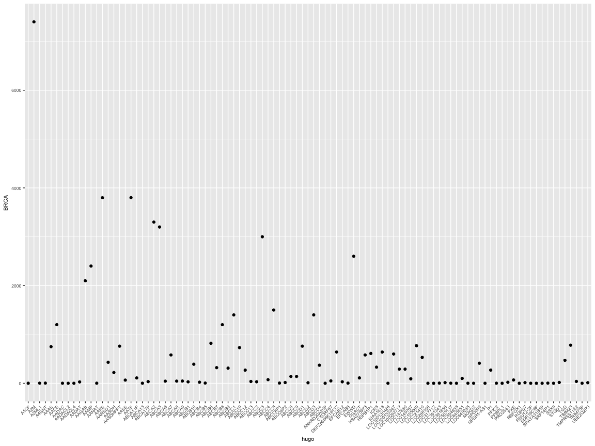
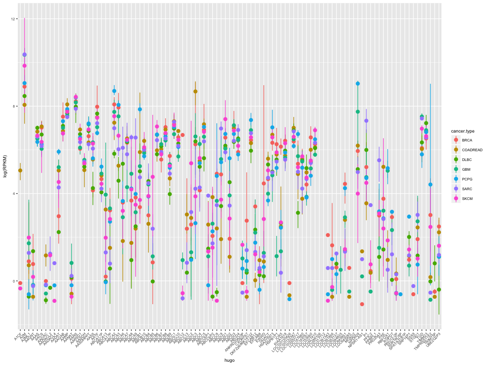

stat545-hw04-thibodeau-mylinh
================
My Linh Thibodeau
2017-10-07

``` r
suppressPackageStartupMessages(library(tidyverse))
```

    ## Warning: package 'dplyr' was built under R version 3.4.2

``` r
knitr::opts_chunk$set(fig.width=12, fig.height=9)
library(knitr)
library(kableExtra)
options(knitr.table.format = "html")
#install.packages("scales")
library(scales)
```

    ## 
    ## Attaching package: 'scales'

    ## The following object is masked from 'package:purrr':
    ## 
    ##     discard

    ## The following object is masked from 'package:readr':
    ## 
    ##     col_factor

``` r
#install.packages("tidygenomics")
library(tidygenomics)
```

Genomic dataset - A few clarifications
======================================

Vincenzo Coia has approved my request to use published genomic data for the next assignments, therefore, I want to provide a few clarifications:

-   I have tried to introduce some basic explanations about the genomic dataset, but obviously, this is not a genetics course and my objective is to explore and learn how to use R and its packages, not to teach complex notions of cancer genomic analysis. Therefore, I don't expect people to understand what the data and plots represent if they haven't studied in related fields.

SOURCES OF DATA: The Cancer Genome Atlas (TCGA) and ClinVar
-----------------------------------------------------------

After trying to complete this homework with the genomic data previously used in [homework 3](https://github.com/mylinhthibodeau/STAT545-HW-thibodeau-mylinh/tree/master/stat545-hw3-thibodeau-mylinh), I realized that it was impossible for me to do some of the exercises because I didn't have the right "data.frame" format for it.

*The Cancer Genome Atlas (TCGA)*
The results shown here are in whole or part based upon data generated by the TCGA Research Network: <http://cancergenome.nih.gov/>.

Genomic datasets are available through the cBioportal [here](http://www.cbioportal.org/data_sets.jsp)

*ClinVar* The results shown here are in whole or part based upon the data generated by the NCBI ClinVar data portal: <https://www.ncbi.nlm.nih.gov/clinvar/>

The ClinVar genomic variant dataset is publicly available [here](ftp://ftp.ncbi.nlm.nih.gov/pub/clinvar/tab_delimited/). If you would like more information on the type of files available, please read this [primer](https://www.ncbi.nlm.nih.gov/clinvar/docs/ftp_primer/) on the topic.

Setting up the data
===================

Getting the data ready
----------------------

Let's select some RNAseq (gene expression) cancers datasets from TCGA:

-   brca: breast cancer
-   gbm: glioblastoma
-   pcpg: pheochromocytome-paraganglioma
-   sarc: sarcoma
-   skcm: skin cutaneous melanoma
-   coadread: colorectal adenocarcinoma
-   dlbc: diffuse large B-cell lymphoma

I will only select 50 genes (nrows = 100) for each dataset, because there are way to many genes (18000-20000) to keep them all, and also, we will only select 3 samples per cancer type (\[ ,c(1,3,4,5)\]):

``` r
brca_rna <- read.table("/Users/mylinh/Documents/published_data/tcga/brca/tcga/data_RNA_Seq_v2_expression_median.txt", header = TRUE, nrows =100)[ ,c(1,3,4,5)]
colnames(brca_rna) <- c("hugo", "brca.s1", "brca.s2", "brca.s3")
brca_rna <- brca_rna[!duplicated(brca_rna$hugo), ]
brca_rna$cancer.type <- "BRCA"
View(brca_rna)

gbm_rna <- read.table("/Users/mylinh/Documents/published_data/tcga/gbm/tcga/data_RNA_Seq_v2_expression_median.txt", header = TRUE, nrows =100)[, c(1,3,4,5)]
colnames(gbm_rna) <- c("hugo", "gbm.s1", "gbm.s2", "gbm.s3")
gbm_rna <- gbm_rna[!duplicated(gbm_rna$hugo), ]
gbm_rna$cancer.type <- "GBM"
#View(gbm_rna)

pcpg_rna <- read.table("/Users/mylinh/Documents/published_data/tcga/pcpg/tcga/data_RNA_Seq_v2_expression_median.txt", header = TRUE, nrows =100)[, c(1,3,4,5)]
colnames(pcpg_rna) <- c("hugo", "pcpg.s1", "pcpg.s2", "pcpg.s3")
pcpg_rna <- pcpg_rna[!duplicated(pcpg_rna$hugo), ]
pcpg_rna$cancer.type <- "PCPG"
#View(pcpg_rna)

sarc_rna <- read.table("/Users/mylinh/Documents/published_data/tcga/sarc/tcga/data_RNA_Seq_v2_expression_median.txt", header = TRUE, nrows =100)[, c(1,3,4,5)]
colnames(sarc_rna) <- c("hugo", "sarc.s1", "sarc.s2", "sarc.s3")
sarc_rna <- sarc_rna[!duplicated(sarc_rna$hugo), ]
sarc_rna$cancer.type <- "SARC"
#View(sarc_rna)

skcm_rna <- read.table("/Users/mylinh/Documents/published_data/tcga/skcm/tcga/data_RNA_Seq_v2_expression_median.txt", header = TRUE, nrows =100)[, c(1,3,4,5)]
colnames(skcm_rna) <- c("hugo", "skcm.s1", "skcm.s2", "skcm.s3")
skcm_rna <- skcm_rna[!duplicated(skcm_rna$hugo), ]
skcm_rna$cancer.type <- "SKCM"
#View(skcm_rna)

coadread_rna <- read.table("/Users/mylinh/Documents/published_data/tcga/coadread/tcga/data_RNA_Seq_v2_expression_median.txt", header = TRUE, nrows =100)[, c(1,3,4,5)]
colnames(coadread_rna) <- c("hugo", "coadread.s1", "coadread.s2", "coadread.s3")
coadread_rna <- coadread_rna[!duplicated(coadread_rna$hugo), ]
coadread_rna$cancer.type <- "COADREAD"
#View(coadread_rna)

dlbc_rna <- read.table("/Users/mylinh/Documents/published_data/tcga/dlbc/tcga/data_RNA_Seq_v2_expression_median.txt", header = TRUE, nrows =100)[, c(1,3,4,5)]
colnames(dlbc_rna) <- c("hugo", "dlbc.s1", "dlbc.s2", "dlbc.s3")
dlbc_rna <- dlbc_rna[!duplicated(dlbc_rna$hugo), ]
dlbc_rna$cancer.type <- "DLBC"
#View(dlbc_rna)
```

Note1. I populated one additional column per dataset with the cancer.type as this will represent my "gapminder$continent" value later on. I tried the technique explained on [computer world here](https://www.computerworld.com/article/2486425/business-intelligence/business-intelligence-4-data-wrangling-tasks-in-r-for-advanced-beginners.html), and although it didn't work out, it gave me the idea of creating a new column "cancer.type" with a single value for the specific cancer. Note2. I found a way of selecting specific columns in read.table with [this stackoverflow dicussion](https://stackoverflow.com/questions/5788117/only-read-limited-number-of-columns) and [this stackexchange discussion](https://stats.stackexchange.com/questions/16796/reading-only-two-out-of-three-columns-with-read-csv). Note3. After experiencing issues later on in this homework, I had to remove the hugo genes that had 2 or more values for the same cancer sample. I needed to have only one gene-sample key for the spread() function to workout. I found the information about how to remove duplicate [here](https://stackoverflow.com/questions/13279582/select-only-the-first-rows-for-each-unique-value-of-a-column-in-r)

General data reshaping and relationship to aggregation
======================================================

Activity \#1 - Make your own cheetsheet
---------------------------------------

*Make you own cheatsheet similar to Tyler Rinker’s [minimal guide to tidyr](https://github.com/trinker/tidyr_in_a_nutshell).*

I also like this [Data Wrangling with dplyr and tidyr cheat sheet](https://www.rstudio.com/wp-content/uploads/2015/02/data-wrangling-cheatsheet.pdf).

I found a few tutorials that I liked as well:

-   University of Virginia: [A tidyr Tutorial](http://data.library.virginia.edu/a-tidyr-tutorial/)
-   RPubs of RStudio: [Data Processing with dplyr & tidyr](https://rpubs.com/bradleyboehmke/data_wrangling) by Brad Boehmke
-   Tidyverse website: [tidyr article](http://tidyr.tidyverse.org/)

### GATHER: From horizontal (wide) to vertical (longer)

According the the Help of RStudio, the gather() function is a way to take columns that are not variables and collapse multiple columns to key-value pairs.

For my type of data, I think gather() will be useful when I realize that a group of columns actually represent the same variable and therefore, they should be "stacked on top of each other" () rather than in adjacent columns. As Hadley Wickham said in his [Introducing tidyr blog](https://blog.rstudio.com/2014/07/22/introducing-tidyr/),the most important for tidy data is that each column is a variable and each row is an observation.

Let's take a look at the brca\_rna data:

``` r
brca_rna %>%
  head(50) %>%
  kable("html") %>% kable_styling()
```

<table class="table" style="margin-left: auto; margin-right: auto;">
<thead>
<tr>
<th style="text-align:left;">
</th>
<th style="text-align:left;">
hugo
</th>
<th style="text-align:right;">
brca.s1
</th>
<th style="text-align:right;">
brca.s2
</th>
<th style="text-align:right;">
brca.s3
</th>
<th style="text-align:left;">
cancer.type
</th>
</tr>
</thead>
<tbody>
<tr>
<td style="text-align:left;">
1
</td>
<td style="text-align:left;">
LOC100130426
</td>
<td style="text-align:right;">
0.0000
</td>
<td style="text-align:right;">
0.0000
</td>
<td style="text-align:right;">
0.9066
</td>
<td style="text-align:left;">
BRCA
</td>
</tr>
<tr>
<td style="text-align:left;">
2
</td>
<td style="text-align:left;">
UBE2Q2P3
</td>
<td style="text-align:right;">
16.3644
</td>
<td style="text-align:right;">
9.2659
</td>
<td style="text-align:right;">
11.6228
</td>
<td style="text-align:left;">
BRCA
</td>
</tr>
<tr>
<td style="text-align:left;">
4
</td>
<td style="text-align:left;">
LOC149767
</td>
<td style="text-align:right;">
52.1503
</td>
<td style="text-align:right;">
69.7553
</td>
<td style="text-align:right;">
154.2974
</td>
<td style="text-align:left;">
BRCA
</td>
</tr>
<tr>
<td style="text-align:left;">
5
</td>
<td style="text-align:left;">
TIMM23
</td>
<td style="text-align:right;">
408.0760
</td>
<td style="text-align:right;">
563.8934
</td>
<td style="text-align:right;">
1360.8341
</td>
<td style="text-align:left;">
BRCA
</td>
</tr>
<tr>
<td style="text-align:left;">
6
</td>
<td style="text-align:left;">
MOXD2
</td>
<td style="text-align:right;">
0.0000
</td>
<td style="text-align:right;">
0.0000
</td>
<td style="text-align:right;">
0.0000
</td>
<td style="text-align:left;">
BRCA
</td>
</tr>
<tr>
<td style="text-align:left;">
7
</td>
<td style="text-align:left;">
LOC155060
</td>
<td style="text-align:right;">
1187.0050
</td>
<td style="text-align:right;">
516.0413
</td>
<td style="text-align:right;">
592.0218
</td>
<td style="text-align:left;">
BRCA
</td>
</tr>
<tr>
<td style="text-align:left;">
8
</td>
<td style="text-align:left;">
RNU12-2P
</td>
<td style="text-align:right;">
0.0000
</td>
<td style="text-align:right;">
1.0875
</td>
<td style="text-align:right;">
0.0000
</td>
<td style="text-align:left;">
BRCA
</td>
</tr>
<tr>
<td style="text-align:left;">
9
</td>
<td style="text-align:left;">
SSX9
</td>
<td style="text-align:right;">
0.0000
</td>
<td style="text-align:right;">
0.5438
</td>
<td style="text-align:right;">
0.0000
</td>
<td style="text-align:left;">
BRCA
</td>
</tr>
<tr>
<td style="text-align:left;">
10
</td>
<td style="text-align:left;">
LOC317712
</td>
<td style="text-align:right;">
0.0000
</td>
<td style="text-align:right;">
0.0000
</td>
<td style="text-align:right;">
0.0000
</td>
<td style="text-align:left;">
BRCA
</td>
</tr>
<tr>
<td style="text-align:left;">
11
</td>
<td style="text-align:left;">
CXORF67
</td>
<td style="text-align:right;">
1.7233
</td>
<td style="text-align:right;">
144.1001
</td>
<td style="text-align:right;">
0.0000
</td>
<td style="text-align:left;">
BRCA
</td>
</tr>
<tr>
<td style="text-align:left;">
12
</td>
<td style="text-align:left;">
EFCAB8
</td>
<td style="text-align:right;">
0.3447
</td>
<td style="text-align:right;">
4.8940
</td>
<td style="text-align:right;">
2.7199
</td>
<td style="text-align:left;">
BRCA
</td>
</tr>
<tr>
<td style="text-align:left;">
13
</td>
<td style="text-align:left;">
SRP14P1
</td>
<td style="text-align:right;">
4.1359
</td>
<td style="text-align:right;">
1.6313
</td>
<td style="text-align:right;">
2.7199
</td>
<td style="text-align:left;">
BRCA
</td>
</tr>
<tr>
<td style="text-align:left;">
14
</td>
<td style="text-align:left;">
LOC391343
</td>
<td style="text-align:right;">
0.0000
</td>
<td style="text-align:right;">
8.1566
</td>
<td style="text-align:right;">
0.0000
</td>
<td style="text-align:left;">
BRCA
</td>
</tr>
<tr>
<td style="text-align:left;">
15
</td>
<td style="text-align:left;">
TRIM75P
</td>
<td style="text-align:right;">
0.6893
</td>
<td style="text-align:right;">
0.5438
</td>
<td style="text-align:right;">
0.0000
</td>
<td style="text-align:left;">
BRCA
</td>
</tr>
<tr>
<td style="text-align:left;">
16
</td>
<td style="text-align:left;">
SPATA31B1P
</td>
<td style="text-align:right;">
0.0000
</td>
<td style="text-align:right;">
0.0000
</td>
<td style="text-align:right;">
0.0000
</td>
<td style="text-align:left;">
BRCA
</td>
</tr>
<tr>
<td style="text-align:left;">
17
</td>
<td style="text-align:left;">
LOC286106
</td>
<td style="text-align:right;">
0.0000
</td>
<td style="text-align:right;">
0.0000
</td>
<td style="text-align:right;">
0.0000
</td>
<td style="text-align:left;">
BRCA
</td>
</tr>
<tr>
<td style="text-align:left;">
18
</td>
<td style="text-align:left;">
SDR16C6P
</td>
<td style="text-align:right;">
0.0000
</td>
<td style="text-align:right;">
0.0000
</td>
<td style="text-align:right;">
0.0000
</td>
<td style="text-align:left;">
BRCA
</td>
</tr>
<tr>
<td style="text-align:left;">
19
</td>
<td style="text-align:left;">
LOC553137
</td>
<td style="text-align:right;">
3.7912
</td>
<td style="text-align:right;">
0.0000
</td>
<td style="text-align:right;">
0.9066
</td>
<td style="text-align:left;">
BRCA
</td>
</tr>
<tr>
<td style="text-align:left;">
20
</td>
<td style="text-align:left;">
KIAA1618
</td>
<td style="text-align:right;">
820.9773
</td>
<td style="text-align:right;">
708.5372
</td>
<td style="text-align:right;">
391.6591
</td>
<td style="text-align:left;">
BRCA
</td>
</tr>
<tr>
<td style="text-align:left;">
21
</td>
<td style="text-align:left;">
LOC645851
</td>
<td style="text-align:right;">
124.4218
</td>
<td style="text-align:right;">
142.4687
</td>
<td style="text-align:right;">
34.4515
</td>
<td style="text-align:left;">
BRCA
</td>
</tr>
<tr>
<td style="text-align:left;">
22
</td>
<td style="text-align:left;">
RGPD7
</td>
<td style="text-align:right;">
25.8494
</td>
<td style="text-align:right;">
13.3388
</td>
<td style="text-align:right;">
0.0000
</td>
<td style="text-align:left;">
BRCA
</td>
</tr>
<tr>
<td style="text-align:left;">
23
</td>
<td style="text-align:left;">
HSPB1P1
</td>
<td style="text-align:right;">
289.5134
</td>
<td style="text-align:right;">
449.7009
</td>
<td style="text-align:right;">
1100.6346
</td>
<td style="text-align:left;">
BRCA
</td>
</tr>
<tr>
<td style="text-align:left;">
24
</td>
<td style="text-align:left;">
PPBPL1
</td>
<td style="text-align:right;">
0.0000
</td>
<td style="text-align:right;">
0.0000
</td>
<td style="text-align:right;">
0.0000
</td>
<td style="text-align:left;">
BRCA
</td>
</tr>
<tr>
<td style="text-align:left;">
25
</td>
<td style="text-align:left;">
LOC594835
</td>
<td style="text-align:right;">
0.0000
</td>
<td style="text-align:right;">
0.0000
</td>
<td style="text-align:right;">
0.0000
</td>
<td style="text-align:left;">
BRCA
</td>
</tr>
<tr>
<td style="text-align:left;">
26
</td>
<td style="text-align:left;">
ANKRD20A20P
</td>
<td style="text-align:right;">
0.0000
</td>
<td style="text-align:right;">
0.0000
</td>
<td style="text-align:right;">
0.9066
</td>
<td style="text-align:left;">
BRCA
</td>
</tr>
<tr>
<td style="text-align:left;">
27
</td>
<td style="text-align:left;">
TMPRSS11E2
</td>
<td style="text-align:right;">
109.6015
</td>
<td style="text-align:right;">
3.8064
</td>
<td style="text-align:right;">
0.0000
</td>
<td style="text-align:left;">
BRCA
</td>
</tr>
<tr>
<td style="text-align:left;">
28
</td>
<td style="text-align:left;">
LOC100132347
</td>
<td style="text-align:right;">
458.3962
</td>
<td style="text-align:right;">
683.5237
</td>
<td style="text-align:right;">
657.2983
</td>
<td style="text-align:left;">
BRCA
</td>
</tr>
<tr>
<td style="text-align:left;">
29
</td>
<td style="text-align:left;">
EFCAB12
</td>
<td style="text-align:right;">
40.6697
</td>
<td style="text-align:right;">
29.9076
</td>
<td style="text-align:right;">
22.6655
</td>
<td style="text-align:left;">
BRCA
</td>
</tr>
<tr>
<td style="text-align:left;">
30
</td>
<td style="text-align:left;">
LOC147680
</td>
<td style="text-align:right;">
197.0897
</td>
<td style="text-align:right;">
237.3844
</td>
<td style="text-align:right;">
423.2366
</td>
<td style="text-align:left;">
BRCA
</td>
</tr>
<tr>
<td style="text-align:left;">
31
</td>
<td style="text-align:left;">
A1CF
</td>
<td style="text-align:right;">
0.0000
</td>
<td style="text-align:right;">
0.0000
</td>
<td style="text-align:right;">
0.9066
</td>
<td style="text-align:left;">
BRCA
</td>
</tr>
<tr>
<td style="text-align:left;">
32
</td>
<td style="text-align:left;">
RBFOX1
</td>
<td style="text-align:right;">
0.0000
</td>
<td style="text-align:right;">
0.0000
</td>
<td style="text-align:right;">
0.0000
</td>
<td style="text-align:left;">
BRCA
</td>
</tr>
<tr>
<td style="text-align:left;">
33
</td>
<td style="text-align:left;">
GGACT
</td>
<td style="text-align:right;">
102.9634
</td>
<td style="text-align:right;">
70.8646
</td>
<td style="text-align:right;">
161.2602
</td>
<td style="text-align:left;">
BRCA
</td>
</tr>
<tr>
<td style="text-align:left;">
34
</td>
<td style="text-align:left;">
A2ML1
</td>
<td style="text-align:right;">
1.3786
</td>
<td style="text-align:right;">
4.3502
</td>
<td style="text-align:right;">
0.0000
</td>
<td style="text-align:left;">
BRCA
</td>
</tr>
<tr>
<td style="text-align:left;">
35
</td>
<td style="text-align:left;">
A2M
</td>
<td style="text-align:right;">
5798.3746
</td>
<td style="text-align:right;">
7571.9793
</td>
<td style="text-align:right;">
8840.3989
</td>
<td style="text-align:left;">
BRCA
</td>
</tr>
<tr>
<td style="text-align:left;">
36
</td>
<td style="text-align:left;">
P1
</td>
<td style="text-align:right;">
68.2424
</td>
<td style="text-align:right;">
157.6944
</td>
<td style="text-align:right;">
573.8894
</td>
<td style="text-align:left;">
BRCA
</td>
</tr>
<tr>
<td style="text-align:left;">
37
</td>
<td style="text-align:left;">
A4GNT
</td>
<td style="text-align:right;">
8.6165
</td>
<td style="text-align:right;">
0.5438
</td>
<td style="text-align:right;">
0.0000
</td>
<td style="text-align:left;">
BRCA
</td>
</tr>
<tr>
<td style="text-align:left;">
38
</td>
<td style="text-align:left;">
NPSR1-AS1
</td>
<td style="text-align:right;">
0.3447
</td>
<td style="text-align:right;">
0.0000
</td>
<td style="text-align:right;">
0.0000
</td>
<td style="text-align:left;">
BRCA
</td>
</tr>
<tr>
<td style="text-align:left;">
39
</td>
<td style="text-align:left;">
AAAS
</td>
<td style="text-align:right;">
649.3372
</td>
<td style="text-align:right;">
887.9826
</td>
<td style="text-align:right;">
723.4814
</td>
<td style="text-align:left;">
BRCA
</td>
</tr>
<tr>
<td style="text-align:left;">
40
</td>
<td style="text-align:left;">
LOC391856
</td>
<td style="text-align:right;">
1.3786
</td>
<td style="text-align:right;">
35.3453
</td>
<td style="text-align:right;">
2.7199
</td>
<td style="text-align:left;">
BRCA
</td>
</tr>
<tr>
<td style="text-align:left;">
41
</td>
<td style="text-align:left;">
AACS
</td>
<td style="text-align:right;">
1087.3986
</td>
<td style="text-align:right;">
836.3241
</td>
<td style="text-align:right;">
1533.0916
</td>
<td style="text-align:left;">
BRCA
</td>
</tr>
<tr>
<td style="text-align:left;">
42
</td>
<td style="text-align:left;">
AADACL2
</td>
<td style="text-align:right;">
0.0000
</td>
<td style="text-align:right;">
0.0000
</td>
<td style="text-align:right;">
0.0000
</td>
<td style="text-align:left;">
BRCA
</td>
</tr>
<tr>
<td style="text-align:left;">
43
</td>
<td style="text-align:left;">
LOC649285
</td>
<td style="text-align:right;">
0.0000
</td>
<td style="text-align:right;">
0.0000
</td>
<td style="text-align:right;">
1.8132
</td>
<td style="text-align:left;">
BRCA
</td>
</tr>
<tr>
<td style="text-align:left;">
44
</td>
<td style="text-align:left;">
AADACL4
</td>
<td style="text-align:right;">
0.0000
</td>
<td style="text-align:right;">
0.0000
</td>
<td style="text-align:right;">
0.0000
</td>
<td style="text-align:left;">
BRCA
</td>
</tr>
<tr>
<td style="text-align:left;">
45
</td>
<td style="text-align:left;">
AADAC
</td>
<td style="text-align:right;">
0.0000
</td>
<td style="text-align:right;">
1.0875
</td>
<td style="text-align:right;">
0.9066
</td>
<td style="text-align:left;">
BRCA
</td>
</tr>
<tr>
<td style="text-align:left;">
46
</td>
<td style="text-align:left;">
AADAT
</td>
<td style="text-align:right;">
5.5145
</td>
<td style="text-align:right;">
24.4698
</td>
<td style="text-align:right;">
53.4905
</td>
<td style="text-align:left;">
BRCA
</td>
</tr>
<tr>
<td style="text-align:left;">
47
</td>
<td style="text-align:left;">
AAGAB
</td>
<td style="text-align:right;">
1300.3977
</td>
<td style="text-align:right;">
3541.0549
</td>
<td style="text-align:right;">
1360.8341
</td>
<td style="text-align:left;">
BRCA
</td>
</tr>
<tr>
<td style="text-align:left;">
48
</td>
<td style="text-align:left;">
DKFZp686K16132
</td>
<td style="text-align:right;">
517.3329
</td>
<td style="text-align:right;">
848.2871
</td>
<td style="text-align:right;">
568.4497
</td>
<td style="text-align:left;">
BRCA
</td>
</tr>
<tr>
<td style="text-align:left;">
49
</td>
<td style="text-align:left;">
AAMP
</td>
<td style="text-align:right;">
2053.1326
</td>
<td style="text-align:right;">
2979.8804
</td>
<td style="text-align:right;">
2291.9311
</td>
<td style="text-align:left;">
BRCA
</td>
</tr>
<tr>
<td style="text-align:left;">
50
</td>
<td style="text-align:left;">
AANAT
</td>
<td style="text-align:right;">
0.3447
</td>
<td style="text-align:right;">
2.1751
</td>
<td style="text-align:right;">
1.8132
</td>
<td style="text-align:left;">
BRCA
</td>
</tr>
<tr>
<td style="text-align:left;">
51
</td>
<td style="text-align:left;">
LOC221410
</td>
<td style="text-align:right;">
689.8967
</td>
<td style="text-align:right;">
472.5014
</td>
<td style="text-align:right;">
439.7099
</td>
<td style="text-align:left;">
BRCA
</td>
</tr>
</tbody>
</table>
The TCGA RNAseq datasets are perfect for this exercise, because the columns in each dataset represent a different sample, and therefore, they are actually different obversations. I will start by making new "gathered" data.frame.

``` r
brca_rna_gather <- brca_rna %>%
  gather(key = sample, value = RPKM, brca.s1, brca.s2, brca.s3)
#View(brca_rna_gather)
gbm_rna_gather <- gbm_rna %>%
  gather(key=sample, value = RPKM, gbm.s1, gbm.s2, gbm.s3)
pcpg_rna_gather <- pcpg_rna %>%
  gather(key = sample, value = RPKM, pcpg.s1, pcpg.s2, pcpg.s3)
sarc_rna_gather <- sarc_rna %>%
  gather(key=sample, value = RPKM, sarc.s1, sarc.s2, sarc.s3)
skcm_rna_gather <- skcm_rna %>%
  gather(key = sample, value = RPKM, skcm.s1, skcm.s2, skcm.s3)
coadread_rna_gather <- coadread_rna %>%
  gather(key = sample, value = RPKM, coadread.s1, coadread.s2, coadread.s3)
dlbc_rna_gather <- dlbc_rna %>%
  gather(key =sample, value = RPKM, dlbc.s1, dlbc.s2, dlbc.s3)
```

And now, if we take the same brca data, but the after using the gather() function:

``` r
brca_rna_gather %>%
  head(50) %>%
  kable("html") %>% kable_styling()
```

<table class="table" style="margin-left: auto; margin-right: auto;">
<thead>
<tr>
<th style="text-align:left;">
hugo
</th>
<th style="text-align:left;">
cancer.type
</th>
<th style="text-align:left;">
sample
</th>
<th style="text-align:right;">
RPKM
</th>
</tr>
</thead>
<tbody>
<tr>
<td style="text-align:left;">
LOC100130426
</td>
<td style="text-align:left;">
BRCA
</td>
<td style="text-align:left;">
brca.s1
</td>
<td style="text-align:right;">
0.0000
</td>
</tr>
<tr>
<td style="text-align:left;">
UBE2Q2P3
</td>
<td style="text-align:left;">
BRCA
</td>
<td style="text-align:left;">
brca.s1
</td>
<td style="text-align:right;">
16.3644
</td>
</tr>
<tr>
<td style="text-align:left;">
LOC149767
</td>
<td style="text-align:left;">
BRCA
</td>
<td style="text-align:left;">
brca.s1
</td>
<td style="text-align:right;">
52.1503
</td>
</tr>
<tr>
<td style="text-align:left;">
TIMM23
</td>
<td style="text-align:left;">
BRCA
</td>
<td style="text-align:left;">
brca.s1
</td>
<td style="text-align:right;">
408.0760
</td>
</tr>
<tr>
<td style="text-align:left;">
MOXD2
</td>
<td style="text-align:left;">
BRCA
</td>
<td style="text-align:left;">
brca.s1
</td>
<td style="text-align:right;">
0.0000
</td>
</tr>
<tr>
<td style="text-align:left;">
LOC155060
</td>
<td style="text-align:left;">
BRCA
</td>
<td style="text-align:left;">
brca.s1
</td>
<td style="text-align:right;">
1187.0050
</td>
</tr>
<tr>
<td style="text-align:left;">
RNU12-2P
</td>
<td style="text-align:left;">
BRCA
</td>
<td style="text-align:left;">
brca.s1
</td>
<td style="text-align:right;">
0.0000
</td>
</tr>
<tr>
<td style="text-align:left;">
SSX9
</td>
<td style="text-align:left;">
BRCA
</td>
<td style="text-align:left;">
brca.s1
</td>
<td style="text-align:right;">
0.0000
</td>
</tr>
<tr>
<td style="text-align:left;">
LOC317712
</td>
<td style="text-align:left;">
BRCA
</td>
<td style="text-align:left;">
brca.s1
</td>
<td style="text-align:right;">
0.0000
</td>
</tr>
<tr>
<td style="text-align:left;">
CXORF67
</td>
<td style="text-align:left;">
BRCA
</td>
<td style="text-align:left;">
brca.s1
</td>
<td style="text-align:right;">
1.7233
</td>
</tr>
<tr>
<td style="text-align:left;">
EFCAB8
</td>
<td style="text-align:left;">
BRCA
</td>
<td style="text-align:left;">
brca.s1
</td>
<td style="text-align:right;">
0.3447
</td>
</tr>
<tr>
<td style="text-align:left;">
SRP14P1
</td>
<td style="text-align:left;">
BRCA
</td>
<td style="text-align:left;">
brca.s1
</td>
<td style="text-align:right;">
4.1359
</td>
</tr>
<tr>
<td style="text-align:left;">
LOC391343
</td>
<td style="text-align:left;">
BRCA
</td>
<td style="text-align:left;">
brca.s1
</td>
<td style="text-align:right;">
0.0000
</td>
</tr>
<tr>
<td style="text-align:left;">
TRIM75P
</td>
<td style="text-align:left;">
BRCA
</td>
<td style="text-align:left;">
brca.s1
</td>
<td style="text-align:right;">
0.6893
</td>
</tr>
<tr>
<td style="text-align:left;">
SPATA31B1P
</td>
<td style="text-align:left;">
BRCA
</td>
<td style="text-align:left;">
brca.s1
</td>
<td style="text-align:right;">
0.0000
</td>
</tr>
<tr>
<td style="text-align:left;">
LOC286106
</td>
<td style="text-align:left;">
BRCA
</td>
<td style="text-align:left;">
brca.s1
</td>
<td style="text-align:right;">
0.0000
</td>
</tr>
<tr>
<td style="text-align:left;">
SDR16C6P
</td>
<td style="text-align:left;">
BRCA
</td>
<td style="text-align:left;">
brca.s1
</td>
<td style="text-align:right;">
0.0000
</td>
</tr>
<tr>
<td style="text-align:left;">
LOC553137
</td>
<td style="text-align:left;">
BRCA
</td>
<td style="text-align:left;">
brca.s1
</td>
<td style="text-align:right;">
3.7912
</td>
</tr>
<tr>
<td style="text-align:left;">
KIAA1618
</td>
<td style="text-align:left;">
BRCA
</td>
<td style="text-align:left;">
brca.s1
</td>
<td style="text-align:right;">
820.9773
</td>
</tr>
<tr>
<td style="text-align:left;">
LOC645851
</td>
<td style="text-align:left;">
BRCA
</td>
<td style="text-align:left;">
brca.s1
</td>
<td style="text-align:right;">
124.4218
</td>
</tr>
<tr>
<td style="text-align:left;">
RGPD7
</td>
<td style="text-align:left;">
BRCA
</td>
<td style="text-align:left;">
brca.s1
</td>
<td style="text-align:right;">
25.8494
</td>
</tr>
<tr>
<td style="text-align:left;">
HSPB1P1
</td>
<td style="text-align:left;">
BRCA
</td>
<td style="text-align:left;">
brca.s1
</td>
<td style="text-align:right;">
289.5134
</td>
</tr>
<tr>
<td style="text-align:left;">
PPBPL1
</td>
<td style="text-align:left;">
BRCA
</td>
<td style="text-align:left;">
brca.s1
</td>
<td style="text-align:right;">
0.0000
</td>
</tr>
<tr>
<td style="text-align:left;">
LOC594835
</td>
<td style="text-align:left;">
BRCA
</td>
<td style="text-align:left;">
brca.s1
</td>
<td style="text-align:right;">
0.0000
</td>
</tr>
<tr>
<td style="text-align:left;">
ANKRD20A20P
</td>
<td style="text-align:left;">
BRCA
</td>
<td style="text-align:left;">
brca.s1
</td>
<td style="text-align:right;">
0.0000
</td>
</tr>
<tr>
<td style="text-align:left;">
TMPRSS11E2
</td>
<td style="text-align:left;">
BRCA
</td>
<td style="text-align:left;">
brca.s1
</td>
<td style="text-align:right;">
109.6015
</td>
</tr>
<tr>
<td style="text-align:left;">
LOC100132347
</td>
<td style="text-align:left;">
BRCA
</td>
<td style="text-align:left;">
brca.s1
</td>
<td style="text-align:right;">
458.3962
</td>
</tr>
<tr>
<td style="text-align:left;">
EFCAB12
</td>
<td style="text-align:left;">
BRCA
</td>
<td style="text-align:left;">
brca.s1
</td>
<td style="text-align:right;">
40.6697
</td>
</tr>
<tr>
<td style="text-align:left;">
LOC147680
</td>
<td style="text-align:left;">
BRCA
</td>
<td style="text-align:left;">
brca.s1
</td>
<td style="text-align:right;">
197.0897
</td>
</tr>
<tr>
<td style="text-align:left;">
A1CF
</td>
<td style="text-align:left;">
BRCA
</td>
<td style="text-align:left;">
brca.s1
</td>
<td style="text-align:right;">
0.0000
</td>
</tr>
<tr>
<td style="text-align:left;">
RBFOX1
</td>
<td style="text-align:left;">
BRCA
</td>
<td style="text-align:left;">
brca.s1
</td>
<td style="text-align:right;">
0.0000
</td>
</tr>
<tr>
<td style="text-align:left;">
GGACT
</td>
<td style="text-align:left;">
BRCA
</td>
<td style="text-align:left;">
brca.s1
</td>
<td style="text-align:right;">
102.9634
</td>
</tr>
<tr>
<td style="text-align:left;">
A2ML1
</td>
<td style="text-align:left;">
BRCA
</td>
<td style="text-align:left;">
brca.s1
</td>
<td style="text-align:right;">
1.3786
</td>
</tr>
<tr>
<td style="text-align:left;">
A2M
</td>
<td style="text-align:left;">
BRCA
</td>
<td style="text-align:left;">
brca.s1
</td>
<td style="text-align:right;">
5798.3746
</td>
</tr>
<tr>
<td style="text-align:left;">
P1
</td>
<td style="text-align:left;">
BRCA
</td>
<td style="text-align:left;">
brca.s1
</td>
<td style="text-align:right;">
68.2424
</td>
</tr>
<tr>
<td style="text-align:left;">
A4GNT
</td>
<td style="text-align:left;">
BRCA
</td>
<td style="text-align:left;">
brca.s1
</td>
<td style="text-align:right;">
8.6165
</td>
</tr>
<tr>
<td style="text-align:left;">
NPSR1-AS1
</td>
<td style="text-align:left;">
BRCA
</td>
<td style="text-align:left;">
brca.s1
</td>
<td style="text-align:right;">
0.3447
</td>
</tr>
<tr>
<td style="text-align:left;">
AAAS
</td>
<td style="text-align:left;">
BRCA
</td>
<td style="text-align:left;">
brca.s1
</td>
<td style="text-align:right;">
649.3372
</td>
</tr>
<tr>
<td style="text-align:left;">
LOC391856
</td>
<td style="text-align:left;">
BRCA
</td>
<td style="text-align:left;">
brca.s1
</td>
<td style="text-align:right;">
1.3786
</td>
</tr>
<tr>
<td style="text-align:left;">
AACS
</td>
<td style="text-align:left;">
BRCA
</td>
<td style="text-align:left;">
brca.s1
</td>
<td style="text-align:right;">
1087.3986
</td>
</tr>
<tr>
<td style="text-align:left;">
AADACL2
</td>
<td style="text-align:left;">
BRCA
</td>
<td style="text-align:left;">
brca.s1
</td>
<td style="text-align:right;">
0.0000
</td>
</tr>
<tr>
<td style="text-align:left;">
LOC649285
</td>
<td style="text-align:left;">
BRCA
</td>
<td style="text-align:left;">
brca.s1
</td>
<td style="text-align:right;">
0.0000
</td>
</tr>
<tr>
<td style="text-align:left;">
AADACL4
</td>
<td style="text-align:left;">
BRCA
</td>
<td style="text-align:left;">
brca.s1
</td>
<td style="text-align:right;">
0.0000
</td>
</tr>
<tr>
<td style="text-align:left;">
AADAC
</td>
<td style="text-align:left;">
BRCA
</td>
<td style="text-align:left;">
brca.s1
</td>
<td style="text-align:right;">
0.0000
</td>
</tr>
<tr>
<td style="text-align:left;">
AADAT
</td>
<td style="text-align:left;">
BRCA
</td>
<td style="text-align:left;">
brca.s1
</td>
<td style="text-align:right;">
5.5145
</td>
</tr>
<tr>
<td style="text-align:left;">
AAGAB
</td>
<td style="text-align:left;">
BRCA
</td>
<td style="text-align:left;">
brca.s1
</td>
<td style="text-align:right;">
1300.3977
</td>
</tr>
<tr>
<td style="text-align:left;">
DKFZp686K16132
</td>
<td style="text-align:left;">
BRCA
</td>
<td style="text-align:left;">
brca.s1
</td>
<td style="text-align:right;">
517.3329
</td>
</tr>
<tr>
<td style="text-align:left;">
AAMP
</td>
<td style="text-align:left;">
BRCA
</td>
<td style="text-align:left;">
brca.s1
</td>
<td style="text-align:right;">
2053.1326
</td>
</tr>
<tr>
<td style="text-align:left;">
AANAT
</td>
<td style="text-align:left;">
BRCA
</td>
<td style="text-align:left;">
brca.s1
</td>
<td style="text-align:right;">
0.3447
</td>
</tr>
<tr>
<td style="text-align:left;">
LOC221410
</td>
<td style="text-align:left;">
BRCA
</td>
<td style="text-align:left;">
brca.s1
</td>
<td style="text-align:right;">
689.8967
</td>
</tr>
</tbody>
</table>
### SPREAD: From vertical (longer) to horizontal (wide)

In order to revert back to the original format of the data, I can use the same key:value pairing in the spread() function. For example, the following code's output is the original data format since gather() and spread() are mirror functions from each other.

``` r
brca_rna %>%
  gather(key = sample, value = RPKM, brca.s1, brca.s2, brca.s3) %>%
  spread(key=sample, value=RPKM) %>%
  head(50) %>%
  kable("html") %>% kable_styling()
```

<table class="table" style="margin-left: auto; margin-right: auto;">
<thead>
<tr>
<th style="text-align:left;">
hugo
</th>
<th style="text-align:left;">
cancer.type
</th>
<th style="text-align:right;">
brca.s1
</th>
<th style="text-align:right;">
brca.s2
</th>
<th style="text-align:right;">
brca.s3
</th>
</tr>
</thead>
<tbody>
<tr>
<td style="text-align:left;">
A1CF
</td>
<td style="text-align:left;">
BRCA
</td>
<td style="text-align:right;">
0.0000
</td>
<td style="text-align:right;">
0.0000
</td>
<td style="text-align:right;">
0.9066
</td>
</tr>
<tr>
<td style="text-align:left;">
A2M
</td>
<td style="text-align:left;">
BRCA
</td>
<td style="text-align:right;">
5798.3746
</td>
<td style="text-align:right;">
7571.9793
</td>
<td style="text-align:right;">
8840.3989
</td>
</tr>
<tr>
<td style="text-align:left;">
A2ML1
</td>
<td style="text-align:left;">
BRCA
</td>
<td style="text-align:right;">
1.3786
</td>
<td style="text-align:right;">
4.3502
</td>
<td style="text-align:right;">
0.0000
</td>
</tr>
<tr>
<td style="text-align:left;">
A4GNT
</td>
<td style="text-align:left;">
BRCA
</td>
<td style="text-align:right;">
8.6165
</td>
<td style="text-align:right;">
0.5438
</td>
<td style="text-align:right;">
0.0000
</td>
</tr>
<tr>
<td style="text-align:left;">
AAAS
</td>
<td style="text-align:left;">
BRCA
</td>
<td style="text-align:right;">
649.3372
</td>
<td style="text-align:right;">
887.9826
</td>
<td style="text-align:right;">
723.4814
</td>
</tr>
<tr>
<td style="text-align:left;">
AACS
</td>
<td style="text-align:left;">
BRCA
</td>
<td style="text-align:right;">
1087.3986
</td>
<td style="text-align:right;">
836.3241
</td>
<td style="text-align:right;">
1533.0916
</td>
</tr>
<tr>
<td style="text-align:left;">
AADAC
</td>
<td style="text-align:left;">
BRCA
</td>
<td style="text-align:right;">
0.0000
</td>
<td style="text-align:right;">
1.0875
</td>
<td style="text-align:right;">
0.9066
</td>
</tr>
<tr>
<td style="text-align:left;">
AADACL2
</td>
<td style="text-align:left;">
BRCA
</td>
<td style="text-align:right;">
0.0000
</td>
<td style="text-align:right;">
0.0000
</td>
<td style="text-align:right;">
0.0000
</td>
</tr>
<tr>
<td style="text-align:left;">
AADACL4
</td>
<td style="text-align:left;">
BRCA
</td>
<td style="text-align:right;">
0.0000
</td>
<td style="text-align:right;">
0.0000
</td>
<td style="text-align:right;">
0.0000
</td>
</tr>
<tr>
<td style="text-align:left;">
AADAT
</td>
<td style="text-align:left;">
BRCA
</td>
<td style="text-align:right;">
5.5145
</td>
<td style="text-align:right;">
24.4698
</td>
<td style="text-align:right;">
53.4905
</td>
</tr>
<tr>
<td style="text-align:left;">
AAGAB
</td>
<td style="text-align:left;">
BRCA
</td>
<td style="text-align:right;">
1300.3977
</td>
<td style="text-align:right;">
3541.0549
</td>
<td style="text-align:right;">
1360.8341
</td>
</tr>
<tr>
<td style="text-align:left;">
AAMP
</td>
<td style="text-align:left;">
BRCA
</td>
<td style="text-align:right;">
2053.1326
</td>
<td style="text-align:right;">
2979.8804
</td>
<td style="text-align:right;">
2291.9311
</td>
</tr>
<tr>
<td style="text-align:left;">
AANAT
</td>
<td style="text-align:left;">
BRCA
</td>
<td style="text-align:right;">
0.3447
</td>
<td style="text-align:right;">
2.1751
</td>
<td style="text-align:right;">
1.8132
</td>
</tr>
<tr>
<td style="text-align:left;">
AARS
</td>
<td style="text-align:left;">
BRCA
</td>
<td style="text-align:right;">
4409.5650
</td>
<td style="text-align:right;">
4570.9625
</td>
<td style="text-align:right;">
2556.6636
</td>
</tr>
<tr>
<td style="text-align:left;">
AARSD1
</td>
<td style="text-align:left;">
BRCA
</td>
<td style="text-align:right;">
466.6680
</td>
<td style="text-align:right;">
418.7058
</td>
<td style="text-align:right;">
390.7525
</td>
</tr>
<tr>
<td style="text-align:left;">
AASDH
</td>
<td style="text-align:left;">
BRCA
</td>
<td style="text-align:right;">
277.4504
</td>
<td style="text-align:right;">
184.3393
</td>
<td style="text-align:right;">
190.3898
</td>
</tr>
<tr>
<td style="text-align:left;">
AASDHPPT
</td>
<td style="text-align:left;">
BRCA
</td>
<td style="text-align:right;">
808.9143
</td>
<td style="text-align:right;">
678.6297
</td>
<td style="text-align:right;">
779.6917
</td>
</tr>
<tr>
<td style="text-align:left;">
AASS
</td>
<td style="text-align:left;">
BRCA
</td>
<td style="text-align:right;">
45.8396
</td>
<td style="text-align:right;">
71.7781
</td>
<td style="text-align:right;">
76.1559
</td>
</tr>
<tr>
<td style="text-align:left;">
AATF
</td>
<td style="text-align:left;">
BRCA
</td>
<td style="text-align:right;">
1518.9114
</td>
<td style="text-align:right;">
7649.2659
</td>
<td style="text-align:right;">
2097.9148
</td>
</tr>
<tr>
<td style="text-align:left;">
ABCA11P
</td>
<td style="text-align:left;">
BRCA
</td>
<td style="text-align:right;">
79.1509
</td>
<td style="text-align:right;">
96.0903
</td>
<td style="text-align:right;">
156.0199
</td>
</tr>
<tr>
<td style="text-align:left;">
ABCA13
</td>
<td style="text-align:left;">
BRCA
</td>
<td style="text-align:right;">
0.0000
</td>
<td style="text-align:right;">
1.6313
</td>
<td style="text-align:right;">
0.9066
</td>
</tr>
<tr>
<td style="text-align:left;">
ABCA17P
</td>
<td style="text-align:left;">
BRCA
</td>
<td style="text-align:right;">
17.9223
</td>
<td style="text-align:right;">
70.6906
</td>
<td style="text-align:right;">
12.6927
</td>
</tr>
<tr>
<td style="text-align:left;">
ABCA2
</td>
<td style="text-align:left;">
BRCA
</td>
<td style="text-align:right;">
4507.4481
</td>
<td style="text-align:right;">
2330.0707
</td>
<td style="text-align:right;">
3208.5222
</td>
</tr>
<tr>
<td style="text-align:left;">
ABCA3
</td>
<td style="text-align:left;">
BRCA
</td>
<td style="text-align:right;">
5470.7695
</td>
<td style="text-align:right;">
2656.8787
</td>
<td style="text-align:right;">
1514.0526
</td>
</tr>
<tr>
<td style="text-align:left;">
ABCA6
</td>
<td style="text-align:left;">
BRCA
</td>
<td style="text-align:right;">
23.0921
</td>
<td style="text-align:right;">
25.0136
</td>
<td style="text-align:right;">
81.5956
</td>
</tr>
<tr>
<td style="text-align:left;">
ABCA7
</td>
<td style="text-align:left;">
BRCA
</td>
<td style="text-align:right;">
596.9491
</td>
<td style="text-align:right;">
763.4584
</td>
<td style="text-align:right;">
383.4995
</td>
</tr>
<tr>
<td style="text-align:left;">
ABCA8
</td>
<td style="text-align:left;">
BRCA
</td>
<td style="text-align:right;">
58.5920
</td>
<td style="text-align:right;">
20.1196
</td>
<td style="text-align:right;">
52.5839
</td>
</tr>
<tr>
<td style="text-align:left;">
ABCA9
</td>
<td style="text-align:left;">
BRCA
</td>
<td style="text-align:right;">
37.5678
</td>
<td style="text-align:right;">
46.2208
</td>
<td style="text-align:right;">
54.3971
</td>
</tr>
<tr>
<td style="text-align:left;">
ABCB1
</td>
<td style="text-align:left;">
BRCA
</td>
<td style="text-align:right;">
27.9174
</td>
<td style="text-align:right;">
41.3268
</td>
<td style="text-align:right;">
21.7588
</td>
</tr>
<tr>
<td style="text-align:left;">
ABCB10
</td>
<td style="text-align:left;">
BRCA
</td>
<td style="text-align:right;">
532.8425
</td>
<td style="text-align:right;">
364.8722
</td>
<td style="text-align:right;">
278.3318
</td>
</tr>
<tr>
<td style="text-align:left;">
ABCB4
</td>
<td style="text-align:left;">
BRCA
</td>
<td style="text-align:right;">
14.4757
</td>
<td style="text-align:right;">
36.4328
</td>
<td style="text-align:right;">
15.4125
</td>
</tr>
<tr>
<td style="text-align:left;">
ABCB5
</td>
<td style="text-align:left;">
BRCA
</td>
<td style="text-align:right;">
0.3447
</td>
<td style="text-align:right;">
8.1566
</td>
<td style="text-align:right;">
4.5331
</td>
</tr>
<tr>
<td style="text-align:left;">
ABCB6
</td>
<td style="text-align:left;">
BRCA
</td>
<td style="text-align:right;">
839.0443
</td>
<td style="text-align:right;">
985.3779
</td>
<td style="text-align:right;">
640.9429
</td>
</tr>
<tr>
<td style="text-align:left;">
ABCB7
</td>
<td style="text-align:left;">
BRCA
</td>
<td style="text-align:right;">
607.6335
</td>
<td style="text-align:right;">
199.0212
</td>
<td style="text-align:right;">
143.2457
</td>
</tr>
<tr>
<td style="text-align:left;">
ABCB8
</td>
<td style="text-align:left;">
BRCA
</td>
<td style="text-align:right;">
1310.7375
</td>
<td style="text-align:right;">
1710.1686
</td>
<td style="text-align:right;">
659.1115
</td>
</tr>
<tr>
<td style="text-align:left;">
ABCB9
</td>
<td style="text-align:left;">
BRCA
</td>
<td style="text-align:right;">
285.9496
</td>
<td style="text-align:right;">
367.0201
</td>
<td style="text-align:right;">
269.6464
</td>
</tr>
<tr>
<td style="text-align:left;">
ABCC1
</td>
<td style="text-align:left;">
BRCA
</td>
<td style="text-align:right;">
1573.3675
</td>
<td style="text-align:right;">
889.0701
</td>
<td style="text-align:right;">
1601.0879
</td>
</tr>
<tr>
<td style="text-align:left;">
ABCC10
</td>
<td style="text-align:left;">
BRCA
</td>
<td style="text-align:right;">
830.9724
</td>
<td style="text-align:right;">
781.4029
</td>
<td style="text-align:right;">
564.8232
</td>
</tr>
<tr>
<td style="text-align:left;">
ABCC12
</td>
<td style="text-align:left;">
BRCA
</td>
<td style="text-align:right;">
0.0000
</td>
<td style="text-align:right;">
796.6286
</td>
<td style="text-align:right;">
0.0000
</td>
</tr>
<tr>
<td style="text-align:left;">
ABCC13
</td>
<td style="text-align:left;">
BRCA
</td>
<td style="text-align:right;">
0.0000
</td>
<td style="text-align:right;">
1.0875
</td>
<td style="text-align:right;">
109.7008
</td>
</tr>
<tr>
<td style="text-align:left;">
ABCC2
</td>
<td style="text-align:left;">
BRCA
</td>
<td style="text-align:right;">
5.1699
</td>
<td style="text-align:right;">
82.6536
</td>
<td style="text-align:right;">
5.4397
</td>
</tr>
<tr>
<td style="text-align:left;">
ABCC3
</td>
<td style="text-align:left;">
BRCA
</td>
<td style="text-align:right;">
110.2908
</td>
<td style="text-align:right;">
8835.7803
</td>
<td style="text-align:right;">
144.1523
</td>
</tr>
<tr>
<td style="text-align:left;">
ABCC4
</td>
<td style="text-align:left;">
BRCA
</td>
<td style="text-align:right;">
28.6067
</td>
<td style="text-align:right;">
71.2344
</td>
<td style="text-align:right;">
123.3001
</td>
</tr>
<tr>
<td style="text-align:left;">
ABCC5
</td>
<td style="text-align:left;">
BRCA
</td>
<td style="text-align:right;">
740.3272
</td>
<td style="text-align:right;">
415.9869
</td>
<td style="text-align:right;">
3300.9973
</td>
</tr>
<tr>
<td style="text-align:left;">
ABCC6P1
</td>
<td style="text-align:left;">
BRCA
</td>
<td style="text-align:right;">
6.5485
</td>
<td style="text-align:right;">
4.8940
</td>
<td style="text-align:right;">
1.8132
</td>
</tr>
<tr>
<td style="text-align:left;">
ABCC6P2
</td>
<td style="text-align:left;">
BRCA
</td>
<td style="text-align:right;">
40.6697
</td>
<td style="text-align:right;">
3.2626
</td>
<td style="text-align:right;">
3.6265
</td>
</tr>
<tr>
<td style="text-align:left;">
ABCC8
</td>
<td style="text-align:left;">
BRCA
</td>
<td style="text-align:right;">
173.0187
</td>
<td style="text-align:right;">
148.9940
</td>
<td style="text-align:right;">
96.1015
</td>
</tr>
<tr>
<td style="text-align:left;">
ABCC9
</td>
<td style="text-align:left;">
BRCA
</td>
<td style="text-align:right;">
79.2715
</td>
<td style="text-align:right;">
188.6895
</td>
<td style="text-align:right;">
150.4986
</td>
</tr>
<tr>
<td style="text-align:left;">
ABCD1
</td>
<td style="text-align:left;">
BRCA
</td>
<td style="text-align:right;">
929.5448
</td>
<td style="text-align:right;">
404.5677
</td>
<td style="text-align:right;">
940.1632
</td>
</tr>
<tr>
<td style="text-align:left;">
ABCD2
</td>
<td style="text-align:left;">
BRCA
</td>
<td style="text-align:right;">
1.7233
</td>
<td style="text-align:right;">
8.7004
</td>
<td style="text-align:right;">
21.7588
</td>
</tr>
</tbody>
</table>
*So it turns out that the spread() function does not like the fact that some gene names are duplicated for the sample sample initially, as it returned the message "Error: Duplicate identifiers for rows (2, 3), (52, 53), (102, 103)". So I have decided to change apply some extra functions to filter the duplicate when I read the TCGA cancer datasets files at the beginning of the homework.*

Join, merge, look up - Just making up the full\_dataset
-------------------------------------------------------

For the next step, I will have to skip ahead in the tasks a little and use some joining funcitons to compound all these TCGA datasets into one "gapminder-like" dataset.

``` r
list_datasets <- list(brca_rna_gather, gbm_rna_gather, pcpg_rna_gather, sarc_rna_gather, skcm_rna_gather, coadread_rna_gather, dlbc_rna_gather)
# View(list_genomic_datasets_v3)
full_dataset <- list_datasets %>%
  Reduce(function(x, y) full_join(x, y), .)
```

    ## Joining, by = c("hugo", "cancer.type", "sample", "RPKM")
    ## Joining, by = c("hugo", "cancer.type", "sample", "RPKM")
    ## Joining, by = c("hugo", "cancer.type", "sample", "RPKM")
    ## Joining, by = c("hugo", "cancer.type", "sample", "RPKM")
    ## Joining, by = c("hugo", "cancer.type", "sample", "RPKM")
    ## Joining, by = c("hugo", "cancer.type", "sample", "RPKM")

Note. I won't lie, I needed to read a lot in order to figure the chunk of code above:

-   

Activity \#2 - Make a tibble with one row per year and columns for life expectancy for two or more countries.
-------------------------------------------------------------------------------------------------------------

I will make a tibble with one row per gene (year) and columns for RPKM values (life expectancy) for two of more cancer samples (countries) in the BRCA group (continent).

``` r
full_dataset %>%
  filter(cancer.type=="BRCA") %>%
  spread(key=sample, value =RPKM) %>%
  head(50) %>%
  kable("html") %>% kable_styling()
```

<table class="table" style="margin-left: auto; margin-right: auto;">
<thead>
<tr>
<th style="text-align:left;">
hugo
</th>
<th style="text-align:left;">
cancer.type
</th>
<th style="text-align:right;">
brca.s1
</th>
<th style="text-align:right;">
brca.s2
</th>
<th style="text-align:right;">
brca.s3
</th>
</tr>
</thead>
<tbody>
<tr>
<td style="text-align:left;">
A1CF
</td>
<td style="text-align:left;">
BRCA
</td>
<td style="text-align:right;">
0.0000
</td>
<td style="text-align:right;">
0.0000
</td>
<td style="text-align:right;">
0.9066
</td>
</tr>
<tr>
<td style="text-align:left;">
A2M
</td>
<td style="text-align:left;">
BRCA
</td>
<td style="text-align:right;">
5798.3746
</td>
<td style="text-align:right;">
7571.9793
</td>
<td style="text-align:right;">
8840.3989
</td>
</tr>
<tr>
<td style="text-align:left;">
A2ML1
</td>
<td style="text-align:left;">
BRCA
</td>
<td style="text-align:right;">
1.3786
</td>
<td style="text-align:right;">
4.3502
</td>
<td style="text-align:right;">
0.0000
</td>
</tr>
<tr>
<td style="text-align:left;">
A4GNT
</td>
<td style="text-align:left;">
BRCA
</td>
<td style="text-align:right;">
8.6165
</td>
<td style="text-align:right;">
0.5438
</td>
<td style="text-align:right;">
0.0000
</td>
</tr>
<tr>
<td style="text-align:left;">
AAAS
</td>
<td style="text-align:left;">
BRCA
</td>
<td style="text-align:right;">
649.3372
</td>
<td style="text-align:right;">
887.9826
</td>
<td style="text-align:right;">
723.4814
</td>
</tr>
<tr>
<td style="text-align:left;">
AACS
</td>
<td style="text-align:left;">
BRCA
</td>
<td style="text-align:right;">
1087.3986
</td>
<td style="text-align:right;">
836.3241
</td>
<td style="text-align:right;">
1533.0916
</td>
</tr>
<tr>
<td style="text-align:left;">
AADAC
</td>
<td style="text-align:left;">
BRCA
</td>
<td style="text-align:right;">
0.0000
</td>
<td style="text-align:right;">
1.0875
</td>
<td style="text-align:right;">
0.9066
</td>
</tr>
<tr>
<td style="text-align:left;">
AADACL2
</td>
<td style="text-align:left;">
BRCA
</td>
<td style="text-align:right;">
0.0000
</td>
<td style="text-align:right;">
0.0000
</td>
<td style="text-align:right;">
0.0000
</td>
</tr>
<tr>
<td style="text-align:left;">
AADACL4
</td>
<td style="text-align:left;">
BRCA
</td>
<td style="text-align:right;">
0.0000
</td>
<td style="text-align:right;">
0.0000
</td>
<td style="text-align:right;">
0.0000
</td>
</tr>
<tr>
<td style="text-align:left;">
AADAT
</td>
<td style="text-align:left;">
BRCA
</td>
<td style="text-align:right;">
5.5145
</td>
<td style="text-align:right;">
24.4698
</td>
<td style="text-align:right;">
53.4905
</td>
</tr>
<tr>
<td style="text-align:left;">
AAGAB
</td>
<td style="text-align:left;">
BRCA
</td>
<td style="text-align:right;">
1300.3977
</td>
<td style="text-align:right;">
3541.0549
</td>
<td style="text-align:right;">
1360.8341
</td>
</tr>
<tr>
<td style="text-align:left;">
AAMP
</td>
<td style="text-align:left;">
BRCA
</td>
<td style="text-align:right;">
2053.1326
</td>
<td style="text-align:right;">
2979.8804
</td>
<td style="text-align:right;">
2291.9311
</td>
</tr>
<tr>
<td style="text-align:left;">
AANAT
</td>
<td style="text-align:left;">
BRCA
</td>
<td style="text-align:right;">
0.3447
</td>
<td style="text-align:right;">
2.1751
</td>
<td style="text-align:right;">
1.8132
</td>
</tr>
<tr>
<td style="text-align:left;">
AARS
</td>
<td style="text-align:left;">
BRCA
</td>
<td style="text-align:right;">
4409.5650
</td>
<td style="text-align:right;">
4570.9625
</td>
<td style="text-align:right;">
2556.6636
</td>
</tr>
<tr>
<td style="text-align:left;">
AARSD1
</td>
<td style="text-align:left;">
BRCA
</td>
<td style="text-align:right;">
466.6680
</td>
<td style="text-align:right;">
418.7058
</td>
<td style="text-align:right;">
390.7525
</td>
</tr>
<tr>
<td style="text-align:left;">
AASDH
</td>
<td style="text-align:left;">
BRCA
</td>
<td style="text-align:right;">
277.4504
</td>
<td style="text-align:right;">
184.3393
</td>
<td style="text-align:right;">
190.3898
</td>
</tr>
<tr>
<td style="text-align:left;">
AASDHPPT
</td>
<td style="text-align:left;">
BRCA
</td>
<td style="text-align:right;">
808.9143
</td>
<td style="text-align:right;">
678.6297
</td>
<td style="text-align:right;">
779.6917
</td>
</tr>
<tr>
<td style="text-align:left;">
AASS
</td>
<td style="text-align:left;">
BRCA
</td>
<td style="text-align:right;">
45.8396
</td>
<td style="text-align:right;">
71.7781
</td>
<td style="text-align:right;">
76.1559
</td>
</tr>
<tr>
<td style="text-align:left;">
AATF
</td>
<td style="text-align:left;">
BRCA
</td>
<td style="text-align:right;">
1518.9114
</td>
<td style="text-align:right;">
7649.2659
</td>
<td style="text-align:right;">
2097.9148
</td>
</tr>
<tr>
<td style="text-align:left;">
ABCA11P
</td>
<td style="text-align:left;">
BRCA
</td>
<td style="text-align:right;">
79.1509
</td>
<td style="text-align:right;">
96.0903
</td>
<td style="text-align:right;">
156.0199
</td>
</tr>
<tr>
<td style="text-align:left;">
ABCA13
</td>
<td style="text-align:left;">
BRCA
</td>
<td style="text-align:right;">
0.0000
</td>
<td style="text-align:right;">
1.6313
</td>
<td style="text-align:right;">
0.9066
</td>
</tr>
<tr>
<td style="text-align:left;">
ABCA17P
</td>
<td style="text-align:left;">
BRCA
</td>
<td style="text-align:right;">
17.9223
</td>
<td style="text-align:right;">
70.6906
</td>
<td style="text-align:right;">
12.6927
</td>
</tr>
<tr>
<td style="text-align:left;">
ABCA2
</td>
<td style="text-align:left;">
BRCA
</td>
<td style="text-align:right;">
4507.4481
</td>
<td style="text-align:right;">
2330.0707
</td>
<td style="text-align:right;">
3208.5222
</td>
</tr>
<tr>
<td style="text-align:left;">
ABCA3
</td>
<td style="text-align:left;">
BRCA
</td>
<td style="text-align:right;">
5470.7695
</td>
<td style="text-align:right;">
2656.8787
</td>
<td style="text-align:right;">
1514.0526
</td>
</tr>
<tr>
<td style="text-align:left;">
ABCA6
</td>
<td style="text-align:left;">
BRCA
</td>
<td style="text-align:right;">
23.0921
</td>
<td style="text-align:right;">
25.0136
</td>
<td style="text-align:right;">
81.5956
</td>
</tr>
<tr>
<td style="text-align:left;">
ABCA7
</td>
<td style="text-align:left;">
BRCA
</td>
<td style="text-align:right;">
596.9491
</td>
<td style="text-align:right;">
763.4584
</td>
<td style="text-align:right;">
383.4995
</td>
</tr>
<tr>
<td style="text-align:left;">
ABCA8
</td>
<td style="text-align:left;">
BRCA
</td>
<td style="text-align:right;">
58.5920
</td>
<td style="text-align:right;">
20.1196
</td>
<td style="text-align:right;">
52.5839
</td>
</tr>
<tr>
<td style="text-align:left;">
ABCA9
</td>
<td style="text-align:left;">
BRCA
</td>
<td style="text-align:right;">
37.5678
</td>
<td style="text-align:right;">
46.2208
</td>
<td style="text-align:right;">
54.3971
</td>
</tr>
<tr>
<td style="text-align:left;">
ABCB1
</td>
<td style="text-align:left;">
BRCA
</td>
<td style="text-align:right;">
27.9174
</td>
<td style="text-align:right;">
41.3268
</td>
<td style="text-align:right;">
21.7588
</td>
</tr>
<tr>
<td style="text-align:left;">
ABCB10
</td>
<td style="text-align:left;">
BRCA
</td>
<td style="text-align:right;">
532.8425
</td>
<td style="text-align:right;">
364.8722
</td>
<td style="text-align:right;">
278.3318
</td>
</tr>
<tr>
<td style="text-align:left;">
ABCB4
</td>
<td style="text-align:left;">
BRCA
</td>
<td style="text-align:right;">
14.4757
</td>
<td style="text-align:right;">
36.4328
</td>
<td style="text-align:right;">
15.4125
</td>
</tr>
<tr>
<td style="text-align:left;">
ABCB5
</td>
<td style="text-align:left;">
BRCA
</td>
<td style="text-align:right;">
0.3447
</td>
<td style="text-align:right;">
8.1566
</td>
<td style="text-align:right;">
4.5331
</td>
</tr>
<tr>
<td style="text-align:left;">
ABCB6
</td>
<td style="text-align:left;">
BRCA
</td>
<td style="text-align:right;">
839.0443
</td>
<td style="text-align:right;">
985.3779
</td>
<td style="text-align:right;">
640.9429
</td>
</tr>
<tr>
<td style="text-align:left;">
ABCB7
</td>
<td style="text-align:left;">
BRCA
</td>
<td style="text-align:right;">
607.6335
</td>
<td style="text-align:right;">
199.0212
</td>
<td style="text-align:right;">
143.2457
</td>
</tr>
<tr>
<td style="text-align:left;">
ABCB8
</td>
<td style="text-align:left;">
BRCA
</td>
<td style="text-align:right;">
1310.7375
</td>
<td style="text-align:right;">
1710.1686
</td>
<td style="text-align:right;">
659.1115
</td>
</tr>
<tr>
<td style="text-align:left;">
ABCB9
</td>
<td style="text-align:left;">
BRCA
</td>
<td style="text-align:right;">
285.9496
</td>
<td style="text-align:right;">
367.0201
</td>
<td style="text-align:right;">
269.6464
</td>
</tr>
<tr>
<td style="text-align:left;">
ABCC1
</td>
<td style="text-align:left;">
BRCA
</td>
<td style="text-align:right;">
1573.3675
</td>
<td style="text-align:right;">
889.0701
</td>
<td style="text-align:right;">
1601.0879
</td>
</tr>
<tr>
<td style="text-align:left;">
ABCC10
</td>
<td style="text-align:left;">
BRCA
</td>
<td style="text-align:right;">
830.9724
</td>
<td style="text-align:right;">
781.4029
</td>
<td style="text-align:right;">
564.8232
</td>
</tr>
<tr>
<td style="text-align:left;">
ABCC12
</td>
<td style="text-align:left;">
BRCA
</td>
<td style="text-align:right;">
0.0000
</td>
<td style="text-align:right;">
796.6286
</td>
<td style="text-align:right;">
0.0000
</td>
</tr>
<tr>
<td style="text-align:left;">
ABCC13
</td>
<td style="text-align:left;">
BRCA
</td>
<td style="text-align:right;">
0.0000
</td>
<td style="text-align:right;">
1.0875
</td>
<td style="text-align:right;">
109.7008
</td>
</tr>
<tr>
<td style="text-align:left;">
ABCC2
</td>
<td style="text-align:left;">
BRCA
</td>
<td style="text-align:right;">
5.1699
</td>
<td style="text-align:right;">
82.6536
</td>
<td style="text-align:right;">
5.4397
</td>
</tr>
<tr>
<td style="text-align:left;">
ABCC3
</td>
<td style="text-align:left;">
BRCA
</td>
<td style="text-align:right;">
110.2908
</td>
<td style="text-align:right;">
8835.7803
</td>
<td style="text-align:right;">
144.1523
</td>
</tr>
<tr>
<td style="text-align:left;">
ABCC4
</td>
<td style="text-align:left;">
BRCA
</td>
<td style="text-align:right;">
28.6067
</td>
<td style="text-align:right;">
71.2344
</td>
<td style="text-align:right;">
123.3001
</td>
</tr>
<tr>
<td style="text-align:left;">
ABCC5
</td>
<td style="text-align:left;">
BRCA
</td>
<td style="text-align:right;">
740.3272
</td>
<td style="text-align:right;">
415.9869
</td>
<td style="text-align:right;">
3300.9973
</td>
</tr>
<tr>
<td style="text-align:left;">
ABCC6P1
</td>
<td style="text-align:left;">
BRCA
</td>
<td style="text-align:right;">
6.5485
</td>
<td style="text-align:right;">
4.8940
</td>
<td style="text-align:right;">
1.8132
</td>
</tr>
<tr>
<td style="text-align:left;">
ABCC6P2
</td>
<td style="text-align:left;">
BRCA
</td>
<td style="text-align:right;">
40.6697
</td>
<td style="text-align:right;">
3.2626
</td>
<td style="text-align:right;">
3.6265
</td>
</tr>
<tr>
<td style="text-align:left;">
ABCC8
</td>
<td style="text-align:left;">
BRCA
</td>
<td style="text-align:right;">
173.0187
</td>
<td style="text-align:right;">
148.9940
</td>
<td style="text-align:right;">
96.1015
</td>
</tr>
<tr>
<td style="text-align:left;">
ABCC9
</td>
<td style="text-align:left;">
BRCA
</td>
<td style="text-align:right;">
79.2715
</td>
<td style="text-align:right;">
188.6895
</td>
<td style="text-align:right;">
150.4986
</td>
</tr>
<tr>
<td style="text-align:left;">
ABCD1
</td>
<td style="text-align:left;">
BRCA
</td>
<td style="text-align:right;">
929.5448
</td>
<td style="text-align:right;">
404.5677
</td>
<td style="text-align:right;">
940.1632
</td>
</tr>
<tr>
<td style="text-align:left;">
ABCD2
</td>
<td style="text-align:left;">
BRCA
</td>
<td style="text-align:right;">
1.7233
</td>
<td style="text-align:right;">
8.7004
</td>
<td style="text-align:right;">
21.7588
</td>
</tr>
</tbody>
</table>
Activity \#3
------------

Compute some measure of RPKM (lifeExp) (mean? median? min? max?) for all possible combinations of cancer group (continent) and hugo (year).

``` r
full_dataset %>%
  group_by(hugo, cancer.type) %>%
  summarize(mean.cancer=signif(mean(RPKM),2), median.cancer = signif(median(RPKM), 2), min.cancer=signif(min(RPKM), 2), max.cancer=signif(max(RPKM), 2)) %>%
  head(50) %>%
  kable("html") %>% kable_styling()
```

<table class="table" style="margin-left: auto; margin-right: auto;">
<thead>
<tr>
<th style="text-align:left;">
hugo
</th>
<th style="text-align:left;">
cancer.type
</th>
<th style="text-align:right;">
mean.cancer
</th>
<th style="text-align:right;">
median.cancer
</th>
<th style="text-align:right;">
min.cancer
</th>
<th style="text-align:right;">
max.cancer
</th>
</tr>
</thead>
<tbody>
<tr>
<td style="text-align:left;">
A1CF
</td>
<td style="text-align:left;">
BRCA
</td>
<td style="text-align:right;">
3.0e-01
</td>
<td style="text-align:right;">
0.0e+00
</td>
<td style="text-align:right;">
0.0e+00
</td>
<td style="text-align:right;">
9.1e-01
</td>
</tr>
<tr>
<td style="text-align:left;">
A1CF
</td>
<td style="text-align:left;">
COADREAD
</td>
<td style="text-align:right;">
1.7e+02
</td>
<td style="text-align:right;">
1.7e+02
</td>
<td style="text-align:right;">
1.0e+02
</td>
<td style="text-align:right;">
2.2e+02
</td>
</tr>
<tr>
<td style="text-align:left;">
A1CF
</td>
<td style="text-align:left;">
DLBC
</td>
<td style="text-align:right;">
0.0e+00
</td>
<td style="text-align:right;">
0.0e+00
</td>
<td style="text-align:right;">
0.0e+00
</td>
<td style="text-align:right;">
0.0e+00
</td>
</tr>
<tr>
<td style="text-align:left;">
A1CF
</td>
<td style="text-align:left;">
GBM
</td>
<td style="text-align:right;">
0.0e+00
</td>
<td style="text-align:right;">
0.0e+00
</td>
<td style="text-align:right;">
0.0e+00
</td>
<td style="text-align:right;">
0.0e+00
</td>
</tr>
<tr>
<td style="text-align:left;">
A1CF
</td>
<td style="text-align:left;">
PCPG
</td>
<td style="text-align:right;">
0.0e+00
</td>
<td style="text-align:right;">
0.0e+00
</td>
<td style="text-align:right;">
0.0e+00
</td>
<td style="text-align:right;">
0.0e+00
</td>
</tr>
<tr>
<td style="text-align:left;">
A1CF
</td>
<td style="text-align:left;">
SARC
</td>
<td style="text-align:right;">
0.0e+00
</td>
<td style="text-align:right;">
0.0e+00
</td>
<td style="text-align:right;">
0.0e+00
</td>
<td style="text-align:right;">
0.0e+00
</td>
</tr>
<tr>
<td style="text-align:left;">
A1CF
</td>
<td style="text-align:left;">
SKCM
</td>
<td style="text-align:right;">
2.4e-01
</td>
<td style="text-align:right;">
0.0e+00
</td>
<td style="text-align:right;">
0.0e+00
</td>
<td style="text-align:right;">
7.1e-01
</td>
</tr>
<tr>
<td style="text-align:left;">
A2M
</td>
<td style="text-align:left;">
BRCA
</td>
<td style="text-align:right;">
7.4e+03
</td>
<td style="text-align:right;">
7.6e+03
</td>
<td style="text-align:right;">
5.8e+03
</td>
<td style="text-align:right;">
8.8e+03
</td>
</tr>
<tr>
<td style="text-align:left;">
A2M
</td>
<td style="text-align:left;">
COADREAD
</td>
<td style="text-align:right;">
6.2e+03
</td>
<td style="text-align:right;">
1.5e+03
</td>
<td style="text-align:right;">
1.3e+03
</td>
<td style="text-align:right;">
1.6e+04
</td>
</tr>
<tr>
<td style="text-align:left;">
A2M
</td>
<td style="text-align:left;">
DLBC
</td>
<td style="text-align:right;">
4.8e+03
</td>
<td style="text-align:right;">
4.7e+03
</td>
<td style="text-align:right;">
4.2e+03
</td>
<td style="text-align:right;">
5.3e+03
</td>
</tr>
<tr>
<td style="text-align:left;">
A2M
</td>
<td style="text-align:left;">
GBM
</td>
<td style="text-align:right;">
3.3e+04
</td>
<td style="text-align:right;">
3.4e+04
</td>
<td style="text-align:right;">
2.1e+04
</td>
<td style="text-align:right;">
4.3e+04
</td>
</tr>
<tr>
<td style="text-align:left;">
A2M
</td>
<td style="text-align:left;">
PCPG
</td>
<td style="text-align:right;">
9.0e+03
</td>
<td style="text-align:right;">
9.4e+03
</td>
<td style="text-align:right;">
5.4e+03
</td>
<td style="text-align:right;">
1.2e+04
</td>
</tr>
<tr>
<td style="text-align:left;">
A2M
</td>
<td style="text-align:left;">
SARC
</td>
<td style="text-align:right;">
3.3e+04
</td>
<td style="text-align:right;">
3.8e+04
</td>
<td style="text-align:right;">
2.1e+04
</td>
<td style="text-align:right;">
4.1e+04
</td>
</tr>
<tr>
<td style="text-align:left;">
A2M
</td>
<td style="text-align:left;">
SKCM
</td>
<td style="text-align:right;">
6.3e+04
</td>
<td style="text-align:right;">
1.8e+04
</td>
<td style="text-align:right;">
2.2e+03
</td>
<td style="text-align:right;">
1.7e+05
</td>
</tr>
<tr>
<td style="text-align:left;">
A2ML1
</td>
<td style="text-align:left;">
BRCA
</td>
<td style="text-align:right;">
1.9e+00
</td>
<td style="text-align:right;">
1.4e+00
</td>
<td style="text-align:right;">
0.0e+00
</td>
<td style="text-align:right;">
4.4e+00
</td>
</tr>
<tr>
<td style="text-align:left;">
A2ML1
</td>
<td style="text-align:left;">
COADREAD
</td>
<td style="text-align:right;">
1.3e+01
</td>
<td style="text-align:right;">
4.8e-01
</td>
<td style="text-align:right;">
4.8e-01
</td>
<td style="text-align:right;">
3.7e+01
</td>
</tr>
<tr>
<td style="text-align:left;">
A2ML1
</td>
<td style="text-align:left;">
DLBC
</td>
<td style="text-align:right;">
1.6e-01
</td>
<td style="text-align:right;">
0.0e+00
</td>
<td style="text-align:right;">
0.0e+00
</td>
<td style="text-align:right;">
4.9e-01
</td>
</tr>
<tr>
<td style="text-align:left;">
A2ML1
</td>
<td style="text-align:left;">
GBM
</td>
<td style="text-align:right;">
1.5e+01
</td>
<td style="text-align:right;">
2.5e+00
</td>
<td style="text-align:right;">
1.7e+00
</td>
<td style="text-align:right;">
4.1e+01
</td>
</tr>
<tr>
<td style="text-align:left;">
A2ML1
</td>
<td style="text-align:left;">
PCPG
</td>
<td style="text-align:right;">
4.5e-01
</td>
<td style="text-align:right;">
2.7e-01
</td>
<td style="text-align:right;">
0.0e+00
</td>
<td style="text-align:right;">
1.1e+00
</td>
</tr>
<tr>
<td style="text-align:left;">
A2ML1
</td>
<td style="text-align:left;">
SARC
</td>
<td style="text-align:right;">
1.2e+00
</td>
<td style="text-align:right;">
0.0e+00
</td>
<td style="text-align:right;">
0.0e+00
</td>
<td style="text-align:right;">
3.6e+00
</td>
</tr>
<tr>
<td style="text-align:left;">
A2ML1
</td>
<td style="text-align:left;">
SKCM
</td>
<td style="text-align:right;">
2.4e+00
</td>
<td style="text-align:right;">
0.0e+00
</td>
<td style="text-align:right;">
0.0e+00
</td>
<td style="text-align:right;">
7.3e+00
</td>
</tr>
<tr>
<td style="text-align:left;">
A4GNT
</td>
<td style="text-align:left;">
BRCA
</td>
<td style="text-align:right;">
3.1e+00
</td>
<td style="text-align:right;">
5.4e-01
</td>
<td style="text-align:right;">
0.0e+00
</td>
<td style="text-align:right;">
8.6e+00
</td>
</tr>
<tr>
<td style="text-align:left;">
A4GNT
</td>
<td style="text-align:left;">
COADREAD
</td>
<td style="text-align:right;">
1.6e-01
</td>
<td style="text-align:right;">
0.0e+00
</td>
<td style="text-align:right;">
0.0e+00
</td>
<td style="text-align:right;">
4.8e-01
</td>
</tr>
<tr>
<td style="text-align:left;">
A4GNT
</td>
<td style="text-align:left;">
DLBC
</td>
<td style="text-align:right;">
1.3e+00
</td>
<td style="text-align:right;">
0.0e+00
</td>
<td style="text-align:right;">
0.0e+00
</td>
<td style="text-align:right;">
3.9e+00
</td>
</tr>
<tr>
<td style="text-align:left;">
A4GNT
</td>
<td style="text-align:left;">
GBM
</td>
<td style="text-align:right;">
6.0e-01
</td>
<td style="text-align:right;">
5.6e-01
</td>
<td style="text-align:right;">
0.0e+00
</td>
<td style="text-align:right;">
1.2e+00
</td>
</tr>
<tr>
<td style="text-align:left;">
A4GNT
</td>
<td style="text-align:left;">
PCPG
</td>
<td style="text-align:right;">
9.5e-01
</td>
<td style="text-align:right;">
8.2e-01
</td>
<td style="text-align:right;">
4.1e-01
</td>
<td style="text-align:right;">
1.6e+00
</td>
</tr>
<tr>
<td style="text-align:left;">
A4GNT
</td>
<td style="text-align:left;">
SARC
</td>
<td style="text-align:right;">
2.6e-01
</td>
<td style="text-align:right;">
0.0e+00
</td>
<td style="text-align:right;">
0.0e+00
</td>
<td style="text-align:right;">
7.9e-01
</td>
</tr>
<tr>
<td style="text-align:left;">
A4GNT
</td>
<td style="text-align:left;">
SKCM
</td>
<td style="text-align:right;">
4.0e-01
</td>
<td style="text-align:right;">
0.0e+00
</td>
<td style="text-align:right;">
0.0e+00
</td>
<td style="text-align:right;">
1.2e+00
</td>
</tr>
<tr>
<td style="text-align:left;">
AAAS
</td>
<td style="text-align:left;">
BRCA
</td>
<td style="text-align:right;">
7.5e+02
</td>
<td style="text-align:right;">
7.2e+02
</td>
<td style="text-align:right;">
6.5e+02
</td>
<td style="text-align:right;">
8.9e+02
</td>
</tr>
<tr>
<td style="text-align:left;">
AAAS
</td>
<td style="text-align:left;">
COADREAD
</td>
<td style="text-align:right;">
9.3e+02
</td>
<td style="text-align:right;">
9.1e+02
</td>
<td style="text-align:right;">
8.8e+02
</td>
<td style="text-align:right;">
1.0e+03
</td>
</tr>
<tr>
<td style="text-align:left;">
AAAS
</td>
<td style="text-align:left;">
DLBC
</td>
<td style="text-align:right;">
1.1e+03
</td>
<td style="text-align:right;">
1.1e+03
</td>
<td style="text-align:right;">
9.9e+02
</td>
<td style="text-align:right;">
1.2e+03
</td>
</tr>
<tr>
<td style="text-align:left;">
AAAS
</td>
<td style="text-align:left;">
GBM
</td>
<td style="text-align:right;">
7.2e+02
</td>
<td style="text-align:right;">
5.9e+02
</td>
<td style="text-align:right;">
4.7e+02
</td>
<td style="text-align:right;">
1.1e+03
</td>
</tr>
<tr>
<td style="text-align:left;">
AAAS
</td>
<td style="text-align:left;">
PCPG
</td>
<td style="text-align:right;">
5.9e+02
</td>
<td style="text-align:right;">
5.9e+02
</td>
<td style="text-align:right;">
4.7e+02
</td>
<td style="text-align:right;">
7.0e+02
</td>
</tr>
<tr>
<td style="text-align:left;">
AAAS
</td>
<td style="text-align:left;">
SARC
</td>
<td style="text-align:right;">
7.5e+02
</td>
<td style="text-align:right;">
7.5e+02
</td>
<td style="text-align:right;">
6.1e+02
</td>
<td style="text-align:right;">
8.8e+02
</td>
</tr>
<tr>
<td style="text-align:left;">
AAAS
</td>
<td style="text-align:left;">
SKCM
</td>
<td style="text-align:right;">
7.9e+02
</td>
<td style="text-align:right;">
7.2e+02
</td>
<td style="text-align:right;">
6.7e+02
</td>
<td style="text-align:right;">
9.6e+02
</td>
</tr>
<tr>
<td style="text-align:left;">
AACS
</td>
<td style="text-align:left;">
BRCA
</td>
<td style="text-align:right;">
1.2e+03
</td>
<td style="text-align:right;">
1.1e+03
</td>
<td style="text-align:right;">
8.4e+02
</td>
<td style="text-align:right;">
1.5e+03
</td>
</tr>
<tr>
<td style="text-align:left;">
AACS
</td>
<td style="text-align:left;">
COADREAD
</td>
<td style="text-align:right;">
1.2e+03
</td>
<td style="text-align:right;">
1.2e+03
</td>
<td style="text-align:right;">
9.2e+02
</td>
<td style="text-align:right;">
1.4e+03
</td>
</tr>
<tr>
<td style="text-align:left;">
AACS
</td>
<td style="text-align:left;">
DLBC
</td>
<td style="text-align:right;">
9.0e+02
</td>
<td style="text-align:right;">
8.0e+02
</td>
<td style="text-align:right;">
4.6e+02
</td>
<td style="text-align:right;">
1.5e+03
</td>
</tr>
<tr>
<td style="text-align:left;">
AACS
</td>
<td style="text-align:left;">
GBM
</td>
<td style="text-align:right;">
4.3e+02
</td>
<td style="text-align:right;">
4.8e+02
</td>
<td style="text-align:right;">
3.2e+02
</td>
<td style="text-align:right;">
4.9e+02
</td>
</tr>
<tr>
<td style="text-align:left;">
AACS
</td>
<td style="text-align:left;">
PCPG
</td>
<td style="text-align:right;">
5.4e+02
</td>
<td style="text-align:right;">
5.9e+02
</td>
<td style="text-align:right;">
3.9e+02
</td>
<td style="text-align:right;">
6.3e+02
</td>
</tr>
<tr>
<td style="text-align:left;">
AACS
</td>
<td style="text-align:left;">
SARC
</td>
<td style="text-align:right;">
5.1e+02
</td>
<td style="text-align:right;">
5.7e+02
</td>
<td style="text-align:right;">
2.9e+02
</td>
<td style="text-align:right;">
6.8e+02
</td>
</tr>
<tr>
<td style="text-align:left;">
AACS
</td>
<td style="text-align:left;">
SKCM
</td>
<td style="text-align:right;">
8.4e+02
</td>
<td style="text-align:right;">
9.8e+02
</td>
<td style="text-align:right;">
1.4e+02
</td>
<td style="text-align:right;">
1.4e+03
</td>
</tr>
<tr>
<td style="text-align:left;">
AADAC
</td>
<td style="text-align:left;">
BRCA
</td>
<td style="text-align:right;">
6.6e-01
</td>
<td style="text-align:right;">
9.1e-01
</td>
<td style="text-align:right;">
0.0e+00
</td>
<td style="text-align:right;">
1.1e+00
</td>
</tr>
<tr>
<td style="text-align:left;">
AADAC
</td>
<td style="text-align:left;">
COADREAD
</td>
<td style="text-align:right;">
2.4e+00
</td>
<td style="text-align:right;">
1.9e+00
</td>
<td style="text-align:right;">
0.0e+00
</td>
<td style="text-align:right;">
5.3e+00
</td>
</tr>
<tr>
<td style="text-align:left;">
AADAC
</td>
<td style="text-align:left;">
DLBC
</td>
<td style="text-align:right;">
2.8e-01
</td>
<td style="text-align:right;">
3.5e-01
</td>
<td style="text-align:right;">
0.0e+00
</td>
<td style="text-align:right;">
4.9e-01
</td>
</tr>
<tr>
<td style="text-align:left;">
AADAC
</td>
<td style="text-align:left;">
GBM
</td>
<td style="text-align:right;">
1.9e-01
</td>
<td style="text-align:right;">
0.0e+00
</td>
<td style="text-align:right;">
0.0e+00
</td>
<td style="text-align:right;">
5.6e-01
</td>
</tr>
<tr>
<td style="text-align:left;">
AADAC
</td>
<td style="text-align:left;">
PCPG
</td>
<td style="text-align:right;">
2.7e-01
</td>
<td style="text-align:right;">
0.0e+00
</td>
<td style="text-align:right;">
0.0e+00
</td>
<td style="text-align:right;">
8.2e-01
</td>
</tr>
<tr>
<td style="text-align:left;">
AADAC
</td>
<td style="text-align:left;">
SARC
</td>
<td style="text-align:right;">
5.6e-01
</td>
<td style="text-align:right;">
7.9e-01
</td>
<td style="text-align:right;">
0.0e+00
</td>
<td style="text-align:right;">
9.0e-01
</td>
</tr>
<tr>
<td style="text-align:left;">
AADAC
</td>
<td style="text-align:left;">
SKCM
</td>
<td style="text-align:right;">
0.0e+00
</td>
<td style="text-align:right;">
0.0e+00
</td>
<td style="text-align:right;">
0.0e+00
</td>
<td style="text-align:right;">
0.0e+00
</td>
</tr>
<tr>
<td style="text-align:left;">
AADACL2
</td>
<td style="text-align:left;">
BRCA
</td>
<td style="text-align:right;">
0.0e+00
</td>
<td style="text-align:right;">
0.0e+00
</td>
<td style="text-align:right;">
0.0e+00
</td>
<td style="text-align:right;">
0.0e+00
</td>
</tr>
</tbody>
</table>
Reshape that to have one row per hugo (year) and one variable for each cancer group (continent).

This sounds like spread() and gather() would be useful here. So let's start by doing this exercise with the mean.cancer variable.

``` r
d1 <- full_dataset %>%
  group_by(hugo, cancer.type) %>%
  summarize(mean.cancer= signif(mean(RPKM), 2)) %>%
  gather(key=stat.category, value= the.number , mean.cancer) %>%
  spread(key=cancer.type, value=the.number)
d1 %>% head(50) %>% kable("html") %>% kable_styling()
```

<table class="table" style="margin-left: auto; margin-right: auto;">
<thead>
<tr>
<th style="text-align:left;">
hugo
</th>
<th style="text-align:left;">
stat.category
</th>
<th style="text-align:right;">
BRCA
</th>
<th style="text-align:right;">
COADREAD
</th>
<th style="text-align:right;">
DLBC
</th>
<th style="text-align:right;">
GBM
</th>
<th style="text-align:right;">
PCPG
</th>
<th style="text-align:right;">
SARC
</th>
<th style="text-align:right;">
SKCM
</th>
</tr>
</thead>
<tbody>
<tr>
<td style="text-align:left;">
A1CF
</td>
<td style="text-align:left;">
mean.cancer
</td>
<td style="text-align:right;">
0.30
</td>
<td style="text-align:right;">
170.00
</td>
<td style="text-align:right;">
0.00
</td>
<td style="text-align:right;">
0.0e+00
</td>
<td style="text-align:right;">
0.00
</td>
<td style="text-align:right;">
0.0e+00
</td>
<td style="text-align:right;">
2.4e-01
</td>
</tr>
<tr>
<td style="text-align:left;">
A2M
</td>
<td style="text-align:left;">
mean.cancer
</td>
<td style="text-align:right;">
7400.00
</td>
<td style="text-align:right;">
6200.00
</td>
<td style="text-align:right;">
4800.00
</td>
<td style="text-align:right;">
3.3e+04
</td>
<td style="text-align:right;">
9000.00
</td>
<td style="text-align:right;">
3.3e+04
</td>
<td style="text-align:right;">
6.3e+04
</td>
</tr>
<tr>
<td style="text-align:left;">
A2ML1
</td>
<td style="text-align:left;">
mean.cancer
</td>
<td style="text-align:right;">
1.90
</td>
<td style="text-align:right;">
13.00
</td>
<td style="text-align:right;">
0.16
</td>
<td style="text-align:right;">
1.5e+01
</td>
<td style="text-align:right;">
0.45
</td>
<td style="text-align:right;">
1.2e+00
</td>
<td style="text-align:right;">
2.4e+00
</td>
</tr>
<tr>
<td style="text-align:left;">
A4GNT
</td>
<td style="text-align:left;">
mean.cancer
</td>
<td style="text-align:right;">
3.10
</td>
<td style="text-align:right;">
0.16
</td>
<td style="text-align:right;">
1.30
</td>
<td style="text-align:right;">
6.0e-01
</td>
<td style="text-align:right;">
0.95
</td>
<td style="text-align:right;">
2.6e-01
</td>
<td style="text-align:right;">
4.0e-01
</td>
</tr>
<tr>
<td style="text-align:left;">
AAAS
</td>
<td style="text-align:left;">
mean.cancer
</td>
<td style="text-align:right;">
750.00
</td>
<td style="text-align:right;">
930.00
</td>
<td style="text-align:right;">
1100.00
</td>
<td style="text-align:right;">
7.2e+02
</td>
<td style="text-align:right;">
590.00
</td>
<td style="text-align:right;">
7.5e+02
</td>
<td style="text-align:right;">
7.9e+02
</td>
</tr>
<tr>
<td style="text-align:left;">
AACS
</td>
<td style="text-align:left;">
mean.cancer
</td>
<td style="text-align:right;">
1200.00
</td>
<td style="text-align:right;">
1200.00
</td>
<td style="text-align:right;">
900.00
</td>
<td style="text-align:right;">
4.3e+02
</td>
<td style="text-align:right;">
540.00
</td>
<td style="text-align:right;">
5.1e+02
</td>
<td style="text-align:right;">
8.4e+02
</td>
</tr>
<tr>
<td style="text-align:left;">
AADAC
</td>
<td style="text-align:left;">
mean.cancer
</td>
<td style="text-align:right;">
0.66
</td>
<td style="text-align:right;">
2.40
</td>
<td style="text-align:right;">
0.28
</td>
<td style="text-align:right;">
1.9e-01
</td>
<td style="text-align:right;">
0.27
</td>
<td style="text-align:right;">
5.6e-01
</td>
<td style="text-align:right;">
0.0e+00
</td>
</tr>
<tr>
<td style="text-align:left;">
AADACL2
</td>
<td style="text-align:left;">
mean.cancer
</td>
<td style="text-align:right;">
0.00
</td>
<td style="text-align:right;">
0.00
</td>
<td style="text-align:right;">
0.24
</td>
<td style="text-align:right;">
0.0e+00
</td>
<td style="text-align:right;">
0.00
</td>
<td style="text-align:right;">
3.1e+00
</td>
<td style="text-align:right;">
1.1e+00
</td>
</tr>
<tr>
<td style="text-align:left;">
AADACL4
</td>
<td style="text-align:left;">
mean.cancer
</td>
<td style="text-align:right;">
0.00
</td>
<td style="text-align:right;">
0.00
</td>
<td style="text-align:right;">
0.00
</td>
<td style="text-align:right;">
0.0e+00
</td>
<td style="text-align:right;">
0.27
</td>
<td style="text-align:right;">
7.5e-01
</td>
<td style="text-align:right;">
1.3e-01
</td>
</tr>
<tr>
<td style="text-align:left;">
AADAT
</td>
<td style="text-align:left;">
mean.cancer
</td>
<td style="text-align:right;">
28.00
</td>
<td style="text-align:right;">
170.00
</td>
<td style="text-align:right;">
9.40
</td>
<td style="text-align:right;">
2.0e+02
</td>
<td style="text-align:right;">
370.00
</td>
<td style="text-align:right;">
8.1e+01
</td>
<td style="text-align:right;">
1.2e+02
</td>
</tr>
<tr>
<td style="text-align:left;">
AAGAB
</td>
<td style="text-align:left;">
mean.cancer
</td>
<td style="text-align:right;">
2100.00
</td>
<td style="text-align:right;">
1000.00
</td>
<td style="text-align:right;">
1200.00
</td>
<td style="text-align:right;">
1.1e+03
</td>
<td style="text-align:right;">
1500.00
</td>
<td style="text-align:right;">
8.6e+02
</td>
<td style="text-align:right;">
8.9e+02
</td>
</tr>
<tr>
<td style="text-align:left;">
AAMP
</td>
<td style="text-align:left;">
mean.cancer
</td>
<td style="text-align:right;">
2400.00
</td>
<td style="text-align:right;">
3300.00
</td>
<td style="text-align:right;">
2200.00
</td>
<td style="text-align:right;">
2.0e+03
</td>
<td style="text-align:right;">
2600.00
</td>
<td style="text-align:right;">
1.8e+03
</td>
<td style="text-align:right;">
2.3e+03
</td>
</tr>
<tr>
<td style="text-align:left;">
AANAT
</td>
<td style="text-align:left;">
mean.cancer
</td>
<td style="text-align:right;">
1.40
</td>
<td style="text-align:right;">
0.57
</td>
<td style="text-align:right;">
0.79
</td>
<td style="text-align:right;">
2.8e+00
</td>
<td style="text-align:right;">
0.27
</td>
<td style="text-align:right;">
8.8e-01
</td>
<td style="text-align:right;">
5.0e-01
</td>
</tr>
<tr>
<td style="text-align:left;">
AARS
</td>
<td style="text-align:left;">
mean.cancer
</td>
<td style="text-align:right;">
3800.00
</td>
<td style="text-align:right;">
2900.00
</td>
<td style="text-align:right;">
3300.00
</td>
<td style="text-align:right;">
3.6e+03
</td>
<td style="text-align:right;">
4500.00
</td>
<td style="text-align:right;">
2.7e+03
</td>
<td style="text-align:right;">
4.6e+03
</td>
</tr>
<tr>
<td style="text-align:left;">
AARSD1
</td>
<td style="text-align:left;">
mean.cancer
</td>
<td style="text-align:right;">
430.00
</td>
<td style="text-align:right;">
1000.00
</td>
<td style="text-align:right;">
840.00
</td>
<td style="text-align:right;">
4.6e+02
</td>
<td style="text-align:right;">
720.00
</td>
<td style="text-align:right;">
5.8e+02
</td>
<td style="text-align:right;">
7.6e+02
</td>
</tr>
<tr>
<td style="text-align:left;">
AASDH
</td>
<td style="text-align:left;">
mean.cancer
</td>
<td style="text-align:right;">
220.00
</td>
<td style="text-align:right;">
190.00
</td>
<td style="text-align:right;">
190.00
</td>
<td style="text-align:right;">
2.6e+02
</td>
<td style="text-align:right;">
220.00
</td>
<td style="text-align:right;">
2.3e+02
</td>
<td style="text-align:right;">
2.3e+02
</td>
</tr>
<tr>
<td style="text-align:left;">
AASDHPPT
</td>
<td style="text-align:left;">
mean.cancer
</td>
<td style="text-align:right;">
760.00
</td>
<td style="text-align:right;">
570.00
</td>
<td style="text-align:right;">
1000.00
</td>
<td style="text-align:right;">
1.4e+03
</td>
<td style="text-align:right;">
1400.00
</td>
<td style="text-align:right;">
5.4e+02
</td>
<td style="text-align:right;">
1.0e+03
</td>
</tr>
<tr>
<td style="text-align:left;">
AASS
</td>
<td style="text-align:left;">
mean.cancer
</td>
<td style="text-align:right;">
65.00
</td>
<td style="text-align:right;">
270.00
</td>
<td style="text-align:right;">
84.00
</td>
<td style="text-align:right;">
5.8e+02
</td>
<td style="text-align:right;">
290.00
</td>
<td style="text-align:right;">
4.4e+02
</td>
<td style="text-align:right;">
5.8e+02
</td>
</tr>
<tr>
<td style="text-align:left;">
AATF
</td>
<td style="text-align:left;">
mean.cancer
</td>
<td style="text-align:right;">
3800.00
</td>
<td style="text-align:right;">
1800.00
</td>
<td style="text-align:right;">
2100.00
</td>
<td style="text-align:right;">
1.2e+03
</td>
<td style="text-align:right;">
880.00
</td>
<td style="text-align:right;">
1.4e+03
</td>
<td style="text-align:right;">
1.8e+03
</td>
</tr>
<tr>
<td style="text-align:left;">
ABCA11P
</td>
<td style="text-align:left;">
mean.cancer
</td>
<td style="text-align:right;">
110.00
</td>
<td style="text-align:right;">
130.00
</td>
<td style="text-align:right;">
58.00
</td>
<td style="text-align:right;">
1.4e+02
</td>
<td style="text-align:right;">
200.00
</td>
<td style="text-align:right;">
7.4e+01
</td>
<td style="text-align:right;">
8.7e+01
</td>
</tr>
<tr>
<td style="text-align:left;">
ABCA13
</td>
<td style="text-align:left;">
mean.cancer
</td>
<td style="text-align:right;">
0.85
</td>
<td style="text-align:right;">
29.00
</td>
<td style="text-align:right;">
0.33
</td>
<td style="text-align:right;">
2.1e+02
</td>
<td style="text-align:right;">
0.73
</td>
<td style="text-align:right;">
3.9e+00
</td>
<td style="text-align:right;">
1.4e+01
</td>
</tr>
<tr>
<td style="text-align:left;">
ABCA17P
</td>
<td style="text-align:left;">
mean.cancer
</td>
<td style="text-align:right;">
34.00
</td>
<td style="text-align:right;">
5.10
</td>
<td style="text-align:right;">
5.80
</td>
<td style="text-align:right;">
2.9e+01
</td>
<td style="text-align:right;">
15.00
</td>
<td style="text-align:right;">
3.4e+00
</td>
<td style="text-align:right;">
1.8e+01
</td>
</tr>
<tr>
<td style="text-align:left;">
ABCA2
</td>
<td style="text-align:left;">
mean.cancer
</td>
<td style="text-align:right;">
3300.00
</td>
<td style="text-align:right;">
1700.00
</td>
<td style="text-align:right;">
340.00
</td>
<td style="text-align:right;">
2.5e+03
</td>
<td style="text-align:right;">
6100.00
</td>
<td style="text-align:right;">
1.1e+03
</td>
<td style="text-align:right;">
2.0e+03
</td>
</tr>
<tr>
<td style="text-align:left;">
ABCA3
</td>
<td style="text-align:left;">
mean.cancer
</td>
<td style="text-align:right;">
3200.00
</td>
<td style="text-align:right;">
200.00
</td>
<td style="text-align:right;">
140.00
</td>
<td style="text-align:right;">
2.4e+03
</td>
<td style="text-align:right;">
3200.00
</td>
<td style="text-align:right;">
4.4e+02
</td>
<td style="text-align:right;">
7.8e+02
</td>
</tr>
<tr>
<td style="text-align:left;">
ABCA6
</td>
<td style="text-align:left;">
mean.cancer
</td>
<td style="text-align:right;">
43.00
</td>
<td style="text-align:right;">
11.00
</td>
<td style="text-align:right;">
250.00
</td>
<td style="text-align:right;">
3.0e+01
</td>
<td style="text-align:right;">
50.00
</td>
<td style="text-align:right;">
5.7e+02
</td>
<td style="text-align:right;">
4.1e+01
</td>
</tr>
<tr>
<td style="text-align:left;">
ABCA7
</td>
<td style="text-align:left;">
mean.cancer
</td>
<td style="text-align:right;">
580.00
</td>
<td style="text-align:right;">
810.00
</td>
<td style="text-align:right;">
610.00
</td>
<td style="text-align:right;">
8.9e+01
</td>
<td style="text-align:right;">
640.00
</td>
<td style="text-align:right;">
5.7e+02
</td>
<td style="text-align:right;">
6.5e+02
</td>
</tr>
<tr>
<td style="text-align:left;">
ABCA8
</td>
<td style="text-align:left;">
mean.cancer
</td>
<td style="text-align:right;">
44.00
</td>
<td style="text-align:right;">
19.00
</td>
<td style="text-align:right;">
3.60
</td>
<td style="text-align:right;">
2.1e+02
</td>
<td style="text-align:right;">
110.00
</td>
<td style="text-align:right;">
7.2e+02
</td>
<td style="text-align:right;">
2.9e+02
</td>
</tr>
<tr>
<td style="text-align:left;">
ABCA9
</td>
<td style="text-align:left;">
mean.cancer
</td>
<td style="text-align:right;">
46.00
</td>
<td style="text-align:right;">
15.00
</td>
<td style="text-align:right;">
23.00
</td>
<td style="text-align:right;">
2.6e+01
</td>
<td style="text-align:right;">
89.00
</td>
<td style="text-align:right;">
9.3e+02
</td>
<td style="text-align:right;">
2.6e+02
</td>
</tr>
<tr>
<td style="text-align:left;">
ABCB1
</td>
<td style="text-align:left;">
mean.cancer
</td>
<td style="text-align:right;">
30.00
</td>
<td style="text-align:right;">
2000.00
</td>
<td style="text-align:right;">
230.00
</td>
<td style="text-align:right;">
1.9e+02
</td>
<td style="text-align:right;">
2600.00
</td>
<td style="text-align:right;">
1.4e+02
</td>
<td style="text-align:right;">
5.7e+01
</td>
</tr>
<tr>
<td style="text-align:left;">
ABCB10
</td>
<td style="text-align:left;">
mean.cancer
</td>
<td style="text-align:right;">
390.00
</td>
<td style="text-align:right;">
610.00
</td>
<td style="text-align:right;">
450.00
</td>
<td style="text-align:right;">
3.5e+02
</td>
<td style="text-align:right;">
310.00
</td>
<td style="text-align:right;">
4.1e+02
</td>
<td style="text-align:right;">
5.2e+02
</td>
</tr>
<tr>
<td style="text-align:left;">
ABCB4
</td>
<td style="text-align:left;">
mean.cancer
</td>
<td style="text-align:right;">
22.00
</td>
<td style="text-align:right;">
36.00
</td>
<td style="text-align:right;">
100.00
</td>
<td style="text-align:right;">
9.0e+01
</td>
<td style="text-align:right;">
59.00
</td>
<td style="text-align:right;">
1.2e+02
</td>
<td style="text-align:right;">
5.8e+01
</td>
</tr>
<tr>
<td style="text-align:left;">
ABCB5
</td>
<td style="text-align:left;">
mean.cancer
</td>
<td style="text-align:right;">
4.30
</td>
<td style="text-align:right;">
0.00
</td>
<td style="text-align:right;">
0.33
</td>
<td style="text-align:right;">
2.4e+00
</td>
<td style="text-align:right;">
0.00
</td>
<td style="text-align:right;">
1.5e+01
</td>
<td style="text-align:right;">
7.1e+02
</td>
</tr>
<tr>
<td style="text-align:left;">
ABCB6
</td>
<td style="text-align:left;">
mean.cancer
</td>
<td style="text-align:right;">
820.00
</td>
<td style="text-align:right;">
440.00
</td>
<td style="text-align:right;">
330.00
</td>
<td style="text-align:right;">
8.1e+02
</td>
<td style="text-align:right;">
820.00
</td>
<td style="text-align:right;">
6.6e+02
</td>
<td style="text-align:right;">
1.2e+03
</td>
</tr>
<tr>
<td style="text-align:left;">
ABCB7
</td>
<td style="text-align:left;">
mean.cancer
</td>
<td style="text-align:right;">
320.00
</td>
<td style="text-align:right;">
420.00
</td>
<td style="text-align:right;">
510.00
</td>
<td style="text-align:right;">
5.4e+02
</td>
<td style="text-align:right;">
340.00
</td>
<td style="text-align:right;">
3.7e+02
</td>
<td style="text-align:right;">
3.4e+02
</td>
</tr>
<tr>
<td style="text-align:left;">
ABCB8
</td>
<td style="text-align:left;">
mean.cancer
</td>
<td style="text-align:right;">
1200.00
</td>
<td style="text-align:right;">
1000.00
</td>
<td style="text-align:right;">
880.00
</td>
<td style="text-align:right;">
6.3e+02
</td>
<td style="text-align:right;">
750.00
</td>
<td style="text-align:right;">
6.9e+02
</td>
<td style="text-align:right;">
9.1e+02
</td>
</tr>
<tr>
<td style="text-align:left;">
ABCB9
</td>
<td style="text-align:left;">
mean.cancer
</td>
<td style="text-align:right;">
310.00
</td>
<td style="text-align:right;">
110.00
</td>
<td style="text-align:right;">
56.00
</td>
<td style="text-align:right;">
2.3e+02
</td>
<td style="text-align:right;">
180.00
</td>
<td style="text-align:right;">
1.4e+02
</td>
<td style="text-align:right;">
2.1e+02
</td>
</tr>
<tr>
<td style="text-align:left;">
ABCC1
</td>
<td style="text-align:left;">
mean.cancer
</td>
<td style="text-align:right;">
1400.00
</td>
<td style="text-align:right;">
1500.00
</td>
<td style="text-align:right;">
1200.00
</td>
<td style="text-align:right;">
8.4e+02
</td>
<td style="text-align:right;">
1200.00
</td>
<td style="text-align:right;">
1.5e+03
</td>
<td style="text-align:right;">
1.4e+03
</td>
</tr>
<tr>
<td style="text-align:left;">
ABCC10
</td>
<td style="text-align:left;">
mean.cancer
</td>
<td style="text-align:right;">
730.00
</td>
<td style="text-align:right;">
960.00
</td>
<td style="text-align:right;">
580.00
</td>
<td style="text-align:right;">
3.0e+02
</td>
<td style="text-align:right;">
470.00
</td>
<td style="text-align:right;">
5.0e+02
</td>
<td style="text-align:right;">
6.4e+02
</td>
</tr>
<tr>
<td style="text-align:left;">
ABCC12
</td>
<td style="text-align:left;">
mean.cancer
</td>
<td style="text-align:right;">
270.00
</td>
<td style="text-align:right;">
0.00
</td>
<td style="text-align:right;">
0.00
</td>
<td style="text-align:right;">
2.7e+00
</td>
<td style="text-align:right;">
0.00
</td>
<td style="text-align:right;">
1.5e-01
</td>
<td style="text-align:right;">
4.0e-01
</td>
</tr>
<tr>
<td style="text-align:left;">
ABCC13
</td>
<td style="text-align:left;">
mean.cancer
</td>
<td style="text-align:right;">
37.00
</td>
<td style="text-align:right;">
27.00
</td>
<td style="text-align:right;">
0.49
</td>
<td style="text-align:right;">
0.0e+00
</td>
<td style="text-align:right;">
0.00
</td>
<td style="text-align:right;">
2.2e+00
</td>
<td style="text-align:right;">
0.0e+00
</td>
</tr>
<tr>
<td style="text-align:left;">
ABCC2
</td>
<td style="text-align:left;">
mean.cancer
</td>
<td style="text-align:right;">
31.00
</td>
<td style="text-align:right;">
31.00
</td>
<td style="text-align:right;">
4.60
</td>
<td style="text-align:right;">
9.3e+00
</td>
<td style="text-align:right;">
2.60
</td>
<td style="text-align:right;">
2.3e+01
</td>
<td style="text-align:right;">
7.1e+02
</td>
</tr>
<tr>
<td style="text-align:left;">
ABCC3
</td>
<td style="text-align:left;">
mean.cancer
</td>
<td style="text-align:right;">
3000.00
</td>
<td style="text-align:right;">
6400.00
</td>
<td style="text-align:right;">
670.00
</td>
<td style="text-align:right;">
1.3e+03
</td>
<td style="text-align:right;">
30.00
</td>
<td style="text-align:right;">
2.3e+02
</td>
<td style="text-align:right;">
6.9e+01
</td>
</tr>
<tr>
<td style="text-align:left;">
ABCC4
</td>
<td style="text-align:left;">
mean.cancer
</td>
<td style="text-align:right;">
74.00
</td>
<td style="text-align:right;">
340.00
</td>
<td style="text-align:right;">
190.00
</td>
<td style="text-align:right;">
5.4e+02
</td>
<td style="text-align:right;">
220.00
</td>
<td style="text-align:right;">
1.5e+02
</td>
<td style="text-align:right;">
2.9e+02
</td>
</tr>
<tr>
<td style="text-align:left;">
ABCC5
</td>
<td style="text-align:left;">
mean.cancer
</td>
<td style="text-align:right;">
1500.00
</td>
<td style="text-align:right;">
1400.00
</td>
<td style="text-align:right;">
320.00
</td>
<td style="text-align:right;">
7.4e+02
</td>
<td style="text-align:right;">
1200.00
</td>
<td style="text-align:right;">
6.0e+02
</td>
<td style="text-align:right;">
9.5e+02
</td>
</tr>
<tr>
<td style="text-align:left;">
ABCC6P1
</td>
<td style="text-align:left;">
mean.cancer
</td>
<td style="text-align:right;">
4.40
</td>
<td style="text-align:right;">
18.00
</td>
<td style="text-align:right;">
1.50
</td>
<td style="text-align:right;">
5.1e+00
</td>
<td style="text-align:right;">
0.27
</td>
<td style="text-align:right;">
1.7e+01
</td>
<td style="text-align:right;">
1.2e+01
</td>
</tr>
<tr>
<td style="text-align:left;">
ABCC6P2
</td>
<td style="text-align:left;">
mean.cancer
</td>
<td style="text-align:right;">
16.00
</td>
<td style="text-align:right;">
48.00
</td>
<td style="text-align:right;">
0.16
</td>
<td style="text-align:right;">
1.5e+01
</td>
<td style="text-align:right;">
9.00
</td>
<td style="text-align:right;">
9.3e+00
</td>
<td style="text-align:right;">
2.6e+01
</td>
</tr>
<tr>
<td style="text-align:left;">
ABCC8
</td>
<td style="text-align:left;">
mean.cancer
</td>
<td style="text-align:right;">
140.00
</td>
<td style="text-align:right;">
7.60
</td>
<td style="text-align:right;">
0.41
</td>
<td style="text-align:right;">
7.5e+01
</td>
<td style="text-align:right;">
670.00
</td>
<td style="text-align:right;">
2.3e+02
</td>
<td style="text-align:right;">
1.3e-01
</td>
</tr>
<tr>
<td style="text-align:left;">
ABCC9
</td>
<td style="text-align:left;">
mean.cancer
</td>
<td style="text-align:right;">
140.00
</td>
<td style="text-align:right;">
16.00
</td>
<td style="text-align:right;">
31.00
</td>
<td style="text-align:right;">
3.6e+02
</td>
<td style="text-align:right;">
270.00
</td>
<td style="text-align:right;">
1.1e+03
</td>
<td style="text-align:right;">
5.7e+01
</td>
</tr>
<tr>
<td style="text-align:left;">
ABCD1
</td>
<td style="text-align:left;">
mean.cancer
</td>
<td style="text-align:right;">
760.00
</td>
<td style="text-align:right;">
460.00
</td>
<td style="text-align:right;">
510.00
</td>
<td style="text-align:right;">
4.4e+02
</td>
<td style="text-align:right;">
870.00
</td>
<td style="text-align:right;">
3.9e+02
</td>
<td style="text-align:right;">
2.1e+03
</td>
</tr>
<tr>
<td style="text-align:left;">
ABCD2
</td>
<td style="text-align:left;">
mean.cancer
</td>
<td style="text-align:right;">
11.00
</td>
<td style="text-align:right;">
3.90
</td>
<td style="text-align:right;">
120.00
</td>
<td style="text-align:right;">
6.7e+01
</td>
<td style="text-align:right;">
300.00
</td>
<td style="text-align:right;">
6.0e+01
</td>
<td style="text-align:right;">
3.6e+01
</td>
</tr>
</tbody>
</table>
*Wow ... that took a long time, so let me reason through the process for one second:*

-   I grouped by hugo gene (year) and cancer.type (continent)
-   Got my summary stat mean.cancer
-   Used gather() with a key = stat.category and a value = the.number and mean.cancer
-   Key = new variable created = stat.category
-   Value = column name representing the value = the.number, which is a temporary variable I created to use in the spread() function after
-   Names of columns to gather = mean.cancer
-   Used spread() with a key = cancer.type and a value=the.number
-   Which means that the cancer.type now became columns of their own
-   And I indicated the value = the.number, which means the mean.cancer value in this case.

*Is there a plot that is easier to make with the data in this shape versus the usual form? If so (or you think so), try it! Reflect.*

Well, I am not sure actually. There might be one: plotting the hugo (year) summary stats according to the cancer.type (continent) will be easier I think.

For example, I can easily plot the breast cancer (BRCA) mean.cancer values and the difference between the hugo gene (year). I know it is almost impossible to read the gene name, but I had to make them small so they wouldn't overlap on each other.

``` r
p1 <- d1 %>%
  ggplot(aes(x=hugo, y= BRCA), na.rm = TRUE)
p1 + geom_point() + 
   theme(text = element_text(size=8), axis.text.x = element_text(angle=45, hjust=1))
```



And now, we can extend it to more summary statistics:

``` r
d2 <- full_dataset %>%
  group_by(hugo, cancer.type) %>%
  summarize(mean.cancer= signif(mean(RPKM), 2), median.cancer = signif(median(RPKM), 2), min.cancer=signif(min(RPKM), 2), max.cancer=signif(max(RPKM), 2)) %>%
  gather(key=stat.category, value= the.number , mean.cancer, median.cancer, min.cancer, max.cancer) %>%
  spread(key=cancer.type, value=the.number)
d2 %>% kable("html") %>% kable_styling()
```

<table class="table" style="margin-left: auto; margin-right: auto;">
<thead>
<tr>
<th style="text-align:left;">
hugo
</th>
<th style="text-align:left;">
stat.category
</th>
<th style="text-align:right;">
BRCA
</th>
<th style="text-align:right;">
COADREAD
</th>
<th style="text-align:right;">
DLBC
</th>
<th style="text-align:right;">
GBM
</th>
<th style="text-align:right;">
PCPG
</th>
<th style="text-align:right;">
SARC
</th>
<th style="text-align:right;">
SKCM
</th>
</tr>
</thead>
<tbody>
<tr>
<td style="text-align:left;">
A1CF
</td>
<td style="text-align:left;">
max.cancer
</td>
<td style="text-align:right;">
0.91
</td>
<td style="text-align:right;">
2.2e+02
</td>
<td style="text-align:right;">
0.00
</td>
<td style="text-align:right;">
0.0e+00
</td>
<td style="text-align:right;">
0.0e+00
</td>
<td style="text-align:right;">
0.0e+00
</td>
<td style="text-align:right;">
7.1e-01
</td>
</tr>
<tr>
<td style="text-align:left;">
A1CF
</td>
<td style="text-align:left;">
mean.cancer
</td>
<td style="text-align:right;">
0.30
</td>
<td style="text-align:right;">
1.7e+02
</td>
<td style="text-align:right;">
0.00
</td>
<td style="text-align:right;">
0.0e+00
</td>
<td style="text-align:right;">
0.0e+00
</td>
<td style="text-align:right;">
0.0e+00
</td>
<td style="text-align:right;">
2.4e-01
</td>
</tr>
<tr>
<td style="text-align:left;">
A1CF
</td>
<td style="text-align:left;">
median.cancer
</td>
<td style="text-align:right;">
0.00
</td>
<td style="text-align:right;">
1.7e+02
</td>
<td style="text-align:right;">
0.00
</td>
<td style="text-align:right;">
0.0e+00
</td>
<td style="text-align:right;">
0.0e+00
</td>
<td style="text-align:right;">
0.0e+00
</td>
<td style="text-align:right;">
0.0e+00
</td>
</tr>
<tr>
<td style="text-align:left;">
A1CF
</td>
<td style="text-align:left;">
min.cancer
</td>
<td style="text-align:right;">
0.00
</td>
<td style="text-align:right;">
1.0e+02
</td>
<td style="text-align:right;">
0.00
</td>
<td style="text-align:right;">
0.0e+00
</td>
<td style="text-align:right;">
0.0e+00
</td>
<td style="text-align:right;">
0.0e+00
</td>
<td style="text-align:right;">
0.0e+00
</td>
</tr>
<tr>
<td style="text-align:left;">
A2M
</td>
<td style="text-align:left;">
max.cancer
</td>
<td style="text-align:right;">
8800.00
</td>
<td style="text-align:right;">
1.6e+04
</td>
<td style="text-align:right;">
5300.00
</td>
<td style="text-align:right;">
4.3e+04
</td>
<td style="text-align:right;">
1.2e+04
</td>
<td style="text-align:right;">
4.1e+04
</td>
<td style="text-align:right;">
1.7e+05
</td>
</tr>
<tr>
<td style="text-align:left;">
A2M
</td>
<td style="text-align:left;">
mean.cancer
</td>
<td style="text-align:right;">
7400.00
</td>
<td style="text-align:right;">
6.2e+03
</td>
<td style="text-align:right;">
4800.00
</td>
<td style="text-align:right;">
3.3e+04
</td>
<td style="text-align:right;">
9.0e+03
</td>
<td style="text-align:right;">
3.3e+04
</td>
<td style="text-align:right;">
6.3e+04
</td>
</tr>
<tr>
<td style="text-align:left;">
A2M
</td>
<td style="text-align:left;">
median.cancer
</td>
<td style="text-align:right;">
7600.00
</td>
<td style="text-align:right;">
1.5e+03
</td>
<td style="text-align:right;">
4700.00
</td>
<td style="text-align:right;">
3.4e+04
</td>
<td style="text-align:right;">
9.4e+03
</td>
<td style="text-align:right;">
3.8e+04
</td>
<td style="text-align:right;">
1.8e+04
</td>
</tr>
<tr>
<td style="text-align:left;">
A2M
</td>
<td style="text-align:left;">
min.cancer
</td>
<td style="text-align:right;">
5800.00
</td>
<td style="text-align:right;">
1.3e+03
</td>
<td style="text-align:right;">
4200.00
</td>
<td style="text-align:right;">
2.1e+04
</td>
<td style="text-align:right;">
5.4e+03
</td>
<td style="text-align:right;">
2.1e+04
</td>
<td style="text-align:right;">
2.2e+03
</td>
</tr>
<tr>
<td style="text-align:left;">
A2ML1
</td>
<td style="text-align:left;">
max.cancer
</td>
<td style="text-align:right;">
4.40
</td>
<td style="text-align:right;">
3.7e+01
</td>
<td style="text-align:right;">
0.49
</td>
<td style="text-align:right;">
4.1e+01
</td>
<td style="text-align:right;">
1.1e+00
</td>
<td style="text-align:right;">
3.6e+00
</td>
<td style="text-align:right;">
7.3e+00
</td>
</tr>
<tr>
<td style="text-align:left;">
A2ML1
</td>
<td style="text-align:left;">
mean.cancer
</td>
<td style="text-align:right;">
1.90
</td>
<td style="text-align:right;">
1.3e+01
</td>
<td style="text-align:right;">
0.16
</td>
<td style="text-align:right;">
1.5e+01
</td>
<td style="text-align:right;">
4.5e-01
</td>
<td style="text-align:right;">
1.2e+00
</td>
<td style="text-align:right;">
2.4e+00
</td>
</tr>
<tr>
<td style="text-align:left;">
A2ML1
</td>
<td style="text-align:left;">
median.cancer
</td>
<td style="text-align:right;">
1.40
</td>
<td style="text-align:right;">
4.8e-01
</td>
<td style="text-align:right;">
0.00
</td>
<td style="text-align:right;">
2.5e+00
</td>
<td style="text-align:right;">
2.7e-01
</td>
<td style="text-align:right;">
0.0e+00
</td>
<td style="text-align:right;">
0.0e+00
</td>
</tr>
<tr>
<td style="text-align:left;">
A2ML1
</td>
<td style="text-align:left;">
min.cancer
</td>
<td style="text-align:right;">
0.00
</td>
<td style="text-align:right;">
4.8e-01
</td>
<td style="text-align:right;">
0.00
</td>
<td style="text-align:right;">
1.7e+00
</td>
<td style="text-align:right;">
0.0e+00
</td>
<td style="text-align:right;">
0.0e+00
</td>
<td style="text-align:right;">
0.0e+00
</td>
</tr>
<tr>
<td style="text-align:left;">
A4GNT
</td>
<td style="text-align:left;">
max.cancer
</td>
<td style="text-align:right;">
8.60
</td>
<td style="text-align:right;">
4.8e-01
</td>
<td style="text-align:right;">
3.90
</td>
<td style="text-align:right;">
1.2e+00
</td>
<td style="text-align:right;">
1.6e+00
</td>
<td style="text-align:right;">
7.9e-01
</td>
<td style="text-align:right;">
1.2e+00
</td>
</tr>
<tr>
<td style="text-align:left;">
A4GNT
</td>
<td style="text-align:left;">
mean.cancer
</td>
<td style="text-align:right;">
3.10
</td>
<td style="text-align:right;">
1.6e-01
</td>
<td style="text-align:right;">
1.30
</td>
<td style="text-align:right;">
6.0e-01
</td>
<td style="text-align:right;">
9.5e-01
</td>
<td style="text-align:right;">
2.6e-01
</td>
<td style="text-align:right;">
4.0e-01
</td>
</tr>
<tr>
<td style="text-align:left;">
A4GNT
</td>
<td style="text-align:left;">
median.cancer
</td>
<td style="text-align:right;">
0.54
</td>
<td style="text-align:right;">
0.0e+00
</td>
<td style="text-align:right;">
0.00
</td>
<td style="text-align:right;">
5.6e-01
</td>
<td style="text-align:right;">
8.2e-01
</td>
<td style="text-align:right;">
0.0e+00
</td>
<td style="text-align:right;">
0.0e+00
</td>
</tr>
<tr>
<td style="text-align:left;">
A4GNT
</td>
<td style="text-align:left;">
min.cancer
</td>
<td style="text-align:right;">
0.00
</td>
<td style="text-align:right;">
0.0e+00
</td>
<td style="text-align:right;">
0.00
</td>
<td style="text-align:right;">
0.0e+00
</td>
<td style="text-align:right;">
4.1e-01
</td>
<td style="text-align:right;">
0.0e+00
</td>
<td style="text-align:right;">
0.0e+00
</td>
</tr>
<tr>
<td style="text-align:left;">
AAAS
</td>
<td style="text-align:left;">
max.cancer
</td>
<td style="text-align:right;">
890.00
</td>
<td style="text-align:right;">
1.0e+03
</td>
<td style="text-align:right;">
1200.00
</td>
<td style="text-align:right;">
1.1e+03
</td>
<td style="text-align:right;">
7.0e+02
</td>
<td style="text-align:right;">
8.8e+02
</td>
<td style="text-align:right;">
9.6e+02
</td>
</tr>
<tr>
<td style="text-align:left;">
AAAS
</td>
<td style="text-align:left;">
mean.cancer
</td>
<td style="text-align:right;">
750.00
</td>
<td style="text-align:right;">
9.3e+02
</td>
<td style="text-align:right;">
1100.00
</td>
<td style="text-align:right;">
7.2e+02
</td>
<td style="text-align:right;">
5.9e+02
</td>
<td style="text-align:right;">
7.5e+02
</td>
<td style="text-align:right;">
7.9e+02
</td>
</tr>
<tr>
<td style="text-align:left;">
AAAS
</td>
<td style="text-align:left;">
median.cancer
</td>
<td style="text-align:right;">
720.00
</td>
<td style="text-align:right;">
9.1e+02
</td>
<td style="text-align:right;">
1100.00
</td>
<td style="text-align:right;">
5.9e+02
</td>
<td style="text-align:right;">
5.9e+02
</td>
<td style="text-align:right;">
7.5e+02
</td>
<td style="text-align:right;">
7.2e+02
</td>
</tr>
<tr>
<td style="text-align:left;">
AAAS
</td>
<td style="text-align:left;">
min.cancer
</td>
<td style="text-align:right;">
650.00
</td>
<td style="text-align:right;">
8.8e+02
</td>
<td style="text-align:right;">
990.00
</td>
<td style="text-align:right;">
4.7e+02
</td>
<td style="text-align:right;">
4.7e+02
</td>
<td style="text-align:right;">
6.1e+02
</td>
<td style="text-align:right;">
6.7e+02
</td>
</tr>
<tr>
<td style="text-align:left;">
AACS
</td>
<td style="text-align:left;">
max.cancer
</td>
<td style="text-align:right;">
1500.00
</td>
<td style="text-align:right;">
1.4e+03
</td>
<td style="text-align:right;">
1500.00
</td>
<td style="text-align:right;">
4.9e+02
</td>
<td style="text-align:right;">
6.3e+02
</td>
<td style="text-align:right;">
6.8e+02
</td>
<td style="text-align:right;">
1.4e+03
</td>
</tr>
<tr>
<td style="text-align:left;">
AACS
</td>
<td style="text-align:left;">
mean.cancer
</td>
<td style="text-align:right;">
1200.00
</td>
<td style="text-align:right;">
1.2e+03
</td>
<td style="text-align:right;">
900.00
</td>
<td style="text-align:right;">
4.3e+02
</td>
<td style="text-align:right;">
5.4e+02
</td>
<td style="text-align:right;">
5.1e+02
</td>
<td style="text-align:right;">
8.4e+02
</td>
</tr>
<tr>
<td style="text-align:left;">
AACS
</td>
<td style="text-align:left;">
median.cancer
</td>
<td style="text-align:right;">
1100.00
</td>
<td style="text-align:right;">
1.2e+03
</td>
<td style="text-align:right;">
800.00
</td>
<td style="text-align:right;">
4.8e+02
</td>
<td style="text-align:right;">
5.9e+02
</td>
<td style="text-align:right;">
5.7e+02
</td>
<td style="text-align:right;">
9.8e+02
</td>
</tr>
<tr>
<td style="text-align:left;">
AACS
</td>
<td style="text-align:left;">
min.cancer
</td>
<td style="text-align:right;">
840.00
</td>
<td style="text-align:right;">
9.2e+02
</td>
<td style="text-align:right;">
460.00
</td>
<td style="text-align:right;">
3.2e+02
</td>
<td style="text-align:right;">
3.9e+02
</td>
<td style="text-align:right;">
2.9e+02
</td>
<td style="text-align:right;">
1.4e+02
</td>
</tr>
<tr>
<td style="text-align:left;">
AADAC
</td>
<td style="text-align:left;">
max.cancer
</td>
<td style="text-align:right;">
1.10
</td>
<td style="text-align:right;">
5.3e+00
</td>
<td style="text-align:right;">
0.49
</td>
<td style="text-align:right;">
5.6e-01
</td>
<td style="text-align:right;">
8.2e-01
</td>
<td style="text-align:right;">
9.0e-01
</td>
<td style="text-align:right;">
0.0e+00
</td>
</tr>
<tr>
<td style="text-align:left;">
AADAC
</td>
<td style="text-align:left;">
mean.cancer
</td>
<td style="text-align:right;">
0.66
</td>
<td style="text-align:right;">
2.4e+00
</td>
<td style="text-align:right;">
0.28
</td>
<td style="text-align:right;">
1.9e-01
</td>
<td style="text-align:right;">
2.7e-01
</td>
<td style="text-align:right;">
5.6e-01
</td>
<td style="text-align:right;">
0.0e+00
</td>
</tr>
<tr>
<td style="text-align:left;">
AADAC
</td>
<td style="text-align:left;">
median.cancer
</td>
<td style="text-align:right;">
0.91
</td>
<td style="text-align:right;">
1.9e+00
</td>
<td style="text-align:right;">
0.35
</td>
<td style="text-align:right;">
0.0e+00
</td>
<td style="text-align:right;">
0.0e+00
</td>
<td style="text-align:right;">
7.9e-01
</td>
<td style="text-align:right;">
0.0e+00
</td>
</tr>
<tr>
<td style="text-align:left;">
AADAC
</td>
<td style="text-align:left;">
min.cancer
</td>
<td style="text-align:right;">
0.00
</td>
<td style="text-align:right;">
0.0e+00
</td>
<td style="text-align:right;">
0.00
</td>
<td style="text-align:right;">
0.0e+00
</td>
<td style="text-align:right;">
0.0e+00
</td>
<td style="text-align:right;">
0.0e+00
</td>
<td style="text-align:right;">
0.0e+00
</td>
</tr>
<tr>
<td style="text-align:left;">
AADACL2
</td>
<td style="text-align:left;">
max.cancer
</td>
<td style="text-align:right;">
0.00
</td>
<td style="text-align:right;">
0.0e+00
</td>
<td style="text-align:right;">
0.73
</td>
<td style="text-align:right;">
0.0e+00
</td>
<td style="text-align:right;">
0.0e+00
</td>
<td style="text-align:right;">
7.7e+00
</td>
<td style="text-align:right;">
3.2e+00
</td>
</tr>
<tr>
<td style="text-align:left;">
AADACL2
</td>
<td style="text-align:left;">
mean.cancer
</td>
<td style="text-align:right;">
0.00
</td>
<td style="text-align:right;">
0.0e+00
</td>
<td style="text-align:right;">
0.24
</td>
<td style="text-align:right;">
0.0e+00
</td>
<td style="text-align:right;">
0.0e+00
</td>
<td style="text-align:right;">
3.1e+00
</td>
<td style="text-align:right;">
1.1e+00
</td>
</tr>
<tr>
<td style="text-align:left;">
AADACL2
</td>
<td style="text-align:left;">
median.cancer
</td>
<td style="text-align:right;">
0.00
</td>
<td style="text-align:right;">
0.0e+00
</td>
<td style="text-align:right;">
0.00
</td>
<td style="text-align:right;">
0.0e+00
</td>
<td style="text-align:right;">
0.0e+00
</td>
<td style="text-align:right;">
1.6e+00
</td>
<td style="text-align:right;">
0.0e+00
</td>
</tr>
<tr>
<td style="text-align:left;">
AADACL2
</td>
<td style="text-align:left;">
min.cancer
</td>
<td style="text-align:right;">
0.00
</td>
<td style="text-align:right;">
0.0e+00
</td>
<td style="text-align:right;">
0.00
</td>
<td style="text-align:right;">
0.0e+00
</td>
<td style="text-align:right;">
0.0e+00
</td>
<td style="text-align:right;">
0.0e+00
</td>
<td style="text-align:right;">
0.0e+00
</td>
</tr>
<tr>
<td style="text-align:left;">
AADACL4
</td>
<td style="text-align:left;">
max.cancer
</td>
<td style="text-align:right;">
0.00
</td>
<td style="text-align:right;">
0.0e+00
</td>
<td style="text-align:right;">
0.00
</td>
<td style="text-align:right;">
0.0e+00
</td>
<td style="text-align:right;">
8.2e-01
</td>
<td style="text-align:right;">
2.3e+00
</td>
<td style="text-align:right;">
4.0e-01
</td>
</tr>
<tr>
<td style="text-align:left;">
AADACL4
</td>
<td style="text-align:left;">
mean.cancer
</td>
<td style="text-align:right;">
0.00
</td>
<td style="text-align:right;">
0.0e+00
</td>
<td style="text-align:right;">
0.00
</td>
<td style="text-align:right;">
0.0e+00
</td>
<td style="text-align:right;">
2.7e-01
</td>
<td style="text-align:right;">
7.5e-01
</td>
<td style="text-align:right;">
1.3e-01
</td>
</tr>
<tr>
<td style="text-align:left;">
AADACL4
</td>
<td style="text-align:left;">
median.cancer
</td>
<td style="text-align:right;">
0.00
</td>
<td style="text-align:right;">
0.0e+00
</td>
<td style="text-align:right;">
0.00
</td>
<td style="text-align:right;">
0.0e+00
</td>
<td style="text-align:right;">
0.0e+00
</td>
<td style="text-align:right;">
0.0e+00
</td>
<td style="text-align:right;">
0.0e+00
</td>
</tr>
<tr>
<td style="text-align:left;">
AADACL4
</td>
<td style="text-align:left;">
min.cancer
</td>
<td style="text-align:right;">
0.00
</td>
<td style="text-align:right;">
0.0e+00
</td>
<td style="text-align:right;">
0.00
</td>
<td style="text-align:right;">
0.0e+00
</td>
<td style="text-align:right;">
0.0e+00
</td>
<td style="text-align:right;">
0.0e+00
</td>
<td style="text-align:right;">
0.0e+00
</td>
</tr>
<tr>
<td style="text-align:left;">
AADAT
</td>
<td style="text-align:left;">
max.cancer
</td>
<td style="text-align:right;">
53.00
</td>
<td style="text-align:right;">
2.6e+02
</td>
<td style="text-align:right;">
10.00
</td>
<td style="text-align:right;">
2.6e+02
</td>
<td style="text-align:right;">
4.2e+02
</td>
<td style="text-align:right;">
1.4e+02
</td>
<td style="text-align:right;">
1.8e+02
</td>
</tr>
<tr>
<td style="text-align:left;">
AADAT
</td>
<td style="text-align:left;">
mean.cancer
</td>
<td style="text-align:right;">
28.00
</td>
<td style="text-align:right;">
1.7e+02
</td>
<td style="text-align:right;">
9.40
</td>
<td style="text-align:right;">
2.0e+02
</td>
<td style="text-align:right;">
3.7e+02
</td>
<td style="text-align:right;">
8.1e+01
</td>
<td style="text-align:right;">
1.2e+02
</td>
</tr>
<tr>
<td style="text-align:left;">
AADAT
</td>
<td style="text-align:left;">
median.cancer
</td>
<td style="text-align:right;">
24.00
</td>
<td style="text-align:right;">
1.6e+02
</td>
<td style="text-align:right;">
9.10
</td>
<td style="text-align:right;">
2.3e+02
</td>
<td style="text-align:right;">
3.8e+02
</td>
<td style="text-align:right;">
6.2e+01
</td>
<td style="text-align:right;">
1.5e+02
</td>
</tr>
<tr>
<td style="text-align:left;">
AADAT
</td>
<td style="text-align:left;">
min.cancer
</td>
<td style="text-align:right;">
5.50
</td>
<td style="text-align:right;">
9.7e+01
</td>
<td style="text-align:right;">
8.80
</td>
<td style="text-align:right;">
1.0e+02
</td>
<td style="text-align:right;">
3.2e+02
</td>
<td style="text-align:right;">
4.4e+01
</td>
<td style="text-align:right;">
2.8e+01
</td>
</tr>
<tr>
<td style="text-align:left;">
AAGAB
</td>
<td style="text-align:left;">
max.cancer
</td>
<td style="text-align:right;">
3500.00
</td>
<td style="text-align:right;">
1.4e+03
</td>
<td style="text-align:right;">
1600.00
</td>
<td style="text-align:right;">
1.4e+03
</td>
<td style="text-align:right;">
1.5e+03
</td>
<td style="text-align:right;">
9.3e+02
</td>
<td style="text-align:right;">
1.1e+03
</td>
</tr>
<tr>
<td style="text-align:left;">
AAGAB
</td>
<td style="text-align:left;">
mean.cancer
</td>
<td style="text-align:right;">
2100.00
</td>
<td style="text-align:right;">
1.0e+03
</td>
<td style="text-align:right;">
1200.00
</td>
<td style="text-align:right;">
1.1e+03
</td>
<td style="text-align:right;">
1.5e+03
</td>
<td style="text-align:right;">
8.6e+02
</td>
<td style="text-align:right;">
8.9e+02
</td>
</tr>
<tr>
<td style="text-align:left;">
AAGAB
</td>
<td style="text-align:left;">
median.cancer
</td>
<td style="text-align:right;">
1400.00
</td>
<td style="text-align:right;">
1.1e+03
</td>
<td style="text-align:right;">
1100.00
</td>
<td style="text-align:right;">
1.0e+03
</td>
<td style="text-align:right;">
1.5e+03
</td>
<td style="text-align:right;">
8.9e+02
</td>
<td style="text-align:right;">
9.5e+02
</td>
</tr>
<tr>
<td style="text-align:left;">
AAGAB
</td>
<td style="text-align:left;">
min.cancer
</td>
<td style="text-align:right;">
1300.00
</td>
<td style="text-align:right;">
6.0e+02
</td>
<td style="text-align:right;">
950.00
</td>
<td style="text-align:right;">
9.7e+02
</td>
<td style="text-align:right;">
1.5e+03
</td>
<td style="text-align:right;">
7.5e+02
</td>
<td style="text-align:right;">
5.9e+02
</td>
</tr>
<tr>
<td style="text-align:left;">
AAMP
</td>
<td style="text-align:left;">
max.cancer
</td>
<td style="text-align:right;">
3000.00
</td>
<td style="text-align:right;">
4.3e+03
</td>
<td style="text-align:right;">
2800.00
</td>
<td style="text-align:right;">
2.2e+03
</td>
<td style="text-align:right;">
2.8e+03
</td>
<td style="text-align:right;">
2.0e+03
</td>
<td style="text-align:right;">
2.8e+03
</td>
</tr>
<tr>
<td style="text-align:left;">
AAMP
</td>
<td style="text-align:left;">
mean.cancer
</td>
<td style="text-align:right;">
2400.00
</td>
<td style="text-align:right;">
3.3e+03
</td>
<td style="text-align:right;">
2200.00
</td>
<td style="text-align:right;">
2.0e+03
</td>
<td style="text-align:right;">
2.6e+03
</td>
<td style="text-align:right;">
1.8e+03
</td>
<td style="text-align:right;">
2.3e+03
</td>
</tr>
<tr>
<td style="text-align:left;">
AAMP
</td>
<td style="text-align:left;">
median.cancer
</td>
<td style="text-align:right;">
2300.00
</td>
<td style="text-align:right;">
3.0e+03
</td>
<td style="text-align:right;">
2100.00
</td>
<td style="text-align:right;">
1.9e+03
</td>
<td style="text-align:right;">
2.8e+03
</td>
<td style="text-align:right;">
1.8e+03
</td>
<td style="text-align:right;">
2.1e+03
</td>
</tr>
<tr>
<td style="text-align:left;">
AAMP
</td>
<td style="text-align:left;">
min.cancer
</td>
<td style="text-align:right;">
2100.00
</td>
<td style="text-align:right;">
2.6e+03
</td>
<td style="text-align:right;">
1700.00
</td>
<td style="text-align:right;">
1.8e+03
</td>
<td style="text-align:right;">
2.3e+03
</td>
<td style="text-align:right;">
1.6e+03
</td>
<td style="text-align:right;">
2.0e+03
</td>
</tr>
<tr>
<td style="text-align:left;">
AANAT
</td>
<td style="text-align:left;">
max.cancer
</td>
<td style="text-align:right;">
2.20
</td>
<td style="text-align:right;">
7.3e-01
</td>
<td style="text-align:right;">
1.40
</td>
<td style="text-align:right;">
5.5e+00
</td>
<td style="text-align:right;">
8.2e-01
</td>
<td style="text-align:right;">
1.8e+00
</td>
<td style="text-align:right;">
7.1e-01
</td>
</tr>
<tr>
<td style="text-align:left;">
AANAT
</td>
<td style="text-align:left;">
mean.cancer
</td>
<td style="text-align:right;">
1.40
</td>
<td style="text-align:right;">
5.7e-01
</td>
<td style="text-align:right;">
0.79
</td>
<td style="text-align:right;">
2.8e+00
</td>
<td style="text-align:right;">
2.7e-01
</td>
<td style="text-align:right;">
8.8e-01
</td>
<td style="text-align:right;">
5.0e-01
</td>
</tr>
<tr>
<td style="text-align:left;">
AANAT
</td>
<td style="text-align:left;">
median.cancer
</td>
<td style="text-align:right;">
1.80
</td>
<td style="text-align:right;">
4.8e-01
</td>
<td style="text-align:right;">
0.98
</td>
<td style="text-align:right;">
1.7e+00
</td>
<td style="text-align:right;">
0.0e+00
</td>
<td style="text-align:right;">
9.0e-01
</td>
<td style="text-align:right;">
4.0e-01
</td>
</tr>
<tr>
<td style="text-align:left;">
AANAT
</td>
<td style="text-align:left;">
min.cancer
</td>
<td style="text-align:right;">
0.34
</td>
<td style="text-align:right;">
4.8e-01
</td>
<td style="text-align:right;">
0.00
</td>
<td style="text-align:right;">
1.3e+00
</td>
<td style="text-align:right;">
0.0e+00
</td>
<td style="text-align:right;">
0.0e+00
</td>
<td style="text-align:right;">
4.0e-01
</td>
</tr>
<tr>
<td style="text-align:left;">
AARS
</td>
<td style="text-align:left;">
max.cancer
</td>
<td style="text-align:right;">
4600.00
</td>
<td style="text-align:right;">
3.5e+03
</td>
<td style="text-align:right;">
5300.00
</td>
<td style="text-align:right;">
4.1e+03
</td>
<td style="text-align:right;">
4.9e+03
</td>
<td style="text-align:right;">
3.5e+03
</td>
<td style="text-align:right;">
5.2e+03
</td>
</tr>
<tr>
<td style="text-align:left;">
AARS
</td>
<td style="text-align:left;">
mean.cancer
</td>
<td style="text-align:right;">
3800.00
</td>
<td style="text-align:right;">
2.9e+03
</td>
<td style="text-align:right;">
3300.00
</td>
<td style="text-align:right;">
3.6e+03
</td>
<td style="text-align:right;">
4.5e+03
</td>
<td style="text-align:right;">
2.7e+03
</td>
<td style="text-align:right;">
4.6e+03
</td>
</tr>
<tr>
<td style="text-align:left;">
AARS
</td>
<td style="text-align:left;">
median.cancer
</td>
<td style="text-align:right;">
4400.00
</td>
<td style="text-align:right;">
3.1e+03
</td>
<td style="text-align:right;">
3300.00
</td>
<td style="text-align:right;">
4.0e+03
</td>
<td style="text-align:right;">
4.5e+03
</td>
<td style="text-align:right;">
2.4e+03
</td>
<td style="text-align:right;">
4.6e+03
</td>
</tr>
<tr>
<td style="text-align:left;">
AARS
</td>
<td style="text-align:left;">
min.cancer
</td>
<td style="text-align:right;">
2600.00
</td>
<td style="text-align:right;">
2.0e+03
</td>
<td style="text-align:right;">
1400.00
</td>
<td style="text-align:right;">
2.7e+03
</td>
<td style="text-align:right;">
4.0e+03
</td>
<td style="text-align:right;">
2.2e+03
</td>
<td style="text-align:right;">
3.9e+03
</td>
</tr>
<tr>
<td style="text-align:left;">
AARSD1
</td>
<td style="text-align:left;">
max.cancer
</td>
<td style="text-align:right;">
470.00
</td>
<td style="text-align:right;">
1.2e+03
</td>
<td style="text-align:right;">
1000.00
</td>
<td style="text-align:right;">
6.3e+02
</td>
<td style="text-align:right;">
8.2e+02
</td>
<td style="text-align:right;">
6.0e+02
</td>
<td style="text-align:right;">
1.3e+03
</td>
</tr>
<tr>
<td style="text-align:left;">
AARSD1
</td>
<td style="text-align:left;">
mean.cancer
</td>
<td style="text-align:right;">
430.00
</td>
<td style="text-align:right;">
1.0e+03
</td>
<td style="text-align:right;">
840.00
</td>
<td style="text-align:right;">
4.6e+02
</td>
<td style="text-align:right;">
7.2e+02
</td>
<td style="text-align:right;">
5.8e+02
</td>
<td style="text-align:right;">
7.6e+02
</td>
</tr>
<tr>
<td style="text-align:left;">
AARSD1
</td>
<td style="text-align:left;">
median.cancer
</td>
<td style="text-align:right;">
420.00
</td>
<td style="text-align:right;">
9.8e+02
</td>
<td style="text-align:right;">
800.00
</td>
<td style="text-align:right;">
4.3e+02
</td>
<td style="text-align:right;">
7.4e+02
</td>
<td style="text-align:right;">
5.9e+02
</td>
<td style="text-align:right;">
5.7e+02
</td>
</tr>
<tr>
<td style="text-align:left;">
AARSD1
</td>
<td style="text-align:left;">
min.cancer
</td>
<td style="text-align:right;">
390.00
</td>
<td style="text-align:right;">
9.4e+02
</td>
<td style="text-align:right;">
680.00
</td>
<td style="text-align:right;">
3.3e+02
</td>
<td style="text-align:right;">
6.0e+02
</td>
<td style="text-align:right;">
5.4e+02
</td>
<td style="text-align:right;">
3.9e+02
</td>
</tr>
<tr>
<td style="text-align:left;">
AASDH
</td>
<td style="text-align:left;">
max.cancer
</td>
<td style="text-align:right;">
280.00
</td>
<td style="text-align:right;">
2.9e+02
</td>
<td style="text-align:right;">
190.00
</td>
<td style="text-align:right;">
2.9e+02
</td>
<td style="text-align:right;">
2.5e+02
</td>
<td style="text-align:right;">
2.4e+02
</td>
<td style="text-align:right;">
3.5e+02
</td>
</tr>
<tr>
<td style="text-align:left;">
AASDH
</td>
<td style="text-align:left;">
mean.cancer
</td>
<td style="text-align:right;">
220.00
</td>
<td style="text-align:right;">
1.9e+02
</td>
<td style="text-align:right;">
190.00
</td>
<td style="text-align:right;">
2.6e+02
</td>
<td style="text-align:right;">
2.2e+02
</td>
<td style="text-align:right;">
2.3e+02
</td>
<td style="text-align:right;">
2.3e+02
</td>
</tr>
<tr>
<td style="text-align:left;">
AASDH
</td>
<td style="text-align:left;">
median.cancer
</td>
<td style="text-align:right;">
190.00
</td>
<td style="text-align:right;">
1.9e+02
</td>
<td style="text-align:right;">
180.00
</td>
<td style="text-align:right;">
2.4e+02
</td>
<td style="text-align:right;">
2.2e+02
</td>
<td style="text-align:right;">
2.4e+02
</td>
<td style="text-align:right;">
2.0e+02
</td>
</tr>
<tr>
<td style="text-align:left;">
AASDH
</td>
<td style="text-align:left;">
min.cancer
</td>
<td style="text-align:right;">
180.00
</td>
<td style="text-align:right;">
7.3e+01
</td>
<td style="text-align:right;">
180.00
</td>
<td style="text-align:right;">
2.3e+02
</td>
<td style="text-align:right;">
1.9e+02
</td>
<td style="text-align:right;">
2.2e+02
</td>
<td style="text-align:right;">
1.5e+02
</td>
</tr>
<tr>
<td style="text-align:left;">
AASDHPPT
</td>
<td style="text-align:left;">
max.cancer
</td>
<td style="text-align:right;">
810.00
</td>
<td style="text-align:right;">
6.6e+02
</td>
<td style="text-align:right;">
1400.00
</td>
<td style="text-align:right;">
1.9e+03
</td>
<td style="text-align:right;">
1.8e+03
</td>
<td style="text-align:right;">
6.9e+02
</td>
<td style="text-align:right;">
1.1e+03
</td>
</tr>
<tr>
<td style="text-align:left;">
AASDHPPT
</td>
<td style="text-align:left;">
mean.cancer
</td>
<td style="text-align:right;">
760.00
</td>
<td style="text-align:right;">
5.7e+02
</td>
<td style="text-align:right;">
1000.00
</td>
<td style="text-align:right;">
1.4e+03
</td>
<td style="text-align:right;">
1.4e+03
</td>
<td style="text-align:right;">
5.4e+02
</td>
<td style="text-align:right;">
1.0e+03
</td>
</tr>
<tr>
<td style="text-align:left;">
AASDHPPT
</td>
<td style="text-align:left;">
median.cancer
</td>
<td style="text-align:right;">
780.00
</td>
<td style="text-align:right;">
5.4e+02
</td>
<td style="text-align:right;">
930.00
</td>
<td style="text-align:right;">
1.4e+03
</td>
<td style="text-align:right;">
1.2e+03
</td>
<td style="text-align:right;">
5.3e+02
</td>
<td style="text-align:right;">
1.1e+03
</td>
</tr>
<tr>
<td style="text-align:left;">
AASDHPPT
</td>
<td style="text-align:left;">
min.cancer
</td>
<td style="text-align:right;">
680.00
</td>
<td style="text-align:right;">
5.1e+02
</td>
<td style="text-align:right;">
670.00
</td>
<td style="text-align:right;">
8.3e+02
</td>
<td style="text-align:right;">
1.1e+03
</td>
<td style="text-align:right;">
3.9e+02
</td>
<td style="text-align:right;">
8.9e+02
</td>
</tr>
<tr>
<td style="text-align:left;">
AASS
</td>
<td style="text-align:left;">
max.cancer
</td>
<td style="text-align:right;">
76.00
</td>
<td style="text-align:right;">
3.7e+02
</td>
<td style="text-align:right;">
150.00
</td>
<td style="text-align:right;">
7.6e+02
</td>
<td style="text-align:right;">
3.9e+02
</td>
<td style="text-align:right;">
5.7e+02
</td>
<td style="text-align:right;">
8.7e+02
</td>
</tr>
<tr>
<td style="text-align:left;">
AASS
</td>
<td style="text-align:left;">
mean.cancer
</td>
<td style="text-align:right;">
65.00
</td>
<td style="text-align:right;">
2.7e+02
</td>
<td style="text-align:right;">
84.00
</td>
<td style="text-align:right;">
5.8e+02
</td>
<td style="text-align:right;">
2.9e+02
</td>
<td style="text-align:right;">
4.4e+02
</td>
<td style="text-align:right;">
5.8e+02
</td>
</tr>
<tr>
<td style="text-align:left;">
AASS
</td>
<td style="text-align:left;">
median.cancer
</td>
<td style="text-align:right;">
72.00
</td>
<td style="text-align:right;">
2.2e+02
</td>
<td style="text-align:right;">
72.00
</td>
<td style="text-align:right;">
5.3e+02
</td>
<td style="text-align:right;">
2.8e+02
</td>
<td style="text-align:right;">
4.6e+02
</td>
<td style="text-align:right;">
5.1e+02
</td>
</tr>
<tr>
<td style="text-align:left;">
AASS
</td>
<td style="text-align:left;">
min.cancer
</td>
<td style="text-align:right;">
46.00
</td>
<td style="text-align:right;">
2.1e+02
</td>
<td style="text-align:right;">
32.00
</td>
<td style="text-align:right;">
4.5e+02
</td>
<td style="text-align:right;">
1.9e+02
</td>
<td style="text-align:right;">
3.0e+02
</td>
<td style="text-align:right;">
3.5e+02
</td>
</tr>
<tr>
<td style="text-align:left;">
AATF
</td>
<td style="text-align:left;">
max.cancer
</td>
<td style="text-align:right;">
7600.00
</td>
<td style="text-align:right;">
2.1e+03
</td>
<td style="text-align:right;">
2500.00
</td>
<td style="text-align:right;">
2.0e+03
</td>
<td style="text-align:right;">
1.0e+03
</td>
<td style="text-align:right;">
1.5e+03
</td>
<td style="text-align:right;">
2.7e+03
</td>
</tr>
<tr>
<td style="text-align:left;">
AATF
</td>
<td style="text-align:left;">
mean.cancer
</td>
<td style="text-align:right;">
3800.00
</td>
<td style="text-align:right;">
1.8e+03
</td>
<td style="text-align:right;">
2100.00
</td>
<td style="text-align:right;">
1.2e+03
</td>
<td style="text-align:right;">
8.8e+02
</td>
<td style="text-align:right;">
1.4e+03
</td>
<td style="text-align:right;">
1.8e+03
</td>
</tr>
<tr>
<td style="text-align:left;">
AATF
</td>
<td style="text-align:left;">
median.cancer
</td>
<td style="text-align:right;">
2100.00
</td>
<td style="text-align:right;">
1.7e+03
</td>
<td style="text-align:right;">
2200.00
</td>
<td style="text-align:right;">
9.2e+02
</td>
<td style="text-align:right;">
8.5e+02
</td>
<td style="text-align:right;">
1.5e+03
</td>
<td style="text-align:right;">
1.6e+03
</td>
</tr>
<tr>
<td style="text-align:left;">
AATF
</td>
<td style="text-align:left;">
min.cancer
</td>
<td style="text-align:right;">
1500.00
</td>
<td style="text-align:right;">
1.6e+03
</td>
<td style="text-align:right;">
1700.00
</td>
<td style="text-align:right;">
8.0e+02
</td>
<td style="text-align:right;">
7.8e+02
</td>
<td style="text-align:right;">
1.1e+03
</td>
<td style="text-align:right;">
1.3e+03
</td>
</tr>
<tr>
<td style="text-align:left;">
ABCA11P
</td>
<td style="text-align:left;">
max.cancer
</td>
<td style="text-align:right;">
160.00
</td>
<td style="text-align:right;">
1.7e+02
</td>
<td style="text-align:right;">
65.00
</td>
<td style="text-align:right;">
1.7e+02
</td>
<td style="text-align:right;">
2.7e+02
</td>
<td style="text-align:right;">
9.8e+01
</td>
<td style="text-align:right;">
1.2e+02
</td>
</tr>
<tr>
<td style="text-align:left;">
ABCA11P
</td>
<td style="text-align:left;">
mean.cancer
</td>
<td style="text-align:right;">
110.00
</td>
<td style="text-align:right;">
1.3e+02
</td>
<td style="text-align:right;">
58.00
</td>
<td style="text-align:right;">
1.4e+02
</td>
<td style="text-align:right;">
2.0e+02
</td>
<td style="text-align:right;">
7.4e+01
</td>
<td style="text-align:right;">
8.7e+01
</td>
</tr>
<tr>
<td style="text-align:left;">
ABCA11P
</td>
<td style="text-align:left;">
median.cancer
</td>
<td style="text-align:right;">
96.00
</td>
<td style="text-align:right;">
1.2e+02
</td>
<td style="text-align:right;">
61.00
</td>
<td style="text-align:right;">
1.2e+02
</td>
<td style="text-align:right;">
2.0e+02
</td>
<td style="text-align:right;">
8.8e+01
</td>
<td style="text-align:right;">
7.5e+01
</td>
</tr>
<tr>
<td style="text-align:left;">
ABCA11P
</td>
<td style="text-align:left;">
min.cancer
</td>
<td style="text-align:right;">
79.00
</td>
<td style="text-align:right;">
9.4e+01
</td>
<td style="text-align:right;">
49.00
</td>
<td style="text-align:right;">
1.2e+02
</td>
<td style="text-align:right;">
1.2e+02
</td>
<td style="text-align:right;">
3.7e+01
</td>
<td style="text-align:right;">
7.1e+01
</td>
</tr>
<tr>
<td style="text-align:left;">
ABCA13
</td>
<td style="text-align:left;">
max.cancer
</td>
<td style="text-align:right;">
1.60
</td>
<td style="text-align:right;">
4.5e+01
</td>
<td style="text-align:right;">
0.98
</td>
<td style="text-align:right;">
5.6e+02
</td>
<td style="text-align:right;">
1.6e+00
</td>
<td style="text-align:right;">
4.7e+00
</td>
<td style="text-align:right;">
3.1e+01
</td>
</tr>
<tr>
<td style="text-align:left;">
ABCA13
</td>
<td style="text-align:left;">
mean.cancer
</td>
<td style="text-align:right;">
0.85
</td>
<td style="text-align:right;">
2.9e+01
</td>
<td style="text-align:right;">
0.33
</td>
<td style="text-align:right;">
2.1e+02
</td>
<td style="text-align:right;">
7.3e-01
</td>
<td style="text-align:right;">
3.9e+00
</td>
<td style="text-align:right;">
1.4e+01
</td>
</tr>
<tr>
<td style="text-align:left;">
ABCA13
</td>
<td style="text-align:left;">
median.cancer
</td>
<td style="text-align:right;">
0.91
</td>
<td style="text-align:right;">
2.9e+01
</td>
<td style="text-align:right;">
0.00
</td>
<td style="text-align:right;">
7.3e+01
</td>
<td style="text-align:right;">
5.4e-01
</td>
<td style="text-align:right;">
4.5e+00
</td>
<td style="text-align:right;">
8.5e+00
</td>
</tr>
<tr>
<td style="text-align:left;">
ABCA13
</td>
<td style="text-align:left;">
min.cancer
</td>
<td style="text-align:right;">
0.00
</td>
<td style="text-align:right;">
1.4e+01
</td>
<td style="text-align:right;">
0.00
</td>
<td style="text-align:right;">
3.4e+00
</td>
<td style="text-align:right;">
0.0e+00
</td>
<td style="text-align:right;">
2.4e+00
</td>
<td style="text-align:right;">
1.4e+00
</td>
</tr>
<tr>
<td style="text-align:left;">
ABCA17P
</td>
<td style="text-align:left;">
max.cancer
</td>
<td style="text-align:right;">
71.00
</td>
<td style="text-align:right;">
6.8e+00
</td>
<td style="text-align:right;">
16.00
</td>
<td style="text-align:right;">
4.3e+01
</td>
<td style="text-align:right;">
1.9e+01
</td>
<td style="text-align:right;">
7.6e+00
</td>
<td style="text-align:right;">
2.4e+01
</td>
</tr>
<tr>
<td style="text-align:left;">
ABCA17P
</td>
<td style="text-align:left;">
mean.cancer
</td>
<td style="text-align:right;">
34.00
</td>
<td style="text-align:right;">
5.1e+00
</td>
<td style="text-align:right;">
5.80
</td>
<td style="text-align:right;">
2.9e+01
</td>
<td style="text-align:right;">
1.5e+01
</td>
<td style="text-align:right;">
3.4e+00
</td>
<td style="text-align:right;">
1.8e+01
</td>
</tr>
<tr>
<td style="text-align:left;">
ABCA17P
</td>
<td style="text-align:left;">
median.cancer
</td>
<td style="text-align:right;">
18.00
</td>
<td style="text-align:right;">
6.3e+00
</td>
<td style="text-align:right;">
0.98
</td>
<td style="text-align:right;">
2.2e+01
</td>
<td style="text-align:right;">
1.4e+01
</td>
<td style="text-align:right;">
1.6e+00
</td>
<td style="text-align:right;">
1.6e+01
</td>
</tr>
<tr>
<td style="text-align:left;">
ABCA17P
</td>
<td style="text-align:left;">
min.cancer
</td>
<td style="text-align:right;">
13.00
</td>
<td style="text-align:right;">
2.2e+00
</td>
<td style="text-align:right;">
0.35
</td>
<td style="text-align:right;">
2.2e+01
</td>
<td style="text-align:right;">
1.3e+01
</td>
<td style="text-align:right;">
9.0e-01
</td>
<td style="text-align:right;">
1.3e+01
</td>
</tr>
<tr>
<td style="text-align:left;">
ABCA2
</td>
<td style="text-align:left;">
max.cancer
</td>
<td style="text-align:right;">
4500.00
</td>
<td style="text-align:right;">
2.8e+03
</td>
<td style="text-align:right;">
400.00
</td>
<td style="text-align:right;">
4.0e+03
</td>
<td style="text-align:right;">
7.8e+03
</td>
<td style="text-align:right;">
1.6e+03
</td>
<td style="text-align:right;">
3.2e+03
</td>
</tr>
<tr>
<td style="text-align:left;">
ABCA2
</td>
<td style="text-align:left;">
mean.cancer
</td>
<td style="text-align:right;">
3300.00
</td>
<td style="text-align:right;">
1.7e+03
</td>
<td style="text-align:right;">
340.00
</td>
<td style="text-align:right;">
2.5e+03
</td>
<td style="text-align:right;">
6.1e+03
</td>
<td style="text-align:right;">
1.1e+03
</td>
<td style="text-align:right;">
2.0e+03
</td>
</tr>
<tr>
<td style="text-align:left;">
ABCA2
</td>
<td style="text-align:left;">
median.cancer
</td>
<td style="text-align:right;">
3200.00
</td>
<td style="text-align:right;">
1.5e+03
</td>
<td style="text-align:right;">
350.00
</td>
<td style="text-align:right;">
1.8e+03
</td>
<td style="text-align:right;">
5.5e+03
</td>
<td style="text-align:right;">
1.0e+03
</td>
<td style="text-align:right;">
1.6e+03
</td>
</tr>
<tr>
<td style="text-align:left;">
ABCA2
</td>
<td style="text-align:left;">
min.cancer
</td>
<td style="text-align:right;">
2300.00
</td>
<td style="text-align:right;">
6.3e+02
</td>
<td style="text-align:right;">
270.00
</td>
<td style="text-align:right;">
1.6e+03
</td>
<td style="text-align:right;">
4.9e+03
</td>
<td style="text-align:right;">
7.8e+02
</td>
<td style="text-align:right;">
1.3e+03
</td>
</tr>
<tr>
<td style="text-align:left;">
ABCA3
</td>
<td style="text-align:left;">
max.cancer
</td>
<td style="text-align:right;">
5500.00
</td>
<td style="text-align:right;">
2.4e+02
</td>
<td style="text-align:right;">
290.00
</td>
<td style="text-align:right;">
3.9e+03
</td>
<td style="text-align:right;">
3.8e+03
</td>
<td style="text-align:right;">
6.5e+02
</td>
<td style="text-align:right;">
8.8e+02
</td>
</tr>
<tr>
<td style="text-align:left;">
ABCA3
</td>
<td style="text-align:left;">
mean.cancer
</td>
<td style="text-align:right;">
3200.00
</td>
<td style="text-align:right;">
2.0e+02
</td>
<td style="text-align:right;">
140.00
</td>
<td style="text-align:right;">
2.4e+03
</td>
<td style="text-align:right;">
3.2e+03
</td>
<td style="text-align:right;">
4.4e+02
</td>
<td style="text-align:right;">
7.8e+02
</td>
</tr>
<tr>
<td style="text-align:left;">
ABCA3
</td>
<td style="text-align:left;">
median.cancer
</td>
<td style="text-align:right;">
2700.00
</td>
<td style="text-align:right;">
2.0e+02
</td>
<td style="text-align:right;">
74.00
</td>
<td style="text-align:right;">
2.5e+03
</td>
<td style="text-align:right;">
3.3e+03
</td>
<td style="text-align:right;">
3.6e+02
</td>
<td style="text-align:right;">
8.2e+02
</td>
</tr>
<tr>
<td style="text-align:left;">
ABCA3
</td>
<td style="text-align:left;">
min.cancer
</td>
<td style="text-align:right;">
1500.00
</td>
<td style="text-align:right;">
1.5e+02
</td>
<td style="text-align:right;">
43.00
</td>
<td style="text-align:right;">
6.8e+02
</td>
<td style="text-align:right;">
2.5e+03
</td>
<td style="text-align:right;">
3.1e+02
</td>
<td style="text-align:right;">
6.4e+02
</td>
</tr>
<tr>
<td style="text-align:left;">
ABCA6
</td>
<td style="text-align:left;">
max.cancer
</td>
<td style="text-align:right;">
82.00
</td>
<td style="text-align:right;">
1.9e+01
</td>
<td style="text-align:right;">
350.00
</td>
<td style="text-align:right;">
4.7e+01
</td>
<td style="text-align:right;">
9.8e+01
</td>
<td style="text-align:right;">
1.2e+03
</td>
<td style="text-align:right;">
6.9e+01
</td>
</tr>
<tr>
<td style="text-align:left;">
ABCA6
</td>
<td style="text-align:left;">
mean.cancer
</td>
<td style="text-align:right;">
43.00
</td>
<td style="text-align:right;">
1.1e+01
</td>
<td style="text-align:right;">
250.00
</td>
<td style="text-align:right;">
3.0e+01
</td>
<td style="text-align:right;">
5.0e+01
</td>
<td style="text-align:right;">
5.7e+02
</td>
<td style="text-align:right;">
4.1e+01
</td>
</tr>
<tr>
<td style="text-align:left;">
ABCA6
</td>
<td style="text-align:left;">
median.cancer
</td>
<td style="text-align:right;">
25.00
</td>
<td style="text-align:right;">
1.3e+01
</td>
<td style="text-align:right;">
300.00
</td>
<td style="text-align:right;">
4.0e+01
</td>
<td style="text-align:right;">
3.7e+01
</td>
<td style="text-align:right;">
3.2e+02
</td>
<td style="text-align:right;">
4.9e+01
</td>
</tr>
<tr>
<td style="text-align:left;">
ABCA6
</td>
<td style="text-align:left;">
min.cancer
</td>
<td style="text-align:right;">
23.00
</td>
<td style="text-align:right;">
9.7e-01
</td>
<td style="text-align:right;">
92.00
</td>
<td style="text-align:right;">
3.4e+00
</td>
<td style="text-align:right;">
1.6e+01
</td>
<td style="text-align:right;">
2.3e+02
</td>
<td style="text-align:right;">
4.4e+00
</td>
</tr>
<tr>
<td style="text-align:left;">
ABCA7
</td>
<td style="text-align:left;">
max.cancer
</td>
<td style="text-align:right;">
760.00
</td>
<td style="text-align:right;">
1.2e+03
</td>
<td style="text-align:right;">
850.00
</td>
<td style="text-align:right;">
1.7e+02
</td>
<td style="text-align:right;">
8.5e+02
</td>
<td style="text-align:right;">
1.4e+03
</td>
<td style="text-align:right;">
7.7e+02
</td>
</tr>
<tr>
<td style="text-align:left;">
ABCA7
</td>
<td style="text-align:left;">
mean.cancer
</td>
<td style="text-align:right;">
580.00
</td>
<td style="text-align:right;">
8.1e+02
</td>
<td style="text-align:right;">
610.00
</td>
<td style="text-align:right;">
8.9e+01
</td>
<td style="text-align:right;">
6.4e+02
</td>
<td style="text-align:right;">
5.7e+02
</td>
<td style="text-align:right;">
6.5e+02
</td>
</tr>
<tr>
<td style="text-align:left;">
ABCA7
</td>
<td style="text-align:left;">
median.cancer
</td>
<td style="text-align:right;">
600.00
</td>
<td style="text-align:right;">
9.4e+02
</td>
<td style="text-align:right;">
600.00
</td>
<td style="text-align:right;">
6.4e+01
</td>
<td style="text-align:right;">
6.4e+02
</td>
<td style="text-align:right;">
1.6e+02
</td>
<td style="text-align:right;">
6.7e+02
</td>
</tr>
<tr>
<td style="text-align:left;">
ABCA7
</td>
<td style="text-align:left;">
min.cancer
</td>
<td style="text-align:right;">
380.00
</td>
<td style="text-align:right;">
2.8e+02
</td>
<td style="text-align:right;">
380.00
</td>
<td style="text-align:right;">
3.7e+01
</td>
<td style="text-align:right;">
4.2e+02
</td>
<td style="text-align:right;">
1.6e+02
</td>
<td style="text-align:right;">
5.0e+02
</td>
</tr>
<tr>
<td style="text-align:left;">
ABCA8
</td>
<td style="text-align:left;">
max.cancer
</td>
<td style="text-align:right;">
59.00
</td>
<td style="text-align:right;">
5.2e+01
</td>
<td style="text-align:right;">
5.10
</td>
<td style="text-align:right;">
4.7e+02
</td>
<td style="text-align:right;">
2.5e+02
</td>
<td style="text-align:right;">
8.1e+02
</td>
<td style="text-align:right;">
6.9e+02
</td>
</tr>
<tr>
<td style="text-align:left;">
ABCA8
</td>
<td style="text-align:left;">
mean.cancer
</td>
<td style="text-align:right;">
44.00
</td>
<td style="text-align:right;">
1.9e+01
</td>
<td style="text-align:right;">
3.60
</td>
<td style="text-align:right;">
2.1e+02
</td>
<td style="text-align:right;">
1.1e+02
</td>
<td style="text-align:right;">
7.2e+02
</td>
<td style="text-align:right;">
2.9e+02
</td>
</tr>
<tr>
<td style="text-align:left;">
ABCA8
</td>
<td style="text-align:left;">
median.cancer
</td>
<td style="text-align:right;">
53.00
</td>
<td style="text-align:right;">
4.8e+00
</td>
<td style="text-align:right;">
4.90
</td>
<td style="text-align:right;">
1.2e+02
</td>
<td style="text-align:right;">
6.6e+01
</td>
<td style="text-align:right;">
7.6e+02
</td>
<td style="text-align:right;">
1.7e+02
</td>
</tr>
<tr>
<td style="text-align:left;">
ABCA8
</td>
<td style="text-align:left;">
min.cancer
</td>
<td style="text-align:right;">
20.00
</td>
<td style="text-align:right;">
7.3e-01
</td>
<td style="text-align:right;">
0.70
</td>
<td style="text-align:right;">
4.6e+01
</td>
<td style="text-align:right;">
1.9e+01
</td>
<td style="text-align:right;">
5.9e+02
</td>
<td style="text-align:right;">
2.4e+00
</td>
</tr>
<tr>
<td style="text-align:left;">
ABCA9
</td>
<td style="text-align:left;">
max.cancer
</td>
<td style="text-align:right;">
54.00
</td>
<td style="text-align:right;">
2.2e+01
</td>
<td style="text-align:right;">
52.00
</td>
<td style="text-align:right;">
3.5e+01
</td>
<td style="text-align:right;">
2.0e+02
</td>
<td style="text-align:right;">
1.7e+03
</td>
<td style="text-align:right;">
7.3e+02
</td>
</tr>
<tr>
<td style="text-align:left;">
ABCA9
</td>
<td style="text-align:left;">
mean.cancer
</td>
<td style="text-align:right;">
46.00
</td>
<td style="text-align:right;">
1.5e+01
</td>
<td style="text-align:right;">
23.00
</td>
<td style="text-align:right;">
2.6e+01
</td>
<td style="text-align:right;">
8.9e+01
</td>
<td style="text-align:right;">
9.3e+02
</td>
<td style="text-align:right;">
2.6e+02
</td>
</tr>
<tr>
<td style="text-align:left;">
ABCA9
</td>
<td style="text-align:left;">
median.cancer
</td>
<td style="text-align:right;">
46.00
</td>
<td style="text-align:right;">
2.0e+01
</td>
<td style="text-align:right;">
14.00
</td>
<td style="text-align:right;">
3.1e+01
</td>
<td style="text-align:right;">
5.2e+01
</td>
<td style="text-align:right;">
8.2e+02
</td>
<td style="text-align:right;">
4.0e+01
</td>
</tr>
<tr>
<td style="text-align:left;">
ABCA9
</td>
<td style="text-align:left;">
min.cancer
</td>
<td style="text-align:right;">
38.00
</td>
<td style="text-align:right;">
2.9e+00
</td>
<td style="text-align:right;">
2.40
</td>
<td style="text-align:right;">
1.1e+01
</td>
<td style="text-align:right;">
1.5e+01
</td>
<td style="text-align:right;">
2.5e+02
</td>
<td style="text-align:right;">
1.2e+00
</td>
</tr>
<tr>
<td style="text-align:left;">
ABCB1
</td>
<td style="text-align:left;">
max.cancer
</td>
<td style="text-align:right;">
41.00
</td>
<td style="text-align:right;">
5.6e+03
</td>
<td style="text-align:right;">
540.00
</td>
<td style="text-align:right;">
2.4e+02
</td>
<td style="text-align:right;">
3.4e+03
</td>
<td style="text-align:right;">
2.6e+02
</td>
<td style="text-align:right;">
1.2e+02
</td>
</tr>
<tr>
<td style="text-align:left;">
ABCB1
</td>
<td style="text-align:left;">
mean.cancer
</td>
<td style="text-align:right;">
30.00
</td>
<td style="text-align:right;">
2.0e+03
</td>
<td style="text-align:right;">
230.00
</td>
<td style="text-align:right;">
1.9e+02
</td>
<td style="text-align:right;">
2.6e+03
</td>
<td style="text-align:right;">
1.4e+02
</td>
<td style="text-align:right;">
5.7e+01
</td>
</tr>
<tr>
<td style="text-align:left;">
ABCB1
</td>
<td style="text-align:left;">
median.cancer
</td>
<td style="text-align:right;">
28.00
</td>
<td style="text-align:right;">
4.1e+02
</td>
<td style="text-align:right;">
97.00
</td>
<td style="text-align:right;">
2.0e+02
</td>
<td style="text-align:right;">
2.3e+03
</td>
<td style="text-align:right;">
1.0e+02
</td>
<td style="text-align:right;">
4.3e+01
</td>
</tr>
<tr>
<td style="text-align:left;">
ABCB1
</td>
<td style="text-align:left;">
min.cancer
</td>
<td style="text-align:right;">
22.00
</td>
<td style="text-align:right;">
2.1e+01
</td>
<td style="text-align:right;">
66.00
</td>
<td style="text-align:right;">
1.4e+02
</td>
<td style="text-align:right;">
2.2e+03
</td>
<td style="text-align:right;">
5.7e+01
</td>
<td style="text-align:right;">
1.4e+01
</td>
</tr>
<tr>
<td style="text-align:left;">
ABCB10
</td>
<td style="text-align:left;">
max.cancer
</td>
<td style="text-align:right;">
530.00
</td>
<td style="text-align:right;">
7.0e+02
</td>
<td style="text-align:right;">
710.00
</td>
<td style="text-align:right;">
3.9e+02
</td>
<td style="text-align:right;">
3.8e+02
</td>
<td style="text-align:right;">
4.9e+02
</td>
<td style="text-align:right;">
9.1e+02
</td>
</tr>
<tr>
<td style="text-align:left;">
ABCB10
</td>
<td style="text-align:left;">
mean.cancer
</td>
<td style="text-align:right;">
390.00
</td>
<td style="text-align:right;">
6.1e+02
</td>
<td style="text-align:right;">
450.00
</td>
<td style="text-align:right;">
3.5e+02
</td>
<td style="text-align:right;">
3.1e+02
</td>
<td style="text-align:right;">
4.1e+02
</td>
<td style="text-align:right;">
5.2e+02
</td>
</tr>
<tr>
<td style="text-align:left;">
ABCB10
</td>
<td style="text-align:left;">
median.cancer
</td>
<td style="text-align:right;">
360.00
</td>
<td style="text-align:right;">
6.4e+02
</td>
<td style="text-align:right;">
380.00
</td>
<td style="text-align:right;">
3.7e+02
</td>
<td style="text-align:right;">
2.8e+02
</td>
<td style="text-align:right;">
4.5e+02
</td>
<td style="text-align:right;">
3.6e+02
</td>
</tr>
<tr>
<td style="text-align:left;">
ABCB10
</td>
<td style="text-align:left;">
min.cancer
</td>
<td style="text-align:right;">
280.00
</td>
<td style="text-align:right;">
5.0e+02
</td>
<td style="text-align:right;">
280.00
</td>
<td style="text-align:right;">
3.0e+02
</td>
<td style="text-align:right;">
2.5e+02
</td>
<td style="text-align:right;">
3.0e+02
</td>
<td style="text-align:right;">
2.8e+02
</td>
</tr>
<tr>
<td style="text-align:left;">
ABCB4
</td>
<td style="text-align:left;">
max.cancer
</td>
<td style="text-align:right;">
36.00
</td>
<td style="text-align:right;">
9.6e+01
</td>
<td style="text-align:right;">
130.00
</td>
<td style="text-align:right;">
1.4e+02
</td>
<td style="text-align:right;">
1.1e+02
</td>
<td style="text-align:right;">
2.2e+02
</td>
<td style="text-align:right;">
1.1e+02
</td>
</tr>
<tr>
<td style="text-align:left;">
ABCB4
</td>
<td style="text-align:left;">
mean.cancer
</td>
<td style="text-align:right;">
22.00
</td>
<td style="text-align:right;">
3.6e+01
</td>
<td style="text-align:right;">
100.00
</td>
<td style="text-align:right;">
9.0e+01
</td>
<td style="text-align:right;">
5.9e+01
</td>
<td style="text-align:right;">
1.2e+02
</td>
<td style="text-align:right;">
5.8e+01
</td>
</tr>
<tr>
<td style="text-align:left;">
ABCB4
</td>
<td style="text-align:left;">
median.cancer
</td>
<td style="text-align:right;">
15.00
</td>
<td style="text-align:right;">
7.3e+00
</td>
<td style="text-align:right;">
100.00
</td>
<td style="text-align:right;">
7.0e+01
</td>
<td style="text-align:right;">
5.0e+01
</td>
<td style="text-align:right;">
9.7e+01
</td>
<td style="text-align:right;">
3.4e+01
</td>
</tr>
<tr>
<td style="text-align:left;">
ABCB4
</td>
<td style="text-align:left;">
min.cancer
</td>
<td style="text-align:right;">
14.00
</td>
<td style="text-align:right;">
3.7e+00
</td>
<td style="text-align:right;">
65.00
</td>
<td style="text-align:right;">
5.7e+01
</td>
<td style="text-align:right;">
2.0e+01
</td>
<td style="text-align:right;">
3.2e+01
</td>
<td style="text-align:right;">
3.1e+01
</td>
</tr>
<tr>
<td style="text-align:left;">
ABCB5
</td>
<td style="text-align:left;">
max.cancer
</td>
<td style="text-align:right;">
8.20
</td>
<td style="text-align:right;">
0.0e+00
</td>
<td style="text-align:right;">
0.98
</td>
<td style="text-align:right;">
5.6e+00
</td>
<td style="text-align:right;">
0.0e+00
</td>
<td style="text-align:right;">
2.1e+01
</td>
<td style="text-align:right;">
2.0e+03
</td>
</tr>
<tr>
<td style="text-align:left;">
ABCB5
</td>
<td style="text-align:left;">
mean.cancer
</td>
<td style="text-align:right;">
4.30
</td>
<td style="text-align:right;">
0.0e+00
</td>
<td style="text-align:right;">
0.33
</td>
<td style="text-align:right;">
2.4e+00
</td>
<td style="text-align:right;">
0.0e+00
</td>
<td style="text-align:right;">
1.5e+01
</td>
<td style="text-align:right;">
7.1e+02
</td>
</tr>
<tr>
<td style="text-align:left;">
ABCB5
</td>
<td style="text-align:left;">
median.cancer
</td>
<td style="text-align:right;">
4.50
</td>
<td style="text-align:right;">
0.0e+00
</td>
<td style="text-align:right;">
0.00
</td>
<td style="text-align:right;">
1.7e+00
</td>
<td style="text-align:right;">
0.0e+00
</td>
<td style="text-align:right;">
2.1e+01
</td>
<td style="text-align:right;">
1.0e+02
</td>
</tr>
<tr>
<td style="text-align:left;">
ABCB5
</td>
<td style="text-align:left;">
min.cancer
</td>
<td style="text-align:right;">
0.34
</td>
<td style="text-align:right;">
0.0e+00
</td>
<td style="text-align:right;">
0.00
</td>
<td style="text-align:right;">
0.0e+00
</td>
<td style="text-align:right;">
0.0e+00
</td>
<td style="text-align:right;">
2.9e+00
</td>
<td style="text-align:right;">
7.7e+00
</td>
</tr>
<tr>
<td style="text-align:left;">
ABCB6
</td>
<td style="text-align:left;">
max.cancer
</td>
<td style="text-align:right;">
990.00
</td>
<td style="text-align:right;">
7.1e+02
</td>
<td style="text-align:right;">
400.00
</td>
<td style="text-align:right;">
9.0e+02
</td>
<td style="text-align:right;">
9.2e+02
</td>
<td style="text-align:right;">
8.9e+02
</td>
<td style="text-align:right;">
1.6e+03
</td>
</tr>
<tr>
<td style="text-align:left;">
ABCB6
</td>
<td style="text-align:left;">
mean.cancer
</td>
<td style="text-align:right;">
820.00
</td>
<td style="text-align:right;">
4.4e+02
</td>
<td style="text-align:right;">
330.00
</td>
<td style="text-align:right;">
8.1e+02
</td>
<td style="text-align:right;">
8.2e+02
</td>
<td style="text-align:right;">
6.6e+02
</td>
<td style="text-align:right;">
1.2e+03
</td>
</tr>
<tr>
<td style="text-align:left;">
ABCB6
</td>
<td style="text-align:left;">
median.cancer
</td>
<td style="text-align:right;">
840.00
</td>
<td style="text-align:right;">
3.7e+02
</td>
<td style="text-align:right;">
300.00
</td>
<td style="text-align:right;">
8.1e+02
</td>
<td style="text-align:right;">
7.8e+02
</td>
<td style="text-align:right;">
6.7e+02
</td>
<td style="text-align:right;">
1.3e+03
</td>
</tr>
<tr>
<td style="text-align:left;">
ABCB6
</td>
<td style="text-align:left;">
min.cancer
</td>
<td style="text-align:right;">
640.00
</td>
<td style="text-align:right;">
2.4e+02
</td>
<td style="text-align:right;">
290.00
</td>
<td style="text-align:right;">
7.1e+02
</td>
<td style="text-align:right;">
7.5e+02
</td>
<td style="text-align:right;">
4.2e+02
</td>
<td style="text-align:right;">
8.0e+02
</td>
</tr>
<tr>
<td style="text-align:left;">
ABCB7
</td>
<td style="text-align:left;">
max.cancer
</td>
<td style="text-align:right;">
610.00
</td>
<td style="text-align:right;">
4.8e+02
</td>
<td style="text-align:right;">
670.00
</td>
<td style="text-align:right;">
7.1e+02
</td>
<td style="text-align:right;">
4.0e+02
</td>
<td style="text-align:right;">
4.1e+02
</td>
<td style="text-align:right;">
4.5e+02
</td>
</tr>
<tr>
<td style="text-align:left;">
ABCB7
</td>
<td style="text-align:left;">
mean.cancer
</td>
<td style="text-align:right;">
320.00
</td>
<td style="text-align:right;">
4.2e+02
</td>
<td style="text-align:right;">
510.00
</td>
<td style="text-align:right;">
5.4e+02
</td>
<td style="text-align:right;">
3.4e+02
</td>
<td style="text-align:right;">
3.7e+02
</td>
<td style="text-align:right;">
3.4e+02
</td>
</tr>
<tr>
<td style="text-align:left;">
ABCB7
</td>
<td style="text-align:left;">
median.cancer
</td>
<td style="text-align:right;">
200.00
</td>
<td style="text-align:right;">
4.3e+02
</td>
<td style="text-align:right;">
600.00
</td>
<td style="text-align:right;">
5.7e+02
</td>
<td style="text-align:right;">
3.4e+02
</td>
<td style="text-align:right;">
3.6e+02
</td>
<td style="text-align:right;">
3.0e+02
</td>
</tr>
<tr>
<td style="text-align:left;">
ABCB7
</td>
<td style="text-align:left;">
min.cancer
</td>
<td style="text-align:right;">
140.00
</td>
<td style="text-align:right;">
3.5e+02
</td>
<td style="text-align:right;">
260.00
</td>
<td style="text-align:right;">
3.6e+02
</td>
<td style="text-align:right;">
2.9e+02
</td>
<td style="text-align:right;">
3.4e+02
</td>
<td style="text-align:right;">
2.7e+02
</td>
</tr>
<tr>
<td style="text-align:left;">
ABCB8
</td>
<td style="text-align:left;">
max.cancer
</td>
<td style="text-align:right;">
1700.00
</td>
<td style="text-align:right;">
1.0e+03
</td>
<td style="text-align:right;">
1300.00
</td>
<td style="text-align:right;">
7.3e+02
</td>
<td style="text-align:right;">
8.1e+02
</td>
<td style="text-align:right;">
8.0e+02
</td>
<td style="text-align:right;">
1.2e+03
</td>
</tr>
<tr>
<td style="text-align:left;">
ABCB8
</td>
<td style="text-align:left;">
mean.cancer
</td>
<td style="text-align:right;">
1200.00
</td>
<td style="text-align:right;">
1.0e+03
</td>
<td style="text-align:right;">
880.00
</td>
<td style="text-align:right;">
6.3e+02
</td>
<td style="text-align:right;">
7.5e+02
</td>
<td style="text-align:right;">
6.9e+02
</td>
<td style="text-align:right;">
9.1e+02
</td>
</tr>
<tr>
<td style="text-align:left;">
ABCB8
</td>
<td style="text-align:left;">
median.cancer
</td>
<td style="text-align:right;">
1300.00
</td>
<td style="text-align:right;">
1.0e+03
</td>
<td style="text-align:right;">
710.00
</td>
<td style="text-align:right;">
7.0e+02
</td>
<td style="text-align:right;">
7.6e+02
</td>
<td style="text-align:right;">
7.9e+02
</td>
<td style="text-align:right;">
9.1e+02
</td>
</tr>
<tr>
<td style="text-align:left;">
ABCB8
</td>
<td style="text-align:left;">
min.cancer
</td>
<td style="text-align:right;">
660.00
</td>
<td style="text-align:right;">
1.0e+03
</td>
<td style="text-align:right;">
670.00
</td>
<td style="text-align:right;">
4.6e+02
</td>
<td style="text-align:right;">
6.7e+02
</td>
<td style="text-align:right;">
4.9e+02
</td>
<td style="text-align:right;">
5.8e+02
</td>
</tr>
<tr>
<td style="text-align:left;">
ABCB9
</td>
<td style="text-align:left;">
max.cancer
</td>
<td style="text-align:right;">
370.00
</td>
<td style="text-align:right;">
1.3e+02
</td>
<td style="text-align:right;">
71.00
</td>
<td style="text-align:right;">
3.7e+02
</td>
<td style="text-align:right;">
2.2e+02
</td>
<td style="text-align:right;">
1.8e+02
</td>
<td style="text-align:right;">
3.0e+02
</td>
</tr>
<tr>
<td style="text-align:left;">
ABCB9
</td>
<td style="text-align:left;">
mean.cancer
</td>
<td style="text-align:right;">
310.00
</td>
<td style="text-align:right;">
1.1e+02
</td>
<td style="text-align:right;">
56.00
</td>
<td style="text-align:right;">
2.3e+02
</td>
<td style="text-align:right;">
1.8e+02
</td>
<td style="text-align:right;">
1.4e+02
</td>
<td style="text-align:right;">
2.1e+02
</td>
</tr>
<tr>
<td style="text-align:left;">
ABCB9
</td>
<td style="text-align:left;">
median.cancer
</td>
<td style="text-align:right;">
290.00
</td>
<td style="text-align:right;">
1.3e+02
</td>
<td style="text-align:right;">
65.00
</td>
<td style="text-align:right;">
2.2e+02
</td>
<td style="text-align:right;">
1.8e+02
</td>
<td style="text-align:right;">
1.3e+02
</td>
<td style="text-align:right;">
2.2e+02
</td>
</tr>
<tr>
<td style="text-align:left;">
ABCB9
</td>
<td style="text-align:left;">
min.cancer
</td>
<td style="text-align:right;">
270.00
</td>
<td style="text-align:right;">
7.6e+01
</td>
<td style="text-align:right;">
33.00
</td>
<td style="text-align:right;">
1.1e+02
</td>
<td style="text-align:right;">
1.5e+02
</td>
<td style="text-align:right;">
1.1e+02
</td>
<td style="text-align:right;">
1.1e+02
</td>
</tr>
<tr>
<td style="text-align:left;">
ABCC1
</td>
<td style="text-align:left;">
max.cancer
</td>
<td style="text-align:right;">
1600.00
</td>
<td style="text-align:right;">
2.1e+03
</td>
<td style="text-align:right;">
2000.00
</td>
<td style="text-align:right;">
9.5e+02
</td>
<td style="text-align:right;">
1.6e+03
</td>
<td style="text-align:right;">
1.6e+03
</td>
<td style="text-align:right;">
2.2e+03
</td>
</tr>
<tr>
<td style="text-align:left;">
ABCC1
</td>
<td style="text-align:left;">
mean.cancer
</td>
<td style="text-align:right;">
1400.00
</td>
<td style="text-align:right;">
1.5e+03
</td>
<td style="text-align:right;">
1200.00
</td>
<td style="text-align:right;">
8.4e+02
</td>
<td style="text-align:right;">
1.2e+03
</td>
<td style="text-align:right;">
1.5e+03
</td>
<td style="text-align:right;">
1.4e+03
</td>
</tr>
<tr>
<td style="text-align:left;">
ABCC1
</td>
<td style="text-align:left;">
median.cancer
</td>
<td style="text-align:right;">
1600.00
</td>
<td style="text-align:right;">
1.5e+03
</td>
<td style="text-align:right;">
930.00
</td>
<td style="text-align:right;">
8.8e+02
</td>
<td style="text-align:right;">
9.7e+02
</td>
<td style="text-align:right;">
1.4e+03
</td>
<td style="text-align:right;">
1.3e+03
</td>
</tr>
<tr>
<td style="text-align:left;">
ABCC1
</td>
<td style="text-align:left;">
min.cancer
</td>
<td style="text-align:right;">
890.00
</td>
<td style="text-align:right;">
1.1e+03
</td>
<td style="text-align:right;">
670.00
</td>
<td style="text-align:right;">
6.7e+02
</td>
<td style="text-align:right;">
9.4e+02
</td>
<td style="text-align:right;">
1.4e+03
</td>
<td style="text-align:right;">
6.8e+02
</td>
</tr>
<tr>
<td style="text-align:left;">
ABCC10
</td>
<td style="text-align:left;">
max.cancer
</td>
<td style="text-align:right;">
830.00
</td>
<td style="text-align:right;">
1.0e+03
</td>
<td style="text-align:right;">
850.00
</td>
<td style="text-align:right;">
3.5e+02
</td>
<td style="text-align:right;">
5.7e+02
</td>
<td style="text-align:right;">
6.5e+02
</td>
<td style="text-align:right;">
6.6e+02
</td>
</tr>
<tr>
<td style="text-align:left;">
ABCC10
</td>
<td style="text-align:left;">
mean.cancer
</td>
<td style="text-align:right;">
730.00
</td>
<td style="text-align:right;">
9.6e+02
</td>
<td style="text-align:right;">
580.00
</td>
<td style="text-align:right;">
3.0e+02
</td>
<td style="text-align:right;">
4.7e+02
</td>
<td style="text-align:right;">
5.0e+02
</td>
<td style="text-align:right;">
6.4e+02
</td>
</tr>
<tr>
<td style="text-align:left;">
ABCC10
</td>
<td style="text-align:left;">
median.cancer
</td>
<td style="text-align:right;">
780.00
</td>
<td style="text-align:right;">
9.3e+02
</td>
<td style="text-align:right;">
580.00
</td>
<td style="text-align:right;">
3.3e+02
</td>
<td style="text-align:right;">
4.4e+02
</td>
<td style="text-align:right;">
4.3e+02
</td>
<td style="text-align:right;">
6.6e+02
</td>
</tr>
<tr>
<td style="text-align:left;">
ABCC10
</td>
<td style="text-align:left;">
min.cancer
</td>
<td style="text-align:right;">
560.00
</td>
<td style="text-align:right;">
9.1e+02
</td>
<td style="text-align:right;">
320.00
</td>
<td style="text-align:right;">
2.3e+02
</td>
<td style="text-align:right;">
3.9e+02
</td>
<td style="text-align:right;">
4.0e+02
</td>
<td style="text-align:right;">
5.9e+02
</td>
</tr>
<tr>
<td style="text-align:left;">
ABCC12
</td>
<td style="text-align:left;">
max.cancer
</td>
<td style="text-align:right;">
800.00
</td>
<td style="text-align:right;">
0.0e+00
</td>
<td style="text-align:right;">
0.00
</td>
<td style="text-align:right;">
3.7e+00
</td>
<td style="text-align:right;">
0.0e+00
</td>
<td style="text-align:right;">
4.5e-01
</td>
<td style="text-align:right;">
8.1e-01
</td>
</tr>
<tr>
<td style="text-align:left;">
ABCC12
</td>
<td style="text-align:left;">
mean.cancer
</td>
<td style="text-align:right;">
270.00
</td>
<td style="text-align:right;">
0.0e+00
</td>
<td style="text-align:right;">
0.00
</td>
<td style="text-align:right;">
2.7e+00
</td>
<td style="text-align:right;">
0.0e+00
</td>
<td style="text-align:right;">
1.5e-01
</td>
<td style="text-align:right;">
4.0e-01
</td>
</tr>
<tr>
<td style="text-align:left;">
ABCC12
</td>
<td style="text-align:left;">
median.cancer
</td>
<td style="text-align:right;">
0.00
</td>
<td style="text-align:right;">
0.0e+00
</td>
<td style="text-align:right;">
0.00
</td>
<td style="text-align:right;">
2.8e+00
</td>
<td style="text-align:right;">
0.0e+00
</td>
<td style="text-align:right;">
0.0e+00
</td>
<td style="text-align:right;">
4.0e-01
</td>
</tr>
<tr>
<td style="text-align:left;">
ABCC12
</td>
<td style="text-align:left;">
min.cancer
</td>
<td style="text-align:right;">
0.00
</td>
<td style="text-align:right;">
0.0e+00
</td>
<td style="text-align:right;">
0.00
</td>
<td style="text-align:right;">
1.7e+00
</td>
<td style="text-align:right;">
0.0e+00
</td>
<td style="text-align:right;">
0.0e+00
</td>
<td style="text-align:right;">
0.0e+00
</td>
</tr>
<tr>
<td style="text-align:left;">
ABCC13
</td>
<td style="text-align:left;">
max.cancer
</td>
<td style="text-align:right;">
110.00
</td>
<td style="text-align:right;">
5.3e+01
</td>
<td style="text-align:right;">
1.50
</td>
<td style="text-align:right;">
0.0e+00
</td>
<td style="text-align:right;">
0.0e+00
</td>
<td style="text-align:right;">
5.8e+00
</td>
<td style="text-align:right;">
0.0e+00
</td>
</tr>
<tr>
<td style="text-align:left;">
ABCC13
</td>
<td style="text-align:left;">
mean.cancer
</td>
<td style="text-align:right;">
37.00
</td>
<td style="text-align:right;">
2.7e+01
</td>
<td style="text-align:right;">
0.49
</td>
<td style="text-align:right;">
0.0e+00
</td>
<td style="text-align:right;">
0.0e+00
</td>
<td style="text-align:right;">
2.2e+00
</td>
<td style="text-align:right;">
0.0e+00
</td>
</tr>
<tr>
<td style="text-align:left;">
ABCC13
</td>
<td style="text-align:left;">
median.cancer
</td>
<td style="text-align:right;">
1.10
</td>
<td style="text-align:right;">
2.0e+01
</td>
<td style="text-align:right;">
0.00
</td>
<td style="text-align:right;">
0.0e+00
</td>
<td style="text-align:right;">
0.0e+00
</td>
<td style="text-align:right;">
9.0e-01
</td>
<td style="text-align:right;">
0.0e+00
</td>
</tr>
<tr>
<td style="text-align:left;">
ABCC13
</td>
<td style="text-align:left;">
min.cancer
</td>
<td style="text-align:right;">
0.00
</td>
<td style="text-align:right;">
8.7e+00
</td>
<td style="text-align:right;">
0.00
</td>
<td style="text-align:right;">
0.0e+00
</td>
<td style="text-align:right;">
0.0e+00
</td>
<td style="text-align:right;">
0.0e+00
</td>
<td style="text-align:right;">
0.0e+00
</td>
</tr>
<tr>
<td style="text-align:left;">
ABCC2
</td>
<td style="text-align:left;">
max.cancer
</td>
<td style="text-align:right;">
83.00
</td>
<td style="text-align:right;">
7.3e+01
</td>
<td style="text-align:right;">
7.30
</td>
<td style="text-align:right;">
2.2e+01
</td>
<td style="text-align:right;">
2.7e+00
</td>
<td style="text-align:right;">
2.6e+01
</td>
<td style="text-align:right;">
1.5e+03
</td>
</tr>
<tr>
<td style="text-align:left;">
ABCC2
</td>
<td style="text-align:left;">
mean.cancer
</td>
<td style="text-align:right;">
31.00
</td>
<td style="text-align:right;">
3.1e+01
</td>
<td style="text-align:right;">
4.60
</td>
<td style="text-align:right;">
9.3e+00
</td>
<td style="text-align:right;">
2.6e+00
</td>
<td style="text-align:right;">
2.3e+01
</td>
<td style="text-align:right;">
7.1e+02
</td>
</tr>
<tr>
<td style="text-align:left;">
ABCC2
</td>
<td style="text-align:left;">
median.cancer
</td>
<td style="text-align:right;">
5.40
</td>
<td style="text-align:right;">
1.2e+01
</td>
<td style="text-align:right;">
5.90
</td>
<td style="text-align:right;">
5.5e+00
</td>
<td style="text-align:right;">
2.7e+00
</td>
<td style="text-align:right;">
2.4e+01
</td>
<td style="text-align:right;">
6.0e+02
</td>
</tr>
<tr>
<td style="text-align:left;">
ABCC2
</td>
<td style="text-align:left;">
min.cancer
</td>
<td style="text-align:right;">
5.20
</td>
<td style="text-align:right;">
6.3e+00
</td>
<td style="text-align:right;">
0.49
</td>
<td style="text-align:right;">
4.2e-01
</td>
<td style="text-align:right;">
2.5e+00
</td>
<td style="text-align:right;">
2.0e+01
</td>
<td style="text-align:right;">
1.1e+01
</td>
</tr>
<tr>
<td style="text-align:left;">
ABCC3
</td>
<td style="text-align:left;">
max.cancer
</td>
<td style="text-align:right;">
8800.00
</td>
<td style="text-align:right;">
9.3e+03
</td>
<td style="text-align:right;">
1100.00
</td>
<td style="text-align:right;">
2.2e+03
</td>
<td style="text-align:right;">
7.2e+01
</td>
<td style="text-align:right;">
6.1e+02
</td>
<td style="text-align:right;">
1.0e+02
</td>
</tr>
<tr>
<td style="text-align:left;">
ABCC3
</td>
<td style="text-align:left;">
mean.cancer
</td>
<td style="text-align:right;">
3000.00
</td>
<td style="text-align:right;">
6.4e+03
</td>
<td style="text-align:right;">
670.00
</td>
<td style="text-align:right;">
1.3e+03
</td>
<td style="text-align:right;">
3.0e+01
</td>
<td style="text-align:right;">
2.3e+02
</td>
<td style="text-align:right;">
6.9e+01
</td>
</tr>
<tr>
<td style="text-align:left;">
ABCC3
</td>
<td style="text-align:left;">
median.cancer
</td>
<td style="text-align:right;">
140.00
</td>
<td style="text-align:right;">
6.9e+03
</td>
<td style="text-align:right;">
450.00
</td>
<td style="text-align:right;">
1.5e+03
</td>
<td style="text-align:right;">
1.4e+01
</td>
<td style="text-align:right;">
6.0e+01
</td>
<td style="text-align:right;">
9.1e+01
</td>
</tr>
<tr>
<td style="text-align:left;">
ABCC3
</td>
<td style="text-align:left;">
min.cancer
</td>
<td style="text-align:right;">
110.00
</td>
<td style="text-align:right;">
3.1e+03
</td>
<td style="text-align:right;">
410.00
</td>
<td style="text-align:right;">
1.3e+02
</td>
<td style="text-align:right;">
2.7e+00
</td>
<td style="text-align:right;">
8.6e+00
</td>
<td style="text-align:right;">
1.2e+01
</td>
</tr>
<tr>
<td style="text-align:left;">
ABCC4
</td>
<td style="text-align:left;">
max.cancer
</td>
<td style="text-align:right;">
120.00
</td>
<td style="text-align:right;">
7.5e+02
</td>
<td style="text-align:right;">
220.00
</td>
<td style="text-align:right;">
7.2e+02
</td>
<td style="text-align:right;">
2.7e+02
</td>
<td style="text-align:right;">
3.9e+02
</td>
<td style="text-align:right;">
3.9e+02
</td>
</tr>
<tr>
<td style="text-align:left;">
ABCC4
</td>
<td style="text-align:left;">
mean.cancer
</td>
<td style="text-align:right;">
74.00
</td>
<td style="text-align:right;">
3.4e+02
</td>
<td style="text-align:right;">
190.00
</td>
<td style="text-align:right;">
5.4e+02
</td>
<td style="text-align:right;">
2.2e+02
</td>
<td style="text-align:right;">
1.5e+02
</td>
<td style="text-align:right;">
2.9e+02
</td>
</tr>
<tr>
<td style="text-align:left;">
ABCC4
</td>
<td style="text-align:left;">
median.cancer
</td>
<td style="text-align:right;">
71.00
</td>
<td style="text-align:right;">
1.6e+02
</td>
<td style="text-align:right;">
200.00
</td>
<td style="text-align:right;">
4.5e+02
</td>
<td style="text-align:right;">
2.2e+02
</td>
<td style="text-align:right;">
4.0e+01
</td>
<td style="text-align:right;">
2.4e+02
</td>
</tr>
<tr>
<td style="text-align:left;">
ABCC4
</td>
<td style="text-align:left;">
min.cancer
</td>
<td style="text-align:right;">
29.00
</td>
<td style="text-align:right;">
1.2e+02
</td>
<td style="text-align:right;">
150.00
</td>
<td style="text-align:right;">
4.5e+02
</td>
<td style="text-align:right;">
1.7e+02
</td>
<td style="text-align:right;">
2.4e+01
</td>
<td style="text-align:right;">
2.2e+02
</td>
</tr>
<tr>
<td style="text-align:left;">
ABCC5
</td>
<td style="text-align:left;">
max.cancer
</td>
<td style="text-align:right;">
3300.00
</td>
<td style="text-align:right;">
1.7e+03
</td>
<td style="text-align:right;">
560.00
</td>
<td style="text-align:right;">
7.7e+02
</td>
<td style="text-align:right;">
1.5e+03
</td>
<td style="text-align:right;">
6.8e+02
</td>
<td style="text-align:right;">
1.2e+03
</td>
</tr>
<tr>
<td style="text-align:left;">
ABCC5
</td>
<td style="text-align:left;">
mean.cancer
</td>
<td style="text-align:right;">
1500.00
</td>
<td style="text-align:right;">
1.4e+03
</td>
<td style="text-align:right;">
320.00
</td>
<td style="text-align:right;">
7.4e+02
</td>
<td style="text-align:right;">
1.2e+03
</td>
<td style="text-align:right;">
6.0e+02
</td>
<td style="text-align:right;">
9.5e+02
</td>
</tr>
<tr>
<td style="text-align:left;">
ABCC5
</td>
<td style="text-align:left;">
median.cancer
</td>
<td style="text-align:right;">
740.00
</td>
<td style="text-align:right;">
1.6e+03
</td>
<td style="text-align:right;">
250.00
</td>
<td style="text-align:right;">
7.3e+02
</td>
<td style="text-align:right;">
1.1e+03
</td>
<td style="text-align:right;">
5.6e+02
</td>
<td style="text-align:right;">
9.8e+02
</td>
</tr>
<tr>
<td style="text-align:left;">
ABCC5
</td>
<td style="text-align:left;">
min.cancer
</td>
<td style="text-align:right;">
420.00
</td>
<td style="text-align:right;">
8.1e+02
</td>
<td style="text-align:right;">
150.00
</td>
<td style="text-align:right;">
7.1e+02
</td>
<td style="text-align:right;">
9.9e+02
</td>
<td style="text-align:right;">
5.4e+02
</td>
<td style="text-align:right;">
6.6e+02
</td>
</tr>
<tr>
<td style="text-align:left;">
ABCC6P1
</td>
<td style="text-align:left;">
max.cancer
</td>
<td style="text-align:right;">
6.50
</td>
<td style="text-align:right;">
3.9e+01
</td>
<td style="text-align:right;">
4.40
</td>
<td style="text-align:right;">
8.4e+00
</td>
<td style="text-align:right;">
8.2e-01
</td>
<td style="text-align:right;">
5.0e+01
</td>
<td style="text-align:right;">
3.7e+01
</td>
</tr>
<tr>
<td style="text-align:left;">
ABCC6P1
</td>
<td style="text-align:left;">
mean.cancer
</td>
<td style="text-align:right;">
4.40
</td>
<td style="text-align:right;">
1.8e+01
</td>
<td style="text-align:right;">
1.50
</td>
<td style="text-align:right;">
5.1e+00
</td>
<td style="text-align:right;">
2.7e-01
</td>
<td style="text-align:right;">
1.7e+01
</td>
<td style="text-align:right;">
1.2e+01
</td>
</tr>
<tr>
<td style="text-align:left;">
ABCC6P1
</td>
<td style="text-align:left;">
median.cancer
</td>
<td style="text-align:right;">
4.90
</td>
<td style="text-align:right;">
1.1e+01
</td>
<td style="text-align:right;">
0.00
</td>
<td style="text-align:right;">
6.1e+00
</td>
<td style="text-align:right;">
0.0e+00
</td>
<td style="text-align:right;">
0.0e+00
</td>
<td style="text-align:right;">
4.0e-01
</td>
</tr>
<tr>
<td style="text-align:left;">
ABCC6P1
</td>
<td style="text-align:left;">
min.cancer
</td>
<td style="text-align:right;">
1.80
</td>
<td style="text-align:right;">
5.3e+00
</td>
<td style="text-align:right;">
0.00
</td>
<td style="text-align:right;">
5.6e-01
</td>
<td style="text-align:right;">
0.0e+00
</td>
<td style="text-align:right;">
0.0e+00
</td>
<td style="text-align:right;">
0.0e+00
</td>
</tr>
<tr>
<td style="text-align:left;">
ABCC6P2
</td>
<td style="text-align:left;">
max.cancer
</td>
<td style="text-align:right;">
41.00
</td>
<td style="text-align:right;">
6.8e+01
</td>
<td style="text-align:right;">
0.49
</td>
<td style="text-align:right;">
2.2e+01
</td>
<td style="text-align:right;">
2.3e+01
</td>
<td style="text-align:right;">
2.7e+01
</td>
<td style="text-align:right;">
7.4e+01
</td>
</tr>
<tr>
<td style="text-align:left;">
ABCC6P2
</td>
<td style="text-align:left;">
mean.cancer
</td>
<td style="text-align:right;">
16.00
</td>
<td style="text-align:right;">
4.8e+01
</td>
<td style="text-align:right;">
0.16
</td>
<td style="text-align:right;">
1.5e+01
</td>
<td style="text-align:right;">
9.0e+00
</td>
<td style="text-align:right;">
9.3e+00
</td>
<td style="text-align:right;">
2.6e+01
</td>
</tr>
<tr>
<td style="text-align:left;">
ABCC6P2
</td>
<td style="text-align:left;">
median.cancer
</td>
<td style="text-align:right;">
3.60
</td>
<td style="text-align:right;">
4.4e+01
</td>
<td style="text-align:right;">
0.00
</td>
<td style="text-align:right;">
1.3e+01
</td>
<td style="text-align:right;">
4.1e+00
</td>
<td style="text-align:right;">
1.2e+00
</td>
<td style="text-align:right;">
3.2e+00
</td>
</tr>
<tr>
<td style="text-align:left;">
ABCC6P2
</td>
<td style="text-align:left;">
min.cancer
</td>
<td style="text-align:right;">
3.30
</td>
<td style="text-align:right;">
3.3e+01
</td>
<td style="text-align:right;">
0.00
</td>
<td style="text-align:right;">
8.6e+00
</td>
<td style="text-align:right;">
0.0e+00
</td>
<td style="text-align:right;">
0.0e+00
</td>
<td style="text-align:right;">
4.0e-01
</td>
</tr>
<tr>
<td style="text-align:left;">
ABCC8
</td>
<td style="text-align:left;">
max.cancer
</td>
<td style="text-align:right;">
170.00
</td>
<td style="text-align:right;">
1.4e+01
</td>
<td style="text-align:right;">
0.73
</td>
<td style="text-align:right;">
1.7e+02
</td>
<td style="text-align:right;">
1.4e+03
</td>
<td style="text-align:right;">
6.4e+02
</td>
<td style="text-align:right;">
4.0e-01
</td>
</tr>
<tr>
<td style="text-align:left;">
ABCC8
</td>
<td style="text-align:left;">
mean.cancer
</td>
<td style="text-align:right;">
140.00
</td>
<td style="text-align:right;">
7.6e+00
</td>
<td style="text-align:right;">
0.41
</td>
<td style="text-align:right;">
7.5e+01
</td>
<td style="text-align:right;">
6.7e+02
</td>
<td style="text-align:right;">
2.3e+02
</td>
<td style="text-align:right;">
1.3e-01
</td>
</tr>
<tr>
<td style="text-align:left;">
ABCC8
</td>
<td style="text-align:left;">
median.cancer
</td>
<td style="text-align:right;">
150.00
</td>
<td style="text-align:right;">
8.7e+00
</td>
<td style="text-align:right;">
0.49
</td>
<td style="text-align:right;">
4.8e+01
</td>
<td style="text-align:right;">
6.6e+02
</td>
<td style="text-align:right;">
6.5e+01
</td>
<td style="text-align:right;">
0.0e+00
</td>
</tr>
<tr>
<td style="text-align:left;">
ABCC8
</td>
<td style="text-align:left;">
min.cancer
</td>
<td style="text-align:right;">
96.00
</td>
<td style="text-align:right;">
0.0e+00
</td>
<td style="text-align:right;">
0.00
</td>
<td style="text-align:right;">
7.3e+00
</td>
<td style="text-align:right;">
2.0e+00
</td>
<td style="text-align:right;">
7.9e-01
</td>
<td style="text-align:right;">
0.0e+00
</td>
</tr>
<tr>
<td style="text-align:left;">
ABCC9
</td>
<td style="text-align:left;">
max.cancer
</td>
<td style="text-align:right;">
190.00
</td>
<td style="text-align:right;">
4.2e+01
</td>
<td style="text-align:right;">
37.00
</td>
<td style="text-align:right;">
7.5e+02
</td>
<td style="text-align:right;">
4.0e+02
</td>
<td style="text-align:right;">
1.5e+03
</td>
<td style="text-align:right;">
1.2e+02
</td>
</tr>
<tr>
<td style="text-align:left;">
ABCC9
</td>
<td style="text-align:left;">
mean.cancer
</td>
<td style="text-align:right;">
140.00
</td>
<td style="text-align:right;">
1.6e+01
</td>
<td style="text-align:right;">
31.00
</td>
<td style="text-align:right;">
3.6e+02
</td>
<td style="text-align:right;">
2.7e+02
</td>
<td style="text-align:right;">
1.1e+03
</td>
<td style="text-align:right;">
5.7e+01
</td>
</tr>
<tr>
<td style="text-align:left;">
ABCC9
</td>
<td style="text-align:left;">
median.cancer
</td>
<td style="text-align:right;">
150.00
</td>
<td style="text-align:right;">
3.4e+00
</td>
<td style="text-align:right;">
33.00
</td>
<td style="text-align:right;">
2.1e+02
</td>
<td style="text-align:right;">
3.2e+02
</td>
<td style="text-align:right;">
1.3e+03
</td>
<td style="text-align:right;">
3.3e+01
</td>
</tr>
<tr>
<td style="text-align:left;">
ABCC9
</td>
<td style="text-align:left;">
min.cancer
</td>
<td style="text-align:right;">
79.00
</td>
<td style="text-align:right;">
2.2e+00
</td>
<td style="text-align:right;">
24.00
</td>
<td style="text-align:right;">
1.2e+02
</td>
<td style="text-align:right;">
9.4e+01
</td>
<td style="text-align:right;">
6.3e+02
</td>
<td style="text-align:right;">
1.8e+01
</td>
</tr>
<tr>
<td style="text-align:left;">
ABCD1
</td>
<td style="text-align:left;">
max.cancer
</td>
<td style="text-align:right;">
940.00
</td>
<td style="text-align:right;">
6.1e+02
</td>
<td style="text-align:right;">
690.00
</td>
<td style="text-align:right;">
5.6e+02
</td>
<td style="text-align:right;">
1.1e+03
</td>
<td style="text-align:right;">
6.1e+02
</td>
<td style="text-align:right;">
3.9e+03
</td>
</tr>
<tr>
<td style="text-align:left;">
ABCD1
</td>
<td style="text-align:left;">
mean.cancer
</td>
<td style="text-align:right;">
760.00
</td>
<td style="text-align:right;">
4.6e+02
</td>
<td style="text-align:right;">
510.00
</td>
<td style="text-align:right;">
4.4e+02
</td>
<td style="text-align:right;">
8.7e+02
</td>
<td style="text-align:right;">
3.9e+02
</td>
<td style="text-align:right;">
2.1e+03
</td>
</tr>
<tr>
<td style="text-align:left;">
ABCD1
</td>
<td style="text-align:left;">
median.cancer
</td>
<td style="text-align:right;">
930.00
</td>
<td style="text-align:right;">
4.3e+02
</td>
<td style="text-align:right;">
520.00
</td>
<td style="text-align:right;">
4.0e+02
</td>
<td style="text-align:right;">
9.8e+02
</td>
<td style="text-align:right;">
3.4e+02
</td>
<td style="text-align:right;">
1.8e+03
</td>
</tr>
<tr>
<td style="text-align:left;">
ABCD1
</td>
<td style="text-align:left;">
min.cancer
</td>
<td style="text-align:right;">
400.00
</td>
<td style="text-align:right;">
3.4e+02
</td>
<td style="text-align:right;">
320.00
</td>
<td style="text-align:right;">
3.4e+02
</td>
<td style="text-align:right;">
5.5e+02
</td>
<td style="text-align:right;">
2.3e+02
</td>
<td style="text-align:right;">
6.3e+02
</td>
</tr>
<tr>
<td style="text-align:left;">
ABCD2
</td>
<td style="text-align:left;">
max.cancer
</td>
<td style="text-align:right;">
22.00
</td>
<td style="text-align:right;">
7.7e+00
</td>
<td style="text-align:right;">
250.00
</td>
<td style="text-align:right;">
1.4e+02
</td>
<td style="text-align:right;">
4.4e+02
</td>
<td style="text-align:right;">
1.5e+02
</td>
<td style="text-align:right;">
7.0e+01
</td>
</tr>
<tr>
<td style="text-align:left;">
ABCD2
</td>
<td style="text-align:left;">
mean.cancer
</td>
<td style="text-align:right;">
11.00
</td>
<td style="text-align:right;">
3.9e+00
</td>
<td style="text-align:right;">
120.00
</td>
<td style="text-align:right;">
6.7e+01
</td>
<td style="text-align:right;">
3.0e+02
</td>
<td style="text-align:right;">
6.0e+01
</td>
<td style="text-align:right;">
3.6e+01
</td>
</tr>
<tr>
<td style="text-align:left;">
ABCD2
</td>
<td style="text-align:left;">
median.cancer
</td>
<td style="text-align:right;">
8.70
</td>
<td style="text-align:right;">
2.4e+00
</td>
<td style="text-align:right;">
61.00
</td>
<td style="text-align:right;">
3.5e+01
</td>
<td style="text-align:right;">
3.0e+02
</td>
<td style="text-align:right;">
1.8e+01
</td>
<td style="text-align:right;">
3.7e+01
</td>
</tr>
<tr>
<td style="text-align:left;">
ABCD2
</td>
<td style="text-align:left;">
min.cancer
</td>
<td style="text-align:right;">
1.70
</td>
<td style="text-align:right;">
1.5e+00
</td>
<td style="text-align:right;">
52.00
</td>
<td style="text-align:right;">
2.6e+01
</td>
<td style="text-align:right;">
1.5e+02
</td>
<td style="text-align:right;">
1.1e+01
</td>
<td style="text-align:right;">
2.0e+00
</td>
</tr>
<tr>
<td style="text-align:left;">
ABCD3
</td>
<td style="text-align:left;">
max.cancer
</td>
<td style="text-align:right;">
2400.00
</td>
<td style="text-align:right;">
1.6e+03
</td>
<td style="text-align:right;">
790.00
</td>
<td style="text-align:right;">
1.6e+03
</td>
<td style="text-align:right;">
1.2e+03
</td>
<td style="text-align:right;">
7.1e+02
</td>
<td style="text-align:right;">
1.2e+03
</td>
</tr>
<tr>
<td style="text-align:left;">
ABCD3
</td>
<td style="text-align:left;">
mean.cancer
</td>
<td style="text-align:right;">
1400.00
</td>
<td style="text-align:right;">
1.2e+03
</td>
<td style="text-align:right;">
600.00
</td>
<td style="text-align:right;">
1.3e+03
</td>
<td style="text-align:right;">
8.6e+02
</td>
<td style="text-align:right;">
6.1e+02
</td>
<td style="text-align:right;">
1.0e+03
</td>
</tr>
<tr>
<td style="text-align:left;">
ABCD3
</td>
<td style="text-align:left;">
median.cancer
</td>
<td style="text-align:right;">
960.00
</td>
<td style="text-align:right;">
1.2e+03
</td>
<td style="text-align:right;">
590.00
</td>
<td style="text-align:right;">
1.4e+03
</td>
<td style="text-align:right;">
7.7e+02
</td>
<td style="text-align:right;">
5.9e+02
</td>
<td style="text-align:right;">
1.1e+03
</td>
</tr>
<tr>
<td style="text-align:left;">
ABCD3
</td>
<td style="text-align:left;">
min.cancer
</td>
<td style="text-align:right;">
780.00
</td>
<td style="text-align:right;">
6.3e+02
</td>
<td style="text-align:right;">
420.00
</td>
<td style="text-align:right;">
8.6e+02
</td>
<td style="text-align:right;">
6.5e+02
</td>
<td style="text-align:right;">
5.4e+02
</td>
<td style="text-align:right;">
7.2e+02
</td>
</tr>
<tr>
<td style="text-align:left;">
ABCD4
</td>
<td style="text-align:left;">
max.cancer
</td>
<td style="text-align:right;">
490.00
</td>
<td style="text-align:right;">
1.1e+03
</td>
<td style="text-align:right;">
1000.00
</td>
<td style="text-align:right;">
8.6e+02
</td>
<td style="text-align:right;">
4.3e+02
</td>
<td style="text-align:right;">
1.3e+03
</td>
<td style="text-align:right;">
5.5e+02
</td>
</tr>
<tr>
<td style="text-align:left;">
ABCD4
</td>
<td style="text-align:left;">
mean.cancer
</td>
<td style="text-align:right;">
370.00
</td>
<td style="text-align:right;">
6.8e+02
</td>
<td style="text-align:right;">
710.00
</td>
<td style="text-align:right;">
6.5e+02
</td>
<td style="text-align:right;">
3.4e+02
</td>
<td style="text-align:right;">
1.0e+03
</td>
<td style="text-align:right;">
4.9e+02
</td>
</tr>
<tr>
<td style="text-align:left;">
ABCD4
</td>
<td style="text-align:left;">
median.cancer
</td>
<td style="text-align:right;">
320.00
</td>
<td style="text-align:right;">
4.8e+02
</td>
<td style="text-align:right;">
690.00
</td>
<td style="text-align:right;">
5.8e+02
</td>
<td style="text-align:right;">
3.3e+02
</td>
<td style="text-align:right;">
1.0e+03
</td>
<td style="text-align:right;">
5.5e+02
</td>
</tr>
<tr>
<td style="text-align:left;">
ABCD4
</td>
<td style="text-align:left;">
min.cancer
</td>
<td style="text-align:right;">
310.00
</td>
<td style="text-align:right;">
4.7e+02
</td>
<td style="text-align:right;">
450.00
</td>
<td style="text-align:right;">
5.1e+02
</td>
<td style="text-align:right;">
2.4e+02
</td>
<td style="text-align:right;">
7.7e+02
</td>
<td style="text-align:right;">
3.8e+02
</td>
</tr>
<tr>
<td style="text-align:left;">
ANKRD20A20P
</td>
<td style="text-align:left;">
max.cancer
</td>
<td style="text-align:right;">
0.91
</td>
<td style="text-align:right;">
0.0e+00
</td>
<td style="text-align:right;">
0.00
</td>
<td style="text-align:right;">
6.3e+00
</td>
<td style="text-align:right;">
4.1e+00
</td>
<td style="text-align:right;">
5.8e-01
</td>
<td style="text-align:right;">
5.2e+00
</td>
</tr>
<tr>
<td style="text-align:left;">
ANKRD20A20P
</td>
<td style="text-align:left;">
mean.cancer
</td>
<td style="text-align:right;">
0.30
</td>
<td style="text-align:right;">
0.0e+00
</td>
<td style="text-align:right;">
0.00
</td>
<td style="text-align:right;">
3.5e+00
</td>
<td style="text-align:right;">
2.1e+00
</td>
<td style="text-align:right;">
1.9e-01
</td>
<td style="text-align:right;">
1.7e+00
</td>
</tr>
<tr>
<td style="text-align:left;">
ANKRD20A20P
</td>
<td style="text-align:left;">
median.cancer
</td>
<td style="text-align:right;">
0.00
</td>
<td style="text-align:right;">
0.0e+00
</td>
<td style="text-align:right;">
0.00
</td>
<td style="text-align:right;">
3.1e+00
</td>
<td style="text-align:right;">
1.2e+00
</td>
<td style="text-align:right;">
0.0e+00
</td>
<td style="text-align:right;">
0.0e+00
</td>
</tr>
<tr>
<td style="text-align:left;">
ANKRD20A20P
</td>
<td style="text-align:left;">
min.cancer
</td>
<td style="text-align:right;">
0.00
</td>
<td style="text-align:right;">
0.0e+00
</td>
<td style="text-align:right;">
0.00
</td>
<td style="text-align:right;">
1.1e+00
</td>
<td style="text-align:right;">
1.1e+00
</td>
<td style="text-align:right;">
0.0e+00
</td>
<td style="text-align:right;">
0.0e+00
</td>
</tr>
<tr>
<td style="text-align:left;">
CXORF67
</td>
<td style="text-align:left;">
max.cancer
</td>
<td style="text-align:right;">
140.00
</td>
<td style="text-align:right;">
4.8e-01
</td>
<td style="text-align:right;">
1.50
</td>
<td style="text-align:right;">
3.1e+00
</td>
<td style="text-align:right;">
5.7e+00
</td>
<td style="text-align:right;">
4.1e+00
</td>
<td style="text-align:right;">
8.0e-01
</td>
</tr>
<tr>
<td style="text-align:left;">
CXORF67
</td>
<td style="text-align:left;">
mean.cancer
</td>
<td style="text-align:right;">
49.00
</td>
<td style="text-align:right;">
1.6e-01
</td>
<td style="text-align:right;">
0.49
</td>
<td style="text-align:right;">
1.3e+00
</td>
<td style="text-align:right;">
2.3e+00
</td>
<td style="text-align:right;">
1.4e+00
</td>
<td style="text-align:right;">
6.4e-01
</td>
</tr>
<tr>
<td style="text-align:left;">
CXORF67
</td>
<td style="text-align:left;">
median.cancer
</td>
<td style="text-align:right;">
1.70
</td>
<td style="text-align:right;">
0.0e+00
</td>
<td style="text-align:right;">
0.00
</td>
<td style="text-align:right;">
8.4e-01
</td>
<td style="text-align:right;">
1.1e+00
</td>
<td style="text-align:right;">
0.0e+00
</td>
<td style="text-align:right;">
7.1e-01
</td>
</tr>
<tr>
<td style="text-align:left;">
CXORF67
</td>
<td style="text-align:left;">
min.cancer
</td>
<td style="text-align:right;">
0.00
</td>
<td style="text-align:right;">
0.0e+00
</td>
<td style="text-align:right;">
0.00
</td>
<td style="text-align:right;">
0.0e+00
</td>
<td style="text-align:right;">
0.0e+00
</td>
<td style="text-align:right;">
0.0e+00
</td>
<td style="text-align:right;">
4.0e-01
</td>
</tr>
<tr>
<td style="text-align:left;">
DKFZp686K16132
</td>
<td style="text-align:left;">
max.cancer
</td>
<td style="text-align:right;">
850.00
</td>
<td style="text-align:right;">
7.5e+02
</td>
<td style="text-align:right;">
630.00
</td>
<td style="text-align:right;">
1.4e+03
</td>
<td style="text-align:right;">
2.2e+03
</td>
<td style="text-align:right;">
1.0e+03
</td>
<td style="text-align:right;">
8.7e+02
</td>
</tr>
<tr>
<td style="text-align:left;">
DKFZp686K16132
</td>
<td style="text-align:left;">
mean.cancer
</td>
<td style="text-align:right;">
640.00
</td>
<td style="text-align:right;">
5.6e+02
</td>
<td style="text-align:right;">
420.00
</td>
<td style="text-align:right;">
1.0e+03
</td>
<td style="text-align:right;">
1.6e+03
</td>
<td style="text-align:right;">
8.8e+02
</td>
<td style="text-align:right;">
7.3e+02
</td>
</tr>
<tr>
<td style="text-align:left;">
DKFZp686K16132
</td>
<td style="text-align:left;">
median.cancer
</td>
<td style="text-align:right;">
570.00
</td>
<td style="text-align:right;">
5.1e+02
</td>
<td style="text-align:right;">
420.00
</td>
<td style="text-align:right;">
1.0e+03
</td>
<td style="text-align:right;">
1.5e+03
</td>
<td style="text-align:right;">
9.7e+02
</td>
<td style="text-align:right;">
7.5e+02
</td>
</tr>
<tr>
<td style="text-align:left;">
DKFZp686K16132
</td>
<td style="text-align:left;">
min.cancer
</td>
<td style="text-align:right;">
520.00
</td>
<td style="text-align:right;">
4.3e+02
</td>
<td style="text-align:right;">
220.00
</td>
<td style="text-align:right;">
6.9e+02
</td>
<td style="text-align:right;">
1.2e+03
</td>
<td style="text-align:right;">
6.4e+02
</td>
<td style="text-align:right;">
5.6e+02
</td>
</tr>
<tr>
<td style="text-align:left;">
EFCAB12
</td>
<td style="text-align:left;">
max.cancer
</td>
<td style="text-align:right;">
41.00
</td>
<td style="text-align:right;">
1.5e+00
</td>
<td style="text-align:right;">
21.00
</td>
<td style="text-align:right;">
4.2e+01
</td>
<td style="text-align:right;">
9.0e+00
</td>
<td style="text-align:right;">
9.4e+00
</td>
<td style="text-align:right;">
5.0e+00
</td>
</tr>
<tr>
<td style="text-align:left;">
EFCAB12
</td>
<td style="text-align:left;">
mean.cancer
</td>
<td style="text-align:right;">
31.00
</td>
<td style="text-align:right;">
7.3e-01
</td>
<td style="text-align:right;">
12.00
</td>
<td style="text-align:right;">
1.7e+01
</td>
<td style="text-align:right;">
6.3e+00
</td>
<td style="text-align:right;">
4.8e+00
</td>
<td style="text-align:right;">
3.5e+00
</td>
</tr>
<tr>
<td style="text-align:left;">
EFCAB12
</td>
<td style="text-align:left;">
median.cancer
</td>
<td style="text-align:right;">
30.00
</td>
<td style="text-align:right;">
7.3e-01
</td>
<td style="text-align:right;">
8.00
</td>
<td style="text-align:right;">
6.2e+00
</td>
<td style="text-align:right;">
6.5e+00
</td>
<td style="text-align:right;">
3.6e+00
</td>
<td style="text-align:right;">
3.2e+00
</td>
</tr>
<tr>
<td style="text-align:left;">
EFCAB12
</td>
<td style="text-align:left;">
min.cancer
</td>
<td style="text-align:right;">
23.00
</td>
<td style="text-align:right;">
0.0e+00
</td>
<td style="text-align:right;">
6.60
</td>
<td style="text-align:right;">
3.0e+00
</td>
<td style="text-align:right;">
3.3e+00
</td>
<td style="text-align:right;">
1.6e+00
</td>
<td style="text-align:right;">
2.4e+00
</td>
</tr>
<tr>
<td style="text-align:left;">
EFCAB8
</td>
<td style="text-align:left;">
max.cancer
</td>
<td style="text-align:right;">
4.90
</td>
<td style="text-align:right;">
2.9e+00
</td>
<td style="text-align:right;">
2.20
</td>
<td style="text-align:right;">
1.7e+00
</td>
<td style="text-align:right;">
8.2e-01
</td>
<td style="text-align:right;">
4.1e+00
</td>
<td style="text-align:right;">
1.6e+00
</td>
</tr>
<tr>
<td style="text-align:left;">
EFCAB8
</td>
<td style="text-align:left;">
mean.cancer
</td>
<td style="text-align:right;">
2.70
</td>
<td style="text-align:right;">
2.6e+00
</td>
<td style="text-align:right;">
1.50
</td>
<td style="text-align:right;">
5.6e-01
</td>
<td style="text-align:right;">
4.5e-01
</td>
<td style="text-align:right;">
2.2e+00
</td>
<td style="text-align:right;">
1.0e+00
</td>
</tr>
<tr>
<td style="text-align:left;">
EFCAB8
</td>
<td style="text-align:left;">
median.cancer
</td>
<td style="text-align:right;">
2.70
</td>
<td style="text-align:right;">
2.4e+00
</td>
<td style="text-align:right;">
1.50
</td>
<td style="text-align:right;">
0.0e+00
</td>
<td style="text-align:right;">
5.4e-01
</td>
<td style="text-align:right;">
1.6e+00
</td>
<td style="text-align:right;">
1.4e+00
</td>
</tr>
<tr>
<td style="text-align:left;">
EFCAB8
</td>
<td style="text-align:left;">
min.cancer
</td>
<td style="text-align:right;">
0.34
</td>
<td style="text-align:right;">
2.4e+00
</td>
<td style="text-align:right;">
0.70
</td>
<td style="text-align:right;">
0.0e+00
</td>
<td style="text-align:right;">
0.0e+00
</td>
<td style="text-align:right;">
9.0e-01
</td>
<td style="text-align:right;">
0.0e+00
</td>
</tr>
<tr>
<td style="text-align:left;">
EWWD
</td>
<td style="text-align:left;">
max.cancer
</td>
<td style="text-align:right;">
7800.00
</td>
<td style="text-align:right;">
3.4e+00
</td>
<td style="text-align:right;">
1.50
</td>
<td style="text-align:right;">
9.8e+00
</td>
<td style="text-align:right;">
3.8e+00
</td>
<td style="text-align:right;">
3.5e+00
</td>
<td style="text-align:right;">
5.1e+01
</td>
</tr>
<tr>
<td style="text-align:left;">
EWWD
</td>
<td style="text-align:left;">
mean.cancer
</td>
<td style="text-align:right;">
2600.00
</td>
<td style="text-align:right;">
2.6e+00
</td>
<td style="text-align:right;">
0.84
</td>
<td style="text-align:right;">
4.7e+00
</td>
<td style="text-align:right;">
2.2e+00
</td>
<td style="text-align:right;">
2.1e+00
</td>
<td style="text-align:right;">
2.5e+01
</td>
</tr>
<tr>
<td style="text-align:left;">
EWWD
</td>
<td style="text-align:left;">
median.cancer
</td>
<td style="text-align:right;">
92.00
</td>
<td style="text-align:right;">
2.9e+00
</td>
<td style="text-align:right;">
1.00
</td>
<td style="text-align:right;">
2.2e+00
</td>
<td style="text-align:right;">
1.6e+00
</td>
<td style="text-align:right;">
2.7e+00
</td>
<td style="text-align:right;">
2.0e+01
</td>
</tr>
<tr>
<td style="text-align:left;">
EWWD
</td>
<td style="text-align:left;">
min.cancer
</td>
<td style="text-align:right;">
0.91
</td>
<td style="text-align:right;">
1.5e+00
</td>
<td style="text-align:right;">
0.00
</td>
<td style="text-align:right;">
2.1e+00
</td>
<td style="text-align:right;">
1.1e+00
</td>
<td style="text-align:right;">
0.0e+00
</td>
<td style="text-align:right;">
4.8e+00
</td>
</tr>
<tr>
<td style="text-align:left;">
GGACT
</td>
<td style="text-align:left;">
max.cancer
</td>
<td style="text-align:right;">
160.00
</td>
<td style="text-align:right;">
3.7e+02
</td>
<td style="text-align:right;">
320.00
</td>
<td style="text-align:right;">
8.4e+01
</td>
<td style="text-align:right;">
4.8e+01
</td>
<td style="text-align:right;">
1.9e+02
</td>
<td style="text-align:right;">
2.5e+02
</td>
</tr>
<tr>
<td style="text-align:left;">
GGACT
</td>
<td style="text-align:left;">
mean.cancer
</td>
<td style="text-align:right;">
110.00
</td>
<td style="text-align:right;">
2.8e+02
</td>
<td style="text-align:right;">
220.00
</td>
<td style="text-align:right;">
5.8e+01
</td>
<td style="text-align:right;">
4.0e+01
</td>
<td style="text-align:right;">
1.2e+02
</td>
<td style="text-align:right;">
1.7e+02
</td>
</tr>
<tr>
<td style="text-align:left;">
GGACT
</td>
<td style="text-align:left;">
median.cancer
</td>
<td style="text-align:right;">
100.00
</td>
<td style="text-align:right;">
3.0e+02
</td>
<td style="text-align:right;">
220.00
</td>
<td style="text-align:right;">
5.5e+01
</td>
<td style="text-align:right;">
4.3e+01
</td>
<td style="text-align:right;">
1.2e+02
</td>
<td style="text-align:right;">
1.6e+02
</td>
</tr>
<tr>
<td style="text-align:left;">
GGACT
</td>
<td style="text-align:left;">
min.cancer
</td>
<td style="text-align:right;">
71.00
</td>
<td style="text-align:right;">
1.8e+02
</td>
<td style="text-align:right;">
130.00
</td>
<td style="text-align:right;">
3.5e+01
</td>
<td style="text-align:right;">
3.1e+01
</td>
<td style="text-align:right;">
6.0e+01
</td>
<td style="text-align:right;">
9.7e+01
</td>
</tr>
<tr>
<td style="text-align:left;">
HSA275973
</td>
<td style="text-align:left;">
max.cancer
</td>
<td style="text-align:right;">
800.00
</td>
<td style="text-align:right;">
8.9e+02
</td>
<td style="text-align:right;">
320.00
</td>
<td style="text-align:right;">
3.1e+02
</td>
<td style="text-align:right;">
2.5e+03
</td>
<td style="text-align:right;">
2.4e+02
</td>
<td style="text-align:right;">
1.1e+03
</td>
</tr>
<tr>
<td style="text-align:left;">
HSA275973
</td>
<td style="text-align:left;">
mean.cancer
</td>
<td style="text-align:right;">
580.00
</td>
<td style="text-align:right;">
8.1e+02
</td>
<td style="text-align:right;">
170.00
</td>
<td style="text-align:right;">
1.7e+02
</td>
<td style="text-align:right;">
1.4e+03
</td>
<td style="text-align:right;">
1.7e+02
</td>
<td style="text-align:right;">
7.5e+02
</td>
</tr>
<tr>
<td style="text-align:left;">
HSA275973
</td>
<td style="text-align:left;">
median.cancer
</td>
<td style="text-align:right;">
560.00
</td>
<td style="text-align:right;">
8.5e+02
</td>
<td style="text-align:right;">
100.00
</td>
<td style="text-align:right;">
1.7e+02
</td>
<td style="text-align:right;">
9.6e+02
</td>
<td style="text-align:right;">
2.0e+02
</td>
<td style="text-align:right;">
6.8e+02
</td>
</tr>
<tr>
<td style="text-align:left;">
HSA275973
</td>
<td style="text-align:left;">
min.cancer
</td>
<td style="text-align:right;">
390.00
</td>
<td style="text-align:right;">
6.9e+02
</td>
<td style="text-align:right;">
97.00
</td>
<td style="text-align:right;">
3.7e+01
</td>
<td style="text-align:right;">
5.9e+02
</td>
<td style="text-align:right;">
6.1e+01
</td>
<td style="text-align:right;">
5.1e+02
</td>
</tr>
<tr>
<td style="text-align:left;">
HSPB1P1
</td>
<td style="text-align:left;">
max.cancer
</td>
<td style="text-align:right;">
1100.00
</td>
<td style="text-align:right;">
5.5e+02
</td>
<td style="text-align:right;">
450.00
</td>
<td style="text-align:right;">
7.8e+00
</td>
<td style="text-align:right;">
2.1e+02
</td>
<td style="text-align:right;">
2.7e+02
</td>
<td style="text-align:right;">
4.7e+02
</td>
</tr>
<tr>
<td style="text-align:left;">
HSPB1P1
</td>
<td style="text-align:left;">
mean.cancer
</td>
<td style="text-align:right;">
610.00
</td>
<td style="text-align:right;">
3.5e+02
</td>
<td style="text-align:right;">
290.00
</td>
<td style="text-align:right;">
3.0e+00
</td>
<td style="text-align:right;">
1.8e+02
</td>
<td style="text-align:right;">
2.4e+02
</td>
<td style="text-align:right;">
3.7e+02
</td>
</tr>
<tr>
<td style="text-align:left;">
HSPB1P1
</td>
<td style="text-align:left;">
median.cancer
</td>
<td style="text-align:right;">
450.00
</td>
<td style="text-align:right;">
2.9e+02
</td>
<td style="text-align:right;">
310.00
</td>
<td style="text-align:right;">
1.2e+00
</td>
<td style="text-align:right;">
1.8e+02
</td>
<td style="text-align:right;">
2.4e+02
</td>
<td style="text-align:right;">
3.6e+02
</td>
</tr>
<tr>
<td style="text-align:left;">
HSPB1P1
</td>
<td style="text-align:left;">
min.cancer
</td>
<td style="text-align:right;">
290.00
</td>
<td style="text-align:right;">
2.2e+02
</td>
<td style="text-align:right;">
120.00
</td>
<td style="text-align:right;">
0.0e+00
</td>
<td style="text-align:right;">
1.4e+02
</td>
<td style="text-align:right;">
2.1e+02
</td>
<td style="text-align:right;">
2.8e+02
</td>
</tr>
<tr>
<td style="text-align:left;">
ICR5
</td>
<td style="text-align:left;">
max.cancer
</td>
<td style="text-align:right;">
680.00
</td>
<td style="text-align:right;">
7.5e+01
</td>
<td style="text-align:right;">
14.00
</td>
<td style="text-align:right;">
6.8e+00
</td>
<td style="text-align:right;">
2.6e+01
</td>
<td style="text-align:right;">
3.6e+00
</td>
<td style="text-align:right;">
1.5e+01
</td>
</tr>
<tr>
<td style="text-align:left;">
ICR5
</td>
<td style="text-align:left;">
mean.cancer
</td>
<td style="text-align:right;">
330.00
</td>
<td style="text-align:right;">
2.6e+01
</td>
<td style="text-align:right;">
4.70
</td>
<td style="text-align:right;">
4.2e+00
</td>
<td style="text-align:right;">
1.7e+01
</td>
<td style="text-align:right;">
1.4e+00
</td>
<td style="text-align:right;">
4.8e+00
</td>
</tr>
<tr>
<td style="text-align:left;">
ICR5
</td>
<td style="text-align:left;">
median.cancer
</td>
<td style="text-align:right;">
320.00
</td>
<td style="text-align:right;">
1.9e+00
</td>
<td style="text-align:right;">
0.00
</td>
<td style="text-align:right;">
3.1e+00
</td>
<td style="text-align:right;">
2.1e+01
</td>
<td style="text-align:right;">
5.8e-01
</td>
<td style="text-align:right;">
0.0e+00
</td>
</tr>
<tr>
<td style="text-align:left;">
ICR5
</td>
<td style="text-align:left;">
min.cancer
</td>
<td style="text-align:right;">
0.00
</td>
<td style="text-align:right;">
0.0e+00
</td>
<td style="text-align:right;">
0.00
</td>
<td style="text-align:right;">
2.8e+00
</td>
<td style="text-align:right;">
2.7e+00
</td>
<td style="text-align:right;">
0.0e+00
</td>
<td style="text-align:right;">
0.0e+00
</td>
</tr>
<tr>
<td style="text-align:left;">
KIAA1618
</td>
<td style="text-align:left;">
max.cancer
</td>
<td style="text-align:right;">
820.00
</td>
<td style="text-align:right;">
4.2e+02
</td>
<td style="text-align:right;">
800.00
</td>
<td style="text-align:right;">
5.4e+02
</td>
<td style="text-align:right;">
5.1e+02
</td>
<td style="text-align:right;">
3.4e+02
</td>
<td style="text-align:right;">
1.1e+03
</td>
</tr>
<tr>
<td style="text-align:left;">
KIAA1618
</td>
<td style="text-align:left;">
mean.cancer
</td>
<td style="text-align:right;">
640.00
</td>
<td style="text-align:right;">
3.3e+02
</td>
<td style="text-align:right;">
450.00
</td>
<td style="text-align:right;">
3.2e+02
</td>
<td style="text-align:right;">
3.7e+02
</td>
<td style="text-align:right;">
2.7e+02
</td>
<td style="text-align:right;">
6.7e+02
</td>
</tr>
<tr>
<td style="text-align:left;">
KIAA1618
</td>
<td style="text-align:left;">
median.cancer
</td>
<td style="text-align:right;">
710.00
</td>
<td style="text-align:right;">
3.9e+02
</td>
<td style="text-align:right;">
270.00
</td>
<td style="text-align:right;">
2.5e+02
</td>
<td style="text-align:right;">
3.7e+02
</td>
<td style="text-align:right;">
3.2e+02
</td>
<td style="text-align:right;">
6.4e+02
</td>
</tr>
<tr>
<td style="text-align:left;">
KIAA1618
</td>
<td style="text-align:left;">
min.cancer
</td>
<td style="text-align:right;">
390.00
</td>
<td style="text-align:right;">
1.8e+02
</td>
<td style="text-align:right;">
270.00
</td>
<td style="text-align:right;">
1.7e+02
</td>
<td style="text-align:right;">
2.4e+02
</td>
<td style="text-align:right;">
1.5e+02
</td>
<td style="text-align:right;">
2.2e+02
</td>
</tr>
<tr>
<td style="text-align:left;">
LOC100130426
</td>
<td style="text-align:left;">
max.cancer
</td>
<td style="text-align:right;">
0.91
</td>
<td style="text-align:right;">
5.2e-01
</td>
<td style="text-align:right;">
0.00
</td>
<td style="text-align:right;">
0.0e+00
</td>
<td style="text-align:right;">
4.3e-01
</td>
<td style="text-align:right;">
0.0e+00
</td>
<td style="text-align:right;">
0.0e+00
</td>
</tr>
<tr>
<td style="text-align:left;">
LOC100130426
</td>
<td style="text-align:left;">
mean.cancer
</td>
<td style="text-align:right;">
0.30
</td>
<td style="text-align:right;">
1.7e-01
</td>
<td style="text-align:right;">
0.00
</td>
<td style="text-align:right;">
0.0e+00
</td>
<td style="text-align:right;">
1.4e-01
</td>
<td style="text-align:right;">
0.0e+00
</td>
<td style="text-align:right;">
0.0e+00
</td>
</tr>
<tr>
<td style="text-align:left;">
LOC100130426
</td>
<td style="text-align:left;">
median.cancer
</td>
<td style="text-align:right;">
0.00
</td>
<td style="text-align:right;">
0.0e+00
</td>
<td style="text-align:right;">
0.00
</td>
<td style="text-align:right;">
0.0e+00
</td>
<td style="text-align:right;">
0.0e+00
</td>
<td style="text-align:right;">
0.0e+00
</td>
<td style="text-align:right;">
0.0e+00
</td>
</tr>
<tr>
<td style="text-align:left;">
LOC100130426
</td>
<td style="text-align:left;">
min.cancer
</td>
<td style="text-align:right;">
0.00
</td>
<td style="text-align:right;">
0.0e+00
</td>
<td style="text-align:right;">
0.00
</td>
<td style="text-align:right;">
0.0e+00
</td>
<td style="text-align:right;">
0.0e+00
</td>
<td style="text-align:right;">
0.0e+00
</td>
<td style="text-align:right;">
0.0e+00
</td>
</tr>
<tr>
<td style="text-align:left;">
LOC100132347
</td>
<td style="text-align:left;">
max.cancer
</td>
<td style="text-align:right;">
680.00
</td>
<td style="text-align:right;">
1.8e+03
</td>
<td style="text-align:right;">
1300.00
</td>
<td style="text-align:right;">
8.4e+02
</td>
<td style="text-align:right;">
5.8e+02
</td>
<td style="text-align:right;">
1.1e+03
</td>
<td style="text-align:right;">
8.3e+02
</td>
</tr>
<tr>
<td style="text-align:left;">
LOC100132347
</td>
<td style="text-align:left;">
mean.cancer
</td>
<td style="text-align:right;">
600.00
</td>
<td style="text-align:right;">
1.2e+03
</td>
<td style="text-align:right;">
1000.00
</td>
<td style="text-align:right;">
6.7e+02
</td>
<td style="text-align:right;">
4.8e+02
</td>
<td style="text-align:right;">
9.5e+02
</td>
<td style="text-align:right;">
7.4e+02
</td>
</tr>
<tr>
<td style="text-align:left;">
LOC100132347
</td>
<td style="text-align:left;">
median.cancer
</td>
<td style="text-align:right;">
660.00
</td>
<td style="text-align:right;">
1.0e+03
</td>
<td style="text-align:right;">
870.00
</td>
<td style="text-align:right;">
6.7e+02
</td>
<td style="text-align:right;">
4.5e+02
</td>
<td style="text-align:right;">
1.0e+03
</td>
<td style="text-align:right;">
7.9e+02
</td>
</tr>
<tr>
<td style="text-align:left;">
LOC100132347
</td>
<td style="text-align:left;">
min.cancer
</td>
<td style="text-align:right;">
460.00
</td>
<td style="text-align:right;">
7.2e+02
</td>
<td style="text-align:right;">
830.00
</td>
<td style="text-align:right;">
5.0e+02
</td>
<td style="text-align:right;">
4.3e+02
</td>
<td style="text-align:right;">
7.4e+02
</td>
<td style="text-align:right;">
5.9e+02
</td>
</tr>
<tr>
<td style="text-align:left;">
LOC100292717
</td>
<td style="text-align:left;">
max.cancer
</td>
<td style="text-align:right;">
620.00
</td>
<td style="text-align:right;">
5.1e+02
</td>
<td style="text-align:right;">
39.00
</td>
<td style="text-align:right;">
4.8e+02
</td>
<td style="text-align:right;">
9.9e+02
</td>
<td style="text-align:right;">
2.5e+02
</td>
<td style="text-align:right;">
1.9e+02
</td>
</tr>
<tr>
<td style="text-align:left;">
LOC100292717
</td>
<td style="text-align:left;">
mean.cancer
</td>
<td style="text-align:right;">
290.00
</td>
<td style="text-align:right;">
2.2e+02
</td>
<td style="text-align:right;">
26.00
</td>
<td style="text-align:right;">
3.2e+02
</td>
<td style="text-align:right;">
8.4e+02
</td>
<td style="text-align:right;">
1.7e+02
</td>
<td style="text-align:right;">
1.8e+02
</td>
</tr>
<tr>
<td style="text-align:left;">
LOC100292717
</td>
<td style="text-align:left;">
median.cancer
</td>
<td style="text-align:right;">
150.00
</td>
<td style="text-align:right;">
1.1e+02
</td>
<td style="text-align:right;">
27.00
</td>
<td style="text-align:right;">
2.6e+02
</td>
<td style="text-align:right;">
8.3e+02
</td>
<td style="text-align:right;">
2.0e+02
</td>
<td style="text-align:right;">
1.9e+02
</td>
</tr>
<tr>
<td style="text-align:left;">
LOC100292717
</td>
<td style="text-align:left;">
min.cancer
</td>
<td style="text-align:right;">
110.00
</td>
<td style="text-align:right;">
4.2e+01
</td>
<td style="text-align:right;">
11.00
</td>
<td style="text-align:right;">
2.2e+02
</td>
<td style="text-align:right;">
7.0e+02
</td>
<td style="text-align:right;">
6.6e+01
</td>
<td style="text-align:right;">
1.7e+02
</td>
</tr>
<tr>
<td style="text-align:left;">
LOC147680
</td>
<td style="text-align:left;">
max.cancer
</td>
<td style="text-align:right;">
420.00
</td>
<td style="text-align:right;">
1.7e+02
</td>
<td style="text-align:right;">
390.00
</td>
<td style="text-align:right;">
3.9e+02
</td>
<td style="text-align:right;">
3.8e+02
</td>
<td style="text-align:right;">
2.2e+02
</td>
<td style="text-align:right;">
3.8e+02
</td>
</tr>
<tr>
<td style="text-align:left;">
LOC147680
</td>
<td style="text-align:left;">
mean.cancer
</td>
<td style="text-align:right;">
290.00
</td>
<td style="text-align:right;">
7.1e+01
</td>
<td style="text-align:right;">
260.00
</td>
<td style="text-align:right;">
2.6e+02
</td>
<td style="text-align:right;">
2.1e+02
</td>
<td style="text-align:right;">
1.0e+02
</td>
<td style="text-align:right;">
3.1e+02
</td>
</tr>
<tr>
<td style="text-align:left;">
LOC147680
</td>
<td style="text-align:left;">
median.cancer
</td>
<td style="text-align:right;">
240.00
</td>
<td style="text-align:right;">
2.2e+01
</td>
<td style="text-align:right;">
210.00
</td>
<td style="text-align:right;">
2.7e+02
</td>
<td style="text-align:right;">
1.3e+02
</td>
<td style="text-align:right;">
6.6e+01
</td>
<td style="text-align:right;">
3.6e+02
</td>
</tr>
<tr>
<td style="text-align:left;">
LOC147680
</td>
<td style="text-align:left;">
min.cancer
</td>
<td style="text-align:right;">
200.00
</td>
<td style="text-align:right;">
2.1e+01
</td>
<td style="text-align:right;">
190.00
</td>
<td style="text-align:right;">
1.3e+02
</td>
<td style="text-align:right;">
1.1e+02
</td>
<td style="text-align:right;">
2.2e+01
</td>
<td style="text-align:right;">
2.0e+02
</td>
</tr>
<tr>
<td style="text-align:left;">
LOC149767
</td>
<td style="text-align:left;">
max.cancer
</td>
<td style="text-align:right;">
150.00
</td>
<td style="text-align:right;">
1.4e+02
</td>
<td style="text-align:right;">
330.00
</td>
<td style="text-align:right;">
6.0e+01
</td>
<td style="text-align:right;">
5.4e+01
</td>
<td style="text-align:right;">
1.6e+02
</td>
<td style="text-align:right;">
1.4e+02
</td>
</tr>
<tr>
<td style="text-align:left;">
LOC149767
</td>
<td style="text-align:left;">
mean.cancer
</td>
<td style="text-align:right;">
92.00
</td>
<td style="text-align:right;">
1.4e+02
</td>
<td style="text-align:right;">
200.00
</td>
<td style="text-align:right;">
4.9e+01
</td>
<td style="text-align:right;">
4.6e+01
</td>
<td style="text-align:right;">
1.1e+02
</td>
<td style="text-align:right;">
1.2e+02
</td>
</tr>
<tr>
<td style="text-align:left;">
LOC149767
</td>
<td style="text-align:left;">
median.cancer
</td>
<td style="text-align:right;">
70.00
</td>
<td style="text-align:right;">
1.4e+02
</td>
<td style="text-align:right;">
200.00
</td>
<td style="text-align:right;">
5.5e+01
</td>
<td style="text-align:right;">
4.6e+01
</td>
<td style="text-align:right;">
9.3e+01
</td>
<td style="text-align:right;">
1.2e+02
</td>
</tr>
<tr>
<td style="text-align:left;">
LOC149767
</td>
<td style="text-align:left;">
min.cancer
</td>
<td style="text-align:right;">
52.00
</td>
<td style="text-align:right;">
1.4e+02
</td>
<td style="text-align:right;">
83.00
</td>
<td style="text-align:right;">
3.1e+01
</td>
<td style="text-align:right;">
3.8e+01
</td>
<td style="text-align:right;">
8.1e+01
</td>
<td style="text-align:right;">
8.5e+01
</td>
</tr>
<tr>
<td style="text-align:left;">
LOC155060
</td>
<td style="text-align:left;">
max.cancer
</td>
<td style="text-align:right;">
1200.00
</td>
<td style="text-align:right;">
5.2e+02
</td>
<td style="text-align:right;">
410.00
</td>
<td style="text-align:right;">
2.3e+02
</td>
<td style="text-align:right;">
1.7e+02
</td>
<td style="text-align:right;">
2.5e+02
</td>
<td style="text-align:right;">
6.3e+02
</td>
</tr>
<tr>
<td style="text-align:left;">
LOC155060
</td>
<td style="text-align:left;">
mean.cancer
</td>
<td style="text-align:right;">
770.00
</td>
<td style="text-align:right;">
4.2e+02
</td>
<td style="text-align:right;">
260.00
</td>
<td style="text-align:right;">
1.8e+02
</td>
<td style="text-align:right;">
1.3e+02
</td>
<td style="text-align:right;">
2.2e+02
</td>
<td style="text-align:right;">
3.2e+02
</td>
</tr>
<tr>
<td style="text-align:left;">
LOC155060
</td>
<td style="text-align:left;">
median.cancer
</td>
<td style="text-align:right;">
590.00
</td>
<td style="text-align:right;">
4.4e+02
</td>
<td style="text-align:right;">
250.00
</td>
<td style="text-align:right;">
1.6e+02
</td>
<td style="text-align:right;">
1.4e+02
</td>
<td style="text-align:right;">
2.1e+02
</td>
<td style="text-align:right;">
2.2e+02
</td>
</tr>
<tr>
<td style="text-align:left;">
LOC155060
</td>
<td style="text-align:left;">
min.cancer
</td>
<td style="text-align:right;">
520.00
</td>
<td style="text-align:right;">
2.9e+02
</td>
<td style="text-align:right;">
120.00
</td>
<td style="text-align:right;">
1.4e+02
</td>
<td style="text-align:right;">
7.7e+01
</td>
<td style="text-align:right;">
2.1e+02
</td>
<td style="text-align:right;">
1.1e+02
</td>
</tr>
<tr>
<td style="text-align:left;">
LOC221410
</td>
<td style="text-align:left;">
max.cancer
</td>
<td style="text-align:right;">
690.00
</td>
<td style="text-align:right;">
5.0e+02
</td>
<td style="text-align:right;">
660.00
</td>
<td style="text-align:right;">
3.5e+02
</td>
<td style="text-align:right;">
1.1e+03
</td>
<td style="text-align:right;">
7.5e+02
</td>
<td style="text-align:right;">
1.2e+03
</td>
</tr>
<tr>
<td style="text-align:left;">
LOC221410
</td>
<td style="text-align:left;">
mean.cancer
</td>
<td style="text-align:right;">
530.00
</td>
<td style="text-align:right;">
4.5e+02
</td>
<td style="text-align:right;">
460.00
</td>
<td style="text-align:right;">
3.2e+02
</td>
<td style="text-align:right;">
7.0e+02
</td>
<td style="text-align:right;">
5.7e+02
</td>
<td style="text-align:right;">
1.0e+03
</td>
</tr>
<tr>
<td style="text-align:left;">
LOC221410
</td>
<td style="text-align:left;">
median.cancer
</td>
<td style="text-align:right;">
470.00
</td>
<td style="text-align:right;">
4.7e+02
</td>
<td style="text-align:right;">
380.00
</td>
<td style="text-align:right;">
3.4e+02
</td>
<td style="text-align:right;">
5.8e+02
</td>
<td style="text-align:right;">
5.0e+02
</td>
<td style="text-align:right;">
1.1e+03
</td>
</tr>
<tr>
<td style="text-align:left;">
LOC221410
</td>
<td style="text-align:left;">
min.cancer
</td>
<td style="text-align:right;">
440.00
</td>
<td style="text-align:right;">
3.9e+02
</td>
<td style="text-align:right;">
340.00
</td>
<td style="text-align:right;">
2.9e+02
</td>
<td style="text-align:right;">
4.4e+02
</td>
<td style="text-align:right;">
4.7e+02
</td>
<td style="text-align:right;">
7.3e+02
</td>
</tr>
<tr>
<td style="text-align:left;">
LOC286106
</td>
<td style="text-align:left;">
max.cancer
</td>
<td style="text-align:right;">
0.00
</td>
<td style="text-align:right;">
0.0e+00
</td>
<td style="text-align:right;">
0.00
</td>
<td style="text-align:right;">
0.0e+00
</td>
<td style="text-align:right;">
0.0e+00
</td>
<td style="text-align:right;">
0.0e+00
</td>
<td style="text-align:right;">
0.0e+00
</td>
</tr>
<tr>
<td style="text-align:left;">
LOC286106
</td>
<td style="text-align:left;">
mean.cancer
</td>
<td style="text-align:right;">
0.00
</td>
<td style="text-align:right;">
0.0e+00
</td>
<td style="text-align:right;">
0.00
</td>
<td style="text-align:right;">
0.0e+00
</td>
<td style="text-align:right;">
0.0e+00
</td>
<td style="text-align:right;">
0.0e+00
</td>
<td style="text-align:right;">
0.0e+00
</td>
</tr>
<tr>
<td style="text-align:left;">
LOC286106
</td>
<td style="text-align:left;">
median.cancer
</td>
<td style="text-align:right;">
0.00
</td>
<td style="text-align:right;">
0.0e+00
</td>
<td style="text-align:right;">
0.00
</td>
<td style="text-align:right;">
0.0e+00
</td>
<td style="text-align:right;">
0.0e+00
</td>
<td style="text-align:right;">
0.0e+00
</td>
<td style="text-align:right;">
0.0e+00
</td>
</tr>
<tr>
<td style="text-align:left;">
LOC286106
</td>
<td style="text-align:left;">
min.cancer
</td>
<td style="text-align:right;">
0.00
</td>
<td style="text-align:right;">
0.0e+00
</td>
<td style="text-align:right;">
0.00
</td>
<td style="text-align:right;">
0.0e+00
</td>
<td style="text-align:right;">
0.0e+00
</td>
<td style="text-align:right;">
0.0e+00
</td>
<td style="text-align:right;">
0.0e+00
</td>
</tr>
<tr>
<td style="text-align:left;">
LOC317712
</td>
<td style="text-align:left;">
max.cancer
</td>
<td style="text-align:right;">
0.00
</td>
<td style="text-align:right;">
0.0e+00
</td>
<td style="text-align:right;">
0.00
</td>
<td style="text-align:right;">
0.0e+00
</td>
<td style="text-align:right;">
0.0e+00
</td>
<td style="text-align:right;">
0.0e+00
</td>
<td style="text-align:right;">
0.0e+00
</td>
</tr>
<tr>
<td style="text-align:left;">
LOC317712
</td>
<td style="text-align:left;">
mean.cancer
</td>
<td style="text-align:right;">
0.00
</td>
<td style="text-align:right;">
0.0e+00
</td>
<td style="text-align:right;">
0.00
</td>
<td style="text-align:right;">
0.0e+00
</td>
<td style="text-align:right;">
0.0e+00
</td>
<td style="text-align:right;">
0.0e+00
</td>
<td style="text-align:right;">
0.0e+00
</td>
</tr>
<tr>
<td style="text-align:left;">
LOC317712
</td>
<td style="text-align:left;">
median.cancer
</td>
<td style="text-align:right;">
0.00
</td>
<td style="text-align:right;">
0.0e+00
</td>
<td style="text-align:right;">
0.00
</td>
<td style="text-align:right;">
0.0e+00
</td>
<td style="text-align:right;">
0.0e+00
</td>
<td style="text-align:right;">
0.0e+00
</td>
<td style="text-align:right;">
0.0e+00
</td>
</tr>
<tr>
<td style="text-align:left;">
LOC317712
</td>
<td style="text-align:left;">
min.cancer
</td>
<td style="text-align:right;">
0.00
</td>
<td style="text-align:right;">
0.0e+00
</td>
<td style="text-align:right;">
0.00
</td>
<td style="text-align:right;">
0.0e+00
</td>
<td style="text-align:right;">
0.0e+00
</td>
<td style="text-align:right;">
0.0e+00
</td>
<td style="text-align:right;">
0.0e+00
</td>
</tr>
<tr>
<td style="text-align:left;">
LOC391343
</td>
<td style="text-align:left;">
max.cancer
</td>
<td style="text-align:right;">
8.20
</td>
<td style="text-align:right;">
0.0e+00
</td>
<td style="text-align:right;">
0.00
</td>
<td style="text-align:right;">
0.0e+00
</td>
<td style="text-align:right;">
5.4e-01
</td>
<td style="text-align:right;">
1.8e+00
</td>
<td style="text-align:right;">
4.0e-01
</td>
</tr>
<tr>
<td style="text-align:left;">
LOC391343
</td>
<td style="text-align:left;">
mean.cancer
</td>
<td style="text-align:right;">
2.70
</td>
<td style="text-align:right;">
0.0e+00
</td>
<td style="text-align:right;">
0.00
</td>
<td style="text-align:right;">
0.0e+00
</td>
<td style="text-align:right;">
1.8e-01
</td>
<td style="text-align:right;">
6.0e-01
</td>
<td style="text-align:right;">
1.3e-01
</td>
</tr>
<tr>
<td style="text-align:left;">
LOC391343
</td>
<td style="text-align:left;">
median.cancer
</td>
<td style="text-align:right;">
0.00
</td>
<td style="text-align:right;">
0.0e+00
</td>
<td style="text-align:right;">
0.00
</td>
<td style="text-align:right;">
0.0e+00
</td>
<td style="text-align:right;">
0.0e+00
</td>
<td style="text-align:right;">
0.0e+00
</td>
<td style="text-align:right;">
0.0e+00
</td>
</tr>
<tr>
<td style="text-align:left;">
LOC391343
</td>
<td style="text-align:left;">
min.cancer
</td>
<td style="text-align:right;">
0.00
</td>
<td style="text-align:right;">
0.0e+00
</td>
<td style="text-align:right;">
0.00
</td>
<td style="text-align:right;">
0.0e+00
</td>
<td style="text-align:right;">
0.0e+00
</td>
<td style="text-align:right;">
0.0e+00
</td>
<td style="text-align:right;">
0.0e+00
</td>
</tr>
<tr>
<td style="text-align:left;">
LOC391856
</td>
<td style="text-align:left;">
max.cancer
</td>
<td style="text-align:right;">
35.00
</td>
<td style="text-align:right;">
4.8e-01
</td>
<td style="text-align:right;">
0.00
</td>
<td style="text-align:right;">
1.1e+00
</td>
<td style="text-align:right;">
2.7e+00
</td>
<td style="text-align:right;">
1.8e+00
</td>
<td style="text-align:right;">
1.4e+00
</td>
</tr>
<tr>
<td style="text-align:left;">
LOC391856
</td>
<td style="text-align:left;">
mean.cancer
</td>
<td style="text-align:right;">
13.00
</td>
<td style="text-align:right;">
1.6e-01
</td>
<td style="text-align:right;">
0.00
</td>
<td style="text-align:right;">
7.2e-01
</td>
<td style="text-align:right;">
9.0e-01
</td>
<td style="text-align:right;">
6.0e-01
</td>
<td style="text-align:right;">
6.1e-01
</td>
</tr>
<tr>
<td style="text-align:left;">
LOC391856
</td>
<td style="text-align:left;">
median.cancer
</td>
<td style="text-align:right;">
2.70
</td>
<td style="text-align:right;">
0.0e+00
</td>
<td style="text-align:right;">
0.00
</td>
<td style="text-align:right;">
6.1e-01
</td>
<td style="text-align:right;">
0.0e+00
</td>
<td style="text-align:right;">
0.0e+00
</td>
<td style="text-align:right;">
4.0e-01
</td>
</tr>
<tr>
<td style="text-align:left;">
LOC391856
</td>
<td style="text-align:left;">
min.cancer
</td>
<td style="text-align:right;">
1.40
</td>
<td style="text-align:right;">
0.0e+00
</td>
<td style="text-align:right;">
0.00
</td>
<td style="text-align:right;">
4.2e-01
</td>
<td style="text-align:right;">
0.0e+00
</td>
<td style="text-align:right;">
0.0e+00
</td>
<td style="text-align:right;">
0.0e+00
</td>
</tr>
<tr>
<td style="text-align:left;">
LOC553137
</td>
<td style="text-align:left;">
max.cancer
</td>
<td style="text-align:right;">
3.80
</td>
<td style="text-align:right;">
0.0e+00
</td>
<td style="text-align:right;">
2.20
</td>
<td style="text-align:right;">
0.0e+00
</td>
<td style="text-align:right;">
3.8e+00
</td>
<td style="text-align:right;">
3.5e+00
</td>
<td style="text-align:right;">
0.0e+00
</td>
</tr>
<tr>
<td style="text-align:left;">
LOC553137
</td>
<td style="text-align:left;">
mean.cancer
</td>
<td style="text-align:right;">
1.60
</td>
<td style="text-align:right;">
0.0e+00
</td>
<td style="text-align:right;">
0.73
</td>
<td style="text-align:right;">
0.0e+00
</td>
<td style="text-align:right;">
1.9e+00
</td>
<td style="text-align:right;">
1.2e+00
</td>
<td style="text-align:right;">
0.0e+00
</td>
</tr>
<tr>
<td style="text-align:left;">
LOC553137
</td>
<td style="text-align:left;">
median.cancer
</td>
<td style="text-align:right;">
0.91
</td>
<td style="text-align:right;">
0.0e+00
</td>
<td style="text-align:right;">
0.00
</td>
<td style="text-align:right;">
0.0e+00
</td>
<td style="text-align:right;">
1.2e+00
</td>
<td style="text-align:right;">
0.0e+00
</td>
<td style="text-align:right;">
0.0e+00
</td>
</tr>
<tr>
<td style="text-align:left;">
LOC553137
</td>
<td style="text-align:left;">
min.cancer
</td>
<td style="text-align:right;">
0.00
</td>
<td style="text-align:right;">
0.0e+00
</td>
<td style="text-align:right;">
0.00
</td>
<td style="text-align:right;">
0.0e+00
</td>
<td style="text-align:right;">
5.4e-01
</td>
<td style="text-align:right;">
0.0e+00
</td>
<td style="text-align:right;">
0.0e+00
</td>
</tr>
<tr>
<td style="text-align:left;">
LOC594835
</td>
<td style="text-align:left;">
max.cancer
</td>
<td style="text-align:right;">
0.00
</td>
<td style="text-align:right;">
0.0e+00
</td>
<td style="text-align:right;">
0.00
</td>
<td style="text-align:right;">
4.9e+00
</td>
<td style="text-align:right;">
0.0e+00
</td>
<td style="text-align:right;">
0.0e+00
</td>
<td style="text-align:right;">
0.0e+00
</td>
</tr>
<tr>
<td style="text-align:left;">
LOC594835
</td>
<td style="text-align:left;">
mean.cancer
</td>
<td style="text-align:right;">
0.00
</td>
<td style="text-align:right;">
0.0e+00
</td>
<td style="text-align:right;">
0.00
</td>
<td style="text-align:right;">
1.8e+00
</td>
<td style="text-align:right;">
0.0e+00
</td>
<td style="text-align:right;">
0.0e+00
</td>
<td style="text-align:right;">
0.0e+00
</td>
</tr>
<tr>
<td style="text-align:left;">
LOC594835
</td>
<td style="text-align:left;">
median.cancer
</td>
<td style="text-align:right;">
0.00
</td>
<td style="text-align:right;">
0.0e+00
</td>
<td style="text-align:right;">
0.00
</td>
<td style="text-align:right;">
5.6e-01
</td>
<td style="text-align:right;">
0.0e+00
</td>
<td style="text-align:right;">
0.0e+00
</td>
<td style="text-align:right;">
0.0e+00
</td>
</tr>
<tr>
<td style="text-align:left;">
LOC594835
</td>
<td style="text-align:left;">
min.cancer
</td>
<td style="text-align:right;">
0.00
</td>
<td style="text-align:right;">
0.0e+00
</td>
<td style="text-align:right;">
0.00
</td>
<td style="text-align:right;">
0.0e+00
</td>
<td style="text-align:right;">
0.0e+00
</td>
<td style="text-align:right;">
0.0e+00
</td>
<td style="text-align:right;">
0.0e+00
</td>
</tr>
<tr>
<td style="text-align:left;">
LOC645851
</td>
<td style="text-align:left;">
max.cancer
</td>
<td style="text-align:right;">
140.00
</td>
<td style="text-align:right;">
2.1e+01
</td>
<td style="text-align:right;">
11.00
</td>
<td style="text-align:right;">
2.5e+01
</td>
<td style="text-align:right;">
9.6e+01
</td>
<td style="text-align:right;">
1.1e+01
</td>
<td style="text-align:right;">
6.9e+00
</td>
</tr>
<tr>
<td style="text-align:left;">
LOC645851
</td>
<td style="text-align:left;">
mean.cancer
</td>
<td style="text-align:right;">
100.00
</td>
<td style="text-align:right;">
1.7e+01
</td>
<td style="text-align:right;">
5.20
</td>
<td style="text-align:right;">
1.9e+01
</td>
<td style="text-align:right;">
7.3e+01
</td>
<td style="text-align:right;">
5.3e+00
</td>
<td style="text-align:right;">
4.6e+00
</td>
</tr>
<tr>
<td style="text-align:left;">
LOC645851
</td>
<td style="text-align:left;">
median.cancer
</td>
<td style="text-align:right;">
120.00
</td>
<td style="text-align:right;">
1.6e+01
</td>
<td style="text-align:right;">
2.90
</td>
<td style="text-align:right;">
2.2e+01
</td>
<td style="text-align:right;">
7.3e+01
</td>
<td style="text-align:right;">
3.2e+00
</td>
<td style="text-align:right;">
4.0e+00
</td>
</tr>
<tr>
<td style="text-align:left;">
LOC645851
</td>
<td style="text-align:left;">
min.cancer
</td>
<td style="text-align:right;">
34.00
</td>
<td style="text-align:right;">
1.3e+01
</td>
<td style="text-align:right;">
2.00
</td>
<td style="text-align:right;">
1.1e+01
</td>
<td style="text-align:right;">
4.9e+01
</td>
<td style="text-align:right;">
1.6e+00
</td>
<td style="text-align:right;">
2.8e+00
</td>
</tr>
<tr>
<td style="text-align:left;">
LOC649285
</td>
<td style="text-align:left;">
max.cancer
</td>
<td style="text-align:right;">
1.80
</td>
<td style="text-align:right;">
4.8e-01
</td>
<td style="text-align:right;">
0.00
</td>
<td style="text-align:right;">
6.1e-01
</td>
<td style="text-align:right;">
0.0e+00
</td>
<td style="text-align:right;">
0.0e+00
</td>
<td style="text-align:right;">
0.0e+00
</td>
</tr>
<tr>
<td style="text-align:left;">
LOC649285
</td>
<td style="text-align:left;">
mean.cancer
</td>
<td style="text-align:right;">
0.60
</td>
<td style="text-align:right;">
1.6e-01
</td>
<td style="text-align:right;">
0.00
</td>
<td style="text-align:right;">
2.0e-01
</td>
<td style="text-align:right;">
0.0e+00
</td>
<td style="text-align:right;">
0.0e+00
</td>
<td style="text-align:right;">
0.0e+00
</td>
</tr>
<tr>
<td style="text-align:left;">
LOC649285
</td>
<td style="text-align:left;">
median.cancer
</td>
<td style="text-align:right;">
0.00
</td>
<td style="text-align:right;">
0.0e+00
</td>
<td style="text-align:right;">
0.00
</td>
<td style="text-align:right;">
0.0e+00
</td>
<td style="text-align:right;">
0.0e+00
</td>
<td style="text-align:right;">
0.0e+00
</td>
<td style="text-align:right;">
0.0e+00
</td>
</tr>
<tr>
<td style="text-align:left;">
LOC649285
</td>
<td style="text-align:left;">
min.cancer
</td>
<td style="text-align:right;">
0.00
</td>
<td style="text-align:right;">
0.0e+00
</td>
<td style="text-align:right;">
0.00
</td>
<td style="text-align:right;">
0.0e+00
</td>
<td style="text-align:right;">
0.0e+00
</td>
<td style="text-align:right;">
0.0e+00
</td>
<td style="text-align:right;">
0.0e+00
</td>
</tr>
<tr>
<td style="text-align:left;">
MOXD2
</td>
<td style="text-align:left;">
max.cancer
</td>
<td style="text-align:right;">
0.00
</td>
<td style="text-align:right;">
0.0e+00
</td>
<td style="text-align:right;">
0.00
</td>
<td style="text-align:right;">
0.0e+00
</td>
<td style="text-align:right;">
0.0e+00
</td>
<td style="text-align:right;">
0.0e+00
</td>
<td style="text-align:right;">
0.0e+00
</td>
</tr>
<tr>
<td style="text-align:left;">
MOXD2
</td>
<td style="text-align:left;">
mean.cancer
</td>
<td style="text-align:right;">
0.00
</td>
<td style="text-align:right;">
0.0e+00
</td>
<td style="text-align:right;">
0.00
</td>
<td style="text-align:right;">
0.0e+00
</td>
<td style="text-align:right;">
0.0e+00
</td>
<td style="text-align:right;">
0.0e+00
</td>
<td style="text-align:right;">
0.0e+00
</td>
</tr>
<tr>
<td style="text-align:left;">
MOXD2
</td>
<td style="text-align:left;">
median.cancer
</td>
<td style="text-align:right;">
0.00
</td>
<td style="text-align:right;">
0.0e+00
</td>
<td style="text-align:right;">
0.00
</td>
<td style="text-align:right;">
0.0e+00
</td>
<td style="text-align:right;">
0.0e+00
</td>
<td style="text-align:right;">
0.0e+00
</td>
<td style="text-align:right;">
0.0e+00
</td>
</tr>
<tr>
<td style="text-align:left;">
MOXD2
</td>
<td style="text-align:left;">
min.cancer
</td>
<td style="text-align:right;">
0.00
</td>
<td style="text-align:right;">
0.0e+00
</td>
<td style="text-align:right;">
0.00
</td>
<td style="text-align:right;">
0.0e+00
</td>
<td style="text-align:right;">
0.0e+00
</td>
<td style="text-align:right;">
0.0e+00
</td>
<td style="text-align:right;">
0.0e+00
</td>
</tr>
<tr>
<td style="text-align:left;">
NPD009
</td>
<td style="text-align:left;">
max.cancer
</td>
<td style="text-align:right;">
620.00
</td>
<td style="text-align:right;">
6.0e+02
</td>
<td style="text-align:right;">
300.00
</td>
<td style="text-align:right;">
9.5e+03
</td>
<td style="text-align:right;">
9.0e+03
</td>
<td style="text-align:right;">
2.9e+02
</td>
<td style="text-align:right;">
2.1e+02
</td>
</tr>
<tr>
<td style="text-align:left;">
NPD009
</td>
<td style="text-align:left;">
mean.cancer
</td>
<td style="text-align:right;">
410.00
</td>
<td style="text-align:right;">
5.0e+02
</td>
<td style="text-align:right;">
180.00
</td>
<td style="text-align:right;">
4.4e+03
</td>
<td style="text-align:right;">
8.4e+03
</td>
<td style="text-align:right;">
1.7e+02
</td>
<td style="text-align:right;">
1.2e+02
</td>
</tr>
<tr>
<td style="text-align:left;">
NPD009
</td>
<td style="text-align:left;">
median.cancer
</td>
<td style="text-align:right;">
380.00
</td>
<td style="text-align:right;">
5.0e+02
</td>
<td style="text-align:right;">
150.00
</td>
<td style="text-align:right;">
3.2e+03
</td>
<td style="text-align:right;">
8.7e+03
</td>
<td style="text-align:right;">
1.6e+02
</td>
<td style="text-align:right;">
1.4e+02
</td>
</tr>
<tr>
<td style="text-align:left;">
NPD009
</td>
<td style="text-align:left;">
min.cancer
</td>
<td style="text-align:right;">
240.00
</td>
<td style="text-align:right;">
3.9e+02
</td>
<td style="text-align:right;">
100.00
</td>
<td style="text-align:right;">
4.0e+02
</td>
<td style="text-align:right;">
7.6e+03
</td>
<td style="text-align:right;">
6.8e+01
</td>
<td style="text-align:right;">
5.7e+00
</td>
</tr>
<tr>
<td style="text-align:left;">
NPSR1-AS1
</td>
<td style="text-align:left;">
max.cancer
</td>
<td style="text-align:right;">
0.34
</td>
<td style="text-align:right;">
3.9e+00
</td>
<td style="text-align:right;">
0.00
</td>
<td style="text-align:right;">
1.2e+00
</td>
<td style="text-align:right;">
0.0e+00
</td>
<td style="text-align:right;">
2.7e+00
</td>
<td style="text-align:right;">
0.0e+00
</td>
</tr>
<tr>
<td style="text-align:left;">
NPSR1-AS1
</td>
<td style="text-align:left;">
mean.cancer
</td>
<td style="text-align:right;">
0.11
</td>
<td style="text-align:right;">
1.3e+00
</td>
<td style="text-align:right;">
0.00
</td>
<td style="text-align:right;">
4.1e-01
</td>
<td style="text-align:right;">
0.0e+00
</td>
<td style="text-align:right;">
9.0e-01
</td>
<td style="text-align:right;">
0.0e+00
</td>
</tr>
<tr>
<td style="text-align:left;">
NPSR1-AS1
</td>
<td style="text-align:left;">
median.cancer
</td>
<td style="text-align:right;">
0.00
</td>
<td style="text-align:right;">
0.0e+00
</td>
<td style="text-align:right;">
0.00
</td>
<td style="text-align:right;">
0.0e+00
</td>
<td style="text-align:right;">
0.0e+00
</td>
<td style="text-align:right;">
0.0e+00
</td>
<td style="text-align:right;">
0.0e+00
</td>
</tr>
<tr>
<td style="text-align:left;">
NPSR1-AS1
</td>
<td style="text-align:left;">
min.cancer
</td>
<td style="text-align:right;">
0.00
</td>
<td style="text-align:right;">
0.0e+00
</td>
<td style="text-align:right;">
0.00
</td>
<td style="text-align:right;">
0.0e+00
</td>
<td style="text-align:right;">
0.0e+00
</td>
<td style="text-align:right;">
0.0e+00
</td>
<td style="text-align:right;">
0.0e+00
</td>
</tr>
<tr>
<td style="text-align:left;">
P1
</td>
<td style="text-align:left;">
max.cancer
</td>
<td style="text-align:right;">
570.00
</td>
<td style="text-align:right;">
1.2e+02
</td>
<td style="text-align:right;">
1000.00
</td>
<td style="text-align:right;">
4.9e+02
</td>
<td style="text-align:right;">
1.8e+02
</td>
<td style="text-align:right;">
2.6e+03
</td>
<td style="text-align:right;">
2.0e+02
</td>
</tr>
<tr>
<td style="text-align:left;">
P1
</td>
<td style="text-align:left;">
mean.cancer
</td>
<td style="text-align:right;">
270.00
</td>
<td style="text-align:right;">
5.2e+01
</td>
<td style="text-align:right;">
520.00
</td>
<td style="text-align:right;">
2.0e+02
</td>
<td style="text-align:right;">
1.2e+02
</td>
<td style="text-align:right;">
1.7e+03
</td>
<td style="text-align:right;">
1.1e+02
</td>
</tr>
<tr>
<td style="text-align:left;">
P1
</td>
<td style="text-align:left;">
median.cancer
</td>
<td style="text-align:right;">
160.00
</td>
<td style="text-align:right;">
2.2e+01
</td>
<td style="text-align:right;">
330.00
</td>
<td style="text-align:right;">
8.7e+01
</td>
<td style="text-align:right;">
1.1e+02
</td>
<td style="text-align:right;">
1.6e+03
</td>
<td style="text-align:right;">
1.1e+02
</td>
</tr>
<tr>
<td style="text-align:left;">
P1
</td>
<td style="text-align:left;">
min.cancer
</td>
<td style="text-align:right;">
68.00
</td>
<td style="text-align:right;">
1.6e+01
</td>
<td style="text-align:right;">
190.00
</td>
<td style="text-align:right;">
3.6e+01
</td>
<td style="text-align:right;">
6.9e+01
</td>
<td style="text-align:right;">
8.7e+02
</td>
<td style="text-align:right;">
3.4e+01
</td>
</tr>
<tr>
<td style="text-align:left;">
PFIC2
</td>
<td style="text-align:left;">
max.cancer
</td>
<td style="text-align:right;">
2.70
</td>
<td style="text-align:right;">
1.5e+00
</td>
<td style="text-align:right;">
0.00
</td>
<td style="text-align:right;">
6.1e-01
</td>
<td style="text-align:right;">
0.0e+00
</td>
<td style="text-align:right;">
3.2e+01
</td>
<td style="text-align:right;">
6.4e+00
</td>
</tr>
<tr>
<td style="text-align:left;">
PFIC2
</td>
<td style="text-align:left;">
mean.cancer
</td>
<td style="text-align:right;">
1.20
</td>
<td style="text-align:right;">
1.5e+00
</td>
<td style="text-align:right;">
0.00
</td>
<td style="text-align:right;">
2.0e-01
</td>
<td style="text-align:right;">
0.0e+00
</td>
<td style="text-align:right;">
1.1e+01
</td>
<td style="text-align:right;">
2.4e+00
</td>
</tr>
<tr>
<td style="text-align:left;">
PFIC2
</td>
<td style="text-align:left;">
median.cancer
</td>
<td style="text-align:right;">
0.91
</td>
<td style="text-align:right;">
1.5e+00
</td>
<td style="text-align:right;">
0.00
</td>
<td style="text-align:right;">
0.0e+00
</td>
<td style="text-align:right;">
0.0e+00
</td>
<td style="text-align:right;">
0.0e+00
</td>
<td style="text-align:right;">
7.1e-01
</td>
</tr>
<tr>
<td style="text-align:left;">
PFIC2
</td>
<td style="text-align:left;">
min.cancer
</td>
<td style="text-align:right;">
0.00
</td>
<td style="text-align:right;">
1.5e+00
</td>
<td style="text-align:right;">
0.00
</td>
<td style="text-align:right;">
0.0e+00
</td>
<td style="text-align:right;">
0.0e+00
</td>
<td style="text-align:right;">
0.0e+00
</td>
<td style="text-align:right;">
0.0e+00
</td>
</tr>
<tr>
<td style="text-align:left;">
PPBPL1
</td>
<td style="text-align:left;">
max.cancer
</td>
<td style="text-align:right;">
0.00
</td>
<td style="text-align:right;">
0.0e+00
</td>
<td style="text-align:right;">
0.00
</td>
<td style="text-align:right;">
0.0e+00
</td>
<td style="text-align:right;">
0.0e+00
</td>
<td style="text-align:right;">
0.0e+00
</td>
<td style="text-align:right;">
0.0e+00
</td>
</tr>
<tr>
<td style="text-align:left;">
PPBPL1
</td>
<td style="text-align:left;">
mean.cancer
</td>
<td style="text-align:right;">
0.00
</td>
<td style="text-align:right;">
0.0e+00
</td>
<td style="text-align:right;">
0.00
</td>
<td style="text-align:right;">
0.0e+00
</td>
<td style="text-align:right;">
0.0e+00
</td>
<td style="text-align:right;">
0.0e+00
</td>
<td style="text-align:right;">
0.0e+00
</td>
</tr>
<tr>
<td style="text-align:left;">
PPBPL1
</td>
<td style="text-align:left;">
median.cancer
</td>
<td style="text-align:right;">
0.00
</td>
<td style="text-align:right;">
0.0e+00
</td>
<td style="text-align:right;">
0.00
</td>
<td style="text-align:right;">
0.0e+00
</td>
<td style="text-align:right;">
0.0e+00
</td>
<td style="text-align:right;">
0.0e+00
</td>
<td style="text-align:right;">
0.0e+00
</td>
</tr>
<tr>
<td style="text-align:left;">
PPBPL1
</td>
<td style="text-align:left;">
min.cancer
</td>
<td style="text-align:right;">
0.00
</td>
<td style="text-align:right;">
0.0e+00
</td>
<td style="text-align:right;">
0.00
</td>
<td style="text-align:right;">
0.0e+00
</td>
<td style="text-align:right;">
0.0e+00
</td>
<td style="text-align:right;">
0.0e+00
</td>
<td style="text-align:right;">
0.0e+00
</td>
</tr>
<tr>
<td style="text-align:left;">
PRO2543
</td>
<td style="text-align:left;">
max.cancer
</td>
<td style="text-align:right;">
27.00
</td>
<td style="text-align:right;">
6.8e+01
</td>
<td style="text-align:right;">
26.00
</td>
<td style="text-align:right;">
7.4e+00
</td>
<td style="text-align:right;">
8.6e+01
</td>
<td style="text-align:right;">
4.6e+02
</td>
<td style="text-align:right;">
4.1e+01
</td>
</tr>
<tr>
<td style="text-align:left;">
PRO2543
</td>
<td style="text-align:left;">
mean.cancer
</td>
<td style="text-align:right;">
20.00
</td>
<td style="text-align:right;">
3.6e+01
</td>
<td style="text-align:right;">
9.40
</td>
<td style="text-align:right;">
3.4e+00
</td>
<td style="text-align:right;">
3.7e+01
</td>
<td style="text-align:right;">
3.1e+02
</td>
<td style="text-align:right;">
2.7e+01
</td>
</tr>
<tr>
<td style="text-align:left;">
PRO2543
</td>
<td style="text-align:left;">
median.cancer
</td>
<td style="text-align:right;">
18.00
</td>
<td style="text-align:right;">
3.4e+01
</td>
<td style="text-align:right;">
1.00
</td>
<td style="text-align:right;">
2.8e+00
</td>
<td style="text-align:right;">
1.5e+01
</td>
<td style="text-align:right;">
3.6e+02
</td>
<td style="text-align:right;">
3.3e+01
</td>
</tr>
<tr>
<td style="text-align:left;">
PRO2543
</td>
<td style="text-align:left;">
min.cancer
</td>
<td style="text-align:right;">
16.00
</td>
<td style="text-align:right;">
5.3e+00
</td>
<td style="text-align:right;">
0.98
</td>
<td style="text-align:right;">
0.0e+00
</td>
<td style="text-align:right;">
1.1e+01
</td>
<td style="text-align:right;">
9.4e+01
</td>
<td style="text-align:right;">
7.7e+00
</td>
</tr>
<tr>
<td style="text-align:left;">
PXE
</td>
<td style="text-align:left;">
max.cancer
</td>
<td style="text-align:right;">
160.00
</td>
<td style="text-align:right;">
2.4e+02
</td>
<td style="text-align:right;">
11.00
</td>
<td style="text-align:right;">
3.0e+01
</td>
<td style="text-align:right;">
3.2e+01
</td>
<td style="text-align:right;">
1.3e+02
</td>
<td style="text-align:right;">
6.9e+02
</td>
</tr>
<tr>
<td style="text-align:left;">
PXE
</td>
<td style="text-align:left;">
mean.cancer
</td>
<td style="text-align:right;">
68.00
</td>
<td style="text-align:right;">
2.0e+02
</td>
<td style="text-align:right;">
5.50
</td>
<td style="text-align:right;">
2.5e+01
</td>
<td style="text-align:right;">
2.3e+01
</td>
<td style="text-align:right;">
4.9e+01
</td>
<td style="text-align:right;">
2.3e+02
</td>
</tr>
<tr>
<td style="text-align:left;">
PXE
</td>
<td style="text-align:left;">
median.cancer
</td>
<td style="text-align:right;">
28.00
</td>
<td style="text-align:right;">
2.4e+02
</td>
<td style="text-align:right;">
3.50
</td>
<td style="text-align:right;">
2.4e+01
</td>
<td style="text-align:right;">
3.1e+01
</td>
<td style="text-align:right;">
7.9e+00
</td>
<td style="text-align:right;">
1.6e+00
</td>
</tr>
<tr>
<td style="text-align:left;">
PXE
</td>
<td style="text-align:left;">
min.cancer
</td>
<td style="text-align:right;">
18.00
</td>
<td style="text-align:right;">
1.1e+02
</td>
<td style="text-align:right;">
2.00
</td>
<td style="text-align:right;">
2.2e+01
</td>
<td style="text-align:right;">
5.4e+00
</td>
<td style="text-align:right;">
4.7e+00
</td>
<td style="text-align:right;">
1.2e+00
</td>
</tr>
<tr>
<td style="text-align:left;">
RBFOX1
</td>
<td style="text-align:left;">
max.cancer
</td>
<td style="text-align:right;">
0.00
</td>
<td style="text-align:right;">
1.0e+01
</td>
<td style="text-align:right;">
0.00
</td>
<td style="text-align:right;">
2.4e+02
</td>
<td style="text-align:right;">
4.2e+02
</td>
<td style="text-align:right;">
4.7e+00
</td>
<td style="text-align:right;">
6.4e+00
</td>
</tr>
<tr>
<td style="text-align:left;">
RBFOX1
</td>
<td style="text-align:left;">
mean.cancer
</td>
<td style="text-align:right;">
0.00
</td>
<td style="text-align:right;">
4.4e+00
</td>
<td style="text-align:right;">
0.00
</td>
<td style="text-align:right;">
1.6e+02
</td>
<td style="text-align:right;">
2.2e+02
</td>
<td style="text-align:right;">
1.8e+00
</td>
<td style="text-align:right;">
2.1e+00
</td>
</tr>
<tr>
<td style="text-align:left;">
RBFOX1
</td>
<td style="text-align:left;">
median.cancer
</td>
<td style="text-align:right;">
0.00
</td>
<td style="text-align:right;">
2.4e+00
</td>
<td style="text-align:right;">
0.00
</td>
<td style="text-align:right;">
1.4e+02
</td>
<td style="text-align:right;">
1.5e+02
</td>
<td style="text-align:right;">
5.8e-01
</td>
<td style="text-align:right;">
0.0e+00
</td>
</tr>
<tr>
<td style="text-align:left;">
RBFOX1
</td>
<td style="text-align:left;">
min.cancer
</td>
<td style="text-align:right;">
0.00
</td>
<td style="text-align:right;">
7.3e-01
</td>
<td style="text-align:right;">
0.00
</td>
<td style="text-align:right;">
1.1e+02
</td>
<td style="text-align:right;">
8.4e+01
</td>
<td style="text-align:right;">
0.0e+00
</td>
<td style="text-align:right;">
0.0e+00
</td>
</tr>
<tr>
<td style="text-align:left;">
RGPD7
</td>
<td style="text-align:left;">
max.cancer
</td>
<td style="text-align:right;">
26.00
</td>
<td style="text-align:right;">
0.0e+00
</td>
<td style="text-align:right;">
1.00
</td>
<td style="text-align:right;">
2.1e+01
</td>
<td style="text-align:right;">
2.4e+01
</td>
<td style="text-align:right;">
1.4e+01
</td>
<td style="text-align:right;">
0.0e+00
</td>
</tr>
<tr>
<td style="text-align:left;">
RGPD7
</td>
<td style="text-align:left;">
mean.cancer
</td>
<td style="text-align:right;">
13.00
</td>
<td style="text-align:right;">
0.0e+00
</td>
<td style="text-align:right;">
0.35
</td>
<td style="text-align:right;">
8.5e+00
</td>
<td style="text-align:right;">
7.9e+00
</td>
<td style="text-align:right;">
5.1e+00
</td>
<td style="text-align:right;">
0.0e+00
</td>
</tr>
<tr>
<td style="text-align:left;">
RGPD7
</td>
<td style="text-align:left;">
median.cancer
</td>
<td style="text-align:right;">
13.00
</td>
<td style="text-align:right;">
0.0e+00
</td>
<td style="text-align:right;">
0.00
</td>
<td style="text-align:right;">
5.1e+00
</td>
<td style="text-align:right;">
0.0e+00
</td>
<td style="text-align:right;">
7.9e-01
</td>
<td style="text-align:right;">
0.0e+00
</td>
</tr>
<tr>
<td style="text-align:left;">
RGPD7
</td>
<td style="text-align:left;">
min.cancer
</td>
<td style="text-align:right;">
0.00
</td>
<td style="text-align:right;">
0.0e+00
</td>
<td style="text-align:right;">
0.00
</td>
<td style="text-align:right;">
0.0e+00
</td>
<td style="text-align:right;">
0.0e+00
</td>
<td style="text-align:right;">
0.0e+00
</td>
<td style="text-align:right;">
0.0e+00
</td>
</tr>
<tr>
<td style="text-align:left;">
RNU12-2P
</td>
<td style="text-align:left;">
max.cancer
</td>
<td style="text-align:right;">
1.10
</td>
<td style="text-align:right;">
2.9e+00
</td>
<td style="text-align:right;">
0.00
</td>
<td style="text-align:right;">
5.6e-01
</td>
<td style="text-align:right;">
8.2e-01
</td>
<td style="text-align:right;">
1.4e+00
</td>
<td style="text-align:right;">
8.1e-01
</td>
</tr>
<tr>
<td style="text-align:left;">
RNU12-2P
</td>
<td style="text-align:left;">
mean.cancer
</td>
<td style="text-align:right;">
0.36
</td>
<td style="text-align:right;">
1.8e+00
</td>
<td style="text-align:right;">
0.00
</td>
<td style="text-align:right;">
1.9e-01
</td>
<td style="text-align:right;">
4.1e-01
</td>
<td style="text-align:right;">
4.5e-01
</td>
<td style="text-align:right;">
4.0e-01
</td>
</tr>
<tr>
<td style="text-align:left;">
RNU12-2P
</td>
<td style="text-align:left;">
median.cancer
</td>
<td style="text-align:right;">
0.00
</td>
<td style="text-align:right;">
1.9e+00
</td>
<td style="text-align:right;">
0.00
</td>
<td style="text-align:right;">
0.0e+00
</td>
<td style="text-align:right;">
4.1e-01
</td>
<td style="text-align:right;">
0.0e+00
</td>
<td style="text-align:right;">
4.0e-01
</td>
</tr>
<tr>
<td style="text-align:left;">
RNU12-2P
</td>
<td style="text-align:left;">
min.cancer
</td>
<td style="text-align:right;">
0.00
</td>
<td style="text-align:right;">
4.8e-01
</td>
<td style="text-align:right;">
0.00
</td>
<td style="text-align:right;">
0.0e+00
</td>
<td style="text-align:right;">
0.0e+00
</td>
<td style="text-align:right;">
0.0e+00
</td>
<td style="text-align:right;">
0.0e+00
</td>
</tr>
<tr>
<td style="text-align:left;">
SDR16C6P
</td>
<td style="text-align:left;">
max.cancer
</td>
<td style="text-align:right;">
0.00
</td>
<td style="text-align:right;">
0.0e+00
</td>
<td style="text-align:right;">
0.00
</td>
<td style="text-align:right;">
0.0e+00
</td>
<td style="text-align:right;">
5.4e-01
</td>
<td style="text-align:right;">
0.0e+00
</td>
<td style="text-align:right;">
0.0e+00
</td>
</tr>
<tr>
<td style="text-align:left;">
SDR16C6P
</td>
<td style="text-align:left;">
mean.cancer
</td>
<td style="text-align:right;">
0.00
</td>
<td style="text-align:right;">
0.0e+00
</td>
<td style="text-align:right;">
0.00
</td>
<td style="text-align:right;">
0.0e+00
</td>
<td style="text-align:right;">
1.8e-01
</td>
<td style="text-align:right;">
0.0e+00
</td>
<td style="text-align:right;">
0.0e+00
</td>
</tr>
<tr>
<td style="text-align:left;">
SDR16C6P
</td>
<td style="text-align:left;">
median.cancer
</td>
<td style="text-align:right;">
0.00
</td>
<td style="text-align:right;">
0.0e+00
</td>
<td style="text-align:right;">
0.00
</td>
<td style="text-align:right;">
0.0e+00
</td>
<td style="text-align:right;">
0.0e+00
</td>
<td style="text-align:right;">
0.0e+00
</td>
<td style="text-align:right;">
0.0e+00
</td>
</tr>
<tr>
<td style="text-align:left;">
SDR16C6P
</td>
<td style="text-align:left;">
min.cancer
</td>
<td style="text-align:right;">
0.00
</td>
<td style="text-align:right;">
0.0e+00
</td>
<td style="text-align:right;">
0.00
</td>
<td style="text-align:right;">
0.0e+00
</td>
<td style="text-align:right;">
0.0e+00
</td>
<td style="text-align:right;">
0.0e+00
</td>
<td style="text-align:right;">
0.0e+00
</td>
</tr>
<tr>
<td style="text-align:left;">
SPATA31B1P
</td>
<td style="text-align:left;">
max.cancer
</td>
<td style="text-align:right;">
0.00
</td>
<td style="text-align:right;">
0.0e+00
</td>
<td style="text-align:right;">
0.00
</td>
<td style="text-align:right;">
0.0e+00
</td>
<td style="text-align:right;">
0.0e+00
</td>
<td style="text-align:right;">
0.0e+00
</td>
<td style="text-align:right;">
0.0e+00
</td>
</tr>
<tr>
<td style="text-align:left;">
SPATA31B1P
</td>
<td style="text-align:left;">
mean.cancer
</td>
<td style="text-align:right;">
0.00
</td>
<td style="text-align:right;">
0.0e+00
</td>
<td style="text-align:right;">
0.00
</td>
<td style="text-align:right;">
0.0e+00
</td>
<td style="text-align:right;">
0.0e+00
</td>
<td style="text-align:right;">
0.0e+00
</td>
<td style="text-align:right;">
0.0e+00
</td>
</tr>
<tr>
<td style="text-align:left;">
SPATA31B1P
</td>
<td style="text-align:left;">
median.cancer
</td>
<td style="text-align:right;">
0.00
</td>
<td style="text-align:right;">
0.0e+00
</td>
<td style="text-align:right;">
0.00
</td>
<td style="text-align:right;">
0.0e+00
</td>
<td style="text-align:right;">
0.0e+00
</td>
<td style="text-align:right;">
0.0e+00
</td>
<td style="text-align:right;">
0.0e+00
</td>
</tr>
<tr>
<td style="text-align:left;">
SPATA31B1P
</td>
<td style="text-align:left;">
min.cancer
</td>
<td style="text-align:right;">
0.00
</td>
<td style="text-align:right;">
0.0e+00
</td>
<td style="text-align:right;">
0.00
</td>
<td style="text-align:right;">
0.0e+00
</td>
<td style="text-align:right;">
0.0e+00
</td>
<td style="text-align:right;">
0.0e+00
</td>
<td style="text-align:right;">
0.0e+00
</td>
</tr>
<tr>
<td style="text-align:left;">
SRP14P1
</td>
<td style="text-align:left;">
max.cancer
</td>
<td style="text-align:right;">
4.10
</td>
<td style="text-align:right;">
3.7e+00
</td>
<td style="text-align:right;">
9.80
</td>
<td style="text-align:right;">
3.9e+00
</td>
<td style="text-align:right;">
2.1e+01
</td>
<td style="text-align:right;">
4.7e+00
</td>
<td style="text-align:right;">
5.2e+00
</td>
</tr>
<tr>
<td style="text-align:left;">
SRP14P1
</td>
<td style="text-align:left;">
mean.cancer
</td>
<td style="text-align:right;">
2.80
</td>
<td style="text-align:right;">
3.2e+00
</td>
<td style="text-align:right;">
7.80
</td>
<td style="text-align:right;">
2.3e+00
</td>
<td style="text-align:right;">
1.9e+01
</td>
<td style="text-align:right;">
3.4e+00
</td>
<td style="text-align:right;">
4.3e+00
</td>
</tr>
<tr>
<td style="text-align:left;">
SRP14P1
</td>
<td style="text-align:left;">
median.cancer
</td>
<td style="text-align:right;">
2.70
</td>
<td style="text-align:right;">
2.9e+00
</td>
<td style="text-align:right;">
8.80
</td>
<td style="text-align:right;">
1.7e+00
</td>
<td style="text-align:right;">
1.8e+01
</td>
<td style="text-align:right;">
3.2e+00
</td>
<td style="text-align:right;">
4.0e+00
</td>
</tr>
<tr>
<td style="text-align:left;">
SRP14P1
</td>
<td style="text-align:left;">
min.cancer
</td>
<td style="text-align:right;">
1.60
</td>
<td style="text-align:right;">
2.9e+00
</td>
<td style="text-align:right;">
4.90
</td>
<td style="text-align:right;">
1.2e+00
</td>
<td style="text-align:right;">
1.8e+01
</td>
<td style="text-align:right;">
2.3e+00
</td>
<td style="text-align:right;">
3.5e+00
</td>
</tr>
<tr>
<td style="text-align:left;">
SSX9
</td>
<td style="text-align:left;">
max.cancer
</td>
<td style="text-align:right;">
0.54
</td>
<td style="text-align:right;">
0.0e+00
</td>
<td style="text-align:right;">
0.00
</td>
<td style="text-align:right;">
0.0e+00
</td>
<td style="text-align:right;">
0.0e+00
</td>
<td style="text-align:right;">
7.9e-01
</td>
<td style="text-align:right;">
0.0e+00
</td>
</tr>
<tr>
<td style="text-align:left;">
SSX9
</td>
<td style="text-align:left;">
mean.cancer
</td>
<td style="text-align:right;">
0.18
</td>
<td style="text-align:right;">
0.0e+00
</td>
<td style="text-align:right;">
0.00
</td>
<td style="text-align:right;">
0.0e+00
</td>
<td style="text-align:right;">
0.0e+00
</td>
<td style="text-align:right;">
2.6e-01
</td>
<td style="text-align:right;">
0.0e+00
</td>
</tr>
<tr>
<td style="text-align:left;">
SSX9
</td>
<td style="text-align:left;">
median.cancer
</td>
<td style="text-align:right;">
0.00
</td>
<td style="text-align:right;">
0.0e+00
</td>
<td style="text-align:right;">
0.00
</td>
<td style="text-align:right;">
0.0e+00
</td>
<td style="text-align:right;">
0.0e+00
</td>
<td style="text-align:right;">
0.0e+00
</td>
<td style="text-align:right;">
0.0e+00
</td>
</tr>
<tr>
<td style="text-align:left;">
SSX9
</td>
<td style="text-align:left;">
min.cancer
</td>
<td style="text-align:right;">
0.00
</td>
<td style="text-align:right;">
0.0e+00
</td>
<td style="text-align:right;">
0.00
</td>
<td style="text-align:right;">
0.0e+00
</td>
<td style="text-align:right;">
0.0e+00
</td>
<td style="text-align:right;">
0.0e+00
</td>
<td style="text-align:right;">
0.0e+00
</td>
</tr>
<tr>
<td style="text-align:left;">
STGD1
</td>
<td style="text-align:left;">
max.cancer
</td>
<td style="text-align:right;">
45.00
</td>
<td style="text-align:right;">
1.3e+01
</td>
<td style="text-align:right;">
4.50
</td>
<td style="text-align:right;">
4.9e+01
</td>
<td style="text-align:right;">
5.3e+00
</td>
<td style="text-align:right;">
3.8e+01
</td>
<td style="text-align:right;">
6.4e+00
</td>
</tr>
<tr>
<td style="text-align:left;">
STGD1
</td>
<td style="text-align:left;">
mean.cancer
</td>
<td style="text-align:right;">
17.00
</td>
<td style="text-align:right;">
7.8e+00
</td>
<td style="text-align:right;">
3.40
</td>
<td style="text-align:right;">
2.3e+01
</td>
<td style="text-align:right;">
3.0e+00
</td>
<td style="text-align:right;">
2.4e+01
</td>
<td style="text-align:right;">
2.5e+00
</td>
</tr>
<tr>
<td style="text-align:left;">
STGD1
</td>
<td style="text-align:left;">
median.cancer
</td>
<td style="text-align:right;">
3.80
</td>
<td style="text-align:right;">
1.0e+01
</td>
<td style="text-align:right;">
3.70
</td>
<td style="text-align:right;">
1.3e+01
</td>
<td style="text-align:right;">
3.3e+00
</td>
<td style="text-align:right;">
2.5e+01
</td>
<td style="text-align:right;">
1.2e+00
</td>
</tr>
<tr>
<td style="text-align:left;">
STGD1
</td>
<td style="text-align:left;">
min.cancer
</td>
<td style="text-align:right;">
1.80
</td>
<td style="text-align:right;">
0.0e+00
</td>
<td style="text-align:right;">
2.00
</td>
<td style="text-align:right;">
5.5e+00
</td>
<td style="text-align:right;">
5.4e-01
</td>
<td style="text-align:right;">
9.4e+00
</td>
<td style="text-align:right;">
0.0e+00
</td>
</tr>
<tr>
<td style="text-align:left;">
TGD
</td>
<td style="text-align:left;">
max.cancer
</td>
<td style="text-align:right;">
690.00
</td>
<td style="text-align:right;">
7.8e+02
</td>
<td style="text-align:right;">
1000.00
</td>
<td style="text-align:right;">
2.1e+03
</td>
<td style="text-align:right;">
5.8e+02
</td>
<td style="text-align:right;">
1.8e+03
</td>
<td style="text-align:right;">
1.2e+03
</td>
</tr>
<tr>
<td style="text-align:left;">
TGD
</td>
<td style="text-align:left;">
mean.cancer
</td>
<td style="text-align:right;">
470.00
</td>
<td style="text-align:right;">
4.7e+02
</td>
<td style="text-align:right;">
630.00
</td>
<td style="text-align:right;">
1.9e+03
</td>
<td style="text-align:right;">
3.7e+02
</td>
<td style="text-align:right;">
1.7e+03
</td>
<td style="text-align:right;">
1.1e+03
</td>
</tr>
<tr>
<td style="text-align:left;">
TGD
</td>
<td style="text-align:left;">
median.cancer
</td>
<td style="text-align:right;">
420.00
</td>
<td style="text-align:right;">
4.1e+02
</td>
<td style="text-align:right;">
540.00
</td>
<td style="text-align:right;">
1.8e+03
</td>
<td style="text-align:right;">
3.5e+02
</td>
<td style="text-align:right;">
1.8e+03
</td>
<td style="text-align:right;">
1.1e+03
</td>
</tr>
<tr>
<td style="text-align:left;">
TGD
</td>
<td style="text-align:left;">
min.cancer
</td>
<td style="text-align:right;">
290.00
</td>
<td style="text-align:right;">
2.3e+02
</td>
<td style="text-align:right;">
330.00
</td>
<td style="text-align:right;">
1.7e+03
</td>
<td style="text-align:right;">
1.8e+02
</td>
<td style="text-align:right;">
1.6e+03
</td>
<td style="text-align:right;">
8.6e+02
</td>
</tr>
<tr>
<td style="text-align:left;">
TIMM23
</td>
<td style="text-align:left;">
max.cancer
</td>
<td style="text-align:right;">
1400.00
</td>
<td style="text-align:right;">
1.2e+03
</td>
<td style="text-align:right;">
2000.00
</td>
<td style="text-align:right;">
1.2e+03
</td>
<td style="text-align:right;">
1.1e+03
</td>
<td style="text-align:right;">
8.1e+02
</td>
<td style="text-align:right;">
1.2e+03
</td>
</tr>
<tr>
<td style="text-align:left;">
TIMM23
</td>
<td style="text-align:left;">
mean.cancer
</td>
<td style="text-align:right;">
780.00
</td>
<td style="text-align:right;">
9.5e+02
</td>
<td style="text-align:right;">
1500.00
</td>
<td style="text-align:right;">
1.0e+03
</td>
<td style="text-align:right;">
9.2e+02
</td>
<td style="text-align:right;">
7.1e+02
</td>
<td style="text-align:right;">
8.0e+02
</td>
</tr>
<tr>
<td style="text-align:left;">
TIMM23
</td>
<td style="text-align:left;">
median.cancer
</td>
<td style="text-align:right;">
560.00
</td>
<td style="text-align:right;">
8.9e+02
</td>
<td style="text-align:right;">
1700.00
</td>
<td style="text-align:right;">
8.9e+02
</td>
<td style="text-align:right;">
8.8e+02
</td>
<td style="text-align:right;">
7.2e+02
</td>
<td style="text-align:right;">
6.3e+02
</td>
</tr>
<tr>
<td style="text-align:left;">
TIMM23
</td>
<td style="text-align:left;">
min.cancer
</td>
<td style="text-align:right;">
410.00
</td>
<td style="text-align:right;">
7.7e+02
</td>
<td style="text-align:right;">
780.00
</td>
<td style="text-align:right;">
8.9e+02
</td>
<td style="text-align:right;">
7.8e+02
</td>
<td style="text-align:right;">
6.2e+02
</td>
<td style="text-align:right;">
5.6e+02
</td>
</tr>
<tr>
<td style="text-align:left;">
TMPRSS11E2
</td>
<td style="text-align:left;">
max.cancer
</td>
<td style="text-align:right;">
110.00
</td>
<td style="text-align:right;">
1.5e+00
</td>
<td style="text-align:right;">
0.98
</td>
<td style="text-align:right;">
4.2e-01
</td>
<td style="text-align:right;">
8.3e+03
</td>
<td style="text-align:right;">
5.8e-01
</td>
<td style="text-align:right;">
7.0e+01
</td>
</tr>
<tr>
<td style="text-align:left;">
TMPRSS11E2
</td>
<td style="text-align:left;">
mean.cancer
</td>
<td style="text-align:right;">
38.00
</td>
<td style="text-align:right;">
8.1e-01
</td>
<td style="text-align:right;">
0.33
</td>
<td style="text-align:right;">
1.4e-01
</td>
<td style="text-align:right;">
2.8e+03
</td>
<td style="text-align:right;">
1.9e-01
</td>
<td style="text-align:right;">
2.4e+01
</td>
</tr>
<tr>
<td style="text-align:left;">
TMPRSS11E2
</td>
<td style="text-align:left;">
median.cancer
</td>
<td style="text-align:right;">
3.80
</td>
<td style="text-align:right;">
9.7e-01
</td>
<td style="text-align:right;">
0.00
</td>
<td style="text-align:right;">
0.0e+00
</td>
<td style="text-align:right;">
8.2e-01
</td>
<td style="text-align:right;">
0.0e+00
</td>
<td style="text-align:right;">
2.0e+00
</td>
</tr>
<tr>
<td style="text-align:left;">
TMPRSS11E2
</td>
<td style="text-align:left;">
min.cancer
</td>
<td style="text-align:right;">
0.00
</td>
<td style="text-align:right;">
0.0e+00
</td>
<td style="text-align:right;">
0.00
</td>
<td style="text-align:right;">
0.0e+00
</td>
<td style="text-align:right;">
0.0e+00
</td>
<td style="text-align:right;">
0.0e+00
</td>
<td style="text-align:right;">
0.0e+00
</td>
</tr>
<tr>
<td style="text-align:left;">
TRIM75P
</td>
<td style="text-align:left;">
max.cancer
</td>
<td style="text-align:right;">
0.69
</td>
<td style="text-align:right;">
4.8e-01
</td>
<td style="text-align:right;">
5.10
</td>
<td style="text-align:right;">
0.0e+00
</td>
<td style="text-align:right;">
0.0e+00
</td>
<td style="text-align:right;">
0.0e+00
</td>
<td style="text-align:right;">
0.0e+00
</td>
</tr>
<tr>
<td style="text-align:left;">
TRIM75P
</td>
<td style="text-align:left;">
mean.cancer
</td>
<td style="text-align:right;">
0.41
</td>
<td style="text-align:right;">
1.6e-01
</td>
<td style="text-align:right;">
2.00
</td>
<td style="text-align:right;">
0.0e+00
</td>
<td style="text-align:right;">
0.0e+00
</td>
<td style="text-align:right;">
0.0e+00
</td>
<td style="text-align:right;">
0.0e+00
</td>
</tr>
<tr>
<td style="text-align:left;">
TRIM75P
</td>
<td style="text-align:left;">
median.cancer
</td>
<td style="text-align:right;">
0.54
</td>
<td style="text-align:right;">
0.0e+00
</td>
<td style="text-align:right;">
0.98
</td>
<td style="text-align:right;">
0.0e+00
</td>
<td style="text-align:right;">
0.0e+00
</td>
<td style="text-align:right;">
0.0e+00
</td>
<td style="text-align:right;">
0.0e+00
</td>
</tr>
<tr>
<td style="text-align:left;">
TRIM75P
</td>
<td style="text-align:left;">
min.cancer
</td>
<td style="text-align:right;">
0.00
</td>
<td style="text-align:right;">
0.0e+00
</td>
<td style="text-align:right;">
0.00
</td>
<td style="text-align:right;">
0.0e+00
</td>
<td style="text-align:right;">
0.0e+00
</td>
<td style="text-align:right;">
0.0e+00
</td>
<td style="text-align:right;">
0.0e+00
</td>
</tr>
<tr>
<td style="text-align:left;">
UBE2Q2P3
</td>
<td style="text-align:left;">
max.cancer
</td>
<td style="text-align:right;">
16.00
</td>
<td style="text-align:right;">
1.8e+01
</td>
<td style="text-align:right;">
2.10
</td>
<td style="text-align:right;">
3.1e+00
</td>
<td style="text-align:right;">
7.8e+00
</td>
<td style="text-align:right;">
4.8e+00
</td>
<td style="text-align:right;">
5.3e+00
</td>
</tr>
<tr>
<td style="text-align:left;">
UBE2Q2P3
</td>
<td style="text-align:left;">
mean.cancer
</td>
<td style="text-align:right;">
12.00
</td>
<td style="text-align:right;">
1.1e+01
</td>
<td style="text-align:right;">
0.78
</td>
<td style="text-align:right;">
2.0e+00
</td>
<td style="text-align:right;">
4.0e+00
</td>
<td style="text-align:right;">
2.3e+00
</td>
<td style="text-align:right;">
5.0e+00
</td>
</tr>
<tr>
<td style="text-align:left;">
UBE2Q2P3
</td>
<td style="text-align:left;">
median.cancer
</td>
<td style="text-align:right;">
12.00
</td>
<td style="text-align:right;">
9.9e+00
</td>
<td style="text-align:right;">
0.21
</td>
<td style="text-align:right;">
2.9e+00
</td>
<td style="text-align:right;">
2.9e+00
</td>
<td style="text-align:right;">
2.3e+00
</td>
<td style="text-align:right;">
5.2e+00
</td>
</tr>
<tr>
<td style="text-align:left;">
UBE2Q2P3
</td>
<td style="text-align:left;">
min.cancer
</td>
<td style="text-align:right;">
9.30
</td>
<td style="text-align:right;">
4.4e+00
</td>
<td style="text-align:right;">
0.00
</td>
<td style="text-align:right;">
0.0e+00
</td>
<td style="text-align:right;">
1.3e+00
</td>
<td style="text-align:right;">
0.0e+00
</td>
<td style="text-align:right;">
4.5e+00
</td>
</tr>
</tbody>
</table>
I think I still prefer starting from the full\_dataset to make plots with summary values.

``` r
full_dataset %>%
  group_by(cancer.type, hugo) %>%
  ggplot(aes(x=hugo, y=RPKM, colour=cancer.type)) +
  stat_summary(fun.y = mean, fun.ymin=min, fun.ymax = max) +
  theme(text = element_text(size=8), axis.text.x = element_text(angle=45, hjust=1))
```

 Note. I know there is a lof of superposition here, but you get the general idea anyway ;)

Or the other way around: one row per cancer group (continent) and one variable hugo gene (year). Let's just do all the summary statistics on this one.

``` r
full_dataset %>%
  group_by(cancer.type, hugo) %>%
  summarize(mean.cancer= signif(mean(RPKM), 2), median.cancer = signif(median(RPKM), 2), min.cancer=signif(min(RPKM), 2), max.cancer=signif(max(RPKM), 2)) %>%
  gather(key=stat.category, value= the.number , mean.cancer, median.cancer, min.cancer, max.cancer) %>%
  spread(key=hugo, value=the.number) %>%
  kable("html") %>% kable_styling()
```

<table class="table" style="margin-left: auto; margin-right: auto;">
<thead>
<tr>
<th style="text-align:left;">
cancer.type
</th>
<th style="text-align:left;">
stat.category
</th>
<th style="text-align:right;">
A1CF
</th>
<th style="text-align:right;">
A2M
</th>
<th style="text-align:right;">
A2ML1
</th>
<th style="text-align:right;">
A4GNT
</th>
<th style="text-align:right;">
AAAS
</th>
<th style="text-align:right;">
AACS
</th>
<th style="text-align:right;">
AADAC
</th>
<th style="text-align:right;">
AADACL2
</th>
<th style="text-align:right;">
AADACL4
</th>
<th style="text-align:right;">
AADAT
</th>
<th style="text-align:right;">
AAGAB
</th>
<th style="text-align:right;">
AAMP
</th>
<th style="text-align:right;">
AANAT
</th>
<th style="text-align:right;">
AARS
</th>
<th style="text-align:right;">
AARSD1
</th>
<th style="text-align:right;">
AASDH
</th>
<th style="text-align:right;">
AASDHPPT
</th>
<th style="text-align:right;">
AASS
</th>
<th style="text-align:right;">
AATF
</th>
<th style="text-align:right;">
ABCA11P
</th>
<th style="text-align:right;">
ABCA13
</th>
<th style="text-align:right;">
ABCA17P
</th>
<th style="text-align:right;">
ABCA2
</th>
<th style="text-align:right;">
ABCA3
</th>
<th style="text-align:right;">
ABCA6
</th>
<th style="text-align:right;">
ABCA7
</th>
<th style="text-align:right;">
ABCA8
</th>
<th style="text-align:right;">
ABCA9
</th>
<th style="text-align:right;">
ABCB1
</th>
<th style="text-align:right;">
ABCB10
</th>
<th style="text-align:right;">
ABCB4
</th>
<th style="text-align:right;">
ABCB5
</th>
<th style="text-align:right;">
ABCB6
</th>
<th style="text-align:right;">
ABCB7
</th>
<th style="text-align:right;">
ABCB8
</th>
<th style="text-align:right;">
ABCB9
</th>
<th style="text-align:right;">
ABCC1
</th>
<th style="text-align:right;">
ABCC10
</th>
<th style="text-align:right;">
ABCC12
</th>
<th style="text-align:right;">
ABCC13
</th>
<th style="text-align:right;">
ABCC2
</th>
<th style="text-align:right;">
ABCC3
</th>
<th style="text-align:right;">
ABCC4
</th>
<th style="text-align:right;">
ABCC5
</th>
<th style="text-align:right;">
ABCC6P1
</th>
<th style="text-align:right;">
ABCC6P2
</th>
<th style="text-align:right;">
ABCC8
</th>
<th style="text-align:right;">
ABCC9
</th>
<th style="text-align:right;">
ABCD1
</th>
<th style="text-align:right;">
ABCD2
</th>
<th style="text-align:right;">
ABCD3
</th>
<th style="text-align:right;">
ABCD4
</th>
<th style="text-align:right;">
ANKRD20A20P
</th>
<th style="text-align:right;">
CXORF67
</th>
<th style="text-align:right;">
DKFZp686K16132
</th>
<th style="text-align:right;">
EFCAB12
</th>
<th style="text-align:right;">
EFCAB8
</th>
<th style="text-align:right;">
EWWD
</th>
<th style="text-align:right;">
GGACT
</th>
<th style="text-align:right;">
HSA275973
</th>
<th style="text-align:right;">
HSPB1P1
</th>
<th style="text-align:right;">
ICR5
</th>
<th style="text-align:right;">
KIAA1618
</th>
<th style="text-align:right;">
LOC100130426
</th>
<th style="text-align:right;">
LOC100132347
</th>
<th style="text-align:right;">
LOC100292717
</th>
<th style="text-align:right;">
LOC147680
</th>
<th style="text-align:right;">
LOC149767
</th>
<th style="text-align:right;">
LOC155060
</th>
<th style="text-align:right;">
LOC221410
</th>
<th style="text-align:right;">
LOC286106
</th>
<th style="text-align:right;">
LOC317712
</th>
<th style="text-align:right;">
LOC391343
</th>
<th style="text-align:right;">
LOC391856
</th>
<th style="text-align:right;">
LOC553137
</th>
<th style="text-align:right;">
LOC594835
</th>
<th style="text-align:right;">
LOC645851
</th>
<th style="text-align:right;">
LOC649285
</th>
<th style="text-align:right;">
MOXD2
</th>
<th style="text-align:right;">
NPD009
</th>
<th style="text-align:right;">
NPSR1-AS1
</th>
<th style="text-align:right;">
P1
</th>
<th style="text-align:right;">
PFIC2
</th>
<th style="text-align:right;">
PPBPL1
</th>
<th style="text-align:right;">
PRO2543
</th>
<th style="text-align:right;">
PXE
</th>
<th style="text-align:right;">
RBFOX1
</th>
<th style="text-align:right;">
RGPD7
</th>
<th style="text-align:right;">
RNU12-2P
</th>
<th style="text-align:right;">
SDR16C6P
</th>
<th style="text-align:right;">
SPATA31B1P
</th>
<th style="text-align:right;">
SRP14P1
</th>
<th style="text-align:right;">
SSX9
</th>
<th style="text-align:right;">
STGD1
</th>
<th style="text-align:right;">
TGD
</th>
<th style="text-align:right;">
TIMM23
</th>
<th style="text-align:right;">
TMPRSS11E2
</th>
<th style="text-align:right;">
TRIM75P
</th>
<th style="text-align:right;">
UBE2Q2P3
</th>
</tr>
</thead>
<tbody>
<tr>
<td style="text-align:left;">
BRCA
</td>
<td style="text-align:left;">
max.cancer
</td>
<td style="text-align:right;">
0.91
</td>
<td style="text-align:right;">
8800
</td>
<td style="text-align:right;">
4.40
</td>
<td style="text-align:right;">
8.60
</td>
<td style="text-align:right;">
890
</td>
<td style="text-align:right;">
1500
</td>
<td style="text-align:right;">
1.10
</td>
<td style="text-align:right;">
0.00
</td>
<td style="text-align:right;">
0.00
</td>
<td style="text-align:right;">
53.0
</td>
<td style="text-align:right;">
3500
</td>
<td style="text-align:right;">
3000
</td>
<td style="text-align:right;">
2.20
</td>
<td style="text-align:right;">
4600
</td>
<td style="text-align:right;">
470
</td>
<td style="text-align:right;">
280
</td>
<td style="text-align:right;">
810
</td>
<td style="text-align:right;">
76
</td>
<td style="text-align:right;">
7600
</td>
<td style="text-align:right;">
160
</td>
<td style="text-align:right;">
1.60
</td>
<td style="text-align:right;">
71.00
</td>
<td style="text-align:right;">
4500
</td>
<td style="text-align:right;">
5500
</td>
<td style="text-align:right;">
82.00
</td>
<td style="text-align:right;">
760
</td>
<td style="text-align:right;">
59.00
</td>
<td style="text-align:right;">
54.0
</td>
<td style="text-align:right;">
41
</td>
<td style="text-align:right;">
530
</td>
<td style="text-align:right;">
36.0
</td>
<td style="text-align:right;">
8.20
</td>
<td style="text-align:right;">
990
</td>
<td style="text-align:right;">
610
</td>
<td style="text-align:right;">
1700
</td>
<td style="text-align:right;">
370
</td>
<td style="text-align:right;">
1600
</td>
<td style="text-align:right;">
830
</td>
<td style="text-align:right;">
800.00
</td>
<td style="text-align:right;">
110.00
</td>
<td style="text-align:right;">
83.00
</td>
<td style="text-align:right;">
8800.0
</td>
<td style="text-align:right;">
120
</td>
<td style="text-align:right;">
3300
</td>
<td style="text-align:right;">
6.50
</td>
<td style="text-align:right;">
41.00
</td>
<td style="text-align:right;">
170.00
</td>
<td style="text-align:right;">
190.0
</td>
<td style="text-align:right;">
940
</td>
<td style="text-align:right;">
22.0
</td>
<td style="text-align:right;">
2400
</td>
<td style="text-align:right;">
490
</td>
<td style="text-align:right;">
0.91
</td>
<td style="text-align:right;">
140.00
</td>
<td style="text-align:right;">
850
</td>
<td style="text-align:right;">
41.00
</td>
<td style="text-align:right;">
4.90
</td>
<td style="text-align:right;">
7800.00
</td>
<td style="text-align:right;">
160
</td>
<td style="text-align:right;">
800
</td>
<td style="text-align:right;">
1100.0
</td>
<td style="text-align:right;">
680.00
</td>
<td style="text-align:right;">
820
</td>
<td style="text-align:right;">
0.91
</td>
<td style="text-align:right;">
680
</td>
<td style="text-align:right;">
620
</td>
<td style="text-align:right;">
420
</td>
<td style="text-align:right;">
150
</td>
<td style="text-align:right;">
1200
</td>
<td style="text-align:right;">
690
</td>
<td style="text-align:right;">
0
</td>
<td style="text-align:right;">
0
</td>
<td style="text-align:right;">
8.20
</td>
<td style="text-align:right;">
35.00
</td>
<td style="text-align:right;">
3.80
</td>
<td style="text-align:right;">
0.00
</td>
<td style="text-align:right;">
140.0
</td>
<td style="text-align:right;">
1.80
</td>
<td style="text-align:right;">
0
</td>
<td style="text-align:right;">
620.0
</td>
<td style="text-align:right;">
0.34
</td>
<td style="text-align:right;">
570
</td>
<td style="text-align:right;">
2.70
</td>
<td style="text-align:right;">
0
</td>
<td style="text-align:right;">
27.00
</td>
<td style="text-align:right;">
160.0
</td>
<td style="text-align:right;">
0.00
</td>
<td style="text-align:right;">
26.00
</td>
<td style="text-align:right;">
1.10
</td>
<td style="text-align:right;">
0.00
</td>
<td style="text-align:right;">
0
</td>
<td style="text-align:right;">
4.1
</td>
<td style="text-align:right;">
0.54
</td>
<td style="text-align:right;">
45.00
</td>
<td style="text-align:right;">
690
</td>
<td style="text-align:right;">
1400
</td>
<td style="text-align:right;">
110.00
</td>
<td style="text-align:right;">
0.69
</td>
<td style="text-align:right;">
16.00
</td>
</tr>
<tr>
<td style="text-align:left;">
BRCA
</td>
<td style="text-align:left;">
mean.cancer
</td>
<td style="text-align:right;">
0.30
</td>
<td style="text-align:right;">
7400
</td>
<td style="text-align:right;">
1.90
</td>
<td style="text-align:right;">
3.10
</td>
<td style="text-align:right;">
750
</td>
<td style="text-align:right;">
1200
</td>
<td style="text-align:right;">
0.66
</td>
<td style="text-align:right;">
0.00
</td>
<td style="text-align:right;">
0.00
</td>
<td style="text-align:right;">
28.0
</td>
<td style="text-align:right;">
2100
</td>
<td style="text-align:right;">
2400
</td>
<td style="text-align:right;">
1.40
</td>
<td style="text-align:right;">
3800
</td>
<td style="text-align:right;">
430
</td>
<td style="text-align:right;">
220
</td>
<td style="text-align:right;">
760
</td>
<td style="text-align:right;">
65
</td>
<td style="text-align:right;">
3800
</td>
<td style="text-align:right;">
110
</td>
<td style="text-align:right;">
0.85
</td>
<td style="text-align:right;">
34.00
</td>
<td style="text-align:right;">
3300
</td>
<td style="text-align:right;">
3200
</td>
<td style="text-align:right;">
43.00
</td>
<td style="text-align:right;">
580
</td>
<td style="text-align:right;">
44.00
</td>
<td style="text-align:right;">
46.0
</td>
<td style="text-align:right;">
30
</td>
<td style="text-align:right;">
390
</td>
<td style="text-align:right;">
22.0
</td>
<td style="text-align:right;">
4.30
</td>
<td style="text-align:right;">
820
</td>
<td style="text-align:right;">
320
</td>
<td style="text-align:right;">
1200
</td>
<td style="text-align:right;">
310
</td>
<td style="text-align:right;">
1400
</td>
<td style="text-align:right;">
730
</td>
<td style="text-align:right;">
270.00
</td>
<td style="text-align:right;">
37.00
</td>
<td style="text-align:right;">
31.00
</td>
<td style="text-align:right;">
3000.0
</td>
<td style="text-align:right;">
74
</td>
<td style="text-align:right;">
1500
</td>
<td style="text-align:right;">
4.40
</td>
<td style="text-align:right;">
16.00
</td>
<td style="text-align:right;">
140.00
</td>
<td style="text-align:right;">
140.0
</td>
<td style="text-align:right;">
760
</td>
<td style="text-align:right;">
11.0
</td>
<td style="text-align:right;">
1400
</td>
<td style="text-align:right;">
370
</td>
<td style="text-align:right;">
0.30
</td>
<td style="text-align:right;">
49.00
</td>
<td style="text-align:right;">
640
</td>
<td style="text-align:right;">
31.00
</td>
<td style="text-align:right;">
2.70
</td>
<td style="text-align:right;">
2600.00
</td>
<td style="text-align:right;">
110
</td>
<td style="text-align:right;">
580
</td>
<td style="text-align:right;">
610.0
</td>
<td style="text-align:right;">
330.00
</td>
<td style="text-align:right;">
640
</td>
<td style="text-align:right;">
0.30
</td>
<td style="text-align:right;">
600
</td>
<td style="text-align:right;">
290
</td>
<td style="text-align:right;">
290
</td>
<td style="text-align:right;">
92
</td>
<td style="text-align:right;">
770
</td>
<td style="text-align:right;">
530
</td>
<td style="text-align:right;">
0
</td>
<td style="text-align:right;">
0
</td>
<td style="text-align:right;">
2.70
</td>
<td style="text-align:right;">
13.00
</td>
<td style="text-align:right;">
1.60
</td>
<td style="text-align:right;">
0.00
</td>
<td style="text-align:right;">
100.0
</td>
<td style="text-align:right;">
0.60
</td>
<td style="text-align:right;">
0
</td>
<td style="text-align:right;">
410.0
</td>
<td style="text-align:right;">
0.11
</td>
<td style="text-align:right;">
270
</td>
<td style="text-align:right;">
1.20
</td>
<td style="text-align:right;">
0
</td>
<td style="text-align:right;">
20.00
</td>
<td style="text-align:right;">
68.0
</td>
<td style="text-align:right;">
0.00
</td>
<td style="text-align:right;">
13.00
</td>
<td style="text-align:right;">
0.36
</td>
<td style="text-align:right;">
0.00
</td>
<td style="text-align:right;">
0
</td>
<td style="text-align:right;">
2.8
</td>
<td style="text-align:right;">
0.18
</td>
<td style="text-align:right;">
17.00
</td>
<td style="text-align:right;">
470
</td>
<td style="text-align:right;">
780
</td>
<td style="text-align:right;">
38.00
</td>
<td style="text-align:right;">
0.41
</td>
<td style="text-align:right;">
12.00
</td>
</tr>
<tr>
<td style="text-align:left;">
BRCA
</td>
<td style="text-align:left;">
median.cancer
</td>
<td style="text-align:right;">
0.00
</td>
<td style="text-align:right;">
7600
</td>
<td style="text-align:right;">
1.40
</td>
<td style="text-align:right;">
0.54
</td>
<td style="text-align:right;">
720
</td>
<td style="text-align:right;">
1100
</td>
<td style="text-align:right;">
0.91
</td>
<td style="text-align:right;">
0.00
</td>
<td style="text-align:right;">
0.00
</td>
<td style="text-align:right;">
24.0
</td>
<td style="text-align:right;">
1400
</td>
<td style="text-align:right;">
2300
</td>
<td style="text-align:right;">
1.80
</td>
<td style="text-align:right;">
4400
</td>
<td style="text-align:right;">
420
</td>
<td style="text-align:right;">
190
</td>
<td style="text-align:right;">
780
</td>
<td style="text-align:right;">
72
</td>
<td style="text-align:right;">
2100
</td>
<td style="text-align:right;">
96
</td>
<td style="text-align:right;">
0.91
</td>
<td style="text-align:right;">
18.00
</td>
<td style="text-align:right;">
3200
</td>
<td style="text-align:right;">
2700
</td>
<td style="text-align:right;">
25.00
</td>
<td style="text-align:right;">
600
</td>
<td style="text-align:right;">
53.00
</td>
<td style="text-align:right;">
46.0
</td>
<td style="text-align:right;">
28
</td>
<td style="text-align:right;">
360
</td>
<td style="text-align:right;">
15.0
</td>
<td style="text-align:right;">
4.50
</td>
<td style="text-align:right;">
840
</td>
<td style="text-align:right;">
200
</td>
<td style="text-align:right;">
1300
</td>
<td style="text-align:right;">
290
</td>
<td style="text-align:right;">
1600
</td>
<td style="text-align:right;">
780
</td>
<td style="text-align:right;">
0.00
</td>
<td style="text-align:right;">
1.10
</td>
<td style="text-align:right;">
5.40
</td>
<td style="text-align:right;">
140.0
</td>
<td style="text-align:right;">
71
</td>
<td style="text-align:right;">
740
</td>
<td style="text-align:right;">
4.90
</td>
<td style="text-align:right;">
3.60
</td>
<td style="text-align:right;">
150.00
</td>
<td style="text-align:right;">
150.0
</td>
<td style="text-align:right;">
930
</td>
<td style="text-align:right;">
8.7
</td>
<td style="text-align:right;">
960
</td>
<td style="text-align:right;">
320
</td>
<td style="text-align:right;">
0.00
</td>
<td style="text-align:right;">
1.70
</td>
<td style="text-align:right;">
570
</td>
<td style="text-align:right;">
30.00
</td>
<td style="text-align:right;">
2.70
</td>
<td style="text-align:right;">
92.00
</td>
<td style="text-align:right;">
100
</td>
<td style="text-align:right;">
560
</td>
<td style="text-align:right;">
450.0
</td>
<td style="text-align:right;">
320.00
</td>
<td style="text-align:right;">
710
</td>
<td style="text-align:right;">
0.00
</td>
<td style="text-align:right;">
660
</td>
<td style="text-align:right;">
150
</td>
<td style="text-align:right;">
240
</td>
<td style="text-align:right;">
70
</td>
<td style="text-align:right;">
590
</td>
<td style="text-align:right;">
470
</td>
<td style="text-align:right;">
0
</td>
<td style="text-align:right;">
0
</td>
<td style="text-align:right;">
0.00
</td>
<td style="text-align:right;">
2.70
</td>
<td style="text-align:right;">
0.91
</td>
<td style="text-align:right;">
0.00
</td>
<td style="text-align:right;">
120.0
</td>
<td style="text-align:right;">
0.00
</td>
<td style="text-align:right;">
0
</td>
<td style="text-align:right;">
380.0
</td>
<td style="text-align:right;">
0.00
</td>
<td style="text-align:right;">
160
</td>
<td style="text-align:right;">
0.91
</td>
<td style="text-align:right;">
0
</td>
<td style="text-align:right;">
18.00
</td>
<td style="text-align:right;">
28.0
</td>
<td style="text-align:right;">
0.00
</td>
<td style="text-align:right;">
13.00
</td>
<td style="text-align:right;">
0.00
</td>
<td style="text-align:right;">
0.00
</td>
<td style="text-align:right;">
0
</td>
<td style="text-align:right;">
2.7
</td>
<td style="text-align:right;">
0.00
</td>
<td style="text-align:right;">
3.80
</td>
<td style="text-align:right;">
420
</td>
<td style="text-align:right;">
560
</td>
<td style="text-align:right;">
3.80
</td>
<td style="text-align:right;">
0.54
</td>
<td style="text-align:right;">
12.00
</td>
</tr>
<tr>
<td style="text-align:left;">
BRCA
</td>
<td style="text-align:left;">
min.cancer
</td>
<td style="text-align:right;">
0.00
</td>
<td style="text-align:right;">
5800
</td>
<td style="text-align:right;">
0.00
</td>
<td style="text-align:right;">
0.00
</td>
<td style="text-align:right;">
650
</td>
<td style="text-align:right;">
840
</td>
<td style="text-align:right;">
0.00
</td>
<td style="text-align:right;">
0.00
</td>
<td style="text-align:right;">
0.00
</td>
<td style="text-align:right;">
5.5
</td>
<td style="text-align:right;">
1300
</td>
<td style="text-align:right;">
2100
</td>
<td style="text-align:right;">
0.34
</td>
<td style="text-align:right;">
2600
</td>
<td style="text-align:right;">
390
</td>
<td style="text-align:right;">
180
</td>
<td style="text-align:right;">
680
</td>
<td style="text-align:right;">
46
</td>
<td style="text-align:right;">
1500
</td>
<td style="text-align:right;">
79
</td>
<td style="text-align:right;">
0.00
</td>
<td style="text-align:right;">
13.00
</td>
<td style="text-align:right;">
2300
</td>
<td style="text-align:right;">
1500
</td>
<td style="text-align:right;">
23.00
</td>
<td style="text-align:right;">
380
</td>
<td style="text-align:right;">
20.00
</td>
<td style="text-align:right;">
38.0
</td>
<td style="text-align:right;">
22
</td>
<td style="text-align:right;">
280
</td>
<td style="text-align:right;">
14.0
</td>
<td style="text-align:right;">
0.34
</td>
<td style="text-align:right;">
640
</td>
<td style="text-align:right;">
140
</td>
<td style="text-align:right;">
660
</td>
<td style="text-align:right;">
270
</td>
<td style="text-align:right;">
890
</td>
<td style="text-align:right;">
560
</td>
<td style="text-align:right;">
0.00
</td>
<td style="text-align:right;">
0.00
</td>
<td style="text-align:right;">
5.20
</td>
<td style="text-align:right;">
110.0
</td>
<td style="text-align:right;">
29
</td>
<td style="text-align:right;">
420
</td>
<td style="text-align:right;">
1.80
</td>
<td style="text-align:right;">
3.30
</td>
<td style="text-align:right;">
96.00
</td>
<td style="text-align:right;">
79.0
</td>
<td style="text-align:right;">
400
</td>
<td style="text-align:right;">
1.7
</td>
<td style="text-align:right;">
780
</td>
<td style="text-align:right;">
310
</td>
<td style="text-align:right;">
0.00
</td>
<td style="text-align:right;">
0.00
</td>
<td style="text-align:right;">
520
</td>
<td style="text-align:right;">
23.00
</td>
<td style="text-align:right;">
0.34
</td>
<td style="text-align:right;">
0.91
</td>
<td style="text-align:right;">
71
</td>
<td style="text-align:right;">
390
</td>
<td style="text-align:right;">
290.0
</td>
<td style="text-align:right;">
0.00
</td>
<td style="text-align:right;">
390
</td>
<td style="text-align:right;">
0.00
</td>
<td style="text-align:right;">
460
</td>
<td style="text-align:right;">
110
</td>
<td style="text-align:right;">
200
</td>
<td style="text-align:right;">
52
</td>
<td style="text-align:right;">
520
</td>
<td style="text-align:right;">
440
</td>
<td style="text-align:right;">
0
</td>
<td style="text-align:right;">
0
</td>
<td style="text-align:right;">
0.00
</td>
<td style="text-align:right;">
1.40
</td>
<td style="text-align:right;">
0.00
</td>
<td style="text-align:right;">
0.00
</td>
<td style="text-align:right;">
34.0
</td>
<td style="text-align:right;">
0.00
</td>
<td style="text-align:right;">
0
</td>
<td style="text-align:right;">
240.0
</td>
<td style="text-align:right;">
0.00
</td>
<td style="text-align:right;">
68
</td>
<td style="text-align:right;">
0.00
</td>
<td style="text-align:right;">
0
</td>
<td style="text-align:right;">
16.00
</td>
<td style="text-align:right;">
18.0
</td>
<td style="text-align:right;">
0.00
</td>
<td style="text-align:right;">
0.00
</td>
<td style="text-align:right;">
0.00
</td>
<td style="text-align:right;">
0.00
</td>
<td style="text-align:right;">
0
</td>
<td style="text-align:right;">
1.6
</td>
<td style="text-align:right;">
0.00
</td>
<td style="text-align:right;">
1.80
</td>
<td style="text-align:right;">
290
</td>
<td style="text-align:right;">
410
</td>
<td style="text-align:right;">
0.00
</td>
<td style="text-align:right;">
0.00
</td>
<td style="text-align:right;">
9.30
</td>
</tr>
<tr>
<td style="text-align:left;">
COADREAD
</td>
<td style="text-align:left;">
max.cancer
</td>
<td style="text-align:right;">
220.00
</td>
<td style="text-align:right;">
16000
</td>
<td style="text-align:right;">
37.00
</td>
<td style="text-align:right;">
0.48
</td>
<td style="text-align:right;">
1000
</td>
<td style="text-align:right;">
1400
</td>
<td style="text-align:right;">
5.30
</td>
<td style="text-align:right;">
0.00
</td>
<td style="text-align:right;">
0.00
</td>
<td style="text-align:right;">
260.0
</td>
<td style="text-align:right;">
1400
</td>
<td style="text-align:right;">
4300
</td>
<td style="text-align:right;">
0.73
</td>
<td style="text-align:right;">
3500
</td>
<td style="text-align:right;">
1200
</td>
<td style="text-align:right;">
290
</td>
<td style="text-align:right;">
660
</td>
<td style="text-align:right;">
370
</td>
<td style="text-align:right;">
2100
</td>
<td style="text-align:right;">
170
</td>
<td style="text-align:right;">
45.00
</td>
<td style="text-align:right;">
6.80
</td>
<td style="text-align:right;">
2800
</td>
<td style="text-align:right;">
240
</td>
<td style="text-align:right;">
19.00
</td>
<td style="text-align:right;">
1200
</td>
<td style="text-align:right;">
52.00
</td>
<td style="text-align:right;">
22.0
</td>
<td style="text-align:right;">
5600
</td>
<td style="text-align:right;">
700
</td>
<td style="text-align:right;">
96.0
</td>
<td style="text-align:right;">
0.00
</td>
<td style="text-align:right;">
710
</td>
<td style="text-align:right;">
480
</td>
<td style="text-align:right;">
1000
</td>
<td style="text-align:right;">
130
</td>
<td style="text-align:right;">
2100
</td>
<td style="text-align:right;">
1000
</td>
<td style="text-align:right;">
0.00
</td>
<td style="text-align:right;">
53.00
</td>
<td style="text-align:right;">
73.00
</td>
<td style="text-align:right;">
9300.0
</td>
<td style="text-align:right;">
750
</td>
<td style="text-align:right;">
1700
</td>
<td style="text-align:right;">
39.00
</td>
<td style="text-align:right;">
68.00
</td>
<td style="text-align:right;">
14.00
</td>
<td style="text-align:right;">
42.0
</td>
<td style="text-align:right;">
610
</td>
<td style="text-align:right;">
7.7
</td>
<td style="text-align:right;">
1600
</td>
<td style="text-align:right;">
1100
</td>
<td style="text-align:right;">
0.00
</td>
<td style="text-align:right;">
0.48
</td>
<td style="text-align:right;">
750
</td>
<td style="text-align:right;">
1.50
</td>
<td style="text-align:right;">
2.90
</td>
<td style="text-align:right;">
3.40
</td>
<td style="text-align:right;">
370
</td>
<td style="text-align:right;">
890
</td>
<td style="text-align:right;">
550.0
</td>
<td style="text-align:right;">
75.00
</td>
<td style="text-align:right;">
420
</td>
<td style="text-align:right;">
0.52
</td>
<td style="text-align:right;">
1800
</td>
<td style="text-align:right;">
510
</td>
<td style="text-align:right;">
170
</td>
<td style="text-align:right;">
140
</td>
<td style="text-align:right;">
520
</td>
<td style="text-align:right;">
500
</td>
<td style="text-align:right;">
0
</td>
<td style="text-align:right;">
0
</td>
<td style="text-align:right;">
0.00
</td>
<td style="text-align:right;">
0.48
</td>
<td style="text-align:right;">
0.00
</td>
<td style="text-align:right;">
0.00
</td>
<td style="text-align:right;">
21.0
</td>
<td style="text-align:right;">
0.48
</td>
<td style="text-align:right;">
0
</td>
<td style="text-align:right;">
600.0
</td>
<td style="text-align:right;">
3.90
</td>
<td style="text-align:right;">
120
</td>
<td style="text-align:right;">
1.50
</td>
<td style="text-align:right;">
0
</td>
<td style="text-align:right;">
68.00
</td>
<td style="text-align:right;">
240.0
</td>
<td style="text-align:right;">
10.00
</td>
<td style="text-align:right;">
0.00
</td>
<td style="text-align:right;">
2.90
</td>
<td style="text-align:right;">
0.00
</td>
<td style="text-align:right;">
0
</td>
<td style="text-align:right;">
3.7
</td>
<td style="text-align:right;">
0.00
</td>
<td style="text-align:right;">
13.00
</td>
<td style="text-align:right;">
780
</td>
<td style="text-align:right;">
1200
</td>
<td style="text-align:right;">
1.50
</td>
<td style="text-align:right;">
0.48
</td>
<td style="text-align:right;">
18.00
</td>
</tr>
<tr>
<td style="text-align:left;">
COADREAD
</td>
<td style="text-align:left;">
mean.cancer
</td>
<td style="text-align:right;">
170.00
</td>
<td style="text-align:right;">
6200
</td>
<td style="text-align:right;">
13.00
</td>
<td style="text-align:right;">
0.16
</td>
<td style="text-align:right;">
930
</td>
<td style="text-align:right;">
1200
</td>
<td style="text-align:right;">
2.40
</td>
<td style="text-align:right;">
0.00
</td>
<td style="text-align:right;">
0.00
</td>
<td style="text-align:right;">
170.0
</td>
<td style="text-align:right;">
1000
</td>
<td style="text-align:right;">
3300
</td>
<td style="text-align:right;">
0.57
</td>
<td style="text-align:right;">
2900
</td>
<td style="text-align:right;">
1000
</td>
<td style="text-align:right;">
190
</td>
<td style="text-align:right;">
570
</td>
<td style="text-align:right;">
270
</td>
<td style="text-align:right;">
1800
</td>
<td style="text-align:right;">
130
</td>
<td style="text-align:right;">
29.00
</td>
<td style="text-align:right;">
5.10
</td>
<td style="text-align:right;">
1700
</td>
<td style="text-align:right;">
200
</td>
<td style="text-align:right;">
11.00
</td>
<td style="text-align:right;">
810
</td>
<td style="text-align:right;">
19.00
</td>
<td style="text-align:right;">
15.0
</td>
<td style="text-align:right;">
2000
</td>
<td style="text-align:right;">
610
</td>
<td style="text-align:right;">
36.0
</td>
<td style="text-align:right;">
0.00
</td>
<td style="text-align:right;">
440
</td>
<td style="text-align:right;">
420
</td>
<td style="text-align:right;">
1000
</td>
<td style="text-align:right;">
110
</td>
<td style="text-align:right;">
1500
</td>
<td style="text-align:right;">
960
</td>
<td style="text-align:right;">
0.00
</td>
<td style="text-align:right;">
27.00
</td>
<td style="text-align:right;">
31.00
</td>
<td style="text-align:right;">
6400.0
</td>
<td style="text-align:right;">
340
</td>
<td style="text-align:right;">
1400
</td>
<td style="text-align:right;">
18.00
</td>
<td style="text-align:right;">
48.00
</td>
<td style="text-align:right;">
7.60
</td>
<td style="text-align:right;">
16.0
</td>
<td style="text-align:right;">
460
</td>
<td style="text-align:right;">
3.9
</td>
<td style="text-align:right;">
1200
</td>
<td style="text-align:right;">
680
</td>
<td style="text-align:right;">
0.00
</td>
<td style="text-align:right;">
0.16
</td>
<td style="text-align:right;">
560
</td>
<td style="text-align:right;">
0.73
</td>
<td style="text-align:right;">
2.60
</td>
<td style="text-align:right;">
2.60
</td>
<td style="text-align:right;">
280
</td>
<td style="text-align:right;">
810
</td>
<td style="text-align:right;">
350.0
</td>
<td style="text-align:right;">
26.00
</td>
<td style="text-align:right;">
330
</td>
<td style="text-align:right;">
0.17
</td>
<td style="text-align:right;">
1200
</td>
<td style="text-align:right;">
220
</td>
<td style="text-align:right;">
71
</td>
<td style="text-align:right;">
140
</td>
<td style="text-align:right;">
420
</td>
<td style="text-align:right;">
450
</td>
<td style="text-align:right;">
0
</td>
<td style="text-align:right;">
0
</td>
<td style="text-align:right;">
0.00
</td>
<td style="text-align:right;">
0.16
</td>
<td style="text-align:right;">
0.00
</td>
<td style="text-align:right;">
0.00
</td>
<td style="text-align:right;">
17.0
</td>
<td style="text-align:right;">
0.16
</td>
<td style="text-align:right;">
0
</td>
<td style="text-align:right;">
500.0
</td>
<td style="text-align:right;">
1.30
</td>
<td style="text-align:right;">
52
</td>
<td style="text-align:right;">
1.50
</td>
<td style="text-align:right;">
0
</td>
<td style="text-align:right;">
36.00
</td>
<td style="text-align:right;">
200.0
</td>
<td style="text-align:right;">
4.40
</td>
<td style="text-align:right;">
0.00
</td>
<td style="text-align:right;">
1.80
</td>
<td style="text-align:right;">
0.00
</td>
<td style="text-align:right;">
0
</td>
<td style="text-align:right;">
3.2
</td>
<td style="text-align:right;">
0.00
</td>
<td style="text-align:right;">
7.80
</td>
<td style="text-align:right;">
470
</td>
<td style="text-align:right;">
950
</td>
<td style="text-align:right;">
0.81
</td>
<td style="text-align:right;">
0.16
</td>
<td style="text-align:right;">
11.00
</td>
</tr>
<tr>
<td style="text-align:left;">
COADREAD
</td>
<td style="text-align:left;">
median.cancer
</td>
<td style="text-align:right;">
170.00
</td>
<td style="text-align:right;">
1500
</td>
<td style="text-align:right;">
0.48
</td>
<td style="text-align:right;">
0.00
</td>
<td style="text-align:right;">
910
</td>
<td style="text-align:right;">
1200
</td>
<td style="text-align:right;">
1.90
</td>
<td style="text-align:right;">
0.00
</td>
<td style="text-align:right;">
0.00
</td>
<td style="text-align:right;">
160.0
</td>
<td style="text-align:right;">
1100
</td>
<td style="text-align:right;">
3000
</td>
<td style="text-align:right;">
0.48
</td>
<td style="text-align:right;">
3100
</td>
<td style="text-align:right;">
980
</td>
<td style="text-align:right;">
190
</td>
<td style="text-align:right;">
540
</td>
<td style="text-align:right;">
220
</td>
<td style="text-align:right;">
1700
</td>
<td style="text-align:right;">
120
</td>
<td style="text-align:right;">
29.00
</td>
<td style="text-align:right;">
6.30
</td>
<td style="text-align:right;">
1500
</td>
<td style="text-align:right;">
200
</td>
<td style="text-align:right;">
13.00
</td>
<td style="text-align:right;">
940
</td>
<td style="text-align:right;">
4.80
</td>
<td style="text-align:right;">
20.0
</td>
<td style="text-align:right;">
410
</td>
<td style="text-align:right;">
640
</td>
<td style="text-align:right;">
7.3
</td>
<td style="text-align:right;">
0.00
</td>
<td style="text-align:right;">
370
</td>
<td style="text-align:right;">
430
</td>
<td style="text-align:right;">
1000
</td>
<td style="text-align:right;">
130
</td>
<td style="text-align:right;">
1500
</td>
<td style="text-align:right;">
930
</td>
<td style="text-align:right;">
0.00
</td>
<td style="text-align:right;">
20.00
</td>
<td style="text-align:right;">
12.00
</td>
<td style="text-align:right;">
6900.0
</td>
<td style="text-align:right;">
160
</td>
<td style="text-align:right;">
1600
</td>
<td style="text-align:right;">
11.00
</td>
<td style="text-align:right;">
44.00
</td>
<td style="text-align:right;">
8.70
</td>
<td style="text-align:right;">
3.4
</td>
<td style="text-align:right;">
430
</td>
<td style="text-align:right;">
2.4
</td>
<td style="text-align:right;">
1200
</td>
<td style="text-align:right;">
480
</td>
<td style="text-align:right;">
0.00
</td>
<td style="text-align:right;">
0.00
</td>
<td style="text-align:right;">
510
</td>
<td style="text-align:right;">
0.73
</td>
<td style="text-align:right;">
2.40
</td>
<td style="text-align:right;">
2.90
</td>
<td style="text-align:right;">
300
</td>
<td style="text-align:right;">
850
</td>
<td style="text-align:right;">
290.0
</td>
<td style="text-align:right;">
1.90
</td>
<td style="text-align:right;">
390
</td>
<td style="text-align:right;">
0.00
</td>
<td style="text-align:right;">
1000
</td>
<td style="text-align:right;">
110
</td>
<td style="text-align:right;">
22
</td>
<td style="text-align:right;">
140
</td>
<td style="text-align:right;">
440
</td>
<td style="text-align:right;">
470
</td>
<td style="text-align:right;">
0
</td>
<td style="text-align:right;">
0
</td>
<td style="text-align:right;">
0.00
</td>
<td style="text-align:right;">
0.00
</td>
<td style="text-align:right;">
0.00
</td>
<td style="text-align:right;">
0.00
</td>
<td style="text-align:right;">
16.0
</td>
<td style="text-align:right;">
0.00
</td>
<td style="text-align:right;">
0
</td>
<td style="text-align:right;">
500.0
</td>
<td style="text-align:right;">
0.00
</td>
<td style="text-align:right;">
22
</td>
<td style="text-align:right;">
1.50
</td>
<td style="text-align:right;">
0
</td>
<td style="text-align:right;">
34.00
</td>
<td style="text-align:right;">
240.0
</td>
<td style="text-align:right;">
2.40
</td>
<td style="text-align:right;">
0.00
</td>
<td style="text-align:right;">
1.90
</td>
<td style="text-align:right;">
0.00
</td>
<td style="text-align:right;">
0
</td>
<td style="text-align:right;">
2.9
</td>
<td style="text-align:right;">
0.00
</td>
<td style="text-align:right;">
10.00
</td>
<td style="text-align:right;">
410
</td>
<td style="text-align:right;">
890
</td>
<td style="text-align:right;">
0.97
</td>
<td style="text-align:right;">
0.00
</td>
<td style="text-align:right;">
9.90
</td>
</tr>
<tr>
<td style="text-align:left;">
COADREAD
</td>
<td style="text-align:left;">
min.cancer
</td>
<td style="text-align:right;">
100.00
</td>
<td style="text-align:right;">
1300
</td>
<td style="text-align:right;">
0.48
</td>
<td style="text-align:right;">
0.00
</td>
<td style="text-align:right;">
880
</td>
<td style="text-align:right;">
920
</td>
<td style="text-align:right;">
0.00
</td>
<td style="text-align:right;">
0.00
</td>
<td style="text-align:right;">
0.00
</td>
<td style="text-align:right;">
97.0
</td>
<td style="text-align:right;">
600
</td>
<td style="text-align:right;">
2600
</td>
<td style="text-align:right;">
0.48
</td>
<td style="text-align:right;">
2000
</td>
<td style="text-align:right;">
940
</td>
<td style="text-align:right;">
73
</td>
<td style="text-align:right;">
510
</td>
<td style="text-align:right;">
210
</td>
<td style="text-align:right;">
1600
</td>
<td style="text-align:right;">
94
</td>
<td style="text-align:right;">
14.00
</td>
<td style="text-align:right;">
2.20
</td>
<td style="text-align:right;">
630
</td>
<td style="text-align:right;">
150
</td>
<td style="text-align:right;">
0.97
</td>
<td style="text-align:right;">
280
</td>
<td style="text-align:right;">
0.73
</td>
<td style="text-align:right;">
2.9
</td>
<td style="text-align:right;">
21
</td>
<td style="text-align:right;">
500
</td>
<td style="text-align:right;">
3.7
</td>
<td style="text-align:right;">
0.00
</td>
<td style="text-align:right;">
240
</td>
<td style="text-align:right;">
350
</td>
<td style="text-align:right;">
1000
</td>
<td style="text-align:right;">
76
</td>
<td style="text-align:right;">
1100
</td>
<td style="text-align:right;">
910
</td>
<td style="text-align:right;">
0.00
</td>
<td style="text-align:right;">
8.70
</td>
<td style="text-align:right;">
6.30
</td>
<td style="text-align:right;">
3100.0
</td>
<td style="text-align:right;">
120
</td>
<td style="text-align:right;">
810
</td>
<td style="text-align:right;">
5.30
</td>
<td style="text-align:right;">
33.00
</td>
<td style="text-align:right;">
0.00
</td>
<td style="text-align:right;">
2.2
</td>
<td style="text-align:right;">
340
</td>
<td style="text-align:right;">
1.5
</td>
<td style="text-align:right;">
630
</td>
<td style="text-align:right;">
470
</td>
<td style="text-align:right;">
0.00
</td>
<td style="text-align:right;">
0.00
</td>
<td style="text-align:right;">
430
</td>
<td style="text-align:right;">
0.00
</td>
<td style="text-align:right;">
2.40
</td>
<td style="text-align:right;">
1.50
</td>
<td style="text-align:right;">
180
</td>
<td style="text-align:right;">
690
</td>
<td style="text-align:right;">
220.0
</td>
<td style="text-align:right;">
0.00
</td>
<td style="text-align:right;">
180
</td>
<td style="text-align:right;">
0.00
</td>
<td style="text-align:right;">
720
</td>
<td style="text-align:right;">
42
</td>
<td style="text-align:right;">
21
</td>
<td style="text-align:right;">
140
</td>
<td style="text-align:right;">
290
</td>
<td style="text-align:right;">
390
</td>
<td style="text-align:right;">
0
</td>
<td style="text-align:right;">
0
</td>
<td style="text-align:right;">
0.00
</td>
<td style="text-align:right;">
0.00
</td>
<td style="text-align:right;">
0.00
</td>
<td style="text-align:right;">
0.00
</td>
<td style="text-align:right;">
13.0
</td>
<td style="text-align:right;">
0.00
</td>
<td style="text-align:right;">
0
</td>
<td style="text-align:right;">
390.0
</td>
<td style="text-align:right;">
0.00
</td>
<td style="text-align:right;">
16
</td>
<td style="text-align:right;">
1.50
</td>
<td style="text-align:right;">
0
</td>
<td style="text-align:right;">
5.30
</td>
<td style="text-align:right;">
110.0
</td>
<td style="text-align:right;">
0.73
</td>
<td style="text-align:right;">
0.00
</td>
<td style="text-align:right;">
0.48
</td>
<td style="text-align:right;">
0.00
</td>
<td style="text-align:right;">
0
</td>
<td style="text-align:right;">
2.9
</td>
<td style="text-align:right;">
0.00
</td>
<td style="text-align:right;">
0.00
</td>
<td style="text-align:right;">
230
</td>
<td style="text-align:right;">
770
</td>
<td style="text-align:right;">
0.00
</td>
<td style="text-align:right;">
0.00
</td>
<td style="text-align:right;">
4.40
</td>
</tr>
<tr>
<td style="text-align:left;">
DLBC
</td>
<td style="text-align:left;">
max.cancer
</td>
<td style="text-align:right;">
0.00
</td>
<td style="text-align:right;">
5300
</td>
<td style="text-align:right;">
0.49
</td>
<td style="text-align:right;">
3.90
</td>
<td style="text-align:right;">
1200
</td>
<td style="text-align:right;">
1500
</td>
<td style="text-align:right;">
0.49
</td>
<td style="text-align:right;">
0.73
</td>
<td style="text-align:right;">
0.00
</td>
<td style="text-align:right;">
10.0
</td>
<td style="text-align:right;">
1600
</td>
<td style="text-align:right;">
2800
</td>
<td style="text-align:right;">
1.40
</td>
<td style="text-align:right;">
5300
</td>
<td style="text-align:right;">
1000
</td>
<td style="text-align:right;">
190
</td>
<td style="text-align:right;">
1400
</td>
<td style="text-align:right;">
150
</td>
<td style="text-align:right;">
2500
</td>
<td style="text-align:right;">
65
</td>
<td style="text-align:right;">
0.98
</td>
<td style="text-align:right;">
16.00
</td>
<td style="text-align:right;">
400
</td>
<td style="text-align:right;">
290
</td>
<td style="text-align:right;">
350.00
</td>
<td style="text-align:right;">
850
</td>
<td style="text-align:right;">
5.10
</td>
<td style="text-align:right;">
52.0
</td>
<td style="text-align:right;">
540
</td>
<td style="text-align:right;">
710
</td>
<td style="text-align:right;">
130.0
</td>
<td style="text-align:right;">
0.98
</td>
<td style="text-align:right;">
400
</td>
<td style="text-align:right;">
670
</td>
<td style="text-align:right;">
1300
</td>
<td style="text-align:right;">
71
</td>
<td style="text-align:right;">
2000
</td>
<td style="text-align:right;">
850
</td>
<td style="text-align:right;">
0.00
</td>
<td style="text-align:right;">
1.50
</td>
<td style="text-align:right;">
7.30
</td>
<td style="text-align:right;">
1100.0
</td>
<td style="text-align:right;">
220
</td>
<td style="text-align:right;">
560
</td>
<td style="text-align:right;">
4.40
</td>
<td style="text-align:right;">
0.49
</td>
<td style="text-align:right;">
0.73
</td>
<td style="text-align:right;">
37.0
</td>
<td style="text-align:right;">
690
</td>
<td style="text-align:right;">
250.0
</td>
<td style="text-align:right;">
790
</td>
<td style="text-align:right;">
1000
</td>
<td style="text-align:right;">
0.00
</td>
<td style="text-align:right;">
1.50
</td>
<td style="text-align:right;">
630
</td>
<td style="text-align:right;">
21.00
</td>
<td style="text-align:right;">
2.20
</td>
<td style="text-align:right;">
1.50
</td>
<td style="text-align:right;">
320
</td>
<td style="text-align:right;">
320
</td>
<td style="text-align:right;">
450.0
</td>
<td style="text-align:right;">
14.00
</td>
<td style="text-align:right;">
800
</td>
<td style="text-align:right;">
0.00
</td>
<td style="text-align:right;">
1300
</td>
<td style="text-align:right;">
39
</td>
<td style="text-align:right;">
390
</td>
<td style="text-align:right;">
330
</td>
<td style="text-align:right;">
410
</td>
<td style="text-align:right;">
660
</td>
<td style="text-align:right;">
0
</td>
<td style="text-align:right;">
0
</td>
<td style="text-align:right;">
0.00
</td>
<td style="text-align:right;">
0.00
</td>
<td style="text-align:right;">
2.20
</td>
<td style="text-align:right;">
0.00
</td>
<td style="text-align:right;">
11.0
</td>
<td style="text-align:right;">
0.00
</td>
<td style="text-align:right;">
0
</td>
<td style="text-align:right;">
300.0
</td>
<td style="text-align:right;">
0.00
</td>
<td style="text-align:right;">
1000
</td>
<td style="text-align:right;">
0.00
</td>
<td style="text-align:right;">
0
</td>
<td style="text-align:right;">
26.00
</td>
<td style="text-align:right;">
11.0
</td>
<td style="text-align:right;">
0.00
</td>
<td style="text-align:right;">
1.00
</td>
<td style="text-align:right;">
0.00
</td>
<td style="text-align:right;">
0.00
</td>
<td style="text-align:right;">
0
</td>
<td style="text-align:right;">
9.8
</td>
<td style="text-align:right;">
0.00
</td>
<td style="text-align:right;">
4.50
</td>
<td style="text-align:right;">
1000
</td>
<td style="text-align:right;">
2000
</td>
<td style="text-align:right;">
0.98
</td>
<td style="text-align:right;">
5.10
</td>
<td style="text-align:right;">
2.10
</td>
</tr>
<tr>
<td style="text-align:left;">
DLBC
</td>
<td style="text-align:left;">
mean.cancer
</td>
<td style="text-align:right;">
0.00
</td>
<td style="text-align:right;">
4800
</td>
<td style="text-align:right;">
0.16
</td>
<td style="text-align:right;">
1.30
</td>
<td style="text-align:right;">
1100
</td>
<td style="text-align:right;">
900
</td>
<td style="text-align:right;">
0.28
</td>
<td style="text-align:right;">
0.24
</td>
<td style="text-align:right;">
0.00
</td>
<td style="text-align:right;">
9.4
</td>
<td style="text-align:right;">
1200
</td>
<td style="text-align:right;">
2200
</td>
<td style="text-align:right;">
0.79
</td>
<td style="text-align:right;">
3300
</td>
<td style="text-align:right;">
840
</td>
<td style="text-align:right;">
190
</td>
<td style="text-align:right;">
1000
</td>
<td style="text-align:right;">
84
</td>
<td style="text-align:right;">
2100
</td>
<td style="text-align:right;">
58
</td>
<td style="text-align:right;">
0.33
</td>
<td style="text-align:right;">
5.80
</td>
<td style="text-align:right;">
340
</td>
<td style="text-align:right;">
140
</td>
<td style="text-align:right;">
250.00
</td>
<td style="text-align:right;">
610
</td>
<td style="text-align:right;">
3.60
</td>
<td style="text-align:right;">
23.0
</td>
<td style="text-align:right;">
230
</td>
<td style="text-align:right;">
450
</td>
<td style="text-align:right;">
100.0
</td>
<td style="text-align:right;">
0.33
</td>
<td style="text-align:right;">
330
</td>
<td style="text-align:right;">
510
</td>
<td style="text-align:right;">
880
</td>
<td style="text-align:right;">
56
</td>
<td style="text-align:right;">
1200
</td>
<td style="text-align:right;">
580
</td>
<td style="text-align:right;">
0.00
</td>
<td style="text-align:right;">
0.49
</td>
<td style="text-align:right;">
4.60
</td>
<td style="text-align:right;">
670.0
</td>
<td style="text-align:right;">
190
</td>
<td style="text-align:right;">
320
</td>
<td style="text-align:right;">
1.50
</td>
<td style="text-align:right;">
0.16
</td>
<td style="text-align:right;">
0.41
</td>
<td style="text-align:right;">
31.0
</td>
<td style="text-align:right;">
510
</td>
<td style="text-align:right;">
120.0
</td>
<td style="text-align:right;">
600
</td>
<td style="text-align:right;">
710
</td>
<td style="text-align:right;">
0.00
</td>
<td style="text-align:right;">
0.49
</td>
<td style="text-align:right;">
420
</td>
<td style="text-align:right;">
12.00
</td>
<td style="text-align:right;">
1.50
</td>
<td style="text-align:right;">
0.84
</td>
<td style="text-align:right;">
220
</td>
<td style="text-align:right;">
170
</td>
<td style="text-align:right;">
290.0
</td>
<td style="text-align:right;">
4.70
</td>
<td style="text-align:right;">
450
</td>
<td style="text-align:right;">
0.00
</td>
<td style="text-align:right;">
1000
</td>
<td style="text-align:right;">
26
</td>
<td style="text-align:right;">
260
</td>
<td style="text-align:right;">
200
</td>
<td style="text-align:right;">
260
</td>
<td style="text-align:right;">
460
</td>
<td style="text-align:right;">
0
</td>
<td style="text-align:right;">
0
</td>
<td style="text-align:right;">
0.00
</td>
<td style="text-align:right;">
0.00
</td>
<td style="text-align:right;">
0.73
</td>
<td style="text-align:right;">
0.00
</td>
<td style="text-align:right;">
5.2
</td>
<td style="text-align:right;">
0.00
</td>
<td style="text-align:right;">
0
</td>
<td style="text-align:right;">
180.0
</td>
<td style="text-align:right;">
0.00
</td>
<td style="text-align:right;">
520
</td>
<td style="text-align:right;">
0.00
</td>
<td style="text-align:right;">
0
</td>
<td style="text-align:right;">
9.40
</td>
<td style="text-align:right;">
5.5
</td>
<td style="text-align:right;">
0.00
</td>
<td style="text-align:right;">
0.35
</td>
<td style="text-align:right;">
0.00
</td>
<td style="text-align:right;">
0.00
</td>
<td style="text-align:right;">
0
</td>
<td style="text-align:right;">
7.8
</td>
<td style="text-align:right;">
0.00
</td>
<td style="text-align:right;">
3.40
</td>
<td style="text-align:right;">
630
</td>
<td style="text-align:right;">
1500
</td>
<td style="text-align:right;">
0.33
</td>
<td style="text-align:right;">
2.00
</td>
<td style="text-align:right;">
0.78
</td>
</tr>
<tr>
<td style="text-align:left;">
DLBC
</td>
<td style="text-align:left;">
median.cancer
</td>
<td style="text-align:right;">
0.00
</td>
<td style="text-align:right;">
4700
</td>
<td style="text-align:right;">
0.00
</td>
<td style="text-align:right;">
0.00
</td>
<td style="text-align:right;">
1100
</td>
<td style="text-align:right;">
800
</td>
<td style="text-align:right;">
0.35
</td>
<td style="text-align:right;">
0.00
</td>
<td style="text-align:right;">
0.00
</td>
<td style="text-align:right;">
9.1
</td>
<td style="text-align:right;">
1100
</td>
<td style="text-align:right;">
2100
</td>
<td style="text-align:right;">
0.98
</td>
<td style="text-align:right;">
3300
</td>
<td style="text-align:right;">
800
</td>
<td style="text-align:right;">
180
</td>
<td style="text-align:right;">
930
</td>
<td style="text-align:right;">
72
</td>
<td style="text-align:right;">
2200
</td>
<td style="text-align:right;">
61
</td>
<td style="text-align:right;">
0.00
</td>
<td style="text-align:right;">
0.98
</td>
<td style="text-align:right;">
350
</td>
<td style="text-align:right;">
74
</td>
<td style="text-align:right;">
300.00
</td>
<td style="text-align:right;">
600
</td>
<td style="text-align:right;">
4.90
</td>
<td style="text-align:right;">
14.0
</td>
<td style="text-align:right;">
97
</td>
<td style="text-align:right;">
380
</td>
<td style="text-align:right;">
100.0
</td>
<td style="text-align:right;">
0.00
</td>
<td style="text-align:right;">
300
</td>
<td style="text-align:right;">
600
</td>
<td style="text-align:right;">
710
</td>
<td style="text-align:right;">
65
</td>
<td style="text-align:right;">
930
</td>
<td style="text-align:right;">
580
</td>
<td style="text-align:right;">
0.00
</td>
<td style="text-align:right;">
0.00
</td>
<td style="text-align:right;">
5.90
</td>
<td style="text-align:right;">
450.0
</td>
<td style="text-align:right;">
200
</td>
<td style="text-align:right;">
250
</td>
<td style="text-align:right;">
0.00
</td>
<td style="text-align:right;">
0.00
</td>
<td style="text-align:right;">
0.49
</td>
<td style="text-align:right;">
33.0
</td>
<td style="text-align:right;">
520
</td>
<td style="text-align:right;">
61.0
</td>
<td style="text-align:right;">
590
</td>
<td style="text-align:right;">
690
</td>
<td style="text-align:right;">
0.00
</td>
<td style="text-align:right;">
0.00
</td>
<td style="text-align:right;">
420
</td>
<td style="text-align:right;">
8.00
</td>
<td style="text-align:right;">
1.50
</td>
<td style="text-align:right;">
1.00
</td>
<td style="text-align:right;">
220
</td>
<td style="text-align:right;">
100
</td>
<td style="text-align:right;">
310.0
</td>
<td style="text-align:right;">
0.00
</td>
<td style="text-align:right;">
270
</td>
<td style="text-align:right;">
0.00
</td>
<td style="text-align:right;">
870
</td>
<td style="text-align:right;">
27
</td>
<td style="text-align:right;">
210
</td>
<td style="text-align:right;">
200
</td>
<td style="text-align:right;">
250
</td>
<td style="text-align:right;">
380
</td>
<td style="text-align:right;">
0
</td>
<td style="text-align:right;">
0
</td>
<td style="text-align:right;">
0.00
</td>
<td style="text-align:right;">
0.00
</td>
<td style="text-align:right;">
0.00
</td>
<td style="text-align:right;">
0.00
</td>
<td style="text-align:right;">
2.9
</td>
<td style="text-align:right;">
0.00
</td>
<td style="text-align:right;">
0
</td>
<td style="text-align:right;">
150.0
</td>
<td style="text-align:right;">
0.00
</td>
<td style="text-align:right;">
330
</td>
<td style="text-align:right;">
0.00
</td>
<td style="text-align:right;">
0
</td>
<td style="text-align:right;">
1.00
</td>
<td style="text-align:right;">
3.5
</td>
<td style="text-align:right;">
0.00
</td>
<td style="text-align:right;">
0.00
</td>
<td style="text-align:right;">
0.00
</td>
<td style="text-align:right;">
0.00
</td>
<td style="text-align:right;">
0
</td>
<td style="text-align:right;">
8.8
</td>
<td style="text-align:right;">
0.00
</td>
<td style="text-align:right;">
3.70
</td>
<td style="text-align:right;">
540
</td>
<td style="text-align:right;">
1700
</td>
<td style="text-align:right;">
0.00
</td>
<td style="text-align:right;">
0.98
</td>
<td style="text-align:right;">
0.21
</td>
</tr>
<tr>
<td style="text-align:left;">
DLBC
</td>
<td style="text-align:left;">
min.cancer
</td>
<td style="text-align:right;">
0.00
</td>
<td style="text-align:right;">
4200
</td>
<td style="text-align:right;">
0.00
</td>
<td style="text-align:right;">
0.00
</td>
<td style="text-align:right;">
990
</td>
<td style="text-align:right;">
460
</td>
<td style="text-align:right;">
0.00
</td>
<td style="text-align:right;">
0.00
</td>
<td style="text-align:right;">
0.00
</td>
<td style="text-align:right;">
8.8
</td>
<td style="text-align:right;">
950
</td>
<td style="text-align:right;">
1700
</td>
<td style="text-align:right;">
0.00
</td>
<td style="text-align:right;">
1400
</td>
<td style="text-align:right;">
680
</td>
<td style="text-align:right;">
180
</td>
<td style="text-align:right;">
670
</td>
<td style="text-align:right;">
32
</td>
<td style="text-align:right;">
1700
</td>
<td style="text-align:right;">
49
</td>
<td style="text-align:right;">
0.00
</td>
<td style="text-align:right;">
0.35
</td>
<td style="text-align:right;">
270
</td>
<td style="text-align:right;">
43
</td>
<td style="text-align:right;">
92.00
</td>
<td style="text-align:right;">
380
</td>
<td style="text-align:right;">
0.70
</td>
<td style="text-align:right;">
2.4
</td>
<td style="text-align:right;">
66
</td>
<td style="text-align:right;">
280
</td>
<td style="text-align:right;">
65.0
</td>
<td style="text-align:right;">
0.00
</td>
<td style="text-align:right;">
290
</td>
<td style="text-align:right;">
260
</td>
<td style="text-align:right;">
670
</td>
<td style="text-align:right;">
33
</td>
<td style="text-align:right;">
670
</td>
<td style="text-align:right;">
320
</td>
<td style="text-align:right;">
0.00
</td>
<td style="text-align:right;">
0.00
</td>
<td style="text-align:right;">
0.49
</td>
<td style="text-align:right;">
410.0
</td>
<td style="text-align:right;">
150
</td>
<td style="text-align:right;">
150
</td>
<td style="text-align:right;">
0.00
</td>
<td style="text-align:right;">
0.00
</td>
<td style="text-align:right;">
0.00
</td>
<td style="text-align:right;">
24.0
</td>
<td style="text-align:right;">
320
</td>
<td style="text-align:right;">
52.0
</td>
<td style="text-align:right;">
420
</td>
<td style="text-align:right;">
450
</td>
<td style="text-align:right;">
0.00
</td>
<td style="text-align:right;">
0.00
</td>
<td style="text-align:right;">
220
</td>
<td style="text-align:right;">
6.60
</td>
<td style="text-align:right;">
0.70
</td>
<td style="text-align:right;">
0.00
</td>
<td style="text-align:right;">
130
</td>
<td style="text-align:right;">
97
</td>
<td style="text-align:right;">
120.0
</td>
<td style="text-align:right;">
0.00
</td>
<td style="text-align:right;">
270
</td>
<td style="text-align:right;">
0.00
</td>
<td style="text-align:right;">
830
</td>
<td style="text-align:right;">
11
</td>
<td style="text-align:right;">
190
</td>
<td style="text-align:right;">
83
</td>
<td style="text-align:right;">
120
</td>
<td style="text-align:right;">
340
</td>
<td style="text-align:right;">
0
</td>
<td style="text-align:right;">
0
</td>
<td style="text-align:right;">
0.00
</td>
<td style="text-align:right;">
0.00
</td>
<td style="text-align:right;">
0.00
</td>
<td style="text-align:right;">
0.00
</td>
<td style="text-align:right;">
2.0
</td>
<td style="text-align:right;">
0.00
</td>
<td style="text-align:right;">
0
</td>
<td style="text-align:right;">
100.0
</td>
<td style="text-align:right;">
0.00
</td>
<td style="text-align:right;">
190
</td>
<td style="text-align:right;">
0.00
</td>
<td style="text-align:right;">
0
</td>
<td style="text-align:right;">
0.98
</td>
<td style="text-align:right;">
2.0
</td>
<td style="text-align:right;">
0.00
</td>
<td style="text-align:right;">
0.00
</td>
<td style="text-align:right;">
0.00
</td>
<td style="text-align:right;">
0.00
</td>
<td style="text-align:right;">
0
</td>
<td style="text-align:right;">
4.9
</td>
<td style="text-align:right;">
0.00
</td>
<td style="text-align:right;">
2.00
</td>
<td style="text-align:right;">
330
</td>
<td style="text-align:right;">
780
</td>
<td style="text-align:right;">
0.00
</td>
<td style="text-align:right;">
0.00
</td>
<td style="text-align:right;">
0.00
</td>
</tr>
<tr>
<td style="text-align:left;">
GBM
</td>
<td style="text-align:left;">
max.cancer
</td>
<td style="text-align:right;">
0.00
</td>
<td style="text-align:right;">
43000
</td>
<td style="text-align:right;">
41.00
</td>
<td style="text-align:right;">
1.20
</td>
<td style="text-align:right;">
1100
</td>
<td style="text-align:right;">
490
</td>
<td style="text-align:right;">
0.56
</td>
<td style="text-align:right;">
0.00
</td>
<td style="text-align:right;">
0.00
</td>
<td style="text-align:right;">
260.0
</td>
<td style="text-align:right;">
1400
</td>
<td style="text-align:right;">
2200
</td>
<td style="text-align:right;">
5.50
</td>
<td style="text-align:right;">
4100
</td>
<td style="text-align:right;">
630
</td>
<td style="text-align:right;">
290
</td>
<td style="text-align:right;">
1900
</td>
<td style="text-align:right;">
760
</td>
<td style="text-align:right;">
2000
</td>
<td style="text-align:right;">
170
</td>
<td style="text-align:right;">
560.00
</td>
<td style="text-align:right;">
43.00
</td>
<td style="text-align:right;">
4000
</td>
<td style="text-align:right;">
3900
</td>
<td style="text-align:right;">
47.00
</td>
<td style="text-align:right;">
170
</td>
<td style="text-align:right;">
470.00
</td>
<td style="text-align:right;">
35.0
</td>
<td style="text-align:right;">
240
</td>
<td style="text-align:right;">
390
</td>
<td style="text-align:right;">
140.0
</td>
<td style="text-align:right;">
5.60
</td>
<td style="text-align:right;">
900
</td>
<td style="text-align:right;">
710
</td>
<td style="text-align:right;">
730
</td>
<td style="text-align:right;">
370
</td>
<td style="text-align:right;">
950
</td>
<td style="text-align:right;">
350
</td>
<td style="text-align:right;">
3.70
</td>
<td style="text-align:right;">
0.00
</td>
<td style="text-align:right;">
22.00
</td>
<td style="text-align:right;">
2200.0
</td>
<td style="text-align:right;">
720
</td>
<td style="text-align:right;">
770
</td>
<td style="text-align:right;">
8.40
</td>
<td style="text-align:right;">
22.00
</td>
<td style="text-align:right;">
170.00
</td>
<td style="text-align:right;">
750.0
</td>
<td style="text-align:right;">
560
</td>
<td style="text-align:right;">
140.0
</td>
<td style="text-align:right;">
1600
</td>
<td style="text-align:right;">
860
</td>
<td style="text-align:right;">
6.30
</td>
<td style="text-align:right;">
3.10
</td>
<td style="text-align:right;">
1400
</td>
<td style="text-align:right;">
42.00
</td>
<td style="text-align:right;">
1.70
</td>
<td style="text-align:right;">
9.80
</td>
<td style="text-align:right;">
84
</td>
<td style="text-align:right;">
310
</td>
<td style="text-align:right;">
7.8
</td>
<td style="text-align:right;">
6.80
</td>
<td style="text-align:right;">
540
</td>
<td style="text-align:right;">
0.00
</td>
<td style="text-align:right;">
840
</td>
<td style="text-align:right;">
480
</td>
<td style="text-align:right;">
390
</td>
<td style="text-align:right;">
60
</td>
<td style="text-align:right;">
230
</td>
<td style="text-align:right;">
350
</td>
<td style="text-align:right;">
0
</td>
<td style="text-align:right;">
0
</td>
<td style="text-align:right;">
0.00
</td>
<td style="text-align:right;">
1.10
</td>
<td style="text-align:right;">
0.00
</td>
<td style="text-align:right;">
4.90
</td>
<td style="text-align:right;">
25.0
</td>
<td style="text-align:right;">
0.61
</td>
<td style="text-align:right;">
0
</td>
<td style="text-align:right;">
9500.0
</td>
<td style="text-align:right;">
1.20
</td>
<td style="text-align:right;">
490
</td>
<td style="text-align:right;">
0.61
</td>
<td style="text-align:right;">
0
</td>
<td style="text-align:right;">
7.40
</td>
<td style="text-align:right;">
30.0
</td>
<td style="text-align:right;">
240.00
</td>
<td style="text-align:right;">
21.00
</td>
<td style="text-align:right;">
0.56
</td>
<td style="text-align:right;">
0.00
</td>
<td style="text-align:right;">
0
</td>
<td style="text-align:right;">
3.9
</td>
<td style="text-align:right;">
0.00
</td>
<td style="text-align:right;">
49.00
</td>
<td style="text-align:right;">
2100
</td>
<td style="text-align:right;">
1200
</td>
<td style="text-align:right;">
0.42
</td>
<td style="text-align:right;">
0.00
</td>
<td style="text-align:right;">
3.10
</td>
</tr>
<tr>
<td style="text-align:left;">
GBM
</td>
<td style="text-align:left;">
mean.cancer
</td>
<td style="text-align:right;">
0.00
</td>
<td style="text-align:right;">
33000
</td>
<td style="text-align:right;">
15.00
</td>
<td style="text-align:right;">
0.60
</td>
<td style="text-align:right;">
720
</td>
<td style="text-align:right;">
430
</td>
<td style="text-align:right;">
0.19
</td>
<td style="text-align:right;">
0.00
</td>
<td style="text-align:right;">
0.00
</td>
<td style="text-align:right;">
200.0
</td>
<td style="text-align:right;">
1100
</td>
<td style="text-align:right;">
2000
</td>
<td style="text-align:right;">
2.80
</td>
<td style="text-align:right;">
3600
</td>
<td style="text-align:right;">
460
</td>
<td style="text-align:right;">
260
</td>
<td style="text-align:right;">
1400
</td>
<td style="text-align:right;">
580
</td>
<td style="text-align:right;">
1200
</td>
<td style="text-align:right;">
140
</td>
<td style="text-align:right;">
210.00
</td>
<td style="text-align:right;">
29.00
</td>
<td style="text-align:right;">
2500
</td>
<td style="text-align:right;">
2400
</td>
<td style="text-align:right;">
30.00
</td>
<td style="text-align:right;">
89
</td>
<td style="text-align:right;">
210.00
</td>
<td style="text-align:right;">
26.0
</td>
<td style="text-align:right;">
190
</td>
<td style="text-align:right;">
350
</td>
<td style="text-align:right;">
90.0
</td>
<td style="text-align:right;">
2.40
</td>
<td style="text-align:right;">
810
</td>
<td style="text-align:right;">
540
</td>
<td style="text-align:right;">
630
</td>
<td style="text-align:right;">
230
</td>
<td style="text-align:right;">
840
</td>
<td style="text-align:right;">
300
</td>
<td style="text-align:right;">
2.70
</td>
<td style="text-align:right;">
0.00
</td>
<td style="text-align:right;">
9.30
</td>
<td style="text-align:right;">
1300.0
</td>
<td style="text-align:right;">
540
</td>
<td style="text-align:right;">
740
</td>
<td style="text-align:right;">
5.10
</td>
<td style="text-align:right;">
15.00
</td>
<td style="text-align:right;">
75.00
</td>
<td style="text-align:right;">
360.0
</td>
<td style="text-align:right;">
440
</td>
<td style="text-align:right;">
67.0
</td>
<td style="text-align:right;">
1300
</td>
<td style="text-align:right;">
650
</td>
<td style="text-align:right;">
3.50
</td>
<td style="text-align:right;">
1.30
</td>
<td style="text-align:right;">
1000
</td>
<td style="text-align:right;">
17.00
</td>
<td style="text-align:right;">
0.56
</td>
<td style="text-align:right;">
4.70
</td>
<td style="text-align:right;">
58
</td>
<td style="text-align:right;">
170
</td>
<td style="text-align:right;">
3.0
</td>
<td style="text-align:right;">
4.20
</td>
<td style="text-align:right;">
320
</td>
<td style="text-align:right;">
0.00
</td>
<td style="text-align:right;">
670
</td>
<td style="text-align:right;">
320
</td>
<td style="text-align:right;">
260
</td>
<td style="text-align:right;">
49
</td>
<td style="text-align:right;">
180
</td>
<td style="text-align:right;">
320
</td>
<td style="text-align:right;">
0
</td>
<td style="text-align:right;">
0
</td>
<td style="text-align:right;">
0.00
</td>
<td style="text-align:right;">
0.72
</td>
<td style="text-align:right;">
0.00
</td>
<td style="text-align:right;">
1.80
</td>
<td style="text-align:right;">
19.0
</td>
<td style="text-align:right;">
0.20
</td>
<td style="text-align:right;">
0
</td>
<td style="text-align:right;">
4400.0
</td>
<td style="text-align:right;">
0.41
</td>
<td style="text-align:right;">
200
</td>
<td style="text-align:right;">
0.20
</td>
<td style="text-align:right;">
0
</td>
<td style="text-align:right;">
3.40
</td>
<td style="text-align:right;">
25.0
</td>
<td style="text-align:right;">
160.00
</td>
<td style="text-align:right;">
8.50
</td>
<td style="text-align:right;">
0.19
</td>
<td style="text-align:right;">
0.00
</td>
<td style="text-align:right;">
0
</td>
<td style="text-align:right;">
2.3
</td>
<td style="text-align:right;">
0.00
</td>
<td style="text-align:right;">
23.00
</td>
<td style="text-align:right;">
1900
</td>
<td style="text-align:right;">
1000
</td>
<td style="text-align:right;">
0.14
</td>
<td style="text-align:right;">
0.00
</td>
<td style="text-align:right;">
2.00
</td>
</tr>
<tr>
<td style="text-align:left;">
GBM
</td>
<td style="text-align:left;">
median.cancer
</td>
<td style="text-align:right;">
0.00
</td>
<td style="text-align:right;">
34000
</td>
<td style="text-align:right;">
2.50
</td>
<td style="text-align:right;">
0.56
</td>
<td style="text-align:right;">
590
</td>
<td style="text-align:right;">
480
</td>
<td style="text-align:right;">
0.00
</td>
<td style="text-align:right;">
0.00
</td>
<td style="text-align:right;">
0.00
</td>
<td style="text-align:right;">
230.0
</td>
<td style="text-align:right;">
1000
</td>
<td style="text-align:right;">
1900
</td>
<td style="text-align:right;">
1.70
</td>
<td style="text-align:right;">
4000
</td>
<td style="text-align:right;">
430
</td>
<td style="text-align:right;">
240
</td>
<td style="text-align:right;">
1400
</td>
<td style="text-align:right;">
530
</td>
<td style="text-align:right;">
920
</td>
<td style="text-align:right;">
120
</td>
<td style="text-align:right;">
73.00
</td>
<td style="text-align:right;">
22.00
</td>
<td style="text-align:right;">
1800
</td>
<td style="text-align:right;">
2500
</td>
<td style="text-align:right;">
40.00
</td>
<td style="text-align:right;">
64
</td>
<td style="text-align:right;">
120.00
</td>
<td style="text-align:right;">
31.0
</td>
<td style="text-align:right;">
200
</td>
<td style="text-align:right;">
370
</td>
<td style="text-align:right;">
70.0
</td>
<td style="text-align:right;">
1.70
</td>
<td style="text-align:right;">
810
</td>
<td style="text-align:right;">
570
</td>
<td style="text-align:right;">
700
</td>
<td style="text-align:right;">
220
</td>
<td style="text-align:right;">
880
</td>
<td style="text-align:right;">
330
</td>
<td style="text-align:right;">
2.80
</td>
<td style="text-align:right;">
0.00
</td>
<td style="text-align:right;">
5.50
</td>
<td style="text-align:right;">
1500.0
</td>
<td style="text-align:right;">
450
</td>
<td style="text-align:right;">
730
</td>
<td style="text-align:right;">
6.10
</td>
<td style="text-align:right;">
13.00
</td>
<td style="text-align:right;">
48.00
</td>
<td style="text-align:right;">
210.0
</td>
<td style="text-align:right;">
400
</td>
<td style="text-align:right;">
35.0
</td>
<td style="text-align:right;">
1400
</td>
<td style="text-align:right;">
580
</td>
<td style="text-align:right;">
3.10
</td>
<td style="text-align:right;">
0.84
</td>
<td style="text-align:right;">
1000
</td>
<td style="text-align:right;">
6.20
</td>
<td style="text-align:right;">
0.00
</td>
<td style="text-align:right;">
2.20
</td>
<td style="text-align:right;">
55
</td>
<td style="text-align:right;">
170
</td>
<td style="text-align:right;">
1.2
</td>
<td style="text-align:right;">
3.10
</td>
<td style="text-align:right;">
250
</td>
<td style="text-align:right;">
0.00
</td>
<td style="text-align:right;">
670
</td>
<td style="text-align:right;">
260
</td>
<td style="text-align:right;">
270
</td>
<td style="text-align:right;">
55
</td>
<td style="text-align:right;">
160
</td>
<td style="text-align:right;">
340
</td>
<td style="text-align:right;">
0
</td>
<td style="text-align:right;">
0
</td>
<td style="text-align:right;">
0.00
</td>
<td style="text-align:right;">
0.61
</td>
<td style="text-align:right;">
0.00
</td>
<td style="text-align:right;">
0.56
</td>
<td style="text-align:right;">
22.0
</td>
<td style="text-align:right;">
0.00
</td>
<td style="text-align:right;">
0
</td>
<td style="text-align:right;">
3200.0
</td>
<td style="text-align:right;">
0.00
</td>
<td style="text-align:right;">
87
</td>
<td style="text-align:right;">
0.00
</td>
<td style="text-align:right;">
0
</td>
<td style="text-align:right;">
2.80
</td>
<td style="text-align:right;">
24.0
</td>
<td style="text-align:right;">
140.00
</td>
<td style="text-align:right;">
5.10
</td>
<td style="text-align:right;">
0.00
</td>
<td style="text-align:right;">
0.00
</td>
<td style="text-align:right;">
0
</td>
<td style="text-align:right;">
1.7
</td>
<td style="text-align:right;">
0.00
</td>
<td style="text-align:right;">
13.00
</td>
<td style="text-align:right;">
1800
</td>
<td style="text-align:right;">
890
</td>
<td style="text-align:right;">
0.00
</td>
<td style="text-align:right;">
0.00
</td>
<td style="text-align:right;">
2.90
</td>
</tr>
<tr>
<td style="text-align:left;">
GBM
</td>
<td style="text-align:left;">
min.cancer
</td>
<td style="text-align:right;">
0.00
</td>
<td style="text-align:right;">
21000
</td>
<td style="text-align:right;">
1.70
</td>
<td style="text-align:right;">
0.00
</td>
<td style="text-align:right;">
470
</td>
<td style="text-align:right;">
320
</td>
<td style="text-align:right;">
0.00
</td>
<td style="text-align:right;">
0.00
</td>
<td style="text-align:right;">
0.00
</td>
<td style="text-align:right;">
100.0
</td>
<td style="text-align:right;">
970
</td>
<td style="text-align:right;">
1800
</td>
<td style="text-align:right;">
1.30
</td>
<td style="text-align:right;">
2700
</td>
<td style="text-align:right;">
330
</td>
<td style="text-align:right;">
230
</td>
<td style="text-align:right;">
830
</td>
<td style="text-align:right;">
450
</td>
<td style="text-align:right;">
800
</td>
<td style="text-align:right;">
120
</td>
<td style="text-align:right;">
3.40
</td>
<td style="text-align:right;">
22.00
</td>
<td style="text-align:right;">
1600
</td>
<td style="text-align:right;">
680
</td>
<td style="text-align:right;">
3.40
</td>
<td style="text-align:right;">
37
</td>
<td style="text-align:right;">
46.00
</td>
<td style="text-align:right;">
11.0
</td>
<td style="text-align:right;">
140
</td>
<td style="text-align:right;">
300
</td>
<td style="text-align:right;">
57.0
</td>
<td style="text-align:right;">
0.00
</td>
<td style="text-align:right;">
710
</td>
<td style="text-align:right;">
360
</td>
<td style="text-align:right;">
460
</td>
<td style="text-align:right;">
110
</td>
<td style="text-align:right;">
670
</td>
<td style="text-align:right;">
230
</td>
<td style="text-align:right;">
1.70
</td>
<td style="text-align:right;">
0.00
</td>
<td style="text-align:right;">
0.42
</td>
<td style="text-align:right;">
130.0
</td>
<td style="text-align:right;">
450
</td>
<td style="text-align:right;">
710
</td>
<td style="text-align:right;">
0.56
</td>
<td style="text-align:right;">
8.60
</td>
<td style="text-align:right;">
7.30
</td>
<td style="text-align:right;">
120.0
</td>
<td style="text-align:right;">
340
</td>
<td style="text-align:right;">
26.0
</td>
<td style="text-align:right;">
860
</td>
<td style="text-align:right;">
510
</td>
<td style="text-align:right;">
1.10
</td>
<td style="text-align:right;">
0.00
</td>
<td style="text-align:right;">
690
</td>
<td style="text-align:right;">
3.00
</td>
<td style="text-align:right;">
0.00
</td>
<td style="text-align:right;">
2.10
</td>
<td style="text-align:right;">
35
</td>
<td style="text-align:right;">
37
</td>
<td style="text-align:right;">
0.0
</td>
<td style="text-align:right;">
2.80
</td>
<td style="text-align:right;">
170
</td>
<td style="text-align:right;">
0.00
</td>
<td style="text-align:right;">
500
</td>
<td style="text-align:right;">
220
</td>
<td style="text-align:right;">
130
</td>
<td style="text-align:right;">
31
</td>
<td style="text-align:right;">
140
</td>
<td style="text-align:right;">
290
</td>
<td style="text-align:right;">
0
</td>
<td style="text-align:right;">
0
</td>
<td style="text-align:right;">
0.00
</td>
<td style="text-align:right;">
0.42
</td>
<td style="text-align:right;">
0.00
</td>
<td style="text-align:right;">
0.00
</td>
<td style="text-align:right;">
11.0
</td>
<td style="text-align:right;">
0.00
</td>
<td style="text-align:right;">
0
</td>
<td style="text-align:right;">
400.0
</td>
<td style="text-align:right;">
0.00
</td>
<td style="text-align:right;">
36
</td>
<td style="text-align:right;">
0.00
</td>
<td style="text-align:right;">
0
</td>
<td style="text-align:right;">
0.00
</td>
<td style="text-align:right;">
22.0
</td>
<td style="text-align:right;">
110.00
</td>
<td style="text-align:right;">
0.00
</td>
<td style="text-align:right;">
0.00
</td>
<td style="text-align:right;">
0.00
</td>
<td style="text-align:right;">
0
</td>
<td style="text-align:right;">
1.2
</td>
<td style="text-align:right;">
0.00
</td>
<td style="text-align:right;">
5.50
</td>
<td style="text-align:right;">
1700
</td>
<td style="text-align:right;">
890
</td>
<td style="text-align:right;">
0.00
</td>
<td style="text-align:right;">
0.00
</td>
<td style="text-align:right;">
0.00
</td>
</tr>
<tr>
<td style="text-align:left;">
PCPG
</td>
<td style="text-align:left;">
max.cancer
</td>
<td style="text-align:right;">
0.00
</td>
<td style="text-align:right;">
12000
</td>
<td style="text-align:right;">
1.10
</td>
<td style="text-align:right;">
1.60
</td>
<td style="text-align:right;">
700
</td>
<td style="text-align:right;">
630
</td>
<td style="text-align:right;">
0.82
</td>
<td style="text-align:right;">
0.00
</td>
<td style="text-align:right;">
0.82
</td>
<td style="text-align:right;">
420.0
</td>
<td style="text-align:right;">
1500
</td>
<td style="text-align:right;">
2800
</td>
<td style="text-align:right;">
0.82
</td>
<td style="text-align:right;">
4900
</td>
<td style="text-align:right;">
820
</td>
<td style="text-align:right;">
250
</td>
<td style="text-align:right;">
1800
</td>
<td style="text-align:right;">
390
</td>
<td style="text-align:right;">
1000
</td>
<td style="text-align:right;">
270
</td>
<td style="text-align:right;">
1.60
</td>
<td style="text-align:right;">
19.00
</td>
<td style="text-align:right;">
7800
</td>
<td style="text-align:right;">
3800
</td>
<td style="text-align:right;">
98.00
</td>
<td style="text-align:right;">
850
</td>
<td style="text-align:right;">
250.00
</td>
<td style="text-align:right;">
200.0
</td>
<td style="text-align:right;">
3400
</td>
<td style="text-align:right;">
380
</td>
<td style="text-align:right;">
110.0
</td>
<td style="text-align:right;">
0.00
</td>
<td style="text-align:right;">
920
</td>
<td style="text-align:right;">
400
</td>
<td style="text-align:right;">
810
</td>
<td style="text-align:right;">
220
</td>
<td style="text-align:right;">
1600
</td>
<td style="text-align:right;">
570
</td>
<td style="text-align:right;">
0.00
</td>
<td style="text-align:right;">
0.00
</td>
<td style="text-align:right;">
2.70
</td>
<td style="text-align:right;">
72.0
</td>
<td style="text-align:right;">
270
</td>
<td style="text-align:right;">
1500
</td>
<td style="text-align:right;">
0.82
</td>
<td style="text-align:right;">
23.00
</td>
<td style="text-align:right;">
1400.00
</td>
<td style="text-align:right;">
400.0
</td>
<td style="text-align:right;">
1100
</td>
<td style="text-align:right;">
440.0
</td>
<td style="text-align:right;">
1200
</td>
<td style="text-align:right;">
430
</td>
<td style="text-align:right;">
4.10
</td>
<td style="text-align:right;">
5.70
</td>
<td style="text-align:right;">
2200
</td>
<td style="text-align:right;">
9.00
</td>
<td style="text-align:right;">
0.82
</td>
<td style="text-align:right;">
3.80
</td>
<td style="text-align:right;">
48
</td>
<td style="text-align:right;">
2500
</td>
<td style="text-align:right;">
210.0
</td>
<td style="text-align:right;">
26.00
</td>
<td style="text-align:right;">
510
</td>
<td style="text-align:right;">
0.43
</td>
<td style="text-align:right;">
580
</td>
<td style="text-align:right;">
990
</td>
<td style="text-align:right;">
380
</td>
<td style="text-align:right;">
54
</td>
<td style="text-align:right;">
170
</td>
<td style="text-align:right;">
1100
</td>
<td style="text-align:right;">
0
</td>
<td style="text-align:right;">
0
</td>
<td style="text-align:right;">
0.54
</td>
<td style="text-align:right;">
2.70
</td>
<td style="text-align:right;">
3.80
</td>
<td style="text-align:right;">
0.00
</td>
<td style="text-align:right;">
96.0
</td>
<td style="text-align:right;">
0.00
</td>
<td style="text-align:right;">
0
</td>
<td style="text-align:right;">
9000.0
</td>
<td style="text-align:right;">
0.00
</td>
<td style="text-align:right;">
180
</td>
<td style="text-align:right;">
0.00
</td>
<td style="text-align:right;">
0
</td>
<td style="text-align:right;">
86.00
</td>
<td style="text-align:right;">
32.0
</td>
<td style="text-align:right;">
420.00
</td>
<td style="text-align:right;">
24.00
</td>
<td style="text-align:right;">
0.82
</td>
<td style="text-align:right;">
0.54
</td>
<td style="text-align:right;">
0
</td>
<td style="text-align:right;">
21.0
</td>
<td style="text-align:right;">
0.00
</td>
<td style="text-align:right;">
5.30
</td>
<td style="text-align:right;">
580
</td>
<td style="text-align:right;">
1100
</td>
<td style="text-align:right;">
8300.00
</td>
<td style="text-align:right;">
0.00
</td>
<td style="text-align:right;">
7.80
</td>
</tr>
<tr>
<td style="text-align:left;">
PCPG
</td>
<td style="text-align:left;">
mean.cancer
</td>
<td style="text-align:right;">
0.00
</td>
<td style="text-align:right;">
9000
</td>
<td style="text-align:right;">
0.45
</td>
<td style="text-align:right;">
0.95
</td>
<td style="text-align:right;">
590
</td>
<td style="text-align:right;">
540
</td>
<td style="text-align:right;">
0.27
</td>
<td style="text-align:right;">
0.00
</td>
<td style="text-align:right;">
0.27
</td>
<td style="text-align:right;">
370.0
</td>
<td style="text-align:right;">
1500
</td>
<td style="text-align:right;">
2600
</td>
<td style="text-align:right;">
0.27
</td>
<td style="text-align:right;">
4500
</td>
<td style="text-align:right;">
720
</td>
<td style="text-align:right;">
220
</td>
<td style="text-align:right;">
1400
</td>
<td style="text-align:right;">
290
</td>
<td style="text-align:right;">
880
</td>
<td style="text-align:right;">
200
</td>
<td style="text-align:right;">
0.73
</td>
<td style="text-align:right;">
15.00
</td>
<td style="text-align:right;">
6100
</td>
<td style="text-align:right;">
3200
</td>
<td style="text-align:right;">
50.00
</td>
<td style="text-align:right;">
640
</td>
<td style="text-align:right;">
110.00
</td>
<td style="text-align:right;">
89.0
</td>
<td style="text-align:right;">
2600
</td>
<td style="text-align:right;">
310
</td>
<td style="text-align:right;">
59.0
</td>
<td style="text-align:right;">
0.00
</td>
<td style="text-align:right;">
820
</td>
<td style="text-align:right;">
340
</td>
<td style="text-align:right;">
750
</td>
<td style="text-align:right;">
180
</td>
<td style="text-align:right;">
1200
</td>
<td style="text-align:right;">
470
</td>
<td style="text-align:right;">
0.00
</td>
<td style="text-align:right;">
0.00
</td>
<td style="text-align:right;">
2.60
</td>
<td style="text-align:right;">
30.0
</td>
<td style="text-align:right;">
220
</td>
<td style="text-align:right;">
1200
</td>
<td style="text-align:right;">
0.27
</td>
<td style="text-align:right;">
9.00
</td>
<td style="text-align:right;">
670.00
</td>
<td style="text-align:right;">
270.0
</td>
<td style="text-align:right;">
870
</td>
<td style="text-align:right;">
300.0
</td>
<td style="text-align:right;">
860
</td>
<td style="text-align:right;">
340
</td>
<td style="text-align:right;">
2.10
</td>
<td style="text-align:right;">
2.30
</td>
<td style="text-align:right;">
1600
</td>
<td style="text-align:right;">
6.30
</td>
<td style="text-align:right;">
0.45
</td>
<td style="text-align:right;">
2.20
</td>
<td style="text-align:right;">
40
</td>
<td style="text-align:right;">
1400
</td>
<td style="text-align:right;">
180.0
</td>
<td style="text-align:right;">
17.00
</td>
<td style="text-align:right;">
370
</td>
<td style="text-align:right;">
0.14
</td>
<td style="text-align:right;">
480
</td>
<td style="text-align:right;">
840
</td>
<td style="text-align:right;">
210
</td>
<td style="text-align:right;">
46
</td>
<td style="text-align:right;">
130
</td>
<td style="text-align:right;">
700
</td>
<td style="text-align:right;">
0
</td>
<td style="text-align:right;">
0
</td>
<td style="text-align:right;">
0.18
</td>
<td style="text-align:right;">
0.90
</td>
<td style="text-align:right;">
1.90
</td>
<td style="text-align:right;">
0.00
</td>
<td style="text-align:right;">
73.0
</td>
<td style="text-align:right;">
0.00
</td>
<td style="text-align:right;">
0
</td>
<td style="text-align:right;">
8400.0
</td>
<td style="text-align:right;">
0.00
</td>
<td style="text-align:right;">
120
</td>
<td style="text-align:right;">
0.00
</td>
<td style="text-align:right;">
0
</td>
<td style="text-align:right;">
37.00
</td>
<td style="text-align:right;">
23.0
</td>
<td style="text-align:right;">
220.00
</td>
<td style="text-align:right;">
7.90
</td>
<td style="text-align:right;">
0.41
</td>
<td style="text-align:right;">
0.18
</td>
<td style="text-align:right;">
0
</td>
<td style="text-align:right;">
19.0
</td>
<td style="text-align:right;">
0.00
</td>
<td style="text-align:right;">
3.00
</td>
<td style="text-align:right;">
370
</td>
<td style="text-align:right;">
920
</td>
<td style="text-align:right;">
2800.00
</td>
<td style="text-align:right;">
0.00
</td>
<td style="text-align:right;">
4.00
</td>
</tr>
<tr>
<td style="text-align:left;">
PCPG
</td>
<td style="text-align:left;">
median.cancer
</td>
<td style="text-align:right;">
0.00
</td>
<td style="text-align:right;">
9400
</td>
<td style="text-align:right;">
0.27
</td>
<td style="text-align:right;">
0.82
</td>
<td style="text-align:right;">
590
</td>
<td style="text-align:right;">
590
</td>
<td style="text-align:right;">
0.00
</td>
<td style="text-align:right;">
0.00
</td>
<td style="text-align:right;">
0.00
</td>
<td style="text-align:right;">
380.0
</td>
<td style="text-align:right;">
1500
</td>
<td style="text-align:right;">
2800
</td>
<td style="text-align:right;">
0.00
</td>
<td style="text-align:right;">
4500
</td>
<td style="text-align:right;">
740
</td>
<td style="text-align:right;">
220
</td>
<td style="text-align:right;">
1200
</td>
<td style="text-align:right;">
280
</td>
<td style="text-align:right;">
850
</td>
<td style="text-align:right;">
200
</td>
<td style="text-align:right;">
0.54
</td>
<td style="text-align:right;">
14.00
</td>
<td style="text-align:right;">
5500
</td>
<td style="text-align:right;">
3300
</td>
<td style="text-align:right;">
37.00
</td>
<td style="text-align:right;">
640
</td>
<td style="text-align:right;">
66.00
</td>
<td style="text-align:right;">
52.0
</td>
<td style="text-align:right;">
2300
</td>
<td style="text-align:right;">
280
</td>
<td style="text-align:right;">
50.0
</td>
<td style="text-align:right;">
0.00
</td>
<td style="text-align:right;">
780
</td>
<td style="text-align:right;">
340
</td>
<td style="text-align:right;">
760
</td>
<td style="text-align:right;">
180
</td>
<td style="text-align:right;">
970
</td>
<td style="text-align:right;">
440
</td>
<td style="text-align:right;">
0.00
</td>
<td style="text-align:right;">
0.00
</td>
<td style="text-align:right;">
2.70
</td>
<td style="text-align:right;">
14.0
</td>
<td style="text-align:right;">
220
</td>
<td style="text-align:right;">
1100
</td>
<td style="text-align:right;">
0.00
</td>
<td style="text-align:right;">
4.10
</td>
<td style="text-align:right;">
660.00
</td>
<td style="text-align:right;">
320.0
</td>
<td style="text-align:right;">
980
</td>
<td style="text-align:right;">
300.0
</td>
<td style="text-align:right;">
770
</td>
<td style="text-align:right;">
330
</td>
<td style="text-align:right;">
1.20
</td>
<td style="text-align:right;">
1.10
</td>
<td style="text-align:right;">
1500
</td>
<td style="text-align:right;">
6.50
</td>
<td style="text-align:right;">
0.54
</td>
<td style="text-align:right;">
1.60
</td>
<td style="text-align:right;">
43
</td>
<td style="text-align:right;">
960
</td>
<td style="text-align:right;">
180.0
</td>
<td style="text-align:right;">
21.00
</td>
<td style="text-align:right;">
370
</td>
<td style="text-align:right;">
0.00
</td>
<td style="text-align:right;">
450
</td>
<td style="text-align:right;">
830
</td>
<td style="text-align:right;">
130
</td>
<td style="text-align:right;">
46
</td>
<td style="text-align:right;">
140
</td>
<td style="text-align:right;">
580
</td>
<td style="text-align:right;">
0
</td>
<td style="text-align:right;">
0
</td>
<td style="text-align:right;">
0.00
</td>
<td style="text-align:right;">
0.00
</td>
<td style="text-align:right;">
1.20
</td>
<td style="text-align:right;">
0.00
</td>
<td style="text-align:right;">
73.0
</td>
<td style="text-align:right;">
0.00
</td>
<td style="text-align:right;">
0
</td>
<td style="text-align:right;">
8700.0
</td>
<td style="text-align:right;">
0.00
</td>
<td style="text-align:right;">
110
</td>
<td style="text-align:right;">
0.00
</td>
<td style="text-align:right;">
0
</td>
<td style="text-align:right;">
15.00
</td>
<td style="text-align:right;">
31.0
</td>
<td style="text-align:right;">
150.00
</td>
<td style="text-align:right;">
0.00
</td>
<td style="text-align:right;">
0.41
</td>
<td style="text-align:right;">
0.00
</td>
<td style="text-align:right;">
0
</td>
<td style="text-align:right;">
18.0
</td>
<td style="text-align:right;">
0.00
</td>
<td style="text-align:right;">
3.30
</td>
<td style="text-align:right;">
350
</td>
<td style="text-align:right;">
880
</td>
<td style="text-align:right;">
0.82
</td>
<td style="text-align:right;">
0.00
</td>
<td style="text-align:right;">
2.90
</td>
</tr>
<tr>
<td style="text-align:left;">
PCPG
</td>
<td style="text-align:left;">
min.cancer
</td>
<td style="text-align:right;">
0.00
</td>
<td style="text-align:right;">
5400
</td>
<td style="text-align:right;">
0.00
</td>
<td style="text-align:right;">
0.41
</td>
<td style="text-align:right;">
470
</td>
<td style="text-align:right;">
390
</td>
<td style="text-align:right;">
0.00
</td>
<td style="text-align:right;">
0.00
</td>
<td style="text-align:right;">
0.00
</td>
<td style="text-align:right;">
320.0
</td>
<td style="text-align:right;">
1500
</td>
<td style="text-align:right;">
2300
</td>
<td style="text-align:right;">
0.00
</td>
<td style="text-align:right;">
4000
</td>
<td style="text-align:right;">
600
</td>
<td style="text-align:right;">
190
</td>
<td style="text-align:right;">
1100
</td>
<td style="text-align:right;">
190
</td>
<td style="text-align:right;">
780
</td>
<td style="text-align:right;">
120
</td>
<td style="text-align:right;">
0.00
</td>
<td style="text-align:right;">
13.00
</td>
<td style="text-align:right;">
4900
</td>
<td style="text-align:right;">
2500
</td>
<td style="text-align:right;">
16.00
</td>
<td style="text-align:right;">
420
</td>
<td style="text-align:right;">
19.00
</td>
<td style="text-align:right;">
15.0
</td>
<td style="text-align:right;">
2200
</td>
<td style="text-align:right;">
250
</td>
<td style="text-align:right;">
20.0
</td>
<td style="text-align:right;">
0.00
</td>
<td style="text-align:right;">
750
</td>
<td style="text-align:right;">
290
</td>
<td style="text-align:right;">
670
</td>
<td style="text-align:right;">
150
</td>
<td style="text-align:right;">
940
</td>
<td style="text-align:right;">
390
</td>
<td style="text-align:right;">
0.00
</td>
<td style="text-align:right;">
0.00
</td>
<td style="text-align:right;">
2.50
</td>
<td style="text-align:right;">
2.7
</td>
<td style="text-align:right;">
170
</td>
<td style="text-align:right;">
990
</td>
<td style="text-align:right;">
0.00
</td>
<td style="text-align:right;">
0.00
</td>
<td style="text-align:right;">
2.00
</td>
<td style="text-align:right;">
94.0
</td>
<td style="text-align:right;">
550
</td>
<td style="text-align:right;">
150.0
</td>
<td style="text-align:right;">
650
</td>
<td style="text-align:right;">
240
</td>
<td style="text-align:right;">
1.10
</td>
<td style="text-align:right;">
0.00
</td>
<td style="text-align:right;">
1200
</td>
<td style="text-align:right;">
3.30
</td>
<td style="text-align:right;">
0.00
</td>
<td style="text-align:right;">
1.10
</td>
<td style="text-align:right;">
31
</td>
<td style="text-align:right;">
590
</td>
<td style="text-align:right;">
140.0
</td>
<td style="text-align:right;">
2.70
</td>
<td style="text-align:right;">
240
</td>
<td style="text-align:right;">
0.00
</td>
<td style="text-align:right;">
430
</td>
<td style="text-align:right;">
700
</td>
<td style="text-align:right;">
110
</td>
<td style="text-align:right;">
38
</td>
<td style="text-align:right;">
77
</td>
<td style="text-align:right;">
440
</td>
<td style="text-align:right;">
0
</td>
<td style="text-align:right;">
0
</td>
<td style="text-align:right;">
0.00
</td>
<td style="text-align:right;">
0.00
</td>
<td style="text-align:right;">
0.54
</td>
<td style="text-align:right;">
0.00
</td>
<td style="text-align:right;">
49.0
</td>
<td style="text-align:right;">
0.00
</td>
<td style="text-align:right;">
0
</td>
<td style="text-align:right;">
7600.0
</td>
<td style="text-align:right;">
0.00
</td>
<td style="text-align:right;">
69
</td>
<td style="text-align:right;">
0.00
</td>
<td style="text-align:right;">
0
</td>
<td style="text-align:right;">
11.00
</td>
<td style="text-align:right;">
5.4
</td>
<td style="text-align:right;">
84.00
</td>
<td style="text-align:right;">
0.00
</td>
<td style="text-align:right;">
0.00
</td>
<td style="text-align:right;">
0.00
</td>
<td style="text-align:right;">
0
</td>
<td style="text-align:right;">
18.0
</td>
<td style="text-align:right;">
0.00
</td>
<td style="text-align:right;">
0.54
</td>
<td style="text-align:right;">
180
</td>
<td style="text-align:right;">
780
</td>
<td style="text-align:right;">
0.00
</td>
<td style="text-align:right;">
0.00
</td>
<td style="text-align:right;">
1.30
</td>
</tr>
<tr>
<td style="text-align:left;">
SARC
</td>
<td style="text-align:left;">
max.cancer
</td>
<td style="text-align:right;">
0.00
</td>
<td style="text-align:right;">
41000
</td>
<td style="text-align:right;">
3.60
</td>
<td style="text-align:right;">
0.79
</td>
<td style="text-align:right;">
880
</td>
<td style="text-align:right;">
680
</td>
<td style="text-align:right;">
0.90
</td>
<td style="text-align:right;">
7.70
</td>
<td style="text-align:right;">
2.30
</td>
<td style="text-align:right;">
140.0
</td>
<td style="text-align:right;">
930
</td>
<td style="text-align:right;">
2000
</td>
<td style="text-align:right;">
1.80
</td>
<td style="text-align:right;">
3500
</td>
<td style="text-align:right;">
600
</td>
<td style="text-align:right;">
240
</td>
<td style="text-align:right;">
690
</td>
<td style="text-align:right;">
570
</td>
<td style="text-align:right;">
1500
</td>
<td style="text-align:right;">
98
</td>
<td style="text-align:right;">
4.70
</td>
<td style="text-align:right;">
7.60
</td>
<td style="text-align:right;">
1600
</td>
<td style="text-align:right;">
650
</td>
<td style="text-align:right;">
1200.00
</td>
<td style="text-align:right;">
1400
</td>
<td style="text-align:right;">
810.00
</td>
<td style="text-align:right;">
1700.0
</td>
<td style="text-align:right;">
260
</td>
<td style="text-align:right;">
490
</td>
<td style="text-align:right;">
220.0
</td>
<td style="text-align:right;">
21.00
</td>
<td style="text-align:right;">
890
</td>
<td style="text-align:right;">
410
</td>
<td style="text-align:right;">
800
</td>
<td style="text-align:right;">
180
</td>
<td style="text-align:right;">
1600
</td>
<td style="text-align:right;">
650
</td>
<td style="text-align:right;">
0.45
</td>
<td style="text-align:right;">
5.80
</td>
<td style="text-align:right;">
26.00
</td>
<td style="text-align:right;">
610.0
</td>
<td style="text-align:right;">
390
</td>
<td style="text-align:right;">
680
</td>
<td style="text-align:right;">
50.00
</td>
<td style="text-align:right;">
27.00
</td>
<td style="text-align:right;">
640.00
</td>
<td style="text-align:right;">
1500.0
</td>
<td style="text-align:right;">
610
</td>
<td style="text-align:right;">
150.0
</td>
<td style="text-align:right;">
710
</td>
<td style="text-align:right;">
1300
</td>
<td style="text-align:right;">
0.58
</td>
<td style="text-align:right;">
4.10
</td>
<td style="text-align:right;">
1000
</td>
<td style="text-align:right;">
9.40
</td>
<td style="text-align:right;">
4.10
</td>
<td style="text-align:right;">
3.50
</td>
<td style="text-align:right;">
190
</td>
<td style="text-align:right;">
240
</td>
<td style="text-align:right;">
270.0
</td>
<td style="text-align:right;">
3.60
</td>
<td style="text-align:right;">
340
</td>
<td style="text-align:right;">
0.00
</td>
<td style="text-align:right;">
1100
</td>
<td style="text-align:right;">
250
</td>
<td style="text-align:right;">
220
</td>
<td style="text-align:right;">
160
</td>
<td style="text-align:right;">
250
</td>
<td style="text-align:right;">
750
</td>
<td style="text-align:right;">
0
</td>
<td style="text-align:right;">
0
</td>
<td style="text-align:right;">
1.80
</td>
<td style="text-align:right;">
1.80
</td>
<td style="text-align:right;">
3.50
</td>
<td style="text-align:right;">
0.00
</td>
<td style="text-align:right;">
11.0
</td>
<td style="text-align:right;">
0.00
</td>
<td style="text-align:right;">
0
</td>
<td style="text-align:right;">
290.0
</td>
<td style="text-align:right;">
2.70
</td>
<td style="text-align:right;">
2600
</td>
<td style="text-align:right;">
32.00
</td>
<td style="text-align:right;">
0
</td>
<td style="text-align:right;">
460.00
</td>
<td style="text-align:right;">
130.0
</td>
<td style="text-align:right;">
4.70
</td>
<td style="text-align:right;">
14.00
</td>
<td style="text-align:right;">
1.40
</td>
<td style="text-align:right;">
0.00
</td>
<td style="text-align:right;">
0
</td>
<td style="text-align:right;">
4.7
</td>
<td style="text-align:right;">
0.79
</td>
<td style="text-align:right;">
38.00
</td>
<td style="text-align:right;">
1800
</td>
<td style="text-align:right;">
810
</td>
<td style="text-align:right;">
0.58
</td>
<td style="text-align:right;">
0.00
</td>
<td style="text-align:right;">
4.80
</td>
</tr>
<tr>
<td style="text-align:left;">
SARC
</td>
<td style="text-align:left;">
mean.cancer
</td>
<td style="text-align:right;">
0.00
</td>
<td style="text-align:right;">
33000
</td>
<td style="text-align:right;">
1.20
</td>
<td style="text-align:right;">
0.26
</td>
<td style="text-align:right;">
750
</td>
<td style="text-align:right;">
510
</td>
<td style="text-align:right;">
0.56
</td>
<td style="text-align:right;">
3.10
</td>
<td style="text-align:right;">
0.75
</td>
<td style="text-align:right;">
81.0
</td>
<td style="text-align:right;">
860
</td>
<td style="text-align:right;">
1800
</td>
<td style="text-align:right;">
0.88
</td>
<td style="text-align:right;">
2700
</td>
<td style="text-align:right;">
580
</td>
<td style="text-align:right;">
230
</td>
<td style="text-align:right;">
540
</td>
<td style="text-align:right;">
440
</td>
<td style="text-align:right;">
1400
</td>
<td style="text-align:right;">
74
</td>
<td style="text-align:right;">
3.90
</td>
<td style="text-align:right;">
3.40
</td>
<td style="text-align:right;">
1100
</td>
<td style="text-align:right;">
440
</td>
<td style="text-align:right;">
570.00
</td>
<td style="text-align:right;">
570
</td>
<td style="text-align:right;">
720.00
</td>
<td style="text-align:right;">
930.0
</td>
<td style="text-align:right;">
140
</td>
<td style="text-align:right;">
410
</td>
<td style="text-align:right;">
120.0
</td>
<td style="text-align:right;">
15.00
</td>
<td style="text-align:right;">
660
</td>
<td style="text-align:right;">
370
</td>
<td style="text-align:right;">
690
</td>
<td style="text-align:right;">
140
</td>
<td style="text-align:right;">
1500
</td>
<td style="text-align:right;">
500
</td>
<td style="text-align:right;">
0.15
</td>
<td style="text-align:right;">
2.20
</td>
<td style="text-align:right;">
23.00
</td>
<td style="text-align:right;">
230.0
</td>
<td style="text-align:right;">
150
</td>
<td style="text-align:right;">
600
</td>
<td style="text-align:right;">
17.00
</td>
<td style="text-align:right;">
9.30
</td>
<td style="text-align:right;">
230.00
</td>
<td style="text-align:right;">
1100.0
</td>
<td style="text-align:right;">
390
</td>
<td style="text-align:right;">
60.0
</td>
<td style="text-align:right;">
610
</td>
<td style="text-align:right;">
1000
</td>
<td style="text-align:right;">
0.19
</td>
<td style="text-align:right;">
1.40
</td>
<td style="text-align:right;">
880
</td>
<td style="text-align:right;">
4.80
</td>
<td style="text-align:right;">
2.20
</td>
<td style="text-align:right;">
2.10
</td>
<td style="text-align:right;">
120
</td>
<td style="text-align:right;">
170
</td>
<td style="text-align:right;">
240.0
</td>
<td style="text-align:right;">
1.40
</td>
<td style="text-align:right;">
270
</td>
<td style="text-align:right;">
0.00
</td>
<td style="text-align:right;">
950
</td>
<td style="text-align:right;">
170
</td>
<td style="text-align:right;">
100
</td>
<td style="text-align:right;">
110
</td>
<td style="text-align:right;">
220
</td>
<td style="text-align:right;">
570
</td>
<td style="text-align:right;">
0
</td>
<td style="text-align:right;">
0
</td>
<td style="text-align:right;">
0.60
</td>
<td style="text-align:right;">
0.60
</td>
<td style="text-align:right;">
1.20
</td>
<td style="text-align:right;">
0.00
</td>
<td style="text-align:right;">
5.3
</td>
<td style="text-align:right;">
0.00
</td>
<td style="text-align:right;">
0
</td>
<td style="text-align:right;">
170.0
</td>
<td style="text-align:right;">
0.90
</td>
<td style="text-align:right;">
1700
</td>
<td style="text-align:right;">
11.00
</td>
<td style="text-align:right;">
0
</td>
<td style="text-align:right;">
310.00
</td>
<td style="text-align:right;">
49.0
</td>
<td style="text-align:right;">
1.80
</td>
<td style="text-align:right;">
5.10
</td>
<td style="text-align:right;">
0.45
</td>
<td style="text-align:right;">
0.00
</td>
<td style="text-align:right;">
0
</td>
<td style="text-align:right;">
3.4
</td>
<td style="text-align:right;">
0.26
</td>
<td style="text-align:right;">
24.00
</td>
<td style="text-align:right;">
1700
</td>
<td style="text-align:right;">
710
</td>
<td style="text-align:right;">
0.19
</td>
<td style="text-align:right;">
0.00
</td>
<td style="text-align:right;">
2.30
</td>
</tr>
<tr>
<td style="text-align:left;">
SARC
</td>
<td style="text-align:left;">
median.cancer
</td>
<td style="text-align:right;">
0.00
</td>
<td style="text-align:right;">
38000
</td>
<td style="text-align:right;">
0.00
</td>
<td style="text-align:right;">
0.00
</td>
<td style="text-align:right;">
750
</td>
<td style="text-align:right;">
570
</td>
<td style="text-align:right;">
0.79
</td>
<td style="text-align:right;">
1.60
</td>
<td style="text-align:right;">
0.00
</td>
<td style="text-align:right;">
62.0
</td>
<td style="text-align:right;">
890
</td>
<td style="text-align:right;">
1800
</td>
<td style="text-align:right;">
0.90
</td>
<td style="text-align:right;">
2400
</td>
<td style="text-align:right;">
590
</td>
<td style="text-align:right;">
240
</td>
<td style="text-align:right;">
530
</td>
<td style="text-align:right;">
460
</td>
<td style="text-align:right;">
1500
</td>
<td style="text-align:right;">
88
</td>
<td style="text-align:right;">
4.50
</td>
<td style="text-align:right;">
1.60
</td>
<td style="text-align:right;">
1000
</td>
<td style="text-align:right;">
360
</td>
<td style="text-align:right;">
320.00
</td>
<td style="text-align:right;">
160
</td>
<td style="text-align:right;">
760.00
</td>
<td style="text-align:right;">
820.0
</td>
<td style="text-align:right;">
100
</td>
<td style="text-align:right;">
450
</td>
<td style="text-align:right;">
97.0
</td>
<td style="text-align:right;">
21.00
</td>
<td style="text-align:right;">
670
</td>
<td style="text-align:right;">
360
</td>
<td style="text-align:right;">
790
</td>
<td style="text-align:right;">
130
</td>
<td style="text-align:right;">
1400
</td>
<td style="text-align:right;">
430
</td>
<td style="text-align:right;">
0.00
</td>
<td style="text-align:right;">
0.90
</td>
<td style="text-align:right;">
24.00
</td>
<td style="text-align:right;">
60.0
</td>
<td style="text-align:right;">
40
</td>
<td style="text-align:right;">
560
</td>
<td style="text-align:right;">
0.00
</td>
<td style="text-align:right;">
1.20
</td>
<td style="text-align:right;">
65.00
</td>
<td style="text-align:right;">
1300.0
</td>
<td style="text-align:right;">
340
</td>
<td style="text-align:right;">
18.0
</td>
<td style="text-align:right;">
590
</td>
<td style="text-align:right;">
1000
</td>
<td style="text-align:right;">
0.00
</td>
<td style="text-align:right;">
0.00
</td>
<td style="text-align:right;">
970
</td>
<td style="text-align:right;">
3.60
</td>
<td style="text-align:right;">
1.60
</td>
<td style="text-align:right;">
2.70
</td>
<td style="text-align:right;">
120
</td>
<td style="text-align:right;">
200
</td>
<td style="text-align:right;">
240.0
</td>
<td style="text-align:right;">
0.58
</td>
<td style="text-align:right;">
320
</td>
<td style="text-align:right;">
0.00
</td>
<td style="text-align:right;">
1000
</td>
<td style="text-align:right;">
200
</td>
<td style="text-align:right;">
66
</td>
<td style="text-align:right;">
93
</td>
<td style="text-align:right;">
210
</td>
<td style="text-align:right;">
500
</td>
<td style="text-align:right;">
0
</td>
<td style="text-align:right;">
0
</td>
<td style="text-align:right;">
0.00
</td>
<td style="text-align:right;">
0.00
</td>
<td style="text-align:right;">
0.00
</td>
<td style="text-align:right;">
0.00
</td>
<td style="text-align:right;">
3.2
</td>
<td style="text-align:right;">
0.00
</td>
<td style="text-align:right;">
0
</td>
<td style="text-align:right;">
160.0
</td>
<td style="text-align:right;">
0.00
</td>
<td style="text-align:right;">
1600
</td>
<td style="text-align:right;">
0.00
</td>
<td style="text-align:right;">
0
</td>
<td style="text-align:right;">
360.00
</td>
<td style="text-align:right;">
7.9
</td>
<td style="text-align:right;">
0.58
</td>
<td style="text-align:right;">
0.79
</td>
<td style="text-align:right;">
0.00
</td>
<td style="text-align:right;">
0.00
</td>
<td style="text-align:right;">
0
</td>
<td style="text-align:right;">
3.2
</td>
<td style="text-align:right;">
0.00
</td>
<td style="text-align:right;">
25.00
</td>
<td style="text-align:right;">
1800
</td>
<td style="text-align:right;">
720
</td>
<td style="text-align:right;">
0.00
</td>
<td style="text-align:right;">
0.00
</td>
<td style="text-align:right;">
2.30
</td>
</tr>
<tr>
<td style="text-align:left;">
SARC
</td>
<td style="text-align:left;">
min.cancer
</td>
<td style="text-align:right;">
0.00
</td>
<td style="text-align:right;">
21000
</td>
<td style="text-align:right;">
0.00
</td>
<td style="text-align:right;">
0.00
</td>
<td style="text-align:right;">
610
</td>
<td style="text-align:right;">
290
</td>
<td style="text-align:right;">
0.00
</td>
<td style="text-align:right;">
0.00
</td>
<td style="text-align:right;">
0.00
</td>
<td style="text-align:right;">
44.0
</td>
<td style="text-align:right;">
750
</td>
<td style="text-align:right;">
1600
</td>
<td style="text-align:right;">
0.00
</td>
<td style="text-align:right;">
2200
</td>
<td style="text-align:right;">
540
</td>
<td style="text-align:right;">
220
</td>
<td style="text-align:right;">
390
</td>
<td style="text-align:right;">
300
</td>
<td style="text-align:right;">
1100
</td>
<td style="text-align:right;">
37
</td>
<td style="text-align:right;">
2.40
</td>
<td style="text-align:right;">
0.90
</td>
<td style="text-align:right;">
780
</td>
<td style="text-align:right;">
310
</td>
<td style="text-align:right;">
230.00
</td>
<td style="text-align:right;">
160
</td>
<td style="text-align:right;">
590.00
</td>
<td style="text-align:right;">
250.0
</td>
<td style="text-align:right;">
57
</td>
<td style="text-align:right;">
300
</td>
<td style="text-align:right;">
32.0
</td>
<td style="text-align:right;">
2.90
</td>
<td style="text-align:right;">
420
</td>
<td style="text-align:right;">
340
</td>
<td style="text-align:right;">
490
</td>
<td style="text-align:right;">
110
</td>
<td style="text-align:right;">
1400
</td>
<td style="text-align:right;">
400
</td>
<td style="text-align:right;">
0.00
</td>
<td style="text-align:right;">
0.00
</td>
<td style="text-align:right;">
20.00
</td>
<td style="text-align:right;">
8.6
</td>
<td style="text-align:right;">
24
</td>
<td style="text-align:right;">
540
</td>
<td style="text-align:right;">
0.00
</td>
<td style="text-align:right;">
0.00
</td>
<td style="text-align:right;">
0.79
</td>
<td style="text-align:right;">
630.0
</td>
<td style="text-align:right;">
230
</td>
<td style="text-align:right;">
11.0
</td>
<td style="text-align:right;">
540
</td>
<td style="text-align:right;">
770
</td>
<td style="text-align:right;">
0.00
</td>
<td style="text-align:right;">
0.00
</td>
<td style="text-align:right;">
640
</td>
<td style="text-align:right;">
1.60
</td>
<td style="text-align:right;">
0.90
</td>
<td style="text-align:right;">
0.00
</td>
<td style="text-align:right;">
60
</td>
<td style="text-align:right;">
61
</td>
<td style="text-align:right;">
210.0
</td>
<td style="text-align:right;">
0.00
</td>
<td style="text-align:right;">
150
</td>
<td style="text-align:right;">
0.00
</td>
<td style="text-align:right;">
740
</td>
<td style="text-align:right;">
66
</td>
<td style="text-align:right;">
22
</td>
<td style="text-align:right;">
81
</td>
<td style="text-align:right;">
210
</td>
<td style="text-align:right;">
470
</td>
<td style="text-align:right;">
0
</td>
<td style="text-align:right;">
0
</td>
<td style="text-align:right;">
0.00
</td>
<td style="text-align:right;">
0.00
</td>
<td style="text-align:right;">
0.00
</td>
<td style="text-align:right;">
0.00
</td>
<td style="text-align:right;">
1.6
</td>
<td style="text-align:right;">
0.00
</td>
<td style="text-align:right;">
0
</td>
<td style="text-align:right;">
68.0
</td>
<td style="text-align:right;">
0.00
</td>
<td style="text-align:right;">
870
</td>
<td style="text-align:right;">
0.00
</td>
<td style="text-align:right;">
0
</td>
<td style="text-align:right;">
94.00
</td>
<td style="text-align:right;">
4.7
</td>
<td style="text-align:right;">
0.00
</td>
<td style="text-align:right;">
0.00
</td>
<td style="text-align:right;">
0.00
</td>
<td style="text-align:right;">
0.00
</td>
<td style="text-align:right;">
0
</td>
<td style="text-align:right;">
2.3
</td>
<td style="text-align:right;">
0.00
</td>
<td style="text-align:right;">
9.40
</td>
<td style="text-align:right;">
1600
</td>
<td style="text-align:right;">
620
</td>
<td style="text-align:right;">
0.00
</td>
<td style="text-align:right;">
0.00
</td>
<td style="text-align:right;">
0.00
</td>
</tr>
<tr>
<td style="text-align:left;">
SKCM
</td>
<td style="text-align:left;">
max.cancer
</td>
<td style="text-align:right;">
0.71
</td>
<td style="text-align:right;">
170000
</td>
<td style="text-align:right;">
7.30
</td>
<td style="text-align:right;">
1.20
</td>
<td style="text-align:right;">
960
</td>
<td style="text-align:right;">
1400
</td>
<td style="text-align:right;">
0.00
</td>
<td style="text-align:right;">
3.20
</td>
<td style="text-align:right;">
0.40
</td>
<td style="text-align:right;">
180.0
</td>
<td style="text-align:right;">
1100
</td>
<td style="text-align:right;">
2800
</td>
<td style="text-align:right;">
0.71
</td>
<td style="text-align:right;">
5200
</td>
<td style="text-align:right;">
1300
</td>
<td style="text-align:right;">
350
</td>
<td style="text-align:right;">
1100
</td>
<td style="text-align:right;">
870
</td>
<td style="text-align:right;">
2700
</td>
<td style="text-align:right;">
120
</td>
<td style="text-align:right;">
31.00
</td>
<td style="text-align:right;">
24.00
</td>
<td style="text-align:right;">
3200
</td>
<td style="text-align:right;">
880
</td>
<td style="text-align:right;">
69.00
</td>
<td style="text-align:right;">
770
</td>
<td style="text-align:right;">
690.00
</td>
<td style="text-align:right;">
730.0
</td>
<td style="text-align:right;">
120
</td>
<td style="text-align:right;">
910
</td>
<td style="text-align:right;">
110.0
</td>
<td style="text-align:right;">
2000.00
</td>
<td style="text-align:right;">
1600
</td>
<td style="text-align:right;">
450
</td>
<td style="text-align:right;">
1200
</td>
<td style="text-align:right;">
300
</td>
<td style="text-align:right;">
2200
</td>
<td style="text-align:right;">
660
</td>
<td style="text-align:right;">
0.81
</td>
<td style="text-align:right;">
0.00
</td>
<td style="text-align:right;">
1500.00
</td>
<td style="text-align:right;">
100.0
</td>
<td style="text-align:right;">
390
</td>
<td style="text-align:right;">
1200
</td>
<td style="text-align:right;">
37.00
</td>
<td style="text-align:right;">
74.00
</td>
<td style="text-align:right;">
0.40
</td>
<td style="text-align:right;">
120.0
</td>
<td style="text-align:right;">
3900
</td>
<td style="text-align:right;">
70.0
</td>
<td style="text-align:right;">
1200
</td>
<td style="text-align:right;">
550
</td>
<td style="text-align:right;">
5.20
</td>
<td style="text-align:right;">
0.80
</td>
<td style="text-align:right;">
870
</td>
<td style="text-align:right;">
5.00
</td>
<td style="text-align:right;">
1.60
</td>
<td style="text-align:right;">
51.00
</td>
<td style="text-align:right;">
250
</td>
<td style="text-align:right;">
1100
</td>
<td style="text-align:right;">
470.0
</td>
<td style="text-align:right;">
15.00
</td>
<td style="text-align:right;">
1100
</td>
<td style="text-align:right;">
0.00
</td>
<td style="text-align:right;">
830
</td>
<td style="text-align:right;">
190
</td>
<td style="text-align:right;">
380
</td>
<td style="text-align:right;">
140
</td>
<td style="text-align:right;">
630
</td>
<td style="text-align:right;">
1200
</td>
<td style="text-align:right;">
0
</td>
<td style="text-align:right;">
0
</td>
<td style="text-align:right;">
0.40
</td>
<td style="text-align:right;">
1.40
</td>
<td style="text-align:right;">
0.00
</td>
<td style="text-align:right;">
0.00
</td>
<td style="text-align:right;">
6.9
</td>
<td style="text-align:right;">
0.00
</td>
<td style="text-align:right;">
0
</td>
<td style="text-align:right;">
210.0
</td>
<td style="text-align:right;">
0.00
</td>
<td style="text-align:right;">
200
</td>
<td style="text-align:right;">
6.40
</td>
<td style="text-align:right;">
0
</td>
<td style="text-align:right;">
41.00
</td>
<td style="text-align:right;">
690.0
</td>
<td style="text-align:right;">
6.40
</td>
<td style="text-align:right;">
0.00
</td>
<td style="text-align:right;">
0.81
</td>
<td style="text-align:right;">
0.00
</td>
<td style="text-align:right;">
0
</td>
<td style="text-align:right;">
5.2
</td>
<td style="text-align:right;">
0.00
</td>
<td style="text-align:right;">
6.40
</td>
<td style="text-align:right;">
1200
</td>
<td style="text-align:right;">
1200
</td>
<td style="text-align:right;">
70.00
</td>
<td style="text-align:right;">
0.00
</td>
<td style="text-align:right;">
5.30
</td>
</tr>
<tr>
<td style="text-align:left;">
SKCM
</td>
<td style="text-align:left;">
mean.cancer
</td>
<td style="text-align:right;">
0.24
</td>
<td style="text-align:right;">
63000
</td>
<td style="text-align:right;">
2.40
</td>
<td style="text-align:right;">
0.40
</td>
<td style="text-align:right;">
790
</td>
<td style="text-align:right;">
840
</td>
<td style="text-align:right;">
0.00
</td>
<td style="text-align:right;">
1.10
</td>
<td style="text-align:right;">
0.13
</td>
<td style="text-align:right;">
120.0
</td>
<td style="text-align:right;">
890
</td>
<td style="text-align:right;">
2300
</td>
<td style="text-align:right;">
0.50
</td>
<td style="text-align:right;">
4600
</td>
<td style="text-align:right;">
760
</td>
<td style="text-align:right;">
230
</td>
<td style="text-align:right;">
1000
</td>
<td style="text-align:right;">
580
</td>
<td style="text-align:right;">
1800
</td>
<td style="text-align:right;">
87
</td>
<td style="text-align:right;">
14.00
</td>
<td style="text-align:right;">
18.00
</td>
<td style="text-align:right;">
2000
</td>
<td style="text-align:right;">
780
</td>
<td style="text-align:right;">
41.00
</td>
<td style="text-align:right;">
650
</td>
<td style="text-align:right;">
290.00
</td>
<td style="text-align:right;">
260.0
</td>
<td style="text-align:right;">
57
</td>
<td style="text-align:right;">
520
</td>
<td style="text-align:right;">
58.0
</td>
<td style="text-align:right;">
710.00
</td>
<td style="text-align:right;">
1200
</td>
<td style="text-align:right;">
340
</td>
<td style="text-align:right;">
910
</td>
<td style="text-align:right;">
210
</td>
<td style="text-align:right;">
1400
</td>
<td style="text-align:right;">
640
</td>
<td style="text-align:right;">
0.40
</td>
<td style="text-align:right;">
0.00
</td>
<td style="text-align:right;">
710.00
</td>
<td style="text-align:right;">
69.0
</td>
<td style="text-align:right;">
290
</td>
<td style="text-align:right;">
950
</td>
<td style="text-align:right;">
12.00
</td>
<td style="text-align:right;">
26.00
</td>
<td style="text-align:right;">
0.13
</td>
<td style="text-align:right;">
57.0
</td>
<td style="text-align:right;">
2100
</td>
<td style="text-align:right;">
36.0
</td>
<td style="text-align:right;">
1000
</td>
<td style="text-align:right;">
490
</td>
<td style="text-align:right;">
1.70
</td>
<td style="text-align:right;">
0.64
</td>
<td style="text-align:right;">
730
</td>
<td style="text-align:right;">
3.50
</td>
<td style="text-align:right;">
1.00
</td>
<td style="text-align:right;">
25.00
</td>
<td style="text-align:right;">
170
</td>
<td style="text-align:right;">
750
</td>
<td style="text-align:right;">
370.0
</td>
<td style="text-align:right;">
4.80
</td>
<td style="text-align:right;">
670
</td>
<td style="text-align:right;">
0.00
</td>
<td style="text-align:right;">
740
</td>
<td style="text-align:right;">
180
</td>
<td style="text-align:right;">
310
</td>
<td style="text-align:right;">
120
</td>
<td style="text-align:right;">
320
</td>
<td style="text-align:right;">
1000
</td>
<td style="text-align:right;">
0
</td>
<td style="text-align:right;">
0
</td>
<td style="text-align:right;">
0.13
</td>
<td style="text-align:right;">
0.61
</td>
<td style="text-align:right;">
0.00
</td>
<td style="text-align:right;">
0.00
</td>
<td style="text-align:right;">
4.6
</td>
<td style="text-align:right;">
0.00
</td>
<td style="text-align:right;">
0
</td>
<td style="text-align:right;">
120.0
</td>
<td style="text-align:right;">
0.00
</td>
<td style="text-align:right;">
110
</td>
<td style="text-align:right;">
2.40
</td>
<td style="text-align:right;">
0
</td>
<td style="text-align:right;">
27.00
</td>
<td style="text-align:right;">
230.0
</td>
<td style="text-align:right;">
2.10
</td>
<td style="text-align:right;">
0.00
</td>
<td style="text-align:right;">
0.40
</td>
<td style="text-align:right;">
0.00
</td>
<td style="text-align:right;">
0
</td>
<td style="text-align:right;">
4.3
</td>
<td style="text-align:right;">
0.00
</td>
<td style="text-align:right;">
2.50
</td>
<td style="text-align:right;">
1100
</td>
<td style="text-align:right;">
800
</td>
<td style="text-align:right;">
24.00
</td>
<td style="text-align:right;">
0.00
</td>
<td style="text-align:right;">
5.00
</td>
</tr>
<tr>
<td style="text-align:left;">
SKCM
</td>
<td style="text-align:left;">
median.cancer
</td>
<td style="text-align:right;">
0.00
</td>
<td style="text-align:right;">
18000
</td>
<td style="text-align:right;">
0.00
</td>
<td style="text-align:right;">
0.00
</td>
<td style="text-align:right;">
720
</td>
<td style="text-align:right;">
980
</td>
<td style="text-align:right;">
0.00
</td>
<td style="text-align:right;">
0.00
</td>
<td style="text-align:right;">
0.00
</td>
<td style="text-align:right;">
150.0
</td>
<td style="text-align:right;">
950
</td>
<td style="text-align:right;">
2100
</td>
<td style="text-align:right;">
0.40
</td>
<td style="text-align:right;">
4600
</td>
<td style="text-align:right;">
570
</td>
<td style="text-align:right;">
200
</td>
<td style="text-align:right;">
1100
</td>
<td style="text-align:right;">
510
</td>
<td style="text-align:right;">
1600
</td>
<td style="text-align:right;">
75
</td>
<td style="text-align:right;">
8.50
</td>
<td style="text-align:right;">
16.00
</td>
<td style="text-align:right;">
1600
</td>
<td style="text-align:right;">
820
</td>
<td style="text-align:right;">
49.00
</td>
<td style="text-align:right;">
670
</td>
<td style="text-align:right;">
170.00
</td>
<td style="text-align:right;">
40.0
</td>
<td style="text-align:right;">
43
</td>
<td style="text-align:right;">
360
</td>
<td style="text-align:right;">
34.0
</td>
<td style="text-align:right;">
100.00
</td>
<td style="text-align:right;">
1300
</td>
<td style="text-align:right;">
300
</td>
<td style="text-align:right;">
910
</td>
<td style="text-align:right;">
220
</td>
<td style="text-align:right;">
1300
</td>
<td style="text-align:right;">
660
</td>
<td style="text-align:right;">
0.40
</td>
<td style="text-align:right;">
0.00
</td>
<td style="text-align:right;">
600.00
</td>
<td style="text-align:right;">
91.0
</td>
<td style="text-align:right;">
240
</td>
<td style="text-align:right;">
980
</td>
<td style="text-align:right;">
0.40
</td>
<td style="text-align:right;">
3.20
</td>
<td style="text-align:right;">
0.00
</td>
<td style="text-align:right;">
33.0
</td>
<td style="text-align:right;">
1800
</td>
<td style="text-align:right;">
37.0
</td>
<td style="text-align:right;">
1100
</td>
<td style="text-align:right;">
550
</td>
<td style="text-align:right;">
0.00
</td>
<td style="text-align:right;">
0.71
</td>
<td style="text-align:right;">
750
</td>
<td style="text-align:right;">
3.20
</td>
<td style="text-align:right;">
1.40
</td>
<td style="text-align:right;">
20.00
</td>
<td style="text-align:right;">
160
</td>
<td style="text-align:right;">
680
</td>
<td style="text-align:right;">
360.0
</td>
<td style="text-align:right;">
0.00
</td>
<td style="text-align:right;">
640
</td>
<td style="text-align:right;">
0.00
</td>
<td style="text-align:right;">
790
</td>
<td style="text-align:right;">
190
</td>
<td style="text-align:right;">
360
</td>
<td style="text-align:right;">
120
</td>
<td style="text-align:right;">
220
</td>
<td style="text-align:right;">
1100
</td>
<td style="text-align:right;">
0
</td>
<td style="text-align:right;">
0
</td>
<td style="text-align:right;">
0.00
</td>
<td style="text-align:right;">
0.40
</td>
<td style="text-align:right;">
0.00
</td>
<td style="text-align:right;">
0.00
</td>
<td style="text-align:right;">
4.0
</td>
<td style="text-align:right;">
0.00
</td>
<td style="text-align:right;">
0
</td>
<td style="text-align:right;">
140.0
</td>
<td style="text-align:right;">
0.00
</td>
<td style="text-align:right;">
110
</td>
<td style="text-align:right;">
0.71
</td>
<td style="text-align:right;">
0
</td>
<td style="text-align:right;">
33.00
</td>
<td style="text-align:right;">
1.6
</td>
<td style="text-align:right;">
0.00
</td>
<td style="text-align:right;">
0.00
</td>
<td style="text-align:right;">
0.40
</td>
<td style="text-align:right;">
0.00
</td>
<td style="text-align:right;">
0
</td>
<td style="text-align:right;">
4.0
</td>
<td style="text-align:right;">
0.00
</td>
<td style="text-align:right;">
1.20
</td>
<td style="text-align:right;">
1100
</td>
<td style="text-align:right;">
630
</td>
<td style="text-align:right;">
2.00
</td>
<td style="text-align:right;">
0.00
</td>
<td style="text-align:right;">
5.20
</td>
</tr>
<tr>
<td style="text-align:left;">
SKCM
</td>
<td style="text-align:left;">
min.cancer
</td>
<td style="text-align:right;">
0.00
</td>
<td style="text-align:right;">
2200
</td>
<td style="text-align:right;">
0.00
</td>
<td style="text-align:right;">
0.00
</td>
<td style="text-align:right;">
670
</td>
<td style="text-align:right;">
140
</td>
<td style="text-align:right;">
0.00
</td>
<td style="text-align:right;">
0.00
</td>
<td style="text-align:right;">
0.00
</td>
<td style="text-align:right;">
28.0
</td>
<td style="text-align:right;">
590
</td>
<td style="text-align:right;">
2000
</td>
<td style="text-align:right;">
0.40
</td>
<td style="text-align:right;">
3900
</td>
<td style="text-align:right;">
390
</td>
<td style="text-align:right;">
150
</td>
<td style="text-align:right;">
890
</td>
<td style="text-align:right;">
350
</td>
<td style="text-align:right;">
1300
</td>
<td style="text-align:right;">
71
</td>
<td style="text-align:right;">
1.40
</td>
<td style="text-align:right;">
13.00
</td>
<td style="text-align:right;">
1300
</td>
<td style="text-align:right;">
640
</td>
<td style="text-align:right;">
4.40
</td>
<td style="text-align:right;">
500
</td>
<td style="text-align:right;">
2.40
</td>
<td style="text-align:right;">
1.2
</td>
<td style="text-align:right;">
14
</td>
<td style="text-align:right;">
280
</td>
<td style="text-align:right;">
31.0
</td>
<td style="text-align:right;">
7.70
</td>
<td style="text-align:right;">
800
</td>
<td style="text-align:right;">
270
</td>
<td style="text-align:right;">
580
</td>
<td style="text-align:right;">
110
</td>
<td style="text-align:right;">
680
</td>
<td style="text-align:right;">
590
</td>
<td style="text-align:right;">
0.00
</td>
<td style="text-align:right;">
0.00
</td>
<td style="text-align:right;">
11.00
</td>
<td style="text-align:right;">
12.0
</td>
<td style="text-align:right;">
220
</td>
<td style="text-align:right;">
660
</td>
<td style="text-align:right;">
0.00
</td>
<td style="text-align:right;">
0.40
</td>
<td style="text-align:right;">
0.00
</td>
<td style="text-align:right;">
18.0
</td>
<td style="text-align:right;">
630
</td>
<td style="text-align:right;">
2.0
</td>
<td style="text-align:right;">
720
</td>
<td style="text-align:right;">
380
</td>
<td style="text-align:right;">
0.00
</td>
<td style="text-align:right;">
0.40
</td>
<td style="text-align:right;">
560
</td>
<td style="text-align:right;">
2.40
</td>
<td style="text-align:right;">
0.00
</td>
<td style="text-align:right;">
4.80
</td>
<td style="text-align:right;">
97
</td>
<td style="text-align:right;">
510
</td>
<td style="text-align:right;">
280.0
</td>
<td style="text-align:right;">
0.00
</td>
<td style="text-align:right;">
220
</td>
<td style="text-align:right;">
0.00
</td>
<td style="text-align:right;">
590
</td>
<td style="text-align:right;">
170
</td>
<td style="text-align:right;">
200
</td>
<td style="text-align:right;">
85
</td>
<td style="text-align:right;">
110
</td>
<td style="text-align:right;">
730
</td>
<td style="text-align:right;">
0
</td>
<td style="text-align:right;">
0
</td>
<td style="text-align:right;">
0.00
</td>
<td style="text-align:right;">
0.00
</td>
<td style="text-align:right;">
0.00
</td>
<td style="text-align:right;">
0.00
</td>
<td style="text-align:right;">
2.8
</td>
<td style="text-align:right;">
0.00
</td>
<td style="text-align:right;">
0
</td>
<td style="text-align:right;">
5.7
</td>
<td style="text-align:right;">
0.00
</td>
<td style="text-align:right;">
34
</td>
<td style="text-align:right;">
0.00
</td>
<td style="text-align:right;">
0
</td>
<td style="text-align:right;">
7.70
</td>
<td style="text-align:right;">
1.2
</td>
<td style="text-align:right;">
0.00
</td>
<td style="text-align:right;">
0.00
</td>
<td style="text-align:right;">
0.00
</td>
<td style="text-align:right;">
0.00
</td>
<td style="text-align:right;">
0
</td>
<td style="text-align:right;">
3.5
</td>
<td style="text-align:right;">
0.00
</td>
<td style="text-align:right;">
0.00
</td>
<td style="text-align:right;">
860
</td>
<td style="text-align:right;">
560
</td>
<td style="text-align:right;">
0.00
</td>
<td style="text-align:right;">
0.00
</td>
<td style="text-align:right;">
4.50
</td>
</tr>
</tbody>
</table>
Is there a plot that is easier to make with the data in this shape versus the usual form? If so (or you think so), try it! Reflect.

Activity \#4 - Window functions
-------------------------------

I will form a tibble: 2 RPKM values per hugo gene, giving the sample with both the lowest and highest RPKM.

I am having a really hard time to imagine some applications of window functions for this type of data. I tried the function suggested on the [stat545 website](http://stat545.com/block010_dplyr-end-single-table.html#window-functions), but since the is a lot values RPKM zero, it is not very informative:

``` r
full_dataset %>%
  select(hugo, sample, RPKM) %>%
  group_by(hugo) %>%
  filter(min_rank(desc(RPKM)) < 2 | min_rank(RPKM) < 2) %>%
  arrange(hugo) %>%
  head(15) %>%
  kable("html") %>% kable_styling()
```

<table class="table" style="margin-left: auto; margin-right: auto;">
<thead>
<tr>
<th style="text-align:left;">
hugo
</th>
<th style="text-align:left;">
sample
</th>
<th style="text-align:right;">
RPKM
</th>
</tr>
</thead>
<tbody>
<tr>
<td style="text-align:left;">
A1CF
</td>
<td style="text-align:left;">
brca.s1
</td>
<td style="text-align:right;">
0.0000
</td>
</tr>
<tr>
<td style="text-align:left;">
A1CF
</td>
<td style="text-align:left;">
brca.s2
</td>
<td style="text-align:right;">
0.0000
</td>
</tr>
<tr>
<td style="text-align:left;">
A1CF
</td>
<td style="text-align:left;">
gbm.s1
</td>
<td style="text-align:right;">
0.0000
</td>
</tr>
<tr>
<td style="text-align:left;">
A1CF
</td>
<td style="text-align:left;">
gbm.s2
</td>
<td style="text-align:right;">
0.0000
</td>
</tr>
<tr>
<td style="text-align:left;">
A1CF
</td>
<td style="text-align:left;">
gbm.s3
</td>
<td style="text-align:right;">
0.0000
</td>
</tr>
<tr>
<td style="text-align:left;">
A1CF
</td>
<td style="text-align:left;">
pcpg.s1
</td>
<td style="text-align:right;">
0.0000
</td>
</tr>
<tr>
<td style="text-align:left;">
A1CF
</td>
<td style="text-align:left;">
pcpg.s2
</td>
<td style="text-align:right;">
0.0000
</td>
</tr>
<tr>
<td style="text-align:left;">
A1CF
</td>
<td style="text-align:left;">
pcpg.s3
</td>
<td style="text-align:right;">
0.0000
</td>
</tr>
<tr>
<td style="text-align:left;">
A1CF
</td>
<td style="text-align:left;">
sarc.s1
</td>
<td style="text-align:right;">
0.0000
</td>
</tr>
<tr>
<td style="text-align:left;">
A1CF
</td>
<td style="text-align:left;">
sarc.s2
</td>
<td style="text-align:right;">
0.0000
</td>
</tr>
<tr>
<td style="text-align:left;">
A1CF
</td>
<td style="text-align:left;">
sarc.s3
</td>
<td style="text-align:right;">
0.0000
</td>
</tr>
<tr>
<td style="text-align:left;">
A1CF
</td>
<td style="text-align:left;">
skcm.s1
</td>
<td style="text-align:right;">
0.0000
</td>
</tr>
<tr>
<td style="text-align:left;">
A1CF
</td>
<td style="text-align:left;">
skcm.s2
</td>
<td style="text-align:right;">
0.0000
</td>
</tr>
<tr>
<td style="text-align:left;">
A1CF
</td>
<td style="text-align:left;">
coadread.s1
</td>
<td style="text-align:right;">
220.9865
</td>
</tr>
<tr>
<td style="text-align:left;">
A1CF
</td>
<td style="text-align:left;">
dlbc.s1
</td>
<td style="text-align:right;">
0.0000
</td>
</tr>
</tbody>
</table>
I have decided to try some other window functions in order to satisfy the homework requirements.

-   This cran [dplyr resource](https://cran.r-project.org/web/packages/dplyr/vignettes/window-functions.html) provided a bit more information on these functions.

Activity \#5 - Make a data manipulation sampler
-----------------------------------------------

Take that table (or a similar one for all cancer.type) and reshape it so you have one row per year or per year \* continent combine

------------------------------------------------------------------------

------------------------------------------------------------------------

Join, merge, look up
====================

Activity \#1 - Create a second data frame
-----------------------------------------

``` r
clinvar_subset <- read.table("/Users/mylinh/Documents/published_data/subset_clinvar.txt", sep = "\t", header=TRUE)
View(clinvar_subset)
```

Activity \#2 - Create your own cheatsheet
-----------------------------------------

Optional add-on: merge(), match()
---------------------------------

------------------------------------------------------------------------
