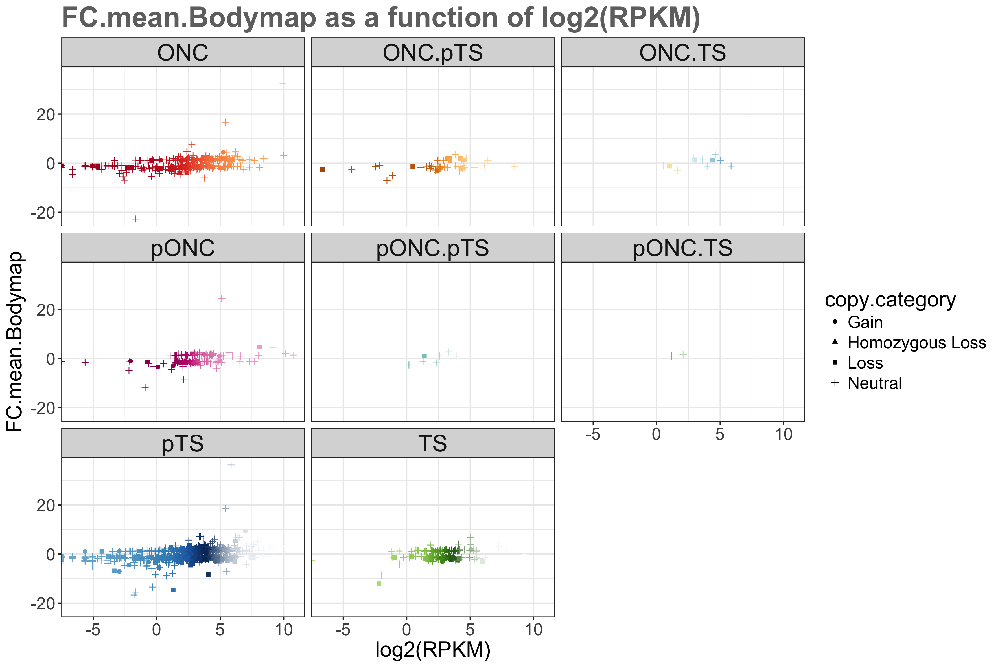

```{r}
suppressPackageStartupMessages(library(tidyverse))
knitr::opts_chunk$set(fig.width=12, fig.height=9)
library(knitr)
library(kableExtra)
options(knitr.table.format = "markdown")
library(readr)
library(forcats)
#install.packages("gdata")
library(gdata)
library(lattice)
# install.packages("RColorBrewer")
library(RColorBrewer)
#install.packages("tidygenomics") # Not used for now, but perhaps in another homework
#library(tidygenomics) # Not used for now, but perhaps in another homework
```

# Genomic datasets - A few clarifications

Vincenzo Coia has approved my request to use published genomic data for the next assignments, therefore, I want to provide a few clarifications:

* I have tried to introduce some basic explanations about the genomic dataset, but as my objective is to explore and learn how to use R and its packages, not to teach cancer genomic analysis, I am sorry in advance if you are not sure what the data and plots represent, but focus on the data manipulation behind and not what the data represents, and I hope you will still enjoy reading my homework !
* If you have any questions, please don't hesitate to let me know :) 
* Given the size of the data, I only display a few rows per table to keep it readable.

## SOURCES OF DATA: The Cancer Genome Atlas (TCGA) and ClinVar 

Thibodeau, M. L. et al. Genomic profiling of pelvic genital type leiomyosarcoma in a woman with a germline CHEK2:c.1100delC mutation and a concomitant diagnosis of metastatic invasive ductal breast carcinoma. Cold Spring Harb Mol Case Stud mcs.a001628 (2017). doi:10.1101/mcs.a001628  
Open access article and data available [here](http://molecularcasestudies.cshlp.org/content/3/5/a001628.long)  

# Get the data and clean the data

```{r}
chek2_rna_cnv <- read.table("/Users/mylinh/Desktop/chek2-data-trial-stat545/chek2-rna-expression-cnv-data.txt", sep="\t",  strip.white = TRUE, header = TRUE)
View(chek2_rna_cnv) 
# class(chek2_rna_cnv)
# typeof(chek2_rna_cnv)
summary(chek2_rna_cnv) %>% kable("markdown") %>% kable_styling()
dim(chek2_rna_cnv)
```

**Note 1.** I tried to use the functions from readr (read_table(), read_table2 and read_tsv()), but the column names with spaces (e.g. Ensembl gene ID) were not converted to column names with dot separation like it is done in read.table (E.g. Ensembl gene ID -> Ensembl.gene.ID.), which messed up the full data frame. I had error messages when trying to use dget() and dput. Therefore, why change a functional approach: I decided to keep read.table to do this homework.

Let's clean up the data first:

* Remove the rows for which there is no empty values for these columns: chr, start, end, strand, Ensembl.gene.ID., hugo
* fill the cancer.gene.type empty cells with the mention "NA" 
* remove the duplicate hugo genes

```{r}
chek2_rna_cnv <- with(chek2_rna_cnv, chek2_rna_cnv[!(chr==""),])
chek2_rna_cnv <- with(chek2_rna_cnv, chek2_rna_cnv[!(start==""),])
chek2_rna_cnv <- with(chek2_rna_cnv, chek2_rna_cnv[!(end==""),])
chek2_rna_cnv <- with(chek2_rna_cnv, chek2_rna_cnv[!(Ensembl.gene.ID==""),])
chek2_rna_cnv <- with(chek2_rna_cnv, chek2_rna_cnv[!(hugo==""),])
chek2_rna_cnv$cancer.gene.type <- as.character(chek2_rna_cnv$cancer.gene.type)
chek2_rna_cnv$cancer.gene.type[chek2_rna_cnv$cancer.gene.type==""] <- "NA"
chek2_rna_cnv$cancer.gene.type <- as.factor(chek2_rna_cnv$cancer.gene.type)
gene_types <- levels(chek2_rna_cnv$cancer.gene.type)
chek2_rna_cnv <- chek2_rna_cnv %>%
  group_by(hugo) %>%
  slice(1L)
dim(chek2_rna_cnv)
```

** Note 1.** You might have noticed that I manipulated the cancer.gene.type variable to change it to a character in order to replace the cancer.gene.type empty cells by "NA", then converted back to a factor, which partially answers exercise **(1A)** (see below)

# HOMEWORK REQUIREMENTS

OBJECTIVES:

* Reorder a factor in a principled way based on the data and demonstrate the effect in arranged data and in figures.
* Improve a figure (or make one from scratch), using new knowledge, e.g., control the color scheme, use factor levels, smoother mechanics.
* Implement visualization design principles.
* Write some data to file and load it back into R. E.g., save a plot to file and include it in a R Markdown report via .
* Organise your github, to celebrate the completion of STAT 545 and/or to prepare for the glorious future of STAT 547.

# (1) FACTOR MANAGEMENT

**Note 1.** I searched several online dictionaries, and I still do not understand the meaning of "principled": the online dictionaries are giving me answers like ["based on moral rules"](http://dictionary.cambridge.org/dictionary/english/principled) and ["(of a system or method) based on a given set of rules"](https://en.oxforddictionaries.com/definition/principled), so I will conclude that if my approach is coherent and follow a logical path, it is principled.   

## (1A) Factorise

Transform some of the variable of chek2_rna_cnv into factors. In cleaning up the dataset, we converted a factors column into characters then back to factors. 

Let's see what class of data we have in chek2_rna_cnv first. 
```{r}
sapply(chek2_rna_cnv, class) %>% kable("markdown") %>% kable_styling()
```

Change the avg.TCGA.percentile (class integer) to factors with base R:
```{r}
d0 <- chek2_rna_cnv
d0$avg.TCGA.percentile <- as.factor(d0$avg.TCGA.percentile)
d0 %>% 
  select(hugo,avg.TCGA.percentile) %>%
  head(10) %>% kable("markdown") %>% kable_styling()
nlevels(d0$avg.TCGA.percentile)
```

Change the avg.TCGA.percentile (class integer) to factors with forcats:

```{r}
d0$avg.TCGA.percentile <- as_factor(d0$avg.TCGA.percentile) 
d0 %>% 
  select(hugo,avg.TCGA.percentile) %>%
  head(10) %>% kable("markdown") %>% kable_styling()
```

In my case, I obtain the same result with base R and forcats with the avg.TCGA.percentile as factors, although I know that base R has a tendency to try re-ordering the data, which is not alway what we want, but the code syntax I used did not lead to this problem for me. 

## (1B) Drop 0

Filter chek2_rna_cnv to remove all the avg.TCGA.percentile equal to 0 and drop unused levels.

### Method 1 - gdata

So we are starting with 101 levels (0 to 100, inclusively)
```{r}
nlevels(d0$avg.TCGA.percentile)
d1 <- d0 %>%
  filter(avg.TCGA.percentile != 0) %>%
  arrange(avg.TCGA.percentile) %>%
  select(hugo, avg.TCGA.percentile)
nlevels(d1$avg.TCGA.percentile)
d1 <- data.frame(d1)
d1 <- gdata::drop.levels(d1)
# length(levels(d1$avg.TCGA.percentile)) # alternative method to count levels
nlevels(d1$avg.TCGA.percentile)
```

### Method 2 - Base R

Now let's see how we can do this with base R. 
```{r}
d1_v2 <- d0 %>%
  filter(avg.TCGA.percentile != 0) %>%
  arrange(avg.TCGA.percentile) %>%
  select(hugo, avg.TCGA.percentile)
class(d1_v2)
d1_v2 <- ungroup(d1_v2)
class(d1_v2)
nlevels(d1_v2$avg.TCGA.percentile)
d1_v2 <- d1_v2 %>%
  droplevels()
nlevels(d1_v2$avg.TCGA.percentile)
```

### Method 3 - Forcats

And now let's do the same with forcats.
```{r}
d1_v3 <- d0 %>%
  filter(avg.TCGA.percentile != 0) %>%
  arrange(avg.TCGA.percentile) %>%
  select(hugo, avg.TCGA.percentile)
nlevels(d1_v3$avg.TCGA.percentile)
d1_v3 <- ungroup(d1_v3)
d1_v3$avg.TCGA.percentile %>%
  fct_drop() %>%
  nlevels()
```

**Note 1.** In the example above, you can see that the number of levels is initially 101 (length function) and after removing the avg.TCGA.percentile equal to 0, the number of levels is 100, so I successfully dropped the unused level "0".

**Note 2.** To do this, I used a function of the gdata package, as exemplified  [here](https://www.r-bloggers.com/r-drop-factor-levels-in-a-dataset/)

**Note 3.** I had trouble with further manipulations on the data.frame because its class was grouped ("grouped_df" "tbl_df" "tbl" "data.frame") so I had to use the ungroup() function as shown [here](https://stackoverflow.com/questions/26694484/in-r-how-do-you-select-for-a-data-frame-that-has-been-grouped). 


## (1C) Reorder the levels of avg.TCGA.percentile or cancer.gene.type

Use the forcats package to change the order of the factor levels, based on a principled summary of one of the quantitative variables. Consider experimenting with a summary statistic beyond the most basic choice of the median.

### BASE R

#### INITIAL PLOT

I will plot the RPKM value according to each hugo gene.

```{r}
d2 <- chek2_rna_cnv %>%
  filter(avg.TCGA.percentile != 0) %>%
  arrange(avg.TCGA.percentile)
d2 <- ungroup(d2)
p1 <- d2 %>%
  group_by(hugo) %>%
  arrange(RPKM) %>%
  ggplot(aes(x=hugo, y=RPKM))
p1 + geom_point(aes(colour=cancer.gene.type), alpha = 0.6) + 
  theme(text = element_text(size=12), axis.title.x=element_blank(), axis.text.x = element_blank(), axis.ticks.x=element_blank())
```

**Note 1.** This is not very pretty, I would like to re-order the hugo gene according to their increasing value of RPKM.

**Note 2.** Using the arrange() function did not resolve this problem because the factors "hugo" are not re-arranged according to RPKM. We need additional functions to do so (see below for examples).

#### PLOT AFTER ARRANGING FACTOR HUGO ACCORDING TO RPKM VALUE  

I will arrange the order of the factor hugo according to the ascending value of RPKM, as previously exemplified in my [homework 3](https://github.com/mylinhthibodeau/STAT545-HW-thibodeau-mylinh/tree/master/stat545-hw3-thibodeau-mylinh).

```{r}
d2$hugo <- factor(d2$hugo, levels = d2$hugo[order(d2$RPKM)]) 
p1 <- d2 %>%
  group_by(hugo) %>%
  arrange(RPKM) %>%
  filter(cancer.gene.type != "NA") %>%
  ggplot(aes(x=hugo, y=RPKM))
p1 + geom_point(aes(colour=cancer.gene.type), alpha = 0.6) + 
  theme(text = element_text(size=12), axis.title.x=element_blank(), axis.text.x = element_blank(), axis.ticks.x=element_blank())
```

### FORCATS


#### REORDER ACCORDING TO MEAN PERCENTILE


I will start by changing the lcass of avg.TCGA.percentile back to a numeric so that I can do a mean function on it. Then, I will show the difference between ordered and un-ordered factors cancer.gene.type according to the mean.
```{r}
chek2_rna_cnv$avg.TCGA.percentile <- as.numeric(chek2_rna_cnv$avg.TCGA.percentile)
chek2_rna_cnv <- ungroup(chek2_rna_cnv)
d3 <- chek2_rna_cnv %>%
  filter(avg.TCGA.percentile != 0) %>%
  arrange(avg.TCGA.percentile) 
d3.mean.percentile.by.type <- d3 %>%  
  group_by(cancer.gene.type) %>%
  dplyr::summarize(mean.percentile.by.type = mean(avg.TCGA.percentile))
d3.mean.percentile.by.type  %>% kable("markdown") %>% kable_styling()

# cancer.gene.type factors in alphabetical order
p3 <- d3.mean.percentile.by.type %>%
  ggplot(aes(x=cancer.gene.type, y = mean.percentile.by.type))
p3 + geom_point() + theme(text = element_text(size=12), axis.text.x = element_text(angle=45, hjust=1))

# cancer.gene.type factors ordered according to the mean.percentile.by.type      
p3 <- d3.mean.percentile.by.type %>%
  ggplot(aes(x=fct_reorder(cancer.gene.type, mean.percentile.by.type), y = mean.percentile.by.type))
p3 + geom_point() + theme(text = element_text(size=12), axis.text.x = element_text(angle=45, hjust=1))
```


#### REORDER ACCORDING TO FREQUENCY

We can also order the data.frame factors according to their frequency. 
```{r}
levels(d3$cancer.gene.type) %>% kable("markdown") %>% kable_styling()
d3$cancer.gene.type %>% forcats::fct_infreq() %>% levels() %>% kable("markdown") %>% kable_styling()
```

**Note 1.** So the most frequent factor is "NA", followed by "putative tumour suppressor", etc.

We can also re-order the factors avg.TCGA.percentile according to their frequency:

```{r}
d3$avg.TCGA.percentile <- factor(d3$avg.TCGA.percentile) 
levels(d3$avg.TCGA.percentile) %>% head(5) %>% kable("markdown") %>% kable_styling()
d3$avg.TCGA.percentile %>% forcats::fct_infreq() %>% levels() %>% head(5) %>% kable("markdown") %>% kable_styling()
```

**Note 1.** The most frequent avg.TCGA.percentile factor is 49, therefore, we know that there is a high number of hugo genes with a gene expression level at the 49th percentile.

PLOT EXAMPLE

We will plot the avg.TCGA.percentile factors in un-ordered way, then ordered by frequency. We will only use the 2000 first data entries. 
```{r}
d2$avg.TCGA.percentile <- factor(d2$avg.TCGA.percentile) 
p4 <- d2 %>%
  group_by(cancer.gene.type) %>%
  head(2000) %>%
  ggplot(aes(x=avg.TCGA.percentile))
p4 + geom_bar(aes(fill=cancer.gene.type))
p4 <- d2 %>%
  group_by(cancer.gene.type) %>%
  head(2000) %>%
  ggplot(aes(x=fct_infreq(avg.TCGA.percentile)))
p4 + geom_bar(aes(fill=cancer.gene.type))
```

**Note 1.** The reason why the factors are not the same than illustrated in the previous example is because I only selected the first 2000 data entries and the factors were already ordered in ascending fashion in the d2 dataset.  

Resources: 

* Stack overflow example for cut 
[here](https://stackoverflow.com/questions/40380112/categorize-continuous-variable-with-dplyr)
* Examples of forcats [here](https://blog.rstudio.com/2016/08/31/forcats-0-1-0/) 
* The most useful resource is from stat545 [here](http://stat545.com/block029_factors.html)


## (1D) Characterize the (derived) data before and after your factor re-leveling.

* Explore the effects of arrange(). Does merely arranging the data have any effect on, say, a figure?

Answer: As exemplified above, arrange() is not sufficient to re-order data according to a factor. For example, the hugo genes were not re-ordered according to the RPKM even after using arrange(RPKM), and the visual output is not very intuitine. We need to use functions of base R or forcats to do this (see examples above).

* Explore the effects of reordering a factor and factor reordering coupled with arrange(). Especially, what effect does this have on a figure?

Answer: As mentioned previously, factors have to be treated a different way. When we are ploting numerical values according to numerical values, we can use arrange to re-order the data, but when we use factors, it requires extra-steps in order to go around "R who is trying to re-order your factors data for you (without your permission)".

* These explorations should involve the data, the factor levels, and some figures.

Answer: Please refer above for several tables, ways of counting and dropping levels and plots. 

Resources: 
[tidyverse and readr](https://github.com/tidyverse/readr/issues)

***

# (2) FILE I/O


## The examples of using read input and write ouput to a file are scattered across the homework


* It starts in the section "Get the data and clean the data" where I used read.table() to load the data into chek2_rna_cnv. As mentioned when I created the data.frame, I experienced challenges trying to use functions like write_ts/read_tsv, so I kept read.table() as my go to. 
* There is another example using read.delim() in the section below to merge the chek2_hugo_colors information to the data.frame and to make a plot with that color system.

***

# (3) Visualization design - Improve a figure 


In all honesty, I spent quite a bit of time on visual aspects of ggplot graph in in my [homework 3](https://github.com/mylinhthibodeau/STAT545-HW-thibodeau-mylinh/tree/master/stat545-hw3-thibodeau-mylinh) since I needed it for research-related problems at that time as well. 

Therefore, I will try something different here: making a color scheme for the hugo genes based on the cancer.gene.type category they belong to. The entire code below is based on the work of Jenny Bryan, specifically tutorial on ggplot2 [here](https://github.com/jennybc/ggplot2-tutorial/blob/master/01_make-gapminder-color-scheme.r) (create color scheme for data) and [here](https://github.com/jennybc/ggplot2-tutorial/blob/master/gapminder-ggplot2-shock-and-awe.md) (plot the data).

First, the values of cancer.gene.type (stored in gene_types) are too long, let's make abbreviations for them, and replace the cancer.gene.type by the abbreviation in d5.

```{r}
abbreviations_gene_types  <- factor(c("unknown", "ONC", "ONC.pTS", "ONC.TS", "pONC", "pONC.pTS", "pONC.TS", "pTS", "TS"))
abbreviations_gene_types <- as.character(abbreviations_gene_types)
abbr_table <- data.frame(Abbreviation = abbreviations_gene_types, cancer.gene.type = gene_types)
abbr_table %>% kable("markdown") %>% kable_styling()
d5 <- d0
d5$cancer.gene.type <- as.character(d5$cancer.gene.type)
d5$cancer.gene.type <- gsub("NA", "unknown", d5$cancer.gene.type)
d5$cancer.gene.type <- gsub("oncogene", "ONC", d5$cancer.gene.type)
d5$cancer.gene.type <- gsub("tumour suppressor", "TS", d5$cancer.gene.type)
d5$cancer.gene.type <- gsub("putative", "p", d5$cancer.gene.type)
d5$cancer.gene.type <- as.vector(d5$cancer.gene.type)
d5$cancer.gene.type <- gsub("; ", ".", d5$cancer.gene.type)
d5$cancer.gene.type <- gsub(" ", "", d5$cancer.gene.type)
```

cancer.gene.type-level info
```{r}
d5 <- d5 %>%
  filter(cancer.gene.type != "unknown")
dim(d5)
d5.cancer.gene.type <- aggregate(hugo~cancer.gene.type, d5, function(x) length(unique(x)))
n.cancer.gene.type <- nrow(d5.cancer.gene.type)
n.cancer.gene.type
d5.cancer.gene.type %>% kable("markdown") %>% kable_styling()
```

**Note 1.** I realized later on that it was not feasible to keep the unknown values, there were too many, so I had to filter them out.

Map cancer.gene.type into colours using the RColorBrewer package
```{r}
display.brewer.all(type = "div")
color_anchors <-
  list(
    # unknown = brewer.pal(n=3, 'RdBu')[7:9], # Removed, causing issues
       ONC = brewer.pal(n=10, 'RdYlBu')[1:4], # 
       ONC.pTS = brewer.pal(n=10, 'PuOr')[2:5], # 
       ONC.TS = brewer.pal(n=10, 'RdYlBu')[5:8], # 
       pONC = brewer.pal(n=10, 'PiYG')[1:4], # 
       pONC.pTS=brewer.pal(n=3,'BrBG')[3:4], # 
       pONC.TS = brewer.pal(n=3, 'PRGn')[3:4], #
      pTS = brewer.pal(n=10, 'RdBu')[7:11], #
      TS= brewer.pal(n=10, 'PiYG')[7:11])
```

Select the first or darkest color to represent the whole cancer.gene.type category

```{r}
d5.cancer.gene.type$color <- lapply(color_anchors, "[",1 )
```

Expand into palettes big enough to cover each gene in a continent

```{r}
library(plyr)
d5 <- data.frame(d5)
hugo_colors <- plyr::ddply(d5, ~cancer.gene.type, function(x) {
  the.cancer.gene.type <- x$cancer.gene.type[1]
  x <- droplevels(x)
  hugo.lowtohigh <-
    with(x, levels(reorder(hugo, RPKM)))
  colorFun <- colorRampPalette(color_anchors[[the.cancer.gene.type]])
  return(data.frame(hugo = I(hugo.lowtohigh),
                    color = I(colorFun(length(hugo.lowtohigh)))))
})

## fiddly parameters that control printing of hugo names
charLimit <- 12
xFudge <- 0.05
jCex <- 0.75
```

**Note 1.** ddply() is a function from the plyr package, as mentioned [here](https://groups.google.com/forum/#!topic/ggplot2/gT0Nmv1jqyE)

We can then store the figure making code as a function so can make pdf and png.
```{r}
make_figure <- function() {
  plot(c(0, n.cancer.gene.type), c(0,1), type = "n",
       xlab = "", ylab="", xaxt = "n", yaxt = "n", bty = "n",
       main="CHEK2 data - Cancer Gene Type - Color Scheme")
  for(i in seq_len(n.cancer.gene.type)) {
    this.cancer.gene.type <- d5.cancer.gene.type$cancer.gene.type[i]
    nCols <- with(d5.cancer.gene.type, hugo[cancer.gene.type==this.cancer.gene.type])
    yFudge = 0.1/nCols
    foo <- seq(from = 0, to =1, length.out = nCols+1)
    rect(xleft = i-1,
          ybottom = foo[-(nCols + 1)],
          xright = i,
         ytop = foo[-1],
         col=with(hugo_colors, color[cancer.gene.type==this.cancer.gene.type]))
    text(x = i - 1 + xFudge,
         y = foo[-(nCols + 1)] + yFudge,
         labels = with(hugo_colors,
                       substr(hugo[cancer.gene.type==this.cancer.gene.type], 1, charLimit)),
         adj = c(0, 0), cex = jCex)
  }
  mtext(d5.cancer.gene.type$cancer.gene.type, side = 3, at = seq_len(n.cancer.gene.type) - 0.5)
  mtext(c("highest.RPKM", "smallest.RPKM"),
        side = 2, at = c(0.9, 0.1), las = 1)
}

op <- par(mar = c(1, 4, 6, 1) + 0.1)

make_figure()
par(op)
png("scratch-space/chek2-cancer.gene.type-colors.png",
    width = 30, height = 70, units = "in", res = 200)
op <- par(mar = c(1, 4, 6, 1) + 0.1)

make_figure()
dev.off()
par(op)
pdf("scratch-space/chek2-cancer.gene.type-colors.pdf",
   width = 30, height = 70)
op <- par(mar = c(1, 4, 6, 1) + 0.1)
make_figure()
dev.off()
par(op)

write.table(hugo_colors, "scratch-space/chek2-hugo-colors.tsv",
            quote = FALSE, sep = "\t", row.names = FALSE)

d5.cancer.gene.type$cancer.gene.type <- as.character(d5.cancer.gene.type$cancer.gene.type)
d5.cancer.gene.type$hugo <- as.character(d5.cancer.gene.type$hugo)
d5.cancer.gene.type$color <- as.character(d5.cancer.gene.type$color)
write.table(d5.cancer.gene.type, "scratch-space/chek2-cancer.gene.type-colors.tsv",
            quote = FALSE, sep = "\t", row.names = FALSE)
```
**Note 1.** I had to convert the d5.cancer.gene.type table to characters before being able to write to a tsv file, as mentioned in this stack overflow discussion [here](https://stackoverflow.com/questions/24829027/unimplemented-type-list-when-trying-to-write-table).

# (4) Writing figures to file


Let's write a figure to a file, then load it back to embed it in this report.

Merge color into data, as shown [here](https://github.com/jennybc/ggplot2-tutorial/blob/master/02-merge-color-into-data.r)

```{r}
library(plyr)
hugo_colors_v2 <- read.delim("scratch-space/chek2-hugo-colors.tsv", colClasses = list(color = "character"), col.names = c("cancer.gene.type", "hugo", "hugo_color"))
str(hugo_colors_v2)

#insert color as a variable into d5
d5 <- merge(d5, hugo_colors_v2)
```

Then we can use this to make plots, as Jenny Bryan showed [here](https://github.com/jennybc/ggplot2-tutorial/blob/master/gapminder-ggplot2-shock-and-awe.md)

```{r}
color_scheme_hugo <- d5 %>%
  select(hugo, hugo_color)
head(color_scheme_hugo)
p5 <- d5 %>%
  filter(cancer.gene.type != "unknown") %>%
  group_by(cancer.gene.type) %>%
  ggplot(aes(x=log2(RPKM), y=FC.mean.Bodymap), na.rm=TRUE)
p5 + geom_point(aes(shape=copy.category)) +
  scale_size_continuous(range=c(1,40)) +
  facet_wrap(~cancer.gene.type) +
  aes(colour= hugo_color) + scale_colour_identity() +
  theme_bw() + theme(strip.text = element_text(size = rel(1.1))) 
ggsave("scratch-space/chek2_cancer_gene_type_color_plot.png", width = 20, height = 20, units = "cm", dpi = 300)
```
**Note 1.** In the plot above, one might want to focus on the genes that have low expression (low RPKM) and copy loss, or high expression and copy gain, as these paired-values are more likely to be biologically relevant.

Now, let's load the plot I just created with the Rmarkdown syntax .



If you are generating two plots in the same code chunk, you need to specify which plot to save with ggsave. For example, let's take the same plots previously shown.

```{r}
p4 <- d2 %>%
  group_by(cancer.gene.type) %>%
  head(2000) %>%
  ggplot(aes(x=avg.TCGA.percentile))
p4_unordered <- p4 + geom_bar(aes(fill=cancer.gene.type))
p4 <- d2 %>%
  group_by(cancer.gene.type) %>%
  head(2000) %>%
  ggplot(aes(x=fct_infreq(avg.TCGA.percentile)))
p4 + geom_bar(aes(fill=cancer.gene.type))
p4_ordered <- p4 + geom_bar(aes(fill=cancer.gene.type))
ggsave("scratch-space/p4_ordered.png", width = 20, height = 20, units = "cm", dpi = 300)
```

By default, ggsave use the last stored plot to save to the file, so if you want to save the first plot, you have to specify which plot you want to save with the argument plot = p4_unordered in our case.

```{r}
p4 <- d2 %>%
  group_by(cancer.gene.type) %>%
  head(2000) %>%
  ggplot(aes(x=avg.TCGA.percentile))
p4_unordered <- p4 + geom_bar(aes(fill=cancer.gene.type))
p4 <- d2 %>%
  group_by(cancer.gene.type) %>%
  head(2000) %>%
  ggplot(aes(x=fct_infreq(avg.TCGA.percentile)))
p4 + geom_bar(aes(fill=cancer.gene.type))
p4_ordered <- p4 + geom_bar(aes(fill=cancer.gene.type))
ggsave("scratch-space/p4_unordered.png", plot=p4_unordered, width = 20, height = 20, units = "cm", dpi = 300)
```

Resources:

* ggplot tutorial of Jenny Bryan [here](https://github.com/jennybc/ggplot2-tutorial)
* use scale_colour_identity example [here](https://stackoverflow.com/questions/3079264/using-a-pre-defined-color-palette-in-ggplot)


# (5) Organise your github

## Some strategies to keep my github repository tidy

I have used some strategies to keep my repository clean and organized:

* For each folder, I am using a scratch-space subfolder that contains the figures and table files generated manually. This approach avoids having numerour files in the main repository, which makes it difficult for the reader to find the specific file to review. However, in order to do so, I need to plan in advance and remember to save the files in the scratch-space.
* Exception made of the homework 1, all of the stat545 homework assignements are in my mylinhthibodeau/STAT545-HW-thibodeau-mylinh repository [here](https://github.com/mylinhthibodeau/STAT545-HW-thibodeau-mylinh). I will eventually try to move homework 1 to this folder, but I am a bit fearful to re-create my "repository inside a repository" issue, so I will wait to have more time to tackle eventual problems before I do so. 
* I try to keep the first repository README.md file as clear and succinct as possible (as shown [here](https://github.com/mylinhthibodeau/STAT545-HW-thibodeau-mylinh/blob/master/README.md))
* I am trying to make the README.md file in each homework folder as clear as possible


