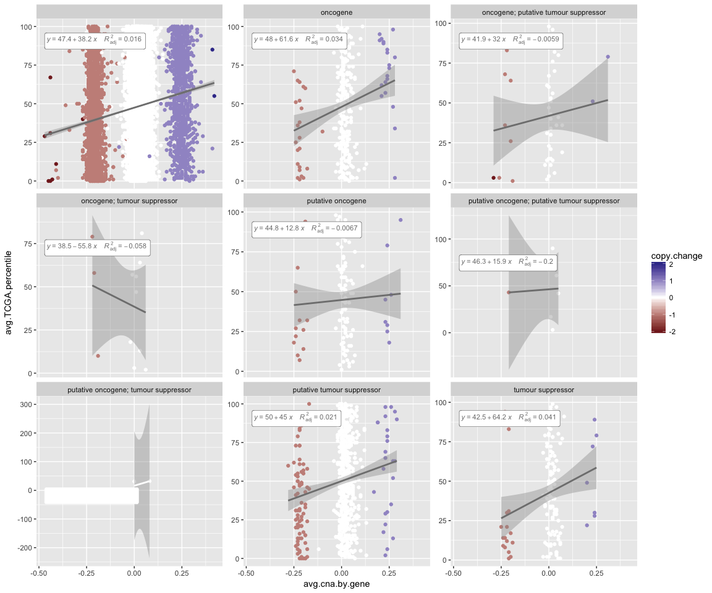
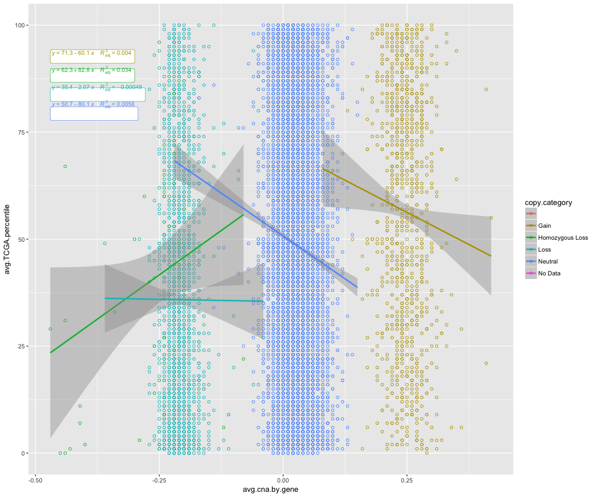
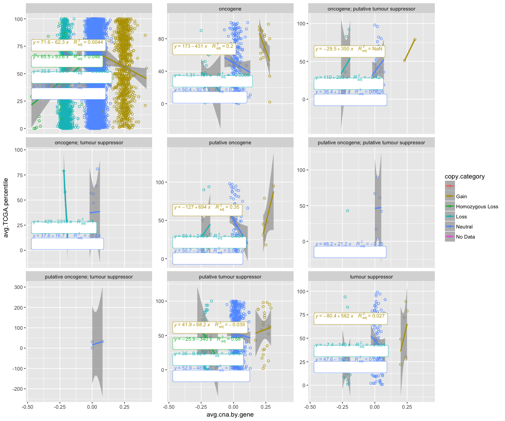

CHEK2 data - Trial
================

``` r
suppressPackageStartupMessages(library(tidyverse))
knitr::opts_chunk$set(fig.width=12, fig.height=10)
library("ggpmisc")
```

    ## Warning: package 'ggpmisc' was built under R version 3.4.2

SOURCE OF DATA - supplementary files of published article:
----------------------------------------------------------

Thibodeau, M. L. et al. Genomic profiling of pelvic genital type leiomyosarcoma in a woman with a germline CHEK2:c.1100delC mutation and a concomitant diagnosis of metastatic invasive ductal breast carcinoma. Cold Spring Harb Mol Case Stud mcs.a001628 (2017). <doi:10.1101/mcs.a001628>
Open access article and data available [here](http://molecularcasestudies.cshlp.org/content/3/5/a001628.long)

**Load the text file version of CHEK2 paper supplementary data on rna expression and copy number variant (cnv)**

``` r
rna_cnv <- read.table("/Users/mylinh/Desktop/chek2-data-trial-stat545/chek2-rna-expression-cnv-data.txt", sep="\t",  strip.white = TRUE, header = TRUE)
head(rna_cnv)
```

    ##   chr     start       end strand cytoband Ensembl.gene.ID     hugo
    ## 1   X  99883667  99894988     -1    q22.1 ENSG00000000003   TSPAN6
    ## 2   X  99839799  99854882      1    q22.1 ENSG00000000005     TNMD
    ## 3  20  49551404  49575092     -1   q13.13 ENSG00000000419     DPM1
    ## 4   1 169821804 169863408     -1    q24.2 ENSG00000000457    SCYL3
    ## 5   1 169631245 169823221      1    q24.2 ENSG00000000460 C1orf112
    ## 6   1  27938575  27961788     -1   p36.11 ENSG00000000938      FGR
    ##   copy.category copy.change avg.cna avg.cna.by.gene breakpoint
    ## 1          Gain           1    0.25            0.26          0
    ## 2          Gain           1    0.25            0.23          0
    ## 3       Neutral           0    0.02            0.07          0
    ## 4          Gain           1    0.23            0.28          0
    ## 5          Gain           1    0.23            0.24          0
    ## 6          Loss          -1   -0.21           -0.22          0
    ##   manually.curated.homd loh loh_ratio intepreted.expression.status  RPKM
    ## 1                     0 HET      0.62                              12.01
    ## 2                     0 HET      0.60                               2.99
    ## 3                     0 HET      0.55                              22.83
    ## 4                     0 HET      0.49                               4.33
    ## 5                     0 HET      0.49                               1.87
    ## 6                     0 HET      0.28                               4.86
    ##   SARC.percentile SARC.kIQR FC.mean.Bodymap avg.TCGA.percentile
    ## 1              65      0.38           -1.54                  25
    ## 2              90      4.52           -1.42                  99
    ## 3              40     -0.18           -1.19                  46
    ## 4              75      0.54            1.04                  49
    ## 5              30     -0.33            1.01                  37
    ## 6              86      1.58           -2.39                  74
    ##   avg.TCGA.kIQR avg.TCGA.norm.percentile avg.TCGA.norm.kIQR
    ## 1         -0.44                       20              -0.70
    ## 2         71.00                       92               6.56
    ## 3         -0.06                       71               0.44
    ## 4         -0.01                       50               0.00
    ## 5         -0.24                       90               1.42
    ## 6          0.63                       74               0.63
    ##   UCEC.norm.percentile UCEC.norm.kIQR cancer.gene.type
    ## 1                   21          -0.77                 
    ## 2                  100          27.13                 
    ## 3                   50           0.06                 
    ## 4                   58           0.27                 
    ## 5                   96           2.23                 
    ## 6                   46          -0.02

``` r
summary(rna_cnv)
```

    ##       chr            start                end           
    ##  1      : 2042   Min.   :     5810   Min.   :    31427  
    ##  19     : 1421   1st Qu.: 31494320   1st Qu.: 31525315  
    ##  11     : 1281   Median : 57837876   Median : 57882616  
    ##  2      : 1224   Mean   : 74255388   Mean   : 74321328  
    ##  17     : 1159   3rd Qu.:111340848   3rd Qu.:111383246  
    ##  3      : 1057   Max.   :249200395   Max.   :249214145  
    ##  (Other):11432   NA's   :92          NA's   :92         
    ##      strand            cytoband            Ensembl.gene.ID 
    ##  Min.   :-1.00000   p13.3  :  620   ENSG00000000003:    1  
    ##  1st Qu.:-1.00000   q22.1  :  489   ENSG00000000005:    1  
    ##  Median : 1.00000   q13.2  :  433   ENSG00000000419:    1  
    ##  Mean   : 0.01393   p13.2  :  425   ENSG00000000457:    1  
    ##  3rd Qu.: 1.00000   q11.2  :  366   ENSG00000000460:    1  
    ##  Max.   : 1.00000   q21.3  :  348   ENSG00000000938:    1  
    ##  NA's   :92         (Other):16935   (Other)        :19610  
    ##       hugo               copy.category    copy.change      
    ##         :  356                  :   34   Min.   :-2.00000  
    ##  AGAP9  :    2   Gain           : 1092   1st Qu.: 0.00000  
    ##  CT45A5 :    2   Homozygous Loss:   79   Median : 0.00000  
    ##  DCDC1  :    2   Loss           : 2147   Mean   :-0.05834  
    ##  DIO3   :    2   Neutral        :16206   3rd Qu.: 0.00000  
    ##  DTX2   :    2   No Data        :   58   Max.   : 2.00000  
    ##  (Other):19250                           NA's   :92        
    ##     avg.cna         avg.cna.by.gene      breakpoint     
    ##  Min.   :-0.45000   Min.   :-0.47000   Min.   :0.00000  
    ##  1st Qu.: 0.01000   1st Qu.: 0.00000   1st Qu.:0.00000  
    ##  Median : 0.01000   Median : 0.02000   Median :0.00000  
    ##  Mean   : 0.00147   Mean   : 0.00926   Mean   :0.00123  
    ##  3rd Qu.: 0.02000   3rd Qu.: 0.04000   3rd Qu.:0.00000  
    ##  Max.   : 0.42000   Max.   : 0.42000   Max.   :1.00000  
    ##  NA's   :92         NA's   :92         NA's   :92       
    ##  manually.curated.homd   loh          loh_ratio     
    ##  Min.   :0.00000           :   92   Min.   :0.1800  
    ##  1st Qu.:0.00000       DLOH:    1   1st Qu.:0.4700  
    ##  Median :0.00000       HET :19503   Median :0.5000  
    ##  Mean   :0.00405       HOMD:   14   Mean   :0.5027  
    ##  3rd Qu.:0.00000       NLOH:    6   3rd Qu.:0.5400  
    ##  Max.   :1.00000                    Max.   :0.9000  
    ##  NA's   :92                         NA's   :92      
    ##  intepreted.expression.status      RPKM          SARC.percentile 
    ##      :18932                   Min.   :    0.00   Min.   :  0.00  
    ##  down:  460                   1st Qu.:    0.23   1st Qu.: 27.00  
    ##  up  :  224                   Median :    3.17   Median : 51.00  
    ##                               Mean   :   22.74   Mean   : 50.92  
    ##                               3rd Qu.:    9.42   3rd Qu.: 76.00  
    ##                               Max.   :34198.14   Max.   :100.00  
    ##                                                  NA's   :1347    
    ##    SARC.kIQR     FC.mean.Bodymap    avg.TCGA.percentile avg.TCGA.kIQR  
    ##  Min.   :-2.30   Min.   :-893.100   Min.   :  0.00      Min.   :-2.00  
    ##  1st Qu.:-0.37   1st Qu.:  -1.480   1st Qu.: 23.00      1st Qu.:-0.40  
    ##  Median : 0.08   Median :  -1.060   Median : 47.00      Median :-0.01  
    ##  Mean   :  Inf   Mean   :  -1.208   Mean   : 47.83      Mean   :  Inf  
    ##  3rd Qu.: 0.77   3rd Qu.:   1.200   3rd Qu.: 73.00      3rd Qu.: 0.66  
    ##  Max.   :  Inf   Max.   : 121.580   Max.   :100.00      Max.   :  Inf  
    ##  NA's   :2454                       NA's   :760         NA's   :1867   
    ##  avg.TCGA.norm.percentile avg.TCGA.norm.kIQR UCEC.norm.percentile
    ##  Min.   :  0.00           Min.   :-3.48      Min.   :  0.00      
    ##  1st Qu.: 22.00           1st Qu.:-0.42      1st Qu.:  8.00      
    ##  Median : 48.00           Median : 0.00      Median : 42.00      
    ##  Mean   : 48.95           Mean   :  Inf      Mean   : 43.87      
    ##  3rd Qu.: 76.00           3rd Qu.: 0.73      3rd Qu.: 79.00      
    ##  Max.   :100.00           Max.   :  Inf      Max.   :100.00      
    ##  NA's   :1347             NA's   :2331       NA's   :1347        
    ##  UCEC.norm.kIQR                              cancer.gene.type
    ##  Min.   :-8.31                                       :18335  
    ##  1st Qu.:-0.83   putative tumour suppressor          :  667  
    ##  Median :-0.18   oncogene                            :  303  
    ##  Mean   :  Inf   tumour suppressor                   :  128  
    ##  3rd Qu.: 0.84   putative oncogene                   :  114  
    ##  Max.   :  Inf   oncogene; putative tumour suppressor:   46  
    ##  NA's   :2438    (Other)                             :   23

``` r
class(rna_cnv)
```

    ## [1] "data.frame"

``` r
typeof(rna_cnv)
```

    ## [1] "list"

``` r
str(rna_cnv)
```

    ## 'data.frame':    19616 obs. of  27 variables:
    ##  $ chr                         : Factor w/ 24 levels "","1","10","11",..: 24 24 14 2 2 2 2 20 20 20 ...
    ##  $ start                       : int  99883667 99839799 49551404 169821804 169631245 27938575 196621008 143816614 53362139 41040684 ...
    ##  $ end                         : int  99894988 99854882 49575092 169863408 169823221 27961788 196716634 143832827 53481768 41067715 ...
    ##  $ strand                      : int  -1 1 -1 -1 1 -1 1 -1 -1 1 ...
    ##  $ cytoband                    : Factor w/ 254 levels "","p11","p11.1",..: 152 152 113 173 173 87 212 173 14 46 ...
    ##  $ Ensembl.gene.ID             : Factor w/ 19616 levels "ENSG00000000003",..: 1 2 3 4 5 6 7 8 9 10 ...
    ##  $ hugo                        : Factor w/ 19241 levels "","A1BG","A1CF",..: 17548 17188 4628 14615 1928 5861 3100 6090 6306 10826 ...
    ##  $ copy.category               : Factor w/ 6 levels "","Gain","Homozygous Loss",..: 2 2 5 2 2 4 2 5 5 5 ...
    ##  $ copy.change                 : int  1 1 0 1 1 -1 1 0 0 0 ...
    ##  $ avg.cna                     : num  0.25 0.25 0.02 0.23 0.23 -0.21 0.23 0.01 0.01 0.01 ...
    ##  $ avg.cna.by.gene             : num  0.26 0.23 0.07 0.28 0.24 -0.22 0.23 -0.02 0 0.01 ...
    ##  $ breakpoint                  : int  0 0 0 0 0 0 0 0 0 0 ...
    ##  $ manually.curated.homd       : int  0 0 0 0 0 0 0 0 0 0 ...
    ##  $ loh                         : Factor w/ 5 levels "","DLOH","HET",..: 3 3 3 3 3 3 3 3 3 3 ...
    ##  $ loh_ratio                   : num  0.62 0.6 0.55 0.49 0.49 0.28 0.58 0.55 0.52 0.54 ...
    ##  $ intepreted.expression.status: Factor w/ 3 levels "","down","up": 1 1 1 1 1 1 1 1 1 1 ...
    ##  $ RPKM                        : num  12.01 2.99 22.83 4.33 1.87 ...
    ##  $ SARC.percentile             : int  65 90 40 75 30 86 54 49 87 85 ...
    ##  $ SARC.kIQR                   : num  0.38 4.52 -0.18 0.54 -0.33 1.58 0.07 -0.01 1.25 1.25 ...
    ##  $ FC.mean.Bodymap             : num  -1.54 -1.42 -1.19 1.04 1.01 -2.39 -2.31 -1.14 -1.33 -1.14 ...
    ##  $ avg.TCGA.percentile         : int  25 99 46 49 37 74 67 65 37 62 ...
    ##  $ avg.TCGA.kIQR               : num  -0.44 71 -0.06 -0.01 -0.24 0.63 0.38 0.29 -0.21 0.24 ...
    ##  $ avg.TCGA.norm.percentile    : int  20 92 71 50 90 74 45 78 31 81 ...
    ##  $ avg.TCGA.norm.kIQR          : num  -0.7 6.56 0.44 0 1.42 0.63 -0.08 0.66 -0.33 0.91 ...
    ##  $ UCEC.norm.percentile        : int  21 100 50 58 96 46 83 88 42 79 ...
    ##  $ UCEC.norm.kIQR              : num  -0.77 27.13 0.06 0.27 2.23 ...
    ##  $ cancer.gene.type            : Factor w/ 9 levels "","oncogene",..: 1 1 1 1 1 1 1 1 1 1 ...

[source code below](https://stackoverflow.com/questions/37494969/ggplot2-add-regression-equations-and-r2-and-adjust-their-positions-on-plot)
[This stackoverflow](https://stackoverflow.com/questions/37254279/dynamic-label-position-stat-poly-eq-and-ggplot2) discussion was also useful.

[This cran rstudio website](https://cran.rstudio.com/web/packages/ggpmisc/vignettes/user-guide-1.html) has also been very helpful.

Initial plot, function of cna and TCGA percentile, copy change coloured. Faceted to the gene category (e.g. oncogene)

``` r
formula <- y ~ x
p1 <- rna_cnv %>%
  ggplot(aes(x=avg.cna.by.gene, y=avg.TCGA.percentile, colour=copy.change), na.rm = TRUE, alpha = 0.8) 
p1 +
  geom_point() + 
  scale_colour_gradient2() +
  facet_wrap(~ cancer.gene.type, scales = "free_y") +
  geom_smooth(method="lm", formula = formula, se=FALSE, size=0.2) +
  stat_smooth(method = "lm") +
  stat_poly_eq(aes(label = paste(..eq.label.., ..adj.rr.label.., sep = "~~~~")), label.x.npc = "left",
               formula = formula, parse = TRUE, size = 3,
               geom="label")
```

    ## Warning: Removed 817 rows containing non-finite values (stat_smooth).

    ## Warning: Removed 817 rows containing non-finite values (stat_smooth).

    ## Warning: Removed 817 rows containing non-finite values (stat_poly_eq).

    ## Warning: Removed 817 rows containing missing values (geom_point).

 option 2 of plot

``` r
p2 <- rna_cnv %>%
  ggplot(aes(x=avg.cna.by.gene, y=avg.TCGA.percentile, colour=copy.category), na.rm = TRUE, alpha = 0.8) 
p2 + geom_point(shape =21) + 
  geom_smooth(method="lm", formula = formula, se=FALSE, size=0.2) +
  stat_smooth(method = "lm") +
  stat_poly_eq(aes(label = paste(..eq.label.., ..adj.rr.label.., sep = "~~~~")), label.x.npc = "left", formula = formula, parse = TRUE, size = 3, geom="label")
```

    ## Warning: Removed 817 rows containing non-finite values (stat_smooth).

    ## Warning: Removed 817 rows containing non-finite values (stat_smooth).

    ## Warning: Removed 817 rows containing non-finite values (stat_poly_eq).

    ## Warning: Removed 817 rows containing missing values (geom_point).

 option 3 of plot

``` r
p3 <- rna_cnv %>%
  ggplot(aes(x=avg.cna.by.gene, y=avg.TCGA.percentile, colour=copy.category), na.rm = TRUE, alpha = 0.8) 
p3 + geom_point(shape =21) + 
  geom_smooth(method="lm", formula = formula, size=0.2) +
  stat_smooth(method = "lm", formula=formula) +
  facet_wrap(~ cancer.gene.type, scales = "free_y")+
  stat_poly_eq(aes(label = paste(..eq.label.., ..adj.rr.label.., sep = "~~~~")), label.x.npc = "left", formula = formula, parse = TRUE, size = 3, geom="label")
```

    ## Warning: Removed 817 rows containing non-finite values (stat_smooth).

    ## Warning in qt((1 - level)/2, df): NaNs produced

    ## Warning: Removed 817 rows containing non-finite values (stat_smooth).

    ## Warning in qt((1 - level)/2, df): NaNs produced

    ## Warning: Removed 817 rows containing non-finite values (stat_poly_eq).

    ## Warning: Removed 817 rows containing missing values (geom_point).


