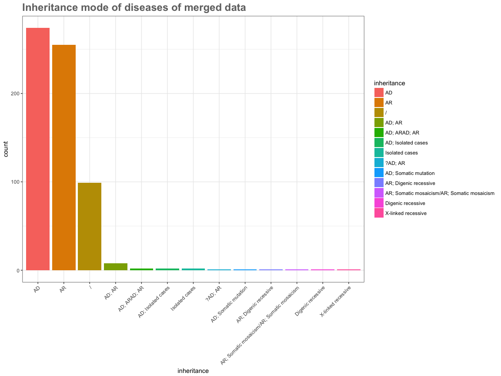
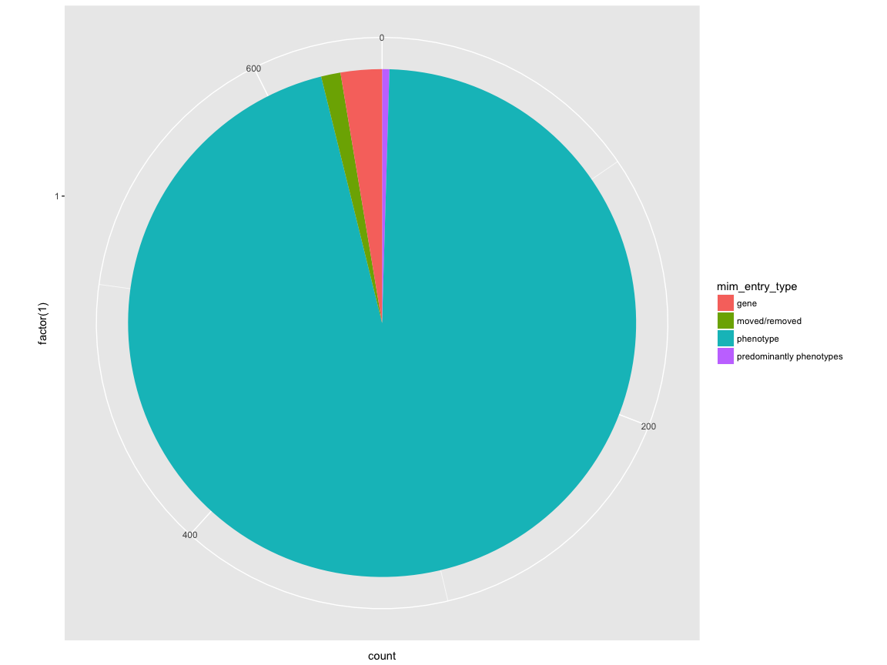
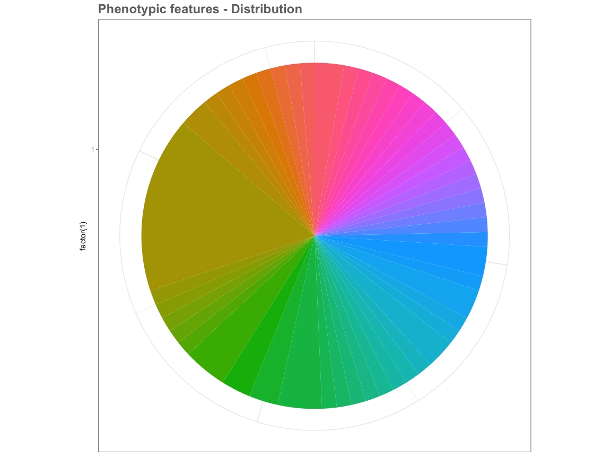

hw10-unwrapped-api
================
My Linh Thibodeau
2017-11-29

``` r
suppressMessages(suppressWarnings(library(XML)))
suppressMessages(suppressWarnings(library(xml2)))
suppressMessages(suppressWarnings(library(dplyr)))
knitr::opts_chunk$set(fig.width=12, fig.height=9)
suppressMessages(suppressWarnings(library(knitr)))
suppressMessages(suppressWarnings(library(kableExtra)))
options(knitr.table.format = "html")
suppressMessages(suppressWarnings(library(tidyverse)))
suppressMessages(suppressWarnings(library(purrr)))
suppressMessages(suppressWarnings(library(stringr)))
suppressMessages(suppressWarnings(library(forcats)))
suppressMessages(suppressWarnings(library(httr)))
suppressMessages(suppressWarnings(library(jsonlite)))
suppressMessages(suppressWarnings(library(glue)))
suppressMessages(suppressWarnings(library(methods)))
```

Introduction
============

In this homework, I will be working with the Online Mendelian Inheritance of Man - [OMIM](https://omim.org/) data as well as previously used merged data from [DECIPHER](http://decipher.sanger.ac.uk), [Orphanet](http://www.orpha.net) and [HGNC](https://www.genenames.org/cgi-bin/statistics) (see references and [homework 8](https://github.com/mylinhthibodeau/STAT545-HW-thibodeau-mylinh/tree/master/stat547-hw8-thibodeau-mylinh) for more information)

Extensive information on the OMIM API is available [here](https://omim.org/help/api), but I will provide a few examples of query and functions to query the API.

**IMPORTANT:** This work is adapted from Dave Tang's tutorial on Getting started with the OMIM api [here](https://davetang.org/muse/2015/03/17/getting-started-with-the-omim-api/).

**IMPORTANT:** An alternative method has been used to retrieve the OMIM API data: I mainly used adapted functions instead of `GET()` from the library httr.

**IMPORTANT:** I spent quite a bit of time trying to make some output files that you guys could see while respecting the protected data restriction of the OMIM API. Please install the packages XML and xml2 in order to be able to take a better look at the OMIM API xml output examples in the [data\_sample](https://github.com/mylinhthibodeau/STAT545-HW-thibodeau-mylinh/tree/master/stat547-hw10-thibodeau-mylinh/data_sample), and otherwise, I have put some data samples in the homework, but the aesthetic of it is not great.

Homework 10 requirements
========================

Here is the breakdown of requirements and corresponding sections:

-   Get data from API - Section A (part 1, 2, 3, 4, 5) and Section D (part 1)
-   Clean and tidy into dataframes - Section B (part 2) and Section C and Section D (part 2)
-   Save output to files
    -   protected data has been saved under the data folder - not public (e.g. mim2gene\_and\_inheritance\_DDG2P\_hgnc\_orphadata.tsv)
    -   sample data for reviewers saved under [data\_sample](https://github.com/mylinhthibodeau/STAT545-HW-thibodeau-mylinh/tree/master/stat547-hw10-thibodeau-mylinh/data_sample)
-   Use httr and `GET()` - Section F contains some examples of API query using httr. A new function using httr and glue is defined.

SECTION A - Writing functions to work with OMIM API
---------------------------------------------------

### Part 1 - Get the OMIM API key "privately"

I have stored privately my OMIM API key and I will set the key for later use in building queries.

``` r
key <- getOption("private_omim_api_key")
my_key <- paste0("apiKey=", key)
```

### Part 2 - Function to build URL and get XML

The general format of query (defaul XML) is `http://api.omim.org/api/entry?mimNumber=100100&apiKey=key&include=text&include=geneMap`. This link does not work because my API key is private, but it gives you a general idea of the format.

``` r
get_omim_to_xml <- function(
    omim_id = 277700,
    text = FALSE, #Includes the text field sections with the entry.
    existflags = FALSE, #Include the 'exists' flags with the entry (clinical synopsis, allelic variant, gene map & phenotype map).
    allelicVariantList = FALSE, #Includes the allelic variant list with the entry.
    clinicalSynopsis = FALSE, #Include the clinical synopsis with the entry.
    seeAlso = FALSE, #Includes the 'see also' field with the entry.
    referenceList = FALSE, #Include the reference list with the entry.
    geneMap = FALSE, #Include the gene map/phenotype map data with the entry.
    externalLinks = FALSE, #Include the external links with the entry.
    contributors = FALSE, #Includes the 'contributors' field with the entry.
    creationDate = FALSE, #Includes the 'creation date' field with the entry.
    editHistory = FALSE, #Includes the 'edit history' field with the entry.
    dates = FALSE, #Include the dates data with the entry.
    all = FALSE #Include the above data with the entry.
){
    # Obtain the arguments the functions calls to build an URL and get XML
    list_arguments <- as.list(match.call())
    my_mim   <- paste('mimNumber=', omim_id, sep='')
    my_link  <- 'http://api.omim.org/api/entry?'
    my_query <- paste(my_link, my_mim, my_key, sep = "&")
    
    #loop through all the arguments
    for (elem in names(list_arguments)){
        #skip the omid_id and blank argument
        if(!elem %in% '' && !elem %in% 'omim_id'){
             my_include <- paste('&', 'include=', elem, sep='')
             my_query <- paste(my_query, my_include, sep='')
             }
        }
xmlParse(my_query)
}
```

#### Peak at data output

I have set the default OMIM id to 277700, which corresponds to Werner syndrome.

**IMPORTANT** The xml functions can not be knitr to github document as they are using my private key. As a replacement, I have saved some samples of data for you under [data\_sample](https://github.com/mylinhthibodeau/STAT545-HW-thibodeau-mylinh/tree/master/stat547-hw10-thibodeau-mylinh/data_sample). I have kept the functions below to indicate the code that was used to generate the xml documents and associated datasets.

``` r
# get_omim_xml_werner_example1 <- get_omim_to_xml()
# class(get_omim_xml_werner_example1)
# saveXML(get_omim_xml_werner_example1, "data_sample/get_omim_xml_werner_example1.xml")
read_xml("data_sample/get_omim_xml_werner_example1.xml") %>% 
    xmlParse() 
```

    ## <?xml version="1.0" encoding="UTF-8"?>
    ## <omim version="1.0">
    ##   <entryList>
    ##     <entry>
    ##       <prefix>#</prefix>
    ##       <mimNumber>277700</mimNumber>
    ##       <status>live</status>
    ##       <titles>
    ##         <preferredTitle>WERNER SYNDROME; WRN</preferredTitle>
    ##       </titles>
    ##     </entry>
    ##   </entryList>
    ## </omim>
    ## 

Let's peak at the structure of the geneMap and the information it contains.

**IMPORTANT** The xml functions can not be knitr to github document as they are using my private key. As a replacement, I have saved some samples of data for you under [data\_sample](https://github.com/mylinhthibodeau/STAT545-HW-thibodeau-mylinh/tree/master/stat547-hw10-thibodeau-mylinh/data_sample). I have kept the functions below to indicate the code that was used to generate the xml documents and associated datasets.

``` r
# get_omim_xml_werner_example2 <- get_omim_to_xml(geneMap = TRUE)
# saveXML(get_omim_xml_werner_example2, "data_sample/get_omim_xml_werner_example2.xml")
read_xml("data_sample/get_omim_xml_werner_example2.xml") %>% 
    xmlParse() 
```

    ## <?xml version="1.0" encoding="UTF-8"?>
    ## <omim version="1.0">
    ##   <entryList>
    ##     <entry>
    ##       <prefix>#</prefix>
    ##       <mimNumber>277700</mimNumber>
    ##       <status>live</status>
    ##       <titles>
    ##         <preferredTitle>WERNER SYNDROME; WRN</preferredTitle>
    ##       </titles>
    ##       <phenotypeMapList>
    ##         <phenotypeMap>
    ##           <mimNumber>604611</mimNumber>
    ##           <phenotype>Werner syndrome</phenotype>
    ##           <phenotypeMimNumber>277700</phenotypeMimNumber>
    ##           <phenotypeMappingKey>3</phenotypeMappingKey>
    ##           <phenotypeInheritance>Autosomal recessive</phenotypeInheritance>
    ##           <sequenceID>6876</sequenceID>
    ##           <chromosome>8</chromosome>
    ##           <chromosomeSymbol>8</chromosomeSymbol>
    ##           <chromosomeSort>171</chromosomeSort>
    ##           <chromosomeLocationStart>31033261</chromosomeLocationStart>
    ##           <chromosomeLocationEnd>31173760</chromosomeLocationEnd>
    ##           <transcript>uc003xio.5</transcript>
    ##           <cytoLocation>8p12-p11.2</cytoLocation>
    ##           <computedCytoLocation>8p12</computedCytoLocation>
    ##           <geneSymbols>RECQL2, RECQ3, WRN</geneSymbols>
    ##           <geneInheritance/>
    ##         </phenotypeMap>
    ##       </phenotypeMapList>
    ##     </entry>
    ##   </entryList>
    ## </omim>
    ## 

### Part 3 - Function get\_gene (example of "nested" function to parse XML)

Code adapted from Dave Tang [here](https://github.com/davetang/romim).

``` r
get_gene <- function(my_xml){
  my_gene_node <- getNodeSet(my_xml, path = "/omim/entryList/entry/phenotypeMapList/phenotypeMap/geneSymbols")
  xmlSApply(my_gene_node, xmlValue)
}
```

And then we can retrieve the gene corresponding to a specific OMIM id (default is Werner syndrome).

**IMPORTANT** The xml functions can not be knitr to github document as they are using my private key. As a replacement, I have saved some samples of data for you under [data\_sample](https://github.com/mylinhthibodeau/STAT545-HW-thibodeau-mylinh/tree/master/stat547-hw10-thibodeau-mylinh/data_sample). I have kept the functions below to indicate the code that was used to generate the xml documents and associated datasets.

``` r
# get_gene_werner_example3 <- get_gene(get_omim_to_xml(geneMap = TRUE)) %>% as.data.frame()
# write_tsv(get_gene_werner_example3, "data_sample/get_gene_werner_example3.tsv")
read.table("data_sample/get_gene_werner_example3.tsv", sep = "\t", header = TRUE) %>% kable()
```

<table>
<thead>
<tr>
<th style="text-align:left;">
.
</th>
</tr>
</thead>
<tbody>
<tr>
<td style="text-align:left;">
RECQL2, RECQ3, WRN
</td>
</tr>
</tbody>
</table>
### Part 4A - Function get\_title (example of XML parsing)

Now, we need a function to parse the XML and retrieve the disorder **titles** corresponding to the OMIM id.

``` r
get_title <- function(xml =  277700){
  xml_list <- xmlToList(xml)
  return(xml_list$entryList$entry$titles$preferredTitle)
}
```

#### Peak at the data output

Using the default option (Werner syndrome), we obtained the preferredTitle of this disorder.

**IMPORTANT** The xml functions can not be knitr to github document as they are using my private key. As a replacement, I have saved some samples of data for you under [data\_sample](https://github.com/mylinhthibodeau/STAT545-HW-thibodeau-mylinh/tree/master/stat547-hw10-thibodeau-mylinh/data_sample). I have kept the functions below to indicate the code that was used to generate the xml documents and associated datasets.

``` r
# get_title_werner_example4 <- get_title(get_omim_to_xml()) %>% as.data.frame()
# write_tsv(get_title_werner_example4, "data_sample/get_title_werner_example4.tsv")
read.table("data_sample/get_title_werner_example4.tsv", sep = "\t", header = TRUE) %>% kable()
```

<table>
<thead>
<tr>
<th style="text-align:left;">
.
</th>
</tr>
</thead>
<tbody>
<tr>
<td style="text-align:left;">
WERNER SYNDROME; WRN
</td>
</tr>
</tbody>
</table>
### Part 4B - Write a get titles function that accepts a list of OMIM ids

``` r
get_titles_from_list <- function(
    user_list = list(187500, 214800, 188400, 217095) # Set default as diseases with tetralogy of fallot (very frequent or frequent)
    ){
    if (is.list(user_list)){
        my_list_titles <- lapply(lapply(user_list, get_omim_to_xml), get_title)
        df <- data.frame(id=unlist(user_list),
                 title=unlist(my_list_titles))
        return(df)
    }
    else
        return("You have to provide an R Object typeof list.")
}
```

#### Peak at the data output

**IMPORTANT** The xml functions can not be knitr to github document as they are using my private key. As a replacement, I have saved some samples of data for you under [data\_sample](https://github.com/mylinhthibodeau/STAT545-HW-thibodeau-mylinh/tree/master/stat547-hw10-thibodeau-mylinh/data_sample). I have kept the functions below to indicate the code that was used to generate the xml documents and associated datasets.

``` r
# get_titles_from_list_tetralogy_fallot <- get_titles_from_list() 
# write_tsv(get_titles_from_list_tetralogy_fallot, "data_sample/get_titles_from_list_tetralogy_fallot.tsv")
read.table("data_sample/get_titles_from_list_tetralogy_fallot.tsv", sep = "\t", header = TRUE) %>% kable()
```

<table>
<thead>
<tr>
<th style="text-align:right;">
id
</th>
<th style="text-align:left;">
title
</th>
</tr>
</thead>
<tbody>
<tr>
<td style="text-align:right;">
187500
</td>
<td style="text-align:left;">
TETRALOGY OF FALLOT; TOF
</td>
</tr>
<tr>
<td style="text-align:right;">
214800
</td>
<td style="text-align:left;">
CHARGE SYNDROME
</td>
</tr>
<tr>
<td style="text-align:right;">
188400
</td>
<td style="text-align:left;">
DIGEORGE SYNDROME; DGS
</td>
</tr>
<tr>
<td style="text-align:right;">
217095
</td>
<td style="text-align:left;">
CONOTRUNCAL HEART MALFORMATIONS; CTHM
</td>
</tr>
</tbody>
</table>
### Part 5 - Get multiple items from OMIM API

So far, we got the titles (diseases names) from the API, but we can also see what we could do with the clinical synopsis. Let's start by peaking at the structure of xml for clinical synopsis data.

**IMPORTANT** The xml functions can not be knitr to github document as they are using my private key. As a replacement, I have saved some samples of data for you under [data\_sample](https://github.com/mylinhthibodeau/STAT545-HW-thibodeau-mylinh/tree/master/stat547-hw10-thibodeau-mylinh/data_sample). I have kept the functions below to indicate the code that was used to generate the xml documents and associated datasets.

``` r
# get_omim_xml_werner_example5 <- get_omim_to_xml(clinicalSynopsis = TRUE)
# saveXML(get_omim_xml_werner_example5, "data_sample/get_omim_xml_werner_example5.xml")
read_xml("data_sample/get_omim_xml_werner_example5.xml") %>% 
    xmlParse() 
```

    ## <?xml version="1.0" encoding="UTF-8"?>
    ## <omim version="1.0">
    ##   <entryList>
    ##     <entry>
    ##       <prefix>#</prefix>
    ##       <mimNumber>277700</mimNumber>
    ##       <status>live</status>
    ##       <titles>
    ##         <preferredTitle>WERNER SYNDROME; WRN</preferredTitle>
    ##       </titles>
    ##       <clinicalSynopsis>
    ##         <inheritance>Autosomal recessive {SNOMEDCT:258211005} {UMLS C0441748 HP:0000007} {HPO HP:0000007 C0441748,C4020899}</inheritance>
    ##         <growthHeight>Short stature {SNOMEDCT:422065006,237837007,237836003} {ICD10CM:R62.52,E34.3} {ICD9CM:783.43} {UMLS C0013336,C0349588,C2237041,C2919142 HP:0004322,HP:0003510} {HPO HP:0004322 C0349588}</growthHeight>
    ##         <growthOther>Stocky trunk {UMLS C1848476}</growthOther>
    ##         <headAndNeckFace>Prematurely aged face {UMLS C1857710 HP:0005328} {HPO HP:0005328 C1857710}</headAndNeckFace>
    ##         <headAndNeckEyes>Cataracts {SNOMEDCT:193570009,95722004,247053007,128306009} {ICD10CM:H26.9} {ICD9CM:366,366.9} {UMLS C0521707,C0086543 HP:0000518} {HPO HP:0000518 C0086543,C1510497};
    ## Retinal degeneration {SNOMEDCT:95695004} {UMLS C0035304 HP:0000546,HP:0001105} {HPO HP:0000546 C0035304}</headAndNeckEyes>
    ##         <headAndNeckNose>Beaked nose {UMLS C0240538 HP:0000444} {HPO HP:0000444 C0240538}</headAndNeckNose>
    ##         <cardiovascularHeart>Premature arteriosclerosis {UMLS C1848486 HP:0005177} {HPO HP:0005177 C1848486,C4280503}</cardiovascularHeart>
    ##         <skeletal>Osteoporosis {SNOMEDCT:64859006} {ICD10CM:Z82.62,M81.0} {ICD9CM:733.0,V17.81,733.00} {UMLS C2911643,C0029456,C1962963 HP:0000939,HP:0040160} {HPO HP:0000939 C0029456}</skeletal>
    ##         <skeletalLimbs>Slender limbs {UMLS C1848480}</skeletalLimbs>
    ##         <skinNailsHairSkin>Scleroderma-like skin, especially of face and distal extremities {UMLS C1848483};
    ## Subcutaneous calcification {SNOMEDCT:17141001} {UMLS C0263625 HP:0007618} {HPO HP:0007618 C0263625};
    ## Ulceration {SNOMEDCT:56208002,263913002,255321001,429040005} {UMLS C3887532,C1963256,C0041582}</skinNailsHairSkin>
    ##         <skinNailsHairHair>Thin, sparse, gray {UMLS C1848484};
    ## Premature balding {UMLS C1848485}</skinNailsHairHair>
    ##         <endocrineFeatures>Diabetes mellitus {SNOMEDCT:73211009} {ICD10CM:E08-E13} {ICD9CM:250} {UMLS C0011849 HP:0000819} {HPO HP:0000819 C0011849};
    ## Hypogonadism {SNOMEDCT:48130008} {UMLS C0020619 HP:0000135} {HPO HP:0000135 C0020619}</endocrineFeatures>
    ##         <neoplasia>Malignancy in approximately 10% {UMLS C1848478};
    ## Osteosarcoma and meningioma especially {UMLS C1848479}</neoplasia>
    ##         <laboratoryAbnormalities>Variegated translocation mosaicism in cultured fibroblasts {UMLS C1848481};
    ## Poor mitogenic response to growth factors {UMLS C1848482}</laboratoryAbnormalities>
    ##         <molecularBasis>Caused by mutation in the RecQ protein-like 2 gene (RECQL2, {604611.0001})</molecularBasis>
    ##       </clinicalSynopsis>
    ##     </entry>
    ##   </entryList>
    ## </omim>
    ## 

``` r
get_clinical_synopsis_as_list <- function(xml){
    xml_list <- xmlToList(xml)
    #my_clinical_node <- getNodeSet(my_xml, path = "/omim/entryList/entry/clinicalSynopsisList/clinicalSynopsis")
    #xmlSApply(my_clinical_node, xmlValue)
    my_query <- xml_list$entryList$entry$clinicalSynopsis
    #my_query_parse <- xml_list()
    return(my_query)
}
```

**IMPORTANT** The xml functions can not be knitr to github document as they are using my private key. As a replacement, I have saved some samples of data for you under [data\_sample](https://github.com/mylinhthibodeau/STAT545-HW-thibodeau-mylinh/tree/master/stat547-hw10-thibodeau-mylinh/data_sample). I have kept the functions below to indicate the code that was used to generate the xml documents and associated datasets.

``` r
# clinical_synopsis_werner_list <- get_clinical_synopsis_as_list(get_omim_to_xml(clinicalSynopsis = TRUE))
# capture.output(clinical_synopsis_werner_list, file = "data_sample/clinical_synopsis_werner_list.txt")
read.table("data_sample/clinical_synopsis_werner_list.txt", sep="\t") %>% kable()
```

<table>
<thead>
<tr>
<th style="text-align:left;">
V1
</th>
</tr>
</thead>
<tbody>
<tr>
<td style="text-align:left;">
$inheritance
</td>
</tr>
<tr>
<td style="text-align:left;">
\[1\] Autosomal recessive {SNOMEDCT:258211005} {UMLS C0441748 HP:0000007} {HPO HP:0000007 C0441748,C4020899}
</td>
</tr>
<tr>
<td style="text-align:left;">
$growthHeight
</td>
</tr>
<tr>
<td style="text-align:left;">
\[1\] Short stature {SNOMEDCT:422065006,237837007,237836003} {ICD10CM:R62.52,E34.3} {ICD9CM:783.43} {UMLS C0013336,C0349588,C2237041,C2919142 HP:0004322,HP:0003510} {HPO HP:0004322 C0349588}
</td>
</tr>
<tr>
<td style="text-align:left;">
$growthOther
</td>
</tr>
<tr>
<td style="text-align:left;">
\[1\] Stocky trunk {UMLS C1848476}
</td>
</tr>
<tr>
<td style="text-align:left;">
$headAndNeckFace
</td>
</tr>
<tr>
<td style="text-align:left;">
\[1\] Prematurely aged face {UMLS C1857710 HP:0005328} {HPO HP:0005328 C1857710}
</td>
</tr>
<tr>
<td style="text-align:left;">
$headAndNeckEyes
</td>
</tr>
<tr>
<td style="text-align:left;">
\[1\] Cataracts {SNOMEDCT:193570009,95722004,247053007,128306009} {ICD10CM:H26.9} {ICD9CM:366,366.9} {UMLS C0521707,C0086543 HP:0000518} {HPO HP:0000518 C0086543,C1510497};degeneration {SNOMEDCT:95695004} {UMLS C0035304 HP:0000546,HP:0001105} {HPO HP:0000546 C0035304}
</td>
</tr>
<tr>
<td style="text-align:left;">
$headAndNeckNose
</td>
</tr>
<tr>
<td style="text-align:left;">
\[1\] Beaked nose {UMLS C0240538 HP:0000444} {HPO HP:0000444 C0240538}
</td>
</tr>
<tr>
<td style="text-align:left;">
$cardiovascularHeart
</td>
</tr>
<tr>
<td style="text-align:left;">
\[1\] Premature arteriosclerosis {UMLS C1848486 HP:0005177} {HPO HP:0005177 C1848486,C4280503}
</td>
</tr>
<tr>
<td style="text-align:left;">
$skeletal
</td>
</tr>
<tr>
<td style="text-align:left;">
\[1\] Osteoporosis {SNOMEDCT:64859006} {ICD10CM:Z82.62,M81.0} {ICD9CM:733.0,V17.81,733.00} {UMLS C2911643,C0029456,C1962963 HP:0000939,HP:0040160} {HPO HP:0000939 C0029456}
</td>
</tr>
<tr>
<td style="text-align:left;">
$skeletalLimbs
</td>
</tr>
<tr>
<td style="text-align:left;">
\[1\] Slender limbs {UMLS C1848480}
</td>
</tr>
<tr>
<td style="text-align:left;">
$skinNailsHairSkin
</td>
</tr>
<tr>
<td style="text-align:left;">
\[1\] Scleroderma-like skin, especially of face and distal extremities {UMLS C1848483};calcification {SNOMEDCT:17141001} {UMLS C0263625 HP:0007618} {HPO HP:0007618 C0263625};
</td>
</tr>
<tr>
<td style="text-align:left;">
$skinNailsHairHair
</td>
</tr>
<tr>
<td style="text-align:left;">
\[1\] Thin, sparse, gray {UMLS C1848484};balding {UMLS C1848485}
</td>
</tr>
<tr>
<td style="text-align:left;">
$endocrineFeatures
</td>
</tr>
<tr>
<td style="text-align:left;">
\[1\] Diabetes mellitus {SNOMEDCT:73211009} {ICD10CM:E08-E13} {ICD9CM:250} {UMLS C0011849 HP:0000819} {HPO HP:0000819 C0011849};
</td>
</tr>
<tr>
<td style="text-align:left;">
$neoplasia
</td>
</tr>
<tr>
<td style="text-align:left;">
\[1\] Malignancy in approximately 10% {UMLS C1848478};and meningioma especially {UMLS C1848479}
</td>
</tr>
<tr>
<td style="text-align:left;">
$laboratoryAbnormalities
</td>
</tr>
<tr>
<td style="text-align:left;">
\[1\] Variegated translocation mosaicism in cultured fibroblasts {UMLS C1848481};mitogenic response to growth factors {UMLS C1848482}
</td>
</tr>
<tr>
<td style="text-align:left;">
$molecularBasis
</td>
</tr>
<tr>
<td style="text-align:left;">
\[1\] Caused by mutation in the RecQ protein-like 2 gene (RECQL2, {604611.0001})
</td>
</tr>
</tbody>
</table>
Note. I know the output is not visually pleasing, but I am just trying to show that the API query worked and to prove to you that I was able to obtain the desired web data outpub.

------------------------------------------------------------------------

SECTION B - Merging data from mim2gene dataset with OMIM API output from functions
----------------------------------------------------------------------------------

### Part 1 - Get the mim2gene data

Complementary to getting access to the OMIM API, OMIM allowed me to download the mim2gene.txt data, which lists OMIM ids and the corresponding OMIM entry type, Entrez gene id, HGNC is and Ensembl id.

``` r
mim2gene_data <- read.table("data/mim2gene.txt", header=FALSE, sep="\t")
colnames(mim2gene_data) <- c("id", "mim_entry_type", "entrez_gene_id", "hgnc", "ensembl_gene_id")
```

#### Peak at the data output

``` r
head(mim2gene_data) %>% kable()
```

<table>
<thead>
<tr>
<th style="text-align:right;">
id
</th>
<th style="text-align:left;">
mim\_entry\_type
</th>
<th style="text-align:right;">
entrez\_gene\_id
</th>
<th style="text-align:left;">
hgnc
</th>
<th style="text-align:left;">
ensembl\_gene\_id
</th>
</tr>
</thead>
<tbody>
<tr>
<td style="text-align:right;">
100050
</td>
<td style="text-align:left;">
predominantly phenotypes
</td>
<td style="text-align:right;">
NA
</td>
<td style="text-align:left;">
</td>
<td style="text-align:left;">
</td>
</tr>
<tr>
<td style="text-align:right;">
100070
</td>
<td style="text-align:left;">
phenotype
</td>
<td style="text-align:right;">
100329167
</td>
<td style="text-align:left;">
</td>
<td style="text-align:left;">
</td>
</tr>
<tr>
<td style="text-align:right;">
100100
</td>
<td style="text-align:left;">
phenotype
</td>
<td style="text-align:right;">
NA
</td>
<td style="text-align:left;">
</td>
<td style="text-align:left;">
</td>
</tr>
<tr>
<td style="text-align:right;">
100200
</td>
<td style="text-align:left;">
predominantly phenotypes
</td>
<td style="text-align:right;">
NA
</td>
<td style="text-align:left;">
</td>
<td style="text-align:left;">
</td>
</tr>
<tr>
<td style="text-align:right;">
100300
</td>
<td style="text-align:left;">
phenotype
</td>
<td style="text-align:right;">
NA
</td>
<td style="text-align:left;">
</td>
<td style="text-align:left;">
</td>
</tr>
<tr>
<td style="text-align:right;">
100500
</td>
<td style="text-align:left;">
moved/removed
</td>
<td style="text-align:right;">
NA
</td>
<td style="text-align:left;">
</td>
<td style="text-align:left;">
</td>
</tr>
</tbody>
</table>
### Part 2 - Merge with OMIM API data

The mim2gene\_data is not really useful in this state, but if we leverage the data from the OMIM API, we will be able to expand this table and make useful genotype-phenotype correlations.

    system.time(mim2gene_get_mim_api_titles <- lapply(lapply(mim2gene_data$id, get_omim_to_xml), get_title))

    user   system  elapsed 

99.193 13.788 5675.498

*So it did take about 3h, as mentioned by David Tang.*

Transform the largest list obtained into a dataframe.

    df <- data.frame(id=mim2gene_data$id,
                     title=unlist(mim2gene_get_mim_api_titles))

Let's merge this list of diseases titles with the previous mim2gene\_data table.

    mim2gene_data_expanded_titles <- merge(x=mim2gene_data, y=df, by='id')
    dim(mim2gene_data_expanded_titles)

Let's save this new dataset.

    write_tsv(mim2gene_data_expanded_titles, "data/mim2gene_data_expanded_titles.tsv")

*Since I haven't re-queried the database for all the diseases titles (which takes 3h), I have to read the table I generated earlier.*

``` r
mim2gene_data_expanded_titles <- read.table("data/mim2gene_data_expanded_titles.tsv", sep = "\t", header = TRUE)
```

*And let's store the diseases OMIM ids in a variable for later use.*

``` r
omim_db_ids <- mim2gene_data_expanded_titles$id %>% as.data.frame()
colnames(omim_db_ids) <- c("disease.mim")
head(omim_db_ids)
```

    ##   disease.mim
    ## 1      100050
    ## 2      100070
    ## 3      100100
    ## 4      100200
    ## 5      100300
    ## 6      100500

So now we have a much more informative dataframe, which contains both the OMIM ids and the diseases names (**titles**).

``` r
# dim(mim2gene_data_expanded_titles)
mim2gene_data_expanded_titles %>% head() %>% kable()
```

<table>
<thead>
<tr>
<th style="text-align:right;">
id
</th>
<th style="text-align:left;">
mim\_entry\_type
</th>
<th style="text-align:right;">
entrez\_gene\_id
</th>
<th style="text-align:left;">
hgnc
</th>
<th style="text-align:left;">
ensembl\_gene\_id
</th>
<th style="text-align:left;">
title
</th>
</tr>
</thead>
<tbody>
<tr>
<td style="text-align:right;">
100050
</td>
<td style="text-align:left;">
predominantly phenotypes
</td>
<td style="text-align:right;">
NA
</td>
<td style="text-align:left;">
</td>
<td style="text-align:left;">
</td>
<td style="text-align:left;">
AARSKOG SYNDROME, AUTOSOMAL DOMINANT
</td>
</tr>
<tr>
<td style="text-align:right;">
100070
</td>
<td style="text-align:left;">
phenotype
</td>
<td style="text-align:right;">
100329167
</td>
<td style="text-align:left;">
</td>
<td style="text-align:left;">
</td>
<td style="text-align:left;">
AORTIC ANEURYSM, FAMILIAL ABDOMINAL, 1; AAA1
</td>
</tr>
<tr>
<td style="text-align:right;">
100100
</td>
<td style="text-align:left;">
phenotype
</td>
<td style="text-align:right;">
NA
</td>
<td style="text-align:left;">
</td>
<td style="text-align:left;">
</td>
<td style="text-align:left;">
PRUNE BELLY SYNDROME; PBS
</td>
</tr>
<tr>
<td style="text-align:right;">
100200
</td>
<td style="text-align:left;">
predominantly phenotypes
</td>
<td style="text-align:right;">
NA
</td>
<td style="text-align:left;">
</td>
<td style="text-align:left;">
</td>
<td style="text-align:left;">
ABDUCENS PALSY
</td>
</tr>
<tr>
<td style="text-align:right;">
100300
</td>
<td style="text-align:left;">
phenotype
</td>
<td style="text-align:right;">
NA
</td>
<td style="text-align:left;">
</td>
<td style="text-align:left;">
</td>
<td style="text-align:left;">
ADAMS-OLIVER SYNDROME 1; AOS1
</td>
</tr>
<tr>
<td style="text-align:right;">
100500
</td>
<td style="text-align:left;">
moved/removed
</td>
<td style="text-align:right;">
NA
</td>
<td style="text-align:left;">
</td>
<td style="text-align:left;">
</td>
<td style="text-align:left;">
MOVED TO 200150
</td>
</tr>
</tbody>
</table>

------------------------------------------------------------------------

SECTION C - BUILDING ON PREVIOUS STAT545/547 HOMEWORK
-----------------------------------------------------

Data manipulation (joining, cleaning and tidying) has been a necessary (and often painful, as explained in most repository README) step in most of my previous STAT545/547 homework and I encountered common challenges. If at this point, you are not convinced that I can obtain from the web and manipulate messy data, you have to checkout my previous homeworks. Here are some examples:

-   [homework 3](https://github.com/mylinhthibodeau/STAT545-HW-thibodeau-mylinh/tree/master/stat545-hw3-thibodeau-mylinh) - [tables and plots](https://github.com/mylinhthibodeau/STAT545-HW-thibodeau-mylinh/blob/master/stat545-hw3-thibodeau-mylinh/stat545-hw03-thibodeau-mylinh.md) - Challenge with duplicated factors (genes names)
-   [homework 4](https://github.com/mylinhthibodeau/STAT545-HW-thibodeau-mylinh/tree/master/stat545-hw4-thibodeau-mylinh) - [long version](https://github.com/mylinhthibodeau/STAT545-HW-thibodeau-mylinh/blob/master/stat545-hw4-thibodeau-mylinh/long-version-stat545-hw04-thibodeau-mylinh.md) - Challenge with data structure, as I realized midway that I could not perform some of the required analyses due to the characteristics of my dataset, and I had to restart with a new dataset (The Cancer Genome Atlas).
-   [homework 5](https://github.com/mylinhthibodeau/STAT545-HW-thibodeau-mylinh/tree/master/stat545-hw5-thibodeau-mylinh) - [tables and plots](https://github.com/mylinhthibodeau/STAT545-HW-thibodeau-mylinh/blob/master/stat545-hw5-thibodeau-mylinh/stat545-hw05-thibodeau-mylinh.md) - Challenge with `read_table2()`, and subsequent discovery that some reading functions do no deal with white spaces well.
-   [homework 6](https://github.com/mylinhthibodeau/STAT545-HW-thibodeau-mylinh/blob/master/stat547-hw6-thibodeau-mylinh/stat547-hw06-thibodeau-mylinh.Rmd) - [gene ontology and Genomic Data Commons](https://github.com/mylinhthibodeau/STAT545-HW-thibodeau-mylinh/blob/master/stat547-hw6-thibodeau-mylinh/stat547-hw06-thibodeau-mylinh.Rmd) - Challenges dealing with a new file format (".obo") and new data structure/organization of gene ontology, and challenges dealing with nested list of Genomic Data Commons (cancer data), and the whole SSL certificate issue.
-   [homework 7](https://github.com/mylinhthibodeau/STAT545-HW-thibodeau-mylinh/tree/master/stat547-hw7-thibodeau-mylinh) - [mut\_sig\_tables.R](https://github.com/mylinhthibodeau/STAT545-HW-thibodeau-mylinh/blob/master/stat547-hw7-thibodeau-mylinh/mut_sig_tables.R) - Multiple data manipulation steps with `gather()` function of tidyr, and challenges in trying to join them with mutational signatures.
-   [homework 8](https://github.com/mylinhthibodeau/STAT545-HW-thibodeau-mylinh/tree/master/stat547-hw8-thibodeau-mylinh) - [dataframe manipulation](https://github.com/mylinhthibodeau/STAT545-HW-thibodeau-mylinh/blob/master/stat547-hw8-thibodeau-mylinh/genomic-disorders-exploration-data-manipulation.Rmd) - There were so many steps of data manipulation required that I decided to make and Rmd file and explain the process as part of building my ShinyApp - Genomic Disorders Exploration.
-   [homework 9](https://github.com/mylinhthibodeau/powers3) - Challenge with the superpowers dataset, which contains non ASCII characters (still under work at this time).

Therefore, instead of reinventing the wheel, I will build on some of the previous work accomplished ! Specifically, I will use the data from my [homework 8](https://github.com/mylinhthibodeau/STAT545-HW-thibodeau-mylinh/tree/master/stat547-hw8-thibodeau-mylinh) Shiny App (partial data available [here](https://github.com/mylinhthibodeau/STAT545-HW-thibodeau-mylinh/tree/master/stat547-hw8-thibodeau-mylinh/data))

#### Part 1 - Read and peak at merged dataset (DECIPHER, HGNC and Orphanet)

Now, let's read the previously generated merged data from DECIPHER, HGNC and Orphanet as well as the list of omim disease ids from this merged dataset.

``` r
DDG2P_hgnc_orphadata <- read.table("data/DDG2P_hgnc_orphadata.tsv", header = TRUE, sep = "\t")
```

    ## Warning in scan(file = file, what = what, sep = sep, quote = quote, dec =
    ## dec, : EOF within quoted string

    ## Warning in scan(file = file, what = what, sep = sep, quote = quote, dec =
    ## dec, : number of items read is not a multiple of the number of columns

``` r
DDG2P_hgnc_orphadata_list_disease_mim <- read.table("data/DDG2P_orphadata_list_disease.mim.txt", header = TRUE, sep = "\t")
```

Please refer to homework 8 for additional details on these datasets, but here is a little peak at the data.

``` r
DDG2P_hgnc_orphadata %>% head() %>% kable()
```

<table>
<thead>
<tr>
<th style="text-align:left;">
phenotype\_id
</th>
<th style="text-align:left;">
disorder\_name
</th>
<th style="text-align:left;">
phenotype\_name
</th>
<th style="text-align:left;">
frequency
</th>
<th style="text-align:left;">
gene.symbol
</th>
<th style="text-align:left;">
gene.mim
</th>
<th style="text-align:left;">
disease.mim
</th>
<th style="text-align:left;">
allelic.requirement
</th>
<th style="text-align:left;">
DDD.category
</th>
<th style="text-align:left;">
mutation.consequence
</th>
<th style="text-align:left;">
organ.specificity.list
</th>
<th style="text-align:right;">
hgnc.id
</th>
<th style="text-align:left;">
name
</th>
<th style="text-align:left;">
locus\_group
</th>
<th style="text-align:left;">
locus\_type
</th>
<th style="text-align:left;">
status
</th>
<th style="text-align:left;">
location
</th>
<th style="text-align:left;">
location\_sortable
</th>
<th style="text-align:left;">
alias\_symbol
</th>
<th style="text-align:left;">
alias\_name
</th>
<th style="text-align:left;">
prev\_symbol
</th>
<th style="text-align:left;">
prev\_name
</th>
<th style="text-align:left;">
gene\_family
</th>
</tr>
</thead>
<tbody>
<tr>
<td style="text-align:left;">
NA
</td>
<td style="text-align:left;">
oculoauricular syndrome
</td>
<td style="text-align:left;">
NA
</td>
<td style="text-align:left;">
NA
</td>
<td style="text-align:left;">
HMX1
</td>
<td style="text-align:left;">
142992
</td>
<td style="text-align:left;">
612109
</td>
<td style="text-align:left;">
biallelic
</td>
<td style="text-align:left;">
probable
</td>
<td style="text-align:left;">
loss of function
</td>
<td style="text-align:left;">
Eye;Ear
</td>
<td style="text-align:right;">
5017
</td>
<td style="text-align:left;">
NA
</td>
<td style="text-align:left;">
NA
</td>
<td style="text-align:left;">
NA
</td>
<td style="text-align:left;">
NA
</td>
<td style="text-align:left;">
NA
</td>
<td style="text-align:left;">
NA
</td>
<td style="text-align:left;">
NA
</td>
<td style="text-align:left;">
NA
</td>
<td style="text-align:left;">
NA
</td>
<td style="text-align:left;">
NA
</td>
<td style="text-align:left;">
NA
</td>
</tr>
<tr>
<td style="text-align:left;">
NA
</td>
<td style="text-align:left;">
bardet-biedl syndrome type 14
</td>
<td style="text-align:left;">
NA
</td>
<td style="text-align:left;">
NA
</td>
<td style="text-align:left;">
CEP290
</td>
<td style="text-align:left;">
610142
</td>
<td style="text-align:left;">
209900
</td>
<td style="text-align:left;">
biallelic
</td>
<td style="text-align:left;">
confirmed
</td>
<td style="text-align:left;">
loss of function
</td>
<td style="text-align:left;">
Kidney Renal Tract;Brain/Cognition
</td>
<td style="text-align:right;">
29021
</td>
<td style="text-align:left;">
NA
</td>
<td style="text-align:left;">
NA
</td>
<td style="text-align:left;">
NA
</td>
<td style="text-align:left;">
NA
</td>
<td style="text-align:left;">
NA
</td>
<td style="text-align:left;">
NA
</td>
<td style="text-align:left;">
NA
</td>
<td style="text-align:left;">
NA
</td>
<td style="text-align:left;">
NA
</td>
<td style="text-align:left;">
NA
</td>
<td style="text-align:left;">
NA
</td>
</tr>
<tr>
<td style="text-align:left;">
HP:0000175
</td>
<td style="text-align:left;">
otopalatodigital syndrome type 1
</td>
<td style="text-align:left;">
Cleft palate
</td>
<td style="text-align:left;">
Very frequent (99-80%)
</td>
<td style="text-align:left;">
FLNA
</td>
<td style="text-align:left;">
300017
</td>
<td style="text-align:left;">
311300
</td>
<td style="text-align:left;">
hemizygous
</td>
<td style="text-align:left;">
confirmed
</td>
<td style="text-align:left;">
uncertain
</td>
<td style="text-align:left;">
Face;Skeleton;Brain/Cognition
</td>
<td style="text-align:right;">
3754
</td>
<td style="text-align:left;">
filamin A
</td>
<td style="text-align:left;">
protein-coding gene
</td>
<td style="text-align:left;">
gene with protein product
</td>
<td style="text-align:left;">
Approved
</td>
<td style="text-align:left;">
Xq28
</td>
<td style="text-align:left;">
Xq28
</td>
<td style="text-align:left;">
ABP-280
</td>
<td style="text-align:left;">
actin binding protein 280|alpha filamin
</td>
<td style="text-align:left;">
FLN1|FLN|OPD2|OPD1
</td>
<td style="text-align:left;">
filamin A, alpha (actin binding protein 280)|filamin A, alpha
</td>
<td style="text-align:left;">
</td>
</tr>
<tr>
<td style="text-align:left;">
HP:0000316
</td>
<td style="text-align:left;">
otopalatodigital syndrome type 1
</td>
<td style="text-align:left;">
Hypertelorism
</td>
<td style="text-align:left;">
Very frequent (99-80%)
</td>
<td style="text-align:left;">
FLNA
</td>
<td style="text-align:left;">
300017
</td>
<td style="text-align:left;">
311300
</td>
<td style="text-align:left;">
hemizygous
</td>
<td style="text-align:left;">
confirmed
</td>
<td style="text-align:left;">
uncertain
</td>
<td style="text-align:left;">
Face;Skeleton;Brain/Cognition
</td>
<td style="text-align:right;">
3754
</td>
<td style="text-align:left;">
filamin A
</td>
<td style="text-align:left;">
protein-coding gene
</td>
<td style="text-align:left;">
gene with protein product
</td>
<td style="text-align:left;">
Approved
</td>
<td style="text-align:left;">
Xq28
</td>
<td style="text-align:left;">
Xq28
</td>
<td style="text-align:left;">
ABP-280
</td>
<td style="text-align:left;">
actin binding protein 280|alpha filamin
</td>
<td style="text-align:left;">
FLN1|FLN|OPD2|OPD1
</td>
<td style="text-align:left;">
filamin A, alpha (actin binding protein 280)|filamin A, alpha
</td>
<td style="text-align:left;">
</td>
</tr>
<tr>
<td style="text-align:left;">
HP:0000336
</td>
<td style="text-align:left;">
otopalatodigital syndrome type 1
</td>
<td style="text-align:left;">
Prominent supraorbital ridges
</td>
<td style="text-align:left;">
Very frequent (99-80%)
</td>
<td style="text-align:left;">
FLNA
</td>
<td style="text-align:left;">
300017
</td>
<td style="text-align:left;">
311300
</td>
<td style="text-align:left;">
hemizygous
</td>
<td style="text-align:left;">
confirmed
</td>
<td style="text-align:left;">
uncertain
</td>
<td style="text-align:left;">
Face;Skeleton;Brain/Cognition
</td>
<td style="text-align:right;">
3754
</td>
<td style="text-align:left;">
filamin A
</td>
<td style="text-align:left;">
protein-coding gene
</td>
<td style="text-align:left;">
gene with protein product
</td>
<td style="text-align:left;">
Approved
</td>
<td style="text-align:left;">
Xq28
</td>
<td style="text-align:left;">
Xq28
</td>
<td style="text-align:left;">
ABP-280
</td>
<td style="text-align:left;">
actin binding protein 280|alpha filamin
</td>
<td style="text-align:left;">
FLN1|FLN|OPD2|OPD1
</td>
<td style="text-align:left;">
filamin A, alpha (actin binding protein 280)|filamin A, alpha
</td>
<td style="text-align:left;">
</td>
</tr>
<tr>
<td style="text-align:left;">
HP:0000365
</td>
<td style="text-align:left;">
otopalatodigital syndrome type 1
</td>
<td style="text-align:left;">
Hearing impairment
</td>
<td style="text-align:left;">
Very frequent (99-80%)
</td>
<td style="text-align:left;">
FLNA
</td>
<td style="text-align:left;">
300017
</td>
<td style="text-align:left;">
311300
</td>
<td style="text-align:left;">
hemizygous
</td>
<td style="text-align:left;">
confirmed
</td>
<td style="text-align:left;">
uncertain
</td>
<td style="text-align:left;">
Face;Skeleton;Brain/Cognition
</td>
<td style="text-align:right;">
3754
</td>
<td style="text-align:left;">
filamin A
</td>
<td style="text-align:left;">
protein-coding gene
</td>
<td style="text-align:left;">
gene with protein product
</td>
<td style="text-align:left;">
Approved
</td>
<td style="text-align:left;">
Xq28
</td>
<td style="text-align:left;">
Xq28
</td>
<td style="text-align:left;">
ABP-280
</td>
<td style="text-align:left;">
actin binding protein 280|alpha filamin
</td>
<td style="text-align:left;">
FLN1|FLN|OPD2|OPD1
</td>
<td style="text-align:left;">
filamin A, alpha (actin binding protein 280)|filamin A, alpha
</td>
<td style="text-align:left;">
</td>
</tr>
</tbody>
</table>
And a peak at the diseases OMIM ids.

``` r
# dim(DDG2P_hgnc_orphadata_list_disease_mim)
# class(DDG2P_hgnc_orphadata_list_disease_mim)
DDG2P_hgnc_orphadata_list_disease_mim %>% head() %>% kable()
```

<table>
<thead>
<tr>
<th style="text-align:right;">
disease.mim
</th>
</tr>
</thead>
<tbody>
<tr>
<td style="text-align:right;">
612109
</td>
</tr>
<tr>
<td style="text-align:right;">
209900
</td>
</tr>
<tr>
<td style="text-align:right;">
610189
</td>
</tr>
<tr>
<td style="text-align:right;">
611755
</td>
</tr>
<tr>
<td style="text-align:right;">
610188
</td>
</tr>
<tr>
<td style="text-align:right;">
611134
</td>
</tr>
</tbody>
</table>
Now, let's find the OMIM ids common to OMIM database and orphadata

``` r
common_mim_ids <- inner_join(DDG2P_hgnc_orphadata_list_disease_mim, omim_db_ids, by = c( "disease.mim" = "disease.mim"))
dim(common_mim_ids)
```

    ## [1] 918   1

Let's make a list of these omim diseases ids of interest.

``` r
my_omim_list <- common_mim_ids$disease.mim %>% as.list()
```

------------------------------------------------------------------------

SECTION D - TARGETED API QUERIES
--------------------------------

Since we saw that an OMIM database-wide query can take up to 3h, we will only make targeted data queries on a subset of the OMIM data now.

### Part 1 - Function get\_inheritance (example of XML parsing)

Now, we need a function to parse the XML and retrieve the disorder **inheritance** corresponding to the OMIM id.

``` r
get_inheritance <- function(my_xml){
    my_inheritance_node <- NULL
    my_inheritance_node <- getNodeSet(my_xml, path = "/omim/entryList/entry/phenotypeMapList/phenotypeMap/phenotypeInheritance")
  my_inheritance_result <- xmlSApply(my_inheritance_node, xmlValue)
  
  if (is.null(my_inheritance_node)){
    
  }
  return(my_inheritance_result)
}
```

Let's peak at the output for mim.disease 303600 (Coffin-Lowry syndrome).

**IMPORTANT** The xml functions can not be knitr to github document as they are using my private key. As a replacement, I have saved some samples of data for you under [data\_sample](https://github.com/mylinhthibodeau/STAT545-HW-thibodeau-mylinh/tree/master/stat547-hw10-thibodeau-mylinh/data_sample). I have kept the functions below to indicate the code that was used to generate the xml documents and associated datasets.

``` r
# get_inheritance_coffin_lowry_example6 <- get_inheritance(get_omim_to_xml(303600, geneMap=TRUE))
# capture.output(get_inheritance_coffin_lowry_example6, file = "data_sample/get_inheritance_coffin_lowry_example6.txt")
read.table("data_sample/get_inheritance_coffin_lowry_example6.txt", sep = "\t") %>% kable()
```

<table>
<thead>
<tr>
<th style="text-align:left;">
V1
</th>
</tr>
</thead>
<tbody>
<tr>
<td style="text-align:left;">
\[1\] Isolated cases; X-linked dominant
</td>
</tr>
</tbody>
</table>
Let's make a function that accepts a list of OMIM ids and provides the inheritance for these 918 OMIM ids. The first step is to make a function that will determine if the data is already available or not.

``` r
get_inheritance_from_list <- function(my_file, user_list){
    inheritance_list <- try(read_tsv(my_file, col_names = FALSE))
    if (!inherits(inheritance_list, "try-error")) {
        read_tsv(my_file)
        return("The file is present")
        }
    else
        inheritance_list <- list()
        if (is.list(user_list)){
            for (i in 1:length(user_list)){
                inheritance <- get_inheritance(get_omim_to_xml(user_list[i], geneMap=TRUE))
                
                if (length(inheritance) >1){
                    inheritance <- paste(inheritance, collapse = "/")
                }
                if (is.list(inheritance) || inheritance == ""){ inheritance_list[i] <- "0" # Missing values are replaced by the "0" character
                } 
                else
                    { inheritance_list[i] <- as.character(inheritance)}
            }
        }
    if (length(inheritance_list) !=0){
        inheritance_df <- inheritance_list %>% as.data.frame()
        write.table(inheritance_df, "data_sample/get_inheritance_from_my_omim_list.tsv", sep = "\n", col.names = FALSE)
        print("The inheritance file was not available, an OMIM API query has been performed and a file written to the folder data_sample/ .")
    }
    else
        print("The inheritance file was available and data has been read.")
    return(inheritance_list)
    }
```

Let's test the function!

**IMPORTANT** The xml functions can not be knitr to github document as they are using my private key. As a replacement, I have saved some samples of data for you under [data\_sample](https://github.com/mylinhthibodeau/STAT545-HW-thibodeau-mylinh/tree/master/stat547-hw10-thibodeau-mylinh/data_sample). I have kept the functions below to indicate the code that was used to generate the xml documents and associated datasets.

``` r
# my_file <- "stat547-hw10-thibodeau-mylinh/data_sample/get_inheritance_from_my_omim_list.tsv"
# my_omim_list <- common_mim_ids$disease.mim %>% as.list() # we already defined this list in a previous section
# get_inheritance_from_my_omim_list <- get_inheritance_from_list(my_file, my_omim_list)
#View(get_inheritance_from_my_omim_list)
get_inheritance_from_my_omim_list2 <- read.table("data_sample/get_inheritance_from_my_omim_list.tsv", sep = "\t", header = FALSE) %>% as.list()
get_inheritance_from_my_omim_list2 <- get_inheritance_from_my_omim_list2$V1
```

(message from function pasted below as an example) `[1] "The inheritance file was not available, an OMIM API query has been performed and a file written to the folder data_sample/ ."`

#### Peak at the data output

Let's look at what kind of data we are dealing with here (and make sure we have the same number of items we started with).

``` r
length(get_inheritance_from_my_omim_list2) # For some reason, there is an added row with the number 1, I will remove it
```

    ## [1] 919

``` r
get_inheritance_from_my_omim_list2 <- get_inheritance_from_my_omim_list2[2:919]
class(get_inheritance_from_my_omim_list2)
```

    ## [1] "factor"

``` r
typeof(get_inheritance_from_my_omim_list2)
```

    ## [1] "integer"

``` r
get_inheritance_from_my_omim_list2 %>% head(10) %>% kable()
```

<table>
<tbody>
<tr>
<td style="text-align:left;">
Autosomal recessive
</td>
</tr>
<tr>
<td style="text-align:left;">
Autosomal recessive
</td>
</tr>
<tr>
<td style="text-align:left;">
0
</td>
</tr>
<tr>
<td style="text-align:left;">
Autosomal recessive
</td>
</tr>
<tr>
<td style="text-align:left;">
Autosomal recessive
</td>
</tr>
<tr>
<td style="text-align:left;">
Autosomal recessive
</td>
</tr>
<tr>
<td style="text-align:left;">
Autosomal dominant
</td>
</tr>
<tr>
<td style="text-align:left;">
Autosomal dominant
</td>
</tr>
<tr>
<td style="text-align:left;">
Autosomal dominant
</td>
</tr>
<tr>
<td style="text-align:left;">
Autosomal dominant
</td>
</tr>
</tbody>
</table>
Both the inheritance list and the omim ids list have 918 items, perfect ! Let's create a dataframe with them, so that we can join this data to the bigger dataset (DECIPHER, HGNC, Orphadata from Orphanet, mim2gene).

### Part 2 - Make some dataframes !

``` r
inheritance_mim_df <- data_frame(as.vector(my_omim_list), as.vector(get_inheritance_from_my_omim_list2))
colnames(inheritance_mim_df) <- c("disease.mim", "inheritance")
inheritance_mim_df %>% head() %>% kable()
```

<table>
<thead>
<tr>
<th style="text-align:left;">
disease.mim
</th>
<th style="text-align:left;">
inheritance
</th>
</tr>
</thead>
<tbody>
<tr>
<td style="text-align:left;">
612109
</td>
<td style="text-align:left;">
Autosomal recessive
</td>
</tr>
<tr>
<td style="text-align:left;">
610189
</td>
<td style="text-align:left;">
Autosomal recessive
</td>
</tr>
<tr>
<td style="text-align:left;">
611755
</td>
<td style="text-align:left;">
0
</td>
</tr>
<tr>
<td style="text-align:left;">
610188
</td>
<td style="text-align:left;">
Autosomal recessive
</td>
</tr>
<tr>
<td style="text-align:left;">
611134
</td>
<td style="text-align:left;">
Autosomal recessive
</td>
</tr>
<tr>
<td style="text-align:left;">
613951
</td>
<td style="text-align:left;">
Autosomal recessive
</td>
</tr>
</tbody>
</table>
Merge with the previously made dataframe of mim2gene\_data\_expanded\_titles.

``` r
# In order to merge the data, we need to change disease mim ids to character data (joining character and integer does not work).
mim2gene_data_expanded_titles$id <- as.character(mim2gene_data_expanded_titles$id)
#d1 <- apply(mim2gene_data_expanded_titles,2,function(x)gsub('\\s+', '',x))
inheritance_mim_df$disease.mim <-  as.character(inheritance_mim_df$disease.mim)
class(inheritance_mim_df$disease.mim)
```

    ## [1] "character"

``` r
length(inheritance_mim_df$disease.mim)
```

    ## [1] 918

``` r
mim2gene_and_inheritance <- inner_join(inheritance_mim_df, mim2gene_data_expanded_titles, by = c("disease.mim" = "id" ))
# dim(mim2gene_and_inheritance)
# View(mim2gene_and_inheritance)
```

Find the common overlap between the DDG2P\_hgnc\_orphadata and the mim2gene\_and\_inheritance datasets (I am purposefully reducing the dimensions of the datasets here to facilitate data overview).

``` r
DDG2P_hgnc_orphadata_subset <- DDG2P_hgnc_orphadata %>%
    group_by(disease.mim) %>%
    slice(1L)
DDG2P_hgnc_orphadata_subset$disease.mim <- as.character(DDG2P_hgnc_orphadata_subset$disease.mim)
mim2gene_and_inheritance_DDG2P_hgnc_orphadata <- DDG2P_hgnc_orphadata_subset %>% 
    inner_join(mim2gene_and_inheritance, by = c("disease.mim" = "disease.mim"))
# View(mim2gene_and_inheritance_DDG2P_hgnc_orphadata)
#mim2gene_and_inheritance_DDG2P_hgnc_orphadata$inheritance %>% unique() 
```

Some of the inheritance labels got duplicated, so I will try to clean the data and used abbreviations here.

``` r
# mim2gene_and_inheritance_DDG2P_hgnc_orphadata$inheritance %>% unique() 
mim2gene_and_inheritance_DDG2P_hgnc_orphadata$inheritance <- str_replace_all(mim2gene_and_inheritance_DDG2P_hgnc_orphadata$inheritance, "Autosomal dominant", "AD")
mim2gene_and_inheritance_DDG2P_hgnc_orphadata$inheritance <- str_replace_all(mim2gene_and_inheritance_DDG2P_hgnc_orphadata$inheritance, "Autosomal recessive", "AR")
mim2gene_and_inheritance_DDG2P_hgnc_orphadata$inheritance <- str_replace_all(mim2gene_and_inheritance_DDG2P_hgnc_orphadata$inheritance, "AD/AD", "AD")
mim2gene_and_inheritance_DDG2P_hgnc_orphadata$inheritance <- str_replace_all(mim2gene_and_inheritance_DDG2P_hgnc_orphadata$inheritance, "AR/AR", "AR")
mim2gene_and_inheritance_DDG2P_hgnc_orphadata$inheritance <- str_replace_all(mim2gene_and_inheritance_DDG2P_hgnc_orphadata$inheritance, "AD/AD", "AD")
mim2gene_and_inheritance_DDG2P_hgnc_orphadata$inheritance <- str_replace_all(mim2gene_and_inheritance_DDG2P_hgnc_orphadata$inheritance, "AR/AR", "AR")
mim2gene_and_inheritance_DDG2P_hgnc_orphadata$inheritance <- str_replace_all(mim2gene_and_inheritance_DDG2P_hgnc_orphadata$inheritance, "AD/AD", "AD")
mim2gene_and_inheritance_DDG2P_hgnc_orphadata$inheritance <- str_replace_all(mim2gene_and_inheritance_DDG2P_hgnc_orphadata$inheritance, "/AD", "AD")
mim2gene_and_inheritance_DDG2P_hgnc_orphadata$inheritance <- str_replace_all(mim2gene_and_inheritance_DDG2P_hgnc_orphadata$inheritance, "0" , "/") # all unknown values will be replaced by a "/" symbol
mim2gene_and_inheritance_DDG2P_hgnc_orphadata$inheritance <- str_replace_all(mim2gene_and_inheritance_DDG2P_hgnc_orphadata$inheritance, "/Digenic recessive" , "")
mim2gene_and_inheritance_DDG2P_hgnc_orphadata$inheritance %>% unique() 
```

    ##  [1] "AD"                                         
    ##  [2] "AR; Somatic mosaicism/AR; Somatic mosaicism"
    ##  [3] "AR"                                         
    ##  [4] "Isolated cases"                             
    ##  [5] "/"                                          
    ##  [6] "AD; AR"                                     
    ##  [7] "AD; Somatic mutation"                       
    ##  [8] "AD; Isolated cases"                         
    ##  [9] "X-linked recessive"                         
    ## [10] "AD; ARAD; AR"                               
    ## [11] "?AD; AR"                                    
    ## [12] "Digenic recessive"                          
    ## [13] "AR; Digenic recessive"

#### Peak at the data output

``` r
mim2gene_and_inheritance_DDG2P_hgnc_orphadata %>%
    head() %>%
    kable()
```

<table>
<thead>
<tr>
<th style="text-align:left;">
phenotype\_id
</th>
<th style="text-align:left;">
disorder\_name
</th>
<th style="text-align:left;">
phenotype\_name
</th>
<th style="text-align:left;">
frequency
</th>
<th style="text-align:left;">
gene.symbol
</th>
<th style="text-align:left;">
gene.mim
</th>
<th style="text-align:left;">
disease.mim
</th>
<th style="text-align:left;">
allelic.requirement
</th>
<th style="text-align:left;">
DDD.category
</th>
<th style="text-align:left;">
mutation.consequence
</th>
<th style="text-align:left;">
organ.specificity.list
</th>
<th style="text-align:right;">
hgnc.id
</th>
<th style="text-align:left;">
name
</th>
<th style="text-align:left;">
locus\_group
</th>
<th style="text-align:left;">
locus\_type
</th>
<th style="text-align:left;">
status
</th>
<th style="text-align:left;">
location
</th>
<th style="text-align:left;">
location\_sortable
</th>
<th style="text-align:left;">
alias\_symbol
</th>
<th style="text-align:left;">
alias\_name
</th>
<th style="text-align:left;">
prev\_symbol
</th>
<th style="text-align:left;">
prev\_name
</th>
<th style="text-align:left;">
gene\_family
</th>
<th style="text-align:left;">
inheritance
</th>
<th style="text-align:left;">
mim\_entry\_type
</th>
<th style="text-align:right;">
entrez\_gene\_id
</th>
<th style="text-align:left;">
hgnc
</th>
<th style="text-align:left;">
ensembl\_gene\_id
</th>
<th style="text-align:left;">
title
</th>
</tr>
</thead>
<tbody>
<tr>
<td style="text-align:left;">
NA
</td>
<td style="text-align:left;">
adams-oliver syndrome 1
</td>
<td style="text-align:left;">
NA
</td>
<td style="text-align:left;">
NA
</td>
<td style="text-align:left;">
ARHGAP31
</td>
<td style="text-align:left;">
610911
</td>
<td style="text-align:left;">
100300
</td>
<td style="text-align:left;">
monoallelic
</td>
<td style="text-align:left;">
probable
</td>
<td style="text-align:left;">
loss of function
</td>
<td style="text-align:left;">
Skin;Skeleton
</td>
<td style="text-align:right;">
29216
</td>
<td style="text-align:left;">
Rho GTPase activating protein 31
</td>
<td style="text-align:left;">
protein-coding gene
</td>
<td style="text-align:left;">
gene with protein product
</td>
<td style="text-align:left;">
Approved
</td>
<td style="text-align:left;">
3q13.32-q13.33
</td>
<td style="text-align:left;">
03q13.32-q13.33
</td>
<td style="text-align:left;">
CDGAP
</td>
<td style="text-align:left;">
</td>
<td style="text-align:left;">
</td>
<td style="text-align:left;">
</td>
<td style="text-align:left;">
Rho GTPase activating proteins
</td>
<td style="text-align:left;">
AD
</td>
<td style="text-align:left;">
phenotype
</td>
<td style="text-align:right;">
NA
</td>
<td style="text-align:left;">
</td>
<td style="text-align:left;">
</td>
<td style="text-align:left;">
ADAMS-OLIVER SYNDROME 1; AOS1
</td>
</tr>
<tr>
<td style="text-align:left;">
HP:0000238
</td>
<td style="text-align:left;">
achondroplasia
</td>
<td style="text-align:left;">
Hydrocephalus
</td>
<td style="text-align:left;">
Occasional (29-5%)
</td>
<td style="text-align:left;">
FGFR3
</td>
<td style="text-align:left;">
134934
</td>
<td style="text-align:left;">
100800
</td>
<td style="text-align:left;">
monoallelic
</td>
<td style="text-align:left;">
confirmed
</td>
<td style="text-align:left;">
activating
</td>
<td style="text-align:left;">
Skin;Skeleton;Heart/Cardiovasculature/Lymphatic
</td>
<td style="text-align:right;">
3690
</td>
<td style="text-align:left;">
fibroblast growth factor receptor 3
</td>
<td style="text-align:left;">
protein-coding gene
</td>
<td style="text-align:left;">
gene with protein product
</td>
<td style="text-align:left;">
Approved
</td>
<td style="text-align:left;">
4p16.3
</td>
<td style="text-align:left;">
04p16.3
</td>
<td style="text-align:left;">
CEK2|JTK4|CD333
</td>
<td style="text-align:left;">
</td>
<td style="text-align:left;">
ACH
</td>
<td style="text-align:left;">
achondroplasia, thanatophoric dwarfism
</td>
<td style="text-align:left;">
Receptor Tyrosine Kinases|CD molecules|I-set domain containing
</td>
<td style="text-align:left;">
AD
</td>
<td style="text-align:left;">
phenotype
</td>
<td style="text-align:right;">
NA
</td>
<td style="text-align:left;">
</td>
<td style="text-align:left;">
</td>
<td style="text-align:left;">
ACHONDROPLASIA; ACH
</td>
</tr>
<tr>
<td style="text-align:left;">
HP:0000175
</td>
<td style="text-align:left;">
apert syndrome
</td>
<td style="text-align:left;">
Cleft palate
</td>
<td style="text-align:left;">
Occasional (29-5%)
</td>
<td style="text-align:left;">
FGFR2
</td>
<td style="text-align:left;">
176943
</td>
<td style="text-align:left;">
101200
</td>
<td style="text-align:left;">
monoallelic
</td>
<td style="text-align:left;">
confirmed
</td>
<td style="text-align:left;">
activating
</td>
<td style="text-align:left;">
Face;Skeleton
</td>
<td style="text-align:right;">
3689
</td>
<td style="text-align:left;">
fibroblast growth factor receptor 2
</td>
<td style="text-align:left;">
protein-coding gene
</td>
<td style="text-align:left;">
gene with protein product
</td>
<td style="text-align:left;">
Approved
</td>
<td style="text-align:left;">
10q26.13
</td>
<td style="text-align:left;">
10q26.13
</td>
<td style="text-align:left;">
CEK3|TK14|TK25|ECT1|K-SAM|CD332
</td>
<td style="text-align:left;">
Crouzon syndrome|Pfeiffer syndrome
</td>
<td style="text-align:left;">
KGFR|BEK|CFD1|JWS
</td>
<td style="text-align:left;">
bacteria-expressed kinase|keratinocyte growth factor receptor|craniofacial dysostosis 1|Jackson-Weiss syndrome
</td>
<td style="text-align:left;">
Receptor Tyrosine Kinases|CD molecules|I-set domain containing
</td>
<td style="text-align:left;">
AD
</td>
<td style="text-align:left;">
phenotype
</td>
<td style="text-align:right;">
NA
</td>
<td style="text-align:left;">
</td>
<td style="text-align:left;">
</td>
<td style="text-align:left;">
APERT SYNDROME
</td>
</tr>
<tr>
<td style="text-align:left;">
HP:0000028
</td>
<td style="text-align:left;">
saethre-chotzen syndrome
</td>
<td style="text-align:left;">
Cryptorchidism
</td>
<td style="text-align:left;">
Occasional (29-5%)
</td>
<td style="text-align:left;">
TWIST1
</td>
<td style="text-align:left;">
601622
</td>
<td style="text-align:left;">
101400
</td>
<td style="text-align:left;">
monoallelic
</td>
<td style="text-align:left;">
confirmed
</td>
<td style="text-align:left;">
loss of function
</td>
<td style="text-align:left;">
Skeleton;Brain/Cognition
</td>
<td style="text-align:right;">
12428
</td>
<td style="text-align:left;">
NA
</td>
<td style="text-align:left;">
NA
</td>
<td style="text-align:left;">
NA
</td>
<td style="text-align:left;">
NA
</td>
<td style="text-align:left;">
NA
</td>
<td style="text-align:left;">
NA
</td>
<td style="text-align:left;">
NA
</td>
<td style="text-align:left;">
NA
</td>
<td style="text-align:left;">
NA
</td>
<td style="text-align:left;">
NA
</td>
<td style="text-align:left;">
NA
</td>
<td style="text-align:left;">
AD
</td>
<td style="text-align:left;">
phenotype
</td>
<td style="text-align:right;">
NA
</td>
<td style="text-align:left;">
</td>
<td style="text-align:left;">
</td>
<td style="text-align:left;">
SAETHRE-CHOTZEN SYNDROME; SCS
</td>
</tr>
<tr>
<td style="text-align:left;">
HP:0000194
</td>
<td style="text-align:left;">
pfeiffer syndrome
</td>
<td style="text-align:left;">
Open mouth
</td>
<td style="text-align:left;">
Occasional (29-5%)
</td>
<td style="text-align:left;">
FGFR1
</td>
<td style="text-align:left;">
136350
</td>
<td style="text-align:left;">
101600
</td>
<td style="text-align:left;">
monoallelic
</td>
<td style="text-align:left;">
confirmed
</td>
<td style="text-align:left;">
activating
</td>
<td style="text-align:left;">
Face;Skeleton;Endocrine/Metabolic
</td>
<td style="text-align:right;">
3688
</td>
<td style="text-align:left;">
fibroblast growth factor receptor 1
</td>
<td style="text-align:left;">
protein-coding gene
</td>
<td style="text-align:left;">
gene with protein product
</td>
<td style="text-align:left;">
Approved
</td>
<td style="text-align:left;">
8p11.23
</td>
<td style="text-align:left;">
08p11.23
</td>
<td style="text-align:left;">
H2|H3|H4|H5|CEK|FLG|BFGFR|N-SAM|CD331
</td>
<td style="text-align:left;">
Pfeiffer syndrome
</td>
<td style="text-align:left;">
FLT2|KAL2
</td>
<td style="text-align:left;">
fms-related tyrosine kinase 2
</td>
<td style="text-align:left;">
Receptor Tyrosine Kinases|CD molecules|I-set domain containing
</td>
<td style="text-align:left;">
AD
</td>
<td style="text-align:left;">
phenotype
</td>
<td style="text-align:right;">
NA
</td>
<td style="text-align:left;">
</td>
<td style="text-align:left;">
</td>
<td style="text-align:left;">
PFEIFFER SYNDROME
</td>
</tr>
<tr>
<td style="text-align:left;">
HP:0000028
</td>
<td style="text-align:left;">
acrodysostosis
</td>
<td style="text-align:left;">
Cryptorchidism
</td>
<td style="text-align:left;">
Frequent (79-30%)
</td>
<td style="text-align:left;">
PRKAR1A
</td>
<td style="text-align:left;">
188830
</td>
<td style="text-align:left;">
101800
</td>
<td style="text-align:left;">
monoallelic
</td>
<td style="text-align:left;">
confirmed
</td>
<td style="text-align:left;">
activating
</td>
<td style="text-align:left;">
Skeleton;Endocrine/Metabolic
</td>
<td style="text-align:right;">
9388
</td>
<td style="text-align:left;">
protein kinase cAMP-dependent type I regulatory subunit alpha
</td>
<td style="text-align:left;">
protein-coding gene
</td>
<td style="text-align:left;">
gene with protein product
</td>
<td style="text-align:left;">
Approved
</td>
<td style="text-align:left;">
17q24.2
</td>
<td style="text-align:left;">
17q24.2
</td>
<td style="text-align:left;">
CNC1
</td>
<td style="text-align:left;">
Carney complex type 1
</td>
<td style="text-align:left;">
PRKAR1|TSE1
</td>
<td style="text-align:left;">
tissue specific extinguisher 1|protein kinase, cAMP-dependent, regulatory, type I, alpha|protein kinase, cAMP-dependent, regulatory subunit type I alpha
</td>
<td style="text-align:left;">
</td>
<td style="text-align:left;">
AD
</td>
<td style="text-align:left;">
phenotype
</td>
<td style="text-align:right;">
NA
</td>
<td style="text-align:left;">
</td>
<td style="text-align:left;">
</td>
<td style="text-align:left;">
ACRODYSOSTOSIS 1 WITH OR WITHOUT HORMONE RESISTANCE; ACRDYS1
</td>
</tr>
</tbody>
</table>
#### Write dataset to a file

``` r
write_tsv(mim2gene_and_inheritance_DDG2P_hgnc_orphadata , "data/mim2gene_and_inheritance_DDG2P_hgnc_orphadata.tsv")
```

### SECTION E - DATA EXPLORATION - ALL TOGETHER

Please note that data exploration for the API-related dataframe has been performed in the relevant sections above: refer to tables sample provided by the `head()` function.

``` r
summary(mim2gene_and_inheritance_DDG2P_hgnc_orphadata) %>%
    kable()
```

<table>
<thead>
<tr>
<th style="text-align:left;">
</th>
<th style="text-align:left;">
     phenotype_id </th>

<th style="text-align:left;">
                           disorder_name </th>

<th style="text-align:left;">
            phenotype_name </th>

<th style="text-align:left;">
                  frequency </th>

<th style="text-align:left;">
gene.symbol
</th>
<th style="text-align:left;">
        gene.mim </th>

<th style="text-align:left;">
disease.mim
</th>
<th style="text-align:left;">
allelic.requirement
</th>
<th style="text-align:left;">
         DDD.category </th>

<th style="text-align:left;">
                          mutation.consequence </th>

<th style="text-align:left;">
                         organ.specificity.list </th>

<th style="text-align:left;">
    hgnc.id </th>

<th style="text-align:left;">
                                  name </th>

<th style="text-align:left;">
              locus_group </th>

<th style="text-align:left;">
                     locus_type </th>

<th style="text-align:left;">
      status </th>

<th style="text-align:left;">
     location </th>

<th style="text-align:left;">
location\_sortable
</th>
<th style="text-align:left;">
                          alias_symbol </th>

<th style="text-align:left;">
                                     alias_name </th>

<th style="text-align:left;">
                       prev_symbol </th>

<th style="text-align:left;">
                                                                                                                                                        prev_name </th>

<th style="text-align:left;">
                                                         gene_family </th>

<th style="text-align:left;">
inheritance
</th>
<th style="text-align:left;">
                  mim_entry_type </th>

<th style="text-align:left;">
entrez\_gene\_id
</th>
<th style="text-align:left;">
      hgnc </th>

<th style="text-align:left;">
        ensembl_gene_id </th>

<th style="text-align:left;">
                                                                        title </th>

</tr>
</thead>
<tbody>
<tr>
<td style="text-align:left;">
</td>
<td style="text-align:left;">
HP:0000028: 12
</td>
<td style="text-align:left;">
22q11.2 deletion syndrome : 1
</td>
<td style="text-align:left;">
Cryptorchidism : 12
</td>
<td style="text-align:left;">
Excluded (0%) : 0
</td>
<td style="text-align:left;">
FGFR3 : 5
</td>
<td style="text-align:left;">
No gene mim:214
</td>
<td style="text-align:left;">
Length:648
</td>
<td style="text-align:left;">
biallelic :319
</td>
<td style="text-align:left;">
both DD and IF: 43
</td>
<td style="text-align:left;">
loss of function :410
</td>
<td style="text-align:left;">
Brain/Cognition : 90
</td>
<td style="text-align:left;">
Min. : 42
</td>
<td style="text-align:left;">
fibroblast growth factor receptor 3: 5
</td>
<td style="text-align:left;">
non-coding RNA : 3
</td>
<td style="text-align:left;">
gene with protein product:253
</td>
<td style="text-align:left;">
Approved:256
</td>
<td style="text-align:left;">
4p16.3 : 6
</td>
<td style="text-align:left;">
04p16.3 : 6
</td>
<td style="text-align:left;">
: 38
</td>
<td style="text-align:left;">
:140
</td>
<td style="text-align:left;">
:107
</td>
<td style="text-align:left;">
: 65
</td>
<td style="text-align:left;">
: 58
</td>
<td style="text-align:left;">
Length:648
</td>
<td style="text-align:left;">
gene : 17
</td>
<td style="text-align:left;">
Min. : 1409
</td>
<td style="text-align:left;">
:631
</td>
<td style="text-align:left;">
:631
</td>
<td style="text-align:left;">
46,XX SEX REVERSAL WITH DYSGENESIS OF KIDNEYS, ADRENALS, AND LUNGS; SERKAL: 1
</td>
</tr>
<tr>
<td style="text-align:left;">
</td>
<td style="text-align:left;">
HP:0000162: 3
</td>
<td style="text-align:left;">
3-m syndrome 2 : 1
</td>
<td style="text-align:left;">
Glossoptosis : 3
</td>
<td style="text-align:left;">
Frequent (79-30%) : 20
</td>
<td style="text-align:left;">
HOXD13 : 5
</td>
<td style="text-align:left;">
134934 : 5
</td>
<td style="text-align:left;">
Class :character
</td>
<td style="text-align:left;">
monoallelic:317
</td>
<td style="text-align:left;">
child IF : 4
</td>
<td style="text-align:left;">
all missense/in frame :114
</td>
<td style="text-align:left;">
Skeleton : 48
</td>
<td style="text-align:left;">
1st Qu.: 4091
</td>
<td style="text-align:left;">
lamin A/C : 5
</td>
<td style="text-align:left;">
protein-coding gene:253
</td>
<td style="text-align:left;">
RNA, long non-coding : 1
</td>
<td style="text-align:left;">
NA's :392
</td>
<td style="text-align:left;">
14q24.3 : 5
</td>
<td style="text-align:left;">
01q22 : 5
</td>
<td style="text-align:left;">
CEK2|JTK4|CD333 : 5
</td>
<td style="text-align:left;">
mandibuloacral dysplasia type A : 5
</td>
<td style="text-align:left;">
ACH : 5
</td>
<td style="text-align:left;">
achondroplasia, thanatophoric dwarfism : 5
</td>
<td style="text-align:left;">
Receptor Tyrosine Kinases|CD molecules|I-set domain containing: 12
</td>
<td style="text-align:left;">
Class :character
</td>
<td style="text-align:left;">
gene/phenotype : 0
</td>
<td style="text-align:left;">
1st Qu.: 4624
</td>
<td style="text-align:left;">
ALX4 : 1
</td>
<td style="text-align:left;">
ENSG00000034693: 1
</td>
<td style="text-align:left;">
46,XY SEX REVERSAL 1; SRXY1 : 1
</td>
</tr>
<tr>
<td style="text-align:left;">
</td>
<td style="text-align:left;">
HP:0000238: 3
</td>
<td style="text-align:left;">
46xy sex reversal 1 : 1
</td>
<td style="text-align:left;">
Hydrocephalus : 3
</td>
<td style="text-align:left;">
Obligate (100%) : 5
</td>
<td style="text-align:left;">
LMNA : 5
</td>
<td style="text-align:left;">
142989 : 5
</td>
<td style="text-align:left;">
Mode :character
</td>
<td style="text-align:left;">
imprinted : 5
</td>
<td style="text-align:left;">
confirmed :450
</td>
<td style="text-align:left;">
uncertain : 54
</td>
<td style="text-align:left;">
Eye : 41
</td>
<td style="text-align:left;">
Median : 9069
</td>
<td style="text-align:left;">
fibroblast growth factor receptor 2: 4
</td>
<td style="text-align:left;">
NA's :392
</td>
<td style="text-align:left;">
RNA, micro : 1
</td>
<td style="text-align:left;">
NA
</td>
<td style="text-align:left;">
1q22 : 5
</td>
<td style="text-align:left;">
14q24.3 : 5
</td>
<td style="text-align:left;">
HGPS|MADA : 5
</td>
<td style="text-align:left;">
actin binding protein 278|beta filamin : 4
</td>
<td style="text-align:left;">
LMN1|CMD1A|LGMD1B|PRO1|LMNL1: 5
</td>
<td style="text-align:left;">
cardiomyopathy, dilated 1A (autosomal dominant)|limb girdle muscular dystrophy 1B (autosomal dominant)|progeria 1 (Hutchinson-Gilford type)|lamin A/C-like 1: 5
</td>
<td style="text-align:left;">
Forkhead boxes : 7
</td>
<td style="text-align:left;">
Mode :character
</td>
<td style="text-align:left;">
moved/removed : 8
</td>
<td style="text-align:left;">
Median : 5194
</td>
<td style="text-align:left;">
BPIFB6 : 1
</td>
<td style="text-align:left;">
ENSG00000052850: 1
</td>
<td style="text-align:left;">
46,XY SEX REVERSAL 3; SRXY3 : 1
</td>
</tr>
<tr>
<td style="text-align:left;">
</td>
<td style="text-align:left;">
HP:0000154: 2
</td>
<td style="text-align:left;">
46xy sex reversal 3 : 1
</td>
<td style="text-align:left;">
Cleft palate : 2
</td>
<td style="text-align:left;">
Occasional (29-5%) : 32
</td>
<td style="text-align:left;">
MYH9 : 5
</td>
<td style="text-align:left;">
120150 : 4
</td>
<td style="text-align:left;">
NA
</td>
<td style="text-align:left;">
hemizygous : 2
</td>
<td style="text-align:left;">
possible : 57
</td>
<td style="text-align:left;">
activating : 43
</td>
<td style="text-align:left;">
Endocrine/Metabolic;Brain/Cognition: 39
</td>
<td style="text-align:left;">
Mean :11398
</td>
<td style="text-align:left;">
filamin B : 4
</td>
<td style="text-align:left;">
NA
</td>
<td style="text-align:left;">
RNA, transfer : 1
</td>
<td style="text-align:left;">
NA
</td>
<td style="text-align:left;">
10q26.13: 4
</td>
<td style="text-align:left;">
03p14.3 : 4
</td>
<td style="text-align:left;">
CEK3|TK14|TK25|ECT1|K-SAM|CD332: 4
</td>
<td style="text-align:left;">
Crouzon syndrome|Pfeiffer syndrome : 4
</td>
<td style="text-align:left;">
FLN1L|LRS1 : 4
</td>
<td style="text-align:left;">
bacteria-expressed kinase|keratinocyte growth factor receptor|craniofacial dysostosis 1|Jackson-Weiss syndrome : 4
</td>
<td style="text-align:left;">
Peroxins : 6
</td>
<td style="text-align:left;">
NA
</td>
<td style="text-align:left;">
phenotype :620
</td>
<td style="text-align:left;">
Mean : 31925
</td>
<td style="text-align:left;">
CRYAA : 1
</td>
<td style="text-align:left;">
ENSG00000108733: 1
</td>
<td style="text-align:left;">
46,XY SEX REVERSAL 6; SRXY6 : 1
</td>
</tr>
<tr>
<td style="text-align:left;">
</td>
<td style="text-align:left;">
HP:0000160: 2
</td>
<td style="text-align:left;">
46xy sex reversal 6 : 1
</td>
<td style="text-align:left;">
Hearing impairment: 2
</td>
<td style="text-align:left;">
Very frequent (99-80%): 16
</td>
<td style="text-align:left;">
COL1A1 : 4
</td>
<td style="text-align:left;">
176943 : 4
</td>
<td style="text-align:left;">
NA
</td>
<td style="text-align:left;">
mosaic : 2
</td>
<td style="text-align:left;">
probable : 94
</td>
<td style="text-align:left;">
dominant negative : 23
</td>
<td style="text-align:left;">
Brain/Cognition;Eye : 15
</td>
<td style="text-align:left;">
3rd Qu.:17181
</td>
<td style="text-align:left;">
fibroblast growth factor receptor 1: 3
</td>
<td style="text-align:left;">
NA
</td>
<td style="text-align:left;">
NA's :392
</td>
<td style="text-align:left;">
NA
</td>
<td style="text-align:left;">
19p13.11: 4
</td>
<td style="text-align:left;">
10q26.13: 4
</td>
<td style="text-align:left;">
TAP|TABP|ABP-278|FH1 : 4
</td>
<td style="text-align:left;">
cartilage-derived morphogenetic protein-1: 3
</td>
<td style="text-align:left;">
KGFR|BEK|CFD1|JWS : 4
</td>
<td style="text-align:left;">
filamin B, beta (actin binding protein 278)|Larsen syndrome 1 (autosomal dominant)|filamin B, beta : 4
</td>
<td style="text-align:left;">
Lamins : 5
</td>
<td style="text-align:left;">
NA
</td>
<td style="text-align:left;">
predominantly phenotypes: 3
</td>
<td style="text-align:left;">
3rd Qu.: 8504
</td>
<td style="text-align:left;">
CRYGD : 1
</td>
<td style="text-align:left;">
ENSG00000118231: 1
</td>
<td style="text-align:left;">
ACHONDROGENESIS, TYPE IB; ACG1B : 1
</td>
</tr>
<tr>
<td style="text-align:left;">
</td>
<td style="text-align:left;">
(Other) : 51
</td>
<td style="text-align:left;">
9q subtelomeric deletion syndrome: 1
</td>
<td style="text-align:left;">
(Other) : 51
</td>
<td style="text-align:left;">
Very rare (&lt;4-1%) : 0
</td>
<td style="text-align:left;">
FGFR2 : 4
</td>
<td style="text-align:left;">
603273 : 4
</td>
<td style="text-align:left;">
NA
</td>
<td style="text-align:left;">
: 1
</td>
<td style="text-align:left;">
NA
</td>
<td style="text-align:left;">
cis-regulatory or promotor mutation: 2
</td>
<td style="text-align:left;">
Heart/Cardiovasculature/Lymphatic : 15
</td>
<td style="text-align:left;">
Max. :39433
</td>
<td style="text-align:left;">
(Other) :235
</td>
<td style="text-align:left;">
NA
</td>
<td style="text-align:left;">
NA
</td>
<td style="text-align:left;">
NA
</td>
<td style="text-align:left;">
(Other) :232
</td>
<td style="text-align:left;">
(Other) :232
</td>
<td style="text-align:left;">
(Other) :200
</td>
<td style="text-align:left;">
(Other) :100
</td>
<td style="text-align:left;">
(Other) :131
</td>
<td style="text-align:left;">
(Other) :173
</td>
<td style="text-align:left;">
(Other) :168
</td>
<td style="text-align:left;">
NA
</td>
<td style="text-align:left;">
NA
</td>
<td style="text-align:left;">
Max. :283953
</td>
<td style="text-align:left;">
ERCC6 : 1
</td>
<td style="text-align:left;">
ENSG00000121680: 1
</td>
<td style="text-align:left;">
ACHONDROPLASIA; ACH : 1
</td>
</tr>
<tr>
<td style="text-align:left;">
</td>
<td style="text-align:left;">
NA's :575
</td>
<td style="text-align:left;">
(Other) :642
</td>
<td style="text-align:left;">
NA's :575
</td>
<td style="text-align:left;">
NA's :575
</td>
<td style="text-align:left;">
(Other):620
</td>
<td style="text-align:left;">
(Other) :412
</td>
<td style="text-align:left;">
NA
</td>
<td style="text-align:left;">
(Other) : 2
</td>
<td style="text-align:left;">
NA
</td>
<td style="text-align:left;">
(Other) : 2
</td>
<td style="text-align:left;">
(Other) :400
</td>
<td style="text-align:left;">
NA
</td>
<td style="text-align:left;">
NA's :392
</td>
<td style="text-align:left;">
NA
</td>
<td style="text-align:left;">
NA
</td>
<td style="text-align:left;">
NA
</td>
<td style="text-align:left;">
NA's :392
</td>
<td style="text-align:left;">
NA's :392
</td>
<td style="text-align:left;">
NA's :392
</td>
<td style="text-align:left;">
NA's :392
</td>
<td style="text-align:left;">
NA's :392
</td>
<td style="text-align:left;">
NA's :392
</td>
<td style="text-align:left;">
NA's :392
</td>
<td style="text-align:left;">
NA
</td>
<td style="text-align:left;">
NA
</td>
<td style="text-align:left;">
NA's :631
</td>
<td style="text-align:left;">
(Other): 12
</td>
<td style="text-align:left;">
(Other) : 12
</td>
<td style="text-align:left;">
(Other) :642
</td>
</tr>
</tbody>
</table>
``` r
mim2gene_and_inheritance_DDG2P_hgnc_orphadata %>% 
    group_by(frequency) %>%
    summarize(total_features = n()) %>%
    arrange(desc(total_features)) %>%
    kable()
```

<table>
<thead>
<tr>
<th style="text-align:left;">
frequency
</th>
<th style="text-align:right;">
total\_features
</th>
</tr>
</thead>
<tbody>
<tr>
<td style="text-align:left;">
NA
</td>
<td style="text-align:right;">
575
</td>
</tr>
<tr>
<td style="text-align:left;">
Occasional (29-5%)
</td>
<td style="text-align:right;">
32
</td>
</tr>
<tr>
<td style="text-align:left;">
Frequent (79-30%)
</td>
<td style="text-align:right;">
20
</td>
</tr>
<tr>
<td style="text-align:left;">
Very frequent (99-80%)
</td>
<td style="text-align:right;">
16
</td>
</tr>
<tr>
<td style="text-align:left;">
Obligate (100%)
</td>
<td style="text-align:right;">
5
</td>
</tr>
</tbody>
</table>
Note. Most diseases in the list do not have phenotypic feature frequency specified.

``` r
mim2gene_and_inheritance_DDG2P_hgnc_orphadata %>% 
    group_by(inheritance) %>%
    summarize(total_diseases = n()) %>%
    arrange(desc(total_diseases))
```

    ## # A tibble: 13 x 2
    ##                                    inheritance total_diseases
    ##                                          <chr>          <int>
    ##  1                                          AD            274
    ##  2                                          AR            255
    ##  3                                           /             99
    ##  4                                      AD; AR              8
    ##  5                                AD; ARAD; AR              2
    ##  6                          AD; Isolated cases              2
    ##  7                              Isolated cases              2
    ##  8                                     ?AD; AR              1
    ##  9                        AD; Somatic mutation              1
    ## 10                       AR; Digenic recessive              1
    ## 11 AR; Somatic mosaicism/AR; Somatic mosaicism              1
    ## 12                           Digenic recessive              1
    ## 13                          X-linked recessive              1

Note. The most frequent mode of disease inheritance in this subset is autosomal dominant (AD = 274) and autosomal recessive (AR = 255), followed by not available (/ =99).

Digenic recessive, Somatic mosaicism and X-linked recessive are rare modes of inheritance, I wonder which diseases it concerns.

``` r
mim2gene_and_inheritance_DDG2P_hgnc_orphadata %>%
    ungroup() %>%
    filter(grepl("Digenic|Somatic|X-linked recessive", inheritance)) %>%
    select(disorder_name, gene.symbol, inheritance) %>% 
    kable()
```

<table>
<thead>
<tr>
<th style="text-align:left;">
disorder\_name
</th>
<th style="text-align:left;">
gene.symbol
</th>
<th style="text-align:left;">
inheritance
</th>
</tr>
</thead>
<tbody>
<tr>
<td style="text-align:left;">
adenosine deaminase deficiency
</td>
<td style="text-align:left;">
ADA
</td>
<td style="text-align:left;">
AR; Somatic mosaicism/AR; Somatic mosaicism
</td>
</tr>
<tr>
<td style="text-align:left;">
frasier syndrome frasier syndrome frasier syndrome
</td>
<td style="text-align:left;">
WT1
</td>
<td style="text-align:left;">
AD; Somatic mutation
</td>
</tr>
<tr>
<td style="text-align:left;">
arthrogryposis multiplex congenita and intellectual disability
</td>
<td style="text-align:left;">
ZC4H2
</td>
<td style="text-align:left;">
X-linked recessive
</td>
</tr>
<tr>
<td style="text-align:left;">
bartter syndrome type 4b
</td>
<td style="text-align:left;">
CLCNKB
</td>
<td style="text-align:left;">
Digenic recessive
</td>
</tr>
<tr>
<td style="text-align:left;">
asphyxiating thoracic dystrophy type 3
</td>
<td style="text-align:left;">
DYNC2H1
</td>
<td style="text-align:left;">
AR; Digenic recessive
</td>
</tr>
</tbody>
</table>

------------------------------------------------------------------------

### SECTION E - PLOTS

``` r
mim2gene_and_inheritance_DDG2P_hgnc_orphadata$inheritance <- as.factor(mim2gene_and_inheritance_DDG2P_hgnc_orphadata$inheritance) # Change inheritance into a factor in order to use forcats to reorder the bars according to frequency
mim2gene_and_inheritance_DDG2P_hgnc_orphadata %>%
    ungroup() %>%
    mutate(inheritance = inheritance %>% fct_infreq()) %>%
            unique() %>%
            group_by(disease.mim) %>%
            ggplot(aes(inheritance)) +
            geom_bar(aes(fill=inheritance)) +
            ggtitle("Inheritance mode of diseases of merged data") +
            theme_bw() + theme(
                plot.title= element_text(color = "grey44", size=18, face="bold"),
                axis.text.x = element_text(angle = 45, hjust = 1))
```



Let's take a look at the types and distribution of OMIM entry type (mim\_entry\_type) we obtained from the OMIM API query above.

``` r
mim2gene_and_inheritance_DDG2P_hgnc_orphadata %>%
  ggplot(aes(x=factor(1), fill=mim_entry_type)) + 
    geom_bar(width =1) + coord_polar("y")
```

 Note. We mainly obtained phenotype data and this is not suprising considering that I have obtained this dataset from overlapping the OMIM API data with the merged DECIPHER/HGNC/Orphanet-Orphadata data, the latter being mainly focused on phenotype.

Now, let's look at the phenotype\_name data.

``` r
mim2gene_and_inheritance_DDG2P_hgnc_orphadata %>%
        ungroup() %>%
            filter(phenotype_name != "") %>%
            filter(!is.na(phenotype_name)) %>%
            ggplot(aes(x=factor(1), fill=phenotype_name)) +
            geom_bar(width =1, show.legend = FALSE) +
            coord_polar("y") +
            ggtitle("Phenotypic features - Distribution") +
            theme_bw() + theme(
                plot.title= element_text(color = "grey44", size=18, face="bold"),
                axis.title.x=element_blank(),
                axis.text.x = element_blank())
```

 Note. Most features are only mentioned once or twice, so this looks like a color wheel to pick paint colors of my next apartment, but I thought it would still be interesting to have a visual. Let's take a look at the most frequent phenotypes next.

``` r
mim2gene_and_inheritance_DDG2P_hgnc_orphadata %>%
    ungroup() %>%
    filter(phenotype_name != "") %>%
    filter(!is.na(phenotype_name)) %>%
    group_by(phenotype_name) %>%
    summarize(phenotype_count = n()) %>%
    arrange(desc(phenotype_count)) %>%
    head()
```

    ## # A tibble: 6 x 2
    ##       phenotype_name phenotype_count
    ##               <fctr>           <int>
    ## 1     Cryptorchidism              12
    ## 2       Glossoptosis               3
    ## 3      Hydrocephalus               3
    ## 4       Cleft palate               2
    ## 5 Hearing impairment               2
    ## 6        High palate               2

Note. Cryptorchidism is a frequent phenotype of the merged dataset we have and it is present in 12 diseases. It is not surprising given the fact that up to 4% of healthy baby boys present cryptorchidism at birth [Virtanen and Topari, 2007](https://academic.oup.com/humupd/article/14/1/49/823056).

------------------------------------------------------------------------

SECTION F - using httr and GET()
--------------------------------

As mentioned previously, I used an alternative method to query the OMIM API database, but just in case the homework requirements are strict, I thought I should show that I can also use httr and `GET()` in the setting of API query.

Let's take another disease for a change (Caffey disease, mim.disease = 114000): for the clinical synopsis, the url is "<https://api.omim.org/api/clinicalSynopsis?mimNumber=114000&format=xml>".

Therefore, we could define a function that query the API according to the mimNumber.

``` r
get_clinical_synopsis_httr <- function(mim.disease){
    query_string <- glue("https://api.omim.org/api/clinicalSynopsis?mimNumber={mim.disease}&format=xml&{my_key}")
    clinical_synopsis_result <- GET(query_string)
    clinical_synopsis_content <- content(clinical_synopsis_result)
    clinical_synopsis_content_parse <- XML::xmlParse(clinical_synopsis_content)
    return(clinical_synopsis_content_parse)
}
```

Let's look at the information available for Caffey disease.

**IMPORTANT** The xml functions can not be knitr to github document as they are using my private key. As a replacement, I have saved some samples of data for you under [data\_sample](https://github.com/mylinhthibodeau/STAT545-HW-thibodeau-mylinh/tree/master/stat547-hw10-thibodeau-mylinh/data_sample). I have kept the functions below to indicate the code that was used to generate the xml documents and associated datasets.

``` r
# clinical_synopsis_caffey <- get_clinical_synopsis_httr(114000)
# saveXML(clinical_synopsis_caffey, "data_sample/clinical_synopsis_caffey_example1.xml")
read_xml("data_sample/clinical_synopsis_caffey_example1.xml") %>% 
    xmlParse() 
```

    ## <?xml version="1.0" encoding="UTF-8"?>
    ## <omim version="1.0">
    ##   <clinicalSynopsisList>
    ##     <clinicalSynopsis>
    ##       <mimNumber>114000</mimNumber>
    ##       <prefix>#</prefix>
    ##       <preferredTitle>CAFFEY DISEASE</preferredTitle>
    ##     </clinicalSynopsis>
    ##   </clinicalSynopsisList>
    ## </omim>
    ## 

Maybe we want a function that looks at a lot more things than the clinical synopsis tree format.

``` r
get_lots_of_info <- function(mim.disease){
    query_string = glue("https://api.omim.org/api/entry?mimNumber={mim.disease}&include=text&format=xml&{my_key}")
    lots_info_result <- GET(query_string)
    lots_info_content <- content(lots_info_result)
    lots_info_content_parse <- xmlParse(lots_info_content)
    return(lots_info_content_parse)
}
```

Let's take a look at some Caffey disease information !

**IMPORTANT** The xml functions can not be knitr to github document as they are using my private key. As a replacement, I have saved some samples of data for you under [data\_sample](https://github.com/mylinhthibodeau/STAT545-HW-thibodeau-mylinh/tree/master/stat547-hw10-thibodeau-mylinh/data_sample). I have kept the functions below to indicate the code that was used to generate the xml documents and associated datasets.

``` r
# get_lots_of_info_caffey <- get_lots_of_info(114000)
# saveXML(get_lots_of_info_caffey, "data_sample/get_lots_of_info_caffey_example2.xml")
read_xml("data_sample/get_lots_of_info_caffey_example2.xml") %>% 
    xmlParse() 
```

    ## <?xml version="1.0" encoding="UTF-8"?>
    ## <omim version="1.0">
    ##   <entryList>
    ##     <entry>
    ##       <prefix>#</prefix>
    ##       <mimNumber>114000</mimNumber>
    ##       <status>live</status>
    ##       <titles>
    ##         <preferredTitle>CAFFEY DISEASE</preferredTitle>
    ##         <alternativeTitles>INFANTILE CORTICAL HYPEROSTOSIS</alternativeTitles>
    ##       </titles>
    ##       <textSectionList>
    ##         <textSection>
    ##           <textSectionName>text</textSectionName>
    ##           <textSectionTitle>Text</textSectionTitle>
    ##           <textSectionContent>A number sign (#) is used with this entry because of evidence that Caffey disease is caused by heterozygous mutation in the alpha-1 collagen type I gene (COL1A1; {120150}) on chromosome 17q21.</textSectionContent>
    ##         </textSection>
    ##         <textSection>
    ##           <textSectionName>clinicalFeatures</textSectionName>
    ##           <textSectionTitle>Clinical Features</textSectionTitle>
    ##           <textSectionContent>Infantile cortical hyperostosis has somewhat unusual features for a hereditary disorder. It rarely if ever appears after 5 months of age and usually resolves spontaneously by 2 years of age; it is sometimes present at birth and has been identified by x-ray in the fetus in utero. The acute manifestations are inflammatory in nature, with fever and hot, tender swelling of involved bones (e.g., mandible, ribs). Despite striking radiologic changes in the acute stages, previously affected bones are often completely normal on restudy. However, {24:Taj-Eldin and Al-Jawad (1971)} described a case followed since infancy with recurrences documented up to 19 years of age (1971). (Incontinentia pigmenti ({308300}) is another familial condition in which 'active' lesions at birth and early in life may leave little or no residue.) {19:Pickering and Cuddigan (1969)} suggested that vascular occlusion secondary to thrombocytosis may be involved in the pathogenesis. X-ray findings in 3 members of the family were reported by {18:Pajewski and Vure (1967)}.
    ## 
    ## {16:MacLachlan et al. (1984)} followed up on the French-Canadian kindred reported by {10:Gerrard et al. (1961)}. To the 14 affected children identified in the original report, 20 new cases were added. {16:MacLachlan et al. (1984)} commented that the sporadic form of the disorder is disappearing with no such cases seen in the last 7 years. In sporadic cases the bones most often affected are mandible, ulna, and clavicle with fairly frequent involvement of ribs and scapulae. In their radiographic studies of 14 familial cases, no involvement of ribs or scapulae was encountered. Clavicular involvement was found in only 3 children. The tibia was most often involved in familial cases. {1:Borochowitz et al. (1991)} described 2 affected sibs in a nonconsanguineous family; a girl had involvement of the fibula at the age of 5 months and a recurrence with tibial involvement at the age of 11 years. Her brother was hospitalized at the age of 4 months because of swelling of the face, fever, and restlessness.
    ## 
    ## {23:Suphapeetiporn et al. (2007)} reported a 3-generation Thai family in which 5 individuals had Caffey disease. The oldest individual, a 75-year-old man, had bowed legs since childhood, several traumatic fractures, short hands, kyphoscoliosis and compression fractures of the vertebrae. Examination of other affected family members showed angular deformities of the long bones, short stature, and dental caries, although unaffected family members also had dental caries. The authors suggested that short stature and persistent bony deformities should be included in the clinical spectrum of Caffey disease.
    ## 
    ## &lt;Subhead&gt; Clinical Variability
    ## 
    ## {15:Lecolier et al. (1992)} described a case of prenatal Caffey disease. Ultrasound examination at 20 weeks' gestation detected major angulation of the long bones. Although no fractures were seen, irregularities of the ribs suggested multiple callus formation and the diagnosis of lethal osteogenesis imperfecta was entertained. Cordocentesis showed marked leukocytosis, mainly due to neutrophils, as well as increased serum levels of hepatic enzymes. Because of a rapid appearance of 'fetoplacental anasarca' and a probable diagnosis of osteogenesis imperfecta, pregnancy was terminated at 23 weeks' gestation. Special x-ray views showed a double contour of the diaphyseal cortex of the long bones. Histologic examination confirmed the diagnosis of Caffey disease by demonstration of thickened periosteum and infiltration of the deeper layers of the periosteum with round cells. {15:Lecolier et al. (1992)} suggested that this form should be referred to as lethal prenatal cortical hyperostosis.
    ## 
    ## Perinatal death in 2 sibs with Caffey disease was described by {6:de Jong and Muller (1995)}. Antenatal sonographic diagnosis was short-limb dwarfism and thoracic dysplasia of a nonspecific type, possibly osteogenesis imperfecta, in the first sib. The second sib had a similar appearance on ultrasonography. The thickened irregularly echodense diaphyses were an aid to diagnosis. {6:De Jong and Muller (1995)} agreed with {15:LeColier et al. (1992)} that fetoplacental anasarca and polyhydramnios are helpful prognostic signs. The presence of both seems to indicate a very poor prognosis. Autosomal dominant inheritance with subclinical Caffey disease in one of the parents during infancy could not be excluded since incidental discovery of the disease has been reported ({4:Cayler and Peterson, 1956}). Parental gonadal mosaicism is another possibility. In spite of the absence of parental consanguinity, the occurrence of the condition in a male and a female sib born to healthy parents suggested autosomal recessive inheritance of the lethal prenatal onset type of cortical hyperostosis.
    ## 
    ## {13:Kamoun-Goldrat et al. (2008)} described a fetus that represented the first pregnancy of a young, healthy, nonconsanguineous couple. The pregnancy was medically terminated at 30 weeks' gestation after a diagnosis of severe osteogenesis imperfecta. Postmortem radiographs, autopsy, and histologic study showed typical features of a severe form of prenatal cortical hyperostosis.</textSectionContent>
    ##         </textSection>
    ##         <textSection>
    ##           <textSectionName>diagnosis</textSectionName>
    ##           <textSectionTitle>Diagnosis</textSectionTitle>
    ##           <textSectionContent>&lt;Subhead&gt; Prenatal Diagnosis
    ## 
    ## {22:Stevenson (1993)} described a case indicating that Caffey disease can be detected in utero in familial nonlethal cases. Ultrasound examination at age 35.5 weeks showed curvature of the tibia and irregularity of the cortex of the radius. Mild leg curvature was present at birth at 39 weeks; involvement of all long bones was documented radiographically at the age of 2.5 months. A sister, the mother, and a maternal uncle had documented Caffey disease.</textSectionContent>
    ##         </textSection>
    ##         <textSection>
    ##           <textSectionName>inheritance</textSectionName>
    ##           <textSectionTitle>Inheritance</textSectionTitle>
    ##           <textSectionContent>Autosomal dominant inheritance of Caffey disease is suggested by the reports of {10:Gerrard et al. (1961)}, {26:Van Buskirk et al. (1961)}, {12:Holman (1962)}, and others. Male-to-male transmission was observed by {26:Van Buskirk et al. (1961)}. {2:Bull and Feingold (1974)} reported 2 affected sisters, one of whom had affected son and daughter and the other a normal daughter and affected son. {8:Fried et al. (1981)} observed 9 affected persons in 3 sibships of 2 generations of a family. One instance of male-to-male transmission and one of apparent nonpenetrance were reported. {17:Newberg and Tampas (1981)} gave a follow-up on a family with 11 cases reported in 1961 ({25:Tampas et al., 1961}; {26:Van Buskirk et al., 1961}). Since then, 10 new cases had occurred, confirming autosomal dominant inheritance. {7:Emmery et al. (1983)} described 8 affected persons in 3 generations.
    ## 
    ## Of the 24 affected members of a family segregating Caffey disease in which {9:Gensure et al. (2005)} identified an R836C mutation in the COL1A1 gene ({120150.0063}), only 19 (79%) had experienced an episode of cortical hyperostosis and 5 (21%) obligate carriers had not, consistent with reduced penetrance.</textSectionContent>
    ##         </textSection>
    ##         <textSection>
    ##           <textSectionName>mapping</textSectionName>
    ##           <textSectionTitle>Mapping</textSectionTitle>
    ##           <textSectionContent>{9:Gensure et al. (2005)} performed genomewide mapping of a large family with Caffey disease, which revealed linkage to chromosome 17q21. Fine mapping reduced the linked region to a 2.3-Mb interval between markers D17S1868 and D17S1877; the maximum 2-point lod score obtained was 6.78 for marker D17S1795 (theta = 0.0).</textSectionContent>
    ##         </textSection>
    ##         <textSection>
    ##           <textSectionName>molecularGenetics</textSectionName>
    ##           <textSectionTitle>Molecular Genetics</textSectionTitle>
    ##           <textSectionContent>In affected individuals and obligate carriers from 3 unrelated families with Caffey disease, {9:Gensure et al. (2005)} identified heterozygosity for an arg836-to-cys mutation in the COL1A1 gene (R836C; {120150.0063}), involving the triple-helical domain of the alpha-1 chain of type I collagen. None of the affected individuals or obligate carriers in any of the families had clinical signs of the major type I collagen disorder, osteogenesis imperfecta (see {166200}); however, in 2 of the 3 families, individuals carrying the mutation did have joint hyperlaxity, hyperextensible skin, and inguinal hernias, features seen in Ehlers-Danlos syndrome (see {130000}), some forms of which are caused by mutations in COL1A1.
    ## 
    ## In affected members of a Thai family with Caffey disease, {23:Suphapeetiporn et al. (2007)} identified heterozygosity for the R836C mutation in the COL1A1 gene.
    ## 
    ## {13:Kamoun-Goldrat et al. (2008)} identified heterozygosity for the R836C mutation in the COL1A1 gene in the pulmonary tissue of a fetus with a severe form of prenatal cortical hyperostosis from a terminated pregnancy at 30 weeks' gestation. They noted that this mutation had not been found in 2 other such cases by {9:Gensure et al. (2005)} and speculated that mutations in other genes were likely involved in the prenatal and infantile forms of cortical hyperostosis.</textSectionContent>
    ##         </textSection>
    ##         <textSection>
    ##           <textSectionName>history</textSectionName>
    ##           <textSectionTitle>History</textSectionTitle>
    ##           <textSectionContent>See {11:Griscom (1995)} for a biographic account of John Caffey (1895-1978).</textSectionContent>
    ##         </textSection>
    ##       </textSectionList>
    ##     </entry>
    ##   </entryList>
    ## </omim>
    ## 

A more general httr function for OMIM query.

``` r
get_omim_search_httr <- 
    function(
    search_term = "coloboma",
    text = FALSE, #Includes the text field sections with the entry.
    existflags = FALSE, #Include the 'exists' flags with the entry (clinical synopsis, allelic variant, gene map & phenotype map).
    allelicVariantList = FALSE, #Includes the allelic variant list with the entry.
    clinicalSynopsis = FALSE, #Include the clinical synopsis with the entry.
    seeAlso = FALSE, #Includes the 'see also' field with the entry.
    referenceList = FALSE, #Include the reference list with the entry.
    geneMap = FALSE, #Include the gene map/phenotype map data with the entry.
    externalLinks = FALSE, #Include the external links with the entry.
    contributors = FALSE, #Includes the 'contributors' field with the entry.
    creationDate = FALSE, #Includes the 'creation date' field with the entry.
    editHistory = FALSE, #Includes the 'edit history' field with the entry.
    dates = FALSE, #Include the dates data with the entry.
    all = FALSE #Include the above data with the entry.
    )
    
    {
    # Obtain the arguments the functions calls to build an URL and get XML
    list_arguments <- as.list(match.call())
    my_search  <- paste(search_term, '&filter=&fields=&retrieve=&start=0&limit=10&sort=&operator=format=xml', sep='')
    my_link  <- 'https://api.omim.org/api/entry/search?search='
    my_query <- glue(my_link, my_search)
    #loop through all the arguments
    for (elem in names(list_arguments)){
        #skip the search_term and blank argument
        if(!elem %in% '' && !elem %in% 'search_term'){
             my_include <- paste('&', 'include=', elem, sep='')
             my_query <- paste(my_query, my_include, sep='')
             }
    }
    my_query_string <- as.character(glue(my_query,"&" ,my_key))
    print(my_query_string)
    my_search_query_result <- GET(my_query_string)
    my_search_query_content <- content(my_search_query_result)
    my_search_query_content_parse <- xmlParse(my_search_query_content, useInternalNodes = TRUE)
    return(my_search_query_content_parse)
}
```

So if we take a look at the search for coloboma (default search term).

``` r
# get_omim_search_httr_coloboma <- get_omim_search_httr() 
# saveXML(get_omim_search_httr_coloboma, "data_sample/get_omim_search_httr_coloboma_example1.xml")
read_xml("data_sample/get_omim_search_httr_coloboma_example1.xml") %>% 
    xmlParse() 
```

    ## <?xml version="1.0" encoding="UTF-8"?>
    ## <omim version="1.0">
    ##   <searchResponse>
    ##     <search>coloboma</search>
    ##     <expandedSearch>coloboma</expandedSearch>
    ##     <parsedSearch>+(number:coloboma^5.0 | text:coloboma | title:coloboma^3.0) ()</parsedSearch>
    ##     <searchSuggestion/>
    ##     <searchSpelling/>
    ##     <filter/>
    ##     <expandedFilter/>
    ##     <fields/>
    ##     <searchReport/>
    ##     <totalResults>312</totalResults>
    ##     <startIndex>0</startIndex>
    ##     <endIndex>9</endIndex>
    ##     <sort/>
    ##     <operator>format=xml</operator>
    ##     <searchTime>3.0</searchTime>
    ##     <entryList>
    ##       <entry>
    ##         <mimNumber>120330</mimNumber>
    ##         <titles>
    ##           <preferredTitle>PAPILLORENAL SYNDROME; PAPRS</preferredTitle>
    ##         </titles>
    ##         <matches>coloboma</matches>
    ##       </entry>
    ##       <entry>
    ##         <mimNumber>120200</mimNumber>
    ##         <titles>
    ##           <preferredTitle>COLOBOMA, OCULAR, AUTOSOMAL DOMINANT</preferredTitle>
    ##         </titles>
    ##         <matches>coloboma</matches>
    ##       </entry>
    ##       <entry>
    ##         <mimNumber>243910</mimNumber>
    ##         <titles>
    ##           <preferredTitle>ARIMA SYNDROME</preferredTitle>
    ##         </titles>
    ##         <matches>coloboma</matches>
    ##       </entry>
    ##       <entry>
    ##         <mimNumber>167730</mimNumber>
    ##         <titles>
    ##           <preferredTitle>NASOPALPEBRAL LIPOMA-COLOBOMA SYNDROME; NPLCS</preferredTitle>
    ##         </titles>
    ##         <matches>coloboma</matches>
    ##       </entry>
    ##       <entry>
    ##         <mimNumber>615877</mimNumber>
    ##         <titles>
    ##           <preferredTitle>MICROPHTHALMIA/COLOBOMA AND SKELETAL DYSPLASIA SYNDROME; MCSKS</preferredTitle>
    ##         </titles>
    ##         <matches>coloboma</matches>
    ##       </entry>
    ##       <entry>
    ##         <mimNumber>167409</mimNumber>
    ##         <titles>
    ##           <preferredTitle>PAIRED BOX GENE 2; PAX2</preferredTitle>
    ##         </titles>
    ##         <matches>coloboma</matches>
    ##       </entry>
    ##       <entry>
    ##         <mimNumber>218340</mimNumber>
    ##         <titles>
    ##           <preferredTitle>TEMTAMY SYNDROME; TEMTYS</preferredTitle>
    ##         </titles>
    ##         <matches>coloboma</matches>
    ##       </entry>
    ##       <entry>
    ##         <mimNumber>216820</mimNumber>
    ##         <titles>
    ##           <preferredTitle>COLOBOMA, OCULAR, AUTOSOMAL RECESSIVE</preferredTitle>
    ##         </titles>
    ##         <matches>coloboma</matches>
    ##       </entry>
    ##       <entry>
    ##         <mimNumber>214800</mimNumber>
    ##         <titles>
    ##           <preferredTitle>CHARGE SYNDROME</preferredTitle>
    ##         </titles>
    ##         <matches>coloboma</matches>
    ##       </entry>
    ##       <entry>
    ##         <mimNumber>601186</mimNumber>
    ##         <titles>
    ##           <preferredTitle>MICROPHTHALMIA, SYNDROMIC 9; MCOPS9</preferredTitle>
    ##         </titles>
    ##         <matches>coloboma</matches>
    ##       </entry>
    ##     </entryList>
    ##   </searchResponse>
    ## </omim>
    ## 

Let's just make sure we are able to specify additional terms in the query function `get_omim_search_httr()`, say for example, geneMap for coloboma.

``` r
# get_omim_search_httr_coloboma_genemap <- get_omim_search_httr(geneMap = TRUE) 
# saveXML(get_omim_search_httr_coloboma_genemap, "data_sample/get_omim_search_httr_coloboma_genemap_example2.xml")
read_xml("data_sample/get_omim_search_httr_coloboma_genemap_example2.xml") %>% 
    xmlParse(useInternalNodes = TRUE) 
```

    ## <?xml version="1.0" encoding="UTF-8"?>
    ## <omim version="1.0">
    ##   <searchResponse>
    ##     <search>coloboma</search>
    ##     <expandedSearch>coloboma</expandedSearch>
    ##     <parsedSearch>+(number:coloboma^5.0 | text:coloboma | title:coloboma^3.0) ()</parsedSearch>
    ##     <searchSuggestion/>
    ##     <searchSpelling/>
    ##     <filter/>
    ##     <expandedFilter/>
    ##     <fields/>
    ##     <searchReport/>
    ##     <totalResults>312</totalResults>
    ##     <startIndex>0</startIndex>
    ##     <endIndex>9</endIndex>
    ##     <sort/>
    ##     <operator>format=xml</operator>
    ##     <searchTime>2.0</searchTime>
    ##     <entryList>
    ##       <entry>
    ##         <prefix>#</prefix>
    ##         <mimNumber>120330</mimNumber>
    ##         <status>live</status>
    ##         <titles>
    ##           <preferredTitle>PAPILLORENAL SYNDROME; PAPRS</preferredTitle>
    ##           <alternativeTitles>RENAL-COLOBOMA SYNDROME;;
    ## OPTIC NERVE COLOBOMA WITH RENAL DISEASE;;
    ## COLOBOMA OF OPTIC NERVE WITH RENAL DISEASE;;
    ## OPTIC COLOBOMA, VESICOURETERAL REFLUX, AND RENAL ANOMALIES;;
    ## RENAL-COLOBOMA SYNDROME WITH MACULAR ABNORMALITIES;;
    ## CONGENITAL ANOMALIES OF THE KIDNEY AND URINARY TRACT WITH OR WITHOUT OCULAR ABNORMALITIES;;
    ## CAKUT WITH OR WITHOUT OCULAR ABNORMALITIES</alternativeTitles>
    ##         </titles>
    ##         <phenotypeMapList>
    ##           <phenotypeMap>
    ##             <mimNumber>167409</mimNumber>
    ##             <phenotype>Papillorenal syndrome</phenotype>
    ##             <phenotypeMimNumber>120330</phenotypeMimNumber>
    ##             <phenotypeMappingKey>3</phenotypeMappingKey>
    ##             <phenotypeInheritance>Autosomal dominant</phenotypeInheritance>
    ##             <sequenceID>8354</sequenceID>
    ##             <chromosome>10</chromosome>
    ##             <chromosomeSymbol>10</chromosomeSymbol>
    ##             <chromosomeSort>439</chromosomeSort>
    ##             <chromosomeLocationStart>100732939</chromosomeLocationStart>
    ##             <chromosomeLocationEnd>100829940</chromosomeLocationEnd>
    ##             <transcript>uc001kro.4</transcript>
    ##             <cytoLocation>10q24.3-q25.1</cytoLocation>
    ##             <computedCytoLocation>10q24.31</computedCytoLocation>
    ##             <geneSymbols>PAX2, PAPRS, FSGS7</geneSymbols>
    ##             <geneInheritance/>
    ##           </phenotypeMap>
    ##         </phenotypeMapList>
    ##         <matches>coloboma</matches>
    ##       </entry>
    ##       <entry>
    ##         <prefix>#</prefix>
    ##         <mimNumber>120200</mimNumber>
    ##         <status>live</status>
    ##         <titles>
    ##           <preferredTitle>COLOBOMA, OCULAR, AUTOSOMAL DOMINANT</preferredTitle>
    ##           <alternativeTitles>COLOBOMA, UVEORETINAL;;
    ## COLOBOMA OF IRIS, CHOROID, AND RETINA; COI</alternativeTitles>
    ##         </titles>
    ##         <phenotypeMapList>
    ##           <phenotypeMap>
    ##             <mimNumber>607108</mimNumber>
    ##             <phenotype>?Coloboma, ocular</phenotype>
    ##             <phenotypeMimNumber>120200</phenotypeMimNumber>
    ##             <phenotypeMappingKey>3</phenotypeMappingKey>
    ##             <phenotypeInheritance>Autosomal dominant</phenotypeInheritance>
    ##             <sequenceID>8790</sequenceID>
    ##             <chromosome>11</chromosome>
    ##             <chromosomeSymbol>11</chromosomeSymbol>
    ##             <chromosomeSort>262</chromosomeSort>
    ##             <chromosomeLocationStart>31784791</chromosomeLocationStart>
    ##             <chromosomeLocationEnd>31817960</chromosomeLocationEnd>
    ##             <transcript>uc058abq.1</transcript>
    ##             <cytoLocation>11p13</cytoLocation>
    ##             <computedCytoLocation>11p13</computedCytoLocation>
    ##             <geneSymbols>PAX6, AN2, MGDA, FVH1, ASGD5</geneSymbols>
    ##             <geneInheritance/>
    ##           </phenotypeMap>
    ##         </phenotypeMapList>
    ##         <matches>coloboma</matches>
    ##       </entry>
    ##       <entry>
    ##         <prefix>%</prefix>
    ##         <mimNumber>243910</mimNumber>
    ##         <status>live</status>
    ##         <titles>
    ##           <preferredTitle>ARIMA SYNDROME</preferredTitle>
    ##           <alternativeTitles>DEKABAN-ARIMA SYNDROME;;
    ## JOUBERT SYNDROME WITH BILATERAL CHORIORETINAL COLOBOMA;;
    ## COLOBOMA, CHORIORETINAL, WITH CEREBELLAR VERMIS APLASIA;;
    ## CEREBROOCULOHEPATORENAL SYNDROME</alternativeTitles>
    ##         </titles>
    ##         <matches>coloboma</matches>
    ##       </entry>
    ##       <entry>
    ##         <prefix>%</prefix>
    ##         <mimNumber>167730</mimNumber>
    ##         <status>live</status>
    ##         <titles>
    ##           <preferredTitle>NASOPALPEBRAL LIPOMA-COLOBOMA SYNDROME; NPLCS</preferredTitle>
    ##           <alternativeTitles>PALPEBRAL COLOBOMA-LIPOMA SYNDROME</alternativeTitles>
    ##         </titles>
    ##         <matches>coloboma</matches>
    ##       </entry>
    ##       <entry>
    ##         <prefix>#</prefix>
    ##         <mimNumber>615877</mimNumber>
    ##         <status>live</status>
    ##         <titles>
    ##           <preferredTitle>MICROPHTHALMIA/COLOBOMA AND SKELETAL DYSPLASIA SYNDROME; MCSKS</preferredTitle>
    ##           <alternativeTitles>MICROPHTHALMIA OR COLOBOMA WITH OR WITHOUT RHIZOMELIC SKELETAL DYSPLASIA;;
    ## MICROPHTHALMIA, SYNDROMIC 14; MCOPS14</alternativeTitles>
    ##         </titles>
    ##         <phenotypeMapList>
    ##           <phenotypeMap>
    ##             <mimNumber>604357</mimNumber>
    ##             <phenotype>Microphthalmia/coloboma and skeletal dysplasia syndrome</phenotype>
    ##             <phenotypeMimNumber>615877</phenotypeMimNumber>
    ##             <phenotypicSeriesNumber>PS309800</phenotypicSeriesNumber>
    ##             <phenotypeMappingKey>3</phenotypeMappingKey>
    ##             <phenotypeInheritance>Autosomal dominant; Autosomal recessive</phenotypeInheritance>
    ##             <sequenceID>4111</sequenceID>
    ##             <chromosome>4</chromosome>
    ##             <chromosomeSymbol>4</chromosomeSymbol>
    ##             <chromosomeSort>534</chromosomeSort>
    ##             <chromosomeLocationStart>150581924</chromosomeLocationStart>
    ##             <chromosomeLocationEnd>150584692</chromosomeLocationEnd>
    ##             <transcript>uc003ilw.4</transcript>
    ##             <cytoLocation>4q31.3</cytoLocation>
    ##             <computedCytoLocation>4q31.3</computedCytoLocation>
    ##             <geneSymbols>MAB21L2, MCSKS14</geneSymbols>
    ##             <geneInheritance/>
    ##           </phenotypeMap>
    ##         </phenotypeMapList>
    ##         <matches>coloboma</matches>
    ##       </entry>
    ##       <entry>
    ##         <prefix>*</prefix>
    ##         <mimNumber>167409</mimNumber>
    ##         <status>live</status>
    ##         <titles>
    ##           <preferredTitle>PAIRED BOX GENE 2; PAX2</preferredTitle>
    ##         </titles>
    ##         <geneMap>
    ##           <sequenceID>8354</sequenceID>
    ##           <chromosome>10</chromosome>
    ##           <chromosomeSymbol>10</chromosomeSymbol>
    ##           <chromosomeSort>439</chromosomeSort>
    ##           <chromosomeLocationStart>100732939</chromosomeLocationStart>
    ##           <chromosomeLocationEnd>100829940</chromosomeLocationEnd>
    ##           <transcript>uc001kro.4</transcript>
    ##           <cytoLocation>10q24.3-q25.1</cytoLocation>
    ##           <computedCytoLocation>10q24.31</computedCytoLocation>
    ##           <mimNumber>167409</mimNumber>
    ##           <geneSymbols>PAX2, PAPRS, FSGS7</geneSymbols>
    ##           <geneName>Paired box homeotic gene-2</geneName>
    ##           <mappingMethod>REa, A</mappingMethod>
    ##           <confidence>C</confidence>
    ##           <mouseGeneSymbol>Pax2</mouseGeneSymbol>
    ##           <mouseMgiID>MGI:97486</mouseMgiID>
    ##           <geneInheritance/>
    ##           <phenotypeMapList>
    ##             <phenotypeMap>
    ##               <mimNumber>167409</mimNumber>
    ##               <phenotype>Glomerulosclerosis, focal segmental, 7</phenotype>
    ##               <phenotypeMimNumber>616002</phenotypeMimNumber>
    ##               <phenotypicSeriesNumber>PS603278</phenotypicSeriesNumber>
    ##               <phenotypeMappingKey>3</phenotypeMappingKey>
    ##               <phenotypeInheritance>Autosomal dominant</phenotypeInheritance>
    ##             </phenotypeMap>
    ##             <phenotypeMap>
    ##               <mimNumber>167409</mimNumber>
    ##               <phenotype>Papillorenal syndrome</phenotype>
    ##               <phenotypeMimNumber>120330</phenotypeMimNumber>
    ##               <phenotypeMappingKey>3</phenotypeMappingKey>
    ##               <phenotypeInheritance>Autosomal dominant</phenotypeInheritance>
    ##             </phenotypeMap>
    ##           </phenotypeMapList>
    ##         </geneMap>
    ##         <matches>coloboma</matches>
    ##       </entry>
    ##       <entry>
    ##         <prefix>#</prefix>
    ##         <mimNumber>218340</mimNumber>
    ##         <status>live</status>
    ##         <titles>
    ##           <preferredTitle>TEMTAMY SYNDROME; TEMTYS</preferredTitle>
    ##           <alternativeTitles>MENTAL RETARDATION WITH OR WITHOUT CRANIOFACIAL DYSMORPHISM, OCULAR COLOBOMA, OR ABNORMAL CORPUS CALLOSUM</alternativeTitles>
    ##         </titles>
    ##         <phenotypeMapList>
    ##           <phenotypeMap>
    ##             <mimNumber>615140</mimNumber>
    ##             <phenotype>Temtamy syndrome</phenotype>
    ##             <phenotypeMimNumber>218340</phenotypeMimNumber>
    ##             <phenotypeMappingKey>3</phenotypeMappingKey>
    ##             <phenotypeInheritance>Autosomal recessive</phenotypeInheritance>
    ##             <sequenceID>9599</sequenceID>
    ##             <chromosome>12</chromosome>
    ##             <chromosomeSymbol>12</chromosomeSymbol>
    ##             <chromosomeSort>75</chromosomeSort>
    ##             <chromosomeLocationStart>6943437</chromosomeLocationStart>
    ##             <chromosomeLocationEnd>6946002</chromosomeLocationEnd>
    ##             <transcript>uc058knx.1</transcript>
    ##             <cytoLocation>12p13</cytoLocation>
    ##             <computedCytoLocation>12p13.31</computedCytoLocation>
    ##             <geneSymbols>C12orf57, C10, TEMTYS</geneSymbols>
    ##             <geneInheritance/>
    ##           </phenotypeMap>
    ##         </phenotypeMapList>
    ##         <matches>coloboma</matches>
    ##       </entry>
    ##       <entry>
    ##         <prefix>#</prefix>
    ##         <mimNumber>216820</mimNumber>
    ##         <status>live</status>
    ##         <titles>
    ##           <preferredTitle>COLOBOMA, OCULAR, AUTOSOMAL RECESSIVE</preferredTitle>
    ##         </titles>
    ##         <phenotypeMapList>
    ##           <phenotypeMap>
    ##             <mimNumber>602219</mimNumber>
    ##             <phenotype>?Coloboma, ocular, autosomal recessive</phenotype>
    ##             <phenotypeMimNumber>216820</phenotypeMimNumber>
    ##             <phenotypeMappingKey>3</phenotypeMappingKey>
    ##             <phenotypeInheritance>Autosomal recessive</phenotypeInheritance>
    ##             <sequenceID>10745</sequenceID>
    ##             <chromosome>14</chromosome>
    ##             <chromosomeSymbol>14</chromosomeSymbol>
    ##             <chromosomeSort>52</chromosomeSort>
    ##             <chromosomeLocationStart>21521079</chromosomeLocationStart>
    ##             <chromosomeLocationEnd>21537215</chromosomeLocationEnd>
    ##             <transcript>uc032atc.2</transcript>
    ##             <cytoLocation>14q11.1-q12</cytoLocation>
    ##             <computedCytoLocation>14q11.2</computedCytoLocation>
    ##             <geneSymbols>SALL2, HSAL2, COLB</geneSymbols>
    ##             <geneInheritance/>
    ##           </phenotypeMap>
    ##         </phenotypeMapList>
    ##         <matches>coloboma</matches>
    ##       </entry>
    ##       <entry>
    ##         <prefix>#</prefix>
    ##         <mimNumber>214800</mimNumber>
    ##         <status>live</status>
    ##         <titles>
    ##           <preferredTitle>CHARGE SYNDROME</preferredTitle>
    ##           <alternativeTitles>CHARGE ASSOCIATION--COLOBOMA, HEART ANOMALY, CHOANAL ATRESIA, RETARDATION, GENITAL AND EAR ANOMALIES;;
    ## HALL-HITTNER SYNDROME; HHS</alternativeTitles>
    ##         </titles>
    ##         <phenotypeMapList>
    ##           <phenotypeMap>
    ##             <mimNumber>608166</mimNumber>
    ##             <phenotype>?CHARGE syndrome</phenotype>
    ##             <phenotypeMimNumber>214800</phenotypeMimNumber>
    ##             <phenotypeMappingKey>3</phenotypeMappingKey>
    ##             <phenotypeInheritance>Autosomal dominant</phenotypeInheritance>
    ##             <sequenceID>6277</sequenceID>
    ##             <chromosome>7</chromosome>
    ##             <chromosomeSymbol>7</chromosomeSymbol>
    ##             <chromosomeSort>346</chromosomeSort>
    ##             <chromosomeLocationStart>83363905</chromosomeLocationStart>
    ##             <chromosomeLocationEnd>83649162</chromosomeLocationEnd>
    ##             <transcript>uc003uhy.3</transcript>
    ##             <cytoLocation>7q21.11</cytoLocation>
    ##             <computedCytoLocation>7q21.11</computedCytoLocation>
    ##             <geneSymbols>SEMA3E, SEMAH, KIAA0331</geneSymbols>
    ##             <geneInheritance/>
    ##           </phenotypeMap>
    ##           <phenotypeMap>
    ##             <mimNumber>608892</mimNumber>
    ##             <phenotype>CHARGE syndrome</phenotype>
    ##             <phenotypeMimNumber>214800</phenotypeMimNumber>
    ##             <phenotypeMappingKey>3</phenotypeMappingKey>
    ##             <phenotypeInheritance>Autosomal dominant</phenotypeInheritance>
    ##             <sequenceID>6975</sequenceID>
    ##             <chromosome>8</chromosome>
    ##             <chromosomeSymbol>8</chromosomeSymbol>
    ##             <chromosomeSort>270</chromosomeSort>
    ##             <chromosomeLocationStart>60678743</chromosomeLocationStart>
    ##             <chromosomeLocationEnd>60868027</chromosomeLocationEnd>
    ##             <transcript>uc003xue.4</transcript>
    ##             <cytoLocation>8q12.1</cytoLocation>
    ##             <computedCytoLocation>8q12.2</computedCytoLocation>
    ##             <geneSymbols>CHD7, HH5</geneSymbols>
    ##             <geneInheritance/>
    ##           </phenotypeMap>
    ##         </phenotypeMapList>
    ##         <matches>coloboma</matches>
    ##       </entry>
    ##       <entry>
    ##         <prefix>#</prefix>
    ##         <mimNumber>601186</mimNumber>
    ##         <status>live</status>
    ##         <titles>
    ##           <preferredTitle>MICROPHTHALMIA, SYNDROMIC 9; MCOPS9</preferredTitle>
    ##           <alternativeTitles>ANOPHTHALMIA, CLINICAL, WITH MILD FACIAL DYSMORPHISM AND VARIABLE MALFORMATIONS OF THE LUNG, HEART, AND DIAPHRAGM;;
    ## ANOPHTHALMIA/MICROPHTHALMIA AND PULMONARY HYPOPLASIA;;
    ## PULMONARY HYPOPLASIA-DIAPHRAGMATIC HERNIA-ANOPHTHALMIA-CARDIAC DEFECT; PDAC;;
    ## SPEAR SYNDROME;;
    ## MATTHEW-WOOD SYNDROME;;
    ## PULMONARY AGENESIS, MICROPHTHALMIA, AND DIAPHRAGMATIC DEFECT; PMD</alternativeTitles>
    ##           <includedTitles>MICROPHTHALMIA, ISOLATED, WITH COLOBOMA 8, INCLUDED; MCOPCB8, INCLUDED</includedTitles>
    ##         </titles>
    ##         <phenotypeMapList>
    ##           <phenotypeMap>
    ##             <mimNumber>610745</mimNumber>
    ##             <phenotype>Microphthalmia, syndromic 9</phenotype>
    ##             <phenotypeMimNumber>601186</phenotypeMimNumber>
    ##             <phenotypicSeriesNumber>PS300345,PS309800</phenotypicSeriesNumber>
    ##             <phenotypeMappingKey>3</phenotypeMappingKey>
    ##             <phenotypeInheritance>Autosomal recessive</phenotypeInheritance>
    ##             <sequenceID>11568</sequenceID>
    ##             <chromosome>15</chromosome>
    ##             <chromosomeSymbol>15</chromosomeSymbol>
    ##             <chromosomeSort>336</chromosomeSort>
    ##             <chromosomeLocationStart>74179465</chromosomeLocationStart>
    ##             <chromosomeLocationEnd>74212266</chromosomeLocationEnd>
    ##             <transcript>uc059lgy.1</transcript>
    ##             <cytoLocation>15q24.1</cytoLocation>
    ##             <computedCytoLocation>15q24.1</computedCytoLocation>
    ##             <geneSymbols>STRA6, MCOPS9, MCOPCB8</geneSymbols>
    ##             <geneInheritance/>
    ##           </phenotypeMap>
    ##           <phenotypeMap>
    ##             <mimNumber>610745</mimNumber>
    ##             <phenotype>Microphthalmia, isolated, with coloboma 8</phenotype>
    ##             <phenotypeMimNumber>601186</phenotypeMimNumber>
    ##             <phenotypicSeriesNumber>PS300345,PS309800</phenotypicSeriesNumber>
    ##             <phenotypeMappingKey>3</phenotypeMappingKey>
    ##             <phenotypeInheritance>Autosomal recessive</phenotypeInheritance>
    ##             <sequenceID>11568</sequenceID>
    ##             <chromosome>15</chromosome>
    ##             <chromosomeSymbol>15</chromosomeSymbol>
    ##             <chromosomeSort>336</chromosomeSort>
    ##             <chromosomeLocationStart>74179465</chromosomeLocationStart>
    ##             <chromosomeLocationEnd>74212266</chromosomeLocationEnd>
    ##             <transcript>uc059lgy.1</transcript>
    ##             <cytoLocation>15q24.1</cytoLocation>
    ##             <computedCytoLocation>15q24.1</computedCytoLocation>
    ##             <geneSymbols>STRA6, MCOPS9, MCOPCB8</geneSymbols>
    ##             <geneInheritance/>
    ##           </phenotypeMap>
    ##         </phenotypeMapList>
    ##         <matches>coloboma</matches>
    ##       </entry>
    ##     </entryList>
    ##   </searchResponse>
    ## </omim>
    ## 

FINAL NOTE
==========

The following requirements from hw10 were unclear, so I interpreted them as follow:

-   Traverse pages: obtain API data from different API webpages, which has been completed in this homework.
-   Send an authorization token: since this assignment is focused on how to get web data with an API and not on writing an API (which is beyond what is covered in this course), I interpret that this requirement refers to "obtaining an authorization token and using it to query an API", which has also been completed in this homework. Note that additional effort has been made to respect the restrictions of the OMIM API and that only a sample of data is provided to the reviewers in line with these restrictions.

------------------------------------------------------------------------

THIS WORK HAS BEEN COMPLETED FOR LEARNING PURPOSES ONLY
-------------------------------------------------------

SOURCES OF DATA - REFERENCES
----------------------------

-   Online Mendelian Inheritance in Man, OMIM®. McKusick-Nathans Institute of Genetic Medicine, Johns Hopkins University (Baltimore, MD), November 29 2017. World Wide Web URL: <https://omim.org/>
-   Code adapted from Dave Tang tutorial Getting started with the OMIM api [here](https://davetang.org/muse/2015/03/17/getting-started-with-the-omim-api/)
-   DECIPHER: Database of Chromosomal Imbalance and Phenotype in Humans using Ensembl Resources. Firth, H.V. et al (2009). Am.J.Hum.Genet 84, 524-533 (DOI: dx.doi.org/10/1016/j.ajhg.2009.03.010).
-   This homework makes use of genomic data generated by the DECIPHER community. A full list of centres who contributed to the generation of the data is available from <http://decipher.sanger.ac.uk> and via email from <decipher@sanger.ac.uk>. Funding for the project was provided by the Wellcome Trust.
-   Gray KA, Yates B, Seal RL, Wright MW, Bruford EA. genenames.org: the HGNC resources in 2015. Nucleic Acids Res. 2015 Jan;43(Database issue):D1079-85. doi: 10.1093/nar/gku1071. <PMID:25361968>.
-   HGNC Database, HUGO Gene Nomenclature Committee (HGNC), EMBL Outstation - Hinxton, European Bioinformatics Institute, Wellcome Trust Genome Campus, Hinxton, Cambridgeshire, CB10 1SD, UK www.genenames.org (complete HGNC dataset downloaded [here](https://www.genenames.org/cgi-bin/statistics) on November 17/2017).
-   Orphanet: an online database of rare diseases and orphan drugs. Copyright, INSERM 1997. Available at <http://www.orpha.net> Accessed (accessed November 17, 2017).
-   Orphadata: Free access data from Orphanet. © INSERM 1997. Available on <http://www.orphadata.org>. Data version (XML data version en\_product4\_HPO.xml).

GENERAL REFERENCES
------------------

-   stat545 webdata03 lecture 2015 [here](http://stat545.com/webdata03_activity.html)
-   collapse a vector into a string [here](http://r.789695.n4.nabble.com/Concatenating-one-character-vector-into-one-string-td835795.html)
-   capture output use [here](https://stackoverflow.com/questions/27594541/export-a-list-into-a-csv-or-txt-file-in-r)
